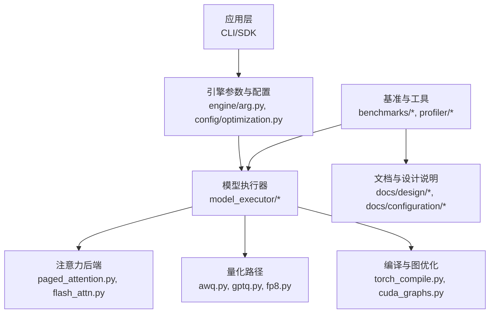
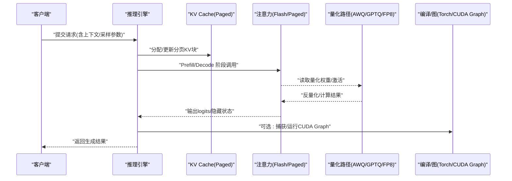
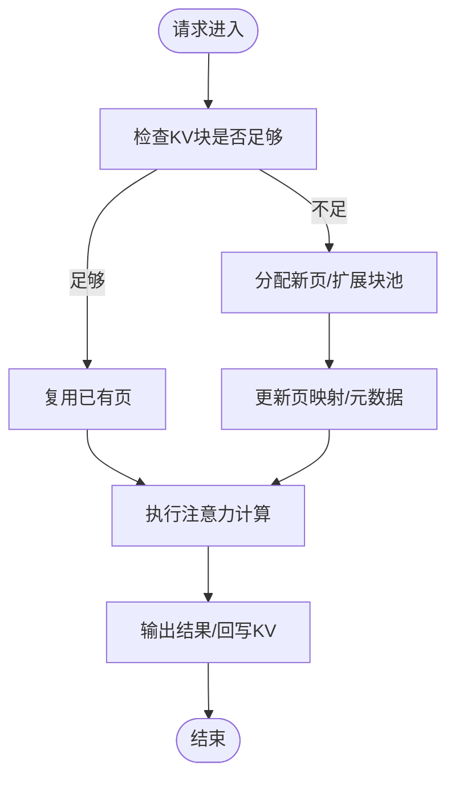
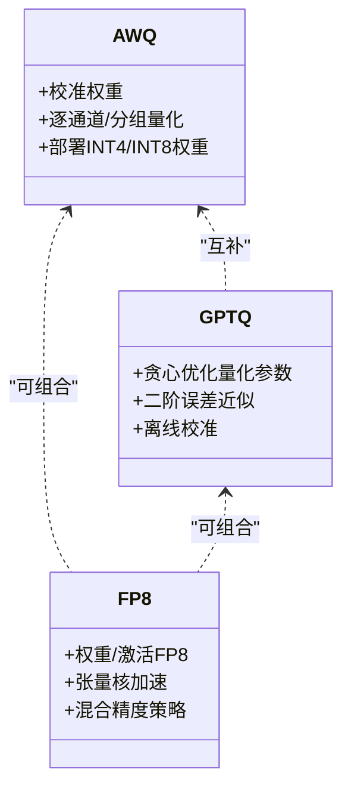
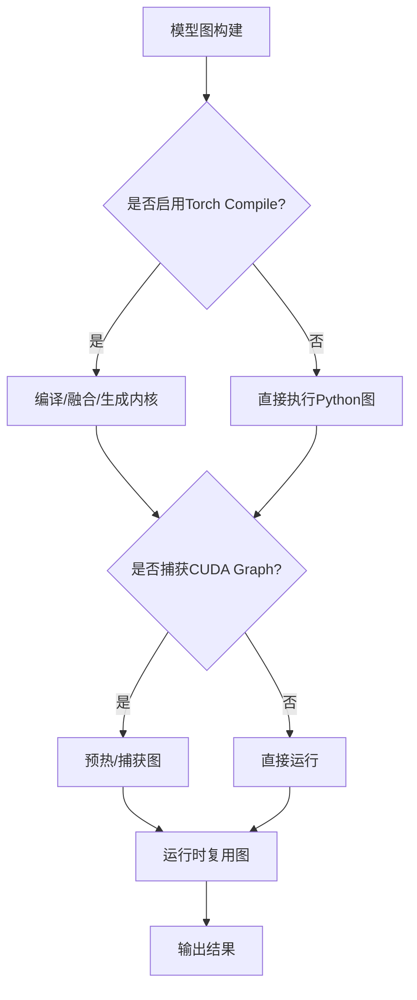
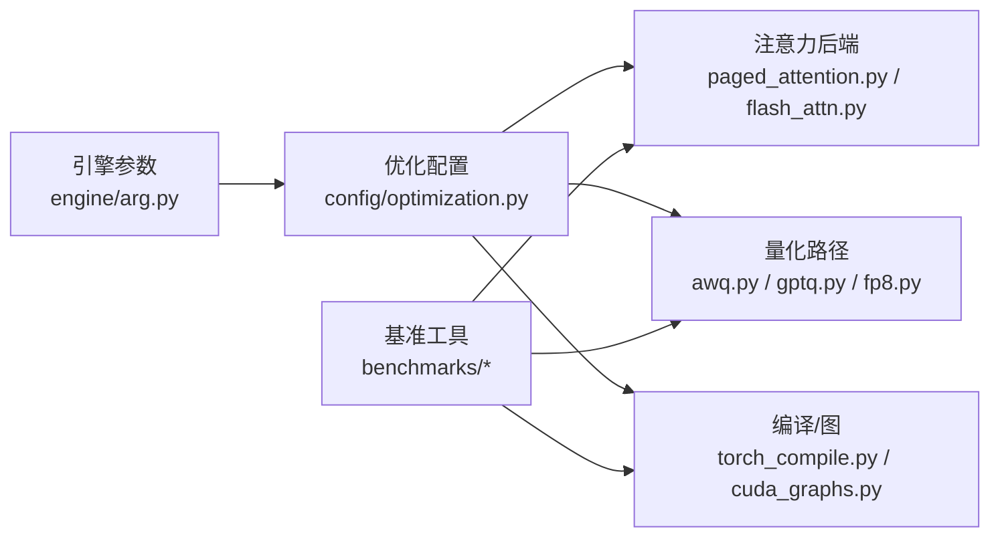

# 性能优化

<cite>
**本文引用的文件**   
- [README.md](file://README.md)
- [vllm/config/optimization.py](file://vllm/config/optimization.py)
- [vllm/engine/arg.py](file://vllm/engine/arg.py)
- [vllm/model_executor/attention/backends/paged_attention.py](file://vllm/model_executor/attention/backends/paged_attention.py)
- [vllm/model_executor/attention/backends/flash_attn.py](file://vllm/model_executor/attention/backends/flash_attn.py)
- [vllm/model_executor/quantization/awq.py](file://vllm/model_executor/quantization/awq.py)
- [vllm/model_executor/quantization/gptq.py](file://vllm/model_executor/quantization/gptq.py)
- [vllm/model_executor/quantization/fp8.py](file://vllm/model_executor/quantization/fp8.py)
- [vllm/compilation/torch_compile.py](file://vllm/compilation/torch_compile.py)
- [vllm/compilation/cuda_graphs.py](file://vllm/compilation/cuda_graphs.py)
- [benchmarks/benchmark_throughput.py](file://benchmarks/benchmark_throughput.py)
- [benchmarks/benchmark_latency.py](file://benchmarks/benchmark_latency.py)
- [benchmarks/benchmark_serving.py](file://benchmarks/benchmark_serving.py)
- [benchmarks/kernels/benchmark_paged_attention.py](file://benchmarks/kernels/benchmark_paged_attention.py)
- [benchmarks/kernels/benchmark_quant.py](file://benchmarks/kernels/benchmark_quant.py)
- [docs/design/paged_attention.md](file://docs/design/paged_attention.md)
- [docs/configuration/optimization.md](file://docs/configuration/optimization.md)
- [docs/design/cuda_graphs.md](file://docs/design/cuda_graphs.md)
- [docs/design/torch_compile.md](file://docs/design/torch_compile.md)
- [docs/benchmarking/cli.md](file://docs/benchmarking/cli.md)
- [docs/benchmarking/dashboard.md](file://docs/benchmarking/dashboard.md)
- [vllm/profiler/profiler.py](file://vllm/profiler/profiler.py)
- [vllm/utils.py](file://vllm/utils.py)
</cite>

## 目录
1. [简介](#简介)
2. [项目结构](#项目结构)
3. [核心组件](#核心组件)
4. [架构总览](#架构总览)
5. [详细组件分析](#详细组件分析)
6. [依赖关系分析](#依赖关系分析)
7. [性能考量](#性能考量)
8. [故障排查指南](#故障排查指南)
9. [结论](#结论)
10. [附录](#附录)

## 简介
本文件面向希望深入理解并调优 vLLM 推理性能的工程师与研究者，围绕以下主题展开：
- PagedAttention 的原理、实现要点与显存优化效果
- 量化方案（AWQ、GPTQ、FP8）的原理、配置与适用场景
- CUDA Graphs 与 Torch Compile 的启用方式与调参建议
- 批处理策略（动态/静态）对吞吐量的影响与权衡
- 基准测试方法与指标解读
- GPU 利用率监控、内存使用分析与瓶颈识别
- 不同硬件平台的优化建议与最佳实践

## 项目结构
vLLM 将性能相关能力分布在多个模块中：
- 注意力与 KV Cache：paged_attention 与 flash_attn 后端
- 量化：AWQ、GPTQ、FP8 等量化路径
- 编译与图优化：Torch Compile、CUDA Graphs
- 引擎参数与配置：engine args、优化开关
- 基准与工具：吞吐量/延迟/服务基准、内核级 benchmark、可视化与监控

**图表来源** 
- [vllm/engine/arg.py](file://vllm/engine/arg.py)
- [vllm/config/optimization.py](file://vllm/config/optimization.py)
- [vllm/model_executor/attention/backends/paged_attention.py](file://vllm/model_executor/attention/backends/paged_attention.py)
- [vllm/model_executor/attention/backends/flash_attn.py](file://vllm/model_executor/attention/backends/flash_attn.py)
- [vllm/model_executor/quantization/awq.py](file://vllm/model_executor/quantization/awq.py)
- [vllm/model_executor/quantization/gptq.py](file://vllm/model_executor/quantization/gptq.py)
- [vllm/model_executor/quantization/fp8.py](file://vllm/model_executor/quantization/fp8.py)
- [vllm/compilation/torch_compile.py](file://vllm/compilation/torch_compile.py)
- [vllm/compilation/cuda_graphs.py](file://vllm/compilation/cuda_graphs.py)
- [benchmarks/benchmark_throughput.py](file://benchmarks/benchmark_throughput.py)
- [benchmarks/benchmark_latency.py](file://benchmarks/benchmark_latency.py)
- [benchmarks/benchmark_serving.py](file://benchmarks/benchmark_serving.py)
- [vllm/profiler/profiler.py](file://vllm/profiler/profiler.py)
- [docs/design/paged_attention.md](file://docs/design/paged_attention.md)
- [docs/configuration/optimization.md](file://docs/configuration/optimization.md)
- [docs/design/cuda_graphs.md](file://docs/design/cuda_graphs.md)
- [docs/design/torch_compile.md](file://docs/design/torch_compile.md)
- [docs/benchmarking/cli.md](file://docs/benchmarking/cli.md)
- [docs/benchmarking/dashboard.md](file://docs/benchmarking/dashboard.md)

**章节来源**
- [README.md](file://README.md)

## 核心组件
- PagedAttention：以分页式 KV Cache 管理减少碎片、提升显存利用与批处理能力
- Flash Attention：高性能注意力内核，结合分块计算与寄存器复用
- 量化：AWQ/GPTQ/FP8 等降低权重或激活精度，提高吞吐、降低带宽压力
- 编译与图：Torch Compile 进行算子融合与代码生成；CUDA Graphs 降低调度开销
- 批处理：动态/静态批处理策略影响吞吐与时延，需按负载特性选择
- 基准与监控：提供端到端与内核级 benchmark，配合 Profiler 定位瓶颈

**章节来源**
- [docs/design/paged_attention.md](file://docs/design/paged_attention.md)
- [docs/configuration/optimization.md](file://docs/configuration/optimization.md)
- [docs/design/cuda_graphs.md](file://docs/design/cuda_graphs.md)
- [docs/design/torch_compile.md](file://docs/design/torch_compile.md)

## 架构总览
下图展示从请求进入、KV Cache 管理、注意力计算到量化与编译优化的整体数据流。

**图表来源** 
- [vllm/model_executor/attention/backends/paged_attention.py](file://vllm/model_executor/attention/backends/paged_attention.py)
- [vllm/model_executor/attention/backends/flash_attn.py](file://vllm/model_executor/attention/backends/flash_attn.py)
- [vllm/model_executor/quantization/awq.py](file://vllm/model_executor/quantization/awq.py)
- [vllm/model_executor/quantization/gptq.py](file://vllm/model_executor/quantization/gptq.py)
- [vllm/model_executor/quantization/fp8.py](file://vllm/model_executor/quantization/fp8.py)
- [vllm/compilation/torch_compile.py](file://vllm/compilation/torch_compile.py)
- [vllm/compilation/cuda_graphs.py](file://vllm/compilation/cuda_graphs.py)

## 详细组件分析

### PagedAttention 原理与显存优化
- 设计动机：传统连续 KV 缓存易产生碎片，导致无法有效重用显存；PagedAttention 借鉴操作系统分页思想，将 KV 切分为固定大小页，按需分配与回收
- 关键收益：
  - 显著降低显存碎片，提升可容纳序列数与批大小
  - 支持前缀共享与增量更新，利于多轮对话与长上下文
  - 与 Flash Attention 结合，在 Prefill/Decode 阶段均能获得更高吞吐
- 实现要点：
  - 分页块大小、最大块数、块池管理等参数直接影响命中率与内存占用
  - 与 KV Cache Manager 协同，实现动态扩容与回收
  - 注意与不同注意力后端（如 Flash Attention）的兼容性

**图表来源** 
- [vllm/model_executor/attention/backends/paged_attention.py](file://vllm/model_executor/attention/backends/paged_attention.py)
- [docs/design/paged_attention.md](file://docs/design/paged_attention.md)

**章节来源**
- [docs/design/paged_attention.md](file://docs/design/paged_attention.md)
- [vllm/model_executor/attention/backends/paged_attention.py](file://vllm/model_executor/attention/backends/paged_attention.py)

### Flash Attention 后端
- 优势：通过分块计算、寄存器复用与访存优化，显著提升注意力计算效率
- 适用场景：长序列、大模型、高并发推理
- 注意事项：需要合适的硬件与库版本支持；与 PagedAttention 组合时需注意块对齐与内存布局

**章节来源**
- [vllm/model_executor/attention/backends/flash_attn.py](file://vllm/model_executor/attention/backends/flash_attn.py)

### 量化方法：AWQ、GPTQ、FP8
- AWQ（Activation-aware Weight Quantization）
  - 原理：基于激活分布感知对权重进行逐通道/分组量化，保留重要通道信息
  - 优点：部署简单、兼容性好，适合 INT4/INT8 权重
  - 缺点：对某些模型精度敏感，需校准集
- GPTQ（Greedy Post-Training Quantization）
  - 原理：贪心近似求解最优量化参数，考虑二阶误差
  - 优点：精度高，适合低比特权重（如 INT4）
  - 缺点：离线校准耗时较长，需要额外工具链
- FP8（8位浮点）
  - 原理：使用 8 位浮点表示权重/激活，充分利用现代 GPU 的 FP8 张量核
  - 优点：硬件加速友好，吞吐提升明显
  - 缺点：数值范围与溢出控制需谨慎，部分模型需混合精度策略

**图表来源** 
- [vllm/model_executor/quantization/awq.py](file://vllm/model_executor/quantization/awq.py)
- [vllm/model_executor/quantization/gptq.py](file://vllm/model_executor/quantization/gptq.py)
- [vllm/model_executor/quantization/fp8.py](file://vllm/model_executor/quantization/fp8.py)

**章节来源**
- [vllm/model_executor/quantization/awq.py](file://vllm/model_executor/quantization/awq.py)
- [vllm/model_executor/quantization/gptq.py](file://vllm/model_executor/quantization/gptq.py)
- [vllm/model_executor/quantization/fp8.py](file://vllm/model_executor/quantization/fp8.py)

### CUDA Graphs 与 Torch Compile 优化
- CUDA Graphs
  - 作用：捕获一次执行图，减少 Python/C++ 调用与内核启动开销
  - 适用：稳定形状与重复模式高的推理路径（如 Decode 阶段）
  - 配置：需设置合适的预热批次、形状范围与内存限制
- Torch Compile
  - 作用：AOT/Eager 编译，自动融合算子、生成高效内核
  - 适用：复杂图、多算子链路；可与 CUDA Graphs 叠加
  - 配置：选择合适后端（Inductor/Triton）、级别与缓存策略

**图表来源** 
- [vllm/compilation/torch_compile.py](file://vllm/compilation/torch_compile.py)
- [vllm/compilation/cuda_graphs.py](file://vllm/compilation/cuda_graphs.py)
- [docs/design/torch_compile.md](file://docs/design/torch_compile.md)
- [docs/design/cuda_graphs.md](file://docs/design/cuda_graphs.md)

**章节来源**
- [vllm/compilation/torch_compile.py](file://vllm/compilation/torch_compile.py)
- [vllm/compilation/cuda_graphs.py](file://vllm/compilation/cuda_graphs.py)
- [docs/design/torch_compile.md](file://docs/design/torch_compile.md)
- [docs/design/cuda_graphs.md](file://docs/design/cuda_graphs.md)

### 批处理策略：动态 vs 静态
- 动态批处理
  - 特点：根据到达请求实时聚合，最大化 GPU 利用率
  - 优势：吞吐高、资源利用灵活
  - 风险：时延抖动，需合理设置超时与队列策略
- 静态批处理
  - 特点：固定批大小，简化调度与内存管理
  - 优势：时延稳定、易于预测
  - 风险：空闲时资源浪费，吞吐可能受限
- 选择建议：
  - 高并发、短请求：优先动态批处理
  - 低延迟要求、稳定负载：静态批处理更稳妥
  - 可结合两者：粗粒度静态+细粒度动态

**章节来源**
- [vllm/engine/arg.py](file://vllm/engine/arg.py)
- [vllm/config/optimization.py](file://vllm/config/optimization.py)

## 依赖关系分析
- 注意力后端依赖 KV Cache 管理与分页策略
- 量化路径依赖权重加载与反量化内核
- 编译与图优化依赖模型图结构与形状稳定性
- 基准工具依赖上述组件以评估真实吞吐与时延

**图表来源** 
- [vllm/engine/arg.py](file://vllm/engine/arg.py)
- [vllm/config/optimization.py](file://vllm/config/optimization.py)
- [vllm/model_executor/attention/backends/paged_attention.py](file://vllm/model_executor/attention/backends/paged_attention.py)
- [vllm/model_executor/attention/backends/flash_attn.py](file://vllm/model_executor/attention/backends/flash_attn.py)
- [vllm/model_executor/quantization/awq.py](file://vllm/model_executor/quantization/awq.py)
- [vllm/model_executor/quantization/gptq.py](file://vllm/model_executor/quantization/gptq.py)
- [vllm/model_executor/quantization/fp8.py](file://vllm/model_executor/quantization/fp8.py)
- [vllm/compilation/torch_compile.py](file://vllm/compilation/torch_compile.py)
- [vllm/compilation/cuda_graphs.py](file://vllm/compilation/cuda_graphs.py)
- [benchmarks/benchmark_throughput.py](file://benchmarks/benchmark_throughput.py)
- [benchmarks/benchmark_latency.py](file://benchmarks/benchmark_latency.py)
- [benchmarks/benchmark_serving.py](file://benchmarks/benchmark_serving.py)

**章节来源**
- [vllm/engine/arg.py](file://vllm/engine/arg.py)
- [vllm/config/optimization.py](file://vllm/config/optimization.py)

## 性能考量
- 显存与 KV Cache
  - 调整分页块大小与最大块数以平衡命中率与碎片
  - 关注长上下文与前缀共享带来的内存增长
- 量化与精度
  - 选择合适的量化方案与校准策略，避免精度下降过大
  - FP8 需关注数值范围与溢出，必要时采用混合精度
- 编译与图
  - 预热与形状覆盖要充分，避免频繁重建图
  - 根据模型复杂度选择编译级别与后端
- 批处理与调度
  - 动态批处理的超时与队列长度需按负载调优
  - 静态批大小应匹配模型规模与显存容量
- 内核与硬件
  - 确保 Flash Attention、CUDA Graphs、Torch Compile 的硬件与驱动支持
  - 针对 AMD/Intel/XPU 等平台选择对应内核与优化路径

[本节为通用指导，不直接分析具体文件]

## 故障排查指南
- 常见问题
  - OOM：检查 KV Cache 上限、分页块大小、批大小与量化配置
  - 吞吐不稳定：观察批处理策略、CUDA Graph 捕获失败、编译缓存失效
  - 精度异常：核对量化校准集、FP8 范围设置、混合精度策略
- 监控与诊断
  - 使用 Profiler 采集 GPU 利用率、内存峰值、内核耗时
  - 借助基准脚本对比不同配置的吞吐与时延
  - 查看日志与指标面板定位热点与瓶颈

**章节来源**
- [vllm/profiler/profiler.py](file://vllm/profiler/profiler.py)
- [vllm/utils.py](file://vllm/utils.py)
- [docs/benchmarking/dashboard.md](file://docs/benchmarking/dashboard.md)

## 结论
vLLM 的性能优化围绕 PagedAttention、量化、编译与批处理四大支柱展开。通过合理的配置与调优，可在不同硬件与负载下获得更高的吞吐与更稳定的时延。建议以基准测试为依据，逐步验证各优化项的收益，并结合监控工具持续迭代。

[本节为总结性内容，不直接分析具体文件]

## 附录

### 基准测试方法与指标解读
- 端到端基准
  - 吞吐量：tokens/s、requests/s
  - 时延：首 token 时延、平均时延、尾延迟
  - 资源：GPU 利用率、显存峰值、CPU 占用
- 内核级基准
  - 注意力、量化、GEMM 等内核在不同形状下的性能
- 推荐流程
  - 先跑 baseline，再逐项开启优化（量化、编译、图），记录差异
  - 针对不同负载（短/长序列、突发/平稳）分别评估

**章节来源**
- [benchmarks/benchmark_throughput.py](file://benchmarks/benchmark_throughput.py)
- [benchmarks/benchmark_latency.py](file://benchmarks/benchmark_latency.py)
- [benchmarks/benchmark_serving.py](file://benchmarks/benchmark_serving.py)
- [benchmarks/kernels/benchmark_paged_attention.py](file://benchmarks/kernels/benchmark_paged_attention.py)
- [benchmarks/kernels/benchmark_quant.py](file://benchmarks/kernels/benchmark_quant.py)
- [docs/benchmarking/cli.md](file://docs/benchmarking/cli.md)

### 不同硬件平台的优化建议
- NVIDIA GPU
  - 优先启用 Flash Attention、CUDA Graphs、Torch Compile（Inductor）
  - 使用 FP8 张量核与量化路径，关注驱动与 CUDA 版本
- AMD ROCm
  - 选择 RDNA3/WMI 内核路径，确认 ROCm 版本与依赖
  - 量化与注意力内核需验证兼容性
- Intel/XPU
  - 使用对应平台内核与编译器，关注内存带宽与缓存策略
  - 量化与编译选项需按平台特性调优

**章节来源**
- [docs/configuration/optimization.md](file://docs/configuration/optimization.md)
- [docs/design/cuda_graphs.md](file://docs/design/cuda_graphs.md)
- [docs/design/torch_compile.md](file://docs/design/torch_compile.md)