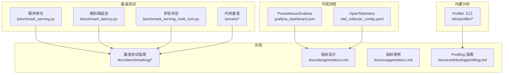
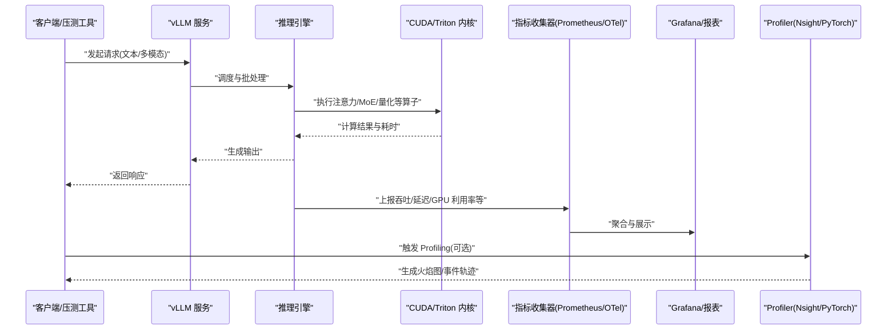
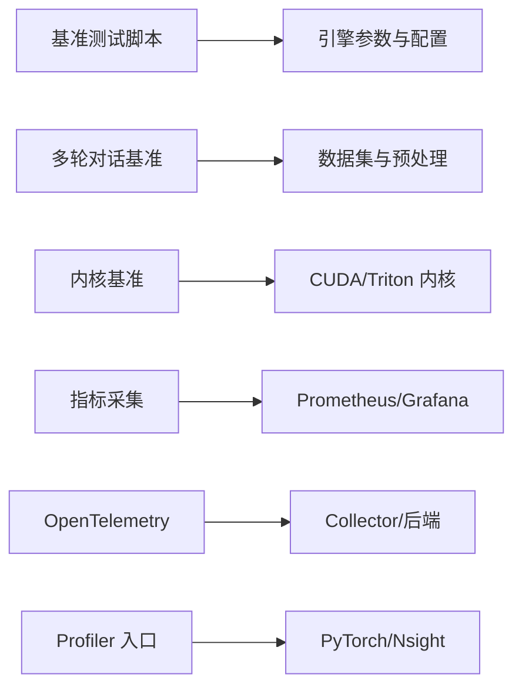

# 性能监控和分析

<cite>
**本文引用的文件**   
- [benchmarks/README.md](file://benchmarks/README.md)
- [benchmarks/benchmark_serving.py](file://benchmarks/benchmark_serving.py)
- [benchmarks/benchmark_throughput.py](file://benchmarks/benchmark_throughput.py)
- [benchmarks/benchmark_latency.py](file://benchmarks/benchmark_latency.py)
- [benchmarks/multi_turn/benchmark_serving_multi_turn.py](file://benchmarks/multi_turn/benchmark_serving_multi_turn.py)
- [benchmarks/kernels/benchmark_paged_attention.py](file://benchmarks/kernels/benchmark_paged_attention.py)
- [benchmarks/kernels/benchmark_moe.py](file://benchmarks/kernels/benchmark_moe.py)
- [vllm/profiler/__init__.py](file://vllm/profiler/__init__.py)
- [vllm/profiler/profiler.py](file://vllm/profiler/profiler.py)
- [examples/observability/prometheus_grafana/grafana_dashboard.json](file://examples/observability/prometheus_grafana/grafana_dashboard.json)
- [examples/observability/opentelemetry/otel_collector_config.yaml](file://examples/observability/opentelemetry/otel_collector_config.yaml)
- [docs/benchmarking/README.md](file://docs/benchmarking/README.md)
- [docs/benchmarking/cli.md](file://docs/benchmarking/cli.md)
- [docs/benchmarking/dashboard.md](file://docs/benchmarking/dashboard.md)
- [docs/design/metrics.md](file://docs/design/metrics.md)
- [docs/usage/metrics.md](file://docs/usage/metrics.md)
- [docs/contributing/profiling.md](file://docs/contributing/profiling.md)
- [scripts/benchmark_helion_kernels.py](file://scripts/benchmark_helion_kernels.py)
</cite>

## 目录
1. [简介](#简介)
2. [项目结构](#项目结构)
3. [核心组件](#核心组件)
4. [架构总览](#架构总览)
5. [详细组件分析](#详细组件分析)
6. [依赖关系分析](#依赖关系分析)
7. [性能注意事项](#性能注意事项)
8. [故障排查指南](#故障排查指南)
9. [结论](#结论)
10. [附录](#附录)

## 简介
本章节面向需要在生产与研发环境中对 vLLM 进行性能监控与分析的工程师，系统介绍 GPU 利用率监控、内存使用分析与计算瓶颈识别的方法；说明如何集成 Nsight Systems、PyTorch Profiler 等工具；提供基准测试编写方法与指标解读；解释吞吐量、延迟、GPU 利用率等关键指标的含义与优化方向；并给出常见性能问题的诊断方法与生产环境监控最佳实践。

## 项目结构
vLLM 在仓库中提供了完善的基准测试与可观测性资源：
- benchmarks：覆盖服务吞吐、延迟、多轮对话、注意力与 MoE 等内核级基准
- examples/observability：包含 Prometheus/Grafana 仪表板与 OpenTelemetry 配置示例
- docs/benchmarking：基准测试文档（CLI、Dashboard、Sweeps）
- docs/design/metrics 与 docs/usage/metrics：指标设计与使用说明
- vllm/profiler：内置性能分析相关能力入口
- scripts：辅助脚本（如 Helion 内核基准）

图表来源
- [benchmarks/benchmark_serving.py](file://benchmarks/benchmark_serving.py)
- [benchmarks/benchmark_latency.py](file://benchmarks/benchmark_latency.py)
- [benchmarks/multi_turn/benchmark_serving_multi_turn.py](file://benchmarks/multi_turn/benchmark_serving_multi_turn.py)
- [benchmarks/kernels/benchmark_paged_attention.py](file://benchmarks/kernels/benchmark_paged_attention.py)
- [examples/observability/prometheus_grafana/grafana_dashboard.json](file://examples/observability/prometheus_grafana/grafana_dashboard.json)
- [examples/observability/opentelemetry/otel_collector_config.yaml](file://examples/observability/opentelemetry/otel_collector_config.yaml)
- [docs/benchmarking/README.md](file://docs/benchmarking/README.md)
- [docs/design/metrics.md](file://docs/design/metrics.md)
- [docs/usage/metrics.md](file://docs/usage/metrics.md)
- [docs/contributing/profiling.md](file://docs/contributing/profiling.md)
- [vllm/profiler/__init__.py](file://vllm/profiler/__init__.py)

章节来源
- [benchmarks/README.md](file://benchmarks/README.md)
- [docs/benchmarking/README.md](file://docs/benchmarking/README.md)

## 核心组件
- 基准测试套件
  - 服务吞吐与延迟：用于评估端到端 QPS、TTFT、TPOT、P95/P99 延迟等
  - 多轮对话基准：模拟真实交互场景下的吞吐与延迟
  - 内核级基准：针对注意力、MoE、量化等算子进行细粒度性能测量
- 可观测性与监控
  - Prometheus/Grafana 仪表板：可视化关键指标
  - OpenTelemetry：标准化遥测数据导出与采集
- 内置 Profiler
  - 统一入口与配置，便于接入 PyTorch Profiler/Nsight 等后端

章节来源
- [benchmarks/benchmark_serving.py](file://benchmarks/benchmark_serving.py)
- [benchmarks/benchmark_latency.py](file://benchmarks/benchmark_latency.py)
- [benchmarks/multi_turn/benchmark_serving_multi_turn.py](file://benchmarks/multi_turn/benchmark_serving_multi_turn.py)
- [benchmarks/kernels/benchmark_paged_attention.py](file://benchmarks/kernels/benchmark_paged_attention.py)
- [benchmarks/kernels/benchmark_moe.py](file://benchmarks/kernels/benchmark_moe.py)
- [examples/observability/prometheus_grafana/grafana_dashboard.json](file://examples/observability/prometheus_grafana/grafana_dashboard.json)
- [examples/observability/opentelemetry/otel_collector_config.yaml](file://examples/observability/opentelemetry/otel_collector_config.yaml)
- [vllm/profiler/__init__.py](file://vllm/profiler/__init__.py)

## 架构总览
下图展示了从请求进入服务到指标上报与可视化的整体流程，以及基准测试与 Profiling 工具的集成点。

图表来源
- [benchmarks/benchmark_serving.py](file://benchmarks/benchmark_serving.py)
- [benchmarks/benchmark_latency.py](file://benchmarks/benchmark_latency.py)
- [examples/observability/prometheus_grafana/grafana_dashboard.json](file://examples/observability/prometheus_grafana/grafana_dashboard.json)
- [examples/observability/opentelemetry/otel_collector_config.yaml](file://examples/observability/opentelemetry/otel_collector_config.yaml)
- [docs/design/metrics.md](file://docs/design/metrics.md)

## 详细组件分析

### 服务吞吐与延迟基准
- 目标：评估不同负载下的吞吐（tokens/s、requests/s）与延迟分布（TTFT、TPOT、P95/P99）
- 典型用法：通过 CLI 或 Python API 指定模型、并发、输入长度、采样参数等，运行后输出统计报告
- 关键指标：
  - 吞吐：每秒 token 数、每秒请求数
  - 延迟：首 token 时间(TTFT)、每 token 时间(TPOT)、分位延迟
  - 资源：GPU 利用率、显存占用、CPU 占用、I/O 等待
- 优化方向：
  - 增大 batch size 与上下文长度以更好利用并行度
  - 调整 KV Cache 策略与分页注意力实现
  - 启用 CUDA Graph、编译优化与算子融合

章节来源
- [benchmarks/benchmark_serving.py](file://benchmarks/benchmark_serving.py)
- [benchmarks/benchmark_latency.py](file://benchmarks/benchmark_latency.py)
- [docs/benchmarking/cli.md](file://docs/benchmarking/cli.md)

### 多轮对话基准
- 目标：模拟真实用户多轮交互，评估长会话下的吞吐与延迟稳定性
- 特点：考虑历史上下文累积、KV Cache 命中与回收、请求优先级
- 关键指标：会话级吞吐、平均/分位延迟、缓存命中率、显存峰值
- 优化方向：
  - 前缀缓存与 KV 压缩
  - 动态批处理与请求合并
  - 合理的超时与限流策略

章节来源
- [benchmarks/multi_turn/benchmark_serving_multi_turn.py](file://benchmarks/multi_turn/benchmark_serving_multi_turn.py)
- [docs/benchmarking/README.md](file://docs/benchmarking/README.md)

### 内核级基准（注意力、MoE、量化等）
- 目标：定位具体算子的性能瓶颈，验证 kernel 选择与参数调优效果
- 典型用例：
  - 分页注意力（Paged Attention）在不同形状下的吞吐与时延
  - MoE 路由与专家计算的效率
  - 量化算子（FP8/W8A8 等）的加速比
- 关键指标：FLOPs 利用率、带宽利用率、kernel 耗时占比
- 优化方向：
  - 选择合适的 attention backend
  - 调整 block size、tile size、并行度
  - 使用 CUTLASS/Triton 定制 kernel

章节来源
- [benchmarks/kernels/benchmark_paged_attention.py](file://benchmarks/kernels/benchmark_paged_attention.py)
- [benchmarks/kernels/benchmark_moe.py](file://benchmarks/kernels/benchmark_moe.py)
- [scripts/benchmark_helion_kernels.py](file://scripts/benchmark_helion_kernels.py)

### 可观测性与监控（Prometheus/Grafana、OpenTelemetry）
- 指标体系：涵盖请求级与服务级指标（吞吐、延迟、错误率、资源使用）
- 采集方式：
  - Prometheus 直接抓取暴露的 metrics 端点
  - OpenTelemetry Collector 统一采集与转发
- 可视化：Grafana 仪表板提供预置面板，快速定位异常
- 最佳实践：
  - 合理设置 scrape 间隔与保留策略
  - 为关键路径添加自定义指标
  - 结合日志与追踪进行根因分析

章节来源
- [examples/observability/prometheus_grafana/grafana_dashboard.json](file://examples/observability/prometheus_grafana/grafana_dashboard.json)
- [examples/observability/opentelemetry/otel_collector_config.yaml](file://examples/observability/opentelemetry/otel_collector_config.yaml)
- [docs/design/metrics.md](file://docs/design/metrics.md)
- [docs/usage/metrics.md](file://docs/usage/metrics.md)

### 内置 Profiler 与外部工具集成（Nsight Systems、PyTorch Profiler）
- 内置入口：vllm/profiler 提供统一配置与开关，便于按需开启
- PyTorch Profiler：
  - 记录 CPU/GPU 操作、内存分配、CUDA 事件
  - 输出火焰图与事件表，定位热点函数与同步点
- Nsight Systems：
  - 系统级时序视图，观察进程、线程、GPU 核、PCIe/NVLink 活动
  - 适合端到端瓶颈定位（I/O、通信、计算）
- 使用建议：
  - 先以低开销模式采集，再聚焦热点片段精细化分析
  - 结合指标与日志交叉验证问题假设
  - 将 Profiling 纳入 CI 与回归测试，防止性能退化

章节来源
- [vllm/profiler/__init__.py](file://vllm/profiler/__init__.py)
- [docs/contributing/profiling.md](file://docs/contributing/profiling.md)

## 依赖关系分析
- 基准测试与文档：
  - benchmark_serving/latency 依赖 CLI 与引擎参数解析
  - 多轮对话基准依赖数据集与预处理工具
  - 内核基准依赖底层 CUDA/Triton 实现
- 可观测性：
  - Prometheus/Grafana 依赖指标暴露与抓取配置
  - OpenTelemetry 依赖 Collector 与后端存储
- Profiler：
  - 内置 profiler 作为统一入口，对接 PyTorch/Nsight 等后端

图表来源
- [benchmarks/benchmark_serving.py](file://benchmarks/benchmark_serving.py)
- [benchmarks/multi_turn/benchmark_serving_multi_turn.py](file://benchmarks/multi_turn/benchmark_serving_multi_turn.py)
- [benchmarks/kernels/benchmark_paged_attention.py](file://benchmarks/kernels/benchmark_paged_attention.py)
- [examples/observability/prometheus_grafana/grafana_dashboard.json](file://examples/observability/prometheus_grafana/grafana_dashboard.json)
- [examples/observability/opentelemetry/otel_collector_config.yaml](file://examples/observability/opentelemetry/otel_collector_config.yaml)
- [vllm/profiler/__init__.py](file://vllm/profiler/__init__.py)

## 性能注意事项
- GPU 利用率监控
  - 关注 SM 利用率、内存带宽利用率、内核排队时长
  - 低利用率常由批大小过小、I/O 阻塞、频繁同步引起
- 内存使用分析
  - 跟踪显存峰值与碎片，避免 OOM
  - 检查 KV Cache 增长与回收策略是否合理
- 计算瓶颈识别
  - 使用火焰图定位热点函数与调用栈
  - 区分计算密集与访存密集路径，针对性优化
- 吞吐与延迟权衡
  - 增大批大小提升吞吐但可能增加延迟
  - 合理设置超时、重试与降级策略
- 生产监控最佳实践
  - 建立基线与阈值告警
  - 持续回归测试与性能门禁
  - 结合业务 SLA 定义 SLO 与容量规划

[本节为通用指导，不直接分析具体文件]

## 故障排查指南
- 常见问题与定位步骤
  - 吞吐下降：检查批大小、队列长度、GC 停顿、I/O 等待
  - 延迟升高：查看 TTFT/TPOT 分布，定位首 token 生成与解码阶段瓶颈
  - GPU 利用率低：确认内核选择、CUDA Graph、算子融合是否生效
  - 显存不足：分析 KV Cache 大小、模型权重加载、临时张量分配
- 工具链配合
  - 先用指标缩小范围，再用 Profiler 深入热点
  - 结合日志与追踪，复现场景并验证修复
- 回归与验证
  - 使用基准套件对比优化前后指标
  - 在 CI 中自动化执行，确保无性能退化

章节来源
- [docs/benchmarking/README.md](file://docs/benchmarking/README.md)
- [docs/contributing/profiling.md](file://docs/contributing/profiling.md)

## 结论
vLLM 提供了从内核到服务的完整性能监控与分析能力。通过基准测试、可观测性工具与 Profiler 的组合，可以系统化地识别瓶颈、验证优化效果并保障生产稳定性。建议在生产环境中建立持续的监控与回归机制，结合业务 SLA 制定容量与优化策略。

[本节为总结性内容，不直接分析具体文件]

## 附录
- 常用命令与参考
  - 服务吞吐与延迟基准：参见 CLI 文档与示例脚本
  - 多轮对话基准：参考多轮场景配置与数据集准备
  - 内核基准：针对不同算子形状与参数进行扫描
  - 指标与仪表板：导入 Grafana 面板，配置 Prometheus/OTel
  - Profiling：按指南开启 PyTorch/Nsight 采集

章节来源
- [docs/benchmarking/cli.md](file://docs/benchmarking/cli.md)
- [docs/benchmarking/dashboard.md](file://docs/benchmarking/dashboard.md)
- [docs/design/metrics.md](file://docs/design/metrics.md)
- [docs/usage/metrics.md](file://docs/usage/metrics.md)
- [docs/contributing/profiling.md](file://docs/contributing/profiling.md)