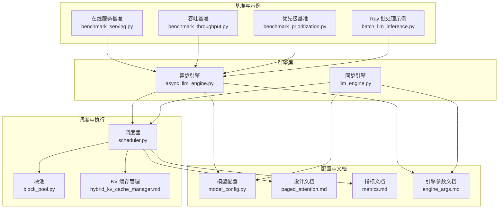
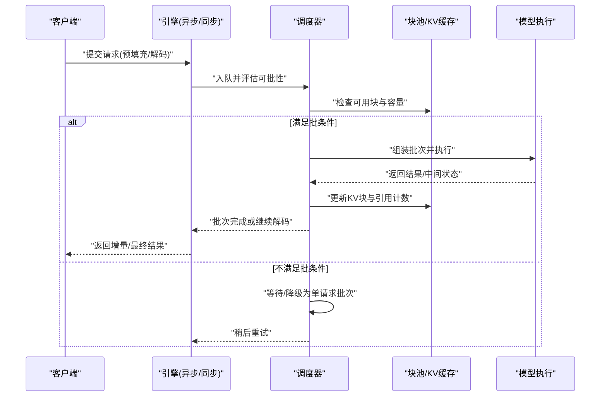
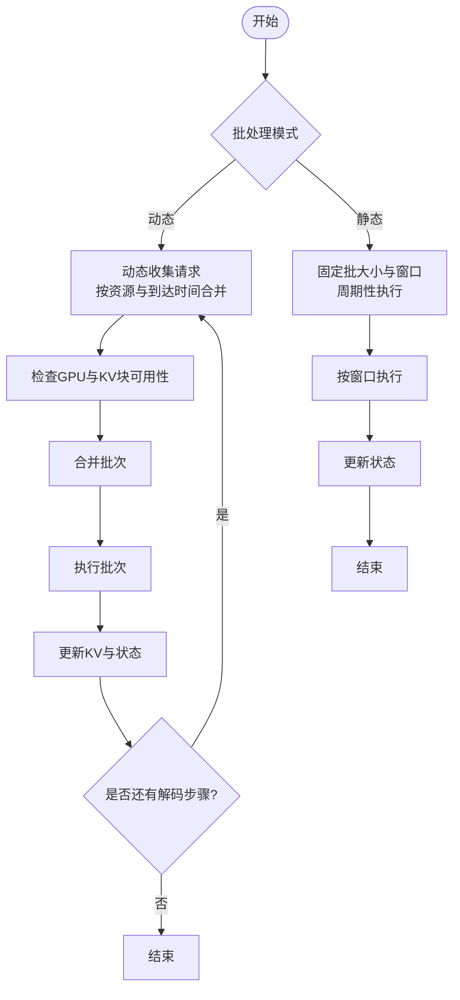
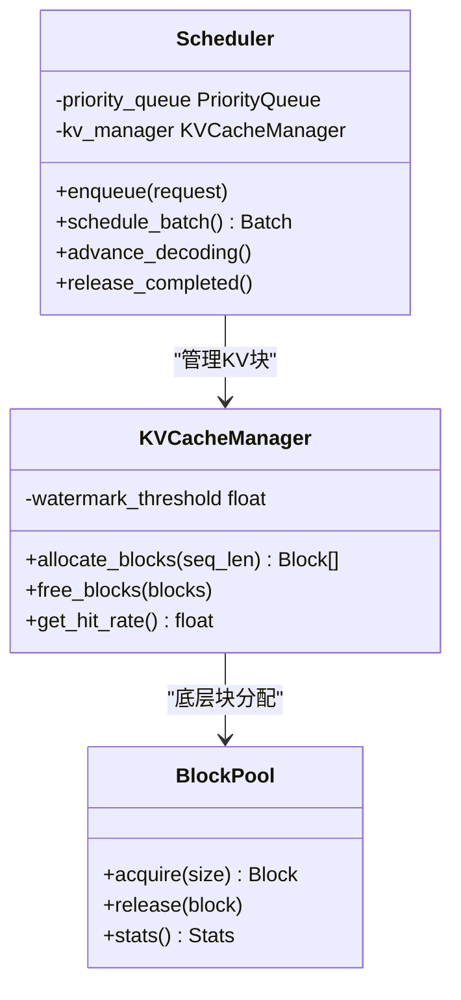
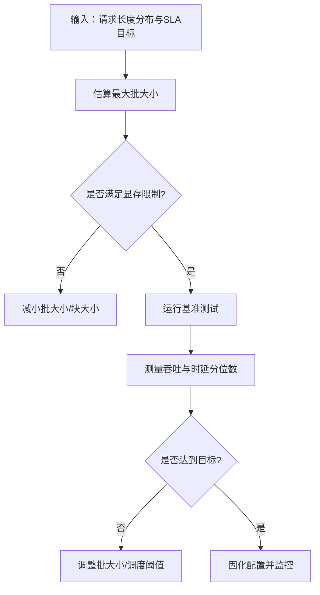
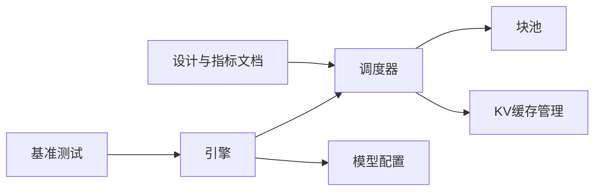

# 批处理优化

<cite>
**本文引用的文件**   
- [vllm/engine/async_llm_engine.py](file://vllm/engine/async_llm_engine.py)
- [vllm/engine/llm_engine.py](file://vllm/engine/llm_engine.py)
- [vllm/core/block_pool.py](file://vllm/core/block_pool.py)
- [vllm/core/scheduler.py](file://vllm/core/scheduler.py)
- [vllm/config/model_config.py](file://vllm/config/model_config.py)
- [benchmarks/benchmark_serving.py](file://benchmarks/benchmark_serving.py)
- [benchmarks/benchmark_throughput.py](file://benchmarks/benchmark_throughput.py)
- [benchmarks/benchmark_prioritization.py](file://benchmarks/benchmark_prioritization.py)
- [docs/design/paged_attention.md](file://docs/design/paged_attention.md)
- [docs/design/hybrid_kv_cache_manager.md](file://docs/design/hybrid_kv_cache_manager.md)
- [docs/design/metrics.md](file://docs/design/metrics.md)
- [docs/configuration/engine_args.md](file://docs/configuration/engine_args.md)
- [examples/ray_serving/batch_llm_inference.py](file://examples/ray_serving/batch_llm_inference.py)
</cite>

## 目录
1. [简介](#简介)
2. [项目结构](#项目结构)
3. [核心组件](#核心组件)
4. [架构总览](#架构总览)
5. [详细组件分析](#详细组件分析)
6. [依赖关系分析](#依赖关系分析)
7. [性能考量](#性能考量)
8. [故障排查指南](#故障排查指南)
9. [结论](#结论)
10. [附录](#附录)

## 简介
本文件聚焦 vLLM 的批处理策略与调度优化，系统阐述动态批处理与静态批处理的实现原理、性能差异与适用场景；解析请求调度算法、优先级管理与资源分配策略；给出批大小调优对吞吐量和延迟的影响规律，并提供不同工作负载下的配置建议与性能分析方法。文档同时覆盖关键监控指标与诊断手段，帮助读者在生产环境中稳定获得高吞吐、低延迟的推理服务。

## 项目结构
围绕批处理与调度，vLLM 的核心代码分布在引擎层、调度器、块池与 KV 缓存管理、以及基准测试与文档中：
- 引擎层负责对外接口、请求生命周期与调度触发
- 调度器决定何时将请求加入批次、如何拆分批次、如何推进解码
- 块池与 KV 缓存管理器提供内存布局与复用机制，直接影响批大小上限与碎片率
- 基准测试与文档提供了参数说明、指标定义与调优实践

图表来源 
- [vllm/engine/async_llm_engine.py](file://vllm/engine/async_llm_engine.py)
- [vllm/engine/llm_engine.py](file://vllm/engine/llm_engine.py)
- [vllm/core/scheduler.py](file://vllm/core/scheduler.py)
- [vllm/core/block_pool.py](file://vllm/core/block_pool.py)
- [docs/design/hybrid_kv_cache_manager.md](file://docs/design/hybrid_kv_cache_manager.md)
- [docs/design/paged_attention.md](file://docs/design/paged_attention.md)
- [docs/design/metrics.md](file://docs/design/metrics.md)
- [docs/configuration/engine_args.md](file://docs/configuration/engine_args.md)
- [benchmarks/benchmark_serving.py](file://benchmarks/benchmark_serving.py)
- [benchmarks/benchmark_throughput.py](file://benchmarks/benchmark_throughput.py)
- [benchmarks/benchmark_prioritization.py](file://benchmarks/benchmark_prioritization.py)
- [examples/ray_serving/batch_llm_inference.py](file://examples/ray_serving/batch_llm_inference.py)

章节来源
- [vllm/engine/async_llm_engine.py](file://vllm/engine/async_llm_engine.py)
- [vllm/engine/llm_engine.py](file://vllm/engine/llm_engine.py)
- [vllm/core/scheduler.py](file://vllm/core/scheduler.py)
- [vllm/core/block_pool.py](file://vllm/core/block_pool.py)
- [docs/design/paged_attention.md](file://docs/design/paged_attention.md)
- [docs/design/hybrid_kv_cache_manager.md](file://docs/design/hybrid_kv_cache_manager.md)
- [docs/design/metrics.md](file://docs/design/metrics.md)
- [docs/configuration/engine_args.md](file://docs/configuration/engine_args.md)
- [benchmarks/benchmark_serving.py](file://benchmarks/benchmark_serving.py)
- [benchmarks/benchmark_throughput.py](file://benchmarks/benchmark_throughput.py)
- [benchmarks/benchmark_prioritization.py](file://benchmarks/benchmark_prioritization.py)
- [examples/ray_serving/batch_llm_inference.py](file://examples/ray_serving/batch_llm_inference.py)

## 核心组件
- 引擎（同步/异步）：封装用户 API，维护请求队列、生命周期与调度触发点。异步引擎支持流式输出与并发控制，同步引擎适合离线批量任务。
- 调度器：实现动态/静态批处理策略、请求优先级、批次合并与拆分、解码步进与完成检测。
- 块池与 KV 缓存：基于分页注意力与块级分配，降低内存碎片，提升批大小上限与复用率。
- 配置与参数：模型相关参数（上下文长度、注意力后端等）、引擎参数（最大批大小、预填充/解码步长、KV 缓存阈值等）。
- 基准与指标：吞吐、时延、排队等待、KV 命中率、显存水位等指标用于定位瓶颈与验证调优效果。

章节来源
- [vllm/engine/async_llm_engine.py](file://vllm/engine/async_llm_engine.py)
- [vllm/engine/llm_engine.py](file://vllm/engine/llm_engine.py)
- [vllm/core/scheduler.py](file://vllm/core/scheduler.py)
- [vllm/core/block_pool.py](file://vllm/core/block_pool.py)
- [vllm/config/model_config.py](file://vllm/config/model_config.py)
- [docs/design/paged_attention.md](file://docs/design/paged_attention.md)
- [docs/design/hybrid_kv_cache_manager.md](file://docs/design/hybrid_kv_cache_manager.md)
- [docs/design/metrics.md](file://docs/design/metrics.md)
- [docs/configuration/engine_args.md](file://docs/configuration/engine_args.md)

## 架构总览
下图展示了从请求进入引擎到调度、执行与返回的关键路径，并标注了批处理与 KV 缓存交互点。

图表来源 
- [vllm/engine/async_llm_engine.py](file://vllm/engine/async_llm_engine.py)
- [vllm/engine/llm_engine.py](file://vllm/engine/llm_engine.py)
- [vllm/core/scheduler.py](file://vllm/core/scheduler.py)
- [vllm/core/block_pool.py](file://vllm/core/block_pool.py)
- [docs/design/paged_attention.md](file://docs/design/paged_attention.md)

## 详细组件分析

### 动态批处理与静态批处理
- 动态批处理
  - 原理：在解码循环中持续收集到达的请求，按当前 GPU 利用率与 KV 块可用性动态合并批次，最大化并行度。
  - 优势：在高并发下吞吐更高，能平滑突发流量；对短请求友好。
  - 风险：可能引入额外等待时间，导致尾部延迟上升；需要精细的调度阈值控制。
- 静态批处理
  - 原理：预先确定批次大小与调度窗口，按固定节奏执行，减少调度开销与不确定性。
  - 优势：时延更稳定，适合离线批处理或确定性 SLA 场景。
  - 风险：吞吐受限于固定批大小，突发流量下易拥塞。

图表来源 
- [vllm/core/scheduler.py](file://vllm/core/scheduler.py)
- [vllm/core/block_pool.py](file://vllm/core/block_pool.py)
- [docs/design/paged_attention.md](file://docs/design/paged_attention.md)

章节来源
- [vllm/core/scheduler.py](file://vllm/core/scheduler.py)
- [vllm/core/block_pool.py](file://vllm/core/block_pool.py)
- [docs/design/paged_attention.md](file://docs/design/paged_attention.md)

### 请求调度算法、优先级与资源分配
- 调度算法
  - 预填充阶段：优先处理新请求，利用大矩阵乘法加速；根据上下文长度与注意力后端选择最优分块策略。
  - 解码阶段：逐 token 推进，结合 KV 缓存命中与块复用，尽量保持批次内序列长度一致以提升效率。
- 优先级管理
  - 常见维度：到达时间、截止时间、SLA 等级、请求类型（预填充/解码）、权重因子。
  - 策略：加权公平队列、抢占式调度（谨慎使用，避免抖动）、超时丢弃。
- 资源分配
  - KV 块分配：分页分配、引用计数、回收与压缩；通过水位线触发换出或扩容。
  - GPU 资源：批大小上限由显存、计算单元占用与通信开销共同决定。

图表来源 
- [vllm/core/scheduler.py](file://vllm/core/scheduler.py)
- [vllm/core/block_pool.py](file://vllm/core/block_pool.py)
- [docs/design/hybrid_kv_cache_manager.md](file://docs/design/hybrid_kv_cache_manager.md)

章节来源
- [vllm/core/scheduler.py](file://vllm/core/scheduler.py)
- [vllm/core/block_pool.py](file://vllm/core/block_pool.py)
- [docs/design/hybrid_kv_cache_manager.md](file://docs/design/hybrid_kv_cache_manager.md)

### 批大小调优对吞吐与延迟的影响
- 小批大小
  - 优点：首字延迟更低，响应更快。
  - 缺点：吞吐较低，设备利用率不足。
- 大批大小
  - 优点：吞吐更高，设备饱和。
  - 缺点：尾延迟升高，排队时间增加，可能引发 OOM。
- 调参要点
  - 观察 KV 命中率与显存水位，调整最大批大小与块大小。
  - 区分预填充与解码阶段的批大小，分别优化。
  - 结合请求长度分布，采用分层批处理或自适应批大小。

章节来源
- [benchmarks/benchmark_throughput.py](file://benchmarks/benchmark_throughput.py)
- [benchmarks/benchmark_serving.py](file://benchmarks/benchmark_serving.py)
- [docs/design/metrics.md](file://docs/design/metrics.md)

### 不同场景下的批处理配置建议
- 在线对话（低延迟优先）
  - 较小批大小，较短调度窗口，提高 KV 命中率，启用快速路径。
- 离线批处理（吞吐优先）
  - 较大批大小，较长调度窗口，允许更长排队时间，关注显存峰值。
- 混合负载（长短请求并存）
  - 分层批处理：短请求快速通道，长请求聚合通道；或使用优先级队列隔离。
- 多模态/超长上下文
  - 增大块大小与 KV 缓存阈值，注意注意力后端的选择与融合策略。

章节来源
- [docs/configuration/engine_args.md](file://docs/configuration/engine_args.md)
- [docs/design/paged_attention.md](file://docs/design/paged_attention.md)
- [examples/ray_serving/batch_llm_inference.py](file://examples/ray_serving/batch_llm_inference.py)

## 依赖关系分析
- 引擎依赖调度器进行批次构建与推进；调度器依赖块池与 KV 缓存管理器进行内存管理。
- 模型配置影响注意力后端、块大小与批大小上限。
- 基准测试与文档提供参数与指标参考，指导实际部署调优。

图表来源 
- [vllm/engine/async_llm_engine.py](file://vllm/engine/async_llm_engine.py)
- [vllm/engine/llm_engine.py](file://vllm/engine/llm_engine.py)
- [vllm/core/scheduler.py](file://vllm/core/scheduler.py)
- [vllm/core/block_pool.py](file://vllm/core/block_pool.py)
- [vllm/config/model_config.py](file://vllm/config/model_config.py)
- [benchmarks/benchmark_serving.py](file://benchmarks/benchmark_serving.py)
- [benchmarks/benchmark_throughput.py](file://benchmarks/benchmark_throughput.py)
- [docs/design/metrics.md](file://docs/design/metrics.md)

章节来源
- [vllm/engine/async_llm_engine.py](file://vllm/engine/async_llm_engine.py)
- [vllm/engine/llm_engine.py](file://vllm/engine/llm_engine.py)
- [vllm/core/scheduler.py](file://vllm/core/scheduler.py)
- [vllm/core/block_pool.py](file://vllm/core/block_pool.py)
- [vllm/config/model_config.py](file://vllm/config/model_config.py)
- [benchmarks/benchmark_serving.py](file://benchmarks/benchmark_serving.py)
- [benchmarks/benchmark_throughput.py](file://benchmarks/benchmark_throughput.py)
- [docs/design/metrics.md](file://docs/design/metrics.md)

## 性能考量
- 吞吐与延迟权衡
  - 通过基准测试扫描批大小与调度窗口，绘制吞吐-时延曲线，找到帕累托最优。
- KV 缓存命中率
  - 命中率越高，解码越快；可通过前缀缓存、共享上下文与块复用提升命中率。
- 设备利用率
  - 关注 GPU 利用率、内存带宽与通信开销；合理设置块大小与批大小。
- 稳定性与鲁棒性
  - 设置显存水位线与 OOM 保护；监控排队时间与丢弃率。

章节来源
- [benchmarks/benchmark_serving.py](file://benchmarks/benchmark_serving.py)
- [benchmarks/benchmark_throughput.py](file://benchmarks/benchmark_throughput.py)
- [docs/design/metrics.md](file://docs/design/metrics.md)

## 故障排查指南
- 常见问题
  - OOM：降低批大小、块大小或启用 KV 换出；检查注意力后端与融合策略。
  - 高延迟：缩短调度窗口、提高优先级权重；检查 KV 命中率与块分配碎片。
  - 吞吐下降：增大批大小、优化块大小；检查通信与内存带宽瓶颈。
- 诊断方法
  - 使用基准工具对比不同配置；采集指标（吞吐、时延分位数、KV 命中率、显存水位）。
  - 查看日志与事件，定位调度瓶颈与资源争用。

章节来源
- [benchmarks/benchmark_prioritization.py](file://benchmarks/benchmark_prioritization.py)
- [docs/design/metrics.md](file://docs/design/metrics.md)
- [docs/configuration/engine_args.md](file://docs/configuration/engine_args.md)

## 结论
vLLM 的批处理与调度体系以分页注意力与块级 KV 缓存为基础，通过动态/静态批处理策略、优先级管理与资源分配，实现在不同工作负载下的高吞吐与可控延迟。生产环境应结合基准测试与监控指标，持续迭代批大小、块大小与调度阈值，以获得最佳性价比。

## 附录
- 常用参数与指标参考
  - 引擎参数：最大批大小、调度窗口、KV 缓存阈值、注意力后端选择。
  - 指标：吞吐、时延分位数、KV 命中率、显存水位、排队等待时间。
- 实践建议
  - 先离线基准再上线压测；逐步放宽批大小并监控稳定性。
  - 针对长短请求混合场景，采用分层批处理与优先级队列。

章节来源
- [docs/configuration/engine_args.md](file://docs/configuration/engine_args.md)
- [docs/design/metrics.md](file://docs/design/metrics.md)
- [examples/ray_serving/batch_llm_inference.py](file://examples/ray_serving/batch_llm_inference.py)