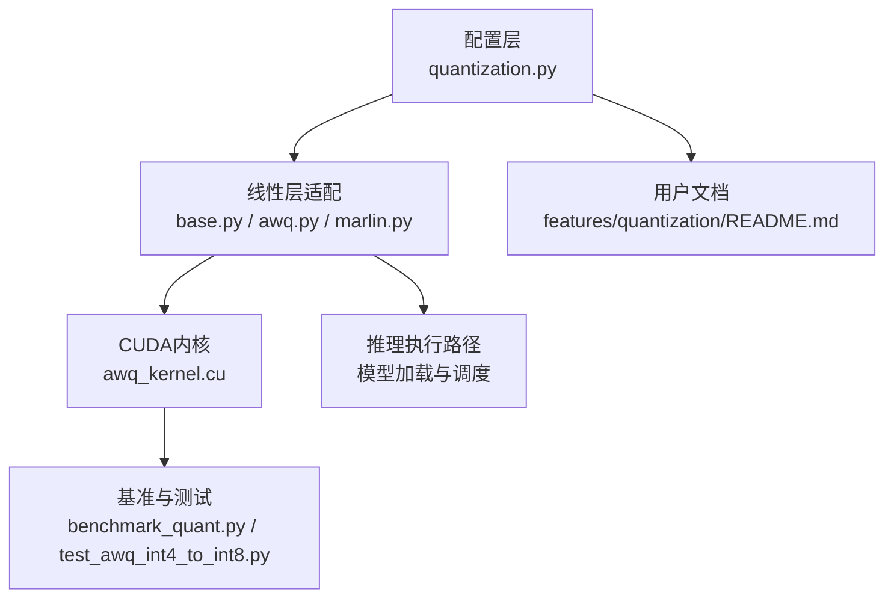
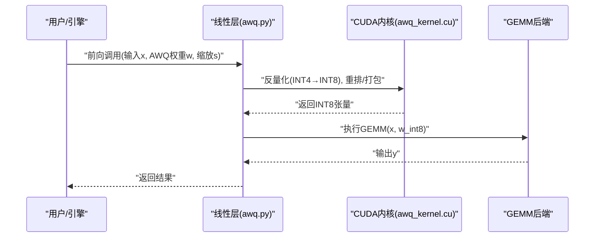
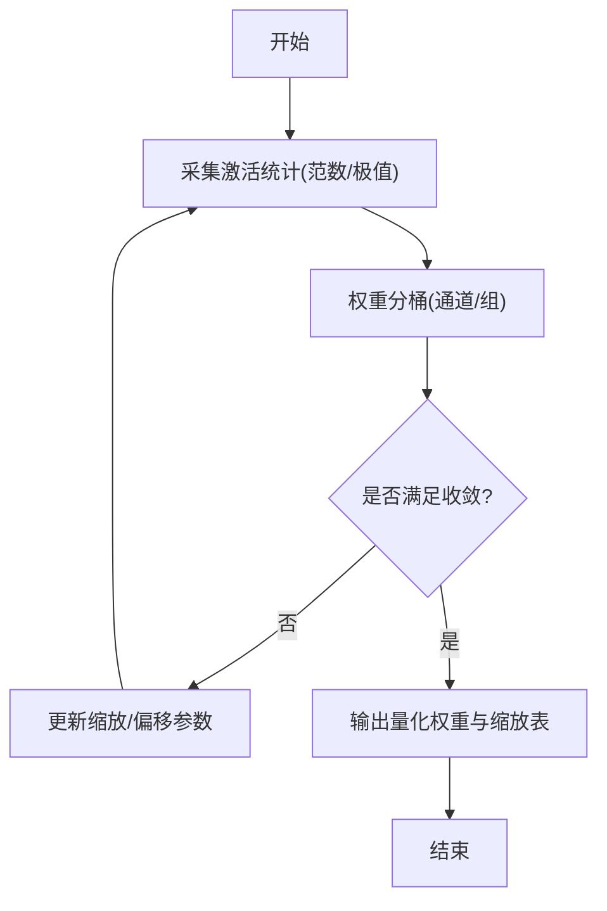
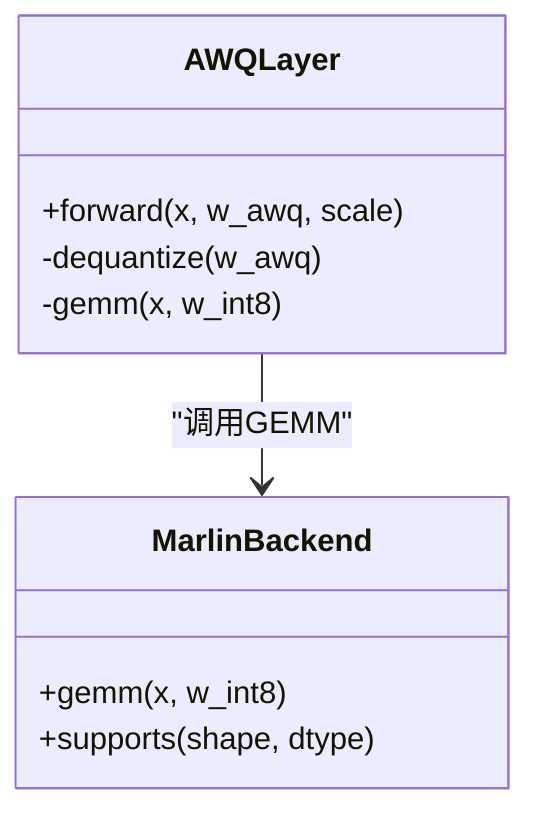
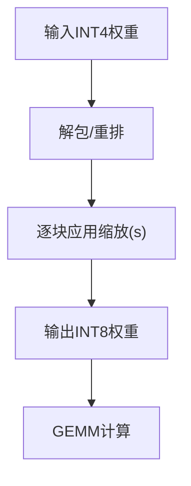
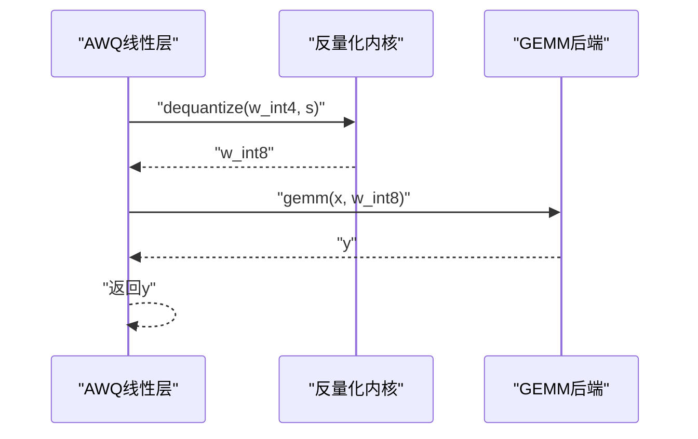
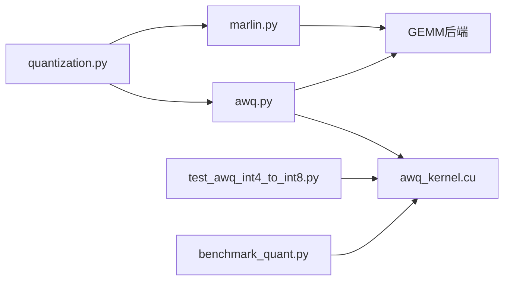

# AWQ量化

<cite>
**本文档引用的文件**   
- [vllm/config/quantization.py](file://vllm/config/quantization.py)
- [vllm/model_executor/layers/linear/base.py](file://vllm/model_executor/layers/linear/base.py)
- [vllm/model_executor/layers/linear/marlin.py](file://vllm/model_executor/layers/linear/marlin.py)
- [vllm/model_executor/layers/linear/awq.py](file://vllm/model_executor/layers/linear/awq.py)
- [vllm/kernels/quantization/awq_kernel.cu](file://vllm/kernels/quantization/awq_kernel.cu)
- [benchmarks/kernels/benchmark_quant.py](file://benchmarks/kernels/benchmark_quant.py)
- [tests/kernels/test_awq_int4_to_int8.py](file://tests/kernels/test_awq_int4_to_int8.py)
- [docs/features/quantization/README.md](file://docs/features/quantization/README.md)
</cite>

## 目录
1. [简介](#简介)
2. [项目结构](#项目结构)
3. [核心组件](#核心组件)
4. [架构总览](#架构总览)
5. [详细组件分析](#详细组件分析)
6. [依赖关系分析](#依赖关系分析)
7. [性能考量](#性能考量)
8. [故障排查指南](#故障排查指南)
9. [结论](#结论)
10. [附录](#附录)

## 简介
本文件系统性介绍AWQ（Activation-aware Weight Quantization，激活感知权重量化）的原理与在vLLM中的实现。内容涵盖：
- 权重分桶、激活统计分析与量化参数优化过程
- vLLM中AWQ的加载、内核调用流程、内存布局优化与计算加速机制
- 模型转换配置、推理参数设置与性能调优建议
- 不同模型架构上的精度保持与推理加速比参考

## 项目结构
围绕AWQ的关键代码分布在以下位置：
- 配置层：统一量化后端注册与选择
- 线性层适配：将AWQ权重与内核接入具体算子
- 内核层：CUDA核函数实现INT4到INT8等关键变换
- 基准与测试：量化性能与正确性验证
- 文档：量化特性说明与使用指引

图表来源 
- [vllm/config/quantization.py](file://vllm/config/quantization.py)
- [vllm/model_executor/layers/linear/base.py](file://vllm/model_executor/layers/linear/base.py)
- [vllm/model_executor/layers/linear/awq.py](file://vllm/model_executor/layers/linear/awq.py)
- [vllm/model_executor/layers/linear/marlin.py](file://vllm/model_executor/layers/linear/marlin.py)
- [vllm/kernels/quantization/awq_kernel.cu](file://vllm/kernels/quantization/awq_kernel.cu)
- [benchmarks/kernels/benchmark_quant.py](file://benchmarks/kernels/benchmark_quant.py)
- [tests/kernels/test_awq_int4_to_int8.py](file://tests/kernels/test_awq_int4_to_int8.py)
- [docs/features/quantization/README.md](file://docs/features/quantization/README.md)

章节来源
- [vllm/config/quantization.py](file://vllm/config/quantization.py)
- [vllm/model_executor/layers/linear/base.py](file://vllm/model_executor/layers/linear/base.py)
- [vllm/model_executor/layers/linear/awq.py](file://vllm/model_executor/layers/linear/awq.py)
- [vllm/model_executor/layers/linear/marlin.py](file://vllm/model_executor/layers/linear/marlin.py)
- [vllm/kernels/quantization/awq_kernel.cu](file://vllm/kernels/quantization/awq_kernel.cu)
- [benchmarks/kernels/benchmark_quant.py](file://benchmarks/kernels/benchmark_quant.py)
- [tests/kernels/test_awq_int4_to_int8.py](file://tests/kernels/test_awq_int4_to_int8.py)
- [docs/features/quantization/README.md](file://docs/features/quantization/README.md)

## 核心组件
- 量化配置与后端注册：集中管理AWQ相关开关、目标位宽、缩放策略与后端选择
- 线性层适配：将AWQ权重格式与GEMM内核对接，完成反量化与矩阵乘融合
- CUDA内核：提供高效的INT4到INT8重排/反量化、块级缩放等关键操作
- 基准与测试：覆盖INT4→INT8转换、端到端量化推理的正确性与性能

章节来源
- [vllm/config/quantization.py](file://vllm/config/quantization.py)
- [vllm/model_executor/layers/linear/awq.py](file://vllm/model_executor/layers/linear/awq.py)
- [vllm/model_executor/layers/linear/marlin.py](file://vllm/model_executor/layers/linear/marlin.py)
- [vllm/kernels/quantization/awq_kernel.cu](file://vllm/kernels/quantization/awq_kernel.cu)

## 架构总览
AWQ在vLLM中的整体数据流如下：
- 训练后量化阶段：基于激活统计对权重进行分桶与参数优化，得到压缩后的权重与必要的缩放信息
- 推理阶段：按层加载AWQ权重，通过线性层适配器调用CUDA内核，将INT4权重反量化为INT8并执行GEMM，减少访存与提升吞吐

图表来源 
- [vllm/model_executor/layers/linear/awq.py](file://vllm/model_executor/layers/linear/awq.py)
- [vllm/kernels/quantization/awq_kernel.cu](file://vllm/kernels/quantization/awq_kernel.cu)

章节来源
- [vllm/model_executor/layers/linear/awq.py](file://vllm/model_executor/layers/linear/awq.py)
- [vllm/kernels/quantization/awq_kernel.cu](file://vllm/kernels/quantization/awq_kernel.cu)

## 详细组件分析

### AWQ原理与参数优化
- 核心思想：利用激活分布的统计信息指导权重分桶与缩放参数优化，使低比特表示更贴近原始浮点值
- 权重分桶：按通道或分组对权重划分桶，每个桶独立估计最优缩放因子
- 激活统计分析：在前向或校准集上收集激活范数/极值，作为量化误差优化的依据
- 量化参数优化：最小化重建误差（如均方误差），求解每桶的最优缩放与偏移，得到可部署的量化权重

章节来源
- [docs/features/quantization/README.md](file://docs/features/quantization/README.md)

### vLLM中的AWQ线性层适配
- 职责：封装AWQ权重格式，负责反量化与GEMM的衔接
- 关键点：
  - 解析AWQ权重元数据（缩放、分桶粒度、布局）
  - 调用CUDA内核完成INT4→INT8的反量化与重排
  - 将INT8权重与输入送入高效GEMM后端
- 与其他后端的关系：可与Marlin等后端协同，根据硬件能力选择最优路径

图表来源 
- [vllm/model_executor/layers/linear/awq.py](file://vllm/model_executor/layers/linear/awq.py)
- [vllm/model_executor/layers/linear/marlin.py](file://vllm/model_executor/layers/linear/marlin.py)

章节来源
- [vllm/model_executor/layers/linear/awq.py](file://vllm/model_executor/layers/linear/awq.py)
- [vllm/model_executor/layers/linear/marlin.py](file://vllm/model_executor/layers/linear/marlin.py)

### CUDA内核与内存布局优化
- 反量化内核：将INT4权重按块/通道反量化为INT8，同时应用缩放因子
- 内存布局：采用紧凑打包与行/列对齐，减少访存碎片，提高带宽利用率
- 计算加速：与GEMM内核融合，避免中间FP16/BF16回退，降低显存占用与延迟

图表来源 
- [vllm/kernels/quantization/awq_kernel.cu](file://vllm/kernels/quantization/awq_kernel.cu)

章节来源
- [vllm/kernels/quantization/awq_kernel.cu](file://vllm/kernels/quantization/awq_kernel.cu)

### 量化内核调用流程
- 入口：线性层的forward触发反量化与GEMM
- 步骤：
  1) 校验形状与数据类型
  2) 调用反量化内核生成INT8权重
  3) 调用GEMM后端执行矩阵乘
  4) 返回结果

图表来源 
- [vllm/model_executor/layers/linear/awq.py](file://vllm/model_executor/layers/linear/awq.py)
- [vllm/kernels/quantization/awq_kernel.cu](file://vllm/kernels/quantization/awq_kernel.cu)

章节来源
- [vllm/model_executor/layers/linear/awq.py](file://vllm/model_executor/layers/linear/awq.py)
- [vllm/kernels/quantization/awq_kernel.cu](file://vllm/kernels/quantization/awq_kernel.cu)

### 模型转换配置与推理参数
- 转换配置：指定量化方法(AWQ)、目标位宽(INT4权重)、分桶粒度、校准数据集与优化步数
- 推理参数：启用AWQ后端、选择GEMM后端、批大小、上下文长度、KV缓存策略
- 最佳实践：优先使用校准集覆盖真实激活分布；合理设置分桶粒度以平衡精度与速度

章节来源
- [docs/features/quantization/README.md](file://docs/features/quantization/README.md)

### 性能调优建议
- 内核选择：根据GPU架构选择最优GEMM后端（如Marlin）
- 内存布局：确保权重按块对齐，减少反量化时的索引开销
- 批处理：增大批大小以提升吞吐，注意显存上限
- 校准数据：使用代表性样本，避免极端激活导致量化误差放大

章节来源
- [benchmarks/kernels/benchmark_quant.py](file://benchmarks/kernels/benchmark_quant.py)

### 精度保持与加速比参考
- 精度保持：AWQ通常能在较低位宽下保持接近原模型的困惑度/任务指标
- 加速比：得益于INT4存储与INT8计算，结合高效GEMM内核，可获得显著吞吐提升
- 评估方式：对比全精度与AWQ在相同输入下的输出差异与下游任务指标

章节来源
- [tests/kernels/test_awq_int4_to_int8.py](file://tests/kernels/test_awq_int4_to_int8.py)
- [benchmarks/kernels/benchmark_quant.py](file://benchmarks/kernels/benchmark_quant.py)

## 依赖关系分析
- 配置到实现：quantization.py定义AWQ后端选项，被线性层与内核选择逻辑引用
- 线性层到内核：awq.py调用awq_kernel.cu完成反量化，再调用GEMM后端
- 基准与测试：benchmark与test文件验证内核行为与端到端性能

图表来源 
- [vllm/config/quantization.py](file://vllm/config/quantization.py)
- [vllm/model_executor/layers/linear/awq.py](file://vllm/model_executor/layers/linear/awq.py)
- [vllm/model_executor/layers/linear/marlin.py](file://vllm/model_executor/layers/linear/marlin.py)
- [vllm/kernels/quantization/awq_kernel.cu](file://vllm/kernels/quantization/awq_kernel.cu)
- [tests/kernels/test_awq_int4_to_int8.py](file://tests/kernels/test_awq_int4_to_int8.py)
- [benchmarks/kernels/benchmark_quant.py](file://benchmarks/kernels/benchmark_quant.py)

章节来源
- [vllm/config/quantization.py](file://vllm/config/quantization.py)
- [vllm/model_executor/layers/linear/awq.py](file://vllm/model_executor/layers/linear/awq.py)
- [vllm/model_executor/layers/linear/marlin.py](file://vllm/model_executor/layers/linear/marlin.py)
- [vllm/kernels/quantization/awq_kernel.cu](file://vllm/kernels/quantization/awq_kernel.cu)
- [tests/kernels/test_awq_int4_to_int8.py](file://tests/kernels/test_awq_int4_to_int8.py)
- [benchmarks/kernels/benchmark_quant.py](file://benchmarks/kernels/benchmark_quant.py)

## 性能考量
- 访存优化：INT4权重紧凑存储，反量化时按需展开，减少带宽压力
- 计算融合：反量化与GEMM融合，避免中间类型转换带来的额外开销
- 并行度：充分利用GPU线程块与SM资源，提高吞吐
- 可扩展性：支持不同模型规模与序列长度，动态调整内核参数

[本节为通用性能讨论，不直接分析具体文件]

## 故障排查指南
- 常见错误：
  - 形状不匹配：检查权重与输入的维度对齐
  - 数据类型错误：确认INT4权重与INT8计算的类型一致性
  - 内核未编译：确认CUDA工具链与内核构建成功
- 调试手段：
  - 使用基准脚本验证内核性能与正确性
  - 逐步打印中间张量形状与数值范围，定位异常
  - 切换GEMM后端对比性能与数值差异

章节来源
- [tests/kernels/test_awq_int4_to_int8.py](file://tests/kernels/test_awq_int4_to_int8.py)
- [benchmarks/kernels/benchmark_quant.py](file://benchmarks/kernels/benchmark_quant.py)

## 结论
AWQ通过激活感知的权重分桶与参数优化，在低比特量化下保持较高精度，并在vLLM中通过高效的反量化内核与GEMM后端实现显著的推理加速。合理配置转换与推理参数、选择合适的后端与内存布局，可在不同模型架构上获得良好的精度与性能平衡。

[本节为总结性内容，不直接分析具体文件]

## 附录
- 术语解释：
  - 激活统计：用于指导量化的前向激活分布度量
  - 分桶：将权重划分为若干组，每组独立优化量化参数
  - 反量化：将低比特权重恢复为更高精度以便计算
- 参考链接：
  - 量化特性文档：features/quantization/README.md

[本节为补充信息，不直接分析具体文件]