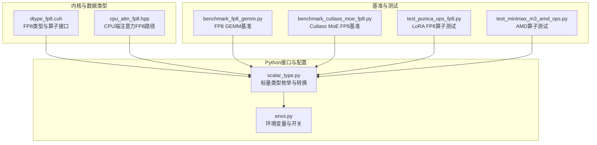
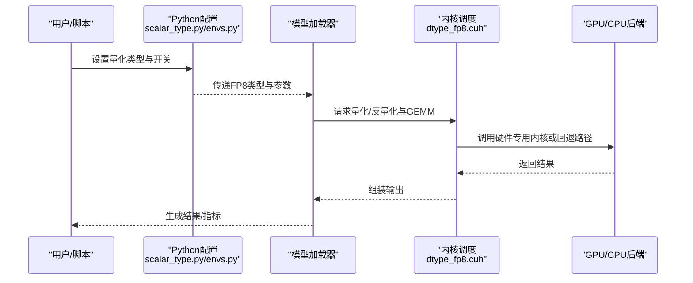
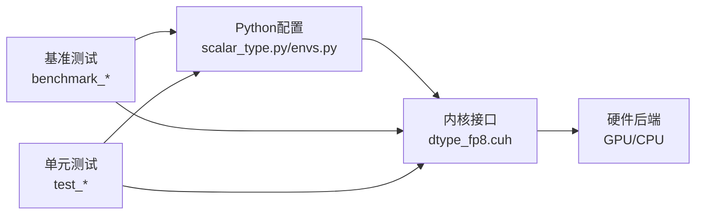

# FP8量化

<cite>
**本文档引用的文件**   
- [dtype_fp8.cuh](file://csrc/attention/dtype_fp8.cuh)
- [benchmark_fp8_gemm.py](file://benchmarks/kernels/benchmark_fp8_gemm.py)
- [benchmark_cutlass_moe_fp8.py](file://benchmarks/kernels/benchmark_cutlass_moe_fp8.py)
- [benchmark_nvfp4_quant.py](file://benchmarks/kernels/benchmark_nvfp4_quant.py)
- [cpu_attn_fp8.hpp](file://csrc/cpu/cpu_attn_fp8.hpp)
- [test_punica_ops_fp8.py](file://tests/lora/test_punica_ops_fp8.py)
- [test_minimax_m3_amd_ops.py](file://tests/kernels/test_minimax_m3_amd_ops.py)
- [envs.py](file://vllm/envs.py)
- [scalar_type.py](file://vllm/scalar_type.py)
</cite>

## 目录
1. [简介](#简介)
2. [项目结构](#项目结构)
3. [核心组件](#核心组件)
4. [架构总览](#架构总览)
5. [详细组件分析](#详细组件分析)
6. [依赖关系分析](#依赖关系分析)
7. [性能考量](#性能考量)
8. [故障排查指南](#故障排查指南)
9. [结论](#结论)
10. [附录](#附录)

## 简介
本文件围绕FP8（8位浮点数）量化在vLLM中的技术特性与应用场景展开，重点包括：
- FP8数据格式的优势：相比FP16的内存占用减半、在支持FP8张量核心的GPU上获得更高吞吐与更低延迟。
- vLLM中FP8量化的实现机制：量化参数的动态范围管理、舍入策略选择与精度损失控制。
- FP8模型的转换流程、推理配置参数与性能调优最佳实践。
- 在不同GPU架构（如A100、H100）上的性能表现与精度评估方法。

## 项目结构
vLLM中与FP8相关的代码分布在以下位置：
- C++/CUDA内核与数据类型定义：csrc/attention/dtype_fp8.cuh
- CPU端注意力相关实现：csrc/cpu/cpu_attn_fp8.hpp
- Python层类型与环境变量：vllm/scalar_type.py、vllm/envs.py
- 基准测试与验证脚本：benchmarks/kernels/*、tests/*

图表来源 
- [dtype_fp8.cuh](file://csrc/attention/dtype_fp8.cuh)
- [cpu_attn_fp8.hpp](file://csrc/cpu/cpu_attn_fp8.hpp)
- [scalar_type.py](file://vllm/scalar_type.py)
- [envs.py](file://vllm/envs.py)
- [benchmark_fp8_gemm.py](file://benchmarks/kernels/benchmark_fp8_gemm.py)
- [benchmark_cutlass_moe_fp8.py](file://benchmarks/kernels/benchmark_cutlass_moe_fp8.py)
- [test_punica_ops_fp8.py](file://tests/lora/test_punica_ops_fp8.py)
- [test_minimax_m3_amd_ops.py](file://tests/kernels/test_minimax_m3_amd_ops.py)

章节来源
- [dtype_fp8.cuh](file://csrc/attention/dtype_fp8.cuh)
- [cpu_attn_fp8.hpp](file://csrc/cpu/cpu_attn_fp8.hpp)
- [scalar_type.py](file://vllm/scalar_type.py)
- [envs.py](file://vllm/envs.py)
- [benchmark_fp8_gemm.py](file://benchmarks/kernels/benchmark_fp8_gemm.py)
- [benchmark_cutlass_moe_fp8.py](file://benchmarks/kernels/benchmark_cutlass_moe_fp8.py)
- [test_punica_ops_fp8.py](file://tests/lora/test_punica_ops_fp8.py)
- [test_minimax_m3_amd_ops.py](file://tests/kernels/test_minimax_m3_amd_ops.py)

## 核心组件
- FP8数据类型与算子接口：定义FP8的数值表示、范围与常用算子的C++/CUDA封装，为上层提供统一的量化/反量化与GEMM调用入口。
- CPU端注意力FP8路径：在缺少硬件加速时提供CPU侧的FP8注意力计算路径，保证功能完整性。
- Python类型系统与环境变量：统一暴露标量类型（含FP8）与运行时开关，便于模型加载、推理与基准测试配置。
- 基准与测试套件：覆盖FP8 GEMM、MoE、LoRA等关键路径的性能与正确性验证。

章节来源
- [dtype_fp8.cuh](file://csrc/attention/dtype_fp8.cuh)
- [cpu_attn_fp8.hpp](file://csrc/cpu/cpu_attn_fp8.hpp)
- [scalar_type.py](file://vllm/scalar_type.py)
- [envs.py](file://vllm/envs.py)
- [benchmark_fp8_gemm.py](file://benchmarks/kernels/benchmark_fp8_gemm.py)
- [benchmark_cutlass_moe_fp8.py](file://benchmarks/kernels/benchmark_cutlass_moe_fp8.py)
- [test_punica_ops_fp8.py](file://tests/lora/test_punica_ops_fp8.py)

## 架构总览
下图展示了从Python配置到内核执行的端到端路径，以及不同硬件后端的选择逻辑。

图表来源 
- [scalar_type.py](file://vllm/scalar_type.py)
- [envs.py](file://vllm/envs.py)
- [dtype_fp8.cuh](file://csrc/attention/dtype_fp8.cuh)

## 详细组件分析

### FP8数据类型与内核接口（dtype_fp8.cuh）
- 职责：定义FP8的数据布局、范围常量、量化/反量化函数以及与GEMM/Attention等算子的绑定。
- 关键点：
  - 动态范围管理：通过缩放因子（scale）与零点（zero point，若采用混合精度或偏移）维护每块/每通道的量化范围。
  - 舍入策略：根据目标硬件能力选择就近舍入、向零舍入或随机舍入，以平衡精度与速度。
  - 精度损失控制：结合逐块/逐通道量化与重校准（re-calibration）减少累积误差。
- 适用场景：权重量化、激活量化、KV缓存压缩、注意力中间结果的半精度替代。

章节来源
- [dtype_fp8.cuh](file://csrc/attention/dtype_fp8.cuh)

### CPU端注意力FP8路径（cpu_attn_fp8.hpp）
- 职责：在无GPU或特定硬件不可用时，提供CPU侧的FP8注意力实现，确保跨平台可用性。
- 关键点：
  - 使用SIMD指令集优化循环与内存访问。
  - 针对FP8进行专门的量化/反量化与累加路径，避免不必要的类型转换开销。
- 适用场景：开发调试、边缘设备推理、CI回归测试。

章节来源
- [cpu_attn_fp8.hpp](file://csrc/cpu/cpu_attn_fp8.hpp)

### Python类型与环境变量（scalar_type.py、envs.py）
- scalar_type.py：集中定义标量类型枚举（含FP8），并提供类型转换与校验工具，供模型加载与执行器使用。
- envs.py：暴露运行时环境变量，用于开启/关闭FP8路径、选择量化粒度、切换舍入策略等。
- 关键点：
  - 统一入口：所有模块通过类型枚举与环境变量获取一致的FP8行为。
  - 可配置性：支持按层/按块/按通道的量化粒度与不同的舍入策略组合。

章节来源
- [scalar_type.py](file://vllm/scalar_type.py)
- [envs.py](file://vllm/envs.py)

### 基准测试与验证（benchmark_*、test_*）
- benchmark_fp8_gemm.py：测量FP8 GEMM在不同形状下的吞吐与延迟，对比FP16/BF16基线。
- benchmark_cutlass_moe_fp8.py：评估MoE场景下FP8的吞吐与显存占用，关注路由与专家计算的融合效率。
- test_punica_ops_fp8.py：验证LoRA路径中FP8算子的正确性与数值稳定性。
- test_minimax_m3_amd_ops.py：覆盖AMD平台上的FP8相关算子，确保跨厂商兼容性。

章节来源
- [benchmark_fp8_gemm.py](file://benchmarks/kernels/benchmark_fp8_gemm.py)
- [benchmark_cutlass_moe_fp8.py](file://benchmarks/kernels/benchmark_cutlass_moe_fp8.py)
- [test_punica_ops_fp8.py](file://tests/lora/test_punica_ops_fp8.py)
- [test_minimax_m3_amd_ops.py](file://tests/kernels/test_minimax_m3_amd_ops.py)

## 依赖关系分析
FP8在vLLM中的依赖关系如下：
- Python层（scalar_type.py、envs.py）向上暴露配置与类型，向下驱动内核选择。
- 内核层（dtype_fp8.cuh）依赖底层硬件能力（CUDA核、Cutlass、Triton等），并可选择CPU回退路径。
- 基准与测试依赖Python层与内核层，形成闭环验证。

图表来源 
- [scalar_type.py](file://vllm/scalar_type.py)
- [envs.py](file://vllm/envs.py)
- [dtype_fp8.cuh](file://csrc/attention/dtype_fp8.cuh)
- [benchmark_fp8_gemm.py](file://benchmarks/kernels/benchmark_fp8_gemm.py)
- [benchmark_cutlass_moe_fp8.py](file://benchmarks/kernels/benchmark_cutlass_moe_fp8.py)
- [test_punica_ops_fp8.py](file://tests/lora/test_punica_ops_fp8.py)

## 性能考量
- 内存节省：FP8相较FP16可将权重与激活占用的显存减半，有利于更大批处理或更长上下文。
- 计算加速：在支持FP8张量核心的GPU（如H100）上，GEMM与注意力内核可获得显著吞吐提升；在A100上需确认具体内核支持情况。
- 量化粒度：逐块/逐通道量化能降低精度损失，但会增加元数据开销；需权衡精度与带宽。
- 舍入策略：就近舍入通常更快，但在某些分布下可能引入偏差；随机舍入可降低系统性误差但带来额外开销。
- 重校准与后训练量化：对关键层（如注意力投影、FFN）进行重校准可显著提升整体精度。
- 内核融合：将量化/反量化与GEMM/Attention融合可减少内存往返，提高能效。

[本节为通用指导，不直接分析具体文件]

## 故障排查指南
- 现象：启用FP8后出现数值不稳定或精度下降
  - 检查量化粒度是否过粗（如全局量化导致大值域被截断）。
  - 调整舍入策略，尝试更保守的舍入方式。
  - 对关键层进行重校准或微调。
- 现象：性能未达预期
  - 确认硬件是否支持FP8张量核心（H100优于A100）。
  - 检查内核是否走回退路径（CPU或低效实现）。
  - 调整批大小与序列长度，观察带宽瓶颈。
- 现象：跨平台不一致
  - 核对AMD/NVIDIA平台的算子实现差异，参考对应测试用例。

章节来源
- [test_punica_ops_fp8.py](file://tests/lora/test_punica_ops_fp8.py)
- [test_minimax_m3_amd_ops.py](file://tests/kernels/test_minimax_m3_amd_ops.py)

## 结论
FP8量化在vLLM中提供了显著的内存与性能收益，尤其在新一代GPU上。通过合理的量化粒度、舍入策略与重校准，可以在保持精度的同时最大化吞吐。建议在生产环境中结合基准测试与监控，持续优化量化参数与内核选择。

[本节为总结，不直接分析具体文件]

## 附录
- 转换流程建议：
  - 离线量化：基于校准数据集统计动态范围，生成缩放因子与零点。
  - 在线量化：在推理阶段按块/通道动态估计范围，适合分布变化较大的场景。
  - 混合精度：对敏感层保留BF16/FP16，其余层使用FP8。
- 推理配置要点：
  - 明确量化粒度（逐块/逐通道/逐层）。
  - 选择合适的舍入策略与重校准选项。
  - 启用内核融合与图编译以提升性能。
- 性能评估方法：
  - 使用benchmark_fp8_gemm.py与benchmark_cutlass_moe_fp8.py进行吞吐/延迟测量。
  - 对比FP16/BF16基线，记录显存占用与精度指标（如困惑度、准确率）。

[本节为补充信息，不直接分析具体文件]