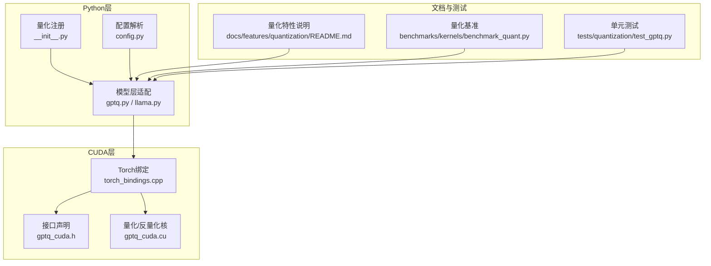
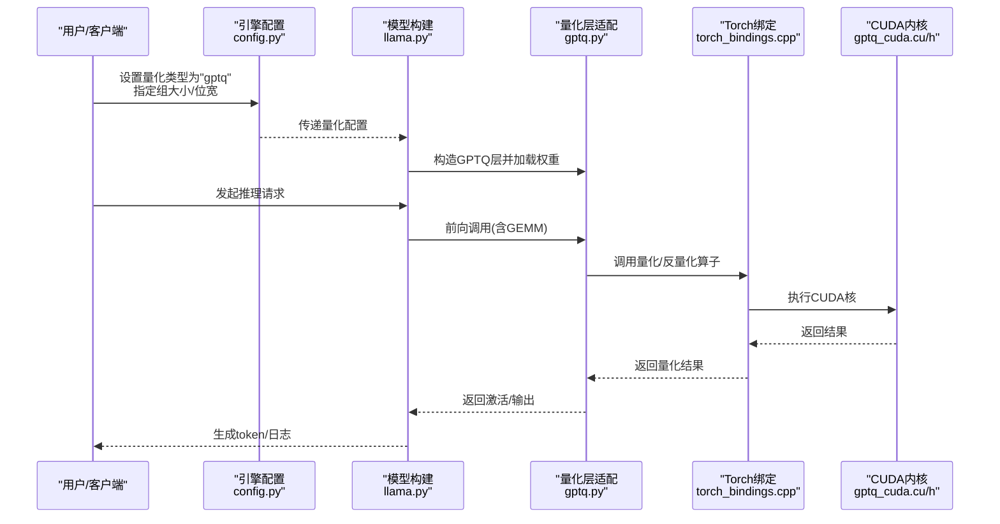
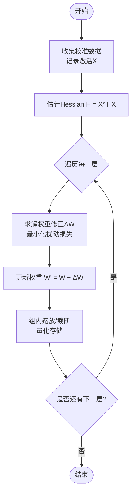
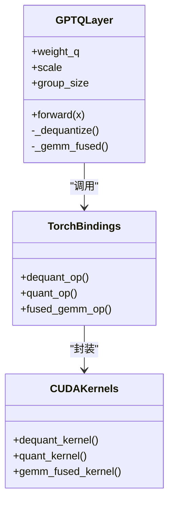
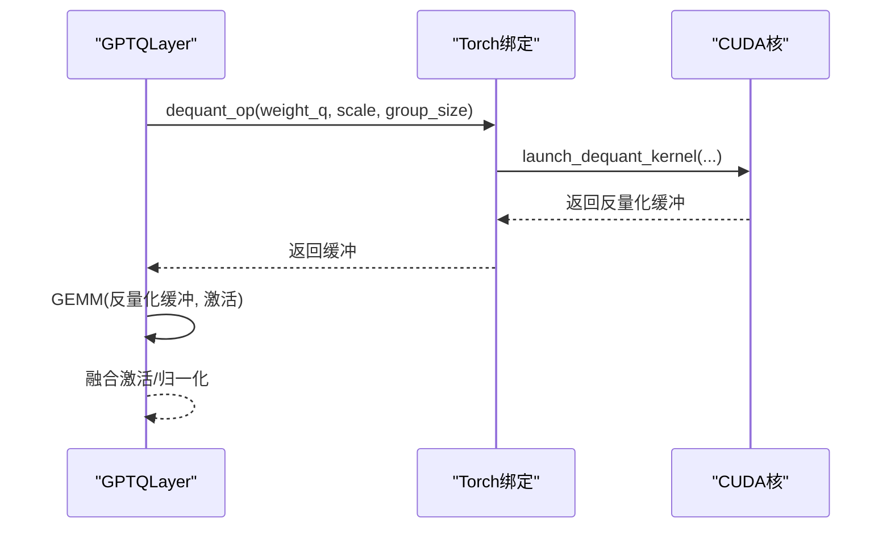
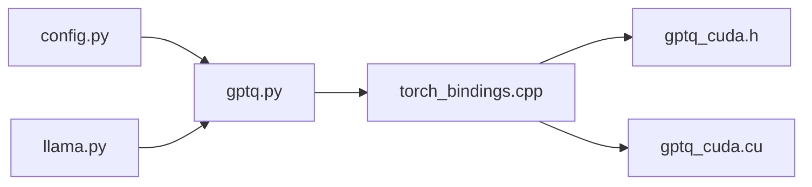

# GPTQ量化

<cite>
**本文引用的文件**   
- [vllm/model_executor/layers/quantization/gptq.py](file://vllm/model_executor/layers/quantization/gptq.py)
- [vllm/model_executor/layers/quantization/__init__.py](file://vllm/model_executor/layers/quantization/__init__.py)
- [vllm/config.py](file://vllm/config.py)
- [vllm/model_executor/models/llama.py](file://vllm/model_executor/models/llama.py)
- [benchmarks/kernels/benchmark_quant.py](file://benchmarks/kernels/benchmark_quant.py)
- [tests/quantization/test_gptq.py](file://tests/quantization/test_gptq.py)
- [csrc/libtorch_stable/quantization/gptq/gptq_cuda.cu](file://csrc/libtorch_stable/quantization/gptq/gptq_cuda.cu)
- [csrc/libtorch_stable/quantization/gptq/gptq_cuda.h](file://csrc/libtorch_stable/quantization/gptq/gptq_cuda.h)
- [csrc/torch_bindings.cpp](file://csrc/torch_bindings.cpp)
- [docs/features/quantization/README.md](file://docs/features/quantization/README.md)
</cite>

## 目录
1. [简介](#简介)
2. [项目结构](#项目结构)
3. [核心组件](#核心组件)
4. [架构总览](#架构总览)
5. [详细组件分析](#详细组件分析)
6. [依赖关系分析](#依赖关系分析)
7. [性能考量](#性能考量)
8. [故障排查指南](#故障排查指南)
9. [结论](#结论)
10. [附录](#附录)

## 简介
本文件系统性阐述GPTQ（Group-wise Quantized Post-training Quantization）在vLLM中的实现与使用。内容覆盖：
- 算法原理：分组后训练量化的Hessian估计、逐层优化与误差传播控制
- vLLM集成：量化配置、模型加载、推理反量化路径与CUDA内核调用
- 工程实践：内存访问优化、并行策略、精度对比与基准测试方法
- 排错与调优：常见问题定位与性能优化建议

## 项目结构
围绕GPTQ的关键代码分布在Python层、C++/CUDA内核层与文档/测试中：
- Python层：量化注册、配置解析、模型层适配与推理调度
- CUDA层：GPTQ量化/反量化核、张量访存优化与并行化
- 文档与测试：使用说明、基准脚本与正确性验证

**图表来源** 
- [vllm/model_executor/layers/quantization/__init__.py](file://vllm/model_executor/layers/quantization/__init__.py)
- [vllm/config.py](file://vllm/config.py)
- [vllm/model_executor/layers/quantization/gptq.py](file://vllm/model_executor/layers/quantization/gptq.py)
- [vllm/model_executor/models/llama.py](file://vllm/model_executor/models/llama.py)
- [csrc/libtorch_stable/quantization/gptq/gptq_cuda.h](file://csrc/libtorch_stable/quantization/gptq/gptq_cuda.h)
- [csrc/libtorch_stable/quantization/gptq/gptq_cuda.cu](file://csrc/libtorch_stable/quantization/gptq/gptq_cuda.cu)
- [csrc/torch_bindings.cpp](file://csrc/torch_bindings.cpp)
- [docs/features/quantization/README.md](file://docs/features/quantization/README.md)
- [benchmarks/kernels/benchmark_quant.py](file://benchmarks/kernels/benchmark_quant.py)
- [tests/quantization/test_gptq.py](file://tests/quantization/test_gptq.py)

**章节来源**
- [vllm/model_executor/layers/quantization/__init__.py](file://vllm/model_executor/layers/quantization/__init__.py)
- [vllm/config.py](file://vllm/config.py)
- [vllm/model_executor/layers/quantization/gptq.py](file://vllm/model_executor/layers/quantization/gptq.py)
- [vllm/model_executor/models/llama.py](file://vllm/model_executor/models/llama.py)
- [csrc/libtorch_stable/quantization/gptq/gptq_cuda.h](file://csrc/libtorch_stable/quantization/gptq/gptq_cuda.h)
- [csrc/libtorch_stable/quantization/gptq/gptq_cuda.cu](file://csrc/libtorch_stable/quantization/gptq/gptq_cuda.cu)
- [csrc/torch_bindings.cpp](file://csrc/torch_bindings.cpp)
- [docs/features/quantization/README.md](file://docs/features/quantization/README.md)
- [benchmarks/kernels/benchmark_quant.py](file://benchmarks/kernels/benchmark_quant.py)
- [tests/quantization/test_gptq.py](file://tests/quantization/test_gptq.py)

## 核心组件
- 量化注册与选择：通过量化模块注册表将“gptq”接入vLLM的量化管线，并在模型构建时根据配置选择对应实现
- 配置解析：统一从引擎参数解析量化类型、组大小、位宽等关键超参
- 模型层适配：对注意力与MLP等权重矩阵进行GPTQ格式存储与计算图融合
- CUDA内核：提供低延迟的量化/反量化核，支持块级缩放与组内归一化
- Torch绑定：将CUDA核暴露为Python可调用算子，便于在PyTorch图中调用

**章节来源**
- [vllm/model_executor/layers/quantization/__init__.py](file://vllm/model_executor/layers/quantization/__init__.py)
- [vllm/config.py](file://vllm/config.py)
- [vllm/model_executor/layers/quantization/gptq.py](file://vllm/model_executor/layers/quantization/gptq.py)
- [csrc/libtorch_stable/quantization/gptq/gptq_cuda.h](file://csrc/libtorch_stable/quantization/gptq/gptq_cuda.h)
- [csrc/libtorch_stable/quantization/gptq/gptq_cuda.cu](file://csrc/libtorch_stable/quantization/gptq/gptq_cuda.cu)
- [csrc/torch_bindings.cpp](file://csrc/torch_bindings.cpp)

## 架构总览
下图展示从配置到推理的端到端流程：配置驱动量化选择，模型层按GPTQ格式加载权重，推理时通过CUDA内核完成反量化与GEMM融合。

**图表来源** 
- [vllm/config.py](file://vllm/config.py)
- [vllm/model_executor/models/llama.py](file://vllm/model_executor/models/llama.py)
- [vllm/model_executor/layers/quantization/gptq.py](file://vllm/model_executor/layers/quantization/gptq.py)
- [csrc/torch_bindings.cpp](file://csrc/torch_bindings.cpp)
- [csrc/libtorch_stable/quantization/gptq/gptq_cuda.cu](file://csrc/libtorch_stable/quantization/gptq/gptq_cuda.cu)
- [csrc/libtorch_stable/quantization/gptq/gptq_cuda.h](file://csrc/libtorch_stable/quantization/gptq/gptq_cuda.h)

## 详细组件分析

### 算法原理：分组后训练量化（GPTQ）
- Hessian矩阵估计：基于校准集统计每层的输入激活二阶矩，近似Hessian以指导权重更新方向
- 逐层优化：对每个线性层独立求解最小化扰动问题的闭式或迭代解，得到最优权重修正
- 误差传播控制：通过组内缩放与残差补偿抑制量化噪声累积，保证下游层稳定性
- 分组策略：按通道维度划分组，组内共享缩放因子，平衡压缩率与精度

[该图为概念流程图，不直接映射具体源码文件]

### vLLM中的GPTQ实现架构
- 量化注册与选择：在量化模块注册表中声明“gptq”，由配置驱动实例化
- 模型层适配：对Attention/MLP的权重矩阵采用GPTQ布局（码本+缩放），前向时按需反量化并与GEMM融合
- CUDA内核：提供高效的反量化核与量化核，利用线程块/网格划分与寄存器分块提升吞吐
- Torch绑定：封装CUDA核为Python API，支持批量形状与流同步

**图表来源** 
- [vllm/model_executor/layers/quantization/gptq.py](file://vllm/model_executor/layers/quantization/gptq.py)
- [csrc/libtorch_stable/quantization/gptq/gptq_cuda.cu](file://csrc/libtorch_stable/quantization/gptq/gptq_cuda.cu)
- [csrc/libtorch_stable/quantization/gptq/gptq_cuda.h](file://csrc/libtorch_stable/quantization/gptq/gptq_cuda.h)
- [csrc/torch_bindings.cpp](file://csrc/torch_bindings.cpp)

**章节来源**
- [vllm/model_executor/layers/quantization/gptq.py](file://vllm/model_executor/layers/quantization/gptq.py)
- [csrc/libtorch_stable/quantization/gptq/gptq_cuda.cu](file://csrc/libtorch_stable/quantization/gptq/gptq_cuda.cu)
- [csrc/libtorch_stable/quantization/gptq/gptq_cuda.h](file://csrc/libtorch_stable/quantization/gptq/gptq_cuda.h)
- [csrc/torch_bindings.cpp](file://csrc/torch_bindings.cpp)

### 量化配置选项
- 量化类型：选择“gptq”
- 组大小：控制组内共享缩放粒度，影响精度与内存占用
- 位宽：如int4/int8，决定码本密度
- 校准数据集：用于Hessian估计与权重修正
- 其他：是否启用特定融合（如反量化-GEMM融合）、线程块尺寸等

**章节来源**
- [vllm/config.py](file://vllm/config.py)
- [docs/features/quantization/README.md](file://docs/features/quantization/README.md)

### 推理时的反量化过程
- 读取GPTQ权重布局（码本、缩放、组索引）
- 按组反量化为FP16/BF16临时缓冲
- 与输入激活进行GEMM，必要时融合激活函数
- 释放临时缓冲，返回结果

**图表来源** 
- [vllm/model_executor/layers/quantization/gptq.py](file://vllm/model_executor/layers/quantization/gptq.py)
- [csrc/torch_bindings.cpp](file://csrc/torch_bindings.cpp)
- [csrc/libtorch_stable/quantization/gptq/gptq_cuda.cu](file://csrc/libtorch_stable/quantization/gptq/gptq_cuda.cu)

**章节来源**
- [vllm/model_executor/layers/quantization/gptq.py](file://vllm/model_executor/layers/quantization/gptq.py)
- [csrc/torch_bindings.cpp](file://csrc/torch_bindings.cpp)
- [csrc/libtorch_stable/quantization/gptq/gptq_cuda.cu](file://csrc/libtorch_stable/quantization/gptq/gptq_cuda.cu)

### CUDA内核与内存访问优化
- 访存模式：按块/组对齐读取权重与缩放，合并全局访存，减少重复加载
- 并行策略：线程块处理输出片，线程内循环展开，寄存器缓存中间结果
- 融合优化：反量化与GEMM融合，避免中间缓冲写回显存
- 数据类型：优先使用半精度累加，必要时转FP32保稳定

**章节来源**
- [csrc/libtorch_stable/quantization/gptq/gptq_cuda.cu](file://csrc/libtorch_stable/quantization/gptq/gptq_cuda.cu)
- [csrc/libtorch_stable/quantization/gptq/gptq_cuda.h](file://csrc/libtorch_stable/quantization/gptq/gptq_cuda.h)

### 与原始FP16模型的精度对比
- 评估指标：困惑度、任务准确率、采样一致性
- 对比方式：相同上下文长度与采样参数下，比较GPTQ与FP16输出差异
- 校准数据：使用代表性语料进行Hessian估计，确保可比性

**章节来源**
- [docs/features/quantization/README.md](file://docs/features/quantization/README.md)
- [tests/quantization/test_gptq.py](file://tests/quantization/test_gptq.py)

### 不同硬件平台的性能基准
- 平台：NVIDIA GPU（A100/H100等）、AMD ROCm、CPU回退路径
- 指标：吞吐量（tokens/s）、延迟（ms/token）、显存占用
- 工具：内置基准脚本与自定义负载

**章节来源**
- [benchmarks/kernels/benchmark_quant.py](file://benchmarks/kernels/benchmark_quant.py)
- [docs/features/quantization/README.md](file://docs/features/quantization/README.md)

## 依赖关系分析
- Python层依赖：配置模块、模型定义、量化注册表
- CUDA层依赖：Torch绑定、底层算子库（如cuBLAS/cutlass）
- 运行时：GPU驱动、CUDA版本匹配、内存管理

**图表来源** 
- [vllm/config.py](file://vllm/config.py)
- [vllm/model_executor/models/llama.py](file://vllm/model_executor/models/llama.py)
- [vllm/model_executor/layers/quantization/gptq.py](file://vllm/model_executor/layers/quantization/gptq.py)
- [csrc/torch_bindings.cpp](file://csrc/torch_bindings.cpp)
- [csrc/libtorch_stable/quantization/gptq/gptq_cuda.h](file://csrc/libtorch_stable/quantization/gptq/gptq_cuda.h)
- [csrc/libtorch_stable/quantization/gptq/gptq_cuda.cu](file://csrc/libtorch_stable/quantization/gptq/gptq_cuda.cu)

**章节来源**
- [vllm/config.py](file://vllm/config.py)
- [vllm/model_executor/models/llama.py](file://vllm/model_executor/models/llama.py)
- [vllm/model_executor/layers/quantization/gptq.py](file://vllm/model_executor/layers/quantization/gptq.py)
- [csrc/torch_bindings.cpp](file://csrc/torch_bindings.cpp)
- [csrc/libtorch_stable/quantization/gptq/gptq_cuda.h](file://csrc/libtorch_stable/quantization/gptq/gptq_cuda.h)
- [csrc/libtorch_stable/quantization/gptq/gptq_cuda.cu](file://csrc/libtorch_stable/quantization/gptq/gptq_cuda.cu)

## 性能考量
- 组大小调优：较小组提高精度但增加元数据开销；较小组提升吞吐但可能降低精度
- 位宽选择：int4显著降内存与带宽，需结合校准数据验证精度
- 融合策略：反量化-GEMM融合可减少显存往返，提升吞吐
- 批大小与序列长度：大批次利于吞吐，长序列需关注KV缓存与访存局部性
- 硬件特性：利用Tensor Core、共享内存与寄存器分块最大化利用率

[本节为通用指导，不直接分析具体文件]

## 故障排查指南
- 量化加载失败：检查配置文件中的量化类型与组大小是否与模型兼容
- 精度异常：确认校准数据质量与数量，调整组大小或位宽
- CUDA错误：核对CUDA版本与驱动，检查内核编译产物是否存在
- 性能退化：关闭不必要的融合，调整线程块尺寸，检查内存带宽瓶颈

**章节来源**
- [tests/quantization/test_gptq.py](file://tests/quantization/test_gptq.py)
- [docs/features/quantization/README.md](file://docs/features/quantization/README.md)

## 结论
GPTQ在vLLM中通过清晰的Python-CUDA分层设计实现了高效的后训练量化。借助Hessian估计与逐层优化，可在较低位宽下保持良好精度；CUDA内核与融合策略显著提升推理吞吐。合理配置组大小与位宽、结合校准数据与基准测试，可获得最佳性价比。

[本节为总结，不直接分析具体文件]

## 附录
- 快速上手：参考量化特性文档与示例脚本
- 扩展开发：在量化注册表中添加新实现，复用Torch绑定与CUDA核模板
- 基准复现：使用内置基准脚本在不同硬件上采集吞吐与延迟

**章节来源**
- [docs/features/quantization/README.md](file://docs/features/quantization/README.md)
- [benchmarks/kernels/benchmark_quant.py](file://benchmarks/kernels/benchmark_quant.py)