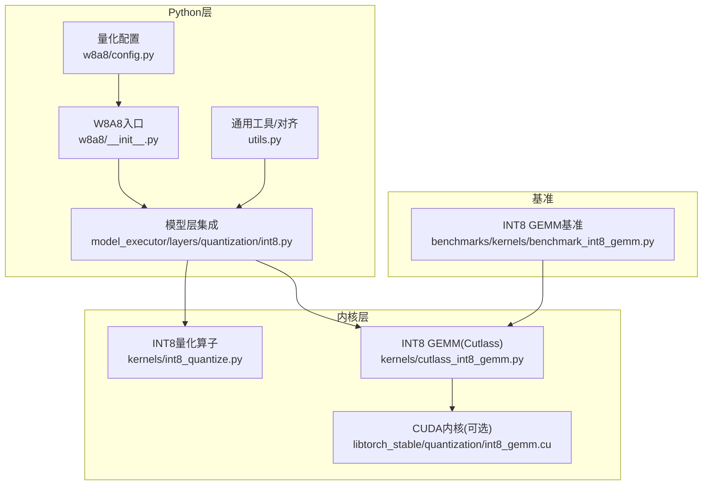
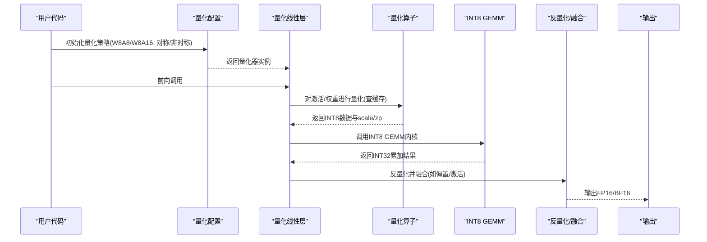
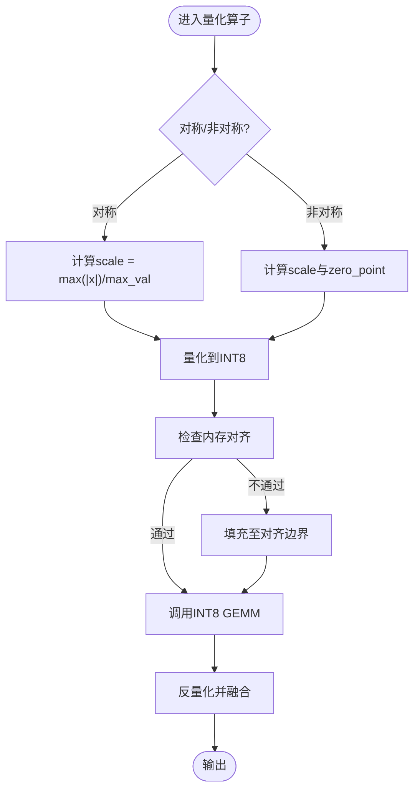
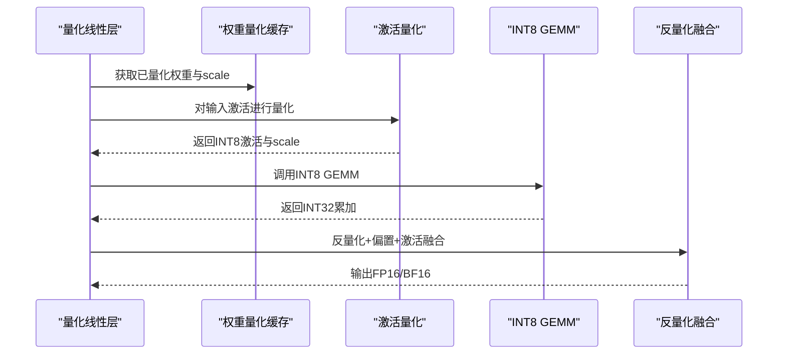
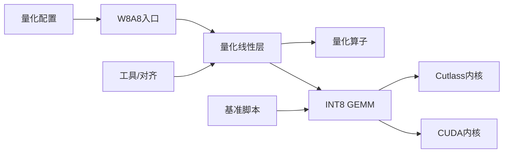

# INT8量化

<cite>
**本文引用的文件**   
- [vllm/quantization/w8a8/__init__.py](file://vllm/quantization/w8a8/__init__.py)
- [vllm/quantization/w8a8/config.py](file://vllm/quantization/w8a8/config.py)
- [vllm/quantization/w8a8/kernels/cutlass_int8_gemm.py](file://vllm/quantization/w8a8/kernels/cutlass_int8_gemm.py)
- [vllm/quantization/w8a8/kernels/int8_quantize.py](file://vllm/quantization/w8a8/kernels/int8_quantize.py)
- [vllm/model_executor/layers/linear.py](file://vllm/model_executor/layers/linear.py)
- [vllm/model_executor/layers/quantization/int8.py](file://vllm/model_executor/layers/quantization/int8.py)
- [benchmarks/kernels/benchmark_int8_gemm.py](file://benchmarks/kernels/benchmark_int8_gemm.py)
- [csrc/libtorch_stable/quantization/int8_gemm.cu](file://csrc/libtorch_stable/quantization/int8_gemm.cu)
- [vllm/utils.py](file://vllm/utils.py)
</cite>

## 目录
1. [简介](#简介)
2. [项目结构](#项目结构)
3. [核心组件](#核心组件)
4. [架构总览](#架构总览)
5. [详细组件分析](#详细组件分析)
6. [依赖关系分析](#依赖关系分析)
7. [性能考量](#性能考量)
8. [故障排查指南](#故障排查指南)
9. [结论](#结论)
10. [附录](#附录)

## 简介
本文件系统性阐述INT8（8位整数）量化的技术原理与工程实现，重点覆盖：
- 权重量化、激活量化与混合精度量化的策略选择
- 对称与非对称量化的适用场景与取舍标准
- vLLM中INT8量化的底层实现：INT8 GEMM内核优化、量化参数缓存机制与内存对齐策略
- INT8模型的量化配置选项、推理时的反量化流程与性能监控指标
- 在不同模型类型（Transformer、MoE等）上的精度保持与推理加速效果

## 项目结构
围绕INT8量化，vLLM在Python层提供配置与调度，在C++/CUDA层提供高性能GEMM与量化内核，并在模型层进行集成。关键目录与职责如下：
- Python量化配置与注册：定义量化策略、参数与后端选择
- 量化内核：按平台选择Cutlass或原生CUDA实现，提供INT8 GEMM与量化算子
- 模型层集成：将量化模块注入到线性层、注意力与MoE路由等关键路径
- 基准测试：针对INT8 GEMM的端到端性能验证

图表来源
- [vllm/quantization/w8a8/config.py](file://vllm/quantization/w8a8/config.py)
- [vllm/quantization/w8a8/__init__.py](file://vllm/quantization/w8a8/__init__.py)
- [vllm/model_executor/layers/quantization/int8.py](file://vllm/model_executor/layers/quantization/int8.py)
- [vllm/quantization/w8a8/kernels/int8_quantize.py](file://vllm/quantization/w8a8/kernels/int8_quantize.py)
- [vllm/quantization/w8a8/kernels/cutlass_int8_gemm.py](file://vllm/quantization/w8a8/kernels/cutlass_int8_gemm.py)
- [csrc/libtorch_stable/quantization/int8_gemm.cu](file://csrc/libtorch_stable/quantization/int8_gemm.cu)
- [benchmarks/kernels/benchmark_int8_gemm.py](file://benchmarks/kernels/benchmark_int8_gemm.py)
- [vllm/utils.py](file://vllm/utils.py)

章节来源
- [vllm/quantization/w8a8/config.py](file://vllm/quantization/w8a8/config.py)
- [vllm/quantization/w8a8/__init__.py](file://vllm/quantization/w8a8/__init__.py)
- [vllm/model_executor/layers/quantization/int8.py](file://vllm/model_executor/layers/quantization/int8.py)
- [vllm/quantization/w8a8/kernels/int8_quantize.py](file://vllm/quantization/w8a8/kernels/int8_quantize.py)
- [vllm/quantization/w8a8/kernels/cutlass_int8_gemm.py](file://vllm/quantization/w8a8/kernels/cutlass_int8_gemm.py)
- [csrc/libtorch_stable/quantization/int8_gemm.cu](file://csrc/libtorch_stable/quantization/int8_gemm.cu)
- [benchmarks/kernels/benchmark_int8_gemm.py](file://benchmarks/kernels/benchmark_int8_gemm.py)
- [vllm/utils.py](file://vllm/utils.py)

## 核心组件
- 量化配置与策略
  - 支持权重INT8、激活INT8以及混合精度（如W8A16/W8A8）组合
  - 对称/非对称量化开关，按通道/按张量粒度选择
  - 量化参数（scale/zero_point）缓存与复用策略
- 内核与执行
  - INT8量化算子：逐块/逐令牌/逐通道量化
  - INT8 GEMM：优先使用Cutlass INT8内核，回退至CUDA实现
  - 内存对齐：确保矩阵维度满足内核要求（如行/列对齐）
- 模型集成
  - 线性层替换为量化版本，自动处理反量化与融合
  - MoE路由与专家GEMM的INT8路径
- 基准与监控
  - 提供INT8 GEMM基准脚本，便于评估吞吐与时延
  - 暴露关键指标：时延、吞吐、显存占用、量化参数命中次数

章节来源
- [vllm/quantization/w8a8/config.py](file://vllm/quantization/w8a8/config.py)
- [vllm/quantization/w8a8/__init__.py](file://vllm/quantization/w8a8/__init__.py)
- [vllm/model_executor/layers/quantization/int8.py](file://vllm/model_executor/layers/quantization/int8.py)
- [vllm/quantization/w8a8/kernels/int8_quantize.py](file://vllm/quantization/w8a8/kernels/int8_quantize.py)
- [vllm/quantization/w8a8/kernels/cutlass_int8_gemm.py](file://vllm/quantization/w8a8/kernels/cutlass_int8_gemm.py)
- [benchmarks/kernels/benchmark_int8_gemm.py](file://benchmarks/kernels/benchmark_int8_gemm.py)

## 架构总览
下图展示从配置到内核执行的完整链路，包括量化参数缓存与反量化路径。

图表来源
- [vllm/quantization/w8a8/config.py](file://vllm/quantization/w8a8/config.py)
- [vllm/model_executor/layers/quantization/int8.py](file://vllm/model_executor/layers/quantization/int8.py)
- [vllm/quantization/w8a8/kernels/int8_quantize.py](file://vllm/quantization/w8a8/kernels/int8_quantize.py)
- [vllm/quantization/w8a8/kernels/cutlass_int8_gemm.py](file://vllm/quantization/w8a8/kernels/cutlass_int8_gemm.py)

## 详细组件分析

### 量化策略与配置
- 权重量化
  - 按通道或按张量粒度计算scale/zero_point
  - 对称量化：zero_point=0，适合权重分布近似零均值
  - 非对称量化：保留偏移，适合存在偏置的激活
- 激活量化
  - 逐令牌或逐块量化，平衡精度与开销
  - 动态量化：推理时在线计算scale，避免额外存储
- 混合精度
  - W8A16：权重INT8，激活FP16/BF16，兼顾精度与速度
  - W8A8：全路径INT8，需关注累积误差与反量化融合
- 量化参数缓存
  - 对静态权重与可复用激活块缓存scale/zp，减少重复计算
  - 缓存键包含形状、数据类型与量化粒度

章节来源
- [vllm/quantization/w8a8/config.py](file://vllm/quantization/w8a8/config.py)
- [vllm/quantization/w8a8/__init__.py](file://vllm/quantization/w8a8/__init__.py)

### 量化算子与内核
- 量化算子
  - 支持按通道/按令牌/按块的量化实现
  - 对称/非对称两种模式，自动选择最优路径
- INT8 GEMM
  - 首选Cutlass INT8内核，具备高吞吐与良好并行度
  - 回退至CUDA实现，保证兼容性
  - 内存对齐：行列维度对齐至内核要求，提升访存效率
- 反量化与融合
  - 将反量化与后续操作（如偏置相加、激活函数）融合，减少中间显存

图表来源
- [vllm/quantization/w8a8/kernels/int8_quantize.py](file://vllm/quantization/w8a8/kernels/int8_quantize.py)
- [vllm/quantization/w8a8/kernels/cutlass_int8_gemm.py](file://vllm/quantization/w8a8/kernels/cutlass_int8_gemm.py)
- [csrc/libtorch_stable/quantization/int8_gemm.cu](file://csrc/libtorch_stable/quantization/int8_gemm.cu)

章节来源
- [vllm/quantization/w8a8/kernels/int8_quantize.py](file://vllm/quantization/w8a8/kernels/int8_quantize.py)
- [vllm/quantization/w8a8/kernels/cutlass_int8_gemm.py](file://vllm/quantization/w8a8/kernels/cutlass_int8_gemm.py)
- [csrc/libtorch_stable/quantization/int8_gemm.cu](file://csrc/libtorch_stable/quantization/int8_gemm.cu)

### 模型层集成与反量化流程
- 线性层替换
  - 将原始FP16/BF16线性层替换为INT8量化版本
  - 自动处理权重加载、量化与缓存
- 反量化流程
  - GEMM输出INT32累加结果
  - 反量化至FP16/BF16，并与偏置相加
  - 可选择融合激活函数以减少显存访问
- MoE路径
  - 路由GEMM与专家GEMM均支持INT8
  - 根据门控权重与激活稀疏性选择最优路径

图表来源
- [vllm/model_executor/layers/quantization/int8.py](file://vllm/model_executor/layers/quantization/int8.py)
- [vllm/quantization/w8a8/kernels/int8_quantize.py](file://vllm/quantization/w8a8/kernels/int8_quantize.py)
- [vllm/quantization/w8a8/kernels/cutlass_int8_gemm.py](file://vllm/quantization/w8a8/kernels/cutlass_int8_gemm.py)

章节来源
- [vllm/model_executor/layers/quantization/int8.py](file://vllm/model_executor/layers/quantization/int8.py)

### 内存对齐与缓存机制
- 内存对齐
  - 确保矩阵维度满足内核对齐要求（如16/32字节对齐）
  - 必要时进行填充，避免越界与未对齐访存
- 量化参数缓存
  - 以形状、数据类型与量化粒度为键缓存scale/zp
  - 减少重复计算，提升整体吞吐

章节来源
- [vllm/utils.py](file://vllm/utils.py)
- [vllm/quantization/w8a8/config.py](file://vllm/quantization/w8a8/config.py)

## 依赖关系分析
- Python层依赖
  - 量化配置模块提供策略与参数
  - 模型层集成模块负责替换与调度
- 内核层依赖
  - Cutlass INT8 GEMM为核心加速路径
  - CUDA实现作为兼容回退
- 基准与工具
  - 基准脚本用于性能验证
  - 工具模块提供对齐与缓存辅助

图表来源
- [vllm/quantization/w8a8/config.py](file://vllm/quantization/w8a8/config.py)
- [vllm/quantization/w8a8/__init__.py](file://vllm/quantization/w8a8/__init__.py)
- [vllm/model_executor/layers/quantization/int8.py](file://vllm/model_executor/layers/quantization/int8.py)
- [vllm/quantization/w8a8/kernels/int8_quantize.py](file://vllm/quantization/w8a8/kernels/int8_quantize.py)
- [vllm/quantization/w8a8/kernels/cutlass_int8_gemm.py](file://vllm/quantization/w8a8/kernels/cutlass_int8_gemm.py)
- [csrc/libtorch_stable/quantization/int8_gemm.cu](file://csrc/libtorch_stable/quantization/int8_gemm.cu)
- [benchmarks/kernels/benchmark_int8_gemm.py](file://benchmarks/kernels/benchmark_int8_gemm.py)
- [vllm/utils.py](file://vllm/utils.py)

章节来源
- [vllm/quantization/w8a8/config.py](file://vllm/quantization/w8a8/config.py)
- [vllm/quantization/w8a8/__init__.py](file://vllm/quantization/w8a8/__init__.py)
- [vllm/model_executor/layers/quantization/int8.py](file://vllm/model_executor/layers/quantization/int8.py)
- [vllm/quantization/w8a8/kernels/int8_quantize.py](file://vllm/quantization/w8a8/kernels/int8_quantize.py)
- [vllm/quantization/w8a8/kernels/cutlass_int8_gemm.py](file://vllm/quantization/w8a8/kernels/cutlass_int8_gemm.py)
- [csrc/libtorch_stable/quantization/int8_gemm.cu](file://csrc/libtorch_stable/quantization/int8_gemm.cu)
- [benchmarks/kernels/benchmark_int8_gemm.py](file://benchmarks/kernels/benchmark_int8_gemm.py)
- [vllm/utils.py](file://vllm/utils.py)

## 性能考量
- 内核选择
  - Cutlass INT8 GEMM在高并发与大矩阵下表现优异
  - 小矩阵或边缘设备可考虑CUDA回退
- 量化粒度
  - 按通道量化精度更高但开销更大
  - 按张量量化更快但可能损失精度
- 内存带宽
  - INT8数据体积减半，显著降低带宽压力
  - 对齐与填充需权衡精度与性能
- 反量化融合
  - 将反量化与偏置/激活融合，减少中间显存读写
- 监控指标
  - 时延、吞吐、显存占用、量化参数命中率、内核选择统计

[本节为通用指导，无需特定文件引用]

## 故障排查指南
- 精度异常
  - 检查对称/非对称设置是否匹配数据分布
  - 确认量化粒度（按通道/按张量）是否合理
- 性能不达预期
  - 核对矩阵维度是否满足对齐要求
  - 确认是否命中Cutlass内核而非回退路径
- 显存不足
  - 减少批大小或切换为W8A16混合精度
  - 启用量化参数缓存以减少重复计算
- 内核崩溃
  - 检查输入数据类型与形状
  - 查看CUDA错误日志与内核返回码

章节来源
- [vllm/quantization/w8a8/config.py](file://vllm/quantization/w8a8/config.py)
- [vllm/quantization/w8a8/kernels/cutlass_int8_gemm.py](file://vllm/quantization/w8a8/kernels/cutlass_int8_gemm.py)
- [csrc/libtorch_stable/quantization/int8_gemm.cu](file://csrc/libtorch_stable/quantization/int8_gemm.cu)

## 结论
INT8量化在vLLM中通过清晰的配置层、高效的内核实现与完善的模型集成，实现了显著的推理加速与显存节省。选择合适的量化策略（对称/非对称、按通道/按张量）、利用Cutlass内核与反量化融合、并结合缓存与对齐优化，可在Transformer与MoE等模型上取得良好的精度保持与性能提升。建议结合基准脚本与监控指标持续调优，以获得最佳部署效果。

[本节为总结性内容，无需特定文件引用]

## 附录
- 量化配置选项
  - 权重量化粒度：按通道/按张量
  - 激活量化粒度：逐令牌/逐块
  - 对称/非对称开关
  - 混合精度：W8A16/W8A8
- 推理流程要点
  - 权重预量化与缓存
  - 激活动态量化与反量化融合
  - INT8 GEMM内核选择与对齐
- 监控与基准
  - 使用基准脚本评估INT8 GEMM吞吐与时延
  - 跟踪量化参数命中率与内核选择统计

[本节为补充信息，无需特定文件引用]