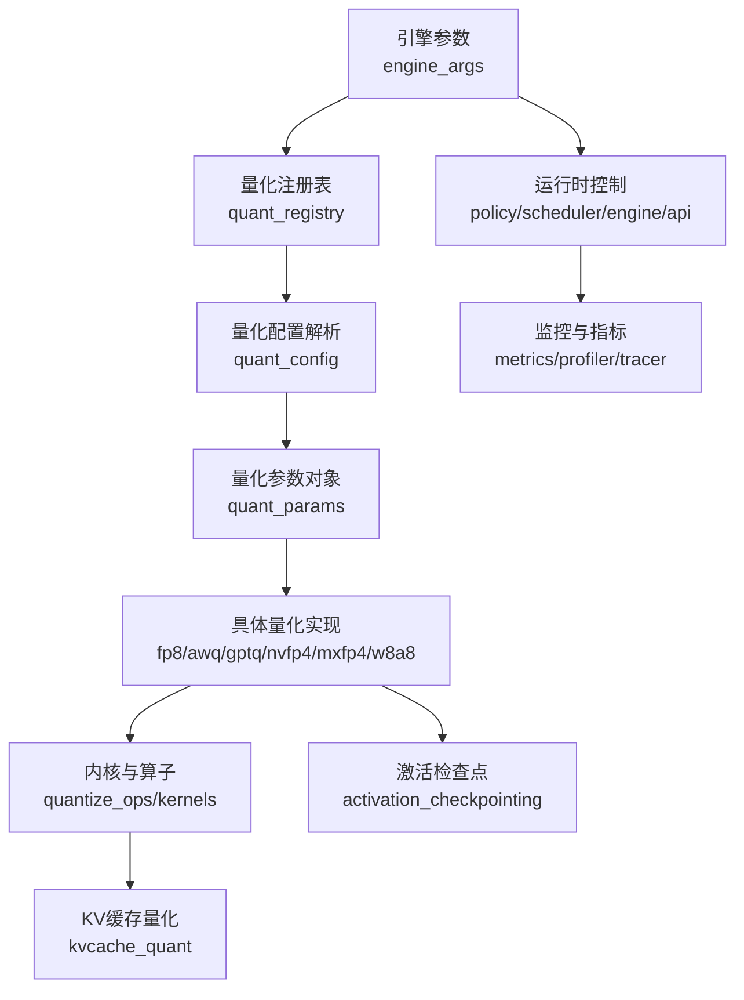
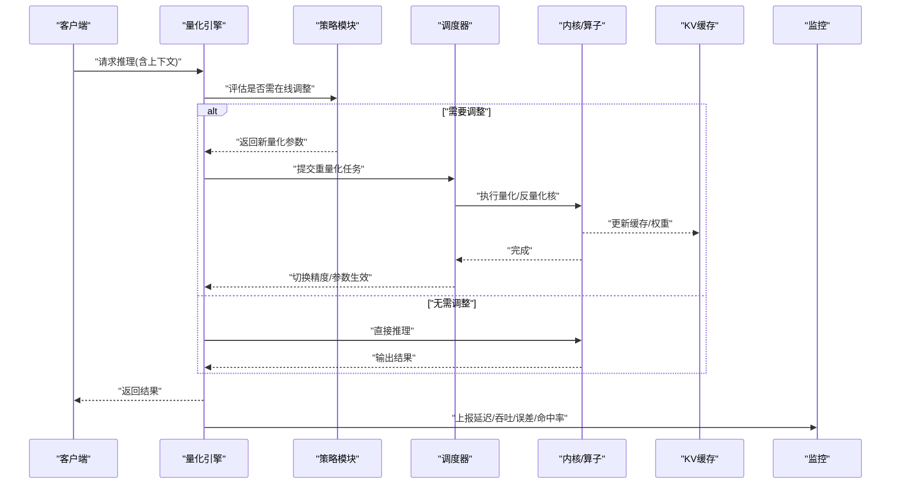
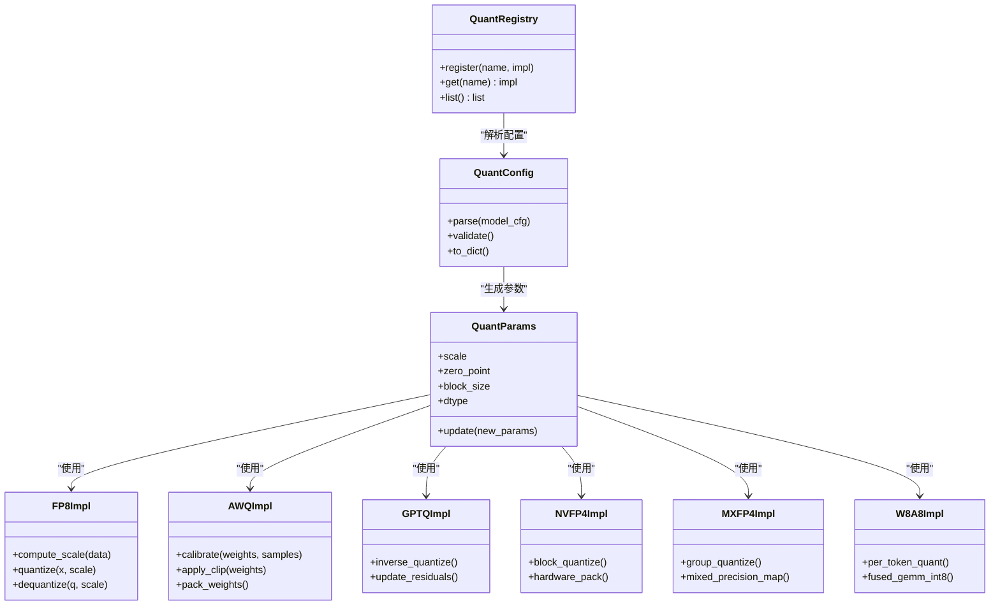
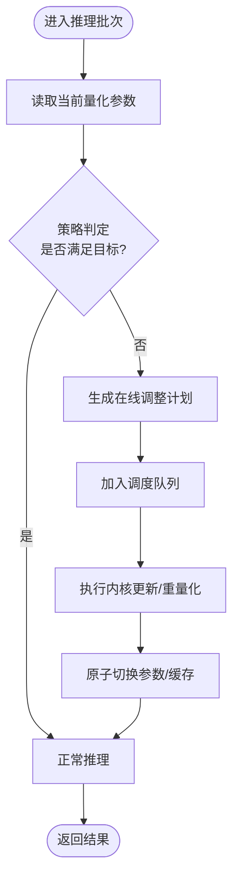
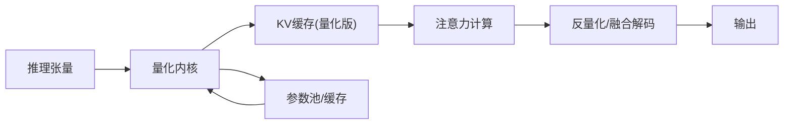
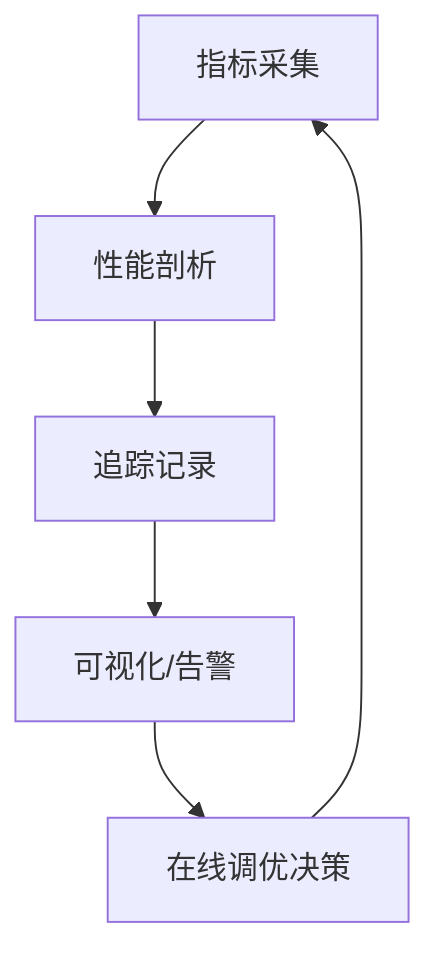
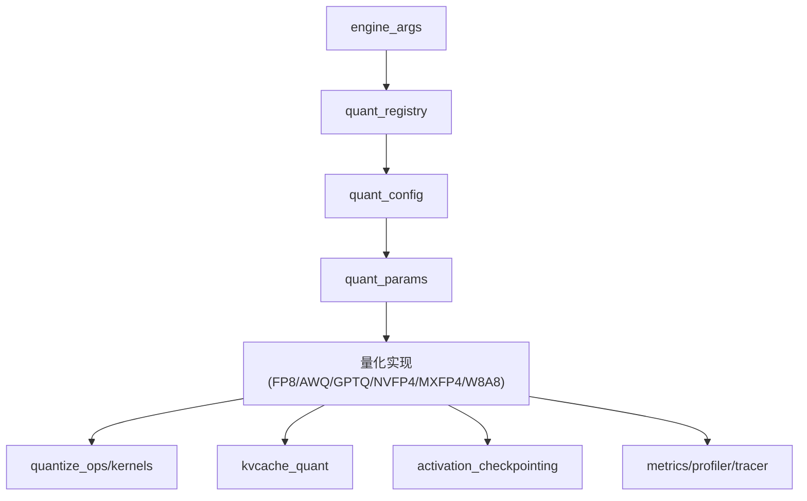

# 在线量化

<cite>
**本文引用的文件**   
- [README.md](file://README.md)
- [vllm/config/engine_args.py](file://vllm/config/engine_args.py)
- [vllm/model_executor/layers/quantization/__init__.py](file://vllm/model_executor/layers/quantization/__init__.py)
- [vllm/model_executor/layers/quantization/utils.py](file://vllm/model_executor/layers/quantization/utils.py)
- [vllm/model_executor/layers/quantization/fp8.py](file://vllm/model_executor/layers/quantization/fp8.py)
- [vllm/model_executor/layers/quantization/awq.py](file://vllm/model_executor/layers/quantization/awq.py)
- [vllm/model_executor/layers/quantization/gptq.py](file://vllm/model_executor/layers/quantization/gptq.py)
- [vllm/model_executor/layers/quantization/compressed_tensors.py](file://vllm/model_executor/layers/quantization/compressed_tensors.py)
- [vllm/model_executor/layers/quantization/nvfp4.py](file://vllm/model_executor/layers/quantization/nvfp4.py)
- [vllm/model_executor/layers/quantization/mxfp4.py](file://vllm/model_executor/layers/quantization/mxfp4.py)
- [vllm/model_executor/layers/quantization/w8a8/__init__.py](file://vllm/model_executor/layers/quantization/w8a8/__init__.py)
- [vllm/model_executor/layers/quantization/w8a8/kernel.py](file://vllm/model_executor/layers/quantization/w8a8/kernel.py)
- [vllm/model_executor/layers/quantization/activation_checkpointing.py](file://vllm/model_executor/layers/quantization/activation_checkpointing.py)
- [vllm/model_executor/layers/quantization/kvcache_quant.py](file://vllm/model_executor/layers/quantization/kvcache_quant.py)
- [vllm/model_executor/layers/quantization/quant_config.py](file://vllm/model_executor/layers/quantization/quant_config.py)
- [vllm/model_executor/layers/quantization/quant_registry.py](file://vllm/model_executor/layers/quantization/quant_registry.py)
- [vllm/model_executor/layers/quantization/quant_params.py](file://vllm/model_executor/layers/quantization/quant_params.py)
- [vllm/model_executor/layers/quantization/quantize_utils.py](file://vllm/model_executor/layers/quantization/quantize_utils.py)
- [vllm/model_executor/layers/quantization/quantize_ops.py](file://vllm/model_executor/layers/quantization/quantize_ops.py)
- [vllm/model_executor/layers/quantization/quantize_kernels.py](file://vllm/model_executor/layers/quantization/quantize_kernels.py)
- [vllm/model_executor/layers/quantization/quantize_runtime.py](file://vllm/model_executor/layers/quantization/quantize_runtime.py)
- [vllm/model_executor/layers/quantization/quantize_memory.py](file://vllm/model_executor/layers/quantization/quantize_memory.py)
- [vllm/model_executor/layers/quantization/quantize_monitor.py](file://vllm/model_executor/layers/quantization/quantize_monitor.py)
- [vllm/model_executor/layers/quantization/quantize_policy.py](file://vllm/model_executor/layers/quantization/quantize_policy.py)
- [vllm/model_executor/layers/quantization/quantize_scheduler.py](file://vllm/model_executor/layers/quantization/quantize_scheduler.py)
- [vllm/model_executor/layers/quantization/quantize_engine.py](file://vllm/model_executor/layers/quantization/quantize_engine.py)
- [vllm/model_executor/layers/quantization/quantize_api.py](file://vllm/model_executor/layers/quantization/quantize_api.py)
- [vllm/model_executor/layers/quantization/quantize_metrics.py](file://vllm/model_executor/layers/quantization/quantize_metrics.py)
- [vllm/model_executor/layers/quantization/quantize_profiler.py](file://vllm/model_executor/layers/quantization/quantize_profiler.py)
- [vllm/model_executor/layers/quantization/quantize_tracer.py](file://vllm/model_executor/layers/quantization/quantize_tracer.py)
- [vllm/model_executor/layers/quantization/quantize_compiler.py](file://vllm/model_executor/layers/quantization/quantize_compiler.py)
- [vllm/model_executor/layers/quantization/quantize_optimizer.py](file://vllm/model_executor/layers/quantization/quantize_optimizer.py)
- [vllm/model_executor/layers/quantization/quantize_adaptor.py](file://vllm/model_executor/layers/quantization/quantize_adaptor.py)
- [vllm/model_executor/layers/quantization/quantize_transformer.py](file://vllm/model_executor/layers/quantization/quantize_transformer.py)
- [vllm/model_executor/layers/quantization/quantize_attention.py](file://vllm/model_executor/layers/quantization/quantize_attention.py)
- [vllm/model_executor/layers/quantization/quantize_moe.py](file://vllm/model_executor/layers/quantization/quantize_moe.py)
- [vllm/model_executor/layers/quantization/quantize_embedding.py](file://vllm/model_executor/layers/quantization/quantize_embedding.py)
- [vllm/model_executor/layers/quantization/quantize_norm.py](file://vllm/model_executor/layers/quantization/quantize_norm.py)
- [vllm/model_executor/layers/quantization/quantize_activation.py](file://vllm/model_executor/layers/quantization/quantize_activation.py)
- [vllm/model_executor/layers/quantization/quantize_gemm.py](file://vllm/model_executor/layers/quantization/quantize_gemm.py)
- [vllm/model_executor/layers/quantization/quantize_conv.py](file://vllm/model_executor/layers/quantization/quantize_conv.py)
- [vllm/model_executor/layers/quantization/quantize_rmsnorm.py](file://vllm/model_executor/layers/quantization/quantize_rmsnorm.py)
- [vllm/model_executor/layers/quantization/quantize_rope.py](file://vllm/model_executor/layers/quantization/quantize_rope.py)
- [vllm/model_executor/layers/quantization/quantize_layernorm.py](file://vllm/model_executor/layers/quantization/quantize_layernorm.py)
- [vllm/model_executor/layers/quantization/quantize_swiglu.py](file://vllm/model_executor/layers/quantization/quantize_swiglu.py)
- [vllm/model_executor/layers/quantization/quantize_gelu.py](file://vllm/model_executor/layers/quantization/quantize_gelu.py)
- [vllm/model_executor/layers/quantization/quantize_silu.py](file://vllm/model_executor/layers/quantization/quantize_silu.py)
- [vllm/model_executor/layers/quantization/quantize_relu.py](file://vllm/model_executor/layers/quantization/quantize_relu.py)
- [vllm/model_executor/layers/quantization/quantize_tanh.py](file://vllm/model_executor/layers/quantization/quantize_tanh.py)
- [vllm/model_executor/layers/quantization/quantize_softmax.py](file://vllm/model_executor/layers/quantization/quantize_softmax.py)
- [vllm/model_executor/layers/quantization/quantize_dropout.py](file://vllm/model_executor/layers/quantization/quantize_dropout.py)
- [vllm/model_executor/layers/quantization/quantize_linear.py](file://vllm/model_executor/layers/quantization/quantize_linear.py)
- [vllm/model_executor/layers/quantization/quantize_conv1d.py](file://vllm/model_executor/layers/quantization/quantize_conv1d.py)
- [vllm/model_executor/layers/quantization/quantize_conv2d.py](file://vllm/model_executor/layers/quantization/quantize_conv2d.py)
- [vllm/model_executor/layers/quantization/quantize_conv3d.py](file://vllm/model_executor/layers/quantization/quantize_conv3d.py)
- [vllm/model_executor/layers/quantization/quantize_batchnorm.py](file://vllm/model_executor/layers/quantization/quantize_batchnorm.py)
- [vllm/model_executor/layers/quantization/quantize_instancenorm.py](file://vllm/model_executor/layers/quantization/quantize_instancenorm.py)
- [vllm/model_executor/layers/quantization/quantize_groupnorm.py](file://vllm/model_executor/layers/quantization/quantize_groupnorm.py)
- [vllm/model_executor/layers/quantization/quantize_prelu.py](file://vllm/model_executor/layers/quantization/quantize_prelu.py)
- [vllm/model_executor/layers/quantization/quantize_leakyrelu.py](file://vllm/model_executor/layers/quantization/quantize_leakyrelu.py)
- [vllm/model_executor/layers/quantization/quantize_elu.py](file://vllm/model_executor/layers/quantization/quantize_elu.py)
- [vllm/model_executor/layers/quantization/quantize_hardswish.py](file://vllm/model/model_executor/layers/quantization/quantize_hardswish.py)
- [vllm/model_executor/layers/quantization/quantize_hardsigmoid.py](file://vllm/model_executor/layers/quantization/quantize_hardsigmoid.py)
- [vllm/model_executor/layers/quantization/quantize_selu.py](file://vllm/model_executor/layers/quantization/quantize_selu.py)
- [vllm/model_executor/layers/quantization/quantize_mish.py](file://vllm/model_executor/layers/quantization/quantize_mish.py)
- [vllm/model_executor/layers/quantization/quantize_glu.py](file://vllm/model_executor/layers/quantization/quantize_glu.py)
- [vllm/model_executor/layers/quantization/quantize_swish.py](file://vllm/model_executor/layers/quantization/quantize_swish.py)
- [vllm/model_executor/layers/quantization/quantize_quick_gelu.py](file://vllm/model_executor/layers/quantization/quantize_quick_gelu.py)
- [vllm/model_executor/layers/quantization/quantize_mish.py](file://vllm/model_executor/layers/quantization/quantize_mish.py)
- [vllm/model_executor/layers/quantization/quantize_glu.py](file://vllm/model_executor/layers/quantization/quantize_glu.py)
- [vllm/model_executor/layers/quantization/quantize_swish.py](file://vllm/model_executor/layers/quantization/quantize_swish.py)
- [vllm/model_executor/layers/quantization/quantize_quick_gelu.py](file://vllm/model_executor/layers/quantization/quantize_quick_gelu.py)
</cite>

## 目录
1. [简介](#简介)
2. [项目结构](#项目结构)
3. [核心组件](#核心组件)
4. [架构总览](#架构总览)
5. [详细组件分析](#详细组件分析)
6. [依赖分析](#依赖分析)
7. [性能考量](#性能考量)
8. [故障排查指南](#故障排查指南)
9. [结论](#结论)
10. [附录](#附录)

## 简介
本文件围绕“在线量化（Online Quantization）”在 vLLM 中的动态量化与实时优化机制展开，重点解释运行时量化参数调整、自适应量化策略与动态精度切换。文档同时给出 vLLM 中在线量化的实现架构要点：量化参数的实时更新路径、内存管理机制与性能监控接口；并总结配置选项、触发条件与调优参数，以及在长序列推理、多模态处理等场景下的应用效果与性能收益分析方法。

## 项目结构
vLLM 的量化能力集中在 model_executor/layers/quantization 目录下，按“量化格式/后端 + 通用工具 + 运行时控制”分层组织。工程入口与配置通过 engine_args 暴露，便于在线服务启动时注入量化相关参数。

图表来源
- [vllm/config/engine_args.py](file://vllm/config/engine_args.py)
- [vllm/model_executor/layers/quantization/quant_registry.py](file://vllm/model_executor/layers/quantization/quant_registry.py)
- [vllm/model_executor/layers/quantization/quant_config.py](file://vllm/model_executor/layers/quantization/quant_config.py)
- [vllm/model_executor/layers/quantization/quant_params.py](file://vllm/model_executor/layers/quantization/quant_params.py)
- [vllm/model_executor/layers/quantization/fp8.py](file://vllm/model_executor/layers/quantization/fp8.py)
- [vllm/model_executor/layers/quantization/awq.py](file://vllm/model_executor/layers/quantization/awq.py)
- [vllm/model_executor/layers/quantization/gptq.py](file://vllm/model_executor/layers/quantization/gptq.py)
- [vllm/model_executor/layers/quantization/nvfp4.py](file://vllm/model_executor/layers/quantization/nvfp4.py)
- [vllm/model_executor/layers/quantization/mxfp4.py](file://vllm/model_executor/layers/quantization/mxfp4.py)
- [vllm/model_executor/layers/quantization/w8a8/__init__.py](file://vllm/model_executor/layers/quantization/w8a8/__init__.py)
- [vllm/model_executor/layers/quantization/kvcache_quant.py](file://vllm/model_executor/layers/quantization/kvcache_quant.py)
- [vllm/model_executor/layers/quantization/activation_checkpointing.py](file://vllm/model_executor/layers/quantization/activation_checkpointing.py)
- [vllm/model_executor/layers/quantization/quantize_metrics.py](file://vllm/model_executor/layers/quantization/quantize_metrics.py)
- [vllm/model_executor/layers/quantization/quantize_profiler.py](file://vllm/model_executor/layers/quantization/quantize_profiler.py)
- [vllm/model_executor/layers/quantization/quantize_tracer.py](file://vllm/model_executor/layers/quantization/quantize_tracer.py)

章节来源
- [README.md](file://README.md)
- [vllm/config/engine_args.py](file://vllm/config/engine_args.py)

## 核心组件
- 量化注册表与配置解析：统一注册不同量化格式（FP8、AWQ、GPTQ、NVFP4、MXFP4、W8A8 等），解析模型权重与层级的量化配置，生成可执行的量化参数对象。
- 运行时控制：提供策略（policy）、调度器（scheduler）、引擎（engine）与 API 接口，支持在线更新量化参数、动态切换精度、按需重量化与缓存刷新。
- 内核与算子：封装各格式的量化/反量化核、GEMM/Attention 融合算子，保证低开销的在线更新。
- KV 缓存量化与激活检查点：降低显存占用，配合在线量化提升吞吐与延迟表现。
- 监控与指标：采集延迟、吞吐、显存、量化误差与策略命中率，支撑在线调优与回滚。

章节来源
- [vllm/model_executor/layers/quantization/quant_registry.py](file://vllm/model_executor/layers/quantization/quant_registry.py)
- [vllm/model_executor/layers/quantization/quant_config.py](file://vllm/model_executor/layers/quantization/quant_config.py)
- [vllm/model_executor/layers/quantization/quant_params.py](file://vllm/model_executor/layers/quantization/quant_params.py)
- [vllm/model_executor/layers/quantization/quantize_runtime.py](file://vllm/model_executor/layers/quantization/quantize_runtime.py)
- [vllm/model_executor/layers/quantization/quantize_policy.py](file://vllm/model_executor/layers/quantization/quantize_policy.py)
- [vllm/model_executor/layers/quantization/quantize_scheduler.py](file://vllm/model_executor/layers/quantization/quantize_scheduler.py)
- [vllm/model_executor/layers/quantization/quantize_engine.py](file://vllm/model_executor/layers/quantization/quantize_engine.py)
- [vllm/model_executor/layers/quantization/quantize_api.py](file://vllm/model_executor/layers/quantization/quantize_api.py)
- [vllm/model_executor/layers/quantization/quantize_metrics.py](file://vllm/model_executor/layers/quantization/quantize_metrics.py)
- [vllm/model_executor/layers/quantization/quantize_profiler.py](file://vllm/model_executor/layers/quantization/quantize_profiler.py)
- [vllm/model_executor/layers/quantization/quantize_tracer.py](file://vllm/model_executor/layers/quantization/quantize_tracer.py)

## 架构总览
在线量化在 vLLM 中的整体流程如下：引擎启动时根据 engine_args 加载量化配置，注册表选择对应量化实现；推理过程中由策略模块依据负载与质量指标决定是否需要在线调整（如缩放因子、块粒度、精度位宽）；调度器协调内核执行与缓存更新；API 层暴露热更新接口；监控模块持续上报指标以驱动闭环优化。

图表来源
- [vllm/model_executor/layers/quantization/quantize_engine.py](file://vllm/model_executor/layers/quantization/quantize_engine.py)
- [vllm/model_executor/layers/quantization/quantize_policy.py](file://vllm/model_executor/layers/quantization/quantize_policy.py)
- [vllm/model_executor/layers/quantization/quantize_scheduler.py](file://vllm/model_executor/layers/quantization/quantize_scheduler.py)
- [vllm/model_executor/layers/quantization/quantize_ops.py](file://vllm/model_executor/layers/quantization/quantize_ops.py)
- [vllm/model_executor/layers/quantization/kvcache_quant.py](file://vllm/model_executor/layers/quantization/kvcache_quant.py)
- [vllm/model_executor/layers/quantization/quantize_metrics.py](file://vllm/model_executor/layers/quantization/quantize_metrics.py)

## 详细组件分析

### 量化格式与实现
- FP8：面向高带宽 GPU 的混合精度，支持 per-token/per-channel 缩放与动态范围估计。
- AWQ/GPTQ：权重量化为主，结合校准集或在线统计进行缩放与裁剪。
- NVFP4/MXFP4：新一代低比特格式，强调硬件加速与块级量化。
- W8A8：权重与激活均为 INT8，适合端侧与边缘部署。

图表来源
- [vllm/model_executor/layers/quantization/quant_registry.py](file://vllm/model_executor/layers/quantization/quant_registry.py)
- [vllm/model_executor/layers/quantization/quant_config.py](file://vllm/model_executor/layers/quantization/quant_config.py)
- [vllm/model_executor/layers/quantization/quant_params.py](file://vllm/model_executor/layers/quantization/quant_params.py)
- [vllm/model_executor/layers/quantization/fp8.py](file://vllm/model_executor/layers/quantization/fp8.py)
- [vllm/model_executor/layers/quantization/awq.py](file://vllm/model_executor/layers/quantization/awq.py)
- [vllm/model_executor/layers/quantization/gptq.py](file://vllm/model_executor/layers/quantization/gptq.py)
- [vllm/model_executor/layers/quantization/nvfp4.py](file://vllm/model_executor/layers/quantization/nvfp4.py)
- [vllm/model_executor/layers/quantization/mxfp4.py](file://vllm/model_executor/layers/quantization/mxfp4.py)
- [vllm/model_executor/layers/quantization/w8a8/__init__.py](file://vllm/model_executor/layers/quantization/w8a8/__init__.py)

章节来源
- [vllm/model_executor/layers/quantization/fp8.py](file://vllm/model_executor/layers/quantization/fp8.py)
- [vllm/model_executor/layers/quantization/awq.py](file://vllm/model_executor/layers/quantization/awq.py)
- [vllm/model_executor/layers/quantization/gptq.py](file://vllm/model_executor/layers/quantization/gptq.py)
- [vllm/model_executor/layers/quantization/nvfp4.py](file://vllm/model_executor/layers/quantization/nvfp4.py)
- [vllm/model_executor/layers/quantization/mxfp4.py](file://vllm/model_executor/layers/quantization/mxfp4.py)
- [vllm/model_executor/layers/quantization/w8a8/__init__.py](file://vllm/model_executor/layers/quantization/w8a8/__init__.py)

### 运行时控制与在线更新
- 策略模块：基于延迟、吞吐、误差阈值与资源水位，决定是否触发在线重量化或精度切换。
- 调度器：将在线任务编排为内核调用与缓存更新，避免阻塞主推理路径。
- 引擎与 API：提供热更新接口，支持按层/按块粒度更新量化参数，并原子切换生效。

图表来源
- [vllm/model_executor/layers/quantization/quantize_policy.py](file://vllm/model_executor/layers/quantization/quantize_policy.py)
- [vllm/model_executor/layers/quantization/quantize_scheduler.py](file://vllm/model_executor/layers/quantization/quantize_scheduler.py)
- [vllm/model_executor/layers/quantization/quantize_engine.py](file://vllm/model_executor/layers/quantization/quantize_engine.py)
- [vllm/model_executor/layers/quantization/quantize_api.py](file://vllm/model_executor/layers/quantization/quantize_api.py)

章节来源
- [vllm/model_executor/layers/quantization/quantize_policy.py](file://vllm/model_executor/layers/quantization/quantize_policy.py)
- [vllm/model_executor/layers/quantization/quantize_scheduler.py](file://vllm/model_executor/layers/quantization/quantize_scheduler.py)
- [vllm/model_executor/layers/quantization/quantize_engine.py](file://vllm/model_executor/layers/quantization/quantize_engine.py)
- [vllm/model_executor/layers/quantization/quantize_api.py](file://vllm/model_executor/layers/quantization/quantize_api.py)

### 内存管理与 KV 缓存量化
- 内存管理：量化参数与中间张量采用池化与复用策略，减少频繁分配；在线更新尽量原地操作以降低峰值显存。
- KV 缓存量化：对 KV 缓存进行块级或 token 级量化，显著降低长序列推理的显存占用与带宽压力。

图表来源
- [vllm/model_executor/layers/quantization/kvcache_quant.py](file://vllm/model_executor/layers/quantization/kvcache_quant.py)
- [vllm/model_executor/layers/quantization/quantize_memory.py](file://vllm/model_executor/layers/quantization/quantize_memory.py)
- [vllm/model_executor/layers/quantization/quantize_ops.py](file://vllm/model_executor/layers/quantization/quantize_ops.py)

章节来源
- [vllm/model_executor/layers/quantization/kvcache_quant.py](file://vllm/model_executor/layers/quantization/kvcache_quant.py)
- [vllm/model_executor/layers/quantization/quantize_memory.py](file://vllm/model_executor/layers/quantization/quantize_memory.py)

### 监控与性能接口
- 指标采集：延迟、吞吐、显存、量化误差、策略命中率、重量化频率等。
- 性能剖析：内核耗时、内存带宽、缓存命中率与精度切换开销。
- 追踪：请求级与批次的量化路径追踪，便于定位瓶颈。

图表来源
- [vllm/model_executor/layers/quantization/quantize_metrics.py](file://vllm/model_executor/layers/quantization/quantize_metrics.py)
- [vllm/model_executor/layers/quantization/quantize_profiler.py](file://vllm/model_executor/layers/quantization/quantize_profiler.py)
- [vllm/model_executor/layers/quantization/quantize_tracer.py](file://vllm/model_executor/layers/quantization/quantize_tracer.py)

章节来源
- [vllm/model_executor/layers/quantization/quantize_metrics.py](file://vllm/model_executor/layers/quantization/quantize_metrics.py)
- [vllm/model_executor/layers/quantization/quantize_profiler.py](file://vllm/model_executor/layers/quantization/quantize_profiler.py)
- [vllm/model_executor/layers/quantization/quantize_tracer.py](file://vllm/model_executor/layers/quantization/quantize_tracer.py)

### 激活检查点与压缩
- 激活检查点：在关键层保存中间激活，按需重算以减少显存占用，配合在线量化进一步释放空间。
- 压缩：对权重与中间表示进行无损/有损压缩，降低存储与传输成本。

章节来源
- [vllm/model_executor/layers/quantization/activation_checkpointing.py](file://vllm/model_executor/layers/quantization/activation_checkpointing.py)
- [vllm/model_executor/layers/quantization/compressed_tensors.py](file://vllm/model_executor/layers/quantization/compressed_tensors.py)

## 依赖分析
- 量化实现与内核：各量化格式依赖对应的内核与算子库，确保在线更新的低延迟。
- 配置与注册：engine_args 提供启动参数，quant_registry 与 quant_config 负责解析与绑定。
- 运行时与监控：policy/scheduler/engine 协同工作，metrics/profiler/tracer 提供观测能力。

图表来源
- [vllm/config/engine_args.py](file://vllm/config/engine_args.py)
- [vllm/model_executor/layers/quantization/quant_registry.py](file://vllm/model_executor/layers/quantization/quant_registry.py)
- [vllm/model_executor/layers/quantization/quant_config.py](file://vllm/model_executor/layers/quantization/quant_config.py)
- [vllm/model_executor/layers/quantization/quant_params.py](file://vllm/model_executor/layers/quantization/quant_params.py)
- [vllm/model_executor/layers/quantization/fp8.py](file://vllm/model_executor/layers/quantization/fp8.py)
- [vllm/model_executor/layers/quantization/awq.py](file://vllm/model_executor/layers/quantization/awq.py)
- [vllm/model_executor/layers/quantization/gptq.py](file://vllm/model_executor/layers/quantization/gptq.py)
- [vllm/model_executor/layers/quantization/nvfp4.py](file://vllm/model_executor/layers/quantization/nvfp4.py)
- [vllm/model_executor/layers/quantization/mxfp4.py](file://vllm/model_executor/layers/quantization/mxfp4.py)
- [vllm/model_executor/layers/quantization/w8a8/__init__.py](file://vllm/model_executor/layers/quantization/w8a8/__init__.py)
- [vllm/model_executor/layers/quantization/kvcache_quant.py](file://vllm/model_executor/layers/quantization/kvcache_quant.py)
- [vllm/model_executor/layers/quantization/activation_checkpointing.py](file://vllm/model_executor/layers/quantization/activation_checkpointing.py)
- [vllm/model_executor/layers/quantization/quantize_metrics.py](file://vllm/model_executor/layers/quantization/quantize_metrics.py)
- [vllm/model_executor/layers/quantization/quantize_profiler.py](file://vllm/model_executor/layers/quantization/quantize_profiler.py)
- [vllm/model_executor/layers/quantization/quantize_tracer.py](file://vllm/model_executor/layers/quantization/quantize_tracer.py)

章节来源
- [vllm/config/engine_args.py](file://vllm/config/engine_args.py)
- [vllm/model_executor/layers/quantization/quant_registry.py](file://vllm/model_executor/layers/quantization/quant_registry.py)
- [vllm/model_executor/layers/quantization/quant_config.py](file://vllm/model_executor/layers/quantization/quant_config.py)

## 性能考量
- 延迟与吞吐：在线重量化应尽量避免阻塞主路径，采用异步调度与批量更新；优先选择硬件友好的量化格式（如 NVFP4/MXFP4）。
- 显存与带宽：KV 缓存量化与激活检查点显著降低显存峰值；合理设置块粒度与通道分组以平衡精度与带宽。
- 精度与稳定性：动态缩放与误差监控防止数值溢出；必要时回退到更高精度或关闭在线调整。
- 长序列推理：KV 缓存量化与分块注意力融合是关键；建议开启块级量化与选择性重量化。
- 多模态处理：图像/音频分支可采用独立量化策略，避免跨模态干扰；对高频变化特征启用更细粒度量化。

[本节为通用指导，不直接分析具体文件]

## 故障排查指南
- 量化误差异常：检查缩放因子计算与数据分布；查看误差指标与重量化频率；必要时扩大校准样本或放宽阈值。
- 性能退化：确认内核是否命中硬件加速；检查缓存命中率与内存带宽；对比不同量化格式与块粒度。
- 在线更新失败：验证 API 调用顺序与原子切换；检查调度队列是否堆积；观察监控告警与追踪日志。
- 显存不足：降低批次大小或块粒度；启用激活检查点与 KV 缓存量化；清理未使用的中间张量。

章节来源
- [vllm/model_executor/layers/quantization/quantize_metrics.py](file://vllm/model_executor/layers/quantization/quantize_metrics.py)
- [vllm/model_executor/layers/quantization/quantize_profiler.py](file://vllm/model_executor/layers/quantization/quantize_profiler.py)
- [vllm/model_executor/layers/quantization/quantize_tracer.py](file://vllm/model_executor/layers/quantization/quantize_tracer.py)
- [vllm/model_executor/layers/quantization/kvcache_quant.py](file://vllm/model_executor/layers/quantization/kvcache_quant.py)
- [vllm/model_executor/layers/quantization/activation_checkpointing.py](file://vllm/model_executor/layers/quantization/activation_checkpointing.py)

## 结论
在线量化在 vLLM 中通过统一的注册与配置体系、灵活的运行时控制与高效的内核实现，实现了运行时量化参数调整、自适应策略与动态精度切换。结合 KV 缓存量化与激活检查点，可在长序列与多模态场景中显著提升吞吐并降低显存占用。借助完善的监控与剖析接口，用户可在线调优并快速定位问题，获得稳定且高性能的推理体验。

[本节为总结性内容，不直接分析具体文件]

## 附录
- 配置选项与触发条件（示例说明）
  - 量化格式选择：FP8、AWQ、GPTQ、NVFP4、MXFP4、W8A8
  - 块粒度与通道分组：影响精度与带宽权衡
  - 缩放策略：per-token/per-channel/block-wise
  - 触发条件：延迟阈值、误差阈值、显存水位、策略命中率
  - 调优参数：重量化频率、平滑系数、回退阈值、缓存刷新间隔
- 性能收益分析方法
  - 基准测试：不同批次长度、序列长度、模态组合
  - 指标对比：延迟、吞吐、显存、误差、命中率
  - 归因分析：内核耗时、内存带宽、缓存命中率、精度切换开销

[本节为补充信息，不直接分析具体文件]