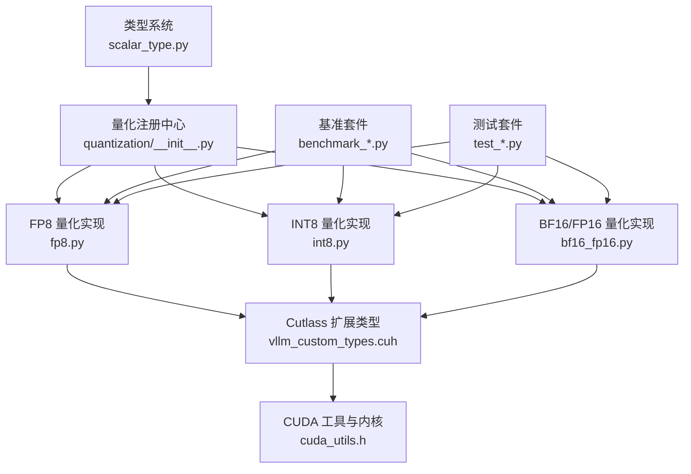
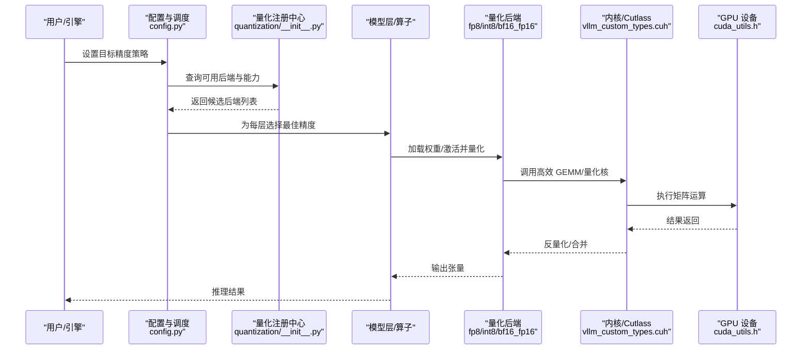
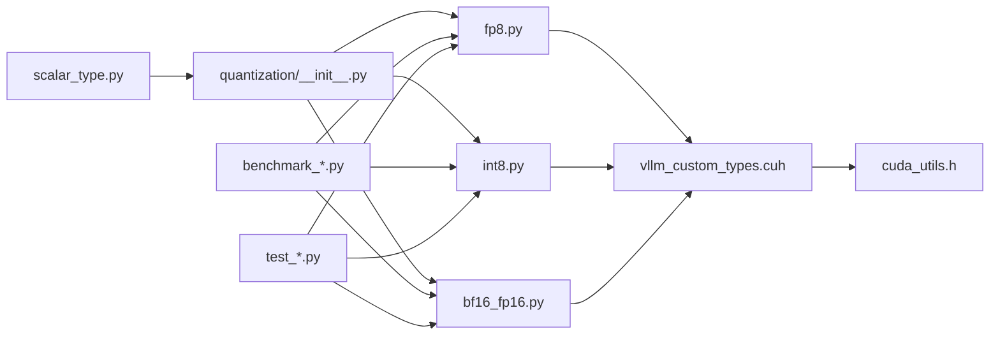

# 混合精度

<cite>
**本文引用的文件**   
- [vllm/scalar_type.py](file://vllm/scalar_type.py)
- [vllm/config.py](file://vllm/config.py)
- [vllm/model_executor/layers/quantization/__init__.py](file://vllm/model_executor/layers/quantization/__init__.py)
- [vllm/model_executor/layers/quantization/fp8.py](file://vllm/model_executor/layers/quantization/fp8.py)
- [vllm/model_executor/layers/quantization/int8.py](file://vllm/model_executor/layers/quantization/int8.py)
- [vllm/model_executor/layers/quantization/bf16_fp16.py](file://vllm/model_executor/layers/quantization/bf16_fp16.py)
- [vllm/kernels/cutlass_extensions/vllm_custom_types.cuh](file://vllm/kernels/cutlass_extensions/vllm_custom_types.cuh)
- [csrc/cuda_utils.h](file://csrc/cuda_utils.h)
- [benchmarks/kernels/benchmark_fp8_gemm.py](file://benchmarks/kernels/benchmark_fp8_gemm.py)
- [benchmarks/kernels/benchmark_int8_gemm.py](file://benchmarks/kernels/benchmark_int8_gemm.py)
- [benchmarks/kernels/benchmark_cutlass_moe_fp8.py](file://benchmarks/kernels/benchmark_cutlass_moe_fp8.py)
- [benchmarks/kernels/benchmark_nvfp4_gemm.py](file://benchmarks/kernels/benchmark_nvfp4_gemm.py)
- [benchmarks/kernels/benchmark_w8a8_block_fp8.py](file://benchmarks/kernels/benchmark_w8a8_block_fp8.py)
- [benchmarks/kernels/benchmark_per_token_quant_fp8.py](file://benchmarks/kernels/benchmark_per_token_quant_fp8.py)
- [tests/kernels/test_fused_quant_activation.py](file://tests/kernels/test_fused_quant_activation.py)
- [tests/kernels/test_punica_ops_fp8.py](file://tests/kernels/test_punica_ops_fp8.py)
- [docs/features/quantization/README.md](file://docs/features/quantization/README.md)
</cite>

## 目录
1. [简介](#简介)
2. [项目结构](#项目结构)
3. [核心组件](#核心组件)
4. [架构总览](#架构总览)
5. [详细组件分析](#详细组件分析)
6. [依赖分析](#依赖分析)
7. [性能考量](#性能考量)
8. [故障排查指南](#故障排查指南)
9. [结论](#结论)
10. [附录](#附录)

## 简介
本文件系统性阐述 vLLM 中“混合精度量化”的策略与实现，覆盖 FP16、BF16、INT8、FP8（含 NVFP4）等精度的组合使用方式；解释层级别的精度分配、自动决策机制与动态切换策略；梳理调度算法在内存占用与计算效率之间的平衡方法；并提供配置参数、性能调优要点与监控指标。文档面向不同技术背景的读者，既提供高层概览，也给出代码级映射与可视化图示。

## 项目结构
vLLM 的混合精度能力由“类型系统 + 量化注册表 + 内核扩展 + 基准与测试”共同构成：
- 类型系统与常量：统一描述可用数据类型与转换规则
- 量化后端注册：按层/算子选择具体量化实现
- 内核扩展：Cutlass/自定义 CUDA 内核对 FP8/INT8/BF16/FP16 的高效支持
- 基准与测试：覆盖 GEMM、MoE、Per-token 量化、激活融合等关键路径
- 文档：特性说明与使用指引

**图表来源** 
- [vllm/scalar_type.py](file://vllm/scalar_type.py)
- [vllm/model_executor/layers/quantization/__init__.py](file://vllm/model_executor/layers/quantization/__init__.py)
- [vllm/model_executor/layers/quantization/fp8.py](file://vllm/model_executor/layers/quantization/fp8.py)
- [vllm/model_executor/layers/quantization/int8.py](file://vllm/model_executor/layers/quantization/int8.py)
- [vllm/model_executor/layers/quantization/bf16_fp16.py](file://vllm/model_executor/layers/quantization/bf16_fp16.py)
- [vllm/kernels/cutlass_extensions/vllm_custom_types.cuh](file://vllm/kernels/cutlass_extensions/vllm_custom_types.cuh)
- [csrc/cuda_utils.h](file://csrc/cuda_utils.h)

**章节来源**
- [vllm/scalar_type.py](file://vllm/scalar_type.py)
- [vllm/model_executor/layers/quantization/__init__.py](file://vllm/model_executor/layers/quantization/__init__.py)
- [vllm/kernels/cutlass_extensions/vllm_custom_types.cuh](file://vllm/kernels/cutlass_extensions/vllm_custom_types.cuh)
- [csrc/cuda_utils.h](file://csrc/cuda_utils.h)

## 核心组件
- 类型系统（scalar_type.py）：定义并枚举可用数据类型（如 FP16、BF16、INT8、FP8、NVFP4），提供类型识别与转换接口，作为混合精度策略的基础。
- 量化注册中心（quantization/__init__.py）：集中管理各量化后端的注册与查找，为模型层选择合适实现提供统一入口。
- 量化实现模块（fp8.py、int8.py、bf16_fp16.py）：分别封装对应精度的权重/激活量化、反量化、GEMM 调用与内存布局优化。
- Cutlass 扩展（vllm_custom_types.cuh）：暴露底层张量类型与数据布局，支撑高效矩阵乘与量化核。
- CUDA 工具（cuda_utils.h）：提供设备能力探测、内存对齐、线程块配置等通用能力。

这些组件共同实现“同一模型内多精度并存”的能力：不同层或不同算子可按需选择最优精度，并在运行时进行必要的类型转换。

**章节来源**
- [vllm/scalar_type.py](file://vllm/scalar_type.py)
- [vllm/model_executor/layers/quantization/__init__.py](file://vllm/model_executor/layers/quantization/__init__.py)
- [vllm/model_executor/layers/quantization/fp8.py](file://vllm/model_executor/layers/quantization/fp8.py)
- [vllm/model_executor/layers/quantization/int8.py](file://vllm/model_executor/layers/quantization/int8.py)
- [vllm/model_executor/layers/quantization/bf16_fp16.py](file://vllm/model_executor/layers/quantization/bf16_fp16.py)
- [vllm/kernels/cutlass_extensions/vllm_custom_types.cuh](file://vllm/kernels/cutlass_extensions/vllm_custom_types.cuh)
- [csrc/cuda_utils.h](file://csrc/cuda_utils.h)

## 架构总览
下图展示了混合精度在 vLLM 中的整体流程：从类型系统到量化后端，再到内核执行与基准验证。

**图表来源** 
- [vllm/config.py](file://vllm/config.py)
- [vllm/model_executor/layers/quantization/__init__.py](file://vllm/model_executor/layers/quantization/__init__.py)
- [vllm/model_executor/layers/quantization/fp8.py](file://vllm/model_executor/layers/quantization/fp8.py)
- [vllm/model_executor/layers/quantization/int8.py](file://vllm/model_executor/layers/quantization/int8.py)
- [vllm/model_executor/layers/quantization/bf16_fp16.py](file://vllm/model_executor/layers/quantization/bf16_fp16.py)
- [vllm/kernels/cutlass_extensions/vllm_custom_types.cuh](file://vllm/kernels/cutlass_extensions/vllm_custom_types.cuh)
- [csrc/cuda_utils.h](file://csrc/cuda_utils.h)

## 详细组件分析

### 类型系统与精度枚举
- 作用：统一描述支持的精度类型，提供类型判断与转换接口，确保跨模块一致性。
- 关键点：
  - 支持 FP16、BF16、INT8、FP8、NVFP4 等类型
  - 提供类型大小、范围、对齐等元信息
  - 为量化后端选择与内存布局规划提供依据

**章节来源**
- [vllm/scalar_type.py](file://vllm/scalar_type.py)

### 量化注册中心与后端选择
- 作用：集中注册各量化后端，提供按能力/约束选择后端的机制。
- 关键点：
  - 后端能力探测（是否支持某精度、硬件特性）
  - 按层/算子维度选择最优后端
  - 支持运行时切换（动态精度）

**章节来源**
- [vllm/model_executor/layers/quantization/__init__.py](file://vllm/model_executor/layers/quantization/__init__.py)

### FP8 量化实现
- 作用：实现 FP8 权重量化、激活量化、GEMM 调用与反量化流程。
- 关键点：
  - 支持 per-channel/per-token 量化策略
  - 与 Cutlass 内核对接，利用 Tensor Core 加速
  - 内存布局优化（如分块存储、对齐）

**章节来源**
- [vllm/model_executor/layers/quantization/fp8.py](file://vllm/model_executor/layers/quantization/fp8.py)
- [vllm/kernels/cutlass_extensions/vllm_custom_types.cuh](file://vllm/kernels/cutlass_extensions/vllm_custom_types.cuh)

### INT8 量化实现
- 作用：实现 INT8 权重量化与 GEMM 加速，常用于低延迟场景。
- 关键点：
  - 对称/非对称量化策略
  - 与 CUTLASS/第三方库集成
  - 激活可保持高精度以减少误差累积

**章节来源**
- [vllm/model_executor/layers/quantization/int8.py](file://vllm/model_executor/layers/quantization/int8.py)

### BF16/FP16 量化实现
- 作用：在高精度与低带宽之间折衷，适用于注意力与归一化等敏感算子。
- 关键点：
  - 自动选择 BF16 或 FP16（基于硬件能力）
  - 数值稳定性处理（缩放、溢出保护）
  - 与 FP8/INT8 混合使用时保证精度收敛

**章节来源**
- [vllm/model_executor/layers/quantization/bf16_fp16.py](file://vllm/model_executor/layers/quantization/bf16_fp16.py)

### 内核扩展与设备能力
- 作用：提供底层张量类型、内存布局与 CUDA 工具函数，支撑高效执行。
- 关键点：
  - 自定义数据类型（FP8/NVFP4）
  - 线程块配置、内存对齐、异步拷贝
  - 设备能力探测（算力、寄存器、共享内存）

**章节来源**
- [vllm/kernels/cutlass_extensions/vllm_custom_types.cuh](file://vllm/kernels/cutlass_extensions/vllm_custom_types.cuh)
- [csrc/cuda_utils.h](file://csrc/cuda_utils.h)

### 基准与测试
- 作用：覆盖关键路径的性能与正确性验证，包括 GEMM、MoE、Per-token 量化、激活融合等。
- 关键点：
  - FP8 GEMM、INT8 GEMM、MoE-FP8、NVFP4 GEMM 等基准
  - Per-token 量化与激活融合测试
  - 端到端正确性与回归测试

**章节来源**
- [benchmarks/kernels/benchmark_fp8_gemm.py](file://benchmarks/kernels/benchmark_fp8_gemm.py)
- [benchmarks/kernels/benchmark_int8_gemm.py](file://benchmarks/kernels/benchmark_int8_gemm.py)
- [benchmarks/kernels/benchmark_cutlass_moe_fp8.py](file://benchmarks/kernels/benchmark_cutlass_moe_fp8.py)
- [benchmarks/kernels/benchmark_nvfp4_gemm.py](file://benchmarks/kernels/benchmark_nvfp4_gemm.py)
- [benchmarks/kernels/benchmark_w8a8_block_fp8.py](file://benchmarks/kernels/benchmark_w8a8_block_fp8.py)
- [benchmarks/kernels/benchmark_per_token_quant_fp8.py](file://benchmarks/kernels/benchmark_per_token_quant_fp8.py)
- [tests/kernels/test_fused_quant_activation.py](file://tests/kernels/test_fused_quant_activation.py)
- [tests/kernels/test_punica_ops_fp8.py](file://tests/kernels/test_punica_ops_fp8.py)

## 依赖分析
混合精度依赖关系如下：类型系统为上层提供基础类型；注册中心协调后端选择；各量化后端依赖 Cutlass 与 CUDA 工具；基准与测试贯穿全链路以保障性能与正确性。

**图表来源** 
- [vllm/scalar_type.py](file://vllm/scalar_type.py)
- [vllm/model_executor/layers/quantization/__init__.py](file://vllm/model_executor/layers/quantization/__init__.py)
- [vllm/model_executor/layers/quantization/fp8.py](file://vllm/model_executor/layers/quantization/fp8.py)
- [vllm/model_executor/layers/quantization/int8.py](file://vllm/model_executor/layers/quantization/int8.py)
- [vllm/model_executor/layers/quantization/bf16_fp16.py](file://vllm/model_executor/layers/quantization/bf16_fp16.py)
- [vllm/kernels/cutlass_extensions/vllm_custom_types.cuh](file://vllm/kernels/cutlass_extensions/vllm_custom_types.cuh)
- [csrc/cuda_utils.h](file://csrc/cuda_utils.h)
- [benchmarks/kernels/benchmark_fp8_gemm.py](file://benchmarks/kernels/benchmark_fp8_gemm.py)
- [benchmarks/kernels/benchmark_int8_gemm.py](file://benchmarks/kernels/benchmark_int8_gemm.py)
- [benchmarks/kernels/benchmark_cutlass_moe_fp8.py](file://benchmarks/kernels/benchmark_cutlass_moe_fp8.py)
- [benchmarks/kernels/benchmark_nvfp4_gemm.py](file://benchmarks/kernels/benchmark_nvfp4_gemm.py)
- [benchmarks/kernels/benchmark_w8a8_block_fp8.py](file://benchmarks/kernels/benchmark_w8a8_block_fp8.py)
- [benchmarks/kernels/benchmark_per_token_quant_fp8.py](file://benchmarks/kernels/benchmark_per_token_quant_fp8.py)
- [tests/kernels/test_fused_quant_activation.py](file://tests/kernels/test_fused_quant_activation.py)
- [tests/kernels/test_punica_ops_fp8.py](file://tests/kernels/test_punica_ops_fp8.py)

**章节来源**
- [vllm/scalar_type.py](file://vllm/scalar_type.py)
- [vllm/model_executor/layers/quantization/__init__.py](file://vllm/model_executor/layers/quantization/__init__.py)
- [vllm/kernels/cutlass_extensions/vllm_custom_types.cuh](file://vllm/kernels/cutlass_extensions/vllm_custom_types.cuh)
- [csrc/cuda_utils.h](file://csrc/cuda_utils.h)
- [benchmarks/kernels/benchmark_fp8_gemm.py](file://benchmarks/kernels/benchmark_fp8_gemm.py)
- [benchmarks/kernels/benchmark_int8_gemm.py](file://benchmarks/kernels/benchmark_int8_gemm.py)
- [benchmarks/kernels/benchmark_cutlass_moe_fp8.py](file://benchmarks/kernels/benchmark_cutlass_moe_fp8.py)
- [benchmarks/kernels/benchmark_nvfp4_gemm.py](file://benchmarks/kernels/benchmark_nvfp4_gemm.py)
- [benchmarks/kernels/benchmark_w8a8_block_fp8.py](file://benchmarks/kernels/benchmark_w8a8_block_fp8.py)
- [benchmarks/kernels/benchmark_per_token_quant_fp8.py](file://benchmarks/kernels/benchmark_per_token_quant_fp8.py)
- [tests/kernels/test_fused_quant_activation.py](file://tests/kernels/test_fused_quant_activation.py)
- [tests/kernels/test_punica_ops_fp8.py](file://tests/kernels/test_punica_ops_fp8.py)

## 性能考量
- 精度选择原则：
  - 注意力与归一化等敏感算子优先 BF16/FP16
  - 大矩阵乘（MLP/线性层）倾向 FP8/INT8 以提升吞吐
  - MoE 路由与专家层可采用 FP8 以降低显存占用
- 内存与带宽：
  - FP8/NVFP4 显著降低权重与中间激活占用
  - 合理分块与对齐可减少内存碎片与访问开销
- 计算效率：
  - 利用 Tensor Core 与 Cutlass 内核最大化吞吐
  - 减少反量化与类型转换次数，避免瓶颈
- 工作负载适配：
  - 预填充阶段：高吞吐优先，倾向更低精度
  - 解码阶段：低延迟优先，注意数值稳定性

[本节为通用指导，不直接分析具体文件]

## 故障排查指南
- 常见症状：
  - 精度不匹配导致内核报错或结果异常
  - 显存不足（未启用足够量化或分块不当）
  - 性能回退（未命中高效内核或频繁类型转换）
- 排查步骤：
  - 检查类型系统与后端注册是否正确
  - 确认硬件能力与内核支持（CUDA/驱动版本）
  - 通过基准脚本定位瓶颈（GEMM/MoE/Per-token）
  - 调整量化粒度（per-channel vs per-token）与块大小
- 参考文件：
  - 类型与配置：[vllm/scalar_type.py](file://vllm/scalar_type.py)、[vllm/config.py](file://vllm/config.py)
  - 量化后端：[vllm/model_executor/layers/quantization/fp8.py](file://vllm/model_executor/layers/quantization/fp8.py)、[vllm/model_executor/layers/quantization/int8.py](file://vllm/model_executor/layers/quantization/int8.py)、[vllm/model_executor/layers/quantization/bf16_fp16.py](file://vllm/model_executor/layers/quantization/bf16_fp16.py)
  - 内核与工具：[vllm/kernels/cutlass_extensions/vllm_custom_types.cuh](file://vllm/kernels/cutlass_extensions/vllm_custom_types.cuh)、[csrc/cuda_utils.h](file://csrc/cuda_utils.h)
  - 基准与测试：[benchmarks/kernels/benchmark_fp8_gemm.py](file://benchmarks/kernels/benchmark_fp8_gemm.py)、[tests/kernels/test_fused_quant_activation.py](file://tests/kernels/test_fused_quant_activation.py)

**章节来源**
- [vllm/scalar_type.py](file://vllm/scalar_type.py)
- [vllm/config.py](file://vllm/config.py)
- [vllm/model_executor/layers/quantization/fp8.py](file://vllm/model_executor/layers/quantization/fp8.py)
- [vllm/model_executor/layers/quantization/int8.py](file://vllm/model_executor/layers/quantization/int8.py)
- [vllm/model_executor/layers/quantization/bf16_fp16.py](file://vllm/model_executor/layers/quantization/bf16_fp16.py)
- [vllm/kernels/cutlass_extensions/vllm_custom_types.cuh](file://vllm/kernels/cutlass_extensions/vllm_custom_types.cuh)
- [csrc/cuda_utils.h](file://csrc/cuda_utils.h)
- [benchmarks/kernels/benchmark_fp8_gemm.py](file://benchmarks/kernels/benchmark_fp8_gemm.py)
- [tests/kernels/test_fused_quant_activation.py](file://tests/kernels/test_fused_quant_activation.py)

## 结论
vLLM 的混合精度体系通过类型系统、量化注册中心与内核扩展协同工作，实现了在同一模型内灵活组合 FP16、BF16、INT8、FP8/NVFP4 的能力。借助层级别精度分配与动态切换策略，可在不同工作负载下取得更优的内存与计算平衡。基准与测试覆盖了关键路径，确保性能与正确性。实际部署时建议结合硬件能力与工作负载特征，选择合适的量化粒度与后端，并通过基准脚本持续评估与调优。

[本节为总结性内容，不直接分析具体文件]

## 附录
- 配置与使用指引：参见量化特性文档，了解参数与开关
- 基准脚本：用于评估 FP8/INT8/BF16/FP16 在不同形状下的吞吐与延迟
- 测试用例：覆盖激活融合、MoE、Per-token 量化等场景

**章节来源**
- [docs/features/quantization/README.md](file://docs/features/quantization/README.md)
- [benchmarks/kernels/benchmark_fp8_gemm.py](file://benchmarks/kernels/benchmark_fp8_gemm.py)
- [benchmarks/kernels/benchmark_int8_gemm.py](file://benchmarks/kernels/benchmark_int8_gemm.py)
- [benchmarks/kernels/benchmark_cutlass_moe_fp8.py](file://benchmarks/kernels/benchmark_cutlass_moe_fp8.py)
- [benchmarks/kernels/benchmark_nvfp4_gemm.py](file://benchmarks/kernels/benchmark_nvfp4_gemm.py)
- [benchmarks/kernels/benchmark_w8a8_block_fp8.py](file://benchmarks/kernels/benchmark_w8a8_block_fp8.py)
- [benchmarks/kernels/benchmark_per_token_quant_fp8.py](file://benchmarks/kernels/benchmark_per_token_quant_fp8.py)
- [tests/kernels/test_fused_quant_activation.py](file://tests/kernels/test_fused_quant_activation.py)
- [tests/kernels/test_punica_ops_fp8.py](file://tests/kernels/test_punica_ops_fp8.py)