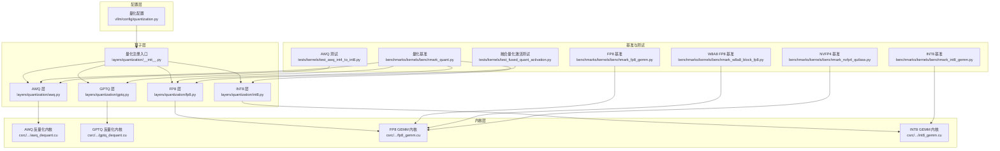
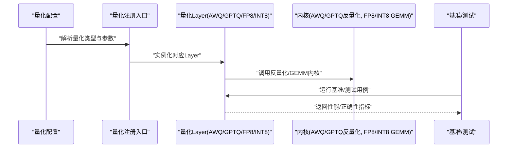
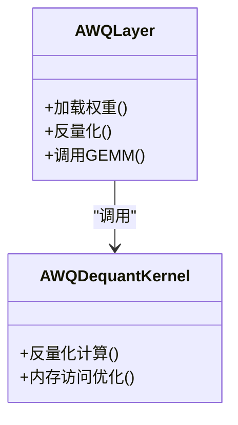
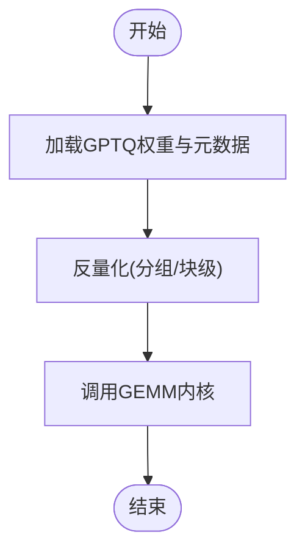
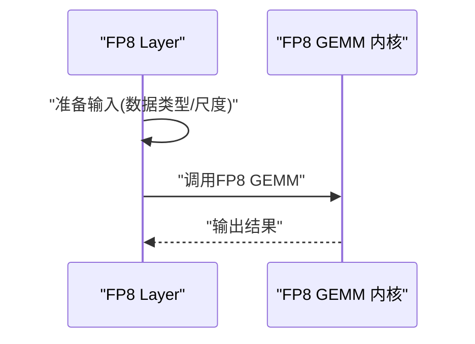
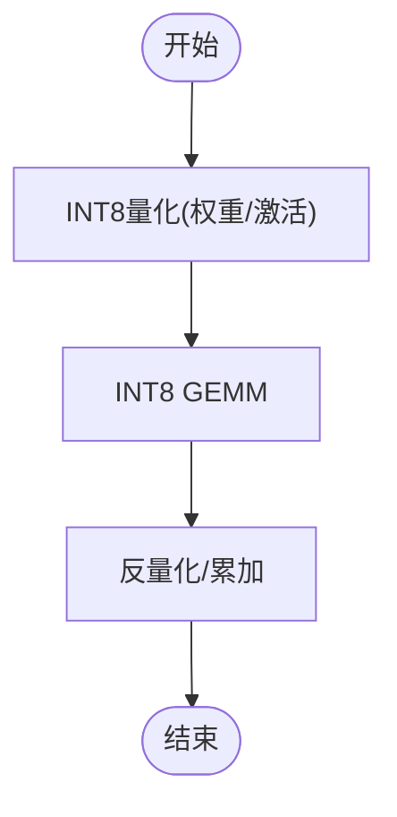
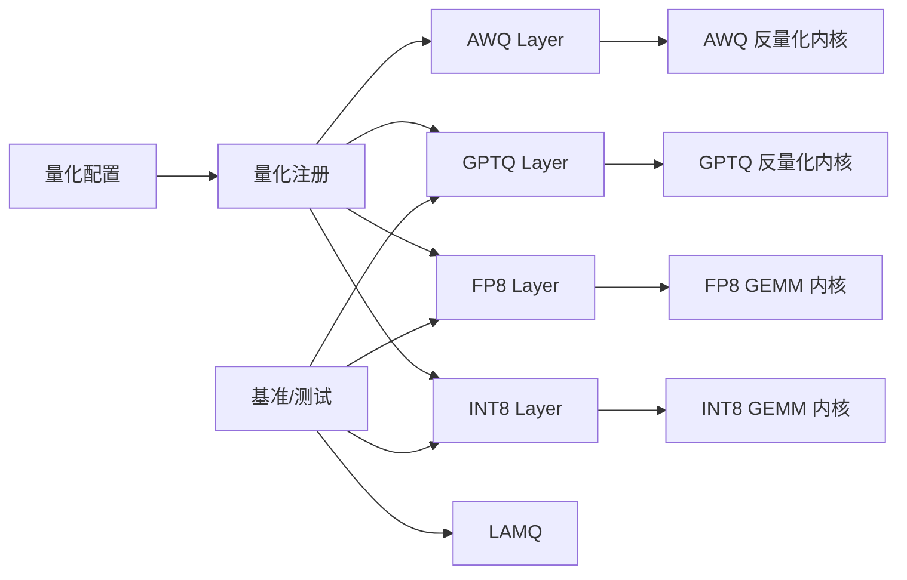

# 量化优化

<cite>
**本文引用的文件**   
- [vllm/config/quantization.py](file://vllm/config/quantization.py)
- [vllm/model_executor/layers/quantization/__init__.py](file://vllm/model_executor/layers/quantization/__init__.py)
- [vllm/model_executor/layers/quantization/awq.py](file://vllm/model_executor/layers/quantization/awq.py)
- [vllm/model_executor/layers/quantization/gptq.py](file://vllm/model_executor/layers/quantization/gptq.py)
- [vllm/model_executor/layers/quantization/fp8.py](file://vllm/model_executor/layers/quantization/fp8.py)
- [vllm/model_executor/layers/quantization/int8.py](file://vllm/model_executor/layers/quantization/int8.py)
- [benchmarks/kernels/benchmark_quant.py](file://benchmarks/kernels/benchmark_quant.py)
- [benchmarks/kernels/benchmark_fp8_gemm.py](file://benchmarks/kernels/benchmark_fp8_gemm.py)
- [benchmarks/kernels/benchmark_int8_gemm.py](file://benchmarks/kernels/benchmark_int8_gemm.py)
- [benchmarks/kernels/benchmark_w8a8_block_fp8.py](file://benchmarks/kernels/benchmark_w8a8_block_fp8.py)
- [benchmarks/kernels/benchmark_nvfp4_qutlass.py](file://benchmarks/kernels/benchmark_nvfp4_qutlass.py)
- [csrc/libtorch_stable/quantization/awq/awq_dequant.cu](file://csrc/libtorch_stable/quantization/awq/awq_dequant.cu)
- [csrc/libtorch_stable/quantization/gptq/gptq_dequant.cu](file://csrc/libtorch_stable/quantization/gptq/gptq_dequant.cu)
- [csrc/libtorch_stable/quantization/fp8/fp8_gemm.cu](file://csrc/libtorch_stable/quantization/fp8/fp8_gemm.cu)
- [csrc/libtorch_stable/quantization/int8/int8_gemm.cu](file://csrc/libtorch_stable/quantization/int8/int8_gemm.cu)
- [tests/kernels/test_awq_int4_to_int8.py](file://tests/kernels/test_awq_int4_to_int8.py)
- [tests/kernels/test_fused_quant_activation.py](file://tests/kernels/test_fused_quant_activation.py)
- [docs/features/quantization/README.md](file://docs/features/quantization/README.md)
</cite>

## 目录
1. [简介](#简介)
2. [项目结构](#项目结构)
3. [核心组件](#核心组件)
4. [架构总览](#架构总览)
5. [详细组件分析](#详细组件分析)
6. [依赖关系分析](#依赖关系分析)
7. [性能考量](#性能考量)
8. [故障排查指南](#故障排查指南)
9. [结论](#结论)
10. [附录](#附录)

## 简介
本文件系统性梳理 vLLM 支持的量化技术与优化方法，覆盖 AWQ、GPTQ、FP8、INT8 等主流方案。内容包含：
- 各方案的原理与适用场景
- 精度损失、推理加速效果与内存占用特征
- 模型转换流程、关键配置参数与最佳实践
- 基准测试方法与结果解读
- 在线量化（动态量化）的实现机制与策略

## 项目结构
vLLM 的量化能力由“配置层 + 算子层 + 内核层 + 基准与测试”构成：
- 配置层：统一注册与解析量化类型、参数与后端选择
- 算子层：按量化类型组织 Layer 实现与权重装载逻辑
- 内核层：CUDA/CPU 内核实现 GEMM、反量化、激活融合等
- 基准与测试：提供量化相关算子的性能与正确性验证

图表来源
- [vllm/config/quantization.py](file://vllm/config/quantization.py)
- [vllm/model_executor/layers/quantization/__init__.py](file://vllm/model_executor/layers/quantization/__init__.py)
- [vllm/model_executor/layers/quantization/awq.py](file://vllm/model_executor/layers/quantization/awq.py)
- [vllm/model_executor/layers/quantization/gptq.py](file://vllm/model_executor/layers/quantization/gptq.py)
- [vllm/model_executor/layers/quantization/fp8.py](file://vllm/model_executor/layers/quantization/fp8.py)
- [vllm/model_executor/layers/quantization/int8.py](file://vllm/model_executor/layers/quantization/int8.py)
- [csrc/libtorch_stable/quantization/awq/awq_dequant.cu](file://csrc/libtorch_stable/quantization/awq/awq_dequant.cu)
- [csrc/libtorch_stable/quantization/gptq/gptq_dequant.cu](file://csrc/libtorch_stable/quantization/gptq/gptq_dequant.cu)
- [csrc/libtorch_stable/quantization/fp8/fp8_gemm.cu](file://csrc/libtorch_stable/quantization/fp8/fp8_gemm.cu)
- [csrc/libtorch_stable/quantization/int8/int8_gemm.cu](file://csrc/libtorch_stable/quantization/int8/int8_gemm.cu)
- [benchmarks/kernels/benchmark_quant.py](file://benchmarks/kernels/benchmark_quant.py)
- [benchmarks/kernels/benchmark_fp8_gemm.py](file://benchmarks/kernels/benchmark_fp8_gemm.py)
- [benchmarks/kernels/benchmark_int8_gemm.py](file://benchmarks/kernels/benchmark_int8_gemm.py)
- [benchmarks/kernels/benchmark_w8a8_block_fp8.py](file://benchmarks/kernels/benchmark_w8a8_block_fp8.py)
- [benchmarks/kernels/benchmark_nvfp4_qutlass.py](file://benchmarks/kernels/benchmark_nvfp4_qutlass.py)
- [tests/kernels/test_awq_int4_to_int8.py](file://tests/kernels/test_awq_int4_to_int8.py)
- [tests/kernels/test_fused_quant_activation.py](file://tests/kernels/test_fused_quant_activation.py)

章节来源
- [vllm/config/quantization.py](file://vllm/config/quantization.py)
- [vllm/model_executor/layers/quantization/__init__.py](file://vllm/model_executor/layers/quantization/__init__.py)

## 核心组件
- 量化配置与注册
  - 通过统一的量化配置模块解析并注册不同量化类型（AWQ/GPTQ/FP8/INT8），并提供默认参数与后端选择策略。
  - 量化注册入口集中管理各量化类型的 Layer 工厂与加载器，确保在模型构建时按需装配。
- 量化 Layer 实现
  - 每种量化方案对应独立的 Layer 实现，封装权重格式、反量化/量化路径、GEMM 调用与激活融合策略。
- 内核实现
  - CUDA 内核提供高效的反量化与 GEMM 计算，针对 AWQ/GPTQ 的稀疏/分组特性进行优化；FP8/INT8 使用专用矩阵乘内核。
- 基准与测试
  - 提供量化算子级基准脚本与单元测试，覆盖正确性与性能回归。

章节来源
- [vllm/config/quantization.py](file://vllm/config/quantization.py)
- [vllm/model_executor/layers/quantization/__init__.py](file://vllm/model_executor/layers/quantization/__init__.py)
- [vllm/model_executor/layers/quantization/awq.py](file://vllm/model_executor/layers/quantization/awq.py)
- [vllm/model_executor/layers/quantization/gptq.py](file://vllm/model_executor/layers/quantization/gptq.py)
- [vllm/model_executor/layers/quantization/fp8.py](file://vllm/model_executor/layers/quantization/fp8.py)
- [vllm/model_executor/layers/quantization/int8.py](file://vllm/model_executor/layers/quantization/int8.py)

## 架构总览
下图展示从配置到执行的内核调用链，体现“配置 → 注册 → Layer → 内核”的分层解耦。

图表来源
- [vllm/config/quantization.py](file://vllm/config/quantization.py)
- [vllm/model_executor/layers/quantization/__init__.py](file://vllm/model_executor/layers/quantization/__init__.py)
- [vllm/model_executor/layers/quantization/awq.py](file://vllm/model_executor/layers/quantization/awq.py)
- [vllm/model_executor/layers/quantization/gptq.py](file://vllm/model_executor/layers/quantization/gptq.py)
- [vllm/model_executor/layers/quantization/fp8.py](file://vllm/model_executor/layers/quantization/fp8.py)
- [vllm/model_executor/layers/quantization/int8.py](file://vllm/model_executor/layers/quantization/int8.py)
- [benchmarks/kernels/benchmark_quant.py](file://benchmarks/kernels/benchmark_quant.py)

## 详细组件分析

### AWQ（Activation-aware Weight Quantization）
- 原理要点
  - 基于激活感知对权重进行分组量化，通常采用 INT4/INT8 权重存储，配合反量化内核在推理时恢复高精度计算。
  - 适合大模型权重压缩，兼顾显存与吞吐。
- 适用场景
  - 文本生成类模型（如 LLaMA、Qwen 系列），对延迟敏感的服务端部署。
- 精度与性能
  - 精度损失较小，尤其在合理分组与校准数据下；反量化开销由专用内核承担。
  - 内存占用显著降低，推理吞吐提升明显。
- 转换流程
  - 离线校准生成量化权重与缩放因子，保存为 AWQ 格式；运行时由 AWQ Layer 加载并调用反量化内核。
- 关键实现
  - AWQ Layer 负责权重装载、反量化调度与 GEMM 调用。
  - 内核实现提供高效反量化路径。

图表来源
- [vllm/model_executor/layers/quantization/awq.py](file://vllm/model_executor/layers/quantization/awq.py)
- [csrc/libtorch_stable/quantization/awq/awq_dequant.cu](file://csrc/libtorch_stable/quantization/awq/awq_dequant.cu)

章节来源
- [vllm/model_executor/layers/quantization/awq.py](file://vllm/model_executor/layers/quantization/awq.py)
- [csrc/libtorch_stable/quantization/awq/awq_dequant.cu](file://csrc/libtorch_stable/quantization/awq/awq_dequant.cu)
- [tests/kernels/test_awq_int4_to_int8.py](file://tests/kernels/test_awq_int4_to_int8.py)

### GPTQ（Generative Pre-trained Transformer Quantization）
- 原理要点
  - 基于二阶近似（Hessian）的逐层量化，支持 INT4/INT8 权重，具备较好的精度保持能力。
- 适用场景
  - 对精度要求较高的生成式模型，尤其是需要低比特权重的部署环境。
- 精度与性能
  - 相比 AWQ，GPTQ 在校准阶段更精细，精度损失更小；反量化内核同样高效。
- 转换流程
  - 离线量化生成权重与元数据；运行时由 GPTQ Layer 加载并调用反量化内核。
- 关键实现
  - GPTQ Layer 封装权重格式与反量化路径；内核实现针对分组与稀疏模式优化。

图表来源
- [vllm/model_executor/layers/quantization/gptq.py](file://vllm/model_executor/layers/quantization/gptq.py)
- [csrc/libtorch_stable/quantization/gptq/gptq_dequant.cu](file://csrc/libtorch_stable/quantization/gptq/gptq_dequant.cu)

章节来源
- [vllm/model_executor/layers/quantization/gptq.py](file://vllm/model_executor/layers/quantization/gptq.py)
- [csrc/libtorch_stable/quantization/gptq/gptq_dequant.cu](file://csrc/libtorch_stable/quantization/gptq/gptq_dequant.cu)

### FP8（8-bit Floating Point）
- 原理要点
  - 使用 E4M3/E5M2 等 FP8 格式进行权重或激活量化，结合硬件原生 FP8 GEMM 实现高吞吐。
- 适用场景
  - 支持 FP8 的 GPU（如 Hopper 架构），追求极致吞吐与能效的场景。
- 精度与性能
  - 精度损失可控，尤其对注意力与 MLP 层；内核直接利用硬件加速，延迟与带宽优势明显。
- 转换流程
  - 可离线量化权重或在线动态量化激活；运行时由 FP8 Layer 调度 GEMM 内核。
- 关键实现
  - FP8 Layer 负责数据类型转换与内核调用；内核实现针对 FP8 矩阵乘优化。

图表来源
- [vllm/model_executor/layers/quantization/fp8.py](file://vllm/model_executor/layers/quantization/fp8.py)
- [csrc/libtorch_stable/quantization/fp8/fp8_gemm.cu](file://csrc/libtorch_stable/quantization/fp8/fp8_gemm.cu)

章节来源
- [vllm/model_executor/layers/quantization/fp8.py](file://vllm/model_executor/layers/quantization/fp8.py)
- [csrc/libtorch_stable/quantization/fp8/fp8_gemm.cu](file://csrc/libtorch_stable/quantization/fp8/fp8_gemm.cu)
- [benchmarks/kernels/benchmark_fp8_gemm.py](file://benchmarks/kernels/benchmark_fp8_gemm.py)
- [benchmarks/kernels/benchmark_w8a8_block_fp8.py](file://benchmarks/kernels/benchmark_w8a8_block_fp8.py)

### INT8（8-bit Integer）
- 原理要点
  - 将权重或激活量化为 INT8，配合 INT8 GEMM 内核实现加速；常与 per-channel/per-token 缩放策略结合。
- 适用场景
  - 通用部署环境，硬件对 INT8 有良好支持时。
- 精度与性能
  - 精度损失相对 FP8 更低，但吞吐可能不及 FP8；内存占用显著下降。
- 转换流程
  - 离线或在线量化；运行时由 INT8 Layer 调用 INT8 GEMM 内核。
- 关键实现
  - INT8 Layer 封装量化/反量化路径；内核实现针对 INT8 矩阵乘优化。

图表来源
- [vllm/model_executor/layers/quantization/int8.py](file://vllm/model_executor/layers/quantization/int8.py)
- [csrc/libtorch_stable/quantization/int8/int8_gemm.cu](file://csrc/libtorch_stable/quantization/int8/int8_gemm.cu)

章节来源
- [vllm/model_executor/layers/quantization/int8.py](file://vllm/model_executor/layers/quantization/int8.py)
- [csrc/libtorch_stable/quantization/int8/int8_gemm.cu](file://csrc/libtorch_stable/quantization/int8/int8_gemm.cu)
- [benchmarks/kernels/benchmark_int8_gemm.py](file://benchmarks/kernels/benchmark_int8_gemm.py)

### NVFP4 与 W8A8 变体
- NVFP4：面向新一代硬件的 4-bit 浮点格式，进一步降低带宽与内存占用，适合极端压缩场景。
- W8A8 Block FP8：以块为单位进行 FP8 量化，平衡精度与吞吐，适用于注意力与 MLP 密集计算。

章节来源
- [benchmarks/kernels/benchmark_nvfp4_qutlass.py](file://benchmarks/kernels/benchmark_nvfp4_qutlass.py)
- [benchmarks/kernels/benchmark_w8a8_block_fp8.py](file://benchmarks/kernels/benchmark_w8a8_block_fp8.py)

### 在线量化（动态量化）机制
- 机制概述
  - 在推理过程中对激活进行动态量化，减少中间表示的内存占用与带宽压力；通常结合每 token 或每块的缩放策略。
- 策略要点
  - 选择合适的量化粒度（per-token/per-block）、缩放估计方法（统计/校准）、以及反量化/融合路径以降低开销。
- 实现位置
  - 动态量化路径在 FP8/INT8 Layer 中实现，并通过内核融合减少额外拷贝与同步。

章节来源
- [vllm/model_executor/layers/quantization/fp8.py](file://vllm/model_executor/layers/quantization/fp8.py)
- [vllm/model_executor/layers/quantization/int8.py](file://vllm/model_executor/layers/quantization/int8.py)
- [tests/kernels/test_fused_quant_activation.py](file://tests/kernels/test_fused_quant_activation.py)

## 依赖关系分析
量化模块之间的依赖呈现清晰的层次结构：配置层驱动注册层，注册层实例化具体 Layer，Layer 再调用底层内核。基准与测试贯穿各层，保障正确性与性能。

图表来源
- [vllm/config/quantization.py](file://vllm/config/quantization.py)
- [vllm/model_executor/layers/quantization/__init__.py](file://vllm/model_executor/layers/quantization/__init__.py)
- [vllm/model_executor/layers/quantization/awq.py](file://vllm/model_executor/layers/quantization/awq.py)
- [vllm/model_executor/layers/quantization/gptq.py](file://vllm/model_executor/layers/quantization/gptq.py)
- [vllm/model_executor/layers/quantization/fp8.py](file://vllm/model_executor/layers/quantization/fp8.py)
- [vllm/model_executor/layers/quantization/int8.py](file://vllm/model_executor/layers/quantization/int8.py)
- [benchmarks/kernels/benchmark_quant.py](file://benchmarks/kernels/benchmark_quant.py)

章节来源
- [vllm/config/quantization.py](file://vllm/config/quantization.py)
- [vllm/model_executor/layers/quantization/__init__.py](file://vllm/model_executor/layers/quantization/__init__.py)
- [benchmarks/kernels/benchmark_quant.py](file://benchmarks/kernels/benchmark_quant.py)

## 性能考量
- 量化方案选择建议
  - 若硬件支持 FP8 且追求极致吞吐：优先 FP8/W8A8 Block FP8/NVFP4。
  - 若需更高精度与广泛兼容：选择 GPTQ 或 INT8。
  - 若关注权重压缩与延迟平衡：AWQ 是稳健选择。
- 内存与带宽
  - 低比特权重显著降低显存占用；动态量化可减少激活中间态内存。
- 内核效率
  - 专用内核（反量化、GEMM）是性能关键；避免不必要的类型转换与内存拷贝。
- 基准方法
  - 使用 benchmark_quant、benchmark_fp8_gemm、benchmark_int8_gemm、benchmark_w8a8_block_fp8、benchmark_nvfp4_qutlass 等脚本进行对比评估。

章节来源
- [benchmarks/kernels/benchmark_quant.py](file://benchmarks/kernels/benchmark_quant.py)
- [benchmarks/kernels/benchmark_fp8_gemm.py](file://benchmarks/kernels/benchmark_fp8_gemm.py)
- [benchmarks/kernels/benchmark_int8_gemm.py](file://benchmarks/kernels/benchmark_int8_gemm.py)
- [benchmarks/kernels/benchmark_w8a8_block_fp8.py](file://benchmarks/kernels/benchmark_w8a8_block_fp8.py)
- [benchmarks/kernels/benchmark_nvfp4_qutlass.py](file://benchmarks/kernels/benchmark_nvfp4_qutlass.py)

## 故障排查指南
- 常见错误定位
  - 量化类型未注册：检查量化配置与注册入口是否匹配。
  - 内核缺失或不兼容：确认 CUDA/硬件版本与内核编译选项。
  - 精度异常：核对校准数据与量化粒度设置。
- 调试手段
  - 使用单元测试（如 test_awq_int4_to_int8、test_fused_quant_activation）验证路径。
  - 通过基准脚本观察性能回归与数值差异。
- 日志与度量
  - 启用量化相关日志，记录缩放因子、数据类型与内核调用信息。

章节来源
- [tests/kernels/test_awq_int4_to_int8.py](file://tests/kernels/test_awq_int4_to_int8.py)
- [tests/kernels/test_fused_quant_activation.py](file://tests/kernels/test_fused_quant_activation.py)
- [docs/features/quantization/README.md](file://docs/features/quantization/README.md)

## 结论
vLLM 的量化体系以分层解耦为核心，通过配置与注册统一管理多种量化方案，并在内核层提供高效实现。AWQ/GPTQ 侧重权重压缩与精度保持，FP8/INT8 强调硬件加速与吞吐，NVFP4/W8A8 则面向新一代硬件与极致压缩。借助完善的基准与测试，用户可根据模型与硬件特点选择合适方案，并结合在线量化策略进一步优化性能与资源占用。

## 附录
- 快速参考
  - 配置与注册：查看量化配置与注册入口文件。
  - Layer 实现：对照各量化类型的 Layer 文件理解权重格式与调用路径。
  - 内核实现：查阅对应 CUDA 内核文件了解计算细节。
  - 基准与测试：使用提供的脚本与单测进行验证与调优。

章节来源
- [vllm/config/quantization.py](file://vllm/config/quantization.py)
- [vllm/model_executor/layers/quantization/__init__.py](file://vllm/model_executor/layers/quantization/__init__.py)
- [vllm/model_executor/layers/quantization/awq.py](file://vllm/model_executor/layers/quantization/awq.py)
- [vllm/model_executor/layers/quantization/gptq.py](file://vllm/model_executor/layers/quantization/gptq.py)
- [vllm/model_executor/layers/quantization/fp8.py](file://vllm/model_executor/layers/quantization/fp8.py)
- [vllm/model_executor/layers/quantization/int8.py](file://vllm/model_executor/layers/quantization/int8.py)
- [csrc/libtorch_stable/quantization/awq/awq_dequant.cu](file://csrc/libtorch_stable/quantization/awq/awq_dequant.cu)
- [csrc/libtorch_stable/quantization/gptq/gptq_dequant.cu](file://csrc/libtorch_stable/quantization/gptq/gptq_dequant.cu)
- [csrc/libtorch_stable/quantization/fp8/fp8_gemm.cu](file://csrc/libtorch_stable/quantization/fp8/fp8_gemm.cu)
- [csrc/libtorch_stable/quantization/int8/int8_gemm.cu](file://csrc/libtorch_stable/quantization/int8/int8_gemm.cu)
- [benchmarks/kernels/benchmark_quant.py](file://benchmarks/kernels/benchmark_quant.py)
- [benchmarks/kernels/benchmark_fp8_gemm.py](file://benchmarks/kernels/benchmark_fp8_gemm.py)
- [benchmarks/kernels/benchmark_int8_gemm.py](file://benchmarks/kernels/benchmark_int8_gemm.py)
- [benchmarks/kernels/benchmark_w8a8_block_fp8.py](file://benchmarks/kernels/benchmark_w8a8_block_fp8.py)
- [benchmarks/kernels/benchmark_nvfp4_qutlass.py](file://benchmarks/kernels/benchmark_nvfp4_qutlass.py)
- [tests/kernels/test_awq_int4_to_int8.py](file://tests/kernels/test_awq_int4_to_int8.py)
- [tests/kernels/test_fused_quant_activation.py](file://tests/kernels/test_fused_quant_activation.py)
- [docs/features/quantization/README.md](file://docs/features/quantization/README.md)