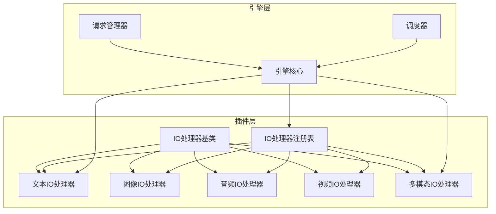
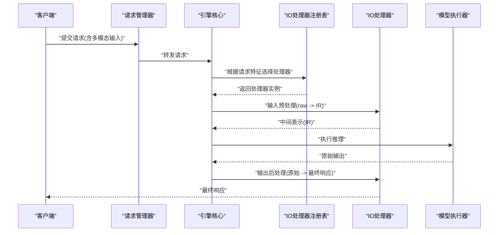
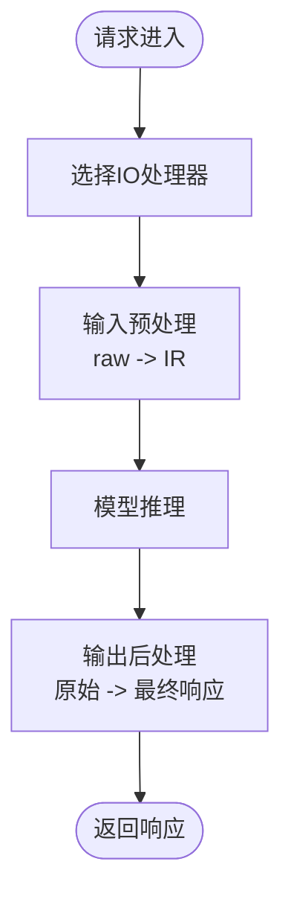

# IO处理器插件

<cite>
**本文引用的文件**   
- [io_processor_plugins.md](file://docs/design/io_processor_plugins.md)
- [mm_processing.md](file://docs/design/mm_processing.md)
- [vllm/plugins/__init__.py](file://vllm/plugins/__init__.py)
- [vllm/plugins/io_processors/__init__.py](file://vllm/plugins/io_processors/__init__.py)
- [vllm/plugins/io_processors/base.py](file://vllm/plugins/io_processors/base.py)
- [vllm/plugins/io_processors/registry.py](file://vllm/plugins/io_processors/registry.py)
- [vllm/plugins/io_processors/text_io_processor.py](file://vllm/plugins/io_processors/text_io_processor.py)
- [vllm/plugins/io_processors/multimodal_io_processor.py](file://vllm/plugins/io_processors/multimodal_io_processor.py)
- [vllm/plugins/io_processors/image_io_processor.py](file://vllm/plugins/io_processors/image_io_processor.py)
- [vllm/plugins/io_processors/audio_io_processor.py](file://vllm/plugins/io_processors/audio_io_processor.py)
- [vllm/plugins/io_processors/video_io_processor.py](file://vllm/plugins/io_processors/video_io_processor.py)
- [vllm/engine/v1/core.py](file://vllm/engine/v1/core.py)
- [vllm/engine/v1/request_manager.py](file://vllm/engine/v1/request_manager.py)
- [vllm/engine/v1/scheduler.py](file://vllm/engine/v1/scheduler.py)
- [tests/plugins_tests/test_io_processors.py](file://tests/plugins_tests/test_io_processors.py)
</cite>

## 目录
1. [简介](#简介)
2. [项目结构](#项目结构)
3. [核心组件](#核心组件)
4. [架构总览](#架构总览)
5. [详细组件分析](#详细组件分析)
6. [依赖关系分析](#依赖关系分析)
7. [性能考虑](#性能考虑)
8. [故障排查指南](#故障排查指南)
9. [结论](#结论)
10. [附录](#附录)

## 简介
本文件系统性介绍 vLLM 的 IO 处理器插件系统，涵盖输入预处理、输出后处理与中间数据转换的职责边界；说明插件开发接口（必需方法与可选钩子）；提供自定义 IO 处理器的完整开发指南；解释多模态数据处理流程（图像、音频、视频）；列举内置 IO 处理器功能与使用方式；总结性能优化技巧与最佳实践；并给出错误处理与调试测试方法。

## 项目结构
IO 处理器插件位于 vLLM 插件体系下，采用“基类 + 注册表 + 具体实现”的分层组织：
- 插件基类定义统一接口与生命周期钩子
- 注册表负责发现、加载与选择 IO 处理器
- 具体处理器按数据类型划分（文本、图像、音频、视频、多模态）
- 引擎在请求编排阶段调用 IO 处理器完成输入预处理与输出后处理

图表来源
- [vllm/plugins/io_processors/base.py](file://vllm/plugins/io_processors/base.py)
- [vllm/plugins/io_processors/registry.py](file://vllm/plugins/io_processors/registry.py)
- [vllm/plugins/io_processors/text_io_processor.py](file://vllm/plugins/io_processors/text_io_processor.py)
- [vllm/plugins/io_processors/image_io_processor.py](file://vllm/plugins/io_processors/image_io_processor.py)
- [vllm/plugins/io_processors/audio_io_processor.py](file://vllm/plugins/io_processors/audio_io_processor.py)
- [vllm/plugins/io_processors/video_io_processor.py](file://vllm/plugins/io_processors/video_io_processor.py)
- [vllm/plugins/io_processors/multimodal_io_processor.py](file://vllm/plugins/io_processors/multimodal_io_processor.py)
- [vllm/engine/v1/core.py](file://vllm/engine/v1/core.py)
- [vllm/engine/v1/request_manager.py](file://vllm/engine/v1/request_manager.py)
- [vllm/engine/v1/scheduler.py](file://vllm/engine/v1/scheduler.py)

章节来源
- [io_processor_plugins.md](file://docs/design/io_processor_plugins.md)
- [mm_processing.md](file://docs/design/mm_processing.md)

## 核心组件
- IO 处理器基类：定义统一的输入预处理、输出后处理、中间数据转换接口以及可选钩子（如初始化、配置校验、资源清理等）。
- 注册表：维护处理器类型到实现的映射，支持按模型或请求特征动态选择处理器。
- 具体处理器：针对文本、图像、音频、视频及多模态数据的专用实现，封装格式解析、归一化、张量构造与解码策略。
- 引擎集成点：在请求进入与返回路径中调用处理器，确保数据在进入推理前与离开推理后处于一致形态。

章节来源
- [vllm/plugins/io_processors/base.py](file://vllm/plugins/io_processors/base.py)
- [vllm/plugins/io_processors/registry.py](file://vllm/plugins/io_processors/registry.py)
- [vllm/plugins/io_processors/text_io_processor.py](file://vllm/plugins/io_processors/text_io_processor.py)
- [vllm/plugins/io_processors/multimodal_io_processor.py](file://vllm/plugins/io_processors/multimodal_io_processor.py)

## 架构总览
IO 处理器插件在 vLLM 的请求生命周期中扮演关键角色：
- 输入预处理：将原始请求（文本、图像、音频、视频或多模态组合）转换为模型可接受的中间表示（如 token 序列、视觉嵌入、对齐元数据）。
- 输出后处理：将模型输出的 logits/采样结果转换为最终响应（文本、结构化输出、媒体片段等），并可执行格式化、截断、过滤等操作。
- 中间数据转换：在不同阶段之间进行必要的类型转换、设备迁移、批内对齐与缓存写入。

图表来源
- [vllm/engine/v1/request_manager.py](file://vllm/engine/v1/request_manager.py)
- [vllm/engine/v1/core.py](file://vllm/engine/v1/core.py)
- [vllm/plugins/io_processors/registry.py](file://vllm/plugins/io_processors/registry.py)
- [vllm/plugins/io_processors/base.py](file://vllm/plugins/io_processors/base.py)

## 详细组件分析

### IO 处理器基类与接口
- 必需方法
  - 输入预处理：接收原始输入，返回中间表示（IR），包含必要元数据（如长度、分辨率、时间戳等）。
  - 输出后处理：接收模型原始输出，生成最终响应，可能涉及解码、拼接、格式化。
  - 中间数据转换：在阶段间进行类型转换、设备迁移、批内对齐、缓存键生成等。
- 可选钩子
  - 初始化钩子：加载外部资源（如编码器权重、查找表）、预热缓存。
  - 配置校验：检查处理器配置项合法性，抛出明确异常。
  - 资源清理：释放显存、关闭句柄、注销回调。
- 错误处理
  - 对非法输入、格式不匹配、尺寸越界等情况进行校验并返回结构化错误信息。
  - 记录上下文以便定位问题（请求ID、处理器类型、输入摘要）。

章节来源
- [vllm/plugins/io_processors/base.py](file://vllm/plugins/io_processors/base.py)

### 注册表与选择策略
- 注册机制：通过装饰器或显式注册函数将处理器实现绑定到类型标识。
- 选择策略：基于模型架构、输入类型、请求参数（如是否启用特定编码）选择最优处理器。
- 扩展性：新增处理器无需修改核心逻辑，只需注册并提供兼容接口。

章节来源
- [vllm/plugins/io_processors/registry.py](file://vllm/plugins/io_processors/registry.py)

### 文本 IO 处理器
- 输入预处理：分词、模板填充、特殊 token 插入、长度裁剪与对齐。
- 输出后处理：token 到字符串解码、停止条件处理、重复惩罚应用。
- 中间数据转换：token ID 序列与注意力掩码构建、KV 缓存键生成。

章节来源
- [vllm/plugins/io_processors/text_io_processor.py](file://vllm/plugins/io_processors/text_io_processor.py)

### 图像 IO 处理器
- 输入预处理：解码图像、缩放/裁剪、归一化、通道重排、批次维度对齐。
- 输出后处理：可视化标注、元数据附加（如分辨率、方向）。
- 中间数据转换：像素张量转视觉嵌入、位置编码注入、跨模态对齐标记。

章节来源
- [vllm/plugins/io_processors/image_io_processor.py](file://vllm/plugins/io_processors/image_io_processor.py)

### 音频 IO 处理器
- 输入预处理：音频解码、重采样、静音检测、分段与填充。
- 输出后处理：语音转文本、时间戳对齐、说话人分离标记。
- 中间数据转换：波形转特征（如梅尔频谱）、时序对齐、批内长度对齐。

章节来源
- [vllm/plugins/io_processors/audio_io_processor.py](file://vllm/plugins/io_processors/audio_io_processor.py)

### 视频 IO 处理器
- 输入预处理：帧抽取、关键帧选择、时空切片、去抖动。
- 输出后处理：片段拼接、时间轴重建、字幕/事件标注。
- 中间数据转换：帧序列转时空特征、时序位置编码、跨帧一致性约束。

章节来源
- [vllm/plugins/io_processors/video_io_processor.py](file://vllm/plugins/io_processors/video_io_processor.py)

### 多模态 IO 处理器
- 输入预处理：融合文本、图像、音频、视频等多源输入，构建统一 IR，处理模态间对齐与优先级。
- 输出后处理：合并各模态输出，生成结构化响应（如图文描述、音视频脚本）。
- 中间数据转换：跨模态嵌入拼接、注意力掩码融合、缓存键聚合。

章节来源
- [vllm/plugins/io_processors/multimodal_io_processor.py](file://vllm/plugins/io_processors/multimodal_io_processor.py)
- [mm_processing.md](file://docs/design/mm_processing.md)

### 引擎集成与调用流程
- 请求进入：请求管理器将原始请求交给引擎核心，核心根据请求特征选择 IO 处理器。
- 预处理阶段：处理器将原始输入转换为 IR，供模型执行器消费。
- 推理阶段：模型执行器处理 IR 并返回原始输出。
- 后处理阶段：处理器将原始输出转换为最终响应，返回给客户端。

图表来源
- [vllm/engine/v1/core.py](file://vllm/engine/v1/core.py)
- [vllm/engine/v1/request_manager.py](file://vllm/engine/v1/request_manager.py)
- [vllm/plugins/io_processors/registry.py](file://vllm/plugins/io_processors/registry.py)

章节来源
- [vllm/engine/v1/core.py](file://vllm/engine/v1/core.py)
- [vllm/engine/v1/request_manager.py](file://vllm/engine/v1/request_manager.py)
- [vllm/engine/v1/scheduler.py](file://vllm/engine/v1/scheduler.py)

## 依赖关系分析
- 模块耦合
  - 基类与注册表低耦合，具体处理器仅依赖基类接口。
  - 引擎通过注册表间接依赖处理器，避免硬编码。
- 外部依赖
  - 图像处理库、音频编解码库、视频处理框架按需引入。
  - 张量操作依赖底层加速后端（CPU/GPU/TPU）。
- 潜在循环依赖
  - 通过注册表解耦，避免处理器与引擎直接相互引用。

```mermaid
graph LR
Base["IO处理器基类"] --> ImplA["文本处理器"]
Base --> ImplB["图像处理器"]
Base --> ImplC["音频处理器"]
Base --> ImplD["视频处理器"]
Base --> ImplE["多模态处理器"]
Reg["注册表"] --> ImplA
Reg --> ImplB
Reg --> ImplC
Reg --> ImplD
Reg --> ImplE
Engine["引擎核心"] --> Reg
Engine --> ImplE
```

图表来源
- [vllm/plugins/io_processors/base.py](file://vllm/plugins/io_processors/base.py)
- [vllm/plugins/io_processors/registry.py](file://vllm/plugins/io_processors/registry.py)
- [vllm/plugins/io_processors/text_io_processor.py](file://vllm/plugins/io_processors/text_io_processor.py)
- [vllm/plugins/io_processors/image_io_processor.py](file://vllm/plugins/io_processors/image_io_processor.py)
- [vllm/plugins/io_processors/audio_io_processor.py](file://vllm/plugins/io_processors/audio_io_processor.py)
- [vllm/plugins/io_processors/video_io_processor.py](file://vllm/plugins/io_processors/video_io_processor.py)
- [vllm/plugins/io_processors/multimodal_io_processor.py](file://vllm/plugins/io_processors/multimodal_io_processor.py)
- [vllm/engine/v1/core.py](file://vllm/engine/v1/core.py)

章节来源
- [vllm/plugins/__init__.py](file://vllm/plugins/__init__.py)
- [vllm/plugins/io_processors/__init__.py](file://vllm/plugins/io_processors/__init__.py)

## 性能考虑
- 预处理流水线优化
  - 批量处理：合并小样本为批，减少内核启动开销。
  - 异步 I/O：非阻塞读取与解码，重叠计算与传输。
  - 内存复用：预分配缓冲区，避免频繁分配/释放。
- 设备与数据类型
  - 尽量在 GPU 上完成张量变换，减少主机-设备拷贝。
  - 使用半精度或量化格式降低带宽压力。
- 缓存与重用
  - 缓存常见配置的中间表示（如固定分辨率图像特征）。
  - 复用注意力掩码与位置编码。
- 监控与调优
  - 采集预处理/后处理耗时，识别瓶颈。
  - 调整批大小、线程数与并行度。

[本节为通用指导，不直接分析具体文件]

## 故障排查指南
- 常见问题
  - 输入格式不匹配：检查数据类型、尺寸、通道顺序。
  - 资源不足：监控显存占用，降低批大小或分辨率。
  - 处理器未注册：确认注册表正确加载实现。
- 调试方法
  - 启用详细日志，记录输入摘要与中间状态。
  - 单元测试覆盖边界情况（空输入、极长序列、异常尺寸）。
  - 使用最小复现用例隔离问题。
- 错误处理最佳实践
  - 抛出明确异常类型与消息，包含请求ID与处理器类型。
  - 在异常路径中释放资源，避免泄漏。
  - 提供降级策略（如回退到 CPU 处理）。

章节来源
- [tests/plugins_tests/test_io_processors.py](file://tests/plugins_tests/test_io_processors.py)

## 结论
IO 处理器插件系统为 vLLM 提供了灵活、可扩展的数据处理能力，贯穿输入预处理、输出后处理与中间数据转换全链路。通过统一的基类接口与注册表机制，开发者可快速实现自定义处理器以适配新模态与新需求。遵循性能优化与错误处理最佳实践，可显著提升服务稳定性与吞吐。

[本节为总结性内容，不直接分析具体文件]

## 附录
- 开发步骤概览
  - 继承基类，实现必需方法（预处理、后处理、转换）。
  - 在注册表中注册处理器类型。
  - 编写单元测试验证边界与异常路径。
  - 集成到引擎，端到端测试请求流程。
- 参考文档
  - IO 处理器插件设计文档
  - 多模态数据处理设计文档

[本节为补充信息，不直接分析具体文件]