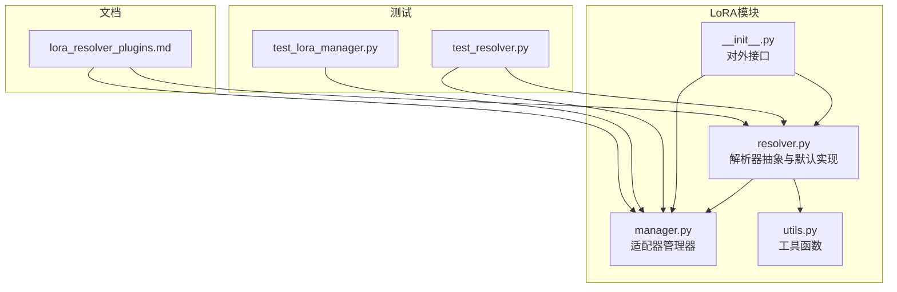
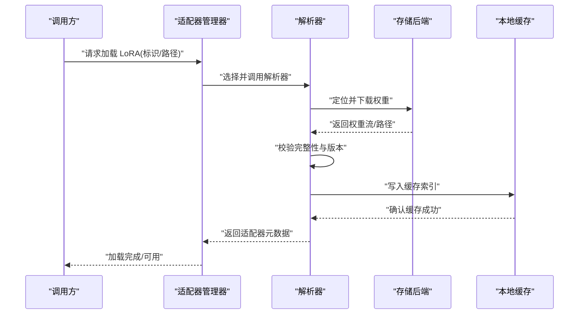
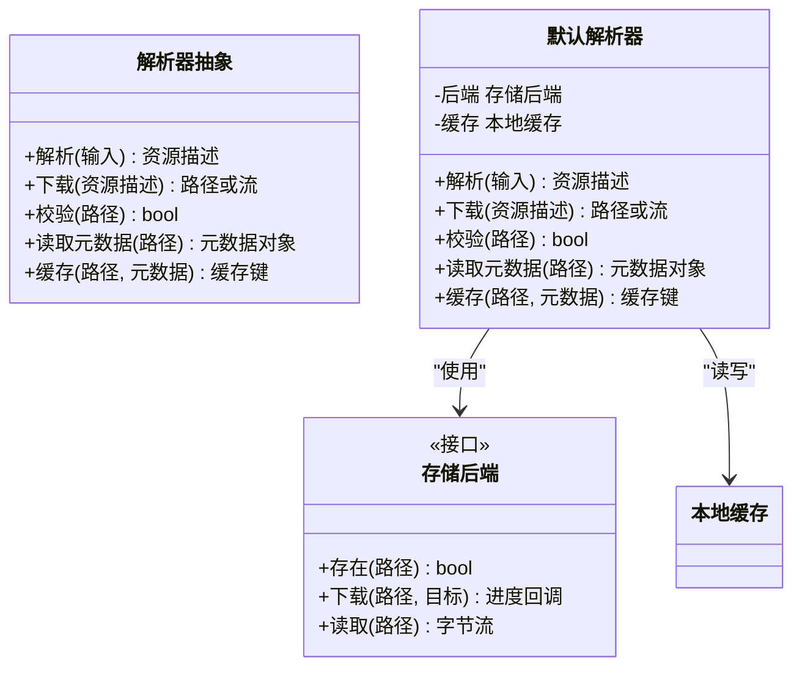
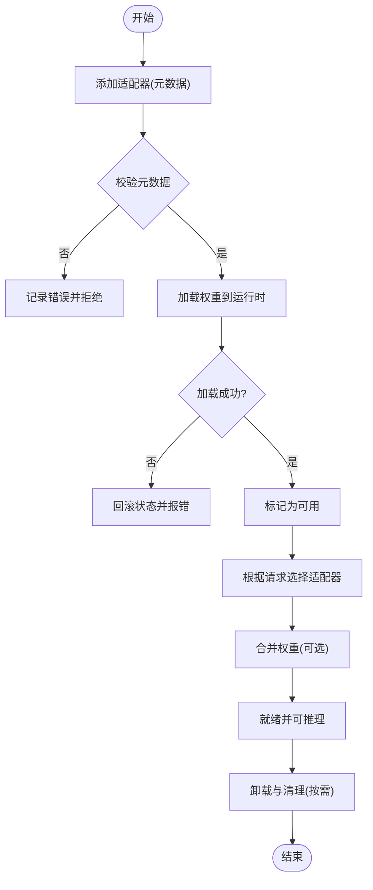
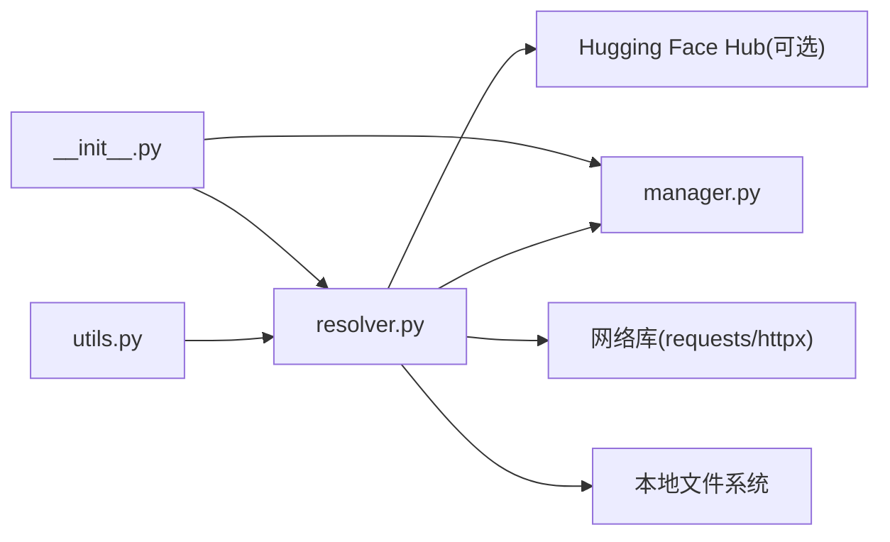

# LoRA解析器插件

<cite>
**本文引用的文件**   
- [vllm/lora/resolver.py](file://vllm/lora/resolver.py)
- [vllm/lora/manager.py](file://vllm/lora/manager.py)
- [vllm/lora/utils.py](file://vllm/lora/utils.py)
- [vllm/lora/__init__.py](file://vllm/lora/__init__.py)
- [tests/lora/test_resolver.py](file://tests/lora/test_resolver.py)
- [tests/lora/test_lora_manager.py](file://tests/lora/test_lora_manager.py)
- [docs/design/lora_resolver_plugins.md](file://docs/design/lora_resolver_plugins.md)
</cite>

## 目录
1. [简介](#简介)
2. [项目结构](#项目结构)
3. [核心组件](#核心组件)
4. [架构总览](#架构总览)
5. [详细组件分析](#详细组件分析)
6. [依赖关系分析](#依赖关系分析)
7. [性能考虑](#性能考虑)
8. [故障排查指南](#故障排查指南)
9. [结论](#结论)
10. [附录](#附录)

## 简介
本文件系统性介绍 vLLM 的 LoRA 解析器插件系统，涵盖其作用与重要性、模型权重加载、适配器管理与版本控制、开发接口规范、存储后端支持（本地文件系统、Hugging Face Hub、远程存储服务）、元数据管理与兼容性检查、性能优化策略（并行加载与增量更新）、错误处理与重试机制、以及调试与验证方法。目标是帮助开发者快速理解并扩展 LoRA 解析器，实现稳定高效的适配器加载与管理。

## 项目结构
LoRA 解析器相关代码主要位于 vllm/lora 目录，测试位于 tests/lora，设计文档位于 docs/design。关键文件包括：
- vllm/lora/resolver.py：定义 LoRA 解析器抽象与默认实现，提供统一接口用于定位、下载、校验与缓存 LoRA 权重。
- vllm/lora/manager.py：管理多个 LoRA 适配器的生命周期、注册、选择与合并策略。
- vllm/lora/utils.py：工具函数，包含哈希计算、路径解析、网络请求封装等。
- vllm/lora/__init__.py：对外暴露解析器注册与发现入口。
- tests/lora/test_resolver.py、test_lora_manager.py：覆盖解析器行为与管理器逻辑的单元测试。
- docs/design/lora_resolver_plugins.md：插件系统设计说明与扩展指南。

图表来源
- [vllm/lora/resolver.py](file://vllm/lora/resolver.py)
- [vllm/lora/manager.py](file://vllm/lora/manager.py)
- [vllm/lora/utils.py](file://vllm/lora/utils.py)
- [vllm/lora/__init__.py](file://vllm/lora/__init__.py)
- [tests/lora/test_resolver.py](file://tests/lora/test_resolver.py)
- [tests/lora/test_lora_manager.py](file://tests/lora/test_lora_manager.py)
- [docs/design/lora_resolver_plugins.md](file://docs/design/lora_resolver_plugins.md)

章节来源
- [vllm/lora/resolver.py](file://vllm/lora/resolver.py)
- [vllm/lora/manager.py](file://vllm/lora/manager.py)
- [vllm/lora/utils.py](file://vllm/lora/utils.py)
- [vllm/lora/__init__.py](file://vllm/lora/__init__.py)
- [tests/lora/test_resolver.py](file://tests/lora/test_resolver.py)
- [tests/lora/test_lora_manager.py](file://tests/lora/test_lora_manager.py)
- [docs/design/lora_resolver_plugins.md](file://docs/design/lora_resolver_plugins.md)

## 核心组件
- 解析器抽象与默认实现：提供统一的解析接口，负责从不同后端定位 LoRA 资源、下载、校验完整性与版本信息，并将结果缓存到本地。
- 适配器管理器：维护已加载的 LoRA 适配器集合，支持按请求动态选择、合并与卸载，确保并发安全与内存占用可控。
- 工具函数：封装哈希、路径拼接、网络请求、重试与超时控制等通用能力，降低重复实现成本。
- 对外接口：通过 __init__.py 暴露注册与发现机制，便于第三方扩展自定义解析器。

章节来源
- [vllm/lora/resolver.py](file://vllm/lora/resolver.py)
- [vllm/lora/manager.py](file://vllm/lora/manager.py)
- [vllm/lora/utils.py](file://vllm/lora/utils.py)
- [vllm/lora/__init__.py](file://vllm/lora/__init__.py)

## 架构总览
LoRA 解析器插件系统的整体流程如下：
- 客户端发起 LoRA 加载请求（指定模型 ID 或本地路径）。
- 管理器根据配置选择合适解析器（本地、HF Hub、远程存储）。
- 解析器执行定位、下载、校验与缓存，返回可加载的适配器元数据。
- 管理器将适配器纳入运行时，按需合并到推理管线中。

图表来源
- [vllm/lora/resolver.py](file://vllm/lora/resolver.py)
- [vllm/lora/manager.py](file://vllm/lora/manager.py)
- [vllm/lora/utils.py](file://vllm/lora/utils.py)

章节来源
- [vllm/lora/resolver.py](file://vllm/lora/resolver.py)
- [vllm/lora/manager.py](file://vllm/lora/manager.py)

## 详细组件分析

### 解析器抽象与默认实现
- 职责：
  - 解析输入标识（模型 ID、本地路径、URL）为统一资源描述。
  - 从指定后端下载权重文件，支持断点续传与分片。
  - 校验文件完整性（哈希/签名），读取元数据（版本、兼容模型列表）。
  - 将结果持久化到本地缓存，避免重复下载。
- 关键方法（概念性说明）：
  - 解析与定位：将用户输入转换为资源路径或 URL。
  - 下载与缓存：拉取权重并生成缓存键，落盘并建立索引。
  - 校验与元数据：计算哈希、读取配置文件、检查版本兼容性。
  - 错误处理：网络异常、权限不足、格式不匹配等场景的恢复策略。
- 扩展点：
  - 自定义后端：实现统一的下载与元数据读取接口。
  - 自定义校验：支持额外签名验证或白名单机制。

图表来源
- [vllm/lora/resolver.py](file://vllm/lora/resolver.py)
- [vllm/lora/utils.py](file://vllm/lora/utils.py)

章节来源
- [vllm/lora/resolver.py](file://vllm/lora/resolver.py)
- [vllm/lora/utils.py](file://vllm/lora/utils.py)

### 适配器管理器
- 职责：
  - 注册与发现：维护解析器注册表，支持动态扩展。
  - 生命周期管理：创建、加载、激活、卸载 LoRA 适配器。
  - 并发控制：保证多线程/多进程环境下的安全访问。
  - 合并策略：根据请求上下文选择并合并多个适配器权重。
- 关键方法（概念性说明）：
  - 添加适配器：接收解析器返回的元数据，初始化运行时结构。
  - 选择适配器：基于请求参数（如任务类型、权重优先级）决定使用哪个适配器。
  - 卸载与清理：释放显存与磁盘缓存引用，防止内存泄漏。
- 错误处理：
  - 加载失败回滚：部分权重加载失败时撤销已变更状态。
  - 资源竞争：锁粒度与超时控制，避免死锁。

图表来源
- [vllm/lora/manager.py](file://vllm/lora/manager.py)

章节来源
- [vllm/lora/manager.py](file://vllm/lora/manager.py)

### 工具函数
- 功能：
  - 哈希计算：对权重文件进行一致性校验。
  - 路径解析：规范化本地路径与 URL。
  - 网络请求：封装 HTTP 请求，支持重试、超时、代理。
  - 缓存键生成：基于资源标识与版本生成唯一键。
- 设计原则：
  - 无副作用：纯函数优先，便于测试与复用。
  - 可配置：超时、重试次数、并发度等参数可调。

章节来源
- [vllm/lora/utils.py](file://vllm/lora/utils.py)

### 对外接口与插件注册
- 注册机制：
  - 通过 __init__.py 暴露注册函数，允许第三方导入并注册自定义解析器。
  - 解析器命名空间隔离，避免冲突。
- 发现与选择：
  - 根据输入协议自动选择对应解析器（如 hf://、file://、https://）。
  - 支持优先级与降级策略。

章节来源
- [vllm/lora/__init__.py](file://vllm/lora/__init__.py)

## 依赖关系分析
- 内部依赖：
  - 解析器依赖工具函数进行哈希、网络与路径操作。
  - 管理器依赖解析器获取适配器元数据，并协调加载流程。
- 外部依赖：
  - Hugging Face Hub SDK（可选）用于 HF 仓库访问。
  - 标准库与第三方网络库（requests/httpx）用于远程下载。
  - 本地文件系统与缓存目录用于持久化。

图表来源
- [vllm/lora/utils.py](file://vllm/lora/utils.py)
- [vllm/lora/resolver.py](file://vllm/lora/resolver.py)
- [vllm/lora/manager.py](file://vllm/lora/manager.py)
- [vllm/lora/__init__.py](file://vllm/lora/__init__.py)

章节来源
- [vllm/lora/utils.py](file://vllm/lora/utils.py)
- [vllm/lora/resolver.py](file://vllm/lora/resolver.py)
- [vllm/lora/manager.py](file://vllm/lora/manager.py)
- [vllm/lora/__init__.py](file://vllm/lora/__init__.py)

## 性能考虑
- 并行加载：
  - 对独立适配器采用并发下载与校验，提升总体吞吐。
  - 限制并发度以避免带宽与磁盘 IO 瓶颈。
- 增量更新：
  - 基于哈希判断差异，仅拉取变更文件。
  - 支持断点续传与分块校验，减少重传开销。
- 缓存策略：
  - 多级缓存（内存索引+磁盘文件），命中率高。
  - LRU 淘汰策略，控制磁盘占用。
- 内存管理：
  - 延迟加载与按需映射，降低峰值内存。
  - 显存与内存分离，避免频繁拷贝。

[本节为通用指导，无需特定文件来源]

## 故障排查指南
- 常见问题：
  - 网络超时或中断：检查代理设置与重试参数，启用断点续传。
  - 权限不足：确认缓存目录与下载路径的读写权限。
  - 版本不兼容：核对元数据中的兼容模型列表与当前引擎版本。
  - 哈希校验失败：重新下载或检查文件损坏。
- 调试技巧：
  - 启用详细日志，观察下载与校验过程。
  - 使用测试用例模拟失败场景（网络错误、权限错误、格式错误）。
  - 手动验证缓存键与路径一致性。
- 恢复机制：
  - 自动重试与指数退避。
  - 失败后清理临时文件，避免脏状态。

章节来源
- [tests/lora/test_resolver.py](file://tests/lora/test_resolver.py)
- [tests/lora/test_lora_manager.py](file://tests/lora/test_lora_manager.py)

## 结论
vLLM 的 LoRA 解析器插件系统提供了统一、可扩展且高性能的适配器加载与管理框架。通过抽象解析器接口、完善的管理器逻辑与工具函数，开发者可以便捷地集成多种存储后端，实现稳定的权重加载、版本控制与缓存机制。遵循本文档的开发指南与最佳实践，可有效提升系统的可靠性与性能。

[本节为总结，无需特定文件来源]

## 附录
- 开发接口规范：
  - 必需方法：解析、下载、校验、读取元数据、缓存。
  - 配置参数：后端类型、超时、重试次数、并发度、缓存路径。
- 支持的存储后端：
  - 本地文件系统：直接读取本地路径。
  - Hugging Face Hub：通过模型 ID 访问公共或私有仓库。
  - 远程存储服务：支持 S3、GCS、OSS 等（需实现统一接口）。
- 元数据管理与兼容性检查：
  - 元数据结构：版本号、兼容模型、权重哈希、作者信息等。
  - 兼容性规则：引擎版本、模型架构、量化格式等。
- 调试与验证工具：
  - 单元测试覆盖解析器与管理器核心路径。
  - 集成测试模拟真实网络与磁盘环境。
  - 性能基准测试评估吞吐与延迟。

章节来源
- [docs/design/lora_resolver_plugins.md](file://docs/design/lora_resolver_plugins.md)
- [tests/lora/test_resolver.py](file://tests/lora/test_resolver.py)
- [tests/lora/test_lora_manager.py](file://tests/lora/test_lora_manager.py)