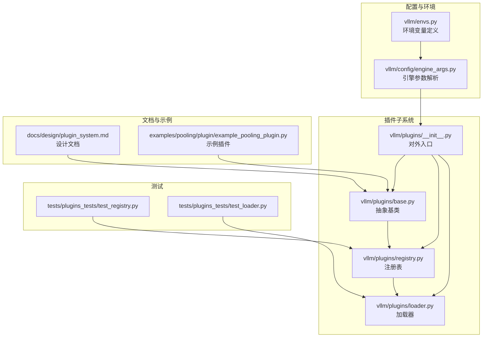
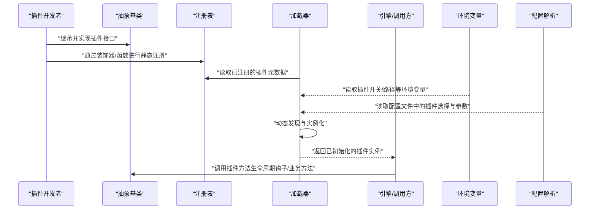
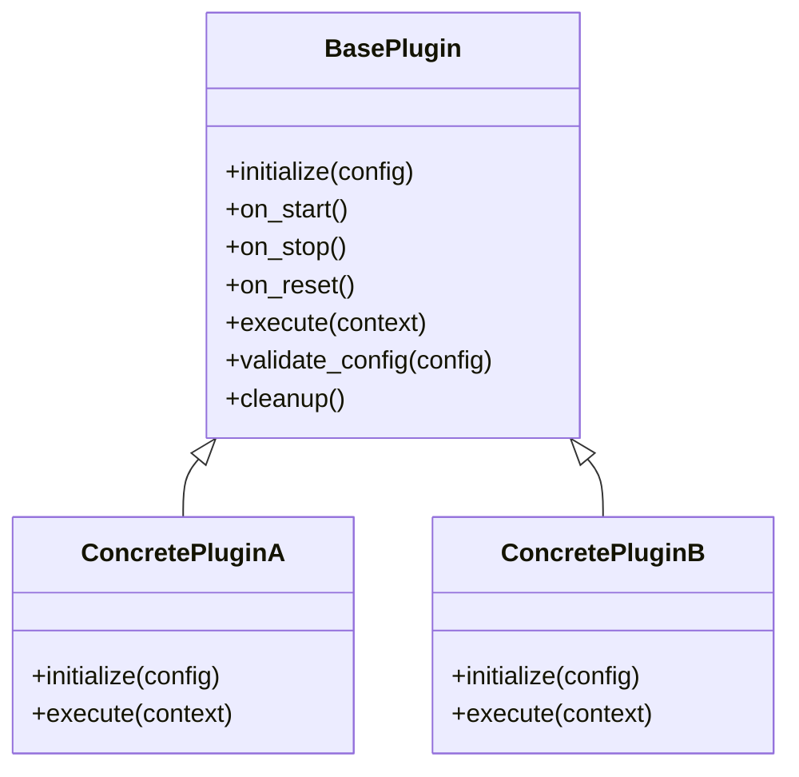
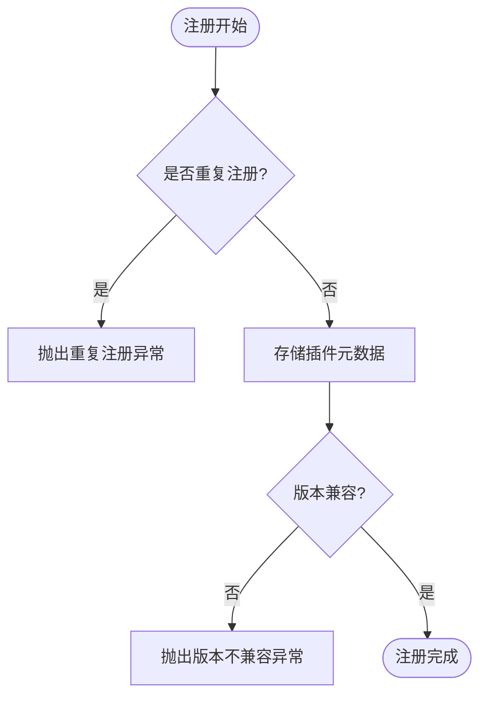
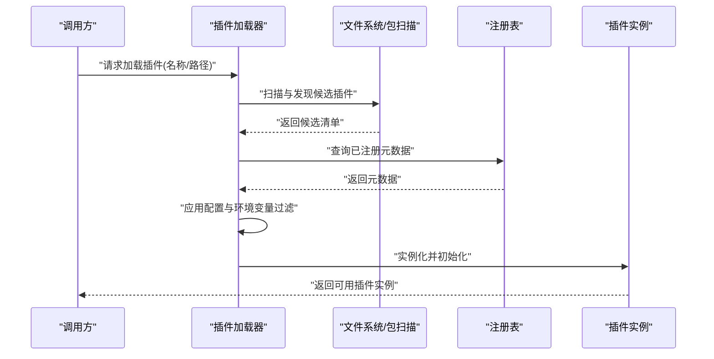
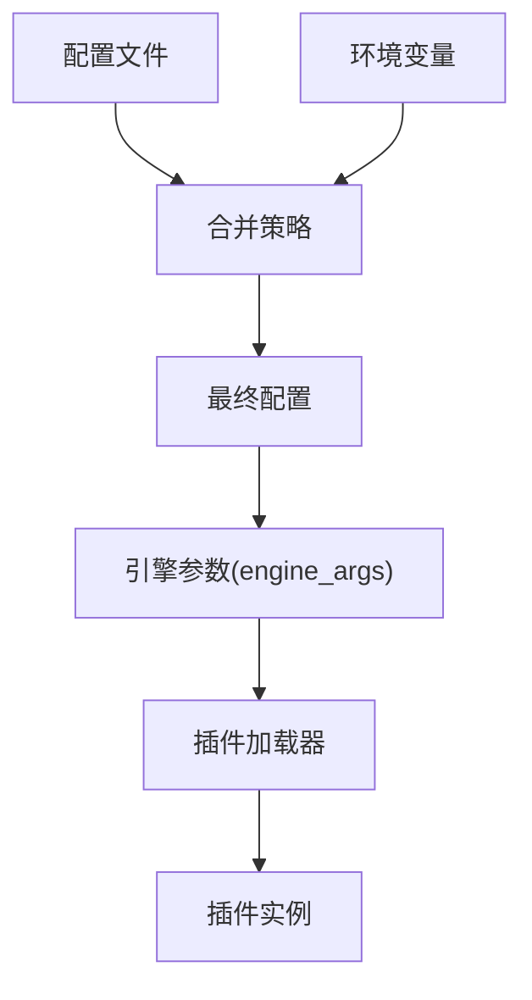
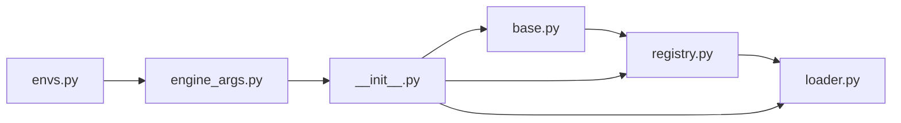

# 插件架构设计

<cite>
**本文引用的文件**   
- [vllm/plugins/__init__.py](file://vllm/plugins/__init__.py)
- [vllm/plugins/base.py](file://vllm/plugins/base.py)
- [vllm/plugins/registry.py](file://vllm/plugins/registry.py)
- [vllm/plugins/loader.py](file://vllm/plugins/loader.py)
- [vllm/config/engine_args.py](file://vllm/config/engine_args.py)
- [vllm/envs.py](file://vllm/envs.py)
- [docs/design/plugin_system.md](file://docs/design/plugin_system.md)
- [examples/pooling/plugin/example_pooling_plugin.py](file://examples/pooling/plugin/example_pooling_plugin.py)
- [tests/plugins_tests/test_registry.py](file://tests/plugins_tests/test_registry.py)
- [tests/plugins_tests/test_loader.py](file://tests/plugins_tests/test_loader.py)
</cite>

## 目录
1. [简介](#简介)
2. [项目结构](#项目结构)
3. [核心组件](#核心组件)
4. [架构总览](#架构总览)
5. [详细组件分析](#详细组件分析)
6. [依赖关系分析](#依赖关系分析)
7. [性能考量](#性能考量)
8. [故障排查指南](#故障排查指南)
9. [结论](#结论)
10. [附录](#附录)

## 简介
本文件面向希望理解与扩展 vLLM 插件系统的开发者，系统性阐述插件系统的设计模式、核心概念与实现要点。内容覆盖：
- 插件注册机制、生命周期管理与依赖注入
- 插件接口规范（抽象基类、方法签名约定、错误处理模式）
- 插件加载机制（静态注册与动态发现）
- 配置管理（配置文件格式与环境变量支持）
- 插件间通信与数据传递方式
- 插件开发入门（必要导入、继承与方法实现）
- 版本兼容性与向后兼容性保证

## 项目结构
vLLM 的插件子系统位于 vllm/plugins 目录，围绕“抽象基类 + 注册表 + 加载器”的经典模式组织；配套文档在 docs/design 下，示例插件在 examples/pooling/plugin 中，测试用例在 tests/plugins_tests 中。

**图表来源** 
- [vllm/plugins/base.py](file://vllm/plugins/base.py)
- [vllm/plugins/registry.py](file://vllm/plugins/registry.py)
- [vllm/plugins/loader.py](file://vllm/plugins/loader.py)
- [vllm/plugins/__init__.py](file://vllm/plugins/__init__.py)
- [vllm/config/engine_args.py](file://vllm/config/engine_args.py)
- [vllm/envs.py](file://vllm/envs.py)
- [docs/design/plugin_system.md](file://docs/design/plugin_system.md)
- [examples/pooling/plugin/example_pooling_plugin.py](file://examples/pooling/plugin/example_pooling_plugin.py)
- [tests/plugins_tests/test_registry.py](file://tests/plugins_tests/test_registry.py)
- [tests/plugins_tests/test_loader.py](file://tests/plugins_tests/test_loader.py)

**章节来源**
- [docs/design/plugin_system.md](file://docs/design/plugin_system.md)
- [vllm/plugins/__init__.py](file://vllm/plugins/__init__.py)

## 核心组件
- 抽象基类（BasePlugin）：定义插件的统一接口契约，包括初始化、生命周期钩子、配置校验、资源清理等。
- 注册表（PluginRegistry）：维护插件名称到实现类的映射，提供按名查找、去重、版本校验与元数据查询能力。
- 加载器（PluginLoader）：负责插件的发现与实例化，支持静态注册（代码内显式注册）与动态发现（基于包路径或命名空间扫描）。
- 对外入口（plugins.__init__）：暴露统一的 API 供上层模块使用，屏蔽内部实现细节。

这些组件共同构成“声明式注册 + 集中式调度”的插件体系，确保可扩展性、可测试性与可维护性。

**章节来源**
- [vllm/plugins/base.py](file://vllm/plugins/base.py)
- [vllm/plugins/registry.py](file://vllm/plugins/registry.py)
- [vllm/plugins/loader.py](file://vllm/plugins/loader.py)
- [vllm/plugins/__init__.py](file://vllm/plugins/__init__.py)

## 架构总览
下图展示了插件从“定义 → 注册 → 加载 → 使用”的全链路流程，以及配置与环境变量的注入点。

**图表来源** 
- [vllm/plugins/base.py](file://vllm/plugins/base.py)
- [vllm/plugins/registry.py](file://vllm/plugins/registry.py)
- [vllm/plugins/loader.py](file://vllm/plugins/loader.py)
- [vllm/config/engine_args.py](file://vllm/config/engine_args.py)
- [vllm/envs.py](file://vllm/envs.py)

## 详细组件分析

### 抽象基类与接口规范
- 职责边界：统一插件的生命周期（初始化、预热、运行、销毁）、配置校验、错误上报与日志埋点。
- 方法约定：
  - 初始化：接收配置对象，完成参数校验与资源准备。
  - 生命周期钩子：如 on_start、on_stop、on_reset 等，用于接入框架事件。
  - 业务方法：由具体插件实现，输入输出需遵循类型与语义约定。
- 错误处理：
  - 参数非法抛出明确的异常类型，便于上层捕获与降级。
  - 资源不可用或初始化失败时，记录上下文信息并向上抛出。
  - 建议对关键路径增加断言与防御性检查。

**图表来源** 
- [vllm/plugins/base.py](file://vllm/plugins/base.py)

**章节来源**
- [vllm/plugins/base.py](file://vllm/plugins/base.py)

### 注册表（PluginRegistry）
- 功能：
  - 维护插件名称到实现类的映射。
  - 提供按名查找、重复注册保护、版本元数据查询。
  - 支持条件启用/禁用（结合配置与环境变量）。
- 设计要点：
  - 线程安全：注册阶段通常单线程，但查询可能并发，需考虑锁或不可变快照。
  - 可扩展：允许第三方扩展注册表行为（如自定义校验器）。
  - 可观测：暴露统计与诊断接口（如已注册插件列表、版本信息）。

**图表来源** 
- [vllm/plugins/registry.py](file://vllm/plugins/registry.py)

**章节来源**
- [vllm/plugins/registry.py](file://vllm/plugins/registry.py)

### 加载器（PluginLoader）
- 功能：
  - 静态注册：在模块导入时自动收集已注册的插件。
  - 动态发现：根据包路径或命名空间扫描，加载未显式注册的插件。
  - 实例化：依据配置与环境变量构造插件实例，并执行必要的初始化。
- 设计要点：
  - 延迟加载：按需加载以减少启动开销。
  - 容错：单个插件加载失败不影响其他插件。
  - 可插拔：支持多种发现策略（文件系统、包元数据、命名空间）。

**图表来源** 
- [vllm/plugins/loader.py](file://vllm/plugins/loader.py)
- [vllm/plugins/registry.py](file://vllm/plugins/registry.py)

**章节来源**
- [vllm/plugins/loader.py](file://vllm/plugins/loader.py)

### 对外入口（plugins.__init__）
- 职责：聚合 base、registry、loader 的能力，暴露简洁 API 给上层模块。
- 典型用法：
  - 获取已注册插件列表
  - 按名称加载插件实例
  - 设置全局默认插件或覆盖策略

**章节来源**
- [vllm/plugins/__init__.py](file://vllm/plugins/__init__.py)

### 配置与环境变量
- 配置文件：
  - 采用结构化配置（如 YAML/JSON），包含插件选择、参数键值对、优先级与覆盖规则。
  - 支持多环境切换（dev/staging/prod）与模型级覆盖。
- 环境变量：
  - 用于运行时开关（如启用/禁用某插件、调试开关、路径覆盖）。
  - 与配置文件合并，环境变量优先级更高。
- 引擎参数集成：
  - 通过 engine_args 将插件配置注入到引擎初始化流程中。

**图表来源** 
- [vllm/config/engine_args.py](file://vllm/config/engine_args.py)
- [vllm/envs.py](file://vllm/envs.py)

**章节来源**
- [vllm/config/engine_args.py](file://vllm/config/engine_args.py)
- [vllm/envs.py](file://vllm/envs.py)

### 插件间通信与数据传递
- 推荐模式：
  - 通过上下文对象（Context）传递共享状态，避免全局变量。
  - 使用事件总线或回调机制进行松耦合通信。
  - 对于大数据量，优先使用零拷贝或内存映射。
- 约束：
  - 插件之间不应直接相互引用实现类，仅通过接口与约定交互。
  - 严格定义输入输出 schema，确保序列化/反序列化一致性。

[本节为通用设计说明，不直接分析具体文件]

### 插件开发入门
- 必要步骤：
  - 继承抽象基类，实现必需方法。
  - 在模块导入时进行静态注册（或使用装饰器）。
  - 编写配置项与环境变量适配。
  - 提供单元测试与集成测试。
- 参考示例：
  - 查看示例插件以了解标准结构与最佳实践。

**章节来源**
- [examples/pooling/plugin/example_pooling_plugin.py](file://examples/pooling/plugin/example_pooling_plugin.py)

### 版本兼容性与向后兼容
- 版本元数据：
  - 插件应声明最小兼容的框架版本与自身版本。
  - 注册表在加载前进行版本校验，拒绝不兼容实现。
- 向后兼容：
  - 新增字段需具备默认值，旧配置仍可生效。
  - 废弃接口保留兼容层，给出迁移提示。
- 演进策略：
  - 通过特性开关逐步引入新能力。
  - 保持公共接口稳定，变更集中在内部实现。

**章节来源**
- [vllm/plugins/registry.py](file://vllm/plugins/registry.py)

## 依赖关系分析
插件子系统内部依赖清晰，外部依赖集中于配置与环境解析。

**图表来源** 
- [vllm/plugins/base.py](file://vllm/plugins/base.py)
- [vllm/plugins/registry.py](file://vllm/plugins/registry.py)
- [vllm/plugins/loader.py](file://vllm/plugins/loader.py)
- [vllm/plugins/__init__.py](file://vllm/plugins/__init__.py)
- [vllm/config/engine_args.py](file://vllm/config/engine_args.py)
- [vllm/envs.py](file://vllm/envs.py)

**章节来源**
- [vllm/plugins/__init__.py](file://vllm/plugins/__init__.py)

## 性能考量
- 延迟加载：仅在需要时加载插件，减少冷启动时间。
- 缓存元数据：注册表缓存已解析的元数据，避免重复扫描。
- 批量初始化：对多个插件进行批处理初始化，降低系统调用开销。
- 资源隔离：每个插件独立资源池，避免争用与泄漏。
- 监控与度量：暴露关键指标（加载耗时、初始化耗时、调用延迟）以便优化。

[本节为通用指导，不直接分析具体文件]

## 故障排查指南
- 常见问题：
  - 插件未找到：检查注册是否正确、包路径是否可达、环境变量是否开启。
  - 版本不兼容：核对插件与框架的版本元数据，必要时升级或降级。
  - 配置错误：校验配置文件语法与必填字段，确认环境变量覆盖是否符合预期。
  - 初始化失败：查看日志定位资源不足或依赖缺失问题。
- 诊断手段：
  - 启用调试日志，打印插件加载与初始化过程。
  - 使用测试套件验证插件可用性。
  - 通过注册表查询接口检查已注册插件列表与元数据。

**章节来源**
- [tests/plugins_tests/test_registry.py](file://tests/plugins_tests/test_registry.py)
- [tests/plugins_tests/test_loader.py](file://tests/plugins_tests/test_loader.py)

## 结论
vLLM 插件系统通过“抽象基类 + 注册表 + 加载器”的清晰分层，实现了高内聚、低耦合的可扩展架构。配合完善的配置与环境变量支持、严格的版本兼容策略与健壮的测试覆盖，能够支撑多样化的插件生态。开发者只需遵循接口规范与最佳实践，即可快速构建高质量插件。

[本节为总结性内容，不直接分析具体文件]

## 附录
- 设计文档：详见 docs/design/plugin_system.md，涵盖设计理念、扩展点与演进路线。
- 示例插件：examples/pooling/plugin/example_pooling_plugin.py 提供了完整的最小实现模板。
- 测试用例：tests/plugins_tests 下的测试覆盖了注册与加载的核心场景，可作为开发参考。

**章节来源**
- [docs/design/plugin_system.md](file://docs/design/plugin_system.md)
- [examples/pooling/plugin/example_pooling_plugin.py](file://examples/pooling/plugin/example_pooling_plugin.py)
- [tests/plugins_tests/test_registry.py](file://tests/plugins_tests/test_registry.py)
- [tests/plugins_tests/test_loader.py](file://tests/plugins_tests/test_loader.py)