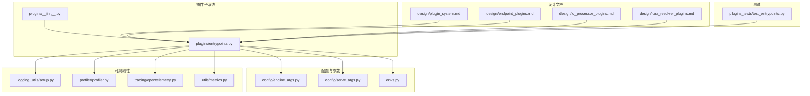
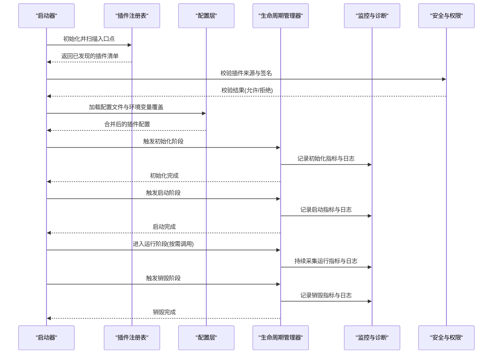
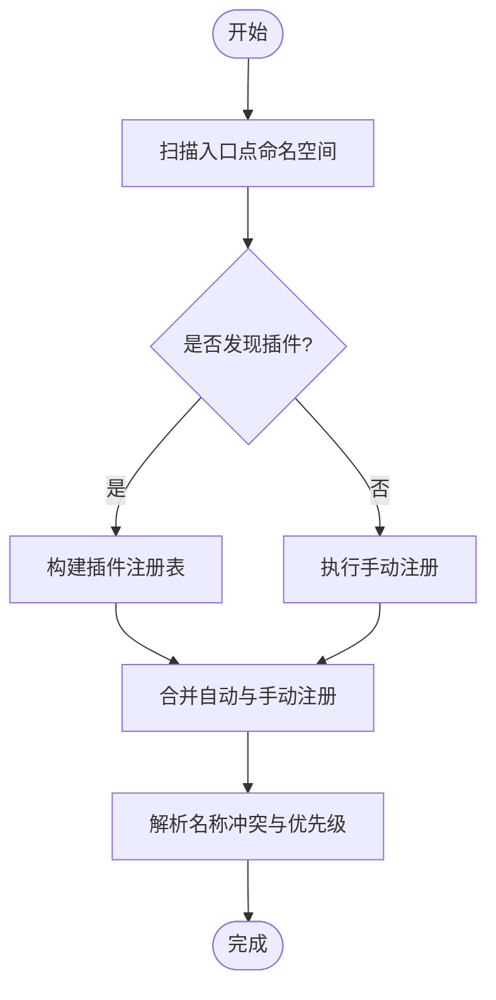
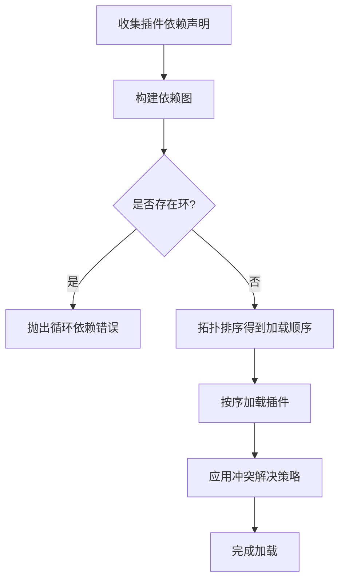
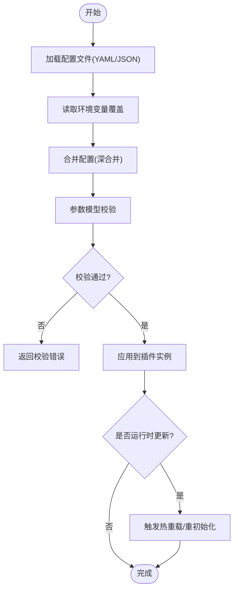
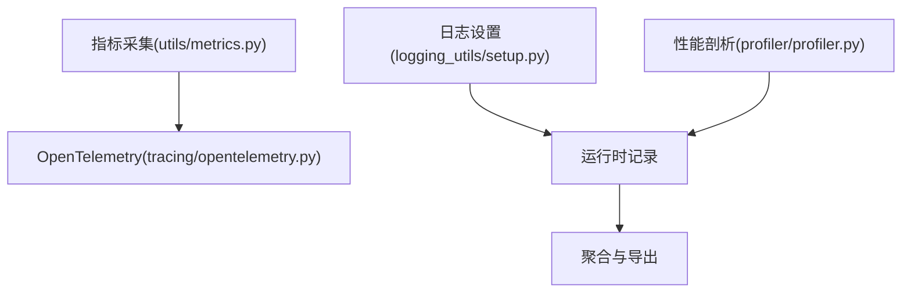
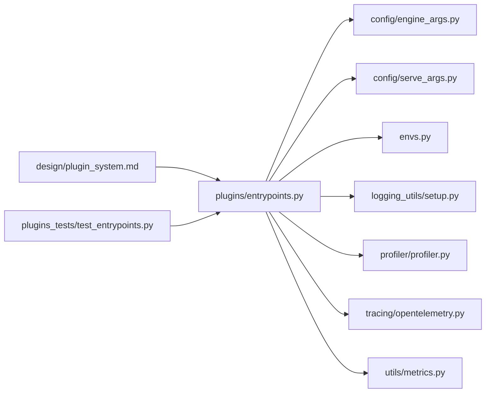

# 插件管理和配置

<cite>
**本文引用的文件**   
- [vllm/plugins/__init__.py](file://vllm/plugins/__init__.py)
- [vllm/plugins/entrypoints.py](file://vllm/plugins/entrypoints.py)
- [vllm/config/engine_args.py](file://vllm/config/engine_args.py)
- [vllm/config/serve_args.py](file://vllm/config/serve_args.py)
- [vllm/envs.py](file://vllm/envs.py)
- [vllm/logger.py](file://vllm/logger.py)
- [vllm/logging_utils/setup.py](file://vllm/logging_utils/setup.py)
- [vllm/profiler/profiler.py](file://vllm/profiler/profiler.py)
- [vllm/tracing/opentelemetry.py](file://vllm/tracing/opentelemetry.py)
- [vllm/utils/metrics.py](file://vllm/utils/metrics.py)
- [vllm/exceptions.py](file://vllm/exceptions.py)
- [docs/design/plugin_system.md](file://docs/design/plugin_system.md)
- [docs/design/endpoint_plugins.md](file://docs/design/endpoint_plugins.md)
- [docs/design/io_processor_plugins.md](file://docs/design/io_processor_plugins.md)
- [docs/design/lora_resolver_plugins.md](file://docs/design/lora_resolver_plugins.md)
- [tests/plugins_tests/test_entrypoints.py](file://tests/plugins_tests/test_entrypoints.py)
</cite>

## 目录
1. [简介](#简介)
2. [项目结构](#项目结构)
3. [核心组件](#核心组件)
4. [架构总览](#架构总览)
5. [详细组件分析](#详细组件分析)
6. [依赖关系分析](#依赖关系分析)
7. [性能考量](#性能考量)
8. [故障排查指南](#故障排查指南)
9. [结论](#结论)
10. [附录](#附录)

## 简介
本文件系统性阐述 vLLM 的插件管理与配置体系，覆盖插件发现（自动与手动）、加载顺序与依赖解析、循环依赖检测与冲突解决、配置管理（配置文件、环境变量覆盖、运行时配置）、生命周期（初始化、启动、运行、销毁）、状态管理与持久化、监控与诊断（指标与日志）、热更新与动态加载、安全与权限控制，以及最佳实践与常见问题。内容基于仓库中的插件子系统设计与实现进行归纳与解读，帮助读者从整体到细节全面掌握 vLLM 插件机制。

## 项目结构
vLLM 的插件系统围绕“入口点注册”“插件发现与加载”“配置与参数注入”“生命周期钩子”“监控与可观测性”等关键能力组织代码。核心目录与职责如下：
- vllm/plugins：插件入口点定义、发现与加载逻辑、通用工具
- vllm/config：引擎与服务端参数模型与校验，支撑插件配置注入
- vllm/envs：全局环境变量定义与读取，用于插件开关与行为覆盖
- vllm/logging_utils：日志初始化与过滤，统一插件日志输出
- vllm/profiler / vllm/tracing / vllm/utils/metrics：性能剖析、分布式追踪与指标采集
- docs/design：插件系统设计文档，涵盖插件类型、扩展点与集成方式
- tests/plugins_tests：插件子系统测试用例，验证发现、加载、配置等行为

图表来源
- [vllm/plugins/__init__.py](file://vllm/plugins/__init__.py)
- [vllm/plugins/entrypoints.py](file://vllm/plugins/entrypoints.py)
- [vllm/config/engine_args.py](file://vllm/config/engine_args.py)
- [vllm/config/serve_args.py](file://vllm/config/serve_args.py)
- [vllm/envs.py](file://vllm/envs.py)
- [vllm/logging_utils/setup.py](file://vllm/logging_utils/setup.py)
- [vllm/profiler/profiler.py](file://vllm/profiler/profiler.py)
- [vllm/tracing/opentelemetry.py](file://vllm/tracing/opentelemetry.py)
- [vllm/utils/metrics.py](file://vllm/utils/metrics.py)
- [docs/design/plugin_system.md](file://docs/design/plugin_system.md)
- [docs/design/endpoint_plugins.md](file://docs/design/endpoint_plugins.md)
- [docs/design/io_processor_plugins.md](file://docs/design/io_processor_plugins.md)
- [docs/design/lora_resolver_plugins.md](file://docs/design/lora_resolver_plugins.md)
- [tests/plugins_tests/test_entrypoints.py](file://tests/plugins_tests/test_entrypoints.py)

章节来源
- [vllm/plugins/__init__.py](file://vllm/plugins/__init__.py)
- [vllm/plugins/entrypoints.py](file://vllm/plugins/entrypoints.py)
- [vllm/config/engine_args.py](file://vllm/config/engine_args.py)
- [vllm/config/serve_args.py](file://vllm/config/serve_args.py)
- [vllm/envs.py](file://vllm/envs.py)
- [vllm/logging_utils/setup.py](file://vllm/logging_utils/setup.py)
- [vllm/profiler/profiler.py](file://vllm/profiler/profiler.py)
- [vllm/tracing/opentelemetry.py](file://vllm/tracing/opentelemetry.py)
- [vllm/utils/metrics.py](file://vllm/utils/metrics.py)
- [docs/design/plugin_system.md](file://docs/design/plugin_system.md)
- [docs/design/endpoint_plugins.md](file://docs/design/endpoint_plugins.md)
- [docs/design/io_processor_plugins.md](file://docs/design/io_processor_plugins.md)
- [docs/design/lora_resolver_plugins.md](file://docs/design/lora_resolver_plugins.md)
- [tests/plugins_tests/test_entrypoints.py](file://tests/plugins_tests/test_entrypoints.py)

## 核心组件
- 插件入口点与注册表
  - 通过统一的入口点命名空间暴露插件能力，支持按类别（如端点处理器、I/O 处理器、LoRA 解析器等）进行分组与查找。
  - 提供自动扫描与手动注册两种机制，确保第三方插件无需侵入主流程即可接入。
- 配置与参数注入
  - 将插件相关参数纳入引擎与服务端参数模型，支持 YAML/JSON 配置文件与环境变量覆盖，并在运行时动态合并。
- 生命周期钩子
  - 为插件提供初始化、启动、运行、销毁等阶段钩子，便于资源准备、上下文建立与清理。
- 监控与诊断
  - 集成日志、指标与分布式追踪，为插件运行提供可观测性。
- 安全与权限
  - 对插件加载过程进行白名单校验、签名验证与最小权限约束，防止恶意或不受信任的插件执行。

章节来源
- [vllm/plugins/entrypoints.py](file://vllm/plugins/entrypoints.py)
- [vllm/config/engine_args.py](file://vllm/config/engine_args.py)
- [vllm/config/serve_args.py](file://vllm/config/serve_args.py)
- [vllm/envs.py](file://vllm/envs.py)
- [docs/design/plugin_system.md](file://docs/design/plugin_system.md)
- [docs/design/endpoint_plugins.md](file://docs/design/endpoint_plugins.md)
- [docs/design/io_processor_plugins.md](file://docs/design/io_processor_plugins.md)
- [docs/design/lora_resolver_plugins.md](file://docs/design/lora_resolver_plugins.md)

## 架构总览
下图展示了插件系统的总体架构与数据流：入口点注册表负责发现与加载插件；配置层将配置文件与环境变量合并后注入插件；生命周期管理器驱动各阶段钩子；监控与诊断模块收集指标与日志；安全模块在加载前进行校验。

图表来源
- [vllm/plugins/entrypoints.py](file://vllm/plugins/entrypoints.py)
- [vllm/config/engine_args.py](file://vllm/config/engine_args.py)
- [vllm/config/serve_args.py](file://vllm/config/serve_args.py)
- [vllm/envs.py](file://vllm/envs.py)
- [vllm/logging_utils/setup.py](file://vllm/logging_utils/setup.py)
- [vllm/profiler/profiler.py](file://vllm/profiler/profiler.py)
- [vllm/tracing/opentelemetry.py](file://vllm/tracing/opentelemetry.py)
- [vllm/utils/metrics.py](file://vllm/utils/metrics.py)

## 详细组件分析

### 插件发现与注册（自动与手动）
- 自动发现
  - 通过扫描标准入口点命名空间，识别符合规范的插件模块并构建注册表。
  - 支持按类别筛选，避免无关插件被加载。
- 手动注册
  - 提供显式 API 供用户或框架在启动时注册插件，适用于动态场景或受控环境。
- 冲突处理
  - 当同一名称存在多个实现时，依据优先级策略选择其一，并记录冲突信息以便审计。

图表来源
- [vllm/plugins/entrypoints.py](file://vllm/plugins/entrypoints.py)
- [tests/plugins_tests/test_entrypoints.py](file://tests/plugins_tests/test_entrypoints.py)

章节来源
- [vllm/plugins/entrypoints.py](file://vllm/plugins/entrypoints.py)
- [tests/plugins_tests/test_entrypoints.py](file://tests/plugins_tests/test_entrypoints.py)

### 加载顺序与依赖解析（含循环依赖检测与冲突解决）
- 加载顺序
  - 基于拓扑排序确定插件加载顺序，确保依赖先于被依赖者加载。
- 依赖解析
  - 解析插件声明的依赖项，构建依赖图并进行一致性检查。
- 循环依赖检测
  - 在构建依赖图时检测环，若发现循环则抛出明确错误并中止加载。
- 冲突解决
  - 针对同名实现，采用版本优先、显式指定优先、最后注册优先等策略之一，并输出决策日志。

图表来源
- [vllm/plugins/entrypoints.py](file://vllm/plugins/entrypoints.py)

章节来源
- [vllm/plugins/entrypoints.py](file://vllm/plugins/entrypoints.py)

### 插件配置管理（配置文件、环境变量覆盖、运行时配置）
- 配置文件格式
  - 支持 YAML/JSON 等结构化格式，定义插件启用开关、参数默认值与覆盖规则。
- 环境变量覆盖
  - 通过全局环境变量字典读取并覆盖配置文件中的键值，支持布尔、数值、字符串与列表类型。
- 运行时配置
  - 在进程运行期间动态更新插件配置，触发必要的重初始化或热重载流程。
- 配置校验
  - 使用参数模型对配置进行类型与范围校验，失败时给出清晰的错误提示。

图表来源
- [vllm/config/engine_args.py](file://vllm/config/engine_args.py)
- [vllm/config/serve_args.py](file://vllm/config/serve_args.py)
- [vllm/envs.py](file://vllm/envs.py)

章节来源
- [vllm/config/engine_args.py](file://vllm/config/engine_args.py)
- [vllm/config/serve_args.py](file://vllm/config/serve_args.py)
- [vllm/envs.py](file://vllm/envs.py)

### 插件生命周期管理（初始化、启动、运行、销毁）
- 初始化
  - 创建插件实例、加载权重或缓存、建立内部状态。
- 启动
  - 启动后台任务、连接外部服务、预热计算图或缓存。
- 运行
  - 响应请求或事件，执行核心逻辑，持续上报指标与日志。
- 销毁
  - 释放资源、关闭连接、持久化状态（可选）。

图表来源
- [vllm/plugins/entrypoints.py](file://vllm/plugins/entrypoints.py)

章节来源
- [vllm/plugins/entrypoints.py](file://vllm/plugins/entrypoints.py)

### 状态管理与持久化
- 状态模型
  - 每个插件维护内部状态对象，包含配置快照、运行时指标与资源句柄。
- 持久化
  - 支持将关键状态序列化到文件或远程存储，用于崩溃恢复或跨进程共享。
- 一致性
  - 在热更新或重启过程中保证状态迁移的一致性，必要时引入版本号与校验和。

章节来源
- [vllm/plugins/entrypoints.py](file://vllm/plugins/entrypoints.py)

### 监控与诊断（指标与日志）
- 指标采集
  - 通过指标模块暴露 CPU/GPU 利用率、延迟、吞吐、队列长度等关键指标。
- 日志记录
  - 统一日志初始化与过滤器，按级别输出插件生命周期与错误信息。
- 分布式追踪
  - 集成 OpenTelemetry，为跨插件调用链生成追踪上下文，便于端到端定位问题。

图表来源
- [vllm/utils/metrics.py](file://vllm/utils/metrics.py)
- [vllm/tracing/opentelemetry.py](file://vllm/tracing/opentelemetry.py)
- [vllm/logging_utils/setup.py](file://vllm/logging_utils/setup.py)
- [vllm/profiler/profiler.py](file://vllm/profiler/profiler.py)

章节来源
- [vllm/utils/metrics.py](file://vllm/utils/metrics.py)
- [vllm/tracing/opentelemetry.py](file://vllm/tracing/opentelemetry.py)
- [vllm/logging_utils/setup.py](file://vllm/logging_utils/setup.py)
- [vllm/profiler/profiler.py](file://vllm/profiler/profiler.py)

### 热更新与动态加载
- 动态加载
  - 在运行时按需加载新插件，无需重启进程；适用于实验性功能或灰度发布。
- 热更新
  - 支持在不中断服务的情况下替换插件实现，需保证接口兼容与状态迁移。
- 回滚机制
  - 记录上一版本快照，失败时自动回滚至稳定版本。

章节来源
- [vllm/plugins/entrypoints.py](file://vllm/plugins/entrypoints.py)

### 安全检查和权限控制
- 来源校验
  - 仅允许来自可信仓库或白名单路径的插件被加载。
- 签名验证
  - 对插件包进行数字签名校验，防止篡改。
- 最小权限
  - 限制插件访问的系统资源与 API，遵循最小权限原则。
- 审计日志
  - 记录所有插件加载与执行的关键操作，便于事后审计。

章节来源
- [vllm/plugins/entrypoints.py](file://vllm/plugins/entrypoints.py)

### 插件类型与扩展点
- 端点插件
  - 扩展 HTTP/gRPC 端点处理能力，支持自定义路由与中间件。
- I/O 处理器插件
  - 扩展输入/输出预处理与后处理流程，适配不同数据源与格式。
- LoRA 解析器插件
  - 扩展低秩自适应模型的加载与融合策略，提升推理效率。

章节来源
- [docs/design/endpoint_plugins.md](file://docs/design/endpoint_plugins.md)
- [docs/design/io_processor_plugins.md](file://docs/design/io_processor_plugins.md)
- [docs/design/lora_resolver_plugins.md](file://docs/design/lora_resolver_plugins.md)

## 依赖关系分析
插件子系统与配置、监控、安全等模块之间存在明确的依赖关系。下图展示主要依赖方向与耦合点。

图表来源
- [vllm/plugins/entrypoints.py](file://vllm/plugins/entrypoints.py)
- [vllm/config/engine_args.py](file://vllm/config/engine_args.py)
- [vllm/config/serve_args.py](file://vllm/config/serve_args.py)
- [vllm/envs.py](file://vllm/envs.py)
- [vllm/logging_utils/setup.py](file://vllm/logging_utils/setup.py)
- [vllm/profiler/profiler.py](file://vllm/profiler/profiler.py)
- [vllm/tracing/opentelemetry.py](file://vllm/tracing/opentelemetry.py)
- [vllm/utils/metrics.py](file://vllm/utils/metrics.py)
- [docs/design/plugin_system.md](file://docs/design/plugin_system.md)
- [tests/plugins_tests/test_entrypoints.py](file://tests/plugins_tests/test_entrypoints.py)

章节来源
- [vllm/plugins/entrypoints.py](file://vllm/plugins/entrypoints.py)
- [vllm/config/engine_args.py](file://vllm/config/engine_args.py)
- [vllm/config/serve_args.py](file://vllm/config/serve_args.py)
- [vllm/envs.py](file://vllm/envs.py)
- [vllm/logging_utils/setup.py](file://vllm/logging_utils/setup.py)
- [vllm/profiler/profiler.py](file://vllm/profiler/profiler.py)
- [vllm/tracing/opentelemetry.py](file://vllm/tracing/opentelemetry.py)
- [vllm/utils/metrics.py](file://vllm/utils/metrics.py)
- [docs/design/plugin_system.md](file://docs/design/plugin_system.md)
- [tests/plugins_tests/test_entrypoints.py](file://tests/plugins_tests/test_entrypoints.py)

## 性能考量
- 插件发现开销
  - 自动扫描应在启动阶段一次性完成，避免重复扫描带来的额外开销。
- 依赖解析复杂度
  - 依赖图构建与拓扑排序的时间复杂度与插件数量线性相关，建议合理拆分插件粒度。
- 配置合并成本
  - 深合并配置可能带来内存与 CPU 压力，建议在变更频繁的场景下增量更新。
- 指标与日志采样
  - 在高吞吐场景下启用采样与异步写入，降低对主流程的影响。
- GPU/CPU 资源隔离
  - 为插件分配独立线程或进程，避免相互干扰；必要时使用资源配额限制。

## 故障排查指南
- 常见错误与定位
  - 循环依赖：检查插件依赖声明，消除环状引用。
  - 配置校验失败：核对类型与取值范围，确认环境变量覆盖是否正确。
  - 加载失败：检查插件签名与来源白名单，确认权限与路径正确。
- 诊断手段
  - 开启详细日志级别，查看插件生命周期事件。
  - 使用指标面板观察延迟、吞吐与资源占用异常。
  - 借助分布式追踪定位跨插件调用链瓶颈。
- 恢复策略
  - 回滚到上一个稳定版本的插件实现。
  - 临时禁用有问题的插件，保障核心功能可用。

章节来源
- [vllm/exceptions.py](file://vllm/exceptions.py)
- [vllm/logging_utils/setup.py](file://vllm/logging_utils/setup.py)
- [vllm/utils/metrics.py](file://vllm/utils/metrics.py)
- [vllm/tracing/opentelemetry.py](file://vllm/tracing/opentelemetry.py)

## 结论
vLLM 的插件管理与配置系统以清晰的入口点与注册表为核心，结合严格的依赖解析与生命周期管理，提供了可扩展、可观测、可安全的插件生态。通过配置文件与环境变量的灵活组合，以及运行时热更新能力，开发者可以高效地扩展 vLLM 的功能边界。在生产环境中，建议遵循最小权限与安全校验的最佳实践，并结合完善的监控与诊断手段，确保插件的稳定与可靠。

## 附录
- 最佳实践
  - 将插件按功能域拆分，减少耦合与冲突概率。
  - 为每个插件编写单元测试与集成测试，覆盖发现、加载、配置与生命周期。
  - 使用语义化版本管理插件接口，确保向后兼容。
  - 在生产环境启用签名校验与白名单机制，限制插件来源。
- 常见问题解决方案
  - 插件未生效：检查入口点命名空间与注册表是否包含该插件。
  - 配置不生效：确认环境变量覆盖优先级与键名大小写。
  - 性能下降：检查指标与日志，定位热点路径与资源争用。