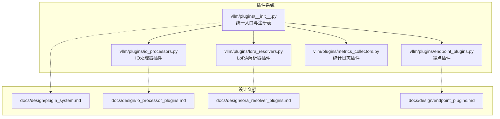
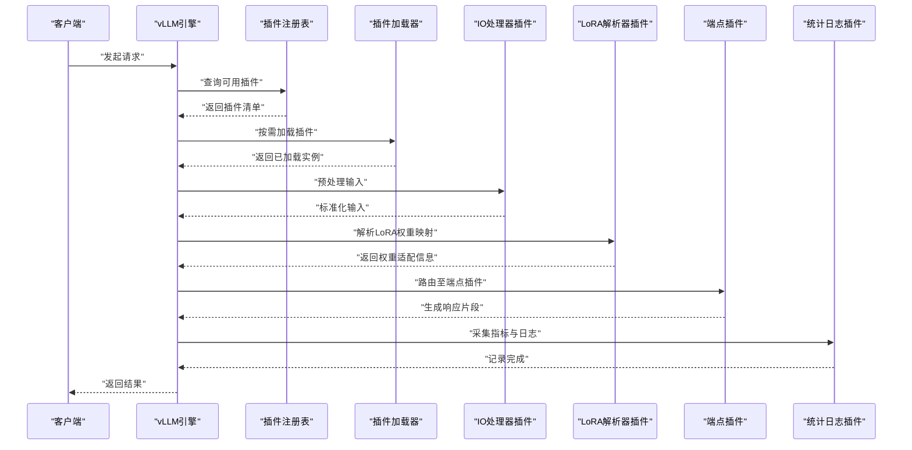
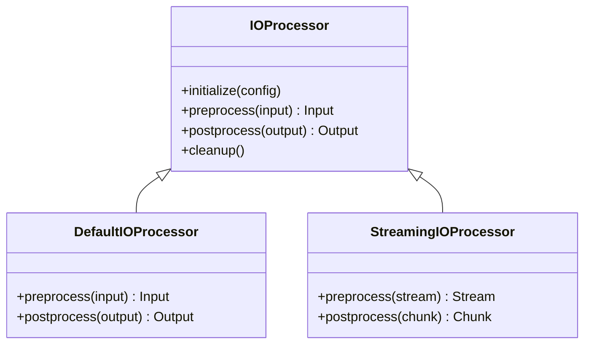
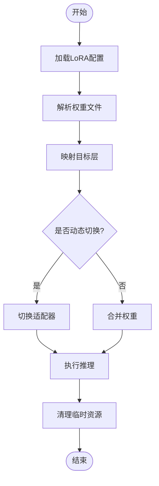
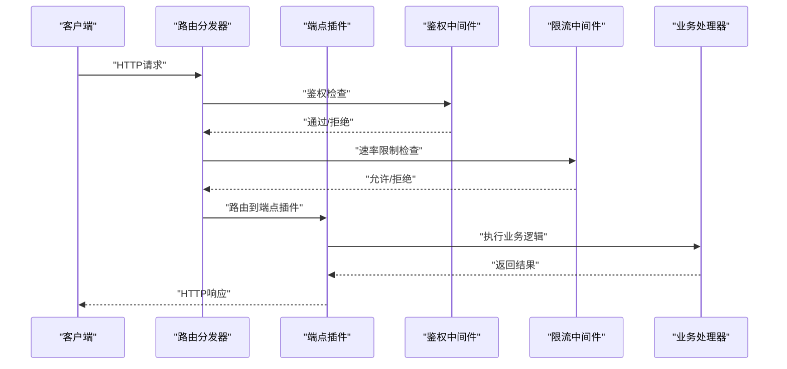
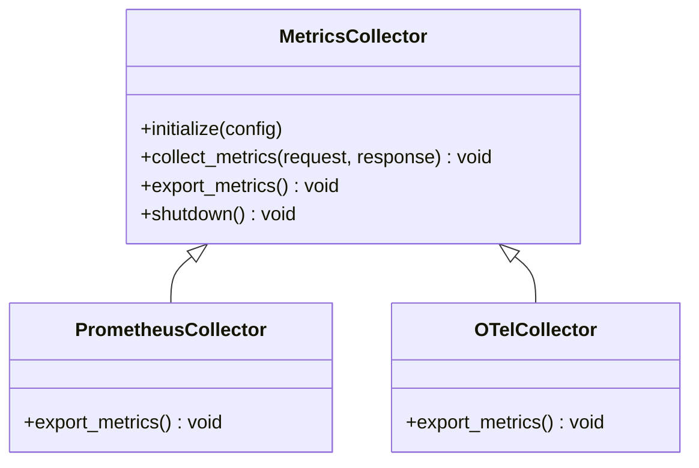
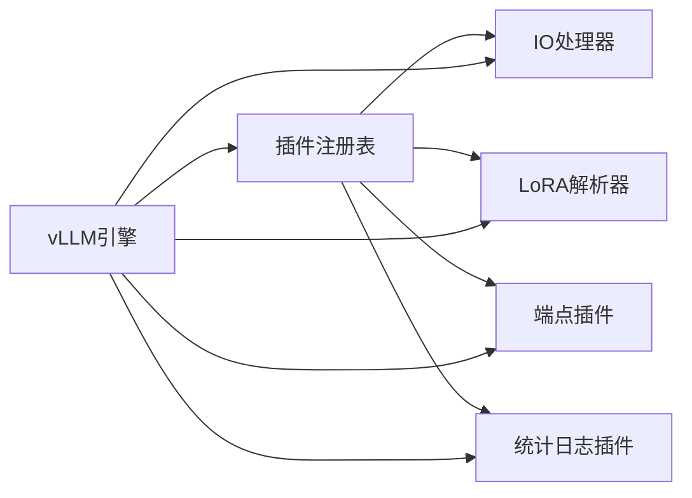

# 插件系统

<cite>
**本文档引用的文件**   
- [vllm/plugins/__init__.py](file://vllm/plugins/__init__.py)
- [vllm/plugins/io_processors.py](file://vllm/plugins/io_processors.py)
- [vllm/plugins/lora_resolvers.py](file://vllm/plugins/lora_resolvers.py)
- [vllm/plugins/endpoint_plugins.py](file://vllm/plugins/endpoint_plugins.py)
- [vllm/plugins/metrics_collectors.py](file://vllm/plugins/metrics_collectors.py)
- [docs/design/plugin_system.md](file://docs/design/plugin_system.md)
- [docs/design/io_processor_plugins.md](file://docs/design/io_processor_plugins.md)
- [docs/design/lora_resolver_plugins.md](file://docs/design/lora_resolver_plugins.md)
- [docs/design/endpoint_plugins.md](file://docs/design/endpoint_plugins.md)
</cite>

## 目录
1. [简介](#简介)
2. [项目结构](#项目结构)
3. [核心组件](#核心组件)
4. [架构总览](#架构总览)
5. [详细组件分析](#详细组件分析)
6. [依赖关系分析](#依赖关系分析)
7. [性能考虑](#性能考虑)
8. [故障排查指南](#故障排查指南)
9. [结论](#结论)
10. [附录](#附录)

## 简介
本文件系统性阐述 vLLM 的插件系统架构与扩展机制，覆盖插件设计模式、生命周期管理（注册、初始化、销毁）、插件类型（IO处理器、LoRA解析器、端点插件、统计日志插件）的实现方法，以及自定义插件开发指南（接口定义、依赖管理、打包发布）。同时说明配置与加载机制（动态加载与热更新支持），现有插件功能与使用方法、第三方插件集成方式，并给出最佳实践、调试技巧与兼容性检查及版本管理方法。

## 项目结构
vLLM 插件系统以“约定优于配置”的方式组织：
- 插件入口与统一注册表位于 vllm/plugins 包中，提供各类插件的基类、默认实现与发现机制。
- 设计文档集中于 docs/design 下，对插件体系进行总体设计与分类说明。
- 各类型插件按职责划分到独立模块，便于扩展与维护。

图表来源
- [vllm/plugins/__init__.py](file://vllm/plugins/__init__.py)
- [vllm/plugins/io_processors.py](file://vllm/plugins/io_processors.py)
- [vllm/plugins/lora_resolvers.py](file://vllm/plugins/lora_resolvers.py)
- [vllm/plugins/endpoint_plugins.py](file://vllm/plugins/endpoint_plugins.py)
- [vllm/plugins/metrics_collectors.py](file://vllm/plugins/metrics_collectors.py)
- [docs/design/plugin_system.md](file://docs/design/plugin_system.md)
- [docs/design/io_processor_plugins.md](file://docs/design/io_processor_plugins.md)
- [docs/design/lora_resolver_plugins.md](file://docs/design/lora_resolver_plugins.md)
- [docs/design/endpoint_plugins.md](file://docs/design/endpoint_plugins.md)

章节来源
- [vllm/plugins/__init__.py](file://vllm/plugins/__init__.py)
- [docs/design/plugin_system.md](file://docs/design/plugin_system.md)

## 核心组件
- 插件注册表与发现机制：集中管理插件元数据、版本信息与加载顺序，提供统一的注册、查询与实例化接口。
- 生命周期管理器：负责插件的初始化、运行期钩子与销毁流程，确保资源安全释放与状态一致性。
- 插件基类与契约：为不同插件类型定义标准接口（如输入输出处理、模型权重解析、HTTP端点扩展、指标收集等）。
- 配置与加载器：基于配置文件与环境变量驱动插件启用、参数注入与动态加载；支持热更新策略。

章节来源
- [vllm/plugins/__init__.py](file://vllm/plugins/__init__.py)
- [docs/design/plugin_system.md](file://docs/design/plugin_system.md)

## 架构总览
下图展示插件系统与核心引擎的交互关系，包括请求进入、插件链执行、指标采集与响应返回的关键路径。

图表来源
- [vllm/plugins/__init__.py](file://vllm/plugins/__init__.py)
- [vllm/plugins/io_processors.py](file://vllm/plugins/io_processors.py)
- [vllm/plugins/lora_resolvers.py](file://vllm/plugins/lora_resolvers.py)
- [vllm/plugins/endpoint_plugins.py](file://vllm/plugins/endpoint_plugins.py)
- [vllm/plugins/metrics_collectors.py](file://vllm/plugins/metrics_collectors.py)

## 详细组件分析

### IO处理器插件
- 职责：对原始输入进行清洗、标准化与格式转换，确保下游组件接收一致的数据结构。
- 生命周期：在请求进入时触发预处理钩子，在响应返回前可执行后处理。
- 扩展点：支持多模态输入、流式输入、批处理优化。

图表来源
- [vllm/plugins/io_processors.py](file://vllm/plugins/io_processors.py)

章节来源
- [vllm/plugins/io_processors.py](file://vllm/plugins/io_processors.py)
- [docs/design/io_processor_plugins.md](file://docs/design/io_processor_plugins.md)

### LoRA解析器插件
- 职责：解析LoRA权重文件、建立权重映射、应用适配器到目标层。
- 生命周期：模型加载阶段解析权重，推理阶段动态切换或合并适配器。
- 扩展点：支持多种LoRA格式、增量加载、内存优化。

图表来源
- [vllm/plugins/lora_resolvers.py](file://vllm/plugins/lora_resolvers.py)

章节来源
- [vllm/plugins/lora_resolvers.py](file://vllm/plugins/lora_resolvers.py)
- [docs/design/lora_resolver_plugins.md](file://docs/design/lora_resolver_plugins.md)

### 端点插件
- 职责：扩展HTTP API端点，支持自定义路由、鉴权、限流与协议转换。
- 生命周期：服务启动时注册路由，请求到达时执行中间件逻辑。
- 扩展点：OpenAI兼容接口、工具调用、流式响应。

图表来源
- [vllm/plugins/endpoint_plugins.py](file://vllm/plugins/endpoint_plugins.py)

章节来源
- [vllm/plugins/endpoint_plugins.py](file://vllm/plugins/endpoint_plugins.py)
- [docs/design/endpoint_plugins.md](file://docs/design/endpoint_plugins.md)

### 统计日志插件
- 职责：采集运行时指标（延迟、吞吐、错误率）、结构化日志与追踪信息。
- 生命周期：服务启动时初始化采集器，请求周期内持续上报，关闭时刷新缓冲。
- 扩展点：Prometheus导出、OpenTelemetry集成、自定义存储后端。

图表来源
- [vllm/plugins/metrics_collectors.py](file://vllm/plugins/metrics_collectors.py)

章节来源
- [vllm/plugins/metrics_collectors.py](file://vllm/plugins/metrics_collectors.py)

## 依赖关系分析
插件系统通过注册表解耦各组件，降低耦合度并提升可测试性。关键依赖关系如下：

图表来源
- [vllm/plugins/__init__.py](file://vllm/plugins/__init__.py)
- [vllm/plugins/io_processors.py](file://vllm/plugins/io_processors.py)
- [vllm/plugins/lora_resolvers.py](file://vllm/plugins/lora_resolvers.py)
- [vllm/plugins/endpoint_plugins.py](file://vllm/plugins/endpoint_plugins.py)
- [vllm/plugins/metrics_collectors.py](file://vllm/plugins/metrics_collectors.py)

章节来源
- [vllm/plugins/__init__.py](file://vllm/plugins/__init__.py)

## 性能考虑
- 插件加载开销：采用懒加载与缓存机制，避免启动时全量加载。
- 内存使用：LoRA解析器支持增量加载与权重共享，减少重复占用。
- 并发安全：所有插件需保证线程安全，避免竞态条件。
- I/O优化：IO处理器支持批处理与零拷贝传输，降低序列化成本。
- 指标采集：异步上报与批量聚合，避免阻塞主流程。

## 故障排查指南
- 插件未加载：检查注册表配置与依赖项是否满足，查看加载日志。
- 初始化失败：验证插件配置参数与资源权限，检查异常堆栈。
- 运行时错误：启用调试模式，捕获插件钩子中的异常并记录上下文。
- 性能问题：使用性能剖析工具定位瓶颈，调整批大小与并发度。
- 版本不兼容：核对插件版本矩阵，确保与引擎版本匹配。

章节来源
- [docs/design/plugin_system.md](file://docs/design/plugin_system.md)

## 结论
vLLM插件系统通过清晰的架构设计与严格的接口契约，实现了高度可扩展的扩展机制。开发者可基于统一的生命周期管理与注册表，快速构建自定义插件以满足多样化需求。遵循最佳实践与调试技巧，可有效提升插件质量与系统稳定性。

## 附录
- 自定义插件开发步骤：
  1. 继承对应插件基类，实现必要接口。
  2. 在插件描述文件中声明元数据与依赖。
  3. 编写单元测试与集成测试。
  4. 打包并发布到插件仓库。
- 配置示例：参考各插件模块的配置键说明。
- 第三方插件集成：遵循命名规范与版本约束，通过注册表自动发现。