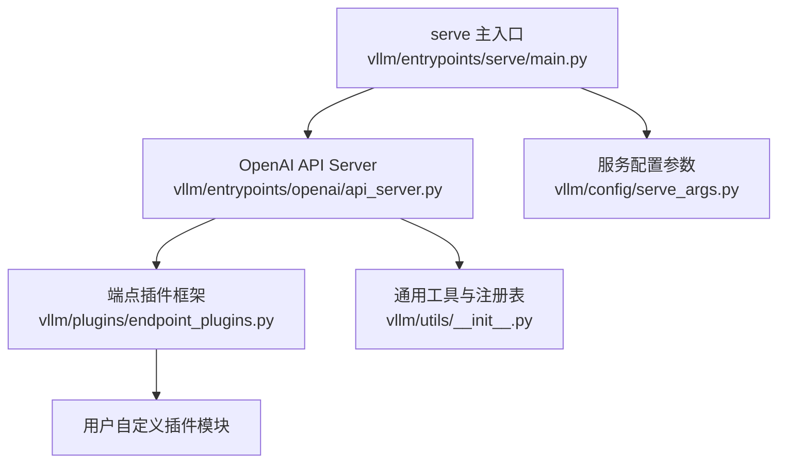
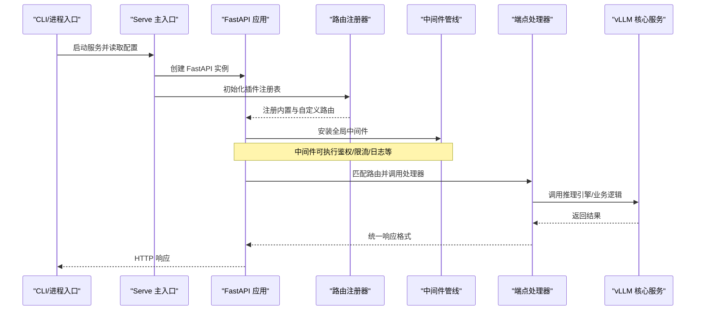
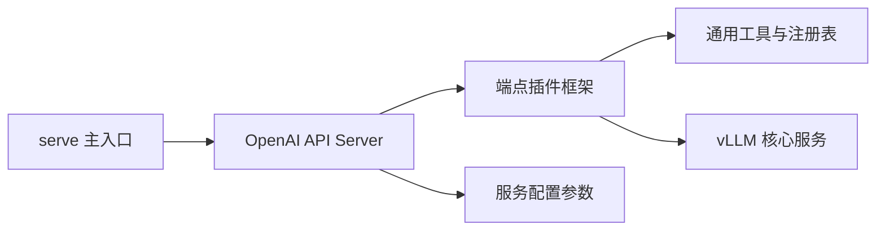

# 端点插件

<cite>
**本文引用的文件**   
- [vllm/plugins/endpoint_plugins.py](file://vllm/plugins/endpoint_plugins.py)
- [vllm/entrypoints/openai/api_server.py](file://vllm/entrypoints/openai/api_server.py)
- [vllm/entrypoints/serve/main.py](file://vllm/entrypoints/serve/main.py)
- [docs/design/endpoint_plugins.md](file://docs/design/endpoint_plugins.md)
- [vllm/config/serve_args.py](file://vllm/config/serve_args.py)
- [vllm/utils/__init__.py](file://vllm/utils/__init__.py)
</cite>

## 目录
1. [简介](#简介)
2. [项目结构](#项目结构)
3. [核心组件](#核心组件)
4. [架构总览](#架构总览)
5. [详细组件分析](#详细组件分析)
6. [依赖关系分析](#依赖关系分析)
7. [性能考虑](#性能考虑)
8. [故障排查指南](#故障排查指南)
9. [结论](#结论)
10. [附录](#附录)

## 简介
本章节面向希望扩展 vLLM HTTP API 的开发者，系统介绍“端点插件”机制。端点插件用于在不侵入核心服务代码的前提下，动态注册自定义路由、拦截请求、注入中间件、统一响应格式与鉴权限流等横切关注点。典型应用场景包括：
- API 扩展：新增 OpenAI 兼容接口之外的业务接口（如模型健康检查、批量任务管理）。
- 中间件处理：跨请求的日志、审计、指标上报、缓存、压缩等。
- 请求拦截：鉴权、配额控制、参数校验、灰度发布与流量治理。

## 项目结构
vLLM 将端点插件能力集中在 plugins 子包中，并通过 serve 入口在启动时加载。OpenAI 兼容服务器作为默认 HTTP 服务，会集成插件体系以支持扩展。

图表来源
- [vllm/entrypoints/serve/main.py](file://vllm/entrypoints/serve/main.py)
- [vllm/entrypoints/openai/api_server.py](file://vllm/entrypoints/openai/api_server.py)
- [vllm/plugins/endpoint_plugins.py](file://vllm/plugins/endpoint_plugins.py)
- [vllm/config/serve_args.py](file://vllm/config/serve_args.py)
- [vllm/utils/__init__.py](file://vllm/utils/__init__.py)

章节来源
- [docs/design/endpoint_plugins.md](file://docs/design/endpoint_plugins.md)
- [vllm/entrypoints/serve/main.py](file://vllm/entrypoints/serve/main.py)
- [vllm/entrypoints/openai/api_server.py](file://vllm/entrypoints/openai/api_server.py)
- [vllm/plugins/endpoint_plugins.py](file://vllm/plugins/endpoint_plugins.py)
- [vllm/config/serve_args.py](file://vllm/config/serve_args.py)
- [vllm/utils/__init__.py](file://vllm/utils/__init__.py)

## 核心组件
- 插件注册与发现
  - 提供统一的注册表与发现机制，支持按名称或路径加载插件。
  - 支持热更新：在运行期重新扫描并应用变更的插件定义。
- 路由注册
  - 允许插件向 FastAPI 应用挂载自定义路由，定义路径、方法、请求体/查询参数与响应模型。
- 中间件管线
  - 提供请求前/后钩子与全局中间件插桩点，便于实现鉴权、限流、日志、指标等。
- 请求与响应格式化
  - 标准化输入解析与输出序列化，确保与 OpenAI 兼容层一致。
- 配置与生命周期
  - 通过服务启动参数启用/禁用插件，支持运行时重载与优雅重启。

章节来源
- [vllm/plugins/endpoint_plugins.py](file://vllm/plugins/endpoint_plugins.py)
- [vllm/entrypoints/openai/api_server.py](file://vllm/entrypoints/openai/api_server.py)
- [vllm/config/serve_args.py](file://vllm/config/serve_args.py)

## 架构总览
下图展示了从进程启动到请求处理的端到端流程，以及插件在其中的介入点。

图表来源
- [vllm/entrypoints/serve/main.py](file://vllm/entrypoints/serve/main.py)
- [vllm/entrypoints/openai/api_server.py](file://vllm/entrypoints/openai/api_server.py)
- [vllm/plugins/endpoint_plugins.py](file://vllm/plugins/endpoint_plugins.py)

## 详细组件分析

### 插件注册与发现
- 设计要点
  - 集中式注册表：维护插件元数据（名称、版本、依赖、生命周期回调）。
  - 动态加载：支持从 Python 模块路径或包名导入，避免硬编码耦合。
  - 冲突检测：同名路由或重复注册时的错误提示与回滚策略。
- 开发建议
  - 为每个插件提供独立的模块与清晰的 __init__ 暴露点。
  - 使用版本号与兼容性声明，便于升级与回滚。

章节来源
- [vllm/plugins/endpoint_plugins.py](file://vllm/plugins/endpoint_plugins.py)

### 路由注册
- 设计要点
  - 基于 FastAPI 的路由装饰器或显式注册函数，支持 GET/POST/PUT/DELETE 等。
  - 参数校验：结合 Pydantic 模型进行入参校验与类型转换。
  - 文档生成：自动暴露 OpenAPI Schema，便于调试与客户端生成。
- 开发建议
  - 保持路由幂等性与资源命名规范。
  - 对复杂请求体提供示例与约束说明。

章节来源
- [vllm/entrypoints/openai/api_server.py](file://vllm/entrypoints/openai/api_server.py)
- [vllm/plugins/endpoint_plugins.py](file://vllm/plugins/endpoint_plugins.py)

### 中间件管线
- 设计要点
  - 请求前阶段：鉴权、签名校验、配额检查、速率限制、请求体大小限制。
  - 请求后阶段：响应体压缩、字段裁剪、审计日志、指标采集。
  - 异常捕获：统一错误码与错误消息，避免泄露内部细节。
- 开发建议
  - 中间件应无状态或具备线程安全共享状态。
  - 避免阻塞 I/O，必要时异步化。

章节来源
- [vllm/plugins/endpoint_plugins.py](file://vllm/plugins/endpoint_plugins.py)
- [vllm/entrypoints/openai/api_server.py](file://vllm/entrypoints/openai/api_server.py)

### 请求与响应格式化
- 设计要点
  - 输入：统一解析 JSON、表单、流式上传；支持分页、过滤、排序。
  - 输出：结构化响应体，包含状态码、数据、元信息（traceId、耗时）。
  - 流式：对长耗时任务提供 SSE/WS 流式输出。
- 开发建议
  - 严格区分成功与失败响应结构，便于客户端解析。
  - 大对象输出采用分块与延迟加载。

章节来源
- [vllm/plugins/endpoint_plugins.py](file://vllm/plugins/endpoint_plugins.py)
- [vllm/entrypoints/openai/api_server.py](file://vllm/entrypoints/openai/api_server.py)

### 配置与生命周期
- 设计要点
  - 启动参数：通过命令行或服务配置启用/禁用插件、指定加载路径。
  - 生命周期：on_init、on_start、on_reload、on_shutdown 钩子。
  - 热更新：监听文件系统或配置中心变更，触发增量重载。
- 开发建议
  - 配置项需有默认值与校验规则。
  - 重载过程需保证原子性与一致性。

章节来源
- [vllm/config/serve_args.py](file://vllm/config/serve_args.py)
- [vllm/plugins/endpoint_plugins.py](file://vllm/plugins/endpoint_plugins.py)

### 内置功能与扩展点
- 监控与日志
  - 指标：QPS、延迟分布、错误率、GPU/CPU 利用率。
  - 日志：结构化访问日志与错误堆栈脱敏。
- 限流保护
  - 令牌桶/漏桶算法，支持按租户/模型/路径维度限流。
- 认证授权
  - 支持 API Key、JWT、OAuth2 等常见方案，可扩展自定义鉴权器。

章节来源
- [docs/design/endpoint_plugins.md](file://docs/design/endpoint_plugins.md)
- [vllm/plugins/endpoint_plugins.py](file://vllm/plugins/endpoint_plugins.py)

### 自定义端点插件开发指南
- FastAPI 集成
  - 使用官方路由注册方式，遵循 vLLM 的请求/响应约定。
  - 利用 Pydantic 模型进行参数校验与文档生成。
- 中间件开发
  - 实现请求前后钩子，注意异常传播与上下文传递。
  - 对第三方库调用进行超时与重试封装。
- 认证授权实现
  - 优先使用标准协议（JWT/OAuth2），避免自研加密逻辑。
  - 权限粒度细化到资源级，支持黑名单与白名单。

章节来源
- [vllm/entrypoints/openai/api_server.py](file://vllm/entrypoints/openai/api_server.py)
- [vllm/plugins/endpoint_plugins.py](file://vllm/plugins/endpoint_plugins.py)

### 配置与部署
- 动态加载
  - 通过环境变量或配置文件指定插件路径，支持多插件组合。
  - 插件间依赖通过注册表解析，避免循环依赖。
- 热更新支持
  - 监听变更事件，触发按需重载；对正在处理的请求进行优雅迁移。
  - 提供回滚机制，确保服务稳定性。

章节来源
- [vllm/config/serve_args.py](file://vllm/config/serve_args.py)
- [vllm/plugins/endpoint_plugins.py](file://vllm/plugins/endpoint_plugins.py)

### 内置端点插件功能
- 监控
  - 暴露 Prometheus 指标端点，支持自定义指标导出。
- 日志记录
  - 结构化日志，支持分级与采样，避免日志风暴。
- 限流保护
  - 全局与路由级限流，支持突发与持久化配额。

章节来源
- [docs/design/endpoint_plugins.md](file://docs/design/endpoint_plugins.md)
- [vllm/plugins/endpoint_plugins.py](file://vllm/plugins/endpoint_plugins.py)

### 性能考虑与优化策略
- 路由匹配
  - 使用高效路由树，减少正则匹配开销。
- 中间件
  - 避免同步阻塞操作，I/O 异步化；合并多次小 I/O。
- 序列化
  - 使用高效的 JSON 编解码器，必要时启用二进制协议。
- 缓存
  - 对热点查询结果进行内存/分布式缓存，设置合理 TTL。
- 并发
  - 合理设置工作线程/协程池大小，避免过度竞争。

章节来源
- [vllm/plugins/endpoint_plugins.py](file://vllm/plugins/endpoint_plugins.py)
- [vllm/entrypoints/openai/api_server.py](file://vllm/entrypoints/openai/api_server.py)

### 安全最佳实践与错误处理
- 安全
  - 最小权限原则，敏感信息不落地；传输层强制 TLS。
  - 输入校验与白名单，防止注入与越权。
- 错误处理
  - 统一错误码与消息模板，屏蔽内部堆栈。
  - 对超时、熔断、降级进行明确处理与告警。

章节来源
- [vllm/plugins/endpoint_plugins.py](file://vllm/plugins/endpoint_plugins.py)
- [docs/design/endpoint_plugins.md](file://docs/design/endpoint_plugins.md)

### 测试与调试技巧
- 单元测试
  - 针对路由与中间件编写用例，覆盖边界条件与异常分支。
- 集成测试
  - 使用测试夹具模拟下游依赖，验证端到端流程。
- 调试
  - 开启详细日志与追踪 ID，定位慢请求与错误链路。
  - 使用压测工具评估限流与吞吐表现。

章节来源
- [vllm/plugins/endpoint_plugins.py](file://vllm/plugins/endpoint_plugins.py)
- [vllm/entrypoints/openai/api_server.py](file://vllm/entrypoints/openai/api_server.py)

## 依赖关系分析
下图展示关键模块间的依赖关系与职责边界。

图表来源
- [vllm/entrypoints/serve/main.py](file://vllm/entrypoints/serve/main.py)
- [vllm/entrypoints/openai/api_server.py](file://vllm/entrypoints/openai/api_server.py)
- [vllm/plugins/endpoint_plugins.py](file://vllm/plugins/endpoint_plugins.py)
- [vllm/config/serve_args.py](file://vllm/config/serve_args.py)
- [vllm/utils/__init__.py](file://vllm/utils/__init__.py)

章节来源
- [vllm/entrypoints/serve/main.py](file://vllm/entrypoints/serve/main.py)
- [vllm/entrypoints/openai/api_server.py](file://vllm/entrypoints/openai/api_server.py)
- [vllm/plugins/endpoint_plugins.py](file://vllm/plugins/endpoint_plugins.py)
- [vllm/config/serve_args.py](file://vllm/config/serve_args.py)
- [vllm/utils/__init__.py](file://vllm/utils/__init__.py)

## 性能考虑
- 路由与中间件应避免阻塞，尽量使用异步与非阻塞 I/O。
- 序列化与反序列化选择高性能实现，必要时启用零拷贝。
- 缓存热点数据，降低后端压力；合理设置过期策略。
- 限流与熔断保护上游与下游，保障整体可用性。
- 监控关键指标，建立容量规划与弹性伸缩策略。

[本节为通用指导，不直接分析具体文件]

## 故障排查指南
- 常见问题
  - 插件未加载：检查路径与依赖是否完整，确认注册表已初始化。
  - 路由冲突：排查同名路由与重复注册，清理无效插件。
  - 中间件异常：查看日志与追踪 ID，定位阻塞或超时环节。
- 诊断步骤
  - 开启详细日志与指标，观察 QPS、延迟与错误率变化。
  - 逐步禁用插件，缩小问题范围。
  - 使用压测工具复现场景，验证修复效果。

章节来源
- [vllm/plugins/endpoint_plugins.py](file://vllm/plugins/endpoint_plugins.py)
- [vllm/entrypoints/openai/api_server.py](file://vllm/entrypoints/openai/api_server.py)

## 结论
端点插件体系为 vLLM 提供了灵活、可扩展的 HTTP 能力扩展机制。通过统一的注册、路由、中间件与生命周期管理，开发者可以在不侵入核心代码的情况下，快速实现鉴权、限流、监控、日志等横切功能，并支持动态加载与热更新，满足生产环境的演进需求。

[本节为总结性内容，不直接分析具体文件]

## 附录
- 术语
  - 端点插件：用于扩展 HTTP 端点的模块化组件。
  - 中间件：在请求处理前后执行的横切逻辑。
  - 热更新：在运行期动态加载/卸载插件的能力。
- 参考
  - 设计文档：[docs/design/endpoint_plugins.md](file://docs/design/endpoint_plugins.md)
  - 服务入口：[vllm/entrypoints/serve/main.py](file://vllm/entrypoints/serve/main.py)
  - OpenAI 服务器：[vllm/entrypoints/openai/api_server.py](file://vllm/entrypoints/openai/api_server.py)
  - 插件框架：[vllm/plugins/endpoint_plugins.py](file://vllm/plugins/endpoint_plugins.py)
  - 服务配置：[vllm/config/serve_args.py](file://vllm/config/serve_args.py)
  - 通用工具：[vllm/utils/__init__.py](file://vllm/utils/__init__.py)