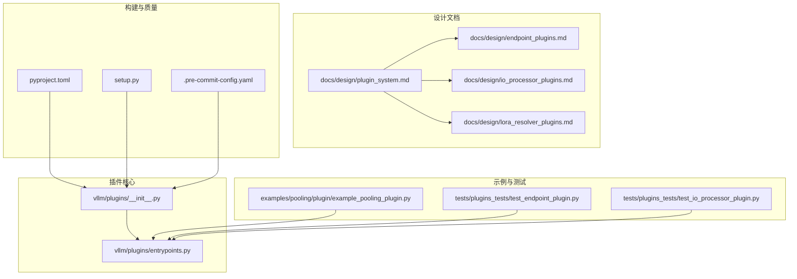
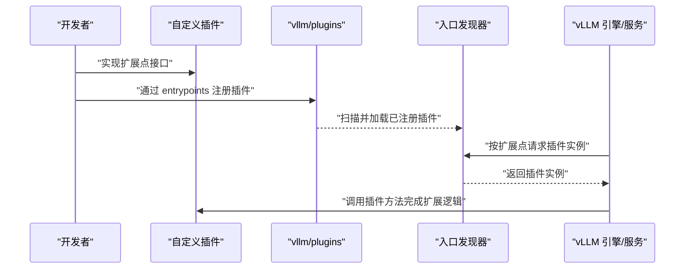
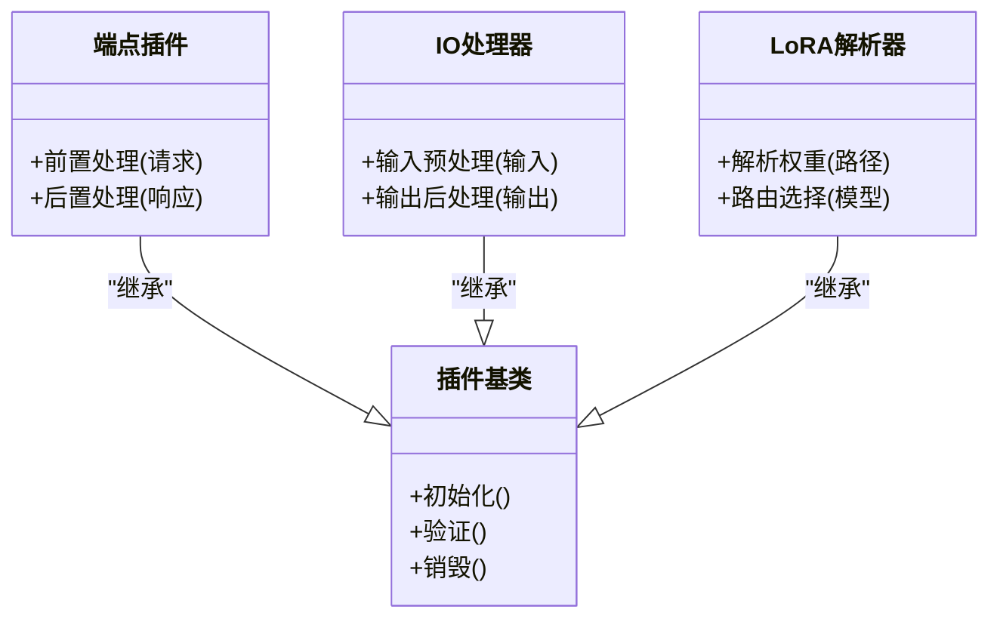
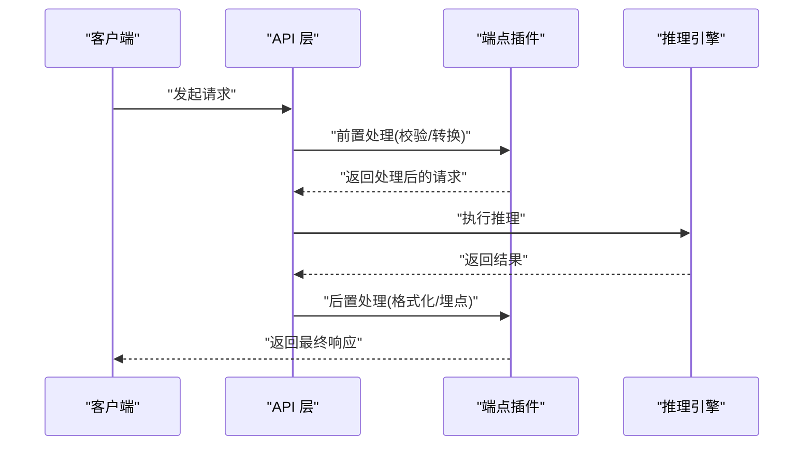
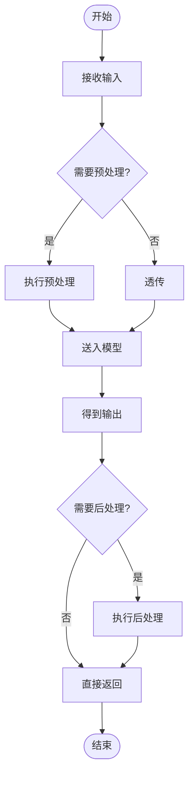
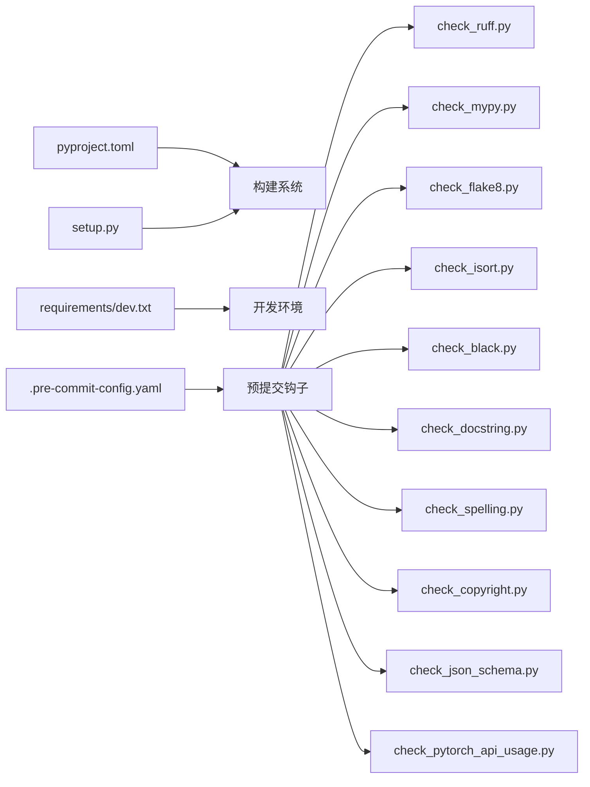

# 自定义插件开发

<cite>
**本文引用的文件**   
- [README.md](file://README.md)
- [pyproject.toml](file://pyproject.toml)
- [setup.py](file://setup.py)
- [vllm/plugins/__init__.py](file://vllm/plugins/__init__.py)
- [vllm/plugins/entrypoints.py](file://vllm/plugins/entrypoints.py)
- [docs/design/plugin_system.md](file://docs/design/plugin_system.md)
- [docs/design/endpoint_plugins.md](file://docs/design/endpoint_plugins.md)
- [docs/design/io_processor_plugins.md](file://docs/design/io_processor_plugins.md)
- [docs/design/lora_resolver_plugins.md](file://docs/design/lora_resolver_plugins.md)
- [examples/pooling/plugin/example_pooling_plugin.py](file://examples/pooling/plugin/example_pooling_plugin.py)
- [tests/plugins_tests/test_endpoint_plugin.py](file://tests/plugins_tests/test_endpoint_plugin.py)
- [tests/plugins_tests/test_io_processor_plugin.py](file://tests/plugins_tests/test_io_processor_plugin.py)
- [requirements/dev.txt](file://requirements/dev.txt)
- [.pre-commit-config.yaml](file://.pre-commit-config.yaml)
- [tools/pre_commit/check_import_order.py](file://tools/pre_commit/check_import_order.py)
- [tools/pre_commit/check_no_imports.py](file://tools/pre_commit/check_no_imports.py)
- [tools/pre_commit/check_typed_ast.py](file://tools/pre_commit/check_typed_ast.py)
- [tools/pre_commit/check_pytorch_api_usage.py](file://tools/pre_commit/check_pytorch_api_usage.py)
- [tools/pre_commit/check_spelling.py](file://tools/pre_commit/check_spelling.py)
- [tools/pre_commit/check_yamls.py](file://tools/pre_commit/check_yamls.py)
- [tools/pre_commit/check_copyright.py](file://tools/pre_commit/check_copyright.py)
- [tools/pre_commit/check_json_schema.py](file://tools/pre_commit/check_json_schema.py)
- [tools/pre_commit/check_ruff.py](file://tools/pre_commit/check_ruff.py)
- [tools/pre_commit/check_mypy.py](file://tools/pre_commit/check_mypy.py)
- [tools/pre_commit/check_flake8.py](file://tools/pre_commit/check_flake8.py)
- [tools/pre_commit/check_isort.py](file://tools/pre_commit/check_isort.py)
- [tools/pre_commit/check_black.py](file://tools/pre_commit/check_black.py)
- [tools/pre_commit/check_docstring.py](file://tools/pre_commit/check_docstring.py)
- [tools/pre_commit/check_vllm_imports.py](file://tools/pre_commit/check_vllm_imports.py)
</cite>

## 目录
1. [简介](#简介)
2. [项目结构](#项目结构)
3. [核心组件](#核心组件)
4. [架构总览](#架构总览)
5. [详细组件分析](#详细组件分析)
6. [依赖分析](#依赖分析)
7. [性能考虑](#性能考虑)
8. [故障排查指南](#故障排查指南)
9. [结论](#结论)
10. [附录](#附录)

## 简介
本指南面向希望在 vLLM 中开发“自定义插件”的工程师与研究者，覆盖从环境准备、项目组织、开发流程、打包发布、测试策略、文档规范到质量保障与长期维护的全生命周期。vLLM 通过统一的插件系统暴露多种扩展点（如端点插件、IO 处理器、LoRA 解析器等），开发者可通过实现对应接口并注册为可发现模块，将功能无缝接入推理服务或批处理管线。

## 项目结构
vLLM 的插件体系由“核心注册机制 + 多类扩展点 + 示例与测试”组成：
- 核心注册机制：位于 vllm/plugins，提供插件入口发现与统一加载能力。
- 扩展点设计：在 docs/design 下对各类插件进行抽象说明，包括端点插件、IO 处理器、LoRA 解析器、通用插件系统等。
- 示例与测试：examples/pooling/plugin 提供最小可用示例；tests/plugins_tests 包含针对各扩展点的单元测试与集成测试。
- 构建与配置：pyproject.toml 与 setup.py 定义包元数据与安装行为；requirements 与 .pre-commit-config.yaml 管理依赖与代码质量工具链。

图表来源
- [vllm/plugins/__init__.py](file://vllm/plugins/__init__.py)
- [vllm/plugins/entrypoints.py](file://vllm/plugins/entrypoints.py)
- [docs/design/plugin_system.md](file://docs/design/plugin_system.md)
- [docs/design/endpoint_plugins.md](file://docs/design/endpoint_plugins.md)
- [docs/design/io_processor_plugins.md](file://docs/design/io_processor_plugins.md)
- [docs/design/lora_resolver_plugins.md](file://docs/design/lora_resolver_plugins.md)
- [examples/pooling/plugin/example_pooling_plugin.py](file://examples/pooling/plugin/example_pooling_plugin.py)
- [tests/plugins_tests/test_endpoint_plugin.py](file://tests/plugins_tests/test_endpoint_plugin.py)
- [tests/plugins_tests/test_io_processor_plugin.py](file://tests/plugins_tests/test_io_processor_plugin.py)
- [pyproject.toml](file://pyproject.toml)
- [setup.py](file://setup.py)
- [.pre-commit-config.yaml](file://.pre-commit-config.yaml)

章节来源
- [README.md](file://README.md)
- [pyproject.toml](file://pyproject.toml)
- [setup.py](file://setup.py)
- [vllm/plugins/__init__.py](file://vllm/plugins/__init__.py)
- [vllm/plugins/entrypoints.py](file://vllm/plugins/entrypoints.py)
- [docs/design/plugin_system.md](file://docs/design/plugin_system.md)
- [docs/design/endpoint_plugins.md](file://docs/design/endpoint_plugins.md)
- [docs/design/io_processor_plugins.md](file://docs/design/io_processor_plugins.md)
- [docs/design/lora_resolver_plugins.md](file://docs/design/lora_resolver_plugins.md)
- [examples/pooling/plugin/example_pooling_plugin.py](file://examples/pooling/plugin/example_pooling_plugin.py)
- [tests/plugins_tests/test_endpoint_plugin.py](file://tests/plugins_tests/test_endpoint_plugin.py)
- [tests/plugins_tests/test_io_processor_plugin.py](file://tests/plugins_tests/test_io_processor_plugin.py)

## 核心组件
- 插件入口与发现
  - vllm/plugins/__init__.py：定义插件命名空间与基础类型，供外部插件导入与继承。
  - vllm/plugins/entrypoints.py：提供插件入口点注册与发现逻辑，支持按扩展点分类加载。
- 扩展点设计
  - 端点插件：用于扩展 HTTP/OpenAI 等接口的请求/响应处理链路。
  - IO 处理器：用于扩展输入/输出预处理与后处理逻辑。
  - LoRA 解析器：用于扩展 LoRA 权重加载与路由策略。
- 示例插件
  - examples/pooling/plugin/example_pooling_plugin.py：展示如何声明一个最小可用的插件实现。
- 测试套件
  - tests/plugins_tests/*：覆盖端点插件、IO 处理器等的正确性与兼容性。

章节来源
- [vllm/plugins/__init__.py](file://vllm/plugins/__init__.py)
- [vllm/plugins/entrypoints.py](file://vllm/plugins/entrypoints.py)
- [docs/design/endpoint_plugins.md](file://docs/design/endpoint_plugins.md)
- [docs/design/io_processor_plugins.md](file://docs/design/io_processor_plugins.md)
- [docs/design/lora_resolver_plugins.md](file://docs/design/lora_resolver_plugins.md)
- [examples/pooling/plugin/example_pooling_plugin.py](file://examples/pooling/plugin/example_pooling_plugin.py)
- [tests/plugins_tests/test_endpoint_plugin.py](file://tests/plugins_tests/test_endpoint_plugin.py)
- [tests/plugins_tests/test_io_processor_plugin.py](file://tests/plugins_tests/test_io_processor_plugin.py)

## 架构总览
下图展示了插件从“实现 → 注册 → 发现 → 使用”的端到端流程，以及不同扩展点在 vLLM 中的位置。

图表来源
- [vllm/plugins/__init__.py](file://vllm/plugins/__init__.py)
- [vllm/plugins/entrypoints.py](file://vllm/plugins/entrypoints.py)
- [docs/design/plugin_system.md](file://docs/design/plugin_system.md)

## 详细组件分析

### 插件系统与扩展点
- 插件系统抽象
  - 统一入口：所有插件通过 vllm/plugins 提供的命名空间与基类进行实现。
  - 扩展点分类：端点插件、IO 处理器、LoRA 解析器等各自有明确的职责边界与契约。
- 设计要点
  - 低耦合：插件仅依赖必要接口，避免侵入核心逻辑。
  - 可发现性：通过 entrypoints 机制自动发现与加载。
  - 可扩展性：新增扩展点时保持向后兼容。

图表来源
- [docs/design/plugin_system.md](file://docs/design/plugin_system.md)
- [docs/design/endpoint_plugins.md](file://docs/design/endpoint_plugins.md)
- [docs/design/io_processor_plugins.md](file://docs/design/io_processor_plugins.md)
- [docs/design/lora_resolver_plugins.md](file://docs/design/lora_resolver_plugins.md)

章节来源
- [docs/design/plugin_system.md](file://docs/design/plugin_system.md)
- [docs/design/endpoint_plugins.md](file://docs/design/endpoint_plugins.md)
- [docs/design/io_processor_plugins.md](file://docs/design/io_processor_plugins.md)
- [docs/design/lora_resolver_plugins.md](file://docs/design/lora_resolver_plugins.md)

### 端点插件（Endpoint Plugins）
- 作用：扩展 OpenAI/HTTP 等端点的请求/响应处理，例如鉴权、限流、日志、格式转换等。
- 开发步骤：
  1. 实现端点插件接口（参考设计文档）。
  2. 在插件模块中通过 entrypoints 注册。
  3. 编写单元测试验证请求/响应链路。
- 典型流程：

图表来源
- [docs/design/endpoint_plugins.md](file://docs/design/endpoint_plugins.md)
- [tests/plugins_tests/test_endpoint_plugin.py](file://tests/plugins_tests/test_endpoint_plugin.py)

章节来源
- [docs/design/endpoint_plugins.md](file://docs/design/endpoint_plugins.md)
- [tests/plugins_tests/test_endpoint_plugin.py](file://tests/plugins_tests/test_endpoint_plugin.py)

### IO 处理器插件（IO Processor Plugins）
- 作用：扩展输入/输出的预处理与后处理，如文本清洗、图像解码、结构化输出约束等。
- 开发步骤：
  1. 实现 IO 处理器接口。
  2. 通过 entrypoints 注册。
  3. 编写单测与集成用例，覆盖常见输入形态。
- 处理流程：

图表来源
- [docs/design/io_processor_plugins.md](file://docs/design/io_processor_plugins.md)
- [tests/plugins_tests/test_io_processor_plugin.py](file://tests/plugins_tests/test_io_processor_plugin.py)

章节来源
- [docs/design/io_processor_plugins.md](file://docs/design/io_processor_plugins.md)
- [tests/plugins_tests/test_io_processor_plugin.py](file://tests/plugins_tests/test_io_processor_plugin.py)

### LoRA 解析器插件（LoRA Resolver Plugins）
- 作用：扩展 LoRA 权重加载与路由策略，支持多 LoRA 动态切换、优先级与冲突解决。
- 开发步骤：
  1. 实现 LoRA 解析器接口。
  2. 通过 entrypoints 注册。
  3. 编写用例验证权重加载与路由正确性。

章节来源
- [docs/design/lora_resolver_plugins.md](file://docs/design/lora_resolver_plugins.md)

### 示例插件（Pooling Example）
- 目标：展示如何实现一个最小可用的插件，便于快速上手。
- 关键点：
  - 遵循 vllm/plugins 的命名空间与基类约定。
  - 通过 entrypoints 注册插件名与实现类。
  - 提供清晰的文档与示例用法。

章节来源
- [examples/pooling/plugin/example_pooling_plugin.py](file://examples/pooling/plugin/example_pooling_plugin.py)
- [vllm/plugins/__init__.py](file://vllm/plugins/__init__.py)
- [vllm/plugins/entrypoints.py](file://vllm/plugins/entrypoints.py)

## 依赖分析
- 构建与包管理
  - pyproject.toml：定义包元数据、依赖与构建脚本。
  - setup.py：兼容传统 Python 包构建流程。
- 开发依赖
  - requirements/dev.txt：开发与测试所需依赖集合。
- 代码质量与预提交钩子
  - .pre-commit-config.yaml：集中管理 lint、类型检查、拼写检查等。
  - tools/pre_commit/*：具体检查脚本（ruff、mypy、flake8、isort、black、docstring、spelling、copyright、JSON schema、PyTorch API 使用等）。

图表来源
- [pyproject.toml](file://pyproject.toml)
- [setup.py](file://setup.py)
- [requirements/dev.txt](file://requirements/dev.txt)
- [.pre-commit-config.yaml](file://.pre-commit-config.yaml)
- [tools/pre_commit/check_ruff.py](file://tools/pre_commit/check_ruff.py)
- [tools/pre_commit/check_mypy.py](file://tools/pre_commit/check_mypy.py)
- [tools/pre_commit/check_flake8.py](file://tools/pre_commit/check_flake8.py)
- [tools/pre_commit/check_isort.py](file://tools/pre_commit/check_isort.py)
- [tools/pre_commit/check_black.py](file://tools/pre_commit/check_black.py)
- [tools/pre_commit/check_docstring.py](file://tools/pre_commit/check_docstring.py)
- [tools/pre_commit/check_spelling.py](file://tools/pre_commit/check_spelling.py)
- [tools/pre_commit/check_copyright.py](file://tools/pre_commit/check_copyright.py)
- [tools/pre_commit/check_json_schema.py](file://tools/pre_commit/check_json_schema.py)
- [tools/pre_commit/check_pytorch_api_usage.py](file://tools/pre_commit/check_pytorch_api_usage.py)

章节来源
- [pyproject.toml](file://pyproject.toml)
- [setup.py](file://setup.py)
- [requirements/dev.txt](file://requirements/dev.txt)
- [.pre-commit-config.yaml](file://.pre-commit-config.yaml)

## 性能考虑
- 插件开销控制
  - 避免在热路径中进行重型计算；必要时缓存中间结果。
  - 合理拆分预处理/后处理逻辑，减少不必要的序列化/反序列化。
- 资源隔离
  - 插件应限制内存占用与线程数，避免影响主推理进程。
- 可观测性
  - 通过指标与日志记录关键路径耗时，定位瓶颈。
- 基准测试
  - 使用 benchmarks 目录下的工具对插件前后进行对比评估。

[本节为通用指导，不直接分析具体文件]

## 故障排查指南
- 常见问题
  - 插件未加载：检查 entrypoints 注册是否正确、命名空间是否匹配。
  - 接口不兼容：确认实现的扩展点版本与 vLLM 要求一致。
  - 依赖缺失：确保 requirements/dev.txt 与运行环境依赖完整。
- 调试建议
  - 启用详细日志，定位插件调用链。
  - 使用单元测试复现问题，逐步缩小范围。
  - 借助 pre-commit 钩子提前发现风格与类型错误。

章节来源
- [tests/plugins_tests/test_endpoint_plugin.py](file://tests/plugins_tests/test_endpoint_plugin.py)
- [tests/plugins_tests/test_io_processor_plugin.py](file://tests/plugins_tests/test_io_processor_plugin.py)
- [.pre-commit-config.yaml](file://.pre-commit-config.yaml)

## 结论
vLLM 的插件系统提供了清晰、可扩展的扩展点与统一的注册机制。通过遵循设计文档、示例与测试规范，并结合完善的构建与质量保障工具链，开发者可以高效地实现、测试与发布高质量的自定义插件。建议在迭代过程中持续完善文档与测试，确保插件的稳定性和可维护性。

[本节为总结性内容，不直接分析具体文件]

## 附录

### 环境设置与前置条件
- 必备工具
  - Python（满足 vLLM 版本要求）、pip、git
  - 可选：CUDA/ROCm/XPU 驱动（根据硬件需求）
- 依赖安装
  - 使用 requirements/dev.txt 安装开发与测试依赖
  - 使用 pyproject.toml 与 setup.py 构建本地包
- 预提交钩子
  - 安装并启用 .pre-commit-config.yaml 中的检查规则

章节来源
- [requirements/dev.txt](file://requirements/dev.txt)
- [pyproject.toml](file://pyproject.toml)
- [setup.py](file://setup.py)
- [.pre-commit-config.yaml](file://.pre-commit-config.yaml)

### 插件项目结构与命名规范
- 目录布局
  - 根目录：插件元数据（pyproject.toml/setup.py）
  - src/ 或包名：插件实现代码
  - tests/：单元测试与集成测试
  - docs/：API 文档与使用示例
- 文件命名
  - 模块名采用小写下划线风格
  - 插件入口类与方法名需与设计文档保持一致
- 配置文件
  - pyproject.toml：包元数据、依赖、构建脚本
  - 其他配置（如 YAML/JSON）需遵循 schema 校验

章节来源
- [pyproject.toml](file://pyproject.toml)
- [setup.py](file://setup.py)
- [tools/pre_commit/check_json_schema.py](file://tools/pre_commit/check_json_schema.py)

### 插件开发流程（从需求到实现）
- 需求分析
  - 明确扩展点类型（端点/IO/LoRA）与业务目标
- 设计与接口
  - 参考 docs/design 中的扩展点设计，确定输入/输出契约
- 编码实现
  - 在插件模块中实现接口并通过 entrypoints 注册
- 测试验证
  - 编写单测与集成用例，覆盖正常与异常路径
- 文档与示例
  - 补充 API 文档与使用示例，便于他人复用
- 质量保障
  - 启用 pre-commit 钩子，执行 lint、类型检查、拼写检查等

章节来源
- [docs/design/plugin_system.md](file://docs/design/plugin_system.md)
- [docs/design/endpoint_plugins.md](file://docs/design/endpoint_plugins.md)
- [docs/design/io_processor_plugins.md](file://docs/design/io_processor_plugins.md)
- [docs/design/lora_resolver_plugins.md](file://docs/design/lora_resolver_plugins.md)
- [.pre-commit-config.yaml](file://.pre-commit-config.yaml)

### 打包与发布
- 构建
  - 使用 pyproject.toml 与 setup.py 生成 wheel/sdist
- 版本管理
  - 遵循语义化版本（MAJOR.MINOR.PATCH）
  - 在 pyproject.toml 中更新版本号与变更日志
- 分发渠道
  - PyPI 私有仓库或企业镜像
  - 容器镜像中包含插件依赖与环境

章节来源
- [pyproject.toml](file://pyproject.toml)
- [setup.py](file://setup.py)

### 测试策略
- 单元测试
  - 覆盖插件核心逻辑与边界条件
- 集成测试
  - 模拟真实请求/输入，验证端到端链路
- 性能测试
  - 使用 benchmarks 工具评估吞吐与延迟
- 回归测试
  - 在 CI 中自动化执行，防止破坏性变更

章节来源
- [tests/plugins_tests/test_endpoint_plugin.py](file://tests/plugins_tests/test_endpoint_plugin.py)
- [tests/plugins_tests/test_io_processor_plugin.py](file://tests/plugins_tests/test_io_processor_plugin.py)

### 文档编写规范
- API 文档
  - 描述接口、参数、返回值与异常
  - 提供最小可用示例
- 使用指南
  - 安装、配置、运行步骤
- 设计文档
  - 扩展点契约与演进策略

章节来源
- [docs/design/plugin_system.md](file://docs/design/plugin_system.md)
- [docs/design/endpoint_plugins.md](file://docs/design/endpoint_plugins.md)
- [docs/design/io_processor_plugins.md](file://docs/design/io_processor_plugins.md)
- [docs/design/lora_resolver_plugins.md](file://docs/design/lora_resolver_plugins.md)

### 质量保证工具与方法
- 代码检查
  - ruff、flake8、isort、black
- 类型检查
  - mypy
- 文档与拼写
  - docstring 检查、拼写检查
- 版权与合规
  - copyright 检查
- PyTorch API 使用
  - check_pytorch_api_usage.py 确保兼容性

章节来源
- [.pre-commit-config.yaml](file://.pre-commit-config.yaml)
- [tools/pre_commit/check_ruff.py](file://tools/pre_commit/check_ruff.py)
- [tools/pre_commit/check_mypy.py](file://tools/pre_commit/check_mypy.py)
- [tools/pre_commit/check_flake8.py](file://tools/pre_commit/check_flake8.py)
- [tools/pre_commit/check_isort.py](file://tools/pre_commit/check_isort.py)
- [tools/pre_commit/check_black.py](file://tools/pre_commit/check_black.py)
- [tools/pre_commit/check_docstring.py](file://tools/pre_commit/check_docstring.py)
- [tools/pre_commit/check_spelling.py](file://tools/pre_commit/check_spelling.py)
- [tools/pre_commit/check_copyright.py](file://tools/pre_commit/check_copyright.py)
- [tools/pre_commit/check_pytorch_api_usage.py](file://tools/pre_commit/check_pytorch_api_usage.py)

### 插件维护与更新策略
- 版本演进
  - 保持向后兼容，废弃旧接口需给出迁移指引
- 依赖管理
  - 定期升级依赖，修复安全漏洞
- 监控与告警
  - 在生产环境收集指标与错误日志
- 社区协作
  - 通过 Issue/PR 流程收集反馈与贡献

[本节为通用指导，不直接分析具体文件]