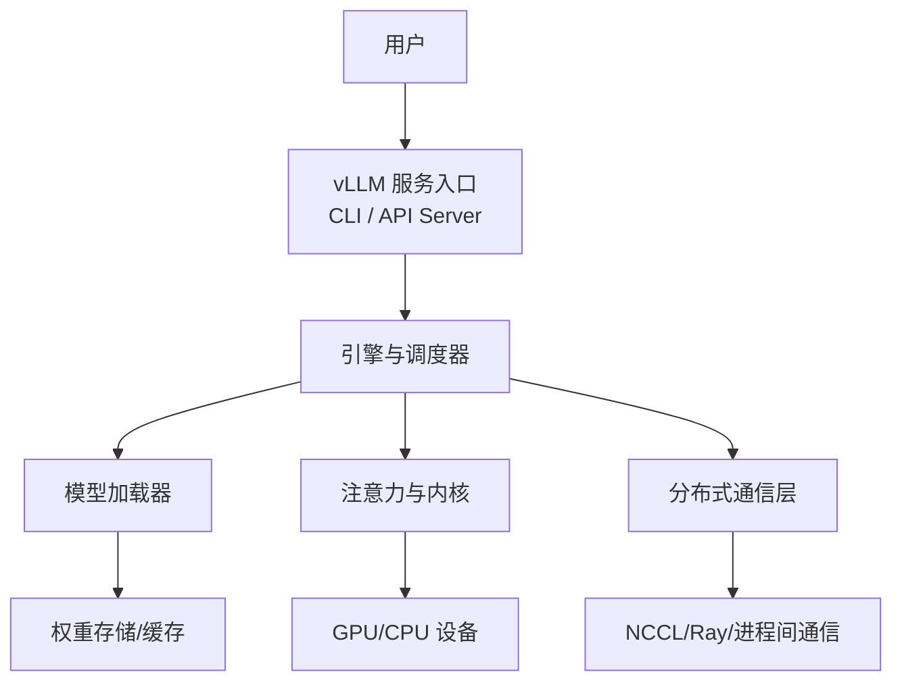
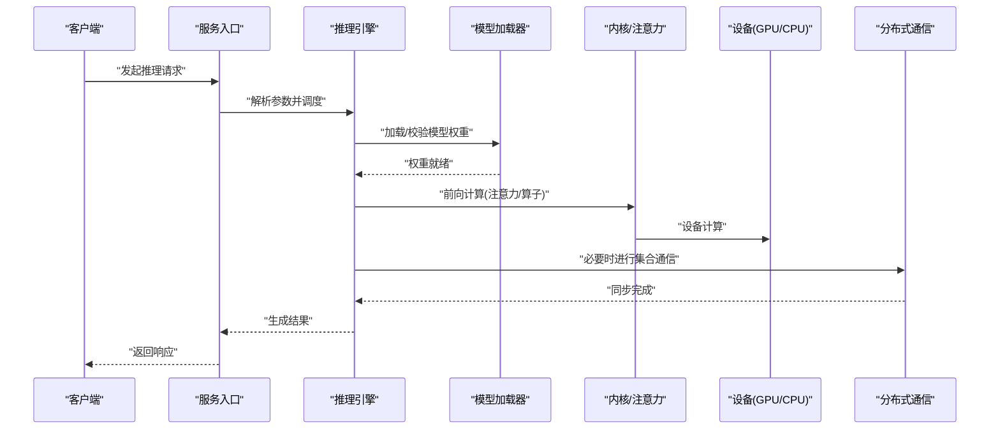
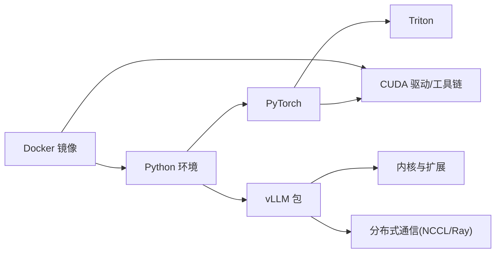

# 故障排除和常见问题

<cite>
**本文引用的文件**   
- [README.md](file://README.md)
- [docs/usage/troubleshooting.md](file://docs/usage/troubleshooting.md)
- [docs/getting_started/installation/cuda_installation.md](file://docs/getting_started/installation/cuda_installation.md)
- [docs/getting_started/installation/docker_installation.md](file://docs/getting_started/installation/docker_installation.md)
- [docs/serving/distributed_troubleshooting.md](file://docs/serving/distributed_troubleshooting.md)
- [vllm/logger.py](file://vllm/logger.py)
- [vllm/exceptions.py](file://vllm/exceptions.py)
- [requirements/cuda.txt](file://requirements/cuda.txt)
- [docker/Dockerfile](file://docker/Dockerfile)
- [benchmarks/benchmark_throughput.py](file://benchmarks/benchmark_throughput.py)
</cite>

## 目录
1. [简介](#简介)
2. [项目结构](#项目结构)
3. [核心组件](#核心组件)
4. [架构总览](#架构总览)
5. [详细组件分析](#详细组件分析)
6. [依赖关系分析](#依赖关系分析)
7. [性能注意事项](#性能注意事项)
8. [故障排除指南](#故障排除指南)
9. [结论](#结论)
10. [附录](#附录)

## 简介
本指南面向使用 vLLM 进行模型推理与服务的工程师与运维人员，聚焦安装、运行时、性能与分布式环境的常见问题与解决方案。内容覆盖依赖冲突、CUDA 版本不兼容、权限问题、内存溢出、模型加载失败、推理异常、低吞吐/高延迟/GPU 利用率低、通信失败、节点同步与数据一致性等主题，并提供日志分析方法与社区支持渠道。

## 项目结构
vLLM 仓库包含文档、示例、测试、构建脚本与核心代码。与故障排除直接相关的资源主要位于：
- 使用与排错文档：docs/usage/troubleshooting.md
- 安装指南（CUDA/Docker）：docs/getting_started/installation/*
- 分布式排错：docs/serving/distributed_troubleshooting.md
- 日志与异常定义：vllm/logger.py、vllm/exceptions.py
- 依赖与环境：requirements/cuda.txt、docker/Dockerfile
- 性能基准：benchmarks/benchmark_throughput.py

[本图为概念性结构图，无需来源标注]

## 核心组件
- 日志系统：集中化日志输出、级别控制与结构化字段，便于定位问题。
- 异常体系：统一的错误类型与消息格式，便于上层捕获与展示。
- 安装与环境：CUDA/Triton/依赖版本约束，Docker 镜像提供开箱即用环境。
- 分布式通信：多进程/多机通信、集合操作与同步原语。
- 性能基准：吞吐/时延测量脚本，用于回归与优化验证。

章节来源
- [vllm/logger.py](file://vllm/logger.py)
- [vllm/exceptions.py](file://vllm/exceptions.py)

## 架构总览
下图展示了从请求进入、模型加载、执行到返回的关键路径，以及分布式通信与设备交互点。

[本图为概念性流程图，无需来源标注]

## 详细组件分析

### 安装与环境问题
- 依赖冲突
  - 现象：pip 安装时报版本冲突或编译失败。
  - 排查：检查 Python、CUDA、Torch、Triton 版本组合；参考 requirements/cuda.txt 中的约束；在隔离环境中安装。
  - 解决：固定版本、使用官方 Docker 镜像或 conda/pip 虚拟环境；避免混用不同 CUDA 工具链。
- CUDA 版本不兼容
  - 现象：导入库报错、找不到 cuBLAS/cuDNN、内核编译失败。
  - 排查：确认驱动与 CUDA 版本匹配；核对 vLLM 预编译 wheel 的 CUDA 目标；检查环境变量。
  - 解决：升级/降级驱动或 CUDA；使用匹配的 vLLM 版本；必要时从源码编译。
- 权限问题
  - 现象：写入缓存目录失败、访问共享内存受限、容器内无 GPU 权限。
  - 排查：检查目录权限、SELinux/AppArmor、容器 --gpus 参数。
  - 解决：调整权限、以非 root 运行但具备必要权限、在容器中正确挂载设备。

章节来源
- [requirements/cuda.txt](file://requirements/cuda.txt)
- [docker/Dockerfile](file://docker/Dockerfile)
- [docs/getting_started/installation/cuda_installation.md](file://docs/getting_started/installation/cuda_installation.md)
- [docs/getting_started/installation/docker_installation.md](file://docs/getting_started/installation/docker_installation.md)

### 运行时错误诊断
- 内存溢出（OOM）
  - 现象：进程被 OOM Killer 终止、显存不足、KV Cache 耗尽。
  - 排查：监控 GPU 显存与系统内存；降低 batch size、序列长度；启用 KV Offload；检查是否有多实例竞争。
  - 解决：增大显存、减少并发、开启分页注意力与 KV 缓存优化、调整引擎参数。
- 模型加载失败
  - 现象：权重下载失败、格式不兼容、量化配置错误。
  - 排查：检查网络与镜像源；确认模型格式与 vLLM 支持列表；查看日志中加载阶段错误。
  - 解决：更换镜像源、转换权重、对齐量化与后端要求。
- 推理异常
  - 现象：采样参数非法、模板渲染失败、输入 token 超长。
  - 排查：校验输入格式与采样参数；检查 tokenizer 模板；缩短上下文。
  - 解决：修正参数、裁剪输入、更新模板。

章节来源
- [vllm/exceptions.py](file://vllm/exceptions.py)
- [docs/usage/troubleshooting.md](file://docs/usage/troubleshooting.md)

### 性能问题排查
- 低吞吐量
  - 可能原因：batch size 过小、KV Cache 碎片、I/O 瓶颈、内核未命中。
  - 方法：增大批处理、启用前缀缓存、优化 IO、选择合适注意力后端。
- 高延迟
  - 可能原因：长序列、频繁 GC、CPU 瓶颈、通信开销。
  - 方法：限制最大长度、减少跨进程拷贝、调优调度策略、关闭不必要的调试日志。
- GPU 利用率低
  - 可能原因：小批次、CPU 预处理慢、内核未融合、内存带宽受限。
  - 方法：提高并发、合并预处理、启用融合内核、使用 benchmark 对比基线。

章节来源
- [benchmarks/benchmark_throughput.py](file://benchmarks/benchmark_throughput.py)
- [docs/usage/troubleshooting.md](file://docs/usage/troubleshooting.md)

### 分布式环境问题
- 通信失败
  - 现象：NCCL 初始化失败、端口占用、防火墙阻断。
  - 排查：检查网卡、端口、NCCL 日志；确认主机名解析与时间同步。
  - 解决：开放端口、修复网络配置、设置 NCCL 相关环境变量。
- 节点同步问题
  - 现象：部分节点卡住、进度不一致、广播失败。
  - 排查：检查各节点状态、日志差异、超时配置。
  - 解决：统一启动顺序、增加超时、重启集群。
- 数据一致性问题
  - 现象：权重不一致、KV 缓存不同步。
  - 排查：校验权重哈希、检查分片策略与复制逻辑。
  - 解决：重新分发权重、修复分片/复制配置。

章节来源
- [docs/serving/distributed_troubleshooting.md](file://docs/serving/distributed_troubleshooting.md)

### 日志分析与问题定位技巧
- 日志级别与输出
  - 将日志级别设置为 DEBUG/INFO，收集关键阶段的输出。
  - 关注“模型加载”“内核编译”“通信初始化”“调度”等关键字段。
- 结构化日志
  - 利用结构化字段（如 request_id、worker_id、stage）关联上下游调用。
- 常见定位步骤
  - 复现最小用例、逐步缩小范围、对比正常与异常日志差异。
  - 结合系统工具（nvidia-smi、nvtop、perf、strace）定位设备与系统级问题。

章节来源
- [vllm/logger.py](file://vllm/logger.py)
- [docs/usage/troubleshooting.md](file://docs/usage/troubleshooting.md)

## 依赖关系分析
vLLM 的运行依赖 CUDA/Torch/Triton 等底层库，安装与版本对齐至关重要。下图给出关键依赖与镜像的关系。

[本图为概念性依赖图，无需来源标注]

章节来源
- [requirements/cuda.txt](file://requirements/cuda.txt)
- [docker/Dockerfile](file://docker/Dockerfile)

## 性能注意事项
- 使用基准脚本建立基线：通过 benchmarks/benchmark_throughput.py 评估吞吐与时延变化。
- 合理设置批大小与序列长度：平衡吞吐与延迟。
- 启用前缀缓存与 KV 缓存优化：减少重复计算与内存分配。
- 选择合适的注意力后端：根据硬件与模型特性选择最优实现。
- 监控与观测：结合指标与日志持续观察，定位瓶颈。

章节来源
- [benchmarks/benchmark_throughput.py](file://benchmarks/benchmark_throughput.py)
- [docs/usage/troubleshooting.md](file://docs/usage/troubleshooting.md)

## 故障排除指南

### 安装阶段
- 依赖冲突
  - 使用隔离环境；锁定依赖版本；优先采用官方 Docker 镜像。
- CUDA 版本不兼容
  - 核对驱动与 CUDA 版本；选择匹配的 vLLM 版本；必要时源码编译。
- 权限问题
  - 确保对缓存目录有写权限；容器需正确挂载 GPU 设备；检查 SELinux/AppArmor。

章节来源
- [docs/getting_started/installation/cuda_installation.md](file://docs/getting_started/installation/cuda_installation.md)
- [docs/getting_started/installation/docker_installation.md](file://docs/getting_started/installation/docker_installation.md)
- [requirements/cuda.txt](file://requirements/cuda.txt)
- [docker/Dockerfile](file://docker/Dockerfile)

### 运行阶段
- 内存溢出
  - 降低并发与序列长度；启用 KV Offload；监控显存；避免多实例争抢。
- 模型加载失败
  - 检查网络与镜像源；确认模型格式与量化配置；查看加载阶段日志。
- 推理异常
  - 校验输入与采样参数；检查 tokenizer 模板；缩短上下文。

章节来源
- [docs/usage/troubleshooting.md](file://docs/usage/troubleshooting.md)
- [vllm/exceptions.py](file://vllm/exceptions.py)

### 性能优化
- 低吞吐：增大批处理、启用前缀缓存、优化 IO、选择合适后端。
- 高延迟：限制最大长度、减少跨进程拷贝、调优调度、关闭冗余日志。
- GPU 利用率低：提高并发、合并预处理、启用融合内核、对比基准。

章节来源
- [benchmarks/benchmark_throughput.py](file://benchmarks/benchmark_throughput.py)
- [docs/usage/troubleshooting.md](file://docs/usage/troubleshooting.md)

### 分布式环境
- 通信失败：检查端口、防火墙、NCCL 日志、主机名解析与时间同步。
- 节点同步：统一启动顺序、增加超时、重启集群。
- 数据一致性：校验权重哈希、修复分片/复制配置。

章节来源
- [docs/serving/distributed_troubleshooting.md](file://docs/serving/distributed_troubleshooting.md)

### 日志分析
- 提升日志级别，收集关键阶段输出。
- 使用结构化字段关联调用链路。
- 结合系统工具定位设备与系统级问题。

章节来源
- [vllm/logger.py](file://vllm/logger.py)
- [docs/usage/troubleshooting.md](file://docs/usage/troubleshooting.md)

## 结论
通过规范化的安装与环境管理、系统的运行时诊断、针对性的性能优化与分布式排错流程，可显著提升 vLLM 部署的稳定性与效率。建议持续完善本地知识库，定期更新常见问题与解决方案，并结合基准与观测数据持续优化。

## 附录
- 社区支持与获取帮助
  - GitHub Issues：提交问题与反馈。
  - 文档与示例：参考 docs 与 examples 目录。
  - 社区交流：参与讨论与贡献改进。
- 版本与兼容性
  - 遵循 requirements/cuda.txt 与 Docker 镜像说明，保持依赖一致。
- 更新机制
  - 定期回顾与更新本指南，纳入新场景与解决方案。

章节来源
- [README.md](file://README.md)
- [docs/usage/troubleshooting.md](file://docs/usage/troubleshooting.md)