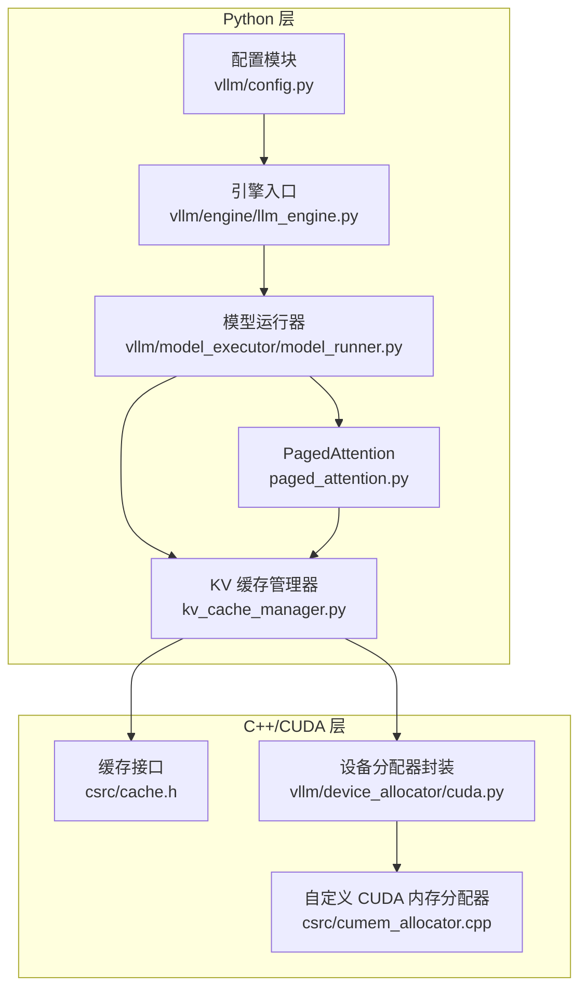
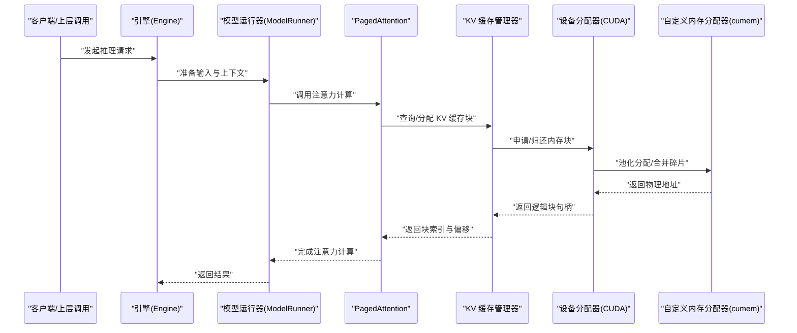
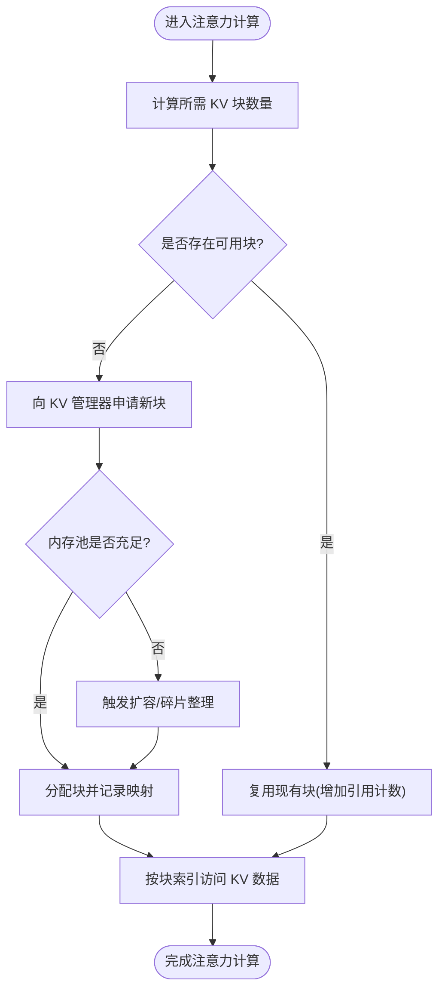
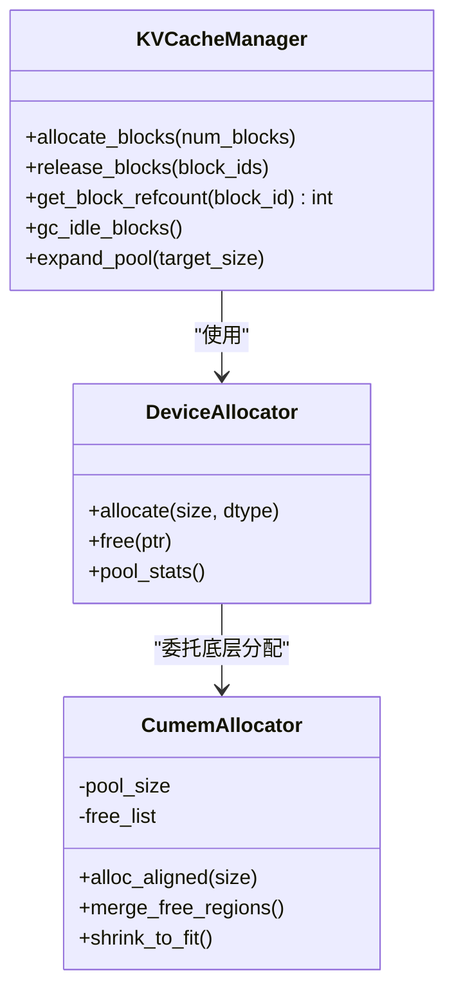
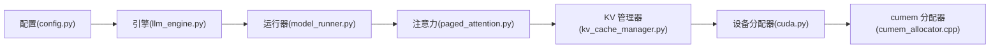

# 内存管理机制

<cite>
**本文引用的文件**   
- [vllm/config.py](file://vllm/config.py)
- [vllm/engine/llm_engine.py](file://vllm/engine/llm_engine.py)
- [vllm/model_executor/model_runner.py](file://vllm/model_executor/model_runner.py)
- [vllm/model_executor/layers/attention/paged_attention.py](file://vllm/model_executor/layers/attention/paged_attention.py)
- [vllm/model_executor/layers/attention/kv_cache_manager.py](file://vllm/model_executor/layers/attention/kv_cache_manager.py)
- [vllm/device_allocator/cuda.py](file://vllm/device_allocator/cuda.py)
- [csrc/cache.h](file://csrc/cache.h)
- [csrc/cumem_allocator.cpp](file://csrc/cumem_allocator.cpp)
- [benchmarks/benchmark_paged_attention.py](file://benchmarks/benchmark_paged_attention.py)
- [docs/design/paged_attention.md](file://docs/design/paged_attention.md)
- [docs/configuration/conserving_memory.md](file://docs/configuration/conserving_memory.md)
- [tests/basic_correctness/test_mem.py](file://tests/basic_correctness/test_mem.py)
</cite>

## 目录
1. [简介](#简介)
2. [项目结构](#项目结构)
3. [核心组件](#核心组件)
4. [架构总览](#架构总览)
5. [详细组件分析](#详细组件分析)
6. [依赖关系分析](#依赖关系分析)
7. [性能考量](#性能考量)
8. [故障排查指南](#故障排查指南)
9. [结论](#结论)
10. [附录](#附录)

## 简介
本文件系统性阐述 vLLM 的内存管理机制，重点围绕 PagedAttention 技术实现与 KV 缓存的分页管理。内容涵盖：
- KV 缓存块分配、引用计数与垃圾回收策略
- 显存优化策略：内存池、碎片整理与动态调整
- 数据类型（FP16、BF16、FP8）的内存布局与优化
- 内存使用监控与调试工具使用方法
- 内存泄漏检测与性能调优最佳实践
- 通过具体配置参数示例展示其对内存的影响

## 项目结构
vLLM 的内存管理与 PagedAttention 相关代码主要分布在以下位置：
- 配置与引擎入口：vllm/config.py、vllm/engine/llm_engine.py
- 模型执行与运行器：vllm/model_executor/model_runner.py
- 注意力层与 KV 缓存管理：vllm/model_executor/layers/attention/paged_attention.py、kv_cache_manager.py
- 设备端内存分配器：vllm/device_allocator/cuda.py、csrc/cumem_allocator.cpp、csrc/cache.h
- 基准测试与文档：benchmarks/benchmark_paged_attention.py、docs/design/paged_attention.md、docs/configuration/conserving_memory.md
- 测试用例：tests/basic_correctness/test_mem.py

**图表来源** 
- [vllm/config.py](file://vllm/config.py)
- [vllm/engine/llm_engine.py](file://vllm/engine/llm_engine.py)
- [vllm/model_executor/model_runner.py](file://vllm/model_executor/model_runner.py)
- [vllm/model_executor/layers/attention/paged_attention.py](file://vllm/model_executor/layers/attention/paged_attention.py)
- [vllm/model_executor/layers/attention/kv_cache_manager.py](file://vllm/model_executor/layers/attention/kv_cache_manager.py)
- [vllm/device_allocator/cuda.py](file://vllm/device_allocator/cuda.py)
- [csrc/cumem_allocator.cpp](file://csrc/cumem_allocator.cpp)
- [csrc/cache.h](file://csrc/cache.h)

**章节来源**
- [vllm/config.py](file://vllm/config.py)
- [vllm/engine/llm_engine.py](file://vllm/engine/llm_engine.py)
- [vllm/model_executor/model_runner.py](file://vllm/model_executor/model_runner.py)
- [vllm/model_executor/layers/attention/paged_attention.py](file://vllm/model_executor/layers/attention/paged_attention.py)
- [vllm/model_executor/layers/attention/kv_cache_manager.py](file://vllm/model_executor/layers/attention/kv_cache_manager.py)
- [vllm/device_allocator/cuda.py](file://vllm/device_allocator/cuda.py)
- [csrc/cumem_allocator.cpp](file://csrc/cumem_allocator.cpp)
- [csrc/cache.h](file://csrc/cache.h)

## 核心组件
- PagedAttention 内核与调用：负责在注意力计算中按块访问 KV 缓存，避免连续大张量带来的显存碎片与拷贝开销。
- KV 缓存管理器：维护分页的 KV 缓存块，提供分配、释放、引用计数与垃圾回收等能力。
- 设备内存分配器：基于 CUDA 的自定义分配器与内存池，减少频繁分配/释放的开销并降低碎片。
- 配置与引擎：将用户配置转换为运行时参数，驱动 KV 缓存大小、块大小、数据类型等关键设置。

**章节来源**
- [vllm/model_executor/layers/attention/paged_attention.py](file://vllm/model_executor/layers/attention/paged_attention.py)
- [vllm/model_executor/layers/attention/kv_cache_manager.py](file://vllm/model_executor/layers/attention/kv_cache_manager.py)
- [vllm/device_allocator/cuda.py](file://vllm/device_allocator/cuda.py)
- [csrc/cumem_allocator.cpp](file://csrc/cumem_allocator.cpp)
- [vllm/config.py](file://vllm/config.py)
- [vllm/engine/llm_engine.py](file://vllm/engine/llm_engine.py)

## 架构总览
下图展示了从引擎到注意力层的内存访问路径，以及 KV 缓存管理器与底层分配器的交互。

**图表来源** 
- [vllm/engine/llm_engine.py](file://vllm/engine/llm_engine.py)
- [vllm/model_executor/model_runner.py](file://vllm/model_executor/model_runner.py)
- [vllm/model_executor/layers/attention/paged_attention.py](file://vllm/model_executor/layers/attention/paged_attention.py)
- [vllm/model_executor/layers/attention/kv_cache_manager.py](file://vllm/model_executor/layers/attention/kv_cache_manager.py)
- [vllm/device_allocator/cuda.py](file://vllm/device_allocator/cuda.py)
- [csrc/cumem_allocator.cpp](file://csrc/cumem_allocator.cpp)

## 详细组件分析

### PagedAttention 与 KV 缓存分页管理
- 分页思想：将 KV 缓存切分为固定大小的块（block），每个请求按需分配若干块，避免为长序列预分配连续大张量。
- 块分配：根据请求长度与模型头数、通道维度计算所需块数量；支持前缀共享与复用。
- 引用计数：每个块维护引用计数，当多个请求或阶段共享同一块时，计数递增；释放时递减至零再回收。
- 垃圾回收：周期性扫描引用计为零的块，将其加入空闲链表供后续分配复用，减少碎片。
- 访问模式：注意力内核按块索引与偏移进行 gather/scatter，保证访存局部性与带宽利用率。

**图表来源** 
- [vllm/model_executor/layers/attention/paged_attention.py](file://vllm/model_executor/layers/attention/paged_attention.py)
- [vllm/model_executor/layers/attention/kv_cache_manager.py](file://vllm/model_executor/layers/attention/kv_cache_manager.py)

**章节来源**
- [vllm/model_executor/layers/attention/paged_attention.py](file://vllm/model_executor/layers/attention/paged_attention.py)
- [vllm/model_executor/layers/attention/kv_cache_manager.py](file://vllm/model_executor/layers/attention/kv_cache_manager.py)
- [docs/design/paged_attention.md](file://docs/design/paged_attention.md)

### 显存优化策略：内存池、碎片整理与动态调整
- 内存池：通过自定义 CUDA 分配器（cumem）实现大块预分配与小块复用，降低分配/释放的系统调用开销。
- 碎片整理：当空闲块不足时，触发合并相邻空闲块、重排活跃块等操作，提升连续空间可用性。
- 动态调整：依据负载峰值与历史统计，自动调整 KV 缓存上限、块大小与池容量，平衡吞吐与延迟。
- 类型感知：不同数据类型（FP16/BF16/FP8）对应不同的块尺寸与对齐要求，确保内核高效访存。

**图表来源** 
- [vllm/model_executor/layers/attention/kv_cache_manager.py](file://vllm/model_executor/layers/attention/kv_cache_manager.py)
- [vllm/device_allocator/cuda.py](file://vllm/device_allocator/cuda.py)
- [csrc/cumem_allocator.cpp](file://csrc/cumem_allocator.cpp)

**章节来源**
- [vllm/device_allocator/cuda.py](file://vllm/device_allocator/cuda.py)
- [csrc/cumem_allocator.cpp](file://csrc/cumem_allocator.cpp)
- [vllm/model_executor/layers/attention/kv_cache_manager.py](file://vllm/model_executor/layers/attention/kv_cache_manager.py)

### 数据类型（FP16、BF16、FP8）的内存布局与优化
- FP16/BF16：标准半精度格式，块内元素按行主序存储，注意对齐到 16/32 字节以提升带宽。
- FP8：低精度格式，通常以量化形式存储，需配合缩放因子与转置/打包策略，减少显存占用并提高 GEMM/Attention 吞吐。
- 布局选择：不同后端对数据类型有特定偏好，例如某些 GPU 对 BF16 的矩阵乘更友好，而 FP8 在量化路径下具备更高吞吐。
- 内存对齐：块大小与步幅需满足内核要求，避免跨边界访问与未对齐导致的性能下降。

**章节来源**
- [csrc/cache.h](file://csrc/cache.h)
- [vllm/model_executor/layers/attention/paged_attention.py](file://vllm/model_executor/layers/attention/paged_attention.py)
- [docs/design/paged_attention.md](file://docs/design/paged_attention.md)

### 内存使用监控与调试工具
- 指标采集：暴露显存使用量、块分配/释放次数、引用计数分布、GC 频率等指标，便于观察系统健康状态。
- 基准测试：通过专用 benchmark 脚本评估不同配置下的吞吐与延迟，定位瓶颈。
- 日志与断点：在关键路径（分配、释放、GC）插入日志，结合 Python/C++ 调试器定位问题。
- 可视化：借助 Grafana/Prometheus 面板实时查看显存水位与碎片率。

**章节来源**
- [benchmarks/benchmark_paged_attention.py](file://benchmarks/benchmark_paged_attention.py)
- [docs/configuration/conserving_memory.md](file://docs/configuration/conserving_memory.md)

### 内存泄漏检测与性能调优最佳实践
- 泄漏检测：定期比较分配/释放计数差值，若持续增长则可能存在未释放引用；检查引用计数归零路径是否正确。
- 阈值与水位：设置合理的 KV 缓存水位线（如高水位触发 GC），避免 OOM 同时保持高利用率。
- 块大小调优：增大块大小可减少元数据开销但可能增加碎片；需结合序列长度分布与硬件特性权衡。
- 类型选择：优先使用模型原生支持的类型（如 BF16），在量化场景谨慎启用 FP8，确保数值稳定性。
- 并发与批处理：合理设置批大小与并行度，避免过多短请求导致碎片化严重。

**章节来源**
- [tests/basic_correctness/test_mem.py](file://tests/basic_correctness/test_mem.py)
- [docs/configuration/conserving_memory.md](file://docs/configuration/conserving_memory.md)

## 依赖关系分析
- 引擎与运行器：引擎负责生命周期与调度，运行器协调模型层与内存子系统。
- 注意力与缓存：PagedAttention 依赖 KV 缓存管理器提供的块视图，避免直接操作底层指针。
- 分配器抽象：设备分配器屏蔽底层 cumem 细节，向上提供统一接口。
- 配置驱动：所有关键参数（块大小、缓存上限、数据类型）由配置模块注入，影响运行时行为。

**图表来源** 
- [vllm/config.py](file://vllm/config.py)
- [vllm/engine/llm_engine.py](file://vllm/engine/llm_engine.py)
- [vllm/model_executor/model_runner.py](file://vllm/model_executor/model_runner.py)
- [vllm/model_executor/layers/attention/paged_attention.py](file://vllm/model_executor/layers/attention/paged_attention.py)
- [vllm/model_executor/layers/attention/kv_cache_manager.py](file://vllm/model_executor/layers/attention/kv_cache_manager.py)
- [vllm/device_allocator/cuda.py](file://vllm/device_allocator/cuda.py)
- [csrc/cumem_allocator.cpp](file://csrc/cumem_allocator.cpp)

**章节来源**
- [vllm/config.py](file://vllm/config.py)
- [vllm/engine/llm_engine.py](file://vllm/engine/llm_engine.py)
- [vllm/model_executor/model_runner.py](file://vllm/model_executor/model_runner.py)
- [vllm/model_executor/layers/attention/paged_attention.py](file://vllm/model_executor/layers/attention/paged_attention.py)
- [vllm/model_executor/layers/attention/kv_cache_manager.py](file://vllm/model_executor/layers/attention/kv_cache_manager.py)
- [vllm/device_allocator/cuda.py](file://vllm/device_allocator/cuda.py)
- [csrc/cumem_allocator.cpp](file://csrc/cumem_allocator.cpp)

## 性能考量
- 访存局部性：块大小与序列长度匹配可提升缓存命中率，减少跨块跳转。
- 带宽利用：选择合适的数据类型与对齐方式，最大化 HBM 带宽利用率。
- 分配开销：通过内存池与批量分配降低系统调用与锁竞争。
- 碎片控制：定期 GC 与合并空闲区域，维持较高连续空间比例。
- 负载自适应：根据历史峰值动态调整缓存上限与块大小，避免过度预留或频繁扩容。

[本节为通用指导，不直接分析具体文件]

## 故障排查指南
- OOM 问题：检查 KV 缓存上限与块大小是否过小；观察引用计数是否异常增长；确认 GC 是否被正确触发。
- 性能抖动：关注分配失败重试与碎片整理耗时；调整批大小与并行度，减少短请求冲击。
- 数值不稳定：在启用 FP8 时检查缩放因子与量化范围；必要时回退到 BF16/FP16。
- 调试手段：开启详细日志，使用基准脚本复现问题；结合设备显存快照与内核时间线分析热点。

**章节来源**
- [tests/basic_correctness/test_mem.py](file://tests/basic_correctness/test_mem.py)
- [docs/configuration/conserving_memory.md](file://docs/configuration/conserving_memory.md)

## 结论
vLLM 通过 PagedAttention 与 KV 缓存分页管理，有效解决了长序列推理中的显存碎片与分配开销问题。结合自定义 CUDA 内存池、碎片整理与动态调整策略，系统在吞吐与延迟之间取得良好平衡。合理选择数据类型、配置参数与监控手段，可进一步提升稳定性与性能。

[本节为总结性内容，不直接分析具体文件]

## 附录
- 配置参数示例（说明其内存影响）：
  - KV 缓存上限：增大可容纳更长序列，但会提升基础显存占用。
  - 块大小：增大块大小减少元数据开销，但可能增加碎片风险。
  - 数据类型：BF16/FP16 适合通用场景；FP8 在量化路径下节省显存，需注意数值稳定性。
  - 水位线与 GC 阈值：高水位触发回收，避免 OOM；过低阈值可能导致频繁 GC 影响延迟。
- 参考文档与测试：
  - 设计文档：docs/design/paged_attention.md
  - 配置建议：docs/configuration/conserving_memory.md
  - 基准脚本：benchmarks/benchmark_paged_attention.py
  - 内存测试：tests/basic_correctness/test_mem.py

**章节来源**
- [docs/design/paged_attention.md](file://docs/design/paged_attention.md)
- [docs/configuration/conserving_memory.md](file://docs/configuration/conserving_memory.md)
- [benchmarks/benchmark_paged_attention.py](file://benchmarks/benchmark_paged_attention.py)
- [tests/basic_correctness/test_mem.py](file://tests/basic_correctness/test_mem.py)