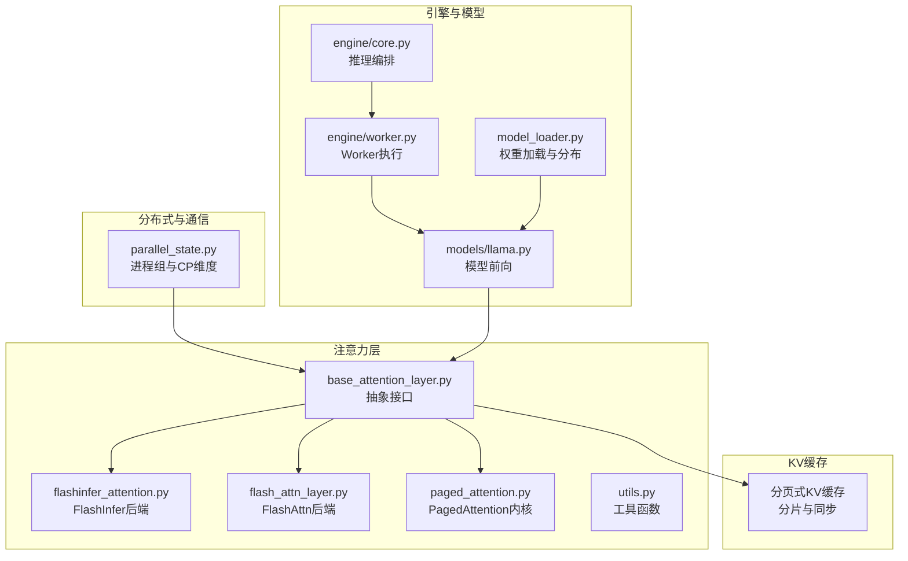
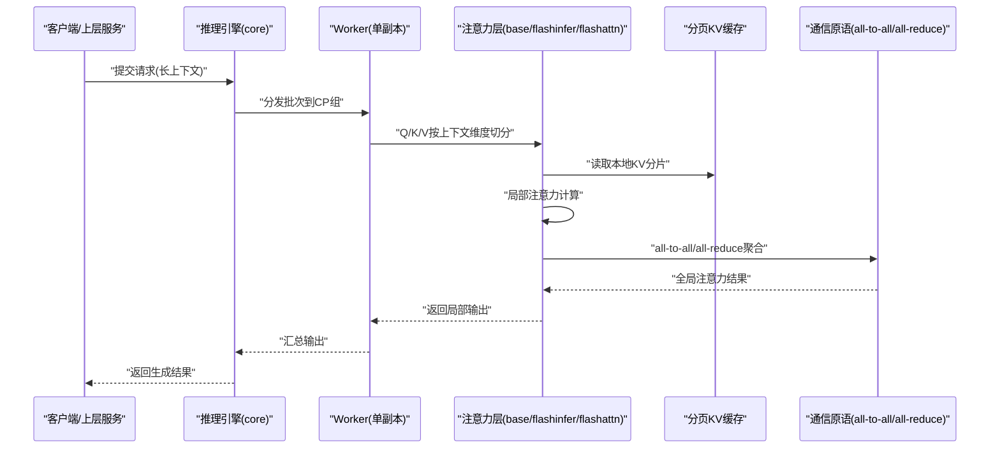
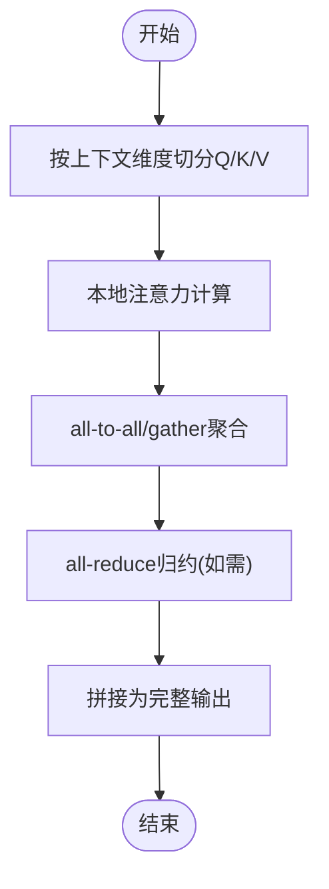
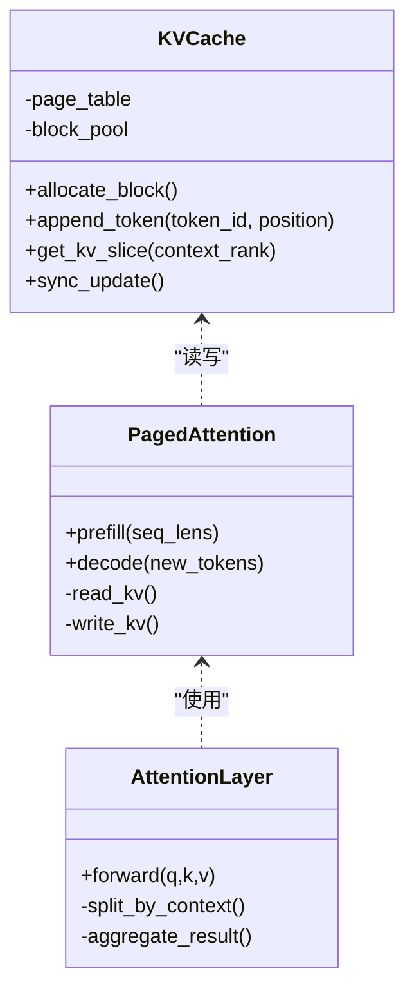
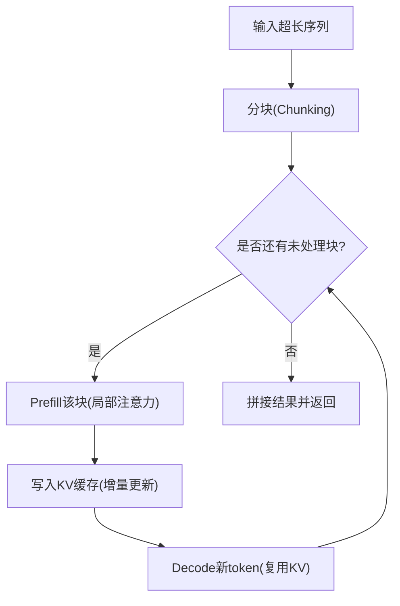
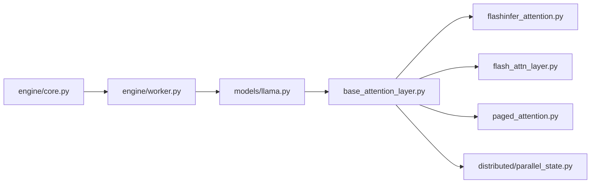

# 上下文并行

<cite>
**本文引用的文件**   
- [vllm/distributed/parallel_state.py](file://vllm/distributed/parallel_state.py)
- [vllm/model_executor/layers/attention/flashinfer_attention.py](file://vllm/model_executor/layers/attention/flashinfer_attention.py)
- [vllm/model_executor/layers/attention/flash_attn_layer.py](file://vllm/model_executor/layers/attention/flash_attn_layer.py)
- [vllm/model_executor/layers/attention/base_attention_layer.py](file://vllm/model_executor/layers/attention/base_attention_layer.py)
- [vllm/model_executor/layers/attention/paged_attention.py](file://vllm/model_executor/layers/attention/paged_attention.py)
- [vllm/model_executor/layers/attention/utils.py](file://vllm/model_executor/layers/attention/utils.py)
- [vllm/config.py](file://vllm/config.py)
- [vllm/engine/core.py](file://vllm/engine/core.py)
- [vllm/engine/worker.py](file://vllm/engine/worker.py)
- [vllm/model_executor/model_loader.py](file://vllm/model_executor/model_loader.py)
- [vllm/model_executor/models/llama.py](file://vllm/model_executor/models/llama.py)
- [tests/distributed/test_context_parallel.py](file://tests/distributed/test_context_parallel.py)
- [benchmarks/benchmark_serving.py](file://benchmarks/benchmark_serving.py)
- [docs/serving/context_parallel_deployment.md](file://docs/serving/context_parallel_deployment.md)
</cite>

## 目录
1. [简介](#简介)
2. [项目结构](#项目结构)
3. [核心组件](#核心组件)
4. [架构总览](#架构总览)
5. [详细组件分析](#详细组件分析)
6. [依赖关系分析](#依赖关系分析)
7. [性能考量](#性能考量)
8. [故障排查指南](#故障排查指南)
9. [结论](#结论)
10. [附录](#附录)

## 简介
本文件系统性阐述 vLLM 中的“上下文并行（Context Parallelism, CP）”能力，覆盖应用场景、切分策略、注意力分布式计算、KV 缓存的分布式管理与一致性保证、长文本优化技术（分块与增量计算）、配置示例与调优要点，并通过实际案例展示其在超长上下文场景下的优势与注意事项。

## 项目结构
围绕上下文并行的关键代码分布在以下模块：
- 分布式状态与通信：用于维护进程组、CP 维度划分与通信原语
- 注意力层实现：在 CP 模式下对 Q/K/V 进行切分与聚合，调用底层 FlashAttention/PagedAttention
- KV 缓存管理：基于分页式缓存的分片与同步更新
- 引擎与模型加载：初始化 CP 分组、参数与权重分布、推理调度
- 测试与基准：验证正确性与性能表现
- 文档与部署：部署与使用指南

图表来源 
- [vllm/distributed/parallel_state.py](file://vllm/distributed/parallel_state.py)
- [vllm/model_executor/layers/attention/base_attention_layer.py](file://vllm/model_executor/layers/attention/base_attention_layer.py)
- [vllm/model_executor/layers/attention/flashinfer_attention.py](file://vllm/model_executor/layers/attention/flashinfer_attention.py)
- [vllm/model_executor/layers/attention/flash_attn_layer.py](file://vllm/model_executor/layers/attention/flash_attn_layer.py)
- [vllm/model_executor/layers/attention/paged_attention.py](file://vllm/model_executor/layers/attention/paged_attention.py)
- [vllm/engine/core.py](file://vllm/engine/core.py)
- [vllm/engine/worker.py](file://vllm/engine/worker.py)
- [vllm/model_executor/model_loader.py](file://vllm/model_executor/model_loader.py)
- [vllm/model_executor/models/llama.py](file://vllm/model_executor/models/llama.py)

章节来源
- [vllm/distributed/parallel_state.py](file://vllm/distributed/parallel_state.py)
- [vllm/model_executor/layers/attention/base_attention_layer.py](file://vllm/model_executor/layers/attention/base_attention_layer.py)
- [vllm/model_executor/layers/attention/flashinfer_attention.py](file://vllm/model_executor/layers/attention/flashinfer_attention.py)
- [vllm/model_executor/layers/attention/flash_attn_layer.py](file://vllm/model_executor/layers/attention/flash_attn_layer.py)
- [vllm/model_executor/layers/attention/paged_attention.py](file://vllm/model_executor/layers/attention/paged_attention.py)
- [vllm/engine/core.py](file://vllm/engine/core.py)
- [vllm/engine/worker.py](file://vllm/engine/worker.py)
- [vllm/model_executor/model_loader.py](file://vllm/model_executor/model_loader.py)
- [vllm/model_executor/models/llama.py](file://vllm/model_executor/models/llama.py)

## 核心组件
- 分布式状态与通信
  - 负责创建和管理进程组，暴露 CP 维度的 all-to-all/all-reduce 等通信原语，确保各副本间数据对齐与同步。
- 注意力层抽象与实现
  - 抽象层定义统一的注意力接口；具体实现（如 FlashInert/FlashAttn）在 CP 模式下对 Q/K/V 进行切分、局部计算与结果聚合。
- PagedAttention 与 KV 缓存
  - 将 KV 张量按块分页存储，支持跨副本分片、按需分配与增量更新，减少内存碎片并提升吞吐。
- 引擎与 Worker
  - 编排请求生命周期，协调 CP 分组内的前向传播、KV 缓存读写与通信同步。
- 模型加载与权重分布
  - 根据并行策略（含 CP）对权重进行切分与放置，保证各副本持有正确的子集。

章节来源
- [vllm/distributed/parallel_state.py](file://vllm/distributed/parallel_state.py)
- [vllm/model_executor/layers/attention/base_attention_layer.py](file://vllm/model_executor/layers/attention/base_attention_layer.py)
- [vllm/model_executor/layers/attention/flashinfer_attention.py](file://vllm/model_executor/layers/attention/flashinfer_attention.py)
- [vllm/model_executor/layers/attention/flash_attn_layer.py](file://vllm/model_executor/layers/attention/flash_attn_layer.py)
- [vllm/model_executor/layers/attention/paged_attention.py](file://vllm/model_executor/layers/attention/paged_attention.py)
- [vllm/engine/core.py](file://vllm/engine/core.py)
- [vllm/engine/worker.py](file://vllm/engine/worker.py)
- [vllm/model_executor/model_loader.py](file://vllm/model_executor/model_loader.py)

## 架构总览
下图展示了上下文并行在前向传播中的数据流与通信点：输入序列沿上下文维度被切分，各副本独立计算局部注意力，随后通过通信原语聚合得到完整输出。

图表来源 
- [vllm/engine/core.py](file://vllm/engine/core.py)
- [vllm/engine/worker.py](file://vllm/engine/worker.py)
- [vllm/model_executor/layers/attention/base_attention_layer.py](file://vllm/model_executor/layers/attention/base_attention_layer.py)
- [vllm/model_executor/layers/attention/flashinfer_attention.py](file://vllm/model_executor/layers/attention/flashinfer_attention.py)
- [vllm/model_executor/layers/attention/flash_attn_layer.py](file://vllm/model_executor/layers/attention/flash_attn_layer.py)
- [vllm/model_executor/layers/attention/paged_attention.py](file://vllm/model_executor/layers/attention/paged_attention.py)

## 详细组件分析

### 上下文切分策略与注意力分布式处理
- 序列长度分割
  - 在 CP 模式下，输入序列沿上下文维度被均匀切分到多个副本。每个副本仅持有部分 token 的 Q/K/V，从而降低单卡显存压力。
- 注意力计算
  - 各副本先进行局部注意力计算，再借助 all-to-all 或 all-reduce 等通信原语完成跨副本的信息交换与结果聚合，最终得到完整的注意力输出。
- 实现要点
  - 抽象注意力层统一封装切分与聚合逻辑，具体后端（FlashInfer/FlashAttn）负责高效内核调用。
  - 切分粒度需与 batch 维度、头数、隐藏维度等对齐，避免额外重排开销。

图表来源 
- [vllm/model_executor/layers/attention/base_attention_layer.py](file://vllm/model_executor/layers/attention/base_attention_layer.py)
- [vllm/model_executor/layers/attention/flashinfer_attention.py](file://vllm/model_executor/layers/attention/flashinfer_attention.py)
- [vllm/model_executor/layers/attention/flash_attn_layer.py](file://vllm/model_executor/layers/attention/flash_attn_layer.py)

章节来源
- [vllm/model_executor/layers/attention/base_attention_layer.py](file://vllm/model_executor/layers/attention/base_attention_layer.py)
- [vllm/model_executor/layers/attention/flashinfer_attention.py](file://vllm/model_executor/layers/attention/flashinfer_attention.py)
- [vllm/model_executor/layers/attention/flash_attn_layer.py](file://vllm/model_executor/layers/attention/flash_attn_layer.py)

### KV 缓存的分布式管理
- 缓存分片
  - 分页式 KV 缓存按块组织，CP 模式下每块可进一步按上下文维度分片，使不同副本只维护自身 token 对应的 KV 片段。
- 同步更新
  - 生成阶段新增 token 的 KV 写入需在各副本上保持一致性，通常通过原子插入与屏障同步保证顺序与可见性。
- 一致性保证
  - 结合页锁、版本号或事务语义，确保多副本在并发访问时不会出现脏读或丢失更新。

图表来源 
- [vllm/model_executor/layers/attention/paged_attention.py](file://vllm/model_executor/layers/attention/paged_attention.py)
- [vllm/model_executor/layers/attention/base_attention_layer.py](file://vllm/model_executor/layers/attention/base_attention_layer.py)

章节来源
- [vllm/model_executor/layers/attention/paged_attention.py](file://vllm/model_executor/layers/attention/paged_attention.py)
- [vllm/model_executor/layers/attention/base_attention_layer.py](file://vllm/model_executor/layers/attention/base_attention_layer.py)

### 长文本处理的优化技术
- 分块处理
  - 将超长上下文划分为若干块，逐块进行预填充与解码，降低峰值显存占用并提高可伸缩性。
- 增量计算
  - 利用已缓存的 KV 增量更新新 token，避免重复计算历史部分，显著提升长对话或多轮交互效率。
- 与 CP 的结合
  - 分块与 CP 切分协同工作：每块内部仍按上下文维度切分，通信与计算重叠，最大化吞吐。

章节来源
- [vllm/model_executor/layers/attention/paged_attention.py](file://vllm/model_executor/layers/attention/paged_attention.py)
- [vllm/model_executor/layers/attention/base_attention_layer.py](file://vllm/model_executor/layers/attention/base_attention_layer.py)

### 配置示例与调优要点
- 切分策略选择
  - 依据上下文长度与硬件资源选择合适的 CP 规模；过大会增加通信开销，过小则无法缓解显存压力。
- 关键参数
  - 上下文并行度、注意力后端选择（FlashInfer/FlashAttn）、KV 块大小、批大小、通信后端（NCCL/RDMA）等。
- 性能调优
  - 调整批大小与分块大小以平衡延迟与吞吐；开启通信与计算重叠；合理设置 KV 缓存水位线与淘汰策略。

章节来源
- [vllm/config.py](file://vllm/config.py)
- [docs/serving/context_parallel_deployment.md](file://docs/serving/context_parallel_deployment.md)
- [benchmarks/benchmark_serving.py](file://benchmarks/benchmark_serving.py)

### 实际案例与注意事项
- 超长上下文优势
  - 在长文档问答、长对话场景中，CP 可将大上下文分散到多卡，显著降低 OOM 风险并提升吞吐。
- 注意事项
  - 通信瓶颈：当 CP 规模较大时，all-to-all/all-reduce 可能成为瓶颈，需评估网络带宽与拓扑。
  - 一致性：确保 KV 写入顺序与版本一致，避免并发冲突。
  - 负载不均衡：若序列长度差异大，可能导致某些副本负载偏高，需要动态调度或负载均衡策略。

章节来源
- [tests/distributed/test_context_parallel.py](file://tests/distributed/test_context_parallel.py)
- [benchmarks/benchmark_serving.py](file://benchmarks/benchmark_serving.py)

## 依赖关系分析
- 耦合与内聚
  - 注意力层对 KV 缓存与通信原语存在强依赖；抽象层屏蔽了后端差异，提升了内聚性。
- 直接/间接依赖
  - 引擎依赖 Worker，Worker 调用注意力层；注意力层依赖分页式 KV 缓存与通信原语。
- 外部依赖
  - 通信后端（NCCL/RDMA）、GPU 驱动与 CUDA 库（FlashAttention/PagedAttention）。

图表来源 
- [vllm/engine/core.py](file://vllm/engine/core.py)
- [vllm/engine/worker.py](file://vllm/engine/worker.py)
- [vllm/model_executor/models/llama.py](file://vllm/model_executor/models/llama.py)
- [vllm/model_executor/layers/attention/base_attention_layer.py](file://vllm/model_executor/layers/attention/base_attention_layer.py)
- [vllm/model_executor/layers/attention/flashinfer_attention.py](file://vllm/model_executor/layers/attention/flashinfer_attention.py)
- [vllm/model_executor/layers/attention/flash_attn_layer.py](file://vllm/model_executor/layers/attention/flash_attn_layer.py)
- [vllm/model_executor/layers/attention/paged_attention.py](file://vllm/model_executor/layers/attention/paged_attention.py)
- [vllm/distributed/parallel_state.py](file://vllm/distributed/parallel_state.py)

章节来源
- [vllm/engine/core.py](file://vllm/engine/core.py)
- [vllm/engine/worker.py](file://vllm/engine/worker.py)
- [vllm/model_executor/models/llama.py](file://vllm/model_executor/models/llama.py)
- [vllm/model_executor/layers/attention/base_attention_layer.py](file://vllm/model_executor/layers/attention/base_attention_layer.py)
- [vllm/model_executor/layers/attention/flashinfer_attention.py](file://vllm/model_executor/layers/attention/flashinfer_attention.py)
- [vllm/model_executor/layers/attention/flash_attn_layer.py](file://vllm/model_executor/layers/attention/flash_attn_layer.py)
- [vllm/model_executor/layers/attention/paged_attention.py](file://vllm/model_executor/layers/attention/paged_attention.py)
- [vllm/distributed/parallel_state.py](file://vllm/distributed/parallel_state.py)

## 性能考量
- 通信开销
  - CP 规模越大，all-to-all/all-reduce 开销越高；需结合网络拓扑与带宽评估最优 CP 值。
- 计算-通信重叠
  - 通过流水线与异步通信掩盖等待时间，提升整体吞吐。
- 内存与缓存命中率
  - 合理的 KV 块大小与分片策略可减少碎片并提升命中率；必要时引入缓存淘汰与预热。
- 后端选择
  - FlashInfer/FlashAttn 在不同硬件与形状下表现各异，应进行基准测试选择最优后端。

[本节为通用指导，不直接分析具体文件]

## 故障排查指南
- 常见问题
  - OOM：检查 CP 规模、批大小与 KV 块大小；适当增大分块或减小批大小。
  - 通信错误：确认 NCCL/RDMA 环境、进程组初始化与端口可用性。
  - 不一致：检查 KV 写入顺序与版本控制；确保屏障同步到位。
- 调试建议
  - 启用日志与指标采集，定位热点路径；使用基准脚本对比不同配置的性能。
  - 参考单元测试用例复现实验场景，逐步缩小问题范围。

章节来源
- [tests/distributed/test_context_parallel.py](file://tests/distributed/test_context_parallel.py)
- [benchmarks/benchmark_serving.py](file://benchmarks/benchmark_serving.py)

## 结论
上下文并行通过将序列沿上下文维度切分并在多副本上并行计算注意力，有效缓解了超长上下文的显存压力并提升了吞吐。配合分页式 KV 缓存、分块与增量计算，以及高效的通信原语，vLLM 能够在大规模长文本场景中提供稳定且高性能的推理能力。实际部署中需权衡通信与计算开销，选择合适的 CP 规模与后端，并进行充分的基准测试与调优。

[本节为总结性内容，不直接分析具体文件]

## 附录
- 部署与使用
  - 参考部署文档了解如何启用上下文并行、配置通信后端与关键参数。
- 相关特性
  - 前缀缓存、混合 KV 缓存管理等可与 CP 协同优化性能。

章节来源
- [docs/serving/context_parallel_deployment.md](file://docs/serving/context_parallel_deployment.md)
- [vllm/config.py](file://vllm/config.py)