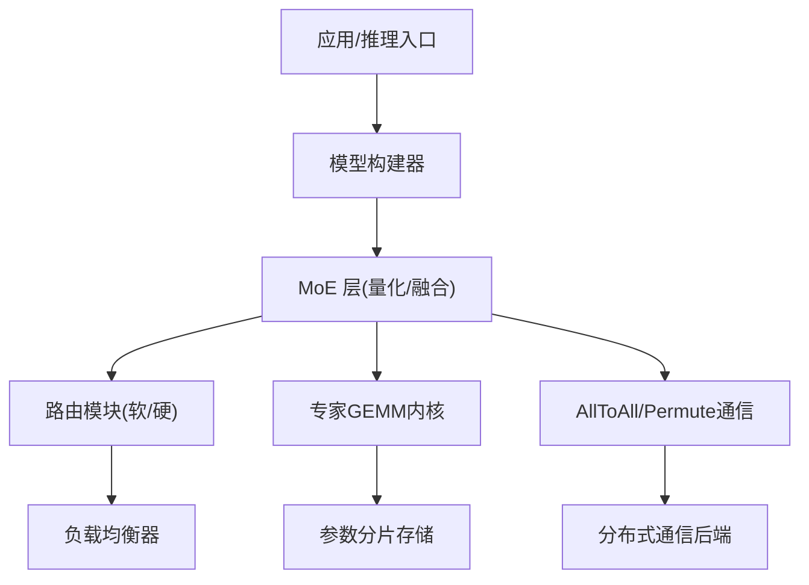
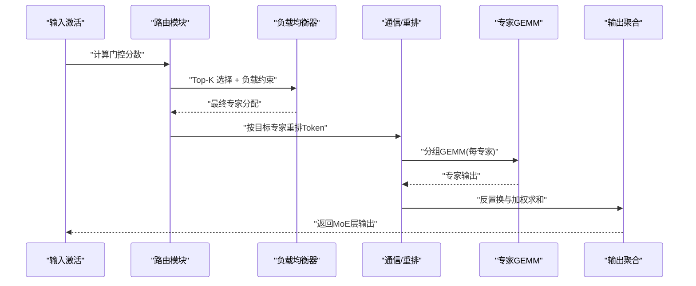
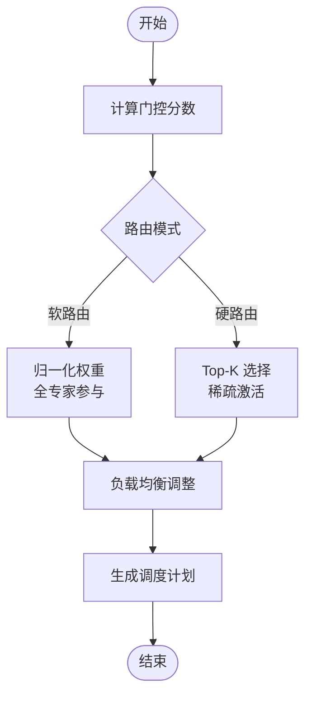
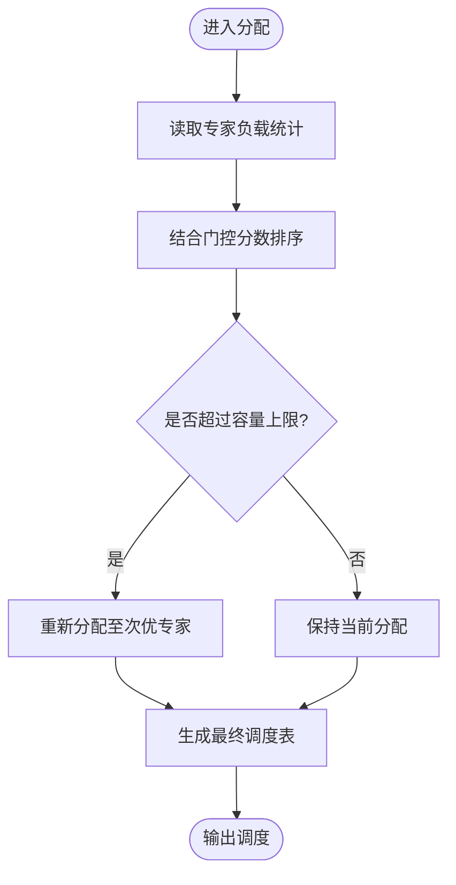
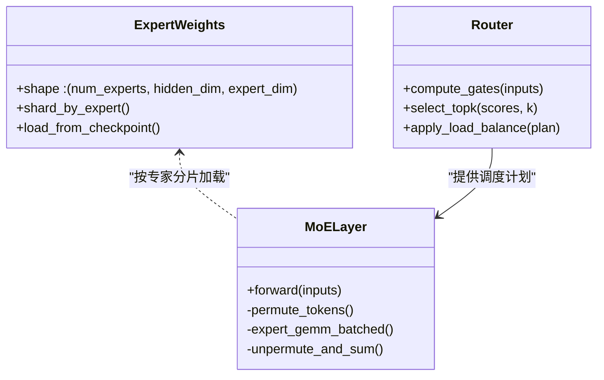
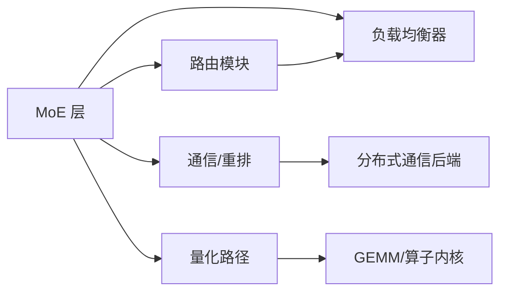

# 专家并行（MoE）

<cite>
**本文引用的文件**   
- [vllm/model_executor/layers/quantization/moe.py](file://vllm/model_executor/layers/quantization/moe.py)
- [vllm/model_executor/layers/fused_moe.py](file://vllm/model_executor/layers/fused_moe.py)
- [vllm/config.py](file://vllm/config.py)
- [vllm/distributed/utils.py](file://vllm/distributed/utils.py)
- [benchmarks/kernels/benchmark_moe.py](file://benchmarks/kernels/benchmark_moe.py)
- [tests/kernels/moe/test_fused_moe.py](file://tests/kernels/moe/test_fused_moe.py)
- [docs/design/moe_kernel_features.md](file://docs/design/moe_kernel_features.md)
- [examples/ray_serving/ray_serve_deepseek.py](file://examples/ray_serving/ray_serve_deepseek.py)
</cite>

## 目录
1. [简介](#简介)
2. [项目结构](#项目结构)
3. [核心组件](#核心组件)
4. [架构总览](#架构总览)
5. [详细组件分析](#详细组件分析)
6. [依赖关系分析](#依赖关系分析)
7. [性能考量](#性能考量)
8. [故障排查指南](#故障排查指南)
9. [结论](#结论)
10. [附录](#附录)

## 简介
本文件系统性解析 vLLM 中专家并行（Mixture of Experts, MoE）的实现原理与配置方法，重点覆盖：
- 路由算法：软路由与硬路由的区别、选择策略与适用场景
- 专家分配机制：负载均衡算法与动态专家选择过程
- 参数分布式存储与访问模式：参数分片、通信优化与内核融合
- 配置示例：专家数量、路由策略、负载均衡参数的调优建议
- 实践案例：不同规模模型上的性能表现与内存使用特点

## 项目结构
围绕 MoE 的关键代码分布在以下位置：
- 模型层与量化集成：用于实现 MoE 层的计算路径与量化支持
- 配置模块：暴露 MoE 相关配置项与默认值
- 分布式工具：提供跨设备/进程的数据重排与通信原语
- 基准测试与单元测试：验证正确性与性能特性
- 设计文档：阐述 MoE 内核特性与优化要点
- 示例脚本：展示在 DeepSeek 等 MoE 模型上的部署方式

[无图示来源，因为该图为概念性结构示意]

## 核心组件
- MoE 层与融合内核：将路由、Top-K 选择、专家 GEMM 与反置换进行融合，减少中间张量与同步开销
- 路由策略：支持软路由（权重平滑分配）与硬路由（稀疏 Top-K），并提供可配置的切换与混合策略
- 负载均衡：基于历史负载或实时统计的动态再平衡，避免热点专家
- 分布式参数存储：按专家维度切分权重，结合 AllToAll/Permute 完成数据重排，最大化访存局部性
- 量化与精度：支持多种量化格式（如 FP8/NVFP4 等）与混合精度路径，提升吞吐并控制显存

章节来源
- [vllm/model_executor/layers/quantization/moe.py](file://vllm/model_executor/layers/quantization/moe.py)
- [vllm/model_executor/layers/fused_moe.py](file://vllm/model_executor/layers/fused_moe.py)
- [docs/design/moe_kernel_features.md](file://docs/design/moe_kernel_features.md)

## 架构总览
下图展示了 MoE 层在一次前向传播中的关键阶段：输入预处理、路由决策、专家计算与结果聚合。

[无图示来源，因为该图为概念性流程示意]

## 详细组件分析

### 路由算法：软路由与硬路由
- 软路由：对每个 Token 计算到各专家的连续权重，通常通过门控网络与归一化得到；适合平滑梯度与稳定训练，但计算与通信开销较大
- 硬路由：为每个 Token 选择 Top-K 个专家，形成稀疏激活；显著降低计算与通信成本，是推理与大规模部署的常用策略
- 选择策略：可通过配置开关切换；也可采用混合策略（例如大部分走硬路由，少量样本走软路由以改善边界情况）

[无图示来源，因为该图为概念性算法示意]

章节来源
- [vllm/model_executor/layers/fused_moe.py](file://vllm/model_executor/layers/fused_moe.py)
- [docs/design/moe_kernel_features.md](file://docs/design/moe_kernel_features.md)

### 专家分配与负载均衡
- 动态选择：根据当前批次 Token 的门控分数与历史负载，动态决定每个 Token 的目标专家集合
- 负载均衡算法：常见策略包括轮询、容量阈值、最小负载优先、带惩罚的软分配等；vLLM 通过可插拔的负载均衡器实现
- 热冷专家处理：对长期未被选中的“冷”专家设置最低配额，防止资源闲置；对“热”专家限制上限，避免拥塞

[无图示来源，因为该图为概念性算法示意]

章节来源
- [vllm/model_executor/layers/fused_moe.py](file://vllm/model_executor/layers/fused_moe.py)
- [vllm/distributed/utils.py](file://vllm/distributed/utils.py)

### 参数分布式存储与访问模式
- 参数分片：专家权重按专家维度切分到不同设备/进程，每个设备仅持有自身专家子集
- 访问模式：通过 AllToAll/Permute 将 Token 按目标专家重排，使同一设备的专家能顺序访问其权重块，提升缓存命中率
- 通信优化：融合 Permute 与 GEMM 启动，减少内核调用与同步；利用 CUDA Graph 与异步流提升吞吐

[无图示来源，因为该图为概念性类关系示意]

章节来源
- [vllm/model_executor/layers/fused_moe.py](file://vllm/model_executor/layers/fused_moe.py)
- [vllm/distributed/utils.py](file://vllm/distributed/utils.py)

### 量化与精度路径
- 支持多精度：BF16/FP16/FP8/NVFP4 等，依据硬件能力与模型要求自动选择
- 量化感知：在路由与专家 GEMM 中尽量保持数值稳定性，必要时引入缩放因子与截断策略
- 融合路径：将量化、门控、Top-K、GEMM 与反置换融合，减少中间张量与内存带宽压力

章节来源
- [vllm/model_executor/layers/quantization/moe.py](file://vllm/model_executor/layers/quantization/moe.py)
- [docs/design/moe_kernel_features.md](file://docs/design/moe_kernel_features.md)

### 配置方法与调优建议
- 专家数量：根据模型规模与显存预算选择；更大专家数带来更高吞吐潜力，但也增加通信与调度开销
- 路由策略：推理场景推荐硬路由（Top-K=1~2），训练或特殊任务可考虑软路由或混合策略
- 负载均衡：开启动态负载均衡，设置合理的容量上限与最低配额，避免热点与冷专家问题
- 通信与融合：启用 AllToAll/Permute 融合与 CUDA Graph，减少同步与内核启动开销
- 量化：在支持的硬件上启用 FP8/NVFP4，观察精度与吞吐权衡

章节来源
- [vllm/config.py](file://vllm/config.py)
- [docs/design/moe_kernel_features.md](file://docs/design/moe_kernel_features.md)

### 实际案例与性能表现
- 小模型（数十亿参数）：硬路由 Top-K=1 即可达到高吞吐，显存占用较低；适当放宽负载均衡阈值以提升稳定性
- 中等模型（百亿级）：Top-K=2~4 更均衡，需关注 AllToAll 带宽与缓存命中；建议使用融合内核与量化
- 大模型（千亿级）：专家数量与拓扑布局至关重要；需要细粒度负载均衡与高效的参数分片策略；监控热点专家与通信瓶颈

章节来源
- [benchmarks/kernels/benchmark_moe.py](file://benchmarks/kernels/benchmark_moe.py)
- [tests/kernels/moe/test_fused_moe.py](file://tests/kernels/moe/test_fused_moe.py)
- [examples/ray_serving/ray_serve_deepseek.py](file://examples/ray_serving/ray_serve_deepseek.py)

## 依赖关系分析
MoE 层依赖路由、负载均衡、通信与量化等多个子系统，耦合度适中且职责清晰。下图展示主要依赖关系。

[无图示来源，因为该图为概念性依赖示意]

章节来源
- [vllm/model_executor/layers/fused_moe.py](file://vllm/model_executor/layers/fused_moe.py)
- [vllm/distributed/utils.py](file://vllm/distributed/utils.py)

## 性能考量
- 路由开销：Top-K 选择与门控计算的复杂度随专家数线性增长；建议合理设置 K 值与批大小
- 通信瓶颈：AllToAll/Permute 在大批量与多专家时成为瓶颈；应启用融合内核与异步流
- 缓存局部性：专家权重按设备分片后，确保 Token 重排后的访问局部性，提高 L1/L2 命中率
- 量化收益：在支持硬件上启用低精度路径，可减少显存与带宽压力，同时注意数值稳定性
- 图优化：CUDA Graph 与静态图编译可降低内核启动与同步开销

[无章节来源，因为本节为通用指导]

## 故障排查指南
- 路由不稳定：检查门控网络输出范围与归一化策略；适当增加温度系数或正则化
- 专家过载：调整负载均衡容量上限与惩罚系数；监控专家负载直方图
- 通信超时：检查 AllToAll 配置与网络拓扑；减小批大小或专家数
- 精度异常：核对量化参数与缩放因子；对比高精度路径结果定位偏差
- 显存不足：降低批大小、专家数或启用更低精度路径；检查中间张量释放

章节来源
- [tests/kernels/moe/test_fused_moe.py](file://tests/kernels/moe/test_fused_moe.py)
- [benchmarks/kernels/benchmark_moe.py](file://benchmarks/kernels/benchmark_moe.py)

## 结论
vLLM 的 MoE 实现通过融合内核、灵活路由与高效通信，实现了高吞吐与低延迟的专家并行推理。合理配置路由策略、负载均衡与量化路径，可在不同规模模型上取得良好性能与显存效率。实践中应持续监控负载分布与通信瓶颈，动态调参以获得最优效果。

[无章节来源，因为本节为总结性内容]

## 附录
- 配置清单：专家数量、K 值、路由模式、负载均衡策略、量化格式、通信后端
- 监控指标：专家负载分布、Top-K 命中率、AllToAll 带宽利用率、内核执行时间
- 最佳实践：从硬路由 Top-K=1 起步，逐步增大 K 与专家数；启用量化与融合内核；定期评估精度与吞吐

[无章节来源，因为本节为补充信息]