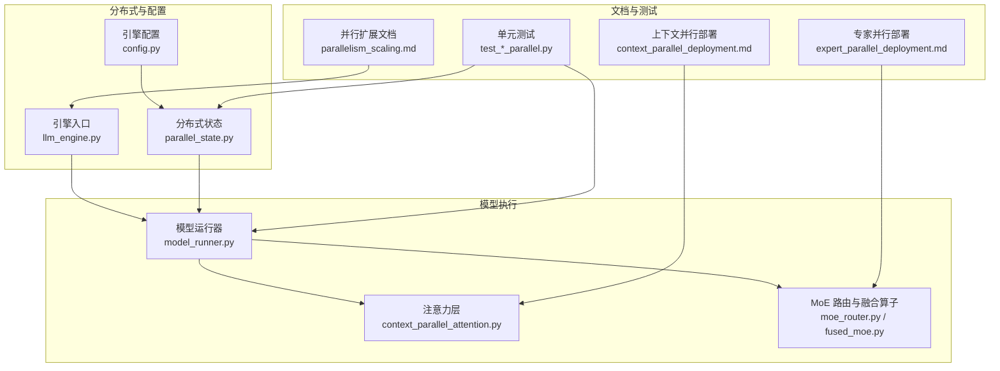
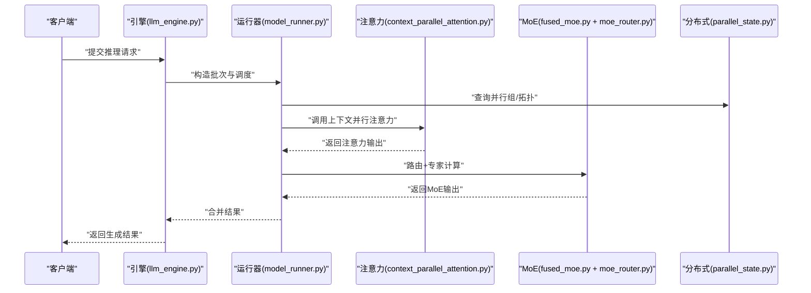
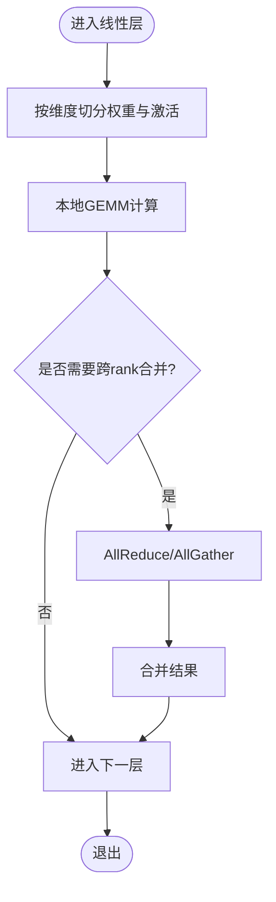
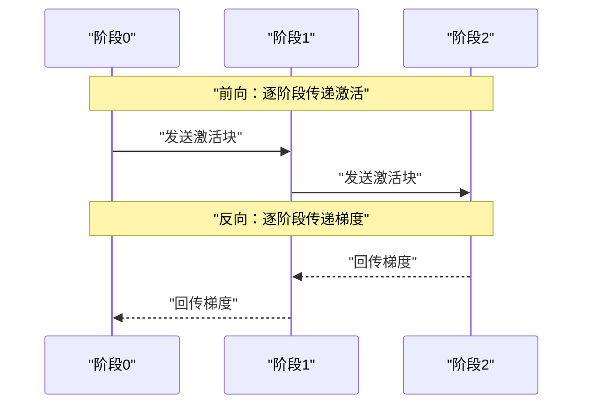
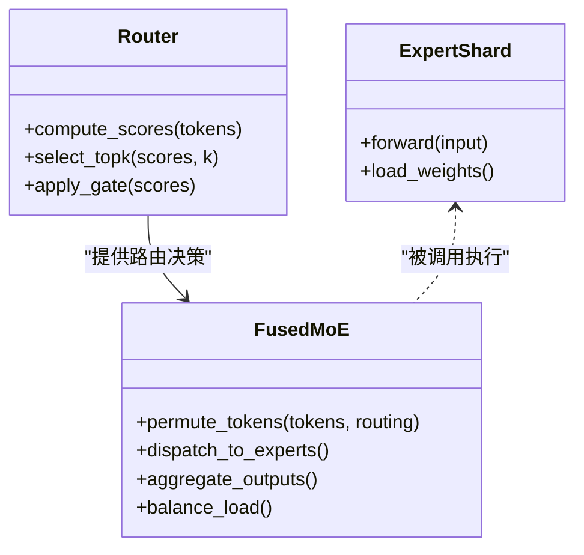
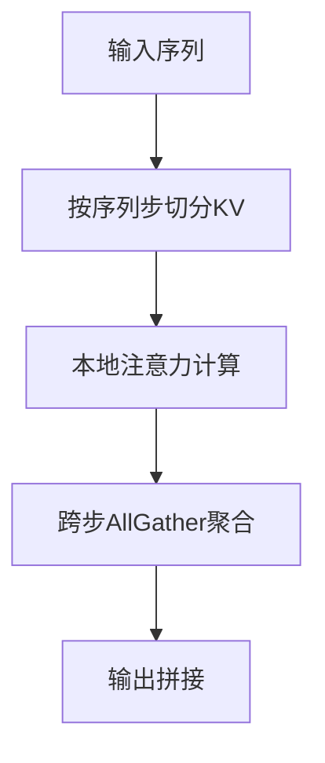
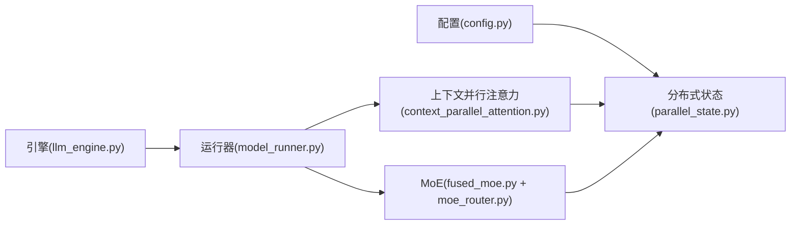

# 并行计算策略

<cite>
**本文引用的文件**   
- [vllm/distributed/__init__.py](file://vllm/distributed/__init__.py)
- [vllm/distributed/parallel_state.py](file://vllm/distributed/parallel_state.py)
- [vllm/config.py](file://vllm/config.py)
- [vllm/model_executor/model_runner.py](file://vllm/model_executor/model_runner.py)
- [vllm/engine/llm_engine.py](file://vllm/engine/llm_engine.py)
- [vllm/model_executor/layers/attention/fused_moe.py](file://vllm/model_executor/layers/attention/fused_moe.py)
- [vllm/model_executor/layers/attention/moe_router.py](file://vllm/model_executor/layers/attention/moe_router.py)
- [vllm/model_executor/layers/attention/context_parallel_attention.py](file://vllm/model_executor/layers/attention/context_parallel_attention.py)
- [benchmarks/benchmark_serving.py](file://benchmarks/benchmark_serving.py)
- [tests/distributed/test_context_parallel.py](file://tests/distributed/test_context_parallel.py)
- [tests/distributed/test_expert_parallel.py](file://tests/distributed/test_expert_parallel.py)
- [tests/distributed/test_pipeline_parallel.py](file://tests/distributed/test_pipeline_parallel.py)
- [docs/serving/parallelism_scaling.md](file://docs/serving/parallelism_scaling.md)
- [docs/serving/context_parallel_deployment.md](file://docs/serving/context_parallel_deployment.md)
- [docs/serving/expert_parallel_deployment.md](file://docs/serving/expert_parallel_deployment.md)
</cite>

## 目录
1. [简介](#简介)
2. [项目结构](#项目结构)
3. [核心组件](#核心组件)
4. [架构总览](#架构总览)
5. [详细组件分析](#详细组件分析)
6. [依赖关系分析](#依赖关系分析)
7. [性能考量](#性能考量)
8. [故障排查指南](#故障排查指南)
9. [结论](#结论)
10. [附录](#附录)

## 简介
本文件系统性梳理 vLLM 支持的并行计算策略，包括张量并行、流水线并行、专家并行（MoE）与上下文并行。内容覆盖实现原理（数据分割、通信同步、负载均衡）、工作机制（阶段划分、激活值存储、梯度同步）、配置方法、多 GPU/多节点部署示例、通信开销分析与性能优化建议，并通过实际案例说明不同策略的适用场景。

## 项目结构
vLLM 的并行能力由分布式状态管理、模型执行器、注意力层与 MoE 路由等模块协同完成：
- 分布式状态与进程组管理：负责初始化进程组、维护各并行维度的状态（如张量并行、流水线并行、专家并行、上下文并行的分组信息）。
- 模型执行器：根据配置选择并行策略，组织前向/反向流程，协调通信原语。
- 注意力与 MoE 层：提供张量切分、AllReduce/AllToAll、TopK 路由、专家权重分片等关键实现。
- 上下文并行注意力：在序列维度进行 KV 缓存切分与跨步通信，提升长上下文吞吐。
- 文档与测试：提供部署指南、参数说明与端到端验证用例。

图表来源
- [vllm/distributed/parallel_state.py](file://vllm/distributed/parallel_state.py)
- [vllm/config.py](file://vllm/config.py)
- [vllm/engine/llm_engine.py](file://vllm/engine/llm_engine.py)
- [vllm/model_executor/model_runner.py](file://vllm/model_executor/model_runner.py)
- [vllm/model_executor/layers/attention/context_parallel_attention.py](file://vllm/model_executor/layers/attention/context_parallel_attention.py)
- [vllm/model_executor/layers/attention/moe_router.py](file://vllm/model_executor/layers/attention/moe_router.py)
- [vllm/model_executor/layers/attention/fused_moe.py](file://vllm/model_executor/layers/attention/fused_moe.py)
- [docs/serving/parallelism_scaling.md](file://docs/serving/parallelism_scaling.md)
- [docs/serving/context_parallel_deployment.md](file://docs/serving/context_parallel_deployment.md)
- [docs/serving/expert_parallel_deployment.md](file://docs/serving/expert_parallel_deployment.md)
- [tests/distributed/test_context_parallel.py](file://tests/distributed/test_context_parallel.py)
- [tests/distributed/test_expert_parallel.py](file://tests/distributed/test_expert_parallel.py)
- [tests/distributed/test_pipeline_parallel.py](file://tests/distributed/test_pipeline_parallel.py)

章节来源
- [vllm/distributed/parallel_state.py](file://vllm/distributed/parallel_state.py)
- [vllm/config.py](file://vllm/config.py)
- [vllm/engine/llm_engine.py](file://vllm/engine/llm_engine.py)
- [vllm/model_executor/model_runner.py](file://vllm/model_executor/model_runner.py)
- [vllm/model_executor/layers/attention/context_parallel_attention.py](file://vllm/model_executor/layers/attention/context_parallel_attention.py)
- [vllm/model_executor/layers/attention/moe_router.py](file://vllm/model_executor/layers/attention/moe_router.py)
- [vllm/model_executor/layers/attention/fused_moe.py](file://vllm/model_executor/layers/attention/fused_moe.py)
- [docs/serving/parallelism_scaling.md](file://docs/serving/parallelism_scaling.md)
- [docs/serving/context_parallel_deployment.md](file://docs/serving/context_parallel_deployment.md)
- [docs/serving/expert_parallel_deployment.md](file://docs/serving/expert_parallel_deployment.md)
- [tests/distributed/test_context_parallel.py](file://tests/distributed/test_context_parallel.py)
- [tests/distributed/test_expert_parallel.py](file://tests/distributed/test_expert_parallel.py)
- [tests/distributed/test_pipeline_parallel.py](file://tests/distributed/test_pipeline_parallel.py)

## 核心组件
- 分布式状态管理：维护张量并行、流水线并行、专家并行、上下文并行的进程组与元数据，提供统一的通信抽象。
- 模型运行器：解析配置，构建模型图，调度并行执行，封装 AllReduce/AllToAll/Gather 等通信。
- 注意力与 MoE：
  - 上下文并行注意力：按序列步切分 KV 缓存，跨步聚合结果。
  - MoE 路由与融合：TopK 路由、专家权重分片、Permute/Unpermute、负载均衡。
- 配置与文档：集中式配置项、部署指南与基准测试脚本。

章节来源
- [vllm/distributed/parallel_state.py](file://vllm/distributed/parallel_state.py)
- [vllm/model_executor/model_runner.py](file://vllm/model_executor/model_runner.py)
- [vllm/model_executor/layers/attention/context_parallel_attention.py](file://vllm/model_executor/layers/attention/context_parallel_attention.py)
- [vllm/model_executor/layers/attention/moe_router.py](file://vllm/model_executor/layers/attention/moe_router.py)
- [vllm/model_executor/layers/attention/fused_moe.py](file://vllm/model_executor/layers/attention/fused_moe.py)
- [vllm/config.py](file://vllm/config.py)

## 架构总览
下图展示 vLLM 并行执行的关键路径：引擎接收请求，运行器根据并行策略组织前向传播，注意力与 MoE 层内部通过通信原语完成数据交换与同步。

图表来源
- [vllm/engine/llm_engine.py](file://vllm/engine/llm_engine.py)
- [vllm/model_executor/model_runner.py](file://vllm/model_executor/model_runner.py)
- [vllm/model_executor/layers/attention/context_parallel_attention.py](file://vllm/model_executor/layers/attention/context_parallel_attention.py)
- [vllm/model_executor/layers/attention/fused_moe.py](file://vllm/model_executor/layers/attention/fused_moe.py)
- [vllm/model_executor/layers/attention/moe_router.py](file://vllm/model_executor/layers/attention/moe_router.py)
- [vllm/distributed/parallel_state.py](file://vllm/distributed/parallel_state.py)

## 详细组件分析

### 张量并行（Tensor Parallelism, TP）
- 数据分割：将权重矩阵按行/列切分，每个 rank 持有局部片段；输入激活也按对应维度切分。
- 通信同步：线性层后使用 AllReduce 或 AllGather 合并中间结果；注意力中 Q/K/V 与 O 投影涉及跨 rank 的矩阵乘法与归约。
- 负载均衡：TP 天然均分计算与内存，但需关注通信带宽瓶颈与拓扑对齐。

图表来源
- [vllm/model_executor/model_runner.py](file://vllm/model_executor/model_runner.py)
- [vllm/distributed/parallel_state.py](file://vllm/distributed/parallel_state.py)

章节来源
- [vllm/model_executor/model_runner.py](file://vllm/model_executor/model_runner.py)
- [vllm/distributed/parallel_state.py](file://vllm/distributed/parallel_state.py)

### 流水线并行（Pipeline Parallelism, PP）
- 阶段划分：将模型层划分为若干阶段，每阶段驻留一个或多个 GPU。
- 激活值存储：微批次（micro-batching）下，激活值需在阶段间转发；解码阶段常采用“分段流水线”减少空闲时间。
- 梯度同步：训练时反向传播沿阶段逆序进行，结合梯度汇聚与压缩降低通信开销。

图表来源
- [vllm/model_executor/model_runner.py](file://vllm/model_executor/model_runner.py)
- [vllm/distributed/parallel_state.py](file://vllm/distributed/parallel_state.py)

章节来源
- [vllm/model_executor/model_runner.py](file://vllm/model_executor/model_runner.py)
- [vllm/distributed/parallel_state.py](file://vllm/distributed/parallel_state.py)

### 专家并行（Mixture of Experts, MoE）
- 路由算法：基于 Token 特征计算专家得分，选取 TopK 专家；支持软/硬路由与门控缩放。
- 专家选择与分片：专家权重按 rank 分片，Token 经 Permute 重排至目标专家所在 rank。
- 负载均衡：引入容量因子、辅助损失或动态路由调整，避免热点专家过载。

图表来源
- [vllm/model_executor/layers/attention/moe_router.py](file://vllm/model_executor/layers/attention/moe_router.py)
- [vllm/model_executor/layers/attention/fused_moe.py](file://vllm/model_executor/layers/attention/fused_moe.py)

章节来源
- [vllm/model_executor/layers/attention/moe_router.py](file://vllm/model_executor/layers/attention/moe_router.py)
- [vllm/model_executor/layers/attention/fused_moe.py](file://vllm/model_executor/layers/attention/fused_moe.py)

### 上下文并行（Context Parallelism, CP）
- 应用场景：超长上下文推理，KV 缓存按序列步切分到多个 rank，降低单卡显存压力。
- 配置方法：设置上下文并行度，确保注意力头与步长对齐；启用跨步 AllGather 以聚合注意力结果。
- 通信模式：Decode 阶段跨步 Gather/Scatter，Prefill 阶段可结合分块注意力优化。

图表来源
- [vllm/model_executor/layers/attention/context_parallel_attention.py](file://vllm/model_executor/layers/attention/context_parallel_attention.py)
- [vllm/distributed/parallel_state.py](file://vllm/distributed/parallel_state.py)

章节来源
- [vllm/model_executor/layers/attention/context_parallel_attention.py](file://vllm/model_executor/layers/attention/context_parallel_attention.py)
- [vllm/distributed/parallel_state.py](file://vllm/distributed/parallel_state.py)

### 多GPU与多节点部署配置示例
- 多 GPU（单机）：
  - 设置并行度与环境变量，启动服务进程，指定端口与模型路径。
  - 参考基准脚本与部署文档中的命令行参数。
- 多节点（分布式）：
  - 配置节点数、世界大小、主节点地址与端口；使用 torchrun 或 Ray 编排。
  - 注意网络拓扑（NVLink/InfiniBand）与 NCCL 后端调优。

章节来源
- [benchmarks/benchmark_serving.py](file://benchmarks/benchmark_serving.py)
- [docs/serving/parallelism_scaling.md](file://docs/serving/parallelism_scaling.md)
- [docs/serving/context_parallel_deployment.md](file://docs/serving/context_parallel_deployment.md)
- [docs/serving/expert_parallel_deployment.md](file://docs/serving/expert_parallel_deployment.md)

## 依赖关系分析
- 耦合性：运行器强依赖分布式状态与注意力/MoE 层；注意力与 MoE 层依赖通信原语与进程组。
- 外部依赖：NCCL/自定义 AllReduce、CUDA/CUTLASS 内核、Torch 分布式。
- 潜在循环依赖：通过分层与接口隔离避免；运行器作为编排者不直接依赖具体层实现细节。

图表来源
- [vllm/config.py](file://vllm/config.py)
- [vllm/distributed/parallel_state.py](file://vllm/distributed/parallel_state.py)
- [vllm/engine/llm_engine.py](file://vllm/engine/llm_engine.py)
- [vllm/model_executor/model_runner.py](file://vllm/model_executor/model_runner.py)
- [vllm/model_executor/layers/attention/context_parallel_attention.py](file://vllm/model_executor/layers/attention/context_parallel_attention.py)
- [vllm/model_executor/layers/attention/fused_moe.py](file://vllm/model_executor/layers/attention/fused_moe.py)
- [vllm/model_executor/layers/attention/moe_router.py](file://vllm/model_executor/layers/attention/moe_router.py)

章节来源
- [vllm/config.py](file://vllm/config.py)
- [vllm/distributed/parallel_state.py](file://vllm/distributed/parallel_state.py)
- [vllm/engine/llm_engine.py](file://vllm/engine/llm_engine.py)
- [vllm/model_executor/model_runner.py](file://vllm/model_executor/model_runner.py)
- [vllm/model_executor/layers/attention/context_parallel_attention.py](file://vllm/model_executor/layers/attention/context_parallel_attention.py)
- [vllm/model_executor/layers/attention/fused_moe.py](file://vllm/model_executor/layers/attention/fused_moe.py)
- [vllm/model_executor/layers/attention/moe_router.py](file://vllm/model_executor/layers/attention/moe_router.py)

## 性能考量
- 通信开销：
  - TP：AllReduce/AllGather 频率高，需关注带宽与延迟；合理设置张量切分粒度。
  - PP：阶段间激活转发与梯度回传；采用微批次与重叠通信减少气泡。
  - MoE：Permute/AllToAll 频繁；优化路由稀疏性与专家容量。
  - CP：跨步 AllGather；控制序列分块大小与头数对齐。
- 负载均衡：
  - MoE 使用容量因子与辅助损失抑制热点；动态路由调整负载分布。
  - PP 通过重排层顺序与批大小均衡阶段耗时。
- 内存与缓存：
  - CP 降低单卡显存峰值；PP 需权衡激活存储与通信成本。
  - 结合 KV 缓存管理与量化技术进一步节省内存。
- 硬件拓扑：
  - 优先利用 NVLink/IB；调整 NCCL 后端与线程数；避免跨 NUMA 访问。

[本节为通用指导，不直接分析具体文件]

## 故障排查指南
- 常见问题：
  - 进程组初始化失败：检查环境变量、端口占用与防火墙。
  - 通信超时：确认网络连通性、NCCL 版本与拓扑；适当增大超时。
  - 显存不足：降低批次大小、启用 CP/量化、减少激活存储。
  - MoE 负载不均：调整 TopK、容量因子与路由温度；监控专家利用率。
- 诊断工具：
  - 使用基准脚本评估吞吐与延迟；查看日志定位瓶颈。
  - 借助分布式测试用例复现问题，缩小范围。

章节来源
- [benchmarks/benchmark_serving.py](file://benchmarks/benchmark_serving.py)
- [tests/distributed/test_context_parallel.py](file://tests/distributed/test_context_parallel.py)
- [tests/distributed/test_expert_parallel.py](file://tests/distributed/test_expert_parallel.py)
- [tests/distributed/test_pipeline_parallel.py](file://tests/distributed/test_pipeline_parallel.py)

## 结论
vLLM 通过统一的分布式状态管理与模块化层实现，灵活组合张量并行、流水线并行、专家并行与上下文并行，满足不同规模与场景的推理需求。正确配置并行策略、优化通信与负载均衡，可显著提升吞吐与资源利用率。建议结合实际硬件拓扑与模型特性，选择合适的并行方案并进行端到端验证。

[本节为总结性内容，不直接分析具体文件]

## 附录
- 部署与配置参考：
  - 并行扩展文档：涵盖参数说明与最佳实践。
  - 上下文并行部署：长上下文场景的配置要点。
  - 专家并行部署：MoE 路由与负载均衡调优。
- 测试与基准：
  - 分布式测试用例覆盖各并行维度，便于回归与性能对比。
  - 基准脚本用于吞吐量与延迟评估。

章节来源
- [docs/serving/parallelism_scaling.md](file://docs/serving/parallelism_scaling.md)
- [docs/serving/context_parallel_deployment.md](file://docs/serving/context_parallel_deployment.md)
- [docs/serving/expert_parallel_deployment.md](file://docs/serving/expert_parallel_deployment.md)
- [benchmarks/benchmark_serving.py](file://benchmarks/benchmark_serving.py)
- [tests/distributed/test_context_parallel.py](file://tests/distributed/test_context_parallel.py)
- [tests/distributed/test_expert_parallel.py](file://tests/distributed/test_expert_parallel.py)
- [tests/distributed/test_pipeline_parallel.py](file://tests/distributed/test_pipeline_parallel.py)