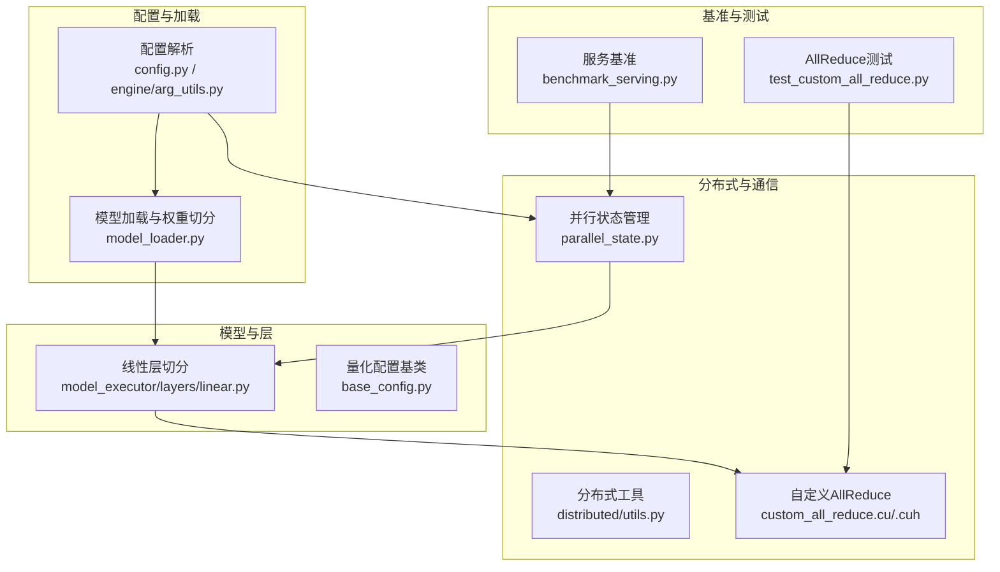
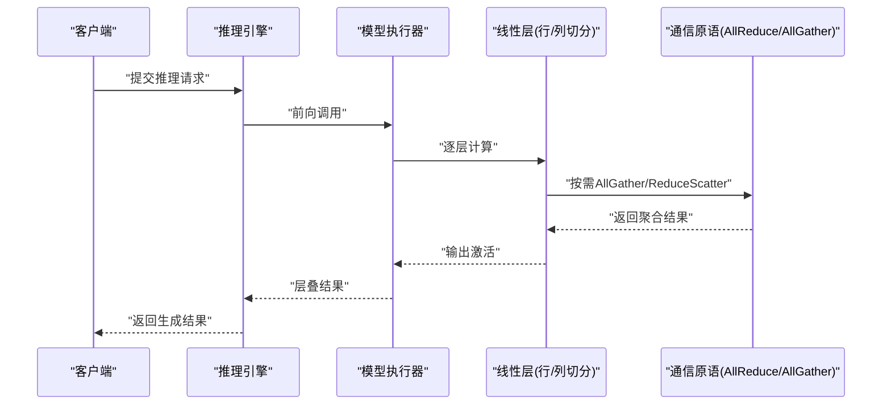
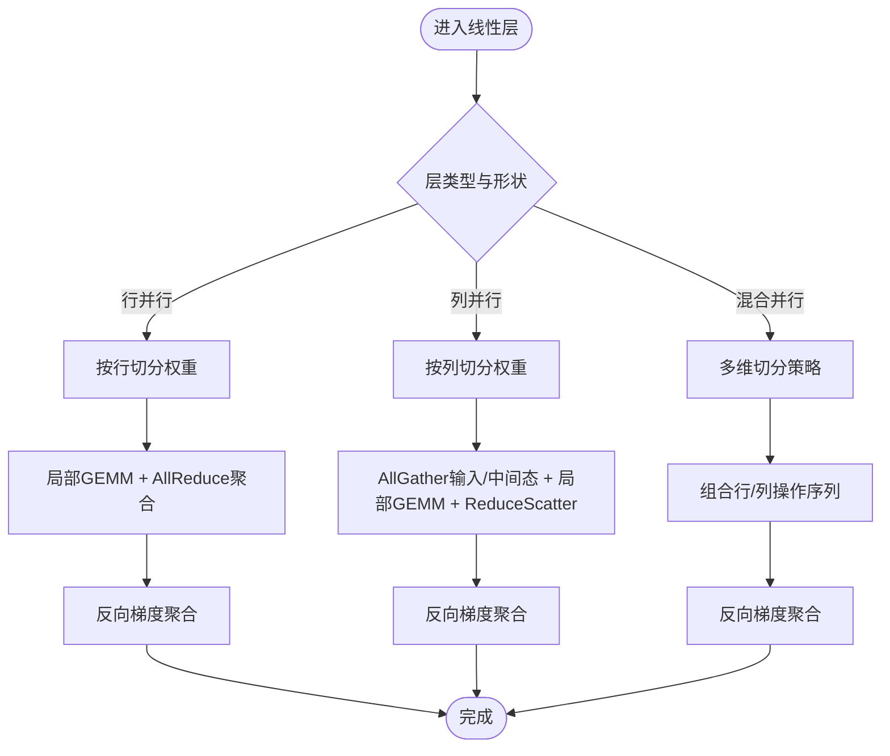
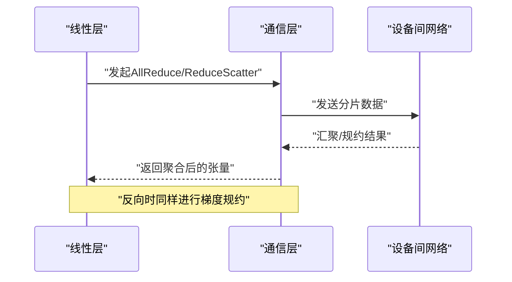
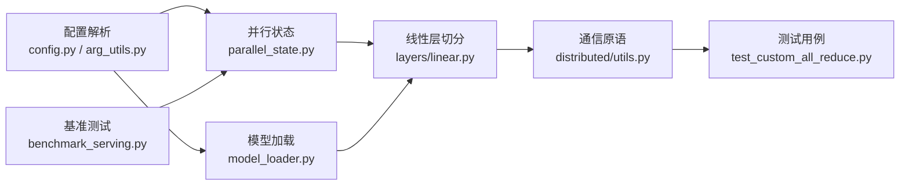

# 张量并行

<cite>
**本文引用的文件**   
- [vllm/distributed/__init__.py](file://vllm/distributed/__init__.py)
- [vllm/distributed/parallel_state.py](file://vllm/distributed/parallel_state.py)
- [vllm/distributed/utils.py](file://vllm/distributed/utils.py)
- [vllm/model_executor/layers/linear.py](file://vllm/model_executor/layers/linear.py)
- [vllm/model_executor/layers/quantization/base_config.py](file://vllm/model_executor/layers/quantization/base_config.py)
- [vllm/config.py](file://vllm/config.py)
- [vllm/engine/arg_utils.py](file://vllm/engine/arg_utils.py)
- [vllm/model_executor/model_loader.py](file://vllm/model_executor/model_loader.py)
- [benchmarks/benchmark_serving.py](file://benchmarks/benchmark_serving.py)
- [tests/distributed/test_custom_all_reduce.py](file://tests/distributed/test_custom_all_reduce.py)
</cite>

## 目录
1. [简介](#简介)
2. [项目结构](#项目结构)
3. [核心组件](#核心组件)
4. [架构总览](#架构总览)
5. [详细组件分析](#详细组件分析)
6. [依赖关系分析](#依赖关系分析)
7. [性能考量](#性能考量)
8. [故障排查指南](#故障排查指南)
9. [结论](#结论)
10. [附录](#附录)

## 简介
本文件系统性阐述 vLLM 中“张量并行”的实现原理与配置方法，覆盖行并行、列并行与混合并行的分割策略，通信同步机制（AllReduce 优化与梯度聚合），负载均衡策略，以及多 GPU 环境下的配置示例、参数调优与性能监控。文档同时提供启用与优化的实践路径，包括内存使用分析与通信开销评估方法，帮助读者在工程实践中高效落地。

## 项目结构
vLLM 的张量并行能力由分布式状态管理、层内线性算子切分、模型加载与权重分发、以及通信原语等模块协同实现。关键目录与职责如下：
- 分布式状态与通信：负责进程组初始化、并行维度管理、AllReduce 等通信原语封装与调度。
- 模型层切分：将线性层的权重按行或列进行切分，并在前向/反向过程中完成必要的通信。
- 配置与参数：统一解析用户输入，生成并行策略与通信后端选择。
- 模型加载：根据并行策略对权重进行切分与广播，确保各设备持有正确的分片。
- 基准与测试：提供端到端性能基准与通信原语正确性验证用例。

图表来源
- [vllm/distributed/parallel_state.py](file://vllm/distributed/parallel_state.py)
- [vllm/distributed/utils.py](file://vllm/distributed/utils.py)
- [vllm/model_executor/layers/linear.py](file://vllm/model_executor/layers/linear.py)
- [vllm/model_executor/layers/quantization/base_config.py](file://vllm/model_executor/layers/quantization/base_config.py)
- [vllm/config.py](file://vllm/config.py)
- [vllm/engine/arg_utils.py](file://vllm/engine/arg_utils.py)
- [vllm/model_executor/model_loader.py](file://vllm/model_executor/model_loader.py)
- [benchmarks/benchmark_serving.py](file://benchmarks/benchmark_serving.py)
- [tests/distributed/test_custom_all_reduce.py](file://tests/distributed/test_custom_all_reduce.py)

章节来源
- [vllm/distributed/__init__.py](file://vllm/distributed/__init__.py)
- [vllm/distributed/parallel_state.py](file://vllm/distributed/parallel_state.py)
- [vllm/distributed/utils.py](file://vllm/distributed/utils.py)
- [vllm/model_executor/layers/linear.py](file://vllm/model_executor/layers/linear.py)
- [vllm/model_executor/layers/quantization/base_config.py](file://vllm/model_executor/layers/quantization/base_config.py)
- [vllm/config.py](file://vllm/config.py)
- [vllm/engine/arg_utils.py](file://vllm/engine/arg_utils.py)
- [vllm/model_executor/model_loader.py](file://vllm/model_executor/model_loader.py)
- [benchmarks/benchmark_serving.py](file://benchmarks/benchmark_serving.py)
- [tests/distributed/test_custom_all_reduce.py](file://tests/distributed/test_custom_all_reduce.py)

## 核心组件
- 并行状态管理：维护进程组、张量并行维度、流水线并行维度等全局信息，提供统一的接口用于查询与设置当前并行上下文。
- 线性层切分：基于行/列策略对权重矩阵进行切分，前向计算时仅本地参与 GEMM，必要时执行 AllGather/ReduceScatter；反向传播时聚合梯度。
- 通信原语：封装 AllReduce、AllGather、ReduceScatter 等集合通信，支持自定义内核以优化带宽与延迟。
- 配置与参数：从引擎参数与配置文件解析出并行度、通信后端、是否启用混合并行等选项。
- 模型加载：依据并行策略对预训练权重进行切分与分发，保证各设备权重一致且无冗余。

章节来源
- [vllm/distributed/parallel_state.py](file://vllm/distributed/parallel_state.py)
- [vllm/model_executor/layers/linear.py](file://vllm/model_executor/layers/linear.py)
- [vllm/config.py](file://vllm/config.py)
- [vllm/engine/arg_utils.py](file://vllm/engine/arg_utils.py)
- [vllm/model_executor/model_loader.py](file://vllm/model_executor/model_loader.py)

## 架构总览
下图展示了张量并行在推理流程中的关键交互：引擎接收请求后，进入模型执行器，线性层根据并行策略进行切分计算，并通过通信原语完成数据同步与结果聚合。

图表来源
- [vllm/model_executor/layers/linear.py](file://vllm/model_executor/layers/linear.py)
- [vllm/distributed/parallel_state.py](file://vllm/distributed/parallel_state.py)
- [vllm/distributed/utils.py](file://vllm/distributed/utils.py)

## 详细组件分析

### 线性层切分与并行策略（行并行、列并行、混合并行）
- 行并行：将权重矩阵按行切分，每个设备持有部分行，前向计算时局部 GEMM，最后通过 AllReduce 聚合输出。适用于激活维度较大的层，减少跨设备通信量。
- 列并行：将权重矩阵按列切分，每个设备持有部分列，前向计算时先 AllGather 输入或中间结果，再局部 GEMM，最后 ReduceScatter 得到完整输出。适用于权重维度较大而激活较小的场景。
- 混合并行：结合行/列切分，通常用于大模型的多维切分，例如在 MLP 或注意力头维度上分别采用不同切分方向，以降低单卡显存压力并平衡通信开销。

图表来源
- [vllm/model_executor/layers/linear.py](file://vllm/model_executor/layers/linear.py)

章节来源
- [vllm/model_executor/layers/linear.py](file://vllm/model_executor/layers/linear.py)

### 通信同步机制（AllReduce 优化与梯度聚合）
- AllReduce 优化：通过自定义内核与内核融合减少拷贝与同步开销，结合 NCCL 或替代后端提升带宽利用率。
- 梯度聚合：在反向传播阶段，各设备上的梯度片段通过 ReduceScatter 或 AllReduce 聚合，确保权重更新一致性。
- 同步点控制：在关键节点插入 barrier 或隐式同步，避免死锁与乱序。

图表来源
- [vllm/distributed/utils.py](file://vllm/distributed/utils.py)
- [tests/distributed/test_custom_all_reduce.py](file://tests/distributed/test_custom_all_reduce.py)

章节来源
- [vllm/distributed/utils.py](file://vllm/distributed/utils.py)
- [tests/distributed/test_custom_all_reduce.py](file://tests/distributed/test_custom_all_reduce.py)

### 负载均衡策略
- 权重切分均衡：确保各设备持有的权重块大小相近，避免热点层导致负载不均。
- 激活分布均衡：根据输入批次与序列长度动态调整切分粒度，减少长尾请求带来的不均衡。
- 通信与计算重叠：通过异步通信与计算融合，隐藏通信延迟，提高整体吞吐。

章节来源
- [vllm/model_executor/layers/linear.py](file://vllm/model_executor/layers/linear.py)
- [vllm/distributed/parallel_state.py](file://vllm/distributed/parallel_state.py)

### 配置与参数
- 并行度设置：指定张量并行维度（如 tensor_parallel_size），以及可选的流水线并行维度。
- 通信后端：选择 NCCL 或其他高性能集合通信库，并配置相关环境变量。
- 混合并行开关：启用混合并行模式，自动选择行/列切分的组合策略。
- 量化与精度：结合量化配置（如 base_config.py）降低显存占用，配合并行切分提升效率。

章节来源
- [vllm/config.py](file://vllm/config.py)
- [vllm/engine/arg_utils.py](file://vllm/engine/arg_utils.py)
- [vllm/model_executor/layers/quantization/base_config.py](file://vllm/model_executor/layers/quantization/base_config.py)

### 模型加载与权重分发
- 权重切分：根据并行策略对预训练权重进行切分，确保各设备持有对应分片。
- 广播与同步：主设备加载完整权重后，按分片广播至其他设备，保证一致性。
- 校验与回滚：加载完成后进行一致性校验，失败则回滚并记录错误日志。

章节来源
- [vllm/model_executor/model_loader.py](file://vllm/model_executor/model_loader.py)

## 依赖关系分析
张量并行的实现依赖于多个模块的协作，下图展示主要依赖关系与调用路径。

图表来源
- [vllm/config.py](file://vllm/config.py)
- [vllm/engine/arg_utils.py](file://vllm/engine/arg_utils.py)
- [vllm/distributed/parallel_state.py](file://vllm/distributed/parallel_state.py)
- [vllm/model_executor/model_loader.py](file://vllm/model_executor/model_loader.py)
- [vllm/model_executor/layers/linear.py](file://vllm/model_executor/layers/linear.py)
- [vllm/distributed/utils.py](file://vllm/distributed/utils.py)
- [tests/distributed/test_custom_all_reduce.py](file://tests/distributed/test_custom_all_reduce.py)
- [benchmarks/benchmark_serving.py](file://benchmarks/benchmark_serving.py)

章节来源
- [vllm/config.py](file://vllm/config.py)
- [vllm/engine/arg_utils.py](file://vllm/engine/arg_utils.py)
- [vllm/distributed/parallel_state.py](file://vllm/distributed/parallel_state.py)
- [vllm/model_executor/model_loader.py](file://vllm/model_executor/model_loader.py)
- [vllm/model_executor/layers/linear.py](file://vllm/model_executor/layers/linear.py)
- [vllm/distributed/utils.py](file://vllm/distributed/utils.py)
- [tests/distributed/test_custom_all_reduce.py](file://tests/distributed/test_custom_all_reduce.py)
- [benchmarks/benchmark_serving.py](file://benchmarks/benchmark_serving.py)

## 性能考量
- 通信开销评估：通过基准脚本测量不同并行度下的吞吐与延迟，识别瓶颈层。
- 内存使用分析：观察各设备显存峰值，调整切分粒度与量化策略以缓解 OOM。
- 内核融合与异步：利用自定义 AllReduce 内核与计算通信重叠技术，提升整体效率。
- 参数调优：根据硬件特性调整 NCCL 参数、批大小、序列长度等，达到最佳性能。

章节来源
- [benchmarks/benchmark_serving.py](file://benchmarks/benchmark_serving.py)
- [tests/distributed/test_custom_all_reduce.py](file://tests/distributed/test_custom_all_reduce.py)

## 故障排查指南
- 通信失败：检查进程组初始化、NCCL 环境变量与网络连通性，参考测试用例定位问题。
- 权重不一致：确认模型加载时的切分与广播逻辑，增加一致性校验与日志输出。
- 负载不均衡：分析层形状与输入分布，调整并行策略与切分粒度。
- 性能退化：对比基准测试结果，定位通信或计算瓶颈，优化内核融合与同步点。

章节来源
- [tests/distributed/test_custom_all_reduce.py](file://tests/distributed/test_custom_all_reduce.py)
- [vllm/model_executor/model_loader.py](file://vllm/model_executor/model_loader.py)
- [vllm/distributed/utils.py](file://vllm/distributed/utils.py)

## 结论
vLLM 的张量并行通过灵活的行/列/混合切分策略、高效的通信原语与完善的配置体系，为大模型推理提供了可扩展、高性能的实现。在实际部署中，建议结合基准测试与内存分析持续调优，确保在不同硬件与负载下均能获得稳定表现。

## 附录
- 多 GPU 配置示例：设置 tensor_parallel_size 为期望的并行度，选择合适的通信后端，并根据模型大小调整量化与批大小。
- 性能监控：使用内置指标与外部监控工具跟踪吞吐、延迟与显存使用，辅助定位问题。
- 优化建议：优先优化热点层通信，利用内核融合与异步技术隐藏延迟，合理分配资源避免争用。