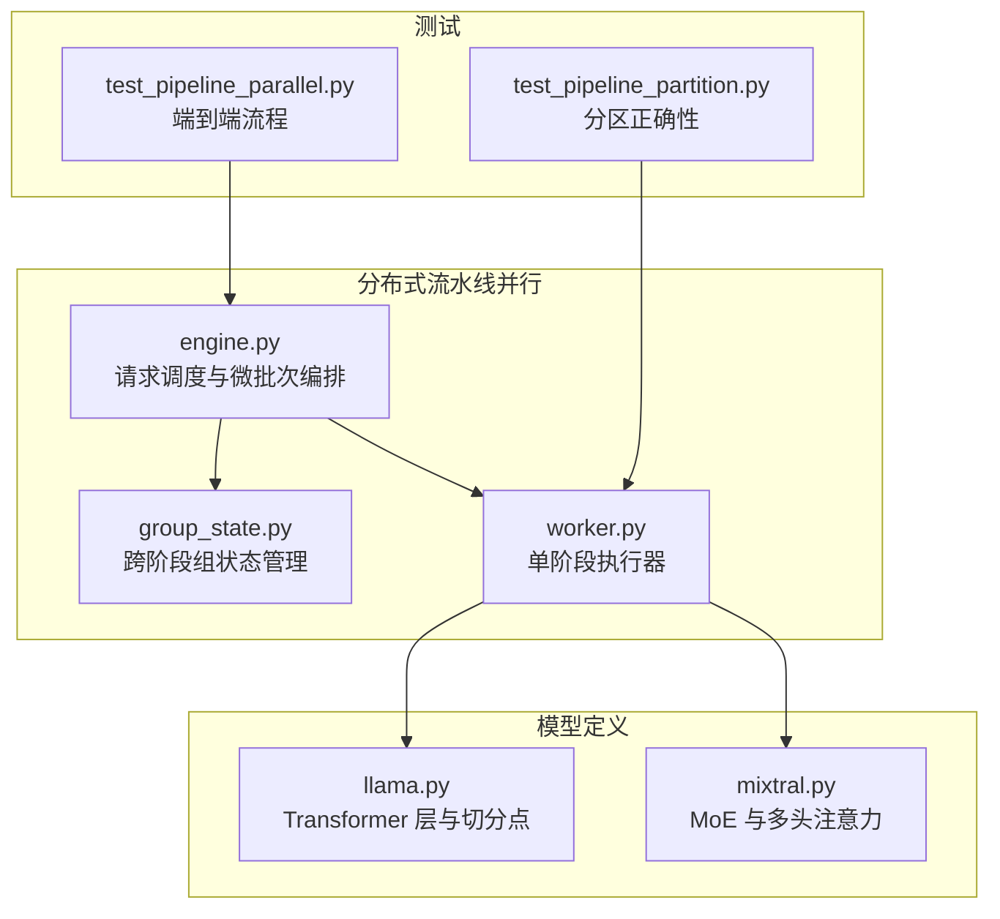
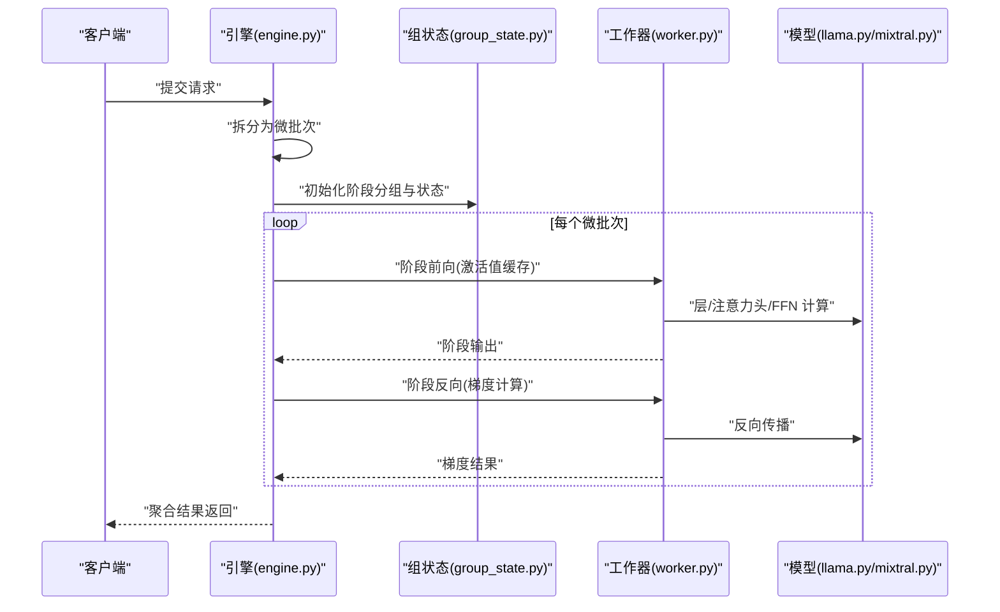
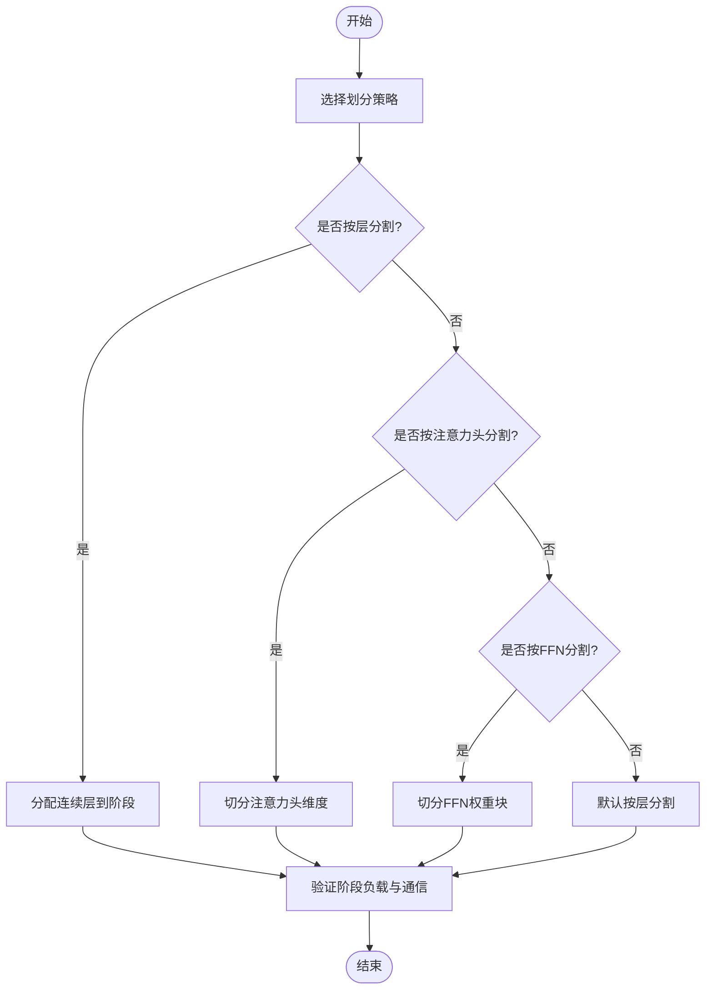
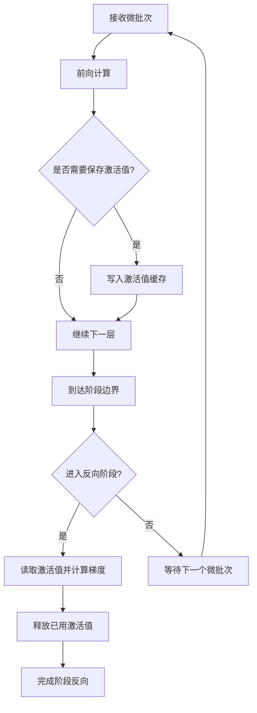
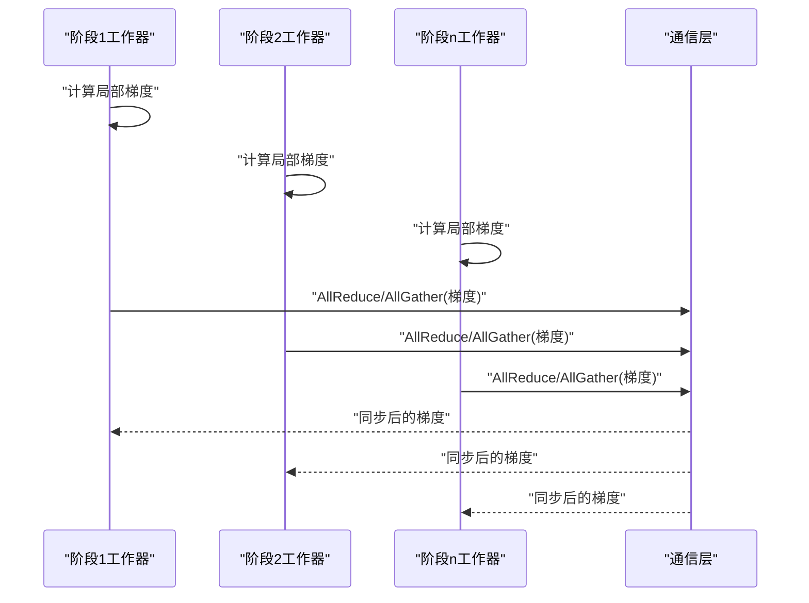
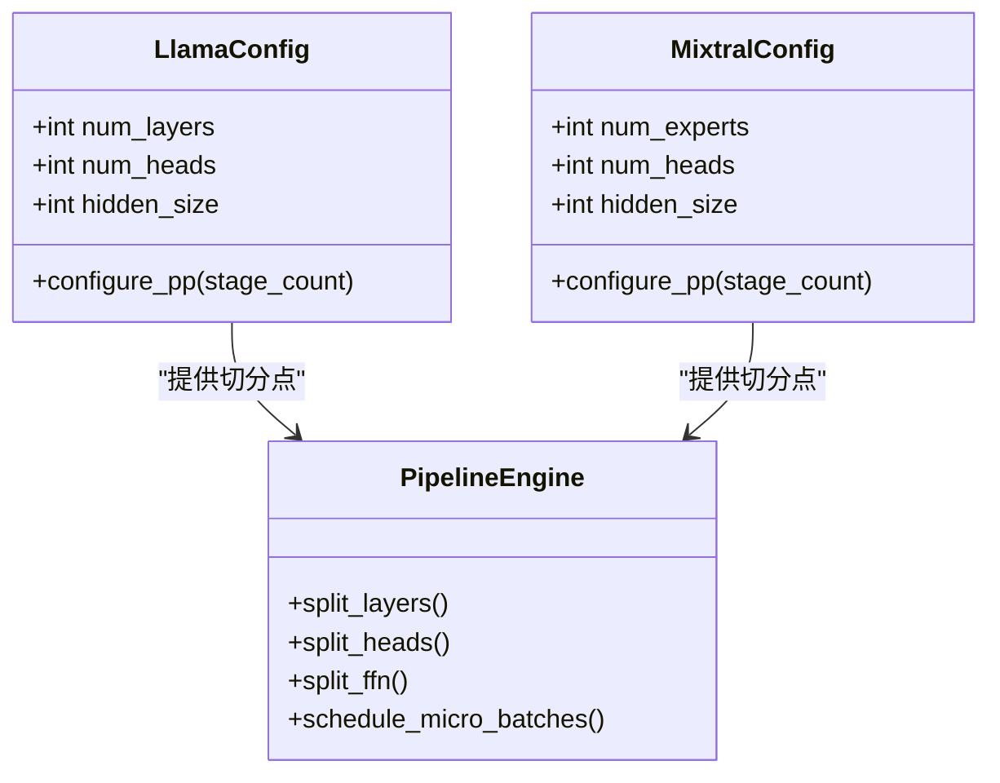
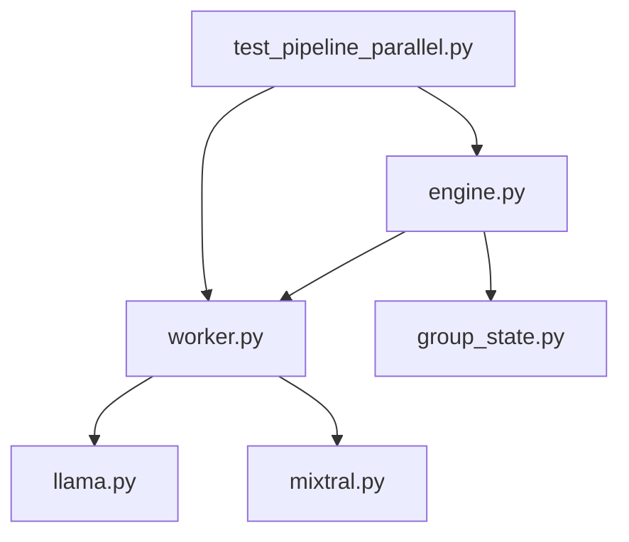

# 流水线并行

<cite>
**本文引用的文件**   
- [vllm/distributed/pipeline_parallel/engine.py](file://vllm/distributed/pipeline_parallel/engine.py)
- [vllm/distributed/pipeline_parallel/group_state.py](file://vllm/distributed/pipeline_parallel/group_state.py)
- [vllm/distributed/pipeline_parallel/worker.py](file://vllm/distributed/pipeline_parallel/worker.py)
- [vllm/model_executor/models/llama.py](file://vllm/model_executor/models/llama.py)
- [vllm/model_executor/models/mixtral.py](file://vllm/model_executor/models/mixtral.py)
- [tests/distributed/test_pipeline_parallel.py](file://tests/distributed/test_pipeline_parallel.py)
- [tests/distributed/test_pipeline_partition.py](file://tests/distributed/test_pipeline_partition.py)
</cite>

## 目录
1. [简介](#简介)
2. [项目结构](#项目结构)
3. [核心组件](#核心组件)
4. [架构总览](#架构总览)
5. [详细组件分析](#详细组件分析)
6. [依赖关系分析](#依赖关系分析)
7. [性能考量](#性能考量)
8. [故障排查指南](#故障排查指南)
9. [结论](#结论)
10. [附录](#附录)

## 简介
本文件系统性阐述 vLLM 中流水线并行的工作机制与实现细节，覆盖模型阶段划分策略（层分割、注意力头分割、前馈网络分割）、激活值存储与管理（微批次处理与内存优化）、梯度同步过程（反向传播通信模式与优化），以及面向不同模型架构的配置示例与性能特点。文档以代码级分析为基础，辅以可视化图示，帮助读者从概念到实现全面掌握流水线并行在 vLLM 中的落地方式。

## 项目结构
vLLM 的流水线并行相关代码主要位于 distributed/pipeline_parallel 子模块，配合 model_executor 中的模型定义与 tests 中的端到端测试用例，形成“编排—执行—验证”的完整闭环：
- 编排与调度：engine.py 负责将请求映射为微批次并在阶段间调度；group_state.py 维护跨阶段的组状态；worker.py 封装单卡上的阶段执行逻辑。
- 模型适配：model_executor/models 下的具体模型（如 Llama、Mixtral）提供层结构与可切分点，便于按层或按注意力头进行阶段划分。
- 测试与验证：tests/distributed 下包含流水线并行的功能与分区正确性测试，用于保障配置与实现的稳定性。

**图表来源** 
- [vllm/distributed/pipeline_parallel/engine.py](file://vllm/distributed/pipeline_parallel/engine.py)
- [vllm/distributed/pipeline_parallel/group_state.py](file://vllm/distributed/pipeline_parallel/group_state.py)
- [vllm/distributed/pipeline_parallel/worker.py](file://vllm/distributed/pipeline_parallel/worker.py)
- [vllm/model_executor/models/llama.py](file://vllm/model_executor/models/llama.py)
- [vllm/model_executor/models/mixtral.py](file://vllm/model_executor/models/mixtral.py)
- [tests/distributed/test_pipeline_parallel.py](file://tests/distributed/test_pipeline_parallel.py)
- [tests/distributed/test_pipeline_partition.py](file://tests/distributed/test_pipeline_partition.py)

**章节来源**
- [vllm/distributed/pipeline_parallel/engine.py](file://vllm/distributed/pipeline_parallel/engine.py)
- [vllm/distributed/pipeline_parallel/group_state.py](file://vllm/distributed/pipeline_parallel/group_state.py)
- [vllm/distributed/pipeline_parallel/worker.py](file://vllm/distributed/pipeline_parallel/worker.py)
- [vllm/model_executor/models/llama.py](file://vllm/model_executor/models/llama.py)
- [vllm/model_executor/models/mixtral.py](file://vllm/model_executor/models/mixtral.py)
- [tests/distributed/test_pipeline_parallel.py](file://tests/distributed/test_pipeline_parallel.py)
- [tests/distributed/test_pipeline_partition.py](file://tests/distributed/test_pipeline_partition.py)

## 核心组件
- 引擎与调度（engine.py）
  - 负责将输入请求拆分为微批次，协调各阶段的计算顺序与数据流转，确保流水线吞吐最大化。
  - 管理阶段间的激活值缓存与释放，避免不必要的重复计算与内存峰值。
- 组状态（group_state.py）
  - 维护跨阶段的分组信息（如 micro-batch 索引、阶段归属、通信上下文），支撑有序的数据交换与同步。
- 工作器（worker.py）
  - 封装单个阶段的执行逻辑，包括前向/反向调用、激活值保存与恢复、局部梯度计算与通信。
- 模型适配（llama.py, mixtral.py）
  - 暴露层接口与注意力头维度，支持按层切分、按注意力头切分等策略，使流水线划分更灵活。
- 测试（test_pipeline_parallel.py, test_pipeline_partition.py）
  - 覆盖端到端推理与训练流程，验证分区策略的正确性与负载均衡效果。

**章节来源**
- [vllm/distributed/pipeline_parallel/engine.py](file://vllm/distributed/pipeline_parallel/engine.py)
- [vllm/distributed/pipeline_parallel/group_state.py](file://vllm/distributed/pipeline_parallel/group_state.py)
- [vllm/distributed/pipeline_parallel/worker.py](file://vllm/distributed/pipeline_parallel/worker.py)
- [vllm/model_executor/models/llama.py](file://vllm/model_executor/models/llama.py)
- [vllm/model_executor/models/mixtral.py](file://vllm/model_executor/models/mixtral.py)
- [tests/distributed/test_pipeline_parallel.py](file://tests/distributed/test_pipeline_parallel.py)
- [tests/distributed/test_pipeline_partition.py](file://tests/distributed/test_pipeline_partition.py)

## 架构总览
下图展示 vLLM 流水线并行的整体架构：引擎负责请求拆分与微批次调度，工作器在各阶段执行计算，组状态贯穿全程保证一致性，模型定义提供切分点与维度信息。

**图表来源** 
- [vllm/distributed/pipeline_parallel/engine.py](file://vllm/distributed/pipeline_parallel/engine.py)
- [vllm/distributed/pipeline_parallel/group_state.py](file://vllm/distributed/pipeline_parallel/group_state.py)
- [vllm/distributed/pipeline_parallel/worker.py](file://vllm/distributed/pipeline_parallel/worker.py)
- [vllm/model_executor/models/llama.py](file://vllm/model_executor/models/llama.py)
- [vllm/model_executor/models/mixtral.py](file://vllm/model_executor/models/mixtral.py)

## 详细组件分析

### 模型阶段划分策略
- 层分割
  - 将 Transformer 的连续若干层分配到同一阶段，减少阶段间通信次数，提高局部计算密度。
  - 适用于大多数稠密模型（如 Llama），通过层边界作为切分点，易于实现与调试。
- 注意力头分割
  - 将多头注意力的头维度切分到不同阶段，适合需要细粒度并行化的场景，但会增加阶段间通信开销。
  - 在 MoE 或多头注意力结构中尤为关键（如 Mixtral），需结合路由与门控机制进行平衡。
- 前馈网络分割
  - 将 FFN 的子层或权重块按维度切分，通常与注意力头分割协同使用，提升并行度。
  - 需注意激活值对齐与归一化层的放置位置，避免额外通信。

**图表来源** 
- [vllm/model_executor/models/llama.py](file://vllm/model_executor/models/llama.py)
- [vllm/model_executor/models/mixtral.py](file://vllm/model_executor/models/mixtral.py)

**章节来源**
- [vllm/model_executor/models/llama.py](file://vllm/model_executor/models/llama.py)
- [vllm/model_executor/models/mixtral.py](file://vllm/model_executor/models/mixtral.py)

### 激活值存储与管理机制
- 微批次处理
  - 将大批次拆分为多个微批次，逐段送入流水线，降低显存峰值并保持高吞吐。
  - 引擎协调微批次的入队与出队，确保阶段间数据流不阻塞。
- 激活值缓存与释放
  - 在前向过程中按需保存中间激活值，反向时按需读取并立即释放，避免累积占用。
  - 组状态记录激活值的生命周期，确保跨阶段的一致性。
- 内存优化技术
  - 采用原地操作、共享缓冲区与延迟释放等手段，减少临时对象创建与拷贝。
  - 针对注意力与 FFN 的激活值进行压缩或量化（视后端支持）。

**图表来源** 
- [vllm/distributed/pipeline_parallel/engine.py](file://vllm/distributed/pipeline_parallel/engine.py)
- [vllm/distributed/pipeline_parallel/group_state.py](file://vllm/distributed/pipeline_parallel/group_state.py)
- [vllm/distributed/pipeline_parallel/worker.py](file://vllm/distributed/pipeline_parallel/worker.py)

**章节来源**
- [vllm/distributed/pipeline_parallel/engine.py](file://vllm/distributed/pipeline_parallel/engine.py)
- [vllm/distributed/pipeline_parallel/group_state.py](file://vllm/distributed/pipeline_parallel/group_state.py)
- [vllm/distributed/pipeline_parallel/worker.py](file://vllm/distributed/pipeline_parallel/worker.py)

### 梯度同步过程
- 反向传播通信模式
  - 在每个阶段完成局部梯度计算后，通过集合通信（如 AllReduce 或自定义 AllGather）同步梯度，确保参数一致性。
  - 对于注意力头与 FFN 的分割，需在对应维度上进行规约或拼接。
- 优化策略
  - 重叠通信与计算：在反向传播的同时发起梯度同步，隐藏通信延迟。
  - 梯度累积与压缩：对稀疏梯度进行压缩或分块传输，降低带宽压力。
  - 拓扑感知：根据硬件拓扑选择最优通信路径，减少跨节点跳数。

**图表来源** 
- [vllm/distributed/pipeline_parallel/worker.py](file://vllm/distributed/pipeline_parallel/worker.py)
- [vllm/distributed/pipeline_parallel/engine.py](file://vllm/distributed/pipeline_parallel/engine.py)

**章节来源**
- [vllm/distributed/pipeline_parallel/worker.py](file://vllm/distributed/pipeline_parallel/worker.py)
- [vllm/distributed/pipeline_parallel/engine.py](file://vllm/distributed/pipeline_parallel/engine.py)

### 不同模型架构的流水线并行配置示例
- Llama（稠密 Transformer）
  - 阶段数：建议等于 GPU 数量，每阶段分配连续若干层。
  - 负载均衡：按层深度均匀分配，避免注意力头过多导致的负载不均。
- Mixtral（MoE + 多头注意力）
  - 阶段数：可根据专家数量与头数调整，必要时将专家路由与注意力头分割结合。
  - 负载均衡：考虑门控权重分布，动态调整阶段内的专家与头分配。

**图表来源** 
- [vllm/model_executor/models/llama.py](file://vllm/model_executor/models/llama.py)
- [vllm/model_executor/models/mixtral.py](file://vllm/model_executor/models/mixtral.py)
- [vllm/distributed/pipeline_parallel/engine.py](file://vllm/distributed/pipeline_parallel/engine.py)

**章节来源**
- [vllm/model_executor/models/llama.py](file://vllm/model_executor/models/llama.py)
- [vllm/model_executor/models/mixtral.py](file://vllm/model_executor/models/mixtral.py)
- [vllm/distributed/pipeline_parallel/engine.py](file://vllm/distributed/pipeline_parallel/engine.py)

### 实际案例与性能特点
- 端到端推理
  - 通过微批次流水线显著提升吞吐，尤其在长序列与大批次场景下表现优异。
  - 激活值缓存与释放策略有效降低显存峰值，支持更大模型部署。
- 训练场景
  - 梯度同步与通信重叠策略减少反向传播时间，提升训练效率。
  - 针对不同模型结构的定制化划分策略，实现更好的负载均衡与扩展性。

**章节来源**
- [tests/distributed/test_pipeline_parallel.py](file://tests/distributed/test_pipeline_parallel.py)
- [tests/distributed/test_pipeline_partition.py](file://tests/distributed/test_pipeline_partition.py)

## 依赖关系分析
流水线并行的核心依赖包括引擎、组状态与工作器之间的协作，以及与模型定义的耦合。下图展示了主要模块间的依赖关系。

**图表来源** 
- [vllm/distributed/pipeline_parallel/engine.py](file://vllm/distributed/pipeline_parallel/engine.py)
- [vllm/distributed/pipeline_parallel/worker.py](file://vllm/distributed/pipeline_parallel/worker.py)
- [vllm/distributed/pipeline_parallel/group_state.py](file://vllm/distributed/pipeline_parallel/group_state.py)
- [vllm/model_executor/models/llama.py](file://vllm/model_executor/models/llama.py)
- [vllm/model_executor/models/mixtral.py](file://vllm/model_executor/models/mixtral.py)
- [tests/distributed/test_pipeline_parallel.py](file://tests/distributed/test_pipeline_parallel.py)

**章节来源**
- [vllm/distributed/pipeline_parallel/engine.py](file://vllm/distributed/pipeline_parallel/engine.py)
- [vllm/distributed/pipeline_parallel/worker.py](file://vllm/distributed/pipeline_parallel/worker.py)
- [vllm/distributed/pipeline_parallel/group_state.py](file://vllm/distributed/pipeline_parallel/group_state.py)
- [vllm/model_executor/models/llama.py](file://vllm/model_executor/models/llama.py)
- [vllm/model_executor/models/mixtral.py](file://vllm/model_executor/models/mixtral.py)
- [tests/distributed/test_pipeline_parallel.py](file://tests/distributed/test_pipeline_parallel.py)

## 性能考量
- 微批次大小调优：过小的微批次会导致通信开销占比上升，过大则增加显存压力，需根据模型规模与硬件资源折中。
- 阶段负载均衡：确保各阶段计算量相近，避免瓶颈阶段拖慢整体流水线。
- 通信优化：利用异步通信、梯度压缩与拓扑感知算法，降低同步延迟。
- 激活值管理：精细控制缓存生命周期，避免不必要的内存分配与拷贝。

[本节为通用指导，无需引用具体文件]

## 故障排查指南
- 常见错误
  - 阶段间数据不一致：检查组状态管理与激活值缓存的生命周期。
  - 显存溢出：调整微批次大小或启用激活值压缩。
  - 通信超时：确认网络拓扑与通信后端配置。
- 调试工具
  - 启用日志与指标收集，定位瓶颈阶段。
  - 使用测试用例复现问题，逐步缩小范围。

**章节来源**
- [vllm/distributed/pipeline_parallel/group_state.py](file://vllm/distributed/pipeline_parallel/group_state.py)
- [vllm/distributed/pipeline_parallel/engine.py](file://vllm/distributed/pipeline_parallel/engine.py)
- [tests/distributed/test_pipeline_parallel.py](file://tests/distributed/test_pipeline_parallel.py)

## 结论
vLLM 的流水线并行通过灵活的阶段划分策略、高效的激活值管理与优化的梯度同步机制，实现了在高吞吐与低延迟场景下的卓越性能。针对不同模型架构的定制化配置与负载均衡策略，使其能够适应多样化的部署需求。通过持续的优化与实践，流水线并行将成为大规模模型推理与训练的关键技术之一。

[本节为总结性内容，无需引用具体文件]

## 附录
- 术语表
  - 流水线并行：将模型层或算子分配到不同设备，形成数据流式处理管道。
  - 微批次：将大批次拆分为小批次，逐段处理以降低显存占用。
  - 激活值：前向传播中的中间结果，反向传播时需复用。
- 参考链接
  - vLLM 官方文档与示例代码
  - 分布式训练与推理最佳实践

[本节为补充信息，无需引用具体文件]