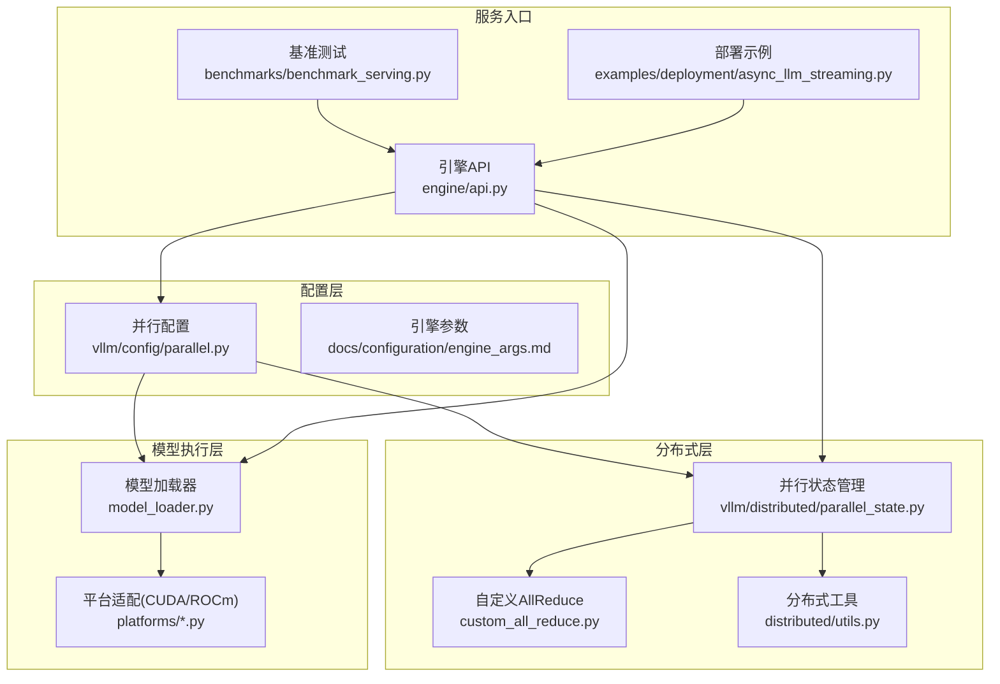
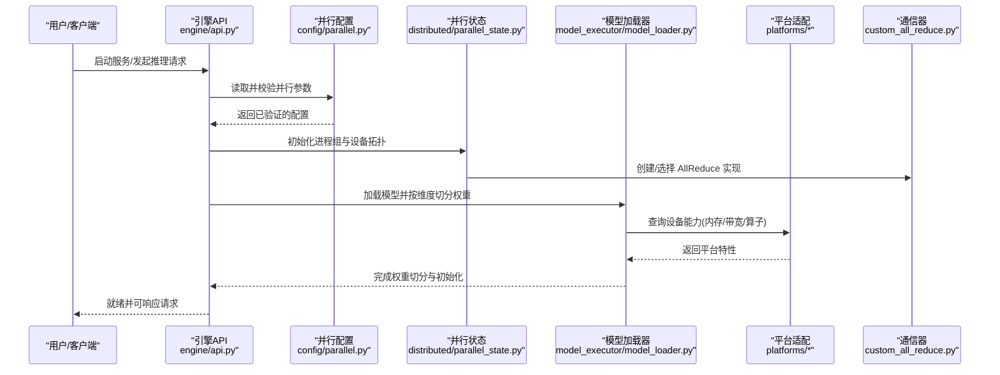
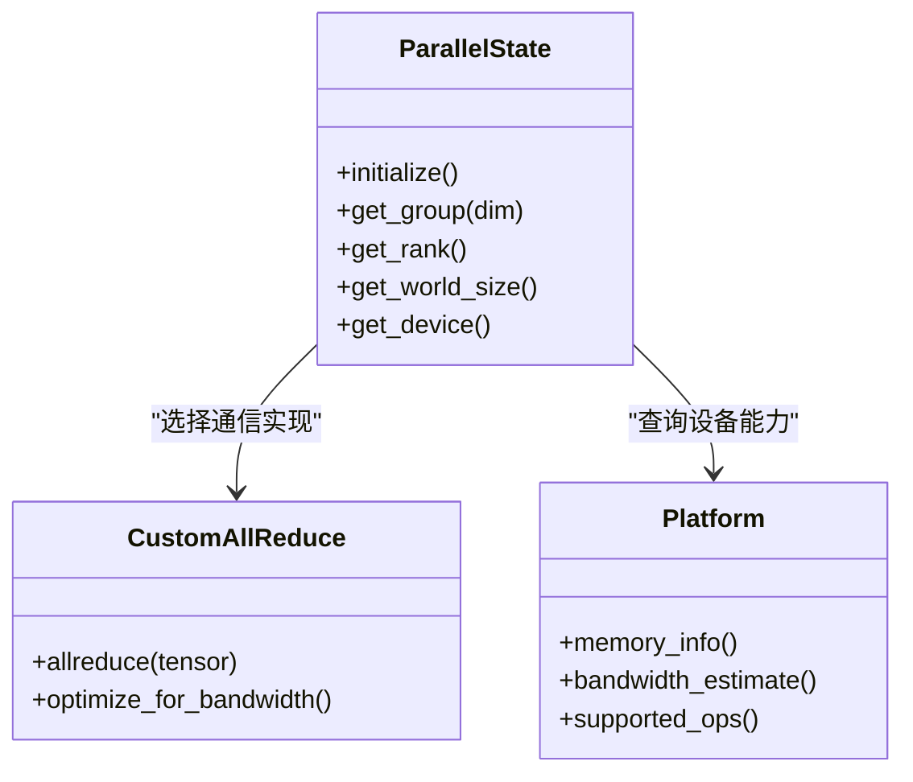
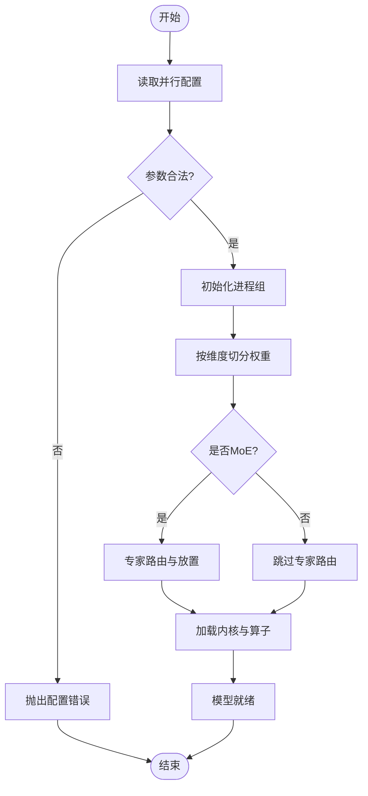
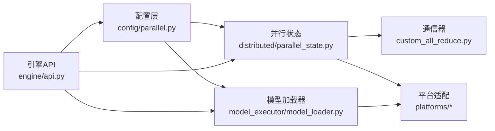

# 混合并行策略

<cite>
**本文档引用的文件**   
- [vllm/config/__init__.py](file://vllm/config/__init__.py)
- [vllm/config/parallel.py](file://vllm/config/parallel.py)
- [vllm/engine/api.py](file://vllm/engine/api.py)
- [vllm/model_executor/model_loader.py](file://vllm/model_executor/model_loader.py)
- [vllm/distributed/parallel_state.py](file://vllm/distributed/parallel_state.py)
- [vllm/distributed/device_communicator/custom_all_reduce.py](file://vllm/distributed/device_communicator/custom_all_reduce.py)
- [vllm/distributed/utils.py](file://vllm/distributed/utils.py)
- [vllm/platforms/cuda.py](file://vllm/platforms/cuda.py)
- [vllm/platforms/rocm.py](file://vllm/platforms/rocm.py)
- [benchmarks/benchmark_serving.py](file://benchmarks/benchmark_serving.py)
- [examples/deployment/async_llm_streaming.py](file://examples/deployment/async_llm_streaming.py)
- [docs/serving/parallelism_scaling.md](file://docs/serving/parallelism_scaling.md)
- [docs/configuration/engine_args.md](file://docs/configuration/engine_args.md)
- [docs/design/arch_overview.md](file://docs/design/arch_overview.md)
</cite>

## 目录
1. [简介](#简介)
2. [项目结构](#项目结构)
3. [核心组件](#核心组件)
4. [架构总览](#架构总览)
5. [详细组件分析](#详细组件分析)
6. [依赖关系分析](#依赖关系分析)
7. [性能考量](#性能考量)
8. [故障排查指南](#故障排查指南)
9. [结论](#结论)
10. [附录](#附录)

## 简介
本文件系统性阐述 vLLM 中混合并行策略的组合与配置，重点覆盖：
- 张量并行（TP）与流水线并行（PP）的组合机制
- 专家并行（EP/MoE）与其他并行策略的集成方式
- GPU 内存分配、通信带宽优化与负载均衡策略
- 层级设置、参数调优与性能监控方法
- 多节点集群部署的资源规划与实战示例
- 不同混合策略的性能特点与适用场景

目标是帮助开发者在大规模模型部署中选择并配置合适的并行组合方案。

## 项目结构
vLLM 的并行相关能力主要分布在以下模块：
- 配置层：统一解析与校验并行参数，生成执行期配置
- 分布式状态：维护进程组、设备拓扑、通信器
- 模型加载：按并行维度切分权重、初始化各并行组
- 平台适配：CUDA/ROCm 等设备的内存与通信特性封装
- 服务入口：引擎启动、请求调度与批处理
- 基准与示例：提供可复现实验与部署脚本

图表来源
- [vllm/config/parallel.py](file://vllm/config/parallel.py)
- [vllm/distributed/parallel_state.py](file://vllm/distributed/parallel_state.py)
- [vllm/model_executor/model_loader.py](file://vllm/model_executor/model_loader.py)
- [vllm/platforms/cuda.py](file://vllm/platforms/cuda.py)
- [vllm/platforms/rocm.py](file://vllm/platforms/rocm.py)
- [vllm/engine/api.py](file://vllm/engine/api.py)
- [benchmarks/benchmark_serving.py](file://benchmarks/benchmark_serving.py)
- [examples/deployment/async_llm_streaming.py](file://examples/deployment/async_llm_streaming.py)

章节来源
- [docs/design/arch_overview.md](file://docs/design/arch_overview.md)
- [docs/configuration/engine_args.md](file://docs/configuration/engine_args.md)

## 核心组件
- 并行配置与校验：集中定义 TP、PP、EP、CP、DP 等维度的参数与约束，确保组合合法
- 分布式状态机：创建进程组、绑定设备、初始化通信器（NCCL/自定义AR），暴露查询接口
- 模型加载与权重切分：根据并行维度对模型权重进行切分与广播，支持 MoE 专家路由与放置
- 平台适配层：封装 CUDA/ROCm 的内存池、带宽、算子特性，影响通信与计算路径选择
- 服务与调度：引擎对外 API 接收请求，内部按并行策略组织批处理与流水线阶段

章节来源
- [vllm/config/parallel.py](file://vllm/config/parallel.py)
- [vllm/distributed/parallel_state.py](file://vllm/distributed/parallel_state.py)
- [vllm/model_executor/model_loader.py](file://vllm/model_executor/model_loader.py)
- [vllm/platforms/cuda.py](file://vllm/platforms/cuda.py)
- [vllm/platforms/rocm.py](file://vllm/platforms/rocm.py)
- [vllm/engine/api.py](file://vllm/engine/api.py)

## 架构总览
下图展示了从配置到执行的端到端流程，以及关键并行维度的协作关系。

图表来源
- [vllm/engine/api.py](file://vllm/engine/api.py)
- [vllm/config/parallel.py](file://vllm/config/parallel.py)
- [vllm/distributed/parallel_state.py](file://vllm/distributed/parallel_state.py)
- [vllm/model_executor/model_loader.py](file://vllm/model_executor/model_loader.py)
- [vllm/platforms/cuda.py](file://vllm/platforms/cuda.py)
- [vllm/platforms/rocm.py](file://vllm/platforms/rocm.py)
- [vllm/distributed/device_communicator/custom_all_reduce.py](file://vllm/distributed/device_communicator/custom_all_reduce.py)

## 详细组件分析

### 并行配置与校验（TP/PP/EP/CP/DP）
- 支持的并行维度：张量并行（TP）、流水线并行（PP）、专家并行（EP）、上下文并行（CP）、数据并行（DP）
- 组合规则：
  - TP×PP：常见于大模型跨卡/跨节点扩展，需保证层划分与张量切分对齐
  - EP×其他：MoE 专家按 rank 分布，可与 TP/PP/CP 组合，注意专家路由开销与负载均衡
  - CP：用于长上下文注意力分片，常与 TP/PP 组合提升吞吐
  - DP：多副本复制模型，适合高并发低延迟场景
- 参数校验：检查维度乘积不超过可用设备数、层数整除性、MoE 专家数与 rank 匹配等

章节来源
- [vllm/config/parallel.py](file://vllm/config/parallel.py)
- [docs/configuration/engine_args.md](file://docs/configuration/engine_args.md)

### 分布式状态与通信器
- 进程组管理：为每个并行维度创建独立的进程组，隔离通信域
- 设备拓扑：依据 GPU 数量与拓扑构建通信图，选择最优 AllReduce 实现
- 通信器选择：默认 NCCL，可选自定义 AllReduce 以优化带宽或兼容特定硬件

图表来源
- [vllm/distributed/parallel_state.py](file://vllm/distributed/parallel_state.py)
- [vllm/distributed/device_communicator/custom_all_reduce.py](file://vllm/distributed/device_communicator/custom_all_reduce.py)
- [vllm/platforms/cuda.py](file://vllm/platforms/cuda.py)
- [vllm/platforms/rocm.py](file://vllm/platforms/rocm.py)

章节来源
- [vllm/distributed/parallel_state.py](file://vllm/distributed/parallel_state.py)
- [vllm/distributed/utils.py](file://vllm/distributed/utils.py)

### 模型加载与权重切分
- 切分策略：按 TP/PP/EP 维度对权重进行分片，确保每卡持有对应切片
- MoE 专家放置：将专家路由到指定 rank，结合 EP 与 TP/PP 提升扩展性
- 平台感知：根据设备内存与带宽调整加载顺序与缓存策略

图表来源
- [vllm/model_executor/model_loader.py](file://vllm/model_executor/model_loader.py)
- [vllm/config/parallel.py](file://vllm/config/parallel.py)

章节来源
- [vllm/model_executor/model_loader.py](file://vllm/model_executor/model_loader.py)

### 服务入口与请求调度
- 引擎 API：封装并行执行细节，对外提供统一的推理接口
- 批处理与流水线：根据 PP/TP/CP 维度组织批次，最大化吞吐
- 资源监控：暴露关键指标（GPU 利用率、通信带宽、队列长度）

章节来源
- [vllm/engine/api.py](file://vllm/engine/api.py)
- [benchmarks/benchmark_serving.py](file://benchmarks/benchmark_serving.py)

## 依赖关系分析
- 配置层依赖分布式状态与平台能力，确保参数与硬件匹配
- 模型加载器依赖并行状态进行权重切分与广播
- 服务入口依赖配置与分布式状态，协调执行流程

图表来源
- [vllm/config/parallel.py](file://vllm/config/parallel.py)
- [vllm/distributed/parallel_state.py](file://vllm/distributed/parallel_state.py)
- [vllm/model_executor/model_loader.py](file://vllm/model_executor/model_loader.py)
- [vllm/distributed/device_communicator/custom_all_reduce.py](file://vllm/distributed/device_communicator/custom_all_reduce.py)
- [vllm/platforms/cuda.py](file://vllm/platforms/cuda.py)
- [vllm/platforms/rocm.py](file://vllm/platforms/rocm.py)
- [vllm/engine/api.py](file://vllm/engine/api.py)

章节来源
- [docs/design/arch_overview.md](file://docs/design/arch_overview.md)

## 性能考量
- GPU 内存分配：
  - 使用分页注意力与 KV Cache 管理，避免碎片化
  - 根据模型大小与并行度动态调整块大小与缓存水位
- 通信带宽优化：
  - 优先选择带宽更高的 AllReduce 实现（如自定义 AR）
  - 合并小消息，减少同步开销
- 负载均衡：
  - MoE 专家路由需考虑热点专家，必要时引入重平衡策略
  - 长上下文任务通过 CP 分片降低单卡压力

[本节为通用指导，不直接分析具体文件]

## 故障排查指南
- 配置错误：检查 TP×PP×EP×CP×DP 乘积与设备数匹配，层数整除性
- 通信失败：确认 NCCL/自定义 AR 初始化成功，网络连通性与带宽
- 内存溢出：降低 batch size、启用 KV offload、调整块大小
- 负载不均：监控专家路由分布，调整路由阈值或重新分配专家

章节来源
- [vllm/distributed/utils.py](file://vllm/distributed/utils.py)
- [vllm/platforms/cuda.py](file://vllm/platforms/cuda.py)
- [vllm/platforms/rocm.py](file://vllm/platforms/rocm.py)

## 结论
vLLM 的混合并行策略通过清晰的配置层、健壮的分布式状态管理与平台适配，实现了 TP/PP/EP/CP/DP 的灵活组合。在实际部署中，应根据模型规模、硬件条件与业务需求选择合适的并行组合，并通过性能监控与参数调优达到最佳吞吐与延迟。

[本节为总结，不直接分析具体文件]

## 附录

### 配置方法与层级设置
- 基础并行：设置 TP/PP/EP/CP/DP 维度，确保乘积不超过可用设备数
- 层级划分：PP 层数需能被 PP 维度整除，TP 切分需与模型结构对齐
- MoE 专家：专家数应与 EP 维度匹配，路由策略需考虑负载均衡

章节来源
- [docs/configuration/engine_args.md](file://docs/configuration/engine_args.md)
- [vllm/config/parallel.py](file://vllm/config/parallel.py)

### 多节点集群部署示例
- 节点规划：根据模型大小与并行度分配节点与 GPU 数量
- 网络要求：低延迟高带宽互联（InfiniBand/RDMA）
- 启动脚本：使用提供的示例脚本快速拉起服务

章节来源
- [examples/deployment/async_llm_streaming.py](file://examples/deployment/async_llm_streaming.py)
- [docs/serving/parallelism_scaling.md](file://docs/serving/parallelism_scaling.md)

### 性能监控与调优
- 关键指标：GPU 利用率、KV Cache 命中率、通信带宽、请求延迟
- 调优方向：调整 batch size、序列长度、KV 块大小、通信实现
- 基准测试：使用内置基准脚本评估不同配置下的吞吐与延迟

章节来源
- [benchmarks/benchmark_serving.py](file://benchmarks/benchmark_serving.py)
- [docs/serving/parallelism_scaling.md](file://docs/serving/parallelism_scaling.md)