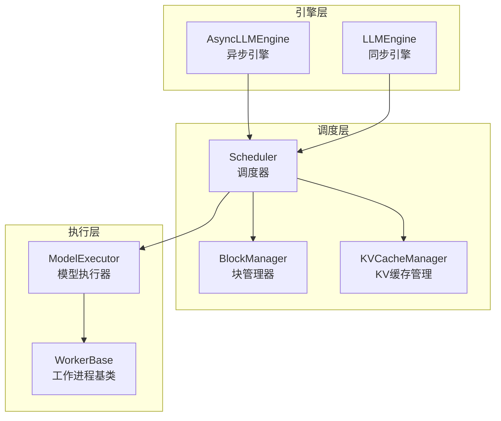
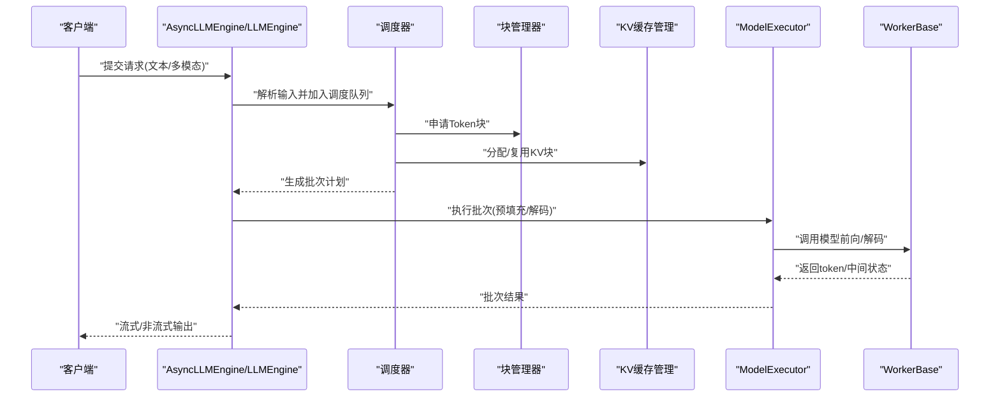
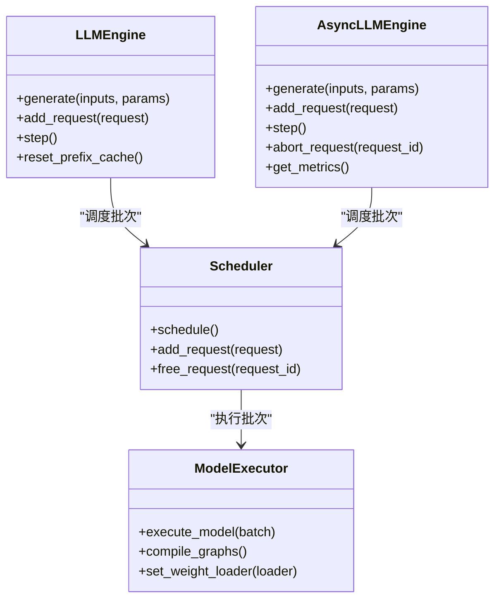
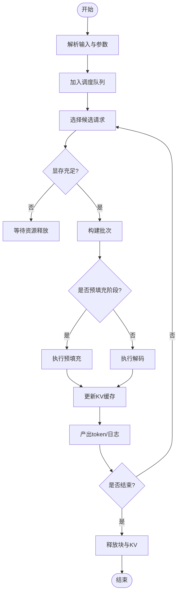
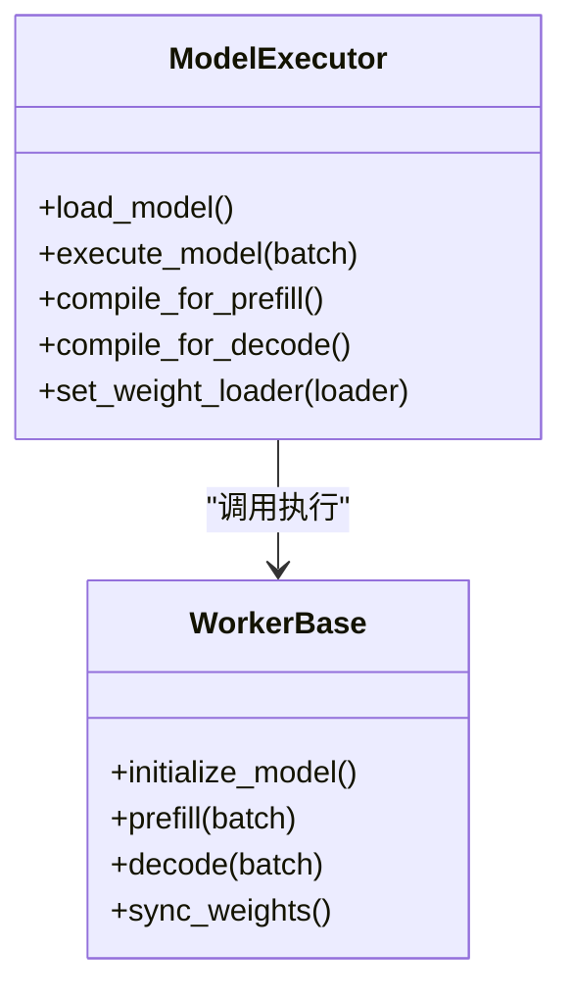
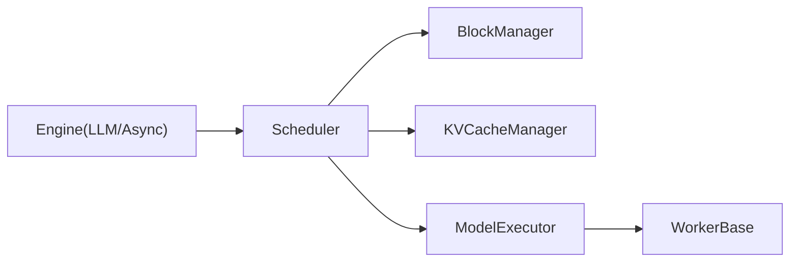

# 推理引擎架构

<cite>
**本文引用的文件**   
- [vllm/engine/async_llm_engine.py](file://vllm/engine/async_llm_engine.py)
- [vllm/engine/llm_engine.py](file://vllm/engine/llm_engine.py)
- [vllm/model_executor/model_executor.py](file://vllm/model_executor/model_executor.py)
- [vllm/model_executor/worker/worker_base.py](file://vllm/model_executor/worker/worker_base.py)
- [vllm/scheduler.py](file://vllm/scheduler.py)
- [vllm/core/block_manager.py](file://vllm/core/block_manager.py)
- [vllm/core/kv_cache_manager.py](file://vllm/core/kv_cache_manager.py)
- [vllm/inputs.py](file://vllm/inputs.py)
- [vllm/outputs.py](file://vllm/outputs.py)
- [examples/deployment/llm_engine_example.py](file://examples/deployment/llm_engine_example.py)
- [examples/deployment/async_llm_streaming.py](file://examples/deployment/async_llm_streaming.py)
</cite>

## 目录
1. [简介](#简介)
2. [项目结构](#项目结构)
3. [核心组件](#核心组件)
4. [架构总览](#架构总览)
5. [详细组件分析](#详细组件分析)
6. [依赖关系分析](#依赖关系分析)
7. [性能考量](#性能考量)
8. [故障排查指南](#故障排查指南)
9. [结论](#结论)
10. [附录](#附录)

## 简介
本文件面向希望深入理解 vLLM 推理引擎内部机制的读者，重点围绕 LLMEngine 与 AsyncLLMEngine 的核心设计、请求生命周期管理、调度策略与执行流程展开。同时，对 ModelExecutor 的模型加载、权重管理与计算图优化进行说明，并阐述异步处理机制（协程、并发控制、资源管理）与批处理策略（动态批处理、请求合并、内存优化）。文档包含架构图与关键 API 的使用示例路径，帮助读者快速上手与排障。

## 项目结构
vLLM 的推理引擎由“引擎层”“调度层”“执行层”三大部分组成：
- 引擎层：对外暴露同步与异步接口，负责请求生命周期管理、状态机推进与结果聚合。
- 调度层：实现动态批处理、请求合并、KV 缓存管理与块级内存分配。
- 执行层：封装模型加载、权重管理、CUDA Graph 优化与多进程/分布式执行。

图表来源
- [vllm/engine/async_llm_engine.py](file://vllm/engine/async_llm_engine.py)
- [vllm/engine/llm_engine.py](file://vllm/engine/llm_engine.py)
- [vllm/scheduler.py](file://vllm/scheduler.py)
- [vllm/core/block_manager.py](file://vllm/core/block_manager.py)
- [vllm/core/kv_cache_manager.py](file://vllm/core/kv_cache_manager.py)
- [vllm/model_executor/model_executor.py](file://vllm/model_executor/model_executor.py)
- [vllm/model_executor/worker/worker_base.py](file://vllm/model_executor/worker/worker_base.py)

章节来源
- [vllm/engine/async_llm_engine.py](file://vllm/engine/async_llm_engine.py)
- [vllm/engine/llm_engine.py](file://vllm/engine/llm_engine.py)
- [vllm/scheduler.py](file://vllm/scheduler.py)
- [vllm/core/block_manager.py](file://vllm/core/block_manager.py)
- [vllm/core/kv_cache_manager.py](file://vllm/core/kv_cache_manager.py)
- [vllm/model_executor/model_executor.py](file://vllm/model_executor/model_executor.py)
- [vllm/model_executor/worker/worker_base.py](file://vllm/model_executor/worker/worker_base.py)

## 核心组件
- LLMEngine：同步推理入口，封装请求生命周期、调度与执行调用，适合批量离线或简单在线场景。
- AsyncLLMEngine：基于协程的异步推理入口，支持流式输出、高并发与背压控制，适合在线服务。
- Scheduler：动态批处理与请求合并，维护就绪队列、运行中队列与完成队列，协调 KV 缓存与块分配。
- BlockManager/KVCacheManager：以块为单位管理 KV 缓存，支持前缀缓存、共享与回收。
- ModelExecutor：统一封装模型加载、权重分发、CUDA Graph 编译与执行，屏蔽底层 Worker 细节。
- WorkerBase：工作进程抽象，提供模型实例化、前向/解码执行与通信接口。

章节来源
- [vllm/engine/llm_engine.py](file://vllm/engine/llm_engine.py)
- [vllm/engine/async_llm_engine.py](file://vllm/engine/async_llm_engine.py)
- [vllm/scheduler.py](file://vllm/scheduler.py)
- [vllm/core/block_manager.py](file://vllm/core/block_manager.py)
- [vllm/core/kv_cache_manager.py](file://vllm/core/kv_cache_manager.py)
- [vllm/model_executor/model_executor.py](file://vllm/model_executor/model_executor.py)
- [vllm/model_executor/worker/worker_base.py](file://vllm/model_executor/worker/worker_base.py)

## 架构总览
下图展示从请求进入到结果返回的关键交互路径，包括输入解析、调度决策、执行与输出聚合。

图表来源
- [vllm/engine/async_llm_engine.py](file://vllm/engine/async_llm_engine.py)
- [vllm/engine/llm_engine.py](file://vllm/engine/llm_engine.py)
- [vllm/scheduler.py](file://vllm/scheduler.py)
- [vllm/core/block_manager.py](file://vllm/core/block_manager.py)
- [vllm/core/kv_cache_manager.py](file://vllm/core/kv_cache_manager.py)
- [vllm/model_executor/model_executor.py](file://vllm/model_executor/model_executor.py)
- [vllm/model_executor/worker/worker_base.py](file://vllm/model_executor/worker/worker_base.py)

## 详细组件分析

### LLMEngine 与 AsyncLLMEngine 设计与对比
- 职责边界
  - LLMEngine：同步阻塞式调用，适合脚本与批处理；内部通过调度器组织批次并等待执行完成。
  - AsyncLLMEngine：基于事件循环与协程，支持流式增量输出、取消与超时控制，适合高吞吐在线服务。
- 请求生命周期
  - 输入校验与标准化（文本/多模态）→ 创建请求对象 → 进入调度队列 → 批次构建 → 执行 → 结果聚合与回传。
- 并发与资源
  - AsyncLLMEngine 使用协程并发与背压控制，限制并发度以避免 OOM；LLMEngine 在单线程内串行推进批次。
- 典型 API 使用
  - 同步：参考示例路径 [examples/deployment/llm_engine_example.py](file://examples/deployment/llm_engine_example.py)
  - 异步：参考示例路径 [examples/deployment/async_llm_streaming.py](file://examples/deployment/async_llm_streaming.py)

图表来源
- [vllm/engine/llm_engine.py](file://vllm/engine/llm_engine.py)
- [vllm/engine/async_llm_engine.py](file://vllm/engine/async_llm_engine.py)
- [vllm/scheduler.py](file://vllm/scheduler.py)
- [vllm/model_executor/model_executor.py](file://vllm/model_executor/model_executor.py)

章节来源
- [vllm/engine/llm_engine.py](file://vllm/engine/llm_engine.py)
- [vllm/engine/async_llm_engine.py](file://vllm/engine/async_llm_engine.py)
- [examples/deployment/llm_engine_example.py](file://examples/deployment/llm_engine_example.py)
- [examples/deployment/async_llm_streaming.py](file://examples/deployment/async_llm_streaming.py)

### 调度器与批处理策略
- 动态批处理
  - 将不同长度、不同阶段的请求合并为批次，最大化 GPU 利用率。
  - 根据显存水位、延迟目标与吞吐目标调整批次大小。
- 请求合并与前缀缓存
  - 识别相同前缀的请求，复用已计算的 KV 块，减少重复计算。
- 内存优化
  - 块级分配与引用计数，避免碎片；按需释放已完成请求的块。
- 调度流程
  - 就绪队列选择候选请求 → 检查块与KV空间 → 构建批次 → 标记执行阶段（预填充/解码）→ 更新状态。

图表来源
- [vllm/scheduler.py](file://vllm/scheduler.py)
- [vllm/core/block_manager.py](file://vllm/core/block_manager.py)
- [vllm/core/kv_cache_manager.py](file://vllm/core/kv_cache_manager.py)

章节来源
- [vllm/scheduler.py](file://vllm/scheduler.py)
- [vllm/core/block_manager.py](file://vllm/core/block_manager.py)
- [vllm/core/kv_cache_manager.py](file://vllm/core/kv_cache_manager.py)

### ModelExecutor：模型加载、权重管理与计算图优化
- 模型加载
  - 从本地或远程权重源加载，支持分片与并行下载；按设备拓扑分发到各 Worker。
- 权重管理
  - 统一的权重加载器接口，支持量化、LoRA 与动态切换；维护权重版本与一致性。
- 计算图优化
  - 针对预填充与解码阶段分别编译 CUDA Graph，减少内核启动开销；支持形状固定与动态形状混合。
- 执行流程
  - 接收批次元数据与张量 → 选择后端（Attention/MLP/MoE）→ 调用 Worker 执行 → 收集结果并反序列化。

图表来源
- [vllm/model_executor/model_executor.py](file://vllm/model_executor/model_executor.py)
- [vllm/model_executor/worker/worker_base.py](file://vllm/model_executor/worker/worker_base.py)

章节来源
- [vllm/model_executor/model_executor.py](file://vllm/model_executor/model_executor.py)
- [vllm/model_executor/worker/worker_base.py](file://vllm/model_executor/worker/worker_base.py)

### 异步处理机制：协程、并发控制与资源管理
- 协程支持
  - 所有 I/O 与长耗时操作均基于协程，避免阻塞事件循环；支持流式增量返回。
- 并发控制
  - 通过信号量/队列限制并发请求数，防止 OOM；结合背压策略平滑突发流量。
- 资源管理
  - 请求级上下文隔离，确保 KV 块与临时张量的正确释放；异常时自动清理未完成任务。
- 典型用法
  - 参考异步流式示例路径 [examples/deployment/async_llm_streaming.py](file://examples/deployment/async_llm_streaming.py)

章节来源
- [vllm/engine/async_llm_engine.py](file://vllm/engine/async_llm_engine.py)
- [examples/deployment/async_llm_streaming.py](file://examples/deployment/async_llm_streaming.py)

### 输入与输出模型
- 输入模型
  - 统一表示文本与多模态输入，包含 token 序列、位置编码、注意力掩码与可选图像/音频特征。
- 输出模型
  - 结构化输出包含 token、logprobs、采样参数应用结果与停止原因；支持流式片段与完整响应。

章节来源
- [vllm/inputs.py](file://vllm/inputs.py)
- [vllm/outputs.py](file://vllm/outputs.py)

## 依赖关系分析
- 组件耦合
  - 引擎层依赖调度器与执行器；调度器依赖块管理与 KV 缓存管理；执行器依赖工作进程。
- 外部依赖
  - CUDA/CUDNN/Triton 等加速库；分布式通信（NCCL/Ray）用于多卡/多节点扩展。
- 潜在循环依赖
  - 通过接口解耦（如 WorkerBase 抽象），避免直接循环导入。

图表来源
- [vllm/engine/llm_engine.py](file://vllm/engine/llm_engine.py)
- [vllm/engine/async_llm_engine.py](file://vllm/engine/async_llm_engine.py)
- [vllm/scheduler.py](file://vllm/scheduler.py)
- [vllm/core/block_manager.py](file://vllm/core/block_manager.py)
- [vllm/core/kv_cache_manager.py](file://vllm/core/kv_cache_manager.py)
- [vllm/model_executor/model_executor.py](file://vllm/model_executor/model_executor.py)
- [vllm/model_executor/worker/worker_base.py](file://vllm/model_executor/worker/worker_base.py)

章节来源
- [vllm/engine/llm_engine.py](file://vllm/engine/llm_engine.py)
- [vllm/engine/async_llm_engine.py](file://vllm/engine/async_llm_engine.py)
- [vllm/scheduler.py](file://vllm/scheduler.py)
- [vllm/core/block_manager.py](file://vllm/core/block_manager.py)
- [vllm/core/kv_cache_manager.py](file://vllm/core/kv_cache_manager.py)
- [vllm/model_executor/model_executor.py](file://vllm/model_executor/model_executor.py)
- [vllm/model_executor/worker/worker_base.py](file://vllm/model_executor/worker/worker_base.py)

## 性能考量
- 批大小调优
  - 根据延迟与吞吐目标动态调整批次大小，平衡 GPU 利用率与首字延迟。
- 前缀缓存
  - 启用 KV 前缀缓存以减少重复计算，提升多轮对话与相似提示的吞吐。
- CUDA Graph
  - 预编译常用形状的计算图，降低内核启动开销，提高解码阶段稳定性。
- 内存管理
  - 块级分配与引用计数，避免碎片；及时释放已完成请求的资源。
- 量化与融合
  - 使用量化算子与融合内核（如 QKNorm、Fused MoE）减少内存带宽压力。

[本节为通用指导，不直接分析具体文件]

## 故障排查指南
- 常见错误
  - OOM：检查批次大小、KV 缓存上限与块分配策略；适当降低并发或增大显存配额。
  - 死锁/卡顿：确认协程未阻塞事件循环；检查背压与队列长度。
  - 权重不一致：确保权重加载器版本一致，必要时重置模型或重新加载权重。
- 诊断步骤
  - 查看调度器日志与指标（队列长度、批次大小、显存水位）。
  - 检查 Worker 健康状态与通信链路（NCCL/Ray）。
  - 使用最小可复现用例定位问题（缩短序列、关闭前缀缓存）。

章节来源
- [vllm/scheduler.py](file://vllm/scheduler.py)
- [vllm/model_executor/model_executor.py](file://vllm/model_executor/model_executor.py)
- [vllm/model_executor/worker/worker_base.py](file://vllm/model_executor/worker/worker_base.py)

## 结论
vLLM 推理引擎通过清晰的三层架构（引擎/调度/执行）实现了高性能、可扩展的大模型推理。LLMEngine 与 AsyncLLMEngine 分别满足同步与异步场景需求；调度器与内存管理器协同实现动态批处理与前缀缓存；ModelExecutor 统一封装模型加载与计算图优化。合理配置批大小、KV 缓存与并发度，可在保证低延迟的同时获得高吞吐。

[本节为总结性内容，不直接分析具体文件]

## 附录
- 关键 API 使用示例路径
  - 同步引擎：[examples/deployment/llm_engine_example.py](file://examples/deployment/llm_engine_example.py)
  - 异步流式：[examples/deployment/async_llm_streaming.py](file://examples/deployment/async_llm_streaming.py)
- 相关数据结构
  - 输入模型：[vllm/inputs.py](file://vllm/inputs.py)
  - 输出模型：[vllm/outputs.py](file://vllm/outputs.py)

[本节为补充信息，不直接分析具体文件]