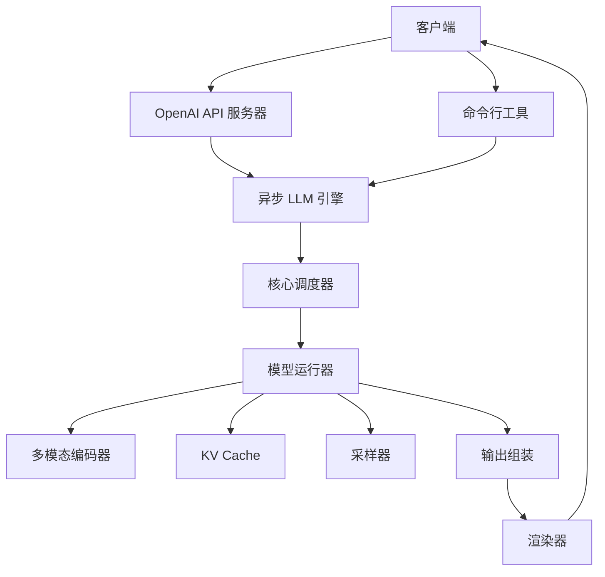
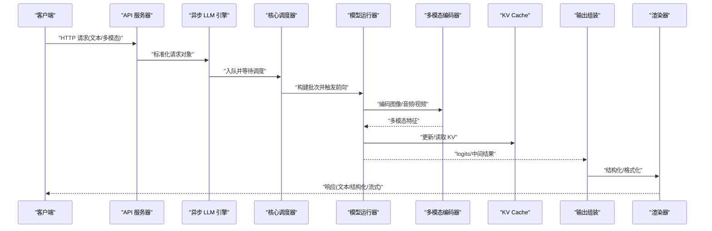
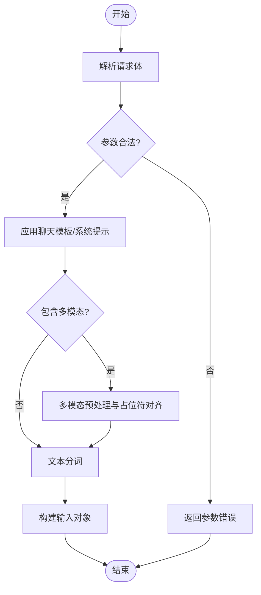
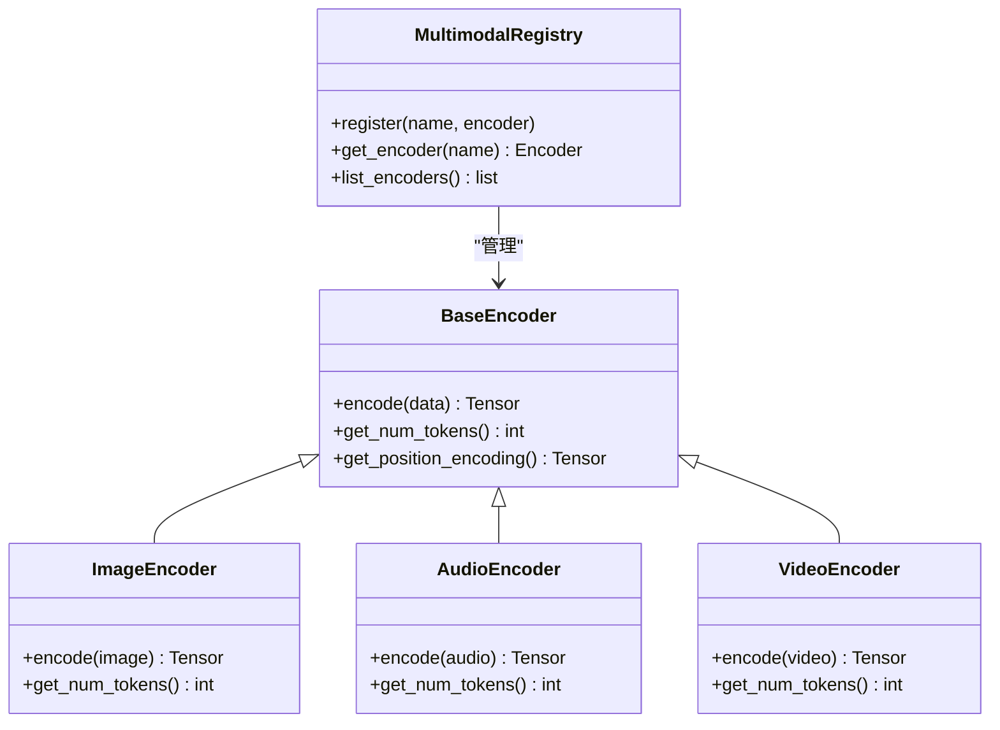
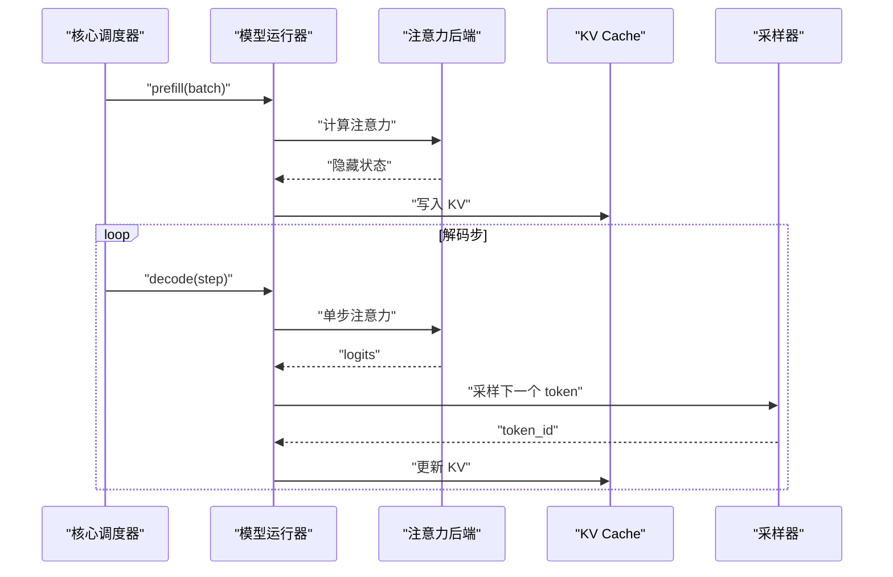
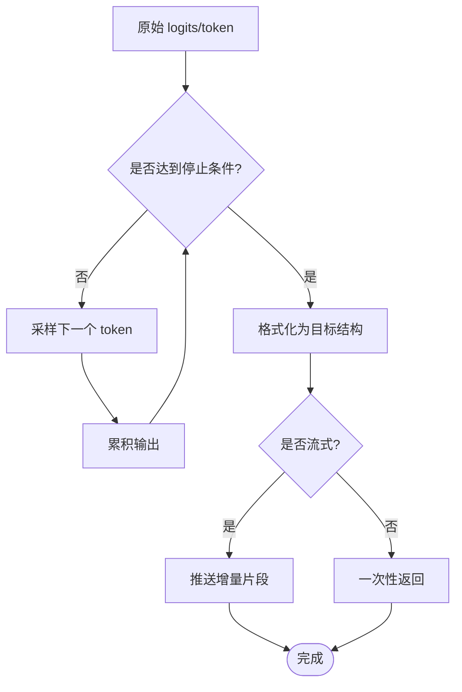
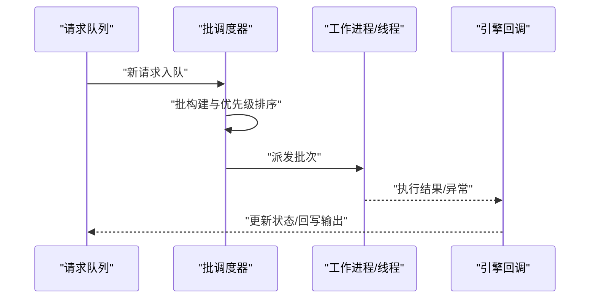
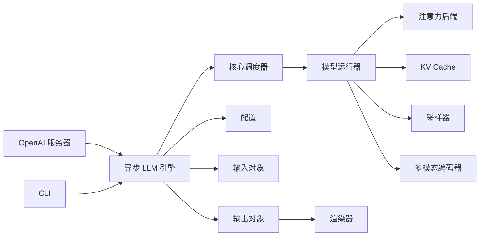

# 数据流与处理管道

<cite>
**本文引用的文件**   
- [vllm/engine/async_llm_engine.py](file://vllm/engine/async_llm_engine.py)
- [vllm/engine/core.py](file://vllm/engine/core.py)
- [vllm/model_executor/model_runner.py](file://vllm/model_executor/model_runner.py)
- [vllm/multimodal/registry.py](file://vllm/multimodal/registry.py)
- [vllm/multimodal/base.py](file://vllm/multimodal/base.py)
- [vllm/renderers/__init__.py](file://vllm/renderers/__init__.py)
- [vllm/renderers/base.py](file://vllm/renderers/base.py)
- [vllm/inputs.py](file://vllm/inputs.py)
- [vllm/outputs.py](file://vllm/outputs.py)
- [vllm/sampling_params.py](file://vllm/sampling_params.py)
- [vllm/sequence.py](file://vllm/sequence.py)
- [vllm/config.py](file://vllm/config.py)
- [vllm/entrypoints/openai/api_server.py](file://vllm/entrypoints/openai/api_server.py)
- [vllm/entrypoints/generate/cli.py](file://vllm/entrypoints/generate/cli.py)
- [benchmarks/benchmark_serving.py](file://benchmarks/benchmark_serving.py)
</cite>

## 目录
1. [简介](#简介)
2. [项目结构](#项目结构)
3. [核心组件](#核心组件)
4. [架构总览](#架构总览)
5. [详细组件分析](#详细组件分析)
6. [依赖关系分析](#依赖关系分析)
7. [性能考量](#性能考量)
8. [故障排查指南](#故障排查指南)
9. [结论](#结论)
10. [附录](#附录)

## 简介
本文件系统性阐述 vLLM 的数据流与处理管道，覆盖从用户输入到模型输出的完整链路：文本预处理、tokenization、多模态编码与融合、模型推理（预填充与解码）、后处理与渲染器输出。同时解释异步处理管道的设计要点（缓冲、流水线执行、错误处理），并提供数据流图与时序图辅助理解。文末给出性能优化技巧与常见问题排查方法，帮助读者在生产环境中高效调优与排障。

## 项目结构
vLLM 将“请求接入—调度—执行—输出”解耦为多个模块：
- 入口层：OpenAI API Server、CLI 生成等负责接收请求与参数解析
- 引擎层：异步 LLM 引擎与核心调度器管理请求队列、批处理与生命周期
- 执行层：模型运行器封装注意力、KV Cache、采样器等底层计算
- 多模态层：图像/音频/视频编码器注册与特征融合
- 渲染层：结构化输出与格式转换
- 配置与协议：输入/输出数据结构、采样参数、序列状态等

图表来源
- [vllm/entrypoints/openai/api_server.py:1-200](file://vllm/entrypoints/openai/api_server.py#L1-L200)
- [vllm/entrypoints/generate/cli.py:1-150](file://vllm/entrypoints/generate/cli.py#L1-L150)
- [vllm/engine/async_llm_engine.py:1-200](file://vllm/engine/async_llm_engine.py#L1-L200)
- [vllm/engine/core.py:1-200](file://vllm/engine/core.py#L1-L200)
- [vllm/model_executor/model_runner.py:1-200](file://vllm/model_executor/model_runner.py#L1-L200)
- [vllm/multimodal/registry.py:1-150](file://vllm/multimodal/registry.py#L1-L150)
- [vllm/renderers/__init__.py:1-100](file://vllm/renderers/__init__.py#L1-L100)

章节来源
- [vllm/entrypoints/openai/api_server.py:1-200](file://vllm/entrypoints/openai/api_server.py#L1-L200)
- [vllm/entrypoints/generate/cli.py:1-150](file://vllm/entrypoints/generate/cli.py#L1-L150)
- [vllm/engine/async_llm_engine.py:1-200](file://vllm/engine/async_llm_engine.py#L1-L200)
- [vllm/engine/core.py:1-200](file://vllm/engine/core.py#L1-L200)
- [vllm/model_executor/model_runner.py:1-200](file://vllm/model_executor/model_runner.py#L1-L200)
- [vllm/multimodal/registry.py:1-150](file://vllm/multimodal/registry.py#L1-L150)
- [vllm/renderers/__init__.py:1-100](file://vllm/renderers/__init__.py#L1-L100)

## 核心组件
- 异步 LLM 引擎：对外暴露异步接口，负责请求入队、批调度、结果回传与流式输出
- 核心调度器：维护请求状态机、批次构建、资源分配与并发控制
- 模型运行器：封装前向计算、KV Cache 管理、注意力后端选择、采样策略
- 多模态注册表与基类：统一图像/音频/视频编码器接口与融合策略
- 渲染器：将模型原始输出转换为结构化格式（如 JSON Schema、工具调用）
- 输入/输出与采样参数：标准化请求体、响应体与采样行为

章节来源
- [vllm/engine/async_llm_engine.py:1-200](file://vllm/engine/async_llm_engine.py#L1-L200)
- [vllm/engine/core.py:1-200](file://vllm/engine/core.py#L1-L200)
- [vllm/model_executor/model_runner.py:1-200](file://vllm/model_executor/model_runner.py#L1-L200)
- [vllm/multimodal/registry.py:1-150](file://vllm/multimodal/registry.py#L1-L150)
- [vllm/multimodal/base.py:1-150](file://vllm/multimodal/base.py#L1-L150)
- [vllm/renderers/__init__.py:1-100](file://vllm/renderers/__init__.py#L1-L100)
- [vllm/renderers/base.py:1-150](file://vllm/renderers/base.py#L1-L150)
- [vllm/inputs.py:1-200](file://vllm/inputs.py#L1-L200)
- [vllm/outputs.py:1-200](file://vllm/outputs.py#L1-L200)
- [vllm/sampling_params.py:1-200](file://vllm/sampling_params.py#L1-L200)
- [vllm/sequence.py:1-200](file://vllm/sequence.py#L1-L200)

## 架构总览
下图展示端到端数据流：从请求进入引擎，经预处理、tokenization、多模态编码、模型推理、采样与后处理，最终由渲染器输出。

图表来源
- [vllm/entrypoints/openai/api_server.py:1-200](file://vllm/entrypoints/openai/api_server.py#L1-L200)
- [vllm/engine/async_llm_engine.py:1-200](file://vllm/engine/async_llm_engine.py#L1-L200)
- [vllm/engine/core.py:1-200](file://vllm/engine/core.py#L1-L200)
- [vllm/model_executor/model_runner.py:1-200](file://vllm/model_executor/model_runner.py#L1-L200)
- [vllm/multimodal/registry.py:1-150](file://vllm/multimodal/registry.py#L1-L150)
- [vllm/renderers/__init__.py:1-100](file://vllm/renderers/__init__.py#L1-L100)

## 详细组件分析

### 请求接入与预处理
- 入口层将不同来源的请求（OpenAI、CLI、批量基准）统一转换为内部输入对象
- 预处理阶段完成提示词模板拼接、系统消息注入、工具调用标记、停止词与最大长度校验
- 多模态字段校验与占位符对齐（例如图像 token 数量与位置嵌入）

图表来源
- [vllm/entrypoints/openai/api_server.py:1-200](file://vllm/entrypoints/openai/api_server.py#L1-L200)
- [vllm/entrypoints/generate/cli.py:1-150](file://vllm/entrypoints/generate/cli.py#L1-L150)
- [vllm/inputs.py:1-200](file://vllm/inputs.py#L1-L200)

章节来源
- [vllm/entrypoints/openai/api_server.py:1-200](file://vllm/entrypoints/openai/api_server.py#L1-L200)
- [vllm/entrypoints/generate/cli.py:1-150](file://vllm/entrypoints/generate/cli.py#L1-L150)
- [vllm/inputs.py:1-200](file://vllm/inputs.py#L1-L200)

### Tokenization 与输入对象
- 文本通过 tokenizer 转为 token IDs；多模态在占位符处插入对应数量的特殊 token
- 输入对象携带 prompt_ids、multi_modal_inputs、sampling_params、request_id 等元信息
- 支持 prefix caching 的键生成与复用

章节来源
- [vllm/inputs.py:1-200](file://vllm/inputs.py#L1-200)
- [vllm/sequence.py:1-200](file://vllm/sequence.py#L1-200)

### 多模态数据处理与融合
- 注册表集中管理各模态编码器（图像、音频、视频），提供统一的 encode 接口
- 基类定义特征维度、位置编码、时间轴处理等通用能力
- 融合阶段将视觉/语音特征与文本 token 对齐，生成跨模态上下文

图表来源
- [vllm/multimodal/registry.py:1-150](file://vllm/multimodal/registry.py#L1-L150)
- [vllm/multimodal/base.py:1-150](file://vllm/multimodal/base.py#L1-L150)

章节来源
- [vllm/multimodal/registry.py:1-150](file://vllm/multimodal/registry.py#L1-L150)
- [vllm/multimodal/base.py:1-150](file://vllm/multimodal/base.py#L1-L150)

### 模型推理与 KV Cache
- 模型运行器负责前向计算、注意力后端选择、CUDA Graph 与编译优化
- KV Cache 管理增量解码时的键值缓存，支持分页与压缩
- 采样器根据 sampling_params 进行 top-k/top-p/温度/重复惩罚等策略

图表来源
- [vllm/model_executor/model_runner.py:1-200](file://vllm/model_executor/model_runner.py#L1-L200)
- [vllm/sampling_params.py:1-200](file://vllm/sampling_params.py#L1-200)

章节来源
- [vllm/model_executor/model_runner.py:1-200](file://vllm/model_executor/model_runner.py#L1-L200)
- [vllm/sampling_params.py:1-200](file://vllm/sampling_params.py#L1-200)

### 后处理与渲染器
- 输出组装阶段聚合 token 序列、logprobs、停止原因、耗时统计等
- 渲染器将原始输出转换为结构化格式（JSON Schema、函数调用、表格等）
- 支持流式输出，逐步推送增量片段

图表来源
- [vllm/outputs.py:1-200](file://vllm/outputs.py#L1-200)
- [vllm/renderers/__init__.py:1-100](file://vllm/renderers/__init__.py#L1-100)
- [vllm/renderers/base.py:1-150](file://vllm/renderers/base.py#L1-150)

章节来源
- [vllm/outputs.py:1-200](file://vllm/outputs.py#L1-200)
- [vllm/renderers/__init__.py:1-100](file://vllm/renderers/__init__.py#L1-100)
- [vllm/renderers/base.py:1-150](file://vllm/renderers/base.py#L1-150)

### 异步处理管道设计
- 引擎使用队列与事件驱动机制实现高吞吐与低延迟
- 批调度器按可用资源动态合并请求，最大化 GPU 利用率
- 错误处理采用可恢复异常与重试策略，保证服务稳定性

图表来源
- [vllm/engine/async_llm_engine.py:1-200](file://vllm/engine/async_llm_engine.py#L1-L200)
- [vllm/engine/core.py:1-200](file://vllm/engine/core.py#L1-L200)

章节来源
- [vllm/engine/async_llm_engine.py:1-200](file://vllm/engine/async_llm_engine.py#L1-L200)
- [vllm/engine/core.py:1-200](file://vllm/engine/core.py#L1-L200)

## 依赖关系分析
- 入口层依赖引擎与配置；引擎依赖核心调度器与模型运行器
- 模型运行器依赖注意力后端、KV Cache、采样器与多模态编码器
- 渲染器依赖输出组装与结构化约束（如 JSON Schema）

图表来源
- [vllm/entrypoints/openai/api_server.py:1-200](file://vllm/entrypoints/openai/api_server.py#L1-L200)
- [vllm/entrypoints/generate/cli.py:1-150](file://vllm/entrypoints/generate/cli.py#L1-L150)
- [vllm/engine/async_llm_engine.py:1-200](file://vllm/engine/async_llm_engine.py#L1-L200)
- [vllm/engine/core.py:1-200](file://vllm/engine/core.py#L1-L200)
- [vllm/model_executor/model_runner.py:1-200](file://vllm/model_executor/model_runner.py#L1-L200)
- [vllm/config.py:1-200](file://vllm/config.py#L1-200)
- [vllm/inputs.py:1-200](file://vllm/inputs.py#L1-200)
- [vllm/outputs.py:1-200](file://vllm/outputs.py#L1-200)
- [vllm/renderers/__init__.py:1-100](file://vllm/renderers/__init__.py#L1-100)

章节来源
- [vllm/config.py:1-200](file://vllm/config.py#L1-200)
- [vllm/inputs.py:1-200](file://vllm/inputs.py#L1-200)
- [vllm/outputs.py:1-200](file://vllm/outputs.py#L1-200)

## 性能考量
- 批大小与并行度：根据 GPU 内存与延迟目标动态调整批大小，避免频繁重编译
- KV Cache 管理：启用分页与压缩，减少显存碎片与拷贝开销
- 注意力后端：优先选择高性能后端（如 FlashAttention），结合 CUDA Graph 降低启动开销
- 多模态编码：对图像/音频进行批处理与共享特征缓存，减少重复计算
- 采样策略：合理设置 top-k/top-p/温度，平衡质量与速度
- 流式输出：按需推送增量，降低首字延迟
- 监控与基准：使用内置基准脚本评估吞吐与延迟，定位瓶颈

章节来源
- [benchmarks/benchmark_serving.py:1-200](file://benchmarks/benchmark_serving.py#L1-200)
- [vllm/model_executor/model_runner.py:1-200](file://vllm/model_executor/model_runner.py#L1-200)
- [vllm/sampling_params.py:1-200](file://vllm/sampling_params.py#L1-200)

## 故障排查指南
- 参数错误：检查输入对象字段、多模态占位符数量与类型一致性
- 显存不足：降低批大小、启用 KV 压缩或切换更低精度
- 长尾延迟：观察批构建频率与采样策略，必要时开启预热与缓存
- 多模态对齐失败：确认编码器注册与特征维度匹配，检查位置编码
- 渲染失败：验证结构化约束与输出格式，查看日志中的解析错误
- 异步阻塞：检查队列长度与工作进程状态，适当增加并发或超时

章节来源
- [vllm/inputs.py:1-200](file://vllm/inputs.py#L1-200)
- [vllm/multimodal/registry.py:1-150](file://vllm/multimodal/registry.py#L1-L150)
- [vllm/renderers/__init__.py:1-100](file://vllm/renderers/__init__.py#L1-100)
- [vllm/engine/async_llm_engine.py:1-200](file://vllm/engine/async_llm_engine.py#L1-L200)

## 结论
vLLM 的数据流与处理管道以模块化与异步化为核心，实现了从多模态输入到结构化输出的高效链路。通过合理的批调度、KV Cache 管理与渲染器输出，系统在吞吐与延迟之间取得良好平衡。生产部署中应结合监控与基准持续优化，确保稳定与高性能。

## 附录
- 术语表：预填充（Prefill）、解码（Decode）、KV Cache、注意力后端、采样器、渲染器
- 参考文档：配置项说明、环境变量、部署指南与示例