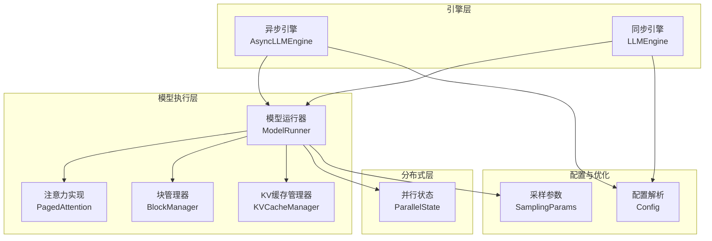
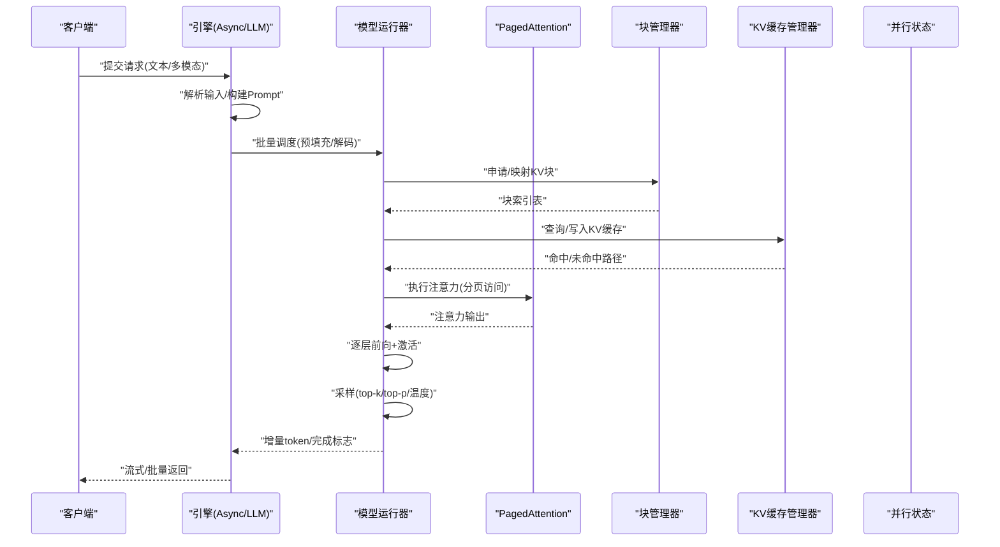
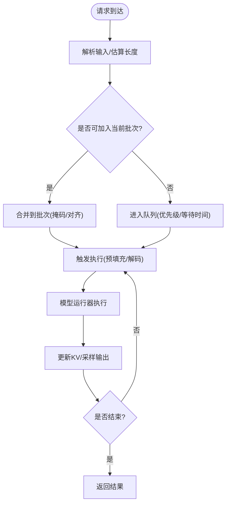
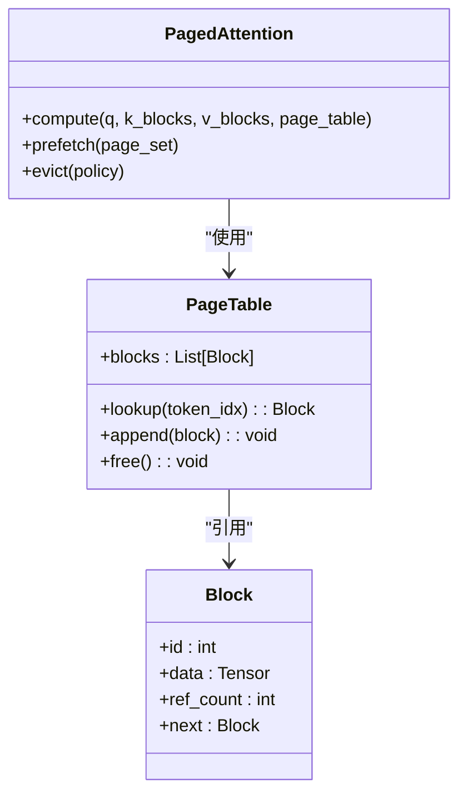
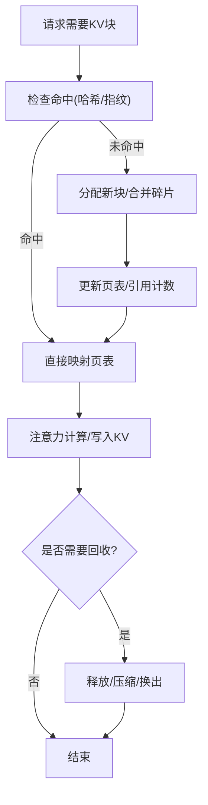
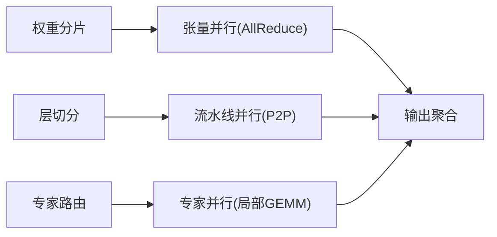
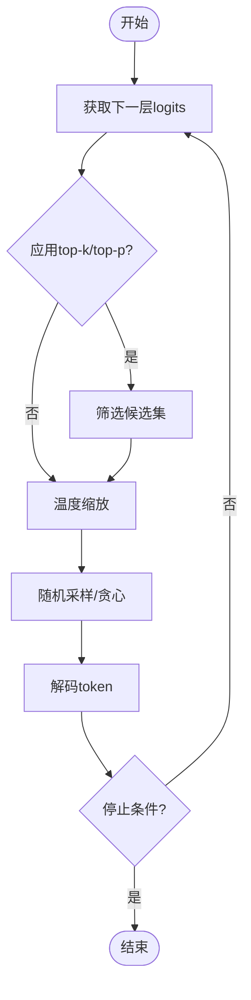
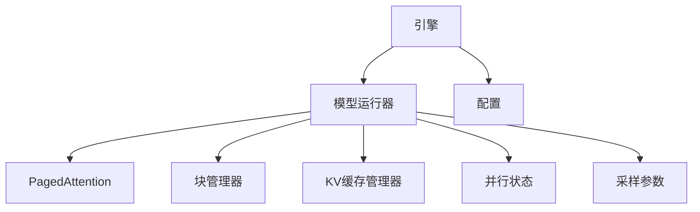

# 核心概念

<cite>
**本文引用的文件**   
- [README.md](file://README.md)
- [vllm/engine/async_llm_engine.py](file://vllm/engine/async_llm_engine.py)
- [vllm/engine/llm_engine.py](file://vllm/engine/llm_engine.py)
- [vllm/model_executor/model_runner.py](file://vllm/model_executor/model_runner.py)
- [vllm/core/block_manager.py](file://vllm/core/block_manager.py)
- [vllm/core/kv_cache_manager.py](file://vllm/core/kv_cache_manager.py)
- [vllm/sampling_params.py](file://vllm/sampling_params.py)
- [vllm/config.py](file://vllm/config.py)
- [vllm/distributed/parallel_state.py](file://vllm/distributed/parallel_state.py)
- [vllm/model_executor/layers/attention/paged_attention.py](file://vllm/model_executor/layers/attention/paged_attention.py)
- [vllm/model_executor/layers/attention/__init__.py](file://vllm/model_executor/layers/attention/__init__.py)
- [docs/design/paged_attention.md](file://docs/design/paged_attention.md)
- [docs/design/hybrid_kv_cache_manager.md](file://docs/design/hybrid_kv_cache_manager.md)
- [docs/design/prefix_caching.md](file://docs/design/prefix_caching.md)
- [docs/design/multiprocessing.md](file://docs/design/multiprocessing.md)
- [docs/design/attention_backends.md](file://docs/design/attention_backends.md)
- [docs/design/optimization_levels.md](file://docs/design/optimization_levels.md)
- [benchmarks/benchmark_serving.py](file://benchmarks/benchmark_serving.py)
</cite>

## 目录
1. [引言](#引言)
2. [项目结构](#项目结构)
3. [核心组件](#核心组件)
4. [架构总览](#架构总览)
5. [详细组件分析](#详细组件分析)
6. [依赖关系分析](#依赖关系分析)
7. [性能考量](#性能考量)
8. [故障排查指南](#故障排查指南)
9. [结论](#结论)
10. [附录：配置参数与最佳实践](#附录配置参数与最佳实践)

## 引言
本文件系统性阐述 vLLM 的核心概念与架构原理，重点覆盖推理引擎工作机制（请求调度、批处理策略、内存管理）、PagedAttention 技术与 KV 缓存机制、并行计算策略（张量并行、流水线并行、专家并行）、采样算法与生成策略（top-k、top-p、温度调节），并通过架构图与数据流图说明各组件交互。内容面向不同技术背景的读者，力求在保持严谨的同时易于理解。

## 项目结构
vLLM 采用分层模块化设计：
- 引擎层：对外暴露 LLM 推理接口，负责请求接入、调度、生命周期管理与结果聚合。
- 模型执行层：封装模型前向、注意力实现、KV 缓存读写、采样等核心逻辑。
- 分布式层：提供张量并行、流水线并行、专家并行的通信与状态同步。
- 配置与优化层：统一参数解析、编译优化、后端选择与运行时调优。
- 文档与基准：设计文档、使用示例与性能基准工具。

图表来源 
- [vllm/engine/async_llm_engine.py](file://vllm/engine/async_llm_engine.py)
- [vllm/engine/llm_engine.py](file://vllm/engine/llm_engine.py)
- [vllm/model_executor/model_runner.py](file://vllm/model_executor/model_runner.py)
- [vllm/model_executor/layers/attention/paged_attention.py](file://vllm/model_executor/layers/attention/paged_attention.py)
- [vllm/core/block_manager.py](file://vllm/core/block_manager.py)
- [vllm/core/kv_cache_manager.py](file://vllm/core/kv_cache_manager.py)
- [vllm/distributed/parallel_state.py](file://vllm/distributed/parallel_state.py)
- [vllm/config.py](file://vllm/config.py)
- [vllm/sampling_params.py](file://vllm/sampling_params.py)

章节来源
- [README.md](file://README.md)

## 核心组件
- 引擎（Engine）：封装请求生命周期、调度策略与批处理编排，支持同步与异步两种调用方式。
- 模型运行器（ModelRunner）：组织模型前向、注意力计算、KV 缓存更新与采样输出。
- 块管理器（BlockManager）：以“块”为单位管理 KV 缓存的分配、合并与回收，避免碎片化。
- KV 缓存管理器（KVCacheManager）：维护全局 KV 缓存布局、命中策略与跨会话复用（如前缀缓存）。
- 并行状态（ParallelState）：维护张量并行、流水线并行、专家并行的进程/设备拓扑与通信原语。
- 注意力实现（PagedAttention）：基于分页的注意力内核，结合块级索引高效访问非连续 KV。
- 采样参数（SamplingParams）：定义 top-k、top-p、温度、重复惩罚等生成控制参数。
- 配置（Config）：集中管理硬件、模型、编译与运行时参数。

章节来源
- [vllm/engine/async_llm_engine.py](file://vllm/engine/async_llm_engine.py)
- [vllm/engine/llm_engine.py](file://vllm/engine/llm_engine.py)
- [vllm/model_executor/model_runner.py](file://vllm/model_executor/model_runner.py)
- [vllm/core/block_manager.py](file://vllm/core/block_manager.py)
- [vllm/core/kv_cache_manager.py](file://vllm/core/kv_cache_manager.py)
- [vllm/distributed/parallel_state.py](file://vllm/distributed/parallel_state.py)
- [vllm/model_executor/layers/attention/paged_attention.py](file://vllm/model_executor/layers/attention/paged_attention.py)
- [vllm/sampling_params.py](file://vllm/sampling_params.py)
- [vllm/config.py](file://vllm/config.py)

## 架构总览
vLLM 的推理流程围绕“请求进入—调度—批处理—注意力与KV更新—采样—返回”展开。引擎将多个请求打包为批次，模型运行器按层执行，利用 PagedAttention 高效读取 KV 缓存，最终通过采样策略生成 token 序列。

图表来源 
- [vllm/engine/async_llm_engine.py](file://vllm/engine/async_llm_engine.py)
- [vllm/engine/llm_engine.py](file://vllm/engine/llm_engine.py)
- [vllm/model_executor/model_runner.py](file://vllm/model_executor/model_runner.py)
- [vllm/model_executor/layers/attention/paged_attention.py](file://vllm/model_executor/layers/attention/paged_attention.py)
- [vllm/core/block_manager.py](file://vllm/core/block_manager.py)
- [vllm/core/kv_cache_manager.py](file://vllm/core/kv_cache_manager.py)

## 详细组件分析

### 请求调度与批处理策略
- 调度目标：最大化吞吐同时保证时延可控，动态合并短长上下文请求，避免批次内形状差异过大。
- 批处理策略：
  - 预填充阶段：按 prompt 长度分桶，尽量同形批处理；必要时拆分或延迟。
  - 解码阶段：按剩余步数与优先级排序，优先满足低时延请求。
  - 混合批：允许不同长度的请求共存，借助掩码与分页访问降低开销。
- 资源约束：GPU 显存上限、KV 块池大小、通信带宽限制。

章节来源
- [vllm/engine/async_llm_engine.py](file://vllm/engine/async_llm_engine.py)
- [vllm/engine/llm_engine.py](file://vllm/engine/llm_engine.py)
- [vllm/model_executor/model_runner.py](file://vllm/model_executor/model_runner.py)

### PagedAttention 技术与内存优化
- 核心思想：将 KV 张量切分为固定大小的块，通过页表索引访问，避免连续大数组带来的碎片与拷贝。
- 优势：
  - 减少显存碎片，提升利用率。
  - 支持跨请求共享与复用（前缀缓存）。
  - 与 CUDA/Triton 内核融合，降低访存开销。
- 实现要点：
  - 块大小与对齐策略。
  - 页表维护与失效处理。
  - 与注意力内核的联合优化（如 FlashAttention 集成）。

图表来源 
- [vllm/model_executor/layers/attention/paged_attention.py](file://vllm/model_executor/layers/attention/paged_attention.py)
- [vllm/core/block_manager.py](file://vllm/core/block_manager.py)

章节来源
- [docs/design/paged_attention.md](file://docs/design/paged_attention.md)
- [vllm/model_executor/layers/attention/paged_attention.py](file://vllm/model_executor/layers/attention/paged_attention.py)
- [vllm/core/block_manager.py](file://vllm/core/block_manager.py)

### KV 缓存工作原理（分配、管理与回收）
- 分配：按块粒度分配，支持按需扩展与合并相邻块。
- 管理：维护块引用计数、LRU/LFU 策略、跨会话前缀缓存命中。
- 回收：当引用计数归零或达到阈值时释放，必要时触发压缩或换出。
- 前缀缓存：对相同前缀的请求复用已计算的 KV，显著降低重复计算。

图表来源 
- [vllm/core/block_manager.py](file://vllm/core/block_manager.py)
- [vllm/core/kv_cache_manager.py](file://vllm/core/kv_cache_manager.py)
- [docs/design/hybrid_kv_cache_manager.md](file://docs/design/hybrid_kv_cache_manager.md)
- [docs/design/prefix_caching.md](file://docs/design/prefix_caching.md)

章节来源
- [vllm/core/block_manager.py](file://vllm/core/block_manager.py)
- [vllm/core/kv_cache_manager.py](file://vllm/core/kv_cache_manager.py)
- [docs/design/hybrid_kv_cache_manager.md](file://docs/design/hybrid_kv_cache_manager.md)
- [docs/design/prefix_caching.md](file://docs/design/prefix_caching.md)

### 并行计算策略（张量并行、流水线并行、专家并行）
- 张量并行（TP）：将权重与中间激活沿维度切分，跨 GPU 进行 AllReduce/Gather 通信。
- 流水线并行（PP）：将模型层切分到不同设备，流水线式推进批次，减少空闲。
- 专家并行（EP）：MoE 场景下按专家路由，局部计算与通信融合，降低负载不均。
- 协同：TP+PP+EP 组合需考虑拓扑、通信开销与负载均衡。

图表来源 
- [vllm/distributed/parallel_state.py](file://vllm/distributed/parallel_state.py)
- [docs/design/attention_backends.md](file://docs/design/attention_backends.md)

章节来源
- [vllm/distributed/parallel_state.py](file://vllm/distributed/parallel_state.py)
- [docs/design/attention_backends.md](file://docs/design/attention_backends.md)

### 采样算法与生成策略
- 参数：
  - top-k：仅从概率最高的 k 个 token 中采样。
  - top-p（核采样）：累积概率达到 p 的最小集合中采样。
  - 温度（temperature）：缩放 logits 分布，控制随机性。
  - 重复惩罚/频率惩罚：抑制重复与鼓励多样性。
- 流程：logits 处理 → 过滤/缩放 → 采样 → 解码 → 停止条件判断。

图表来源 
- [vllm/sampling_params.py](file://vllm/sampling_params.py)
- [vllm/model_executor/model_runner.py](file://vllm/model_executor/model_runner.py)

章节来源
- [vllm/sampling_params.py](file://vllm/sampling_params.py)
- [vllm/model_executor/model_runner.py](file://vllm/model_executor/model_runner.py)

## 依赖关系分析
- 引擎依赖模型运行器进行实际计算；模型运行器依赖注意力实现、块管理器与 KV 缓存管理器。
- 并行状态贯穿所有分布式组件，确保通信一致性与拓扑正确。
- 配置与采样参数影响运行时行为与性能特征。

图表来源 
- [vllm/engine/async_llm_engine.py](file://vllm/engine/async_llm_engine.py)
- [vllm/engine/llm_engine.py](file://vllm/engine/llm_engine.py)
- [vllm/model_executor/model_runner.py](file://vllm/model_executor/model_runner.py)
- [vllm/model_executor/layers/attention/paged_attention.py](file://vllm/model_executor/layers/attention/paged_attention.py)
- [vllm/core/block_manager.py](file://vllm/core/block_manager.py)
- [vllm/core/kv_cache_manager.py](file://vllm/core/kv_cache_manager.py)
- [vllm/distributed/parallel_state.py](file://vllm/distributed/parallel_state.py)
- [vllm/config.py](file://vllm/config.py)
- [vllm/sampling_params.py](file://vllm/sampling_params.py)

章节来源
- [vllm/engine/async_llm_engine.py](file://vllm/engine/async_llm_engine.py)
- [vllm/engine/llm_engine.py](file://vllm/engine/llm_engine.py)
- [vllm/model_executor/model_runner.py](file://vllm/model_executor/model_runner.py)
- [vllm/model_executor/layers/attention/paged_attention.py](file://vllm/model_executor/layers/attention/paged_attention.py)
- [vllm/core/block_manager.py](file://vllm/core/block_manager.py)
- [vllm/core/kv_cache_manager.py](file://vllm/core/kv_cache_manager.py)
- [vllm/distributed/parallel_state.py](file://vllm/distributed/parallel_state.py)
- [vllm/config.py](file://vllm/config.py)
- [vllm/sampling_params.py](file://vllm/sampling_params.py)

## 性能考量
- 批大小与上下文长度：增大批大小提升吞吐，但可能增加时延；长上下文需关注 KV 块数量与命中率。
- 注意力后端：根据硬件选择最优后端（FlashAttention、Triton 等），开启 CUDA Graph 以减少启动开销。
- 内存水位线：设置合理的 KV 缓存水位与回收阈值，避免 OOM 与抖动。
- 并行度：合理配置 TP/PP/EP，平衡通信与计算，避免热点瓶颈。
- 基准与观测：使用内置基准工具评估吞吐、时延与显存占用，持续调优。

章节来源
- [docs/design/optimization_levels.md](file://docs/design/optimization_levels.md)
- [benchmarks/benchmark_serving.py](file://benchmarks/benchmark_serving.py)

## 故障排查指南
- 显存不足：检查 KV 块池大小、批大小、上下文长度；启用前缀缓存与压缩。
- 吞吐下降：观察注意力后端效率、CUDA Graph 是否生效、通信是否成为瓶颈。
- 生成质量异常：调整 top-k/top-p/温度，检查重复惩罚与停止条件。
- 并行错误：核对并行拓扑、通信组初始化、权重分片一致性。
- 日志与指标：启用详细日志与监控指标，定位热点与异常路径。

章节来源
- [docs/design/multiprocessing.md](file://docs/design/multiprocessing.md)
- [benchmarks/benchmark_serving.py](file://benchmarks/benchmark_serving.py)

## 结论
vLLM 通过 PagedAttention 与块级 KV 缓存管理，实现了高吞吐、低碎片化的推理能力；结合灵活的批处理与并行策略，适配多种硬件与模型形态。合理配置采样参数与优化选项，可在不同场景下取得稳定且高效的生成性能。

## 附录：配置参数与最佳实践
- 关键参数
  - 批大小与最大上下文长度：根据显存与延迟目标设定。
  - KV 块大小与水位线：平衡命中率与内存占用。
  - 注意力后端：优先选择硬件最优实现，开启图优化。
  - 并行度：依据设备拓扑与模型规模设置 TP/PP/EP。
  - 采样参数：top-k、top-p、温度、重复惩罚等按任务调优。
- 最佳实践
  - 使用前缀缓存与混合 KV 管理器提升复用率。
  - 定期评估基准，动态调整批大小与上下文长度。
  - 监控显存水位与回收频率，避免抖动。
  - 针对 MoE 模型启用专家并行与负载均衡。
  - 生产环境启用结构化日志与指标采集。

章节来源
- [vllm/config.py](file://vllm/config.py)
- [vllm/sampling_params.py](file://vllm/sampling_params.py)
- [docs/design/hybrid_kv_cache_manager.md](file://docs/design/hybrid_kv_cache_manager.md)
- [docs/design/prefix_caching.md](file://docs/design/prefix_caching.md)
- [docs/design/optimization_levels.md](file://docs/design/optimization_levels.md)