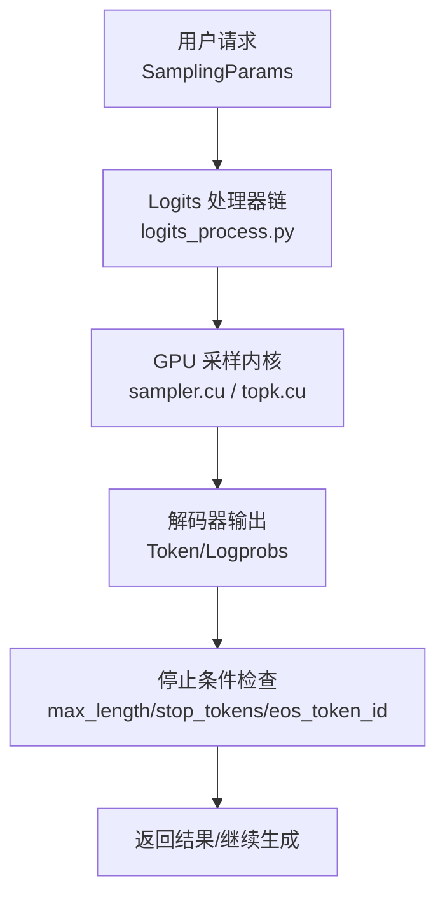
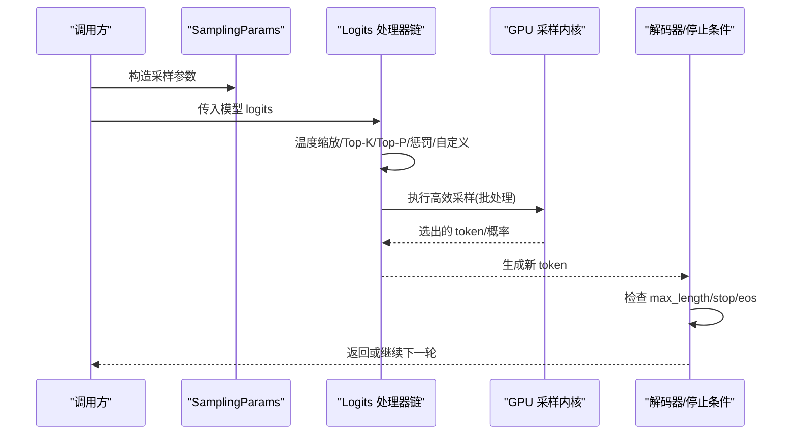
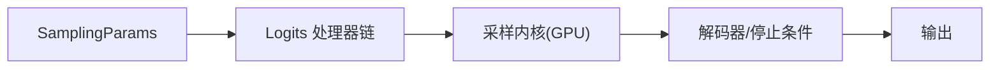

# 采样算法与生成策略

<cite>
**本文引用的文件**   
- [vllm/sampling_params.py](file://vllm/sampling_params.py)
- [vllm/logits_process.py](file://vllm/logits_process.py)
- [csrc/cuda/sampler.cu](file://csrc/cuda/sampler.cu)
- [csrc/cuda/topk.cu](file://csrc/cuda/topk.cu)
- [benchmarks/benchmark_topk_topp.py](file://benchmarks/benchmark_topk_topp.py)
- [tests/kernels/test_apply_repetition_penalties.py](file://tests/kernels/test_apply_repetition_penalties.py)
- [tests/detokenizer/test_stop_strings.py](file://tests/detokenizer/test_stop_strings.py)
- [docs/design/logits_processors.md](file://docs/design/logits_processors.md)
- [examples/features/logits_processor/custom_logits_processor.py](file://examples/features/logits_processor/custom_logits_processor.py)
</cite>

## 目录
1. [简介](#简介)
2. [项目结构](#项目结构)
3. [核心组件](#核心组件)
4. [架构总览](#架构总览)
5. [详细组件分析](#详细组件分析)
6. [依赖关系分析](#依赖关系分析)
7. [性能考量](#性能考量)
8. [故障排查指南](#故障排查指南)
9. [结论](#结论)
10. [附录](#附录)

## 简介
本文件系统性阐述 vLLM 中的文本生成采样算法与策略，覆盖 top-k、top-p（核）采样、温度调节的原理与效果；惩罚机制（重复惩罚、频率惩罚、存在惩罚）的实现要点；停止条件控制（最大长度、停止词、序列终止符）的处理流程；logits 处理器的工作机制（自定义处理与后处理选项）。同时提供不同采样策略的参数配置示例与效果对比思路，并给出生成质量评估与参数调优的最佳实践。

## 项目结构
围绕采样与生成策略的关键代码分布在以下位置：
- 采样参数定义与校验：vllm/sampling_params.py
- logits 处理器链与内置处理器：vllm/logits_process.py
- GPU 端采样内核（Top-K/Top-P、温度、惩罚等）：csrc/cuda/sampler.cu、csrc/cuda/topk.cu
- 基准测试与回归验证：benchmarks/benchmark_topk_topp.py、tests/kernels/test_apply_repetition_penalties.py
- 停止词与解码行为验证：tests/detokenizer/test_stop_strings.py
- 设计文档与示例：docs/design/logits_processors.md、examples/features/logits_processor/custom_logits_processor.py

图表来源 
- [vllm/logits_process.py](file://vllm/logits_process.py)
- [csrc/cuda/sampler.cu](file://csrc/cuda/sampler.cu)
- [csrc/cuda/topk.cu](file://csrc/cuda/topk.cu)

章节来源
- [vllm/sampling_params.py](file://vllm/sampling_params.py)
- [vllm/logits_process.py](file://vllm/logits_process.py)
- [csrc/cuda/sampler.cu](file://csrc/cuda/sampler.cu)
- [csrc/cuda/topk.cu](file://csrc/cuda/topk.cu)

## 核心组件
- 采样参数（SamplingParams）
  - 负责承载 top_k、top_p、temperature、repetition_penalty、frequency_penalty、presence_penalty、max_tokens、stop 词表、eos_token_id、logits_processors 等关键生成控制参数。
- Logits 处理器链
  - 在模型输出 logits 上按顺序应用一系列处理器，包括温度缩放、top-k/top-p 过滤、各类惩罚、以及用户自定义处理器。
- GPU 采样内核
  - 实现高效的 Top-K/Top-P 选择、温度缩放、惩罚向量化计算与批量并行采样。

章节来源
- [vllm/sampling_params.py](file://vllm/sampling_params.py)
- [vllm/logits_process.py](file://vllm/logits_process.py)
- [csrc/cuda/sampler.cu](file://csrc/cuda/sampler.cu)
- [csrc/cuda/topk.cu](file://csrc/cuda/topk.cu)

## 架构总览
下图展示了从输入到输出的完整采样与生成流程，强调各阶段的数据变换与控制点。

图表来源 
- [vllm/logits_process.py](file://vllm/logits_process.py)
- [csrc/cuda/sampler.cu](file://csrc/cuda/sampler.cu)
- [csrc/cuda/topk.cu](file://csrc/cuda/topk.cu)

## 详细组件分析

### 采样参数（SamplingParams）
- 作用：集中管理所有影响采样与生成的参数，便于在不同请求间灵活切换策略。
- 关键点：
  - top_k：限制候选集大小，提升稳定性。
  - top_p：核采样，累积概率阈值截断长尾。
  - temperature：温度缩放，控制分布的“尖锐/平滑”程度。
  - repetition_penalty/frequency_penalty/presence_penalty：抑制重复、鼓励多样性。
  - max_tokens/stop/eos_token_id：控制生成长度与结束条件。
  - logits_processors：允许插入自定义处理器以扩展行为。

章节来源
- [vllm/sampling_params.py](file://vllm/sampling_params.py)

### Logits 处理器链与内置处理器
- 工作流：
  - 温度缩放：对 logits 进行除法缩放，等价于调整 softmax 的锐度。
  - Top-K：仅保留最高 k 个 logit，其余置为极小值，再归一化。
  - Top-P（核）：对排序后的概率累积至 p，截断尾部。
  - 惩罚项：
    - 重复惩罚：基于历史 token 计数对已出现 token 的 logit 进行衰减。
    - 频率惩罚：基于 token 出现频率进行衰减，鼓励词汇多样性。
    - 存在惩罚：若 token 出现过则施加固定惩罚，促进新词引入。
  - 自定义处理器：通过注册/注入处理器，实现领域特定的约束或后处理。
- 注意事项：
  - 处理器顺序会影响最终分布，建议先做温度/Top-K/Top-P，再做惩罚，最后做自定义后处理。
  - 数值稳定性：避免除以零、负数概率等异常，需对边界情况做保护。

章节来源
- [vllm/logits_process.py](file://vllm/logits_process.py)
- [docs/design/logits_processors.md](file://docs/design/logits_processors.md)

### GPU 采样内核（Top-K/Top-P、温度、惩罚）
- 功能：
  - 在 GPU 上并行执行 Top-K/Top-P 选择与温度缩放，减少 CPU-GPU 往返。
  - 批量处理多个请求的采样，提高吞吐。
  - 支持惩罚向量化计算，降低开销。
- 性能特性：
  - 使用协同 top-k 与直方图加速，适合大词表场景。
  - 内存访问优化，减少带宽压力。

章节来源
- [csrc/cuda/sampler.cu](file://csrc/cuda/sampler.cu)
- [csrc/cuda/topk.cu](file://csrc/cuda/topk.cu)
- [benchmarks/benchmark_topk_topp.py](file://benchmarks/benchmark_topk_topp.py)

### 停止条件控制（最大长度、停止词、序列终止符）
- 最大长度：当生成 token 数量达到上限时强制停止。
- 停止词：匹配到任意停止字符串即停止，常用于对话或结构化输出。
- 序列终止符：遇到 eos_token_id 立即停止，保证格式正确性。
- 交互逻辑：每步解码后统一检查，满足任一条件即终止本轮生成。

章节来源
- [tests/detokenizer/test_stop_strings.py](file://tests/detokenizer/test_stop_strings.py)

### 自定义 Logits 处理器与后处理
- 扩展点：通过自定义处理器接口，可在任何阶段修改 logits 或应用约束。
- 常见用途：
  - 禁止特定 token 出现（如系统指令中不允许的词）。
  - 动态调整候选集（根据上下文自适应 top-k/p）。
  - 结构化输出约束（JSON Schema、正则等）。
- 最佳实践：
  - 保持处理器幂等与稳定，避免随机性导致不可复现。
  - 谨慎修改概率分布，确保数值稳定与可解释性。

章节来源
- [examples/features/logits_processor/custom_logits_processor.py](file://examples/features/logits_processor/custom_logits_processor.py)
- [docs/design/logits_processors.md](file://docs/design/logits_processors.md)

### 惩罚机制详解（重复、频率、存在）
- 重复惩罚：对历史中出现过的 token 施加衰减，防止原地打转。
- 频率惩罚：按出现次数线性或对数衰减，鼓励词汇多样性。
- 存在惩罚：只要出现过就施加固定惩罚，促进新信息引入。
- 实现要点：
  - 统计历史 token 频次，构建惩罚向量。
  - 与 logits 融合时需考虑符号与尺度，避免破坏原始分布。
  - 与 Top-K/Top-P 的顺序会影响效果，通常先惩罚再过滤。

章节来源
- [tests/kernels/test_apply_repetition_penalties.py](file://tests/kernels/test_apply_repetition_penalties.py)
- [vllm/logits_process.py](file://vllm/logits_process.py)

### 采样策略参数配置示例与效果对比
- 典型组合：
  - 高确定性：temperature=0.1~0.3，top_k=1~5，top_p=0.8~0.95
  - 中等创造性：temperature=0.6~0.9，top_k=40~100，top_p=0.9~0.95
  - 高创造性：temperature=1.0~1.3，top_k=100~200，top_p=0.95~1.0
- 效果对比思路：
  - 固定 prompt 与种子，改变 temperature/top_k/top_p，观察流畅度、连贯性与多样性。
  - 开启/关闭惩罚项，评估重复率与词汇丰富度变化。
  - 结合 stop 词与 max_tokens，控制输出长度与完整性。

章节来源
- [vllm/sampling_params.py](file://vllm/sampling_params.py)
- [benchmarks/benchmark_topk_topp.py](file://benchmarks/benchmark_topk_topp.py)

### 生成质量评估与参数调优最佳实践
- 评估维度：
  - 流畅性：句子通顺、语法正确。
  - 相关性：与 prompt 一致，不偏题。
  - 多样性：词汇与句式丰富，避免重复。
  - 可控性：满足 stop 词与长度约束。
- 调优步骤：
  - 先设定合理的 temperature 与 top_p，获得基础分布。
  - 逐步引入 top_k 与惩罚项，平衡重复与多样性。
  - 使用 stop 词与 max_tokens 控制输出边界。
  - 通过小规模样本评测，迭代调整参数直至满意。

[本节为通用指导，不直接分析具体文件]

## 依赖关系分析
- 模块耦合：
  - SamplingParams 被 logits 处理器链与采样内核共同消费。
  - logits 处理器链依赖 GPU 内核完成高性能采样。
  - 停止条件由解码器层统一检查，与采样过程解耦。
- 外部依赖：
  - CUDA 内核用于加速 Top-K/Top-P 与惩罚计算。
  - 测试与基准用于回归验证与性能监控。

图表来源 
- [vllm/sampling_params.py](file://vllm/sampling_params.py)
- [vllm/logits_process.py](file://vllm/logits_process.py)
- [csrc/cuda/sampler.cu](file://csrc/cuda/sampler.cu)

章节来源
- [vllm/sampling_params.py](file://vllm/sampling_params.py)
- [vllm/logits_process.py](file://vllm/logits_process.py)
- [csrc/cuda/sampler.cu](file://csrc/cuda/sampler.cu)

## 性能考量
- 批处理采样：利用 GPU 并行能力，一次性处理多请求，提升吞吐。
- Top-K/Top-P 优化：采用协同 top-k 与直方图加速，减少排序开销。
- 惩罚计算向量化：将历史统计与惩罚融合，避免多次内存访问。
- 内存与带宽：尽量在 GPU 内完成计算，减少主机-设备拷贝。
- 基准与回归：通过 benchmark 与单元测试持续验证正确性与性能。

章节来源
- [csrc/cuda/sampler.cu](file://csrc/cuda/sampler.cu)
- [csrc/cuda/topk.cu](file://csrc/cuda/topk.cu)
- [benchmarks/benchmark_topk_topp.py](file://benchmarks/benchmark_topk_topp.py)
- [tests/kernels/test_apply_repetition_penalties.py](file://tests/kernels/test_apply_repetition_penalties.py)

## 故障排查指南
- 常见问题：
  - 输出过早停止：检查 stop 词与 eos_token_id 是否误配。
  - 重复严重：适当增大 repetition_penalty 或 frequency_penalty，或降低 temperature。
  - 发散/无意义：降低 temperature，缩小 top_k/top_p。
  - 性能下降：确认 batch size 与 top_k/top_p 设置是否合理，避免过大候选集。
- 调试建议：
  - 打印中间 logits 分布，验证处理器顺序与数值稳定性。
  - 使用最小可复现实例定位问题。
  - 参考测试用例与基准脚本，对比预期行为。

章节来源
- [tests/detokenizer/test_stop_strings.py](file://tests/detokenizer/test_stop_strings.py)
- [tests/kernels/test_apply_repetition_penalties.py](file://tests/kernels/test_apply_repetition_penalties.py)
- [vllm/logits_process.py](file://vllm/logits_process.py)

## 结论
vLLM 的采样与生成策略以灵活的参数配置与可扩展的 logits 处理器为核心，结合高效的 GPU 内核实现，兼顾质量与性能。通过合理设置 temperature、top_k、top_p 与惩罚项，并结合停止条件控制，可在不同应用场景下取得良好平衡。建议以基准与测试为依据，持续迭代调参，确保生成结果的稳定性与可解释性。

[本节为总结性内容，不直接分析具体文件]

## 附录
- 快速参考：
  - 采样参数：temperature、top_k、top_p、repetition_penalty、frequency_penalty、presence_penalty、max_tokens、stop、eos_token_id、logits_processors。
  - 处理器顺序：温度 → Top-K → Top-P → 惩罚 → 自定义后处理。
  - 停止条件：max_tokens、stop 词、eos_token_id。
- 扩展阅读：
  - 设计文档：logits_processors 的设计与用法。
  - 示例：自定义 logits 处理器的实现与集成。

章节来源
- [docs/design/logits_processors.md](file://docs/design/logits_processors.md)
- [examples/features/logits_processor/custom_logits_processor.py](file://examples/features/logits_processor/custom_logits_processor.py)