# 多模态模型

<cite>
**本文引用的文件**   
- [vllm/multimodal/__init__.py](file://vllm/multimodal/__init__.py)
- [vllm/multimodal/registry.py](file://vllm/multimodal/registry.py)
- [vllm/multimodal/base.py](file://vllm/multimodal/base.py)
- [vllm/multimodal/image.py](file://vllm/multimodal/image.py)
- [vllm/multimodal/audio.py](file://vllm/multimodal/audio.py)
- [vllm/multimodal/video.py](file://vllm/multimodal/video.py)
- [vllm/models/vision_models/qwen2_vl.py](file://vllm/models/vision_models/qwen2_vl.py)
- [vllm/models/vision_models/minicpm_v.py](file://vllm/models/vision_models/minicpm_v.py)
- [vllm/engine/api.py](file://vllm/engine/api.py)
- [vllm/engine/async_llm_engine.py](file://vllm/engine/async_llm_engine.py)
- [vllm/inputs/parser.py](file://vllm/inputs/parser.py)
- [vllm/inputs/types.py](file://vllm/inputs/types.py)
- [vllm/renderers/base.py](file://vllm/renderers/base.py)
- [vllm/renderers/image_renderer.py](file://vllm/renderers/image_renderer.py)
- [vllm/renderers/audio_renderer.py](file://vllm/renderers/audio_renderer.py)
- [vllm/config/model_config.py](file://vllm/config/model_config.py)
- [vllm/config/engine_args.py](file://vllm/config/engine_args.py)
- [docs/design/mm_processing.md](file://docs/design/mm_processing.md)
- [docs/design/cuda_graphs_multimodal.md](file://docs/design/cuda_graphs_multimodal.md)
- [examples/generate/multimodal/qwen2_vl_example.py](file://examples/generate/multimodal/qwen2_vl_example.py)
- [examples/generate/multimodal/minicpm_v_example.py](file://examples/generate/multimodal/minicpm_v_example.py)
</cite>

## 目录
1. [简介](#简介)
2. [项目结构](#项目结构)
3. [核心组件](#核心组件)
4. [架构总览](#架构总览)
5. [详细组件分析](#详细组件分析)
6. [依赖关系分析](#依赖关系分析)
7. [性能考虑](#性能考虑)
8. [故障排查指南](#故障排查指南)
9. [结论](#结论)
10. [附录](#附录)

## 简介
本文件系统性阐述 vLLM 对多模态模型的支持，覆盖视觉语言模型（VLM）、音频处理模型与混合模态模型。内容涵盖图像、音频、视频等多模态数据的预处理、编码与融合机制；提供 Qwen2-VL、MiniCPM-V 等模型的使用示例；解释多模态输入的处理流程（tokenization、特征提取、跨模态注意力）；并给出输出渲染与后处理策略，以及性能优化与内存管理建议。

## 项目结构
vLLM 的多模态能力由“输入解析—多模态注册与处理器—模型适配—推理引擎—渲染器”构成完整链路：
- 输入层：统一解析文本与多模态数据，生成结构化输入对象
- 多模态层：按模态类型注册处理器（图像/音频/视频），负责解码、分块、特征对齐
- 模型层：各 VLM/音频/混合模型的适配器，定义特征融合与注意力策略
- 引擎层：调度批处理、KV Cache、CUDA Graph 等加速路径
- 渲染层：将模型输出或中间结果渲染为可视化产物（如图像标注、音频波形）

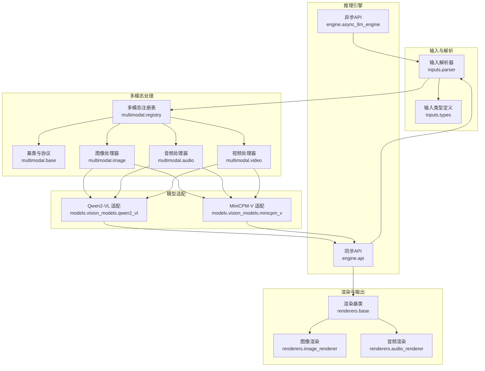

图表来源
- [vllm/inputs/parser.py](file://vllm/inputs/parser.py)
- [vllm/inputs/types.py](file://vllm/inputs/types.py)
- [vllm/multimodal/registry.py](file://vllm/multimodal/registry.py)
- [vllm/multimodal/base.py](file://vllm/multimodal/base.py)
- [vllm/multimodal/image.py](file://vllm/multimodal/image.py)
- [vllm/multimodal/audio.py](file://vllm/multimodal/audio.py)
- [vllm/multimodal/video.py](file://vllm/multimodal/video.py)
- [vllm/models/vision_models/qwen2_vl.py](file://vllm/models/vision_models/qwen2_vl.py)
- [vllm/models/vision_models/minicpm_v.py](file://vllm/models/vision_models/minicpm_v.py)
- [vllm/engine/api.py](file://vllm/engine/api.py)
- [vllm/engine/async_llm_engine.py](file://vllm/engine/async_llm_engine.py)
- [vllm/renderers/base.py](file://vllm/renderers/base.py)
- [vllm/renderers/image_renderer.py](file://vllm/renderers/image_renderer.py)
- [vllm/renderers/audio_renderer.py](file://vllm/renderers/audio_renderer.py)

章节来源
- [vllm/inputs/parser.py](file://vllm/inputs/parser.py)
- [vllm/multimodal/registry.py](file://vllm/multimodal/registry.py)
- [vllm/engine/api.py](file://vllm/engine/api.py)
- [docs/design/mm_processing.md](file://docs/design/mm_processing.md)

## 核心组件
- 多模态注册表与基类：定义统一的模态接口、处理器生命周期与元信息（分辨率、采样率、帧率等）
- 模态处理器：
  - 图像：解码、缩放/裁剪、归一化、分块（patching）、位置嵌入
  - 音频：重采样、分帧、梅尔谱/时频特征提取、时间步对齐
  - 视频：帧抽取、时序采样、时空分块与位置编码
- 模型适配器：将多模态特征与文本 token 序列融合，实现跨模态注意力
- 输入解析器：将用户输入（文本+多模态附件）解析为引擎可消费的标准化对象
- 渲染器：将模型输出或中间表示渲染为人类可读的媒体形式

章节来源
- [vllm/multimodal/base.py](file://vllm/multimodal/base.py)
- [vllm/multimodal/image.py](file://vllm/multimodal/image.py)
- [vllm/multimodal/audio.py](file://vllm/multimodal/audio.py)
- [vllm/multimodal/video.py](file://vllm/multimodal/video.py)
- [vllm/inputs/parser.py](file://vllm/inputs/parser.py)
- [vllm/renderers/base.py](file://vllm/renderers/base.py)

## 架构总览
下图展示一次典型的多模态请求从输入到输出的端到端流程，包括 tokenization、特征提取、跨模态注意力与渲染。

```mermaid
sequenceDiagram
participant U as "用户/客户端"
participant API as "引擎API"
participant PAR as "输入解析器"
participant REG as "多模态注册表"
participant H as "模态处理器(图/音/视)"
participant M as "模型适配器(VLM)"
participant R as "渲染器"
U->>API : "提交多模态请求(文本+图像/音频/视频)"
API->>PAR : "解析输入"
PAR-->>REG : "查询对应模态处理器"
REG-->>H : "实例化/复用处理器"
H->>H : "预处理(解码/重采样/分块/对齐)"
H-->>M : "返回多模态特征"
M->>M : "文本tokenization + 跨模态注意力"
M-->>API : "生成token流/中间结果"
API->>R : "选择渲染器(文本/图像/音频)"
R-->>U : "渲染结果(文本/图像/音频)"
```

图表来源
- [vllm/engine/api.py](file://vllm/engine/api.py)
- [vllm/inputs/parser.py](file://vllm/inputs/parser.py)
- [vllm/multimodal/registry.py](file://vllm/multimodal/registry.py)
- [vllm/multimodal/image.py](file://vllm/multimodal/image.py)
- [vllm/multimodal/audio.py](file://vllm/multimodal/audio.py)
- [vllm/multimodal/video.py](file://vllm/multimodal/video.py)
- [vllm/models/vision_models/qwen2_vl.py](file://vllm/models/vision_models/qwen2_vl.py)
- [vllm/models/vision_models/minicpm_v.py](file://vllm/models/vision_models/minicpm_v.py)
- [vllm/renderers/base.py](file://vllm/renderers/base.py)

## 详细组件分析

### 多模态注册与处理器抽象
- 注册表维护模态名称到处理器类的映射，支持动态发现与版本兼容
- 基类定义统一接口：预处理、特征导出、元数据校验、设备迁移
- 处理器需声明支持的格式、分辨率/采样率范围、最大上下文长度等约束

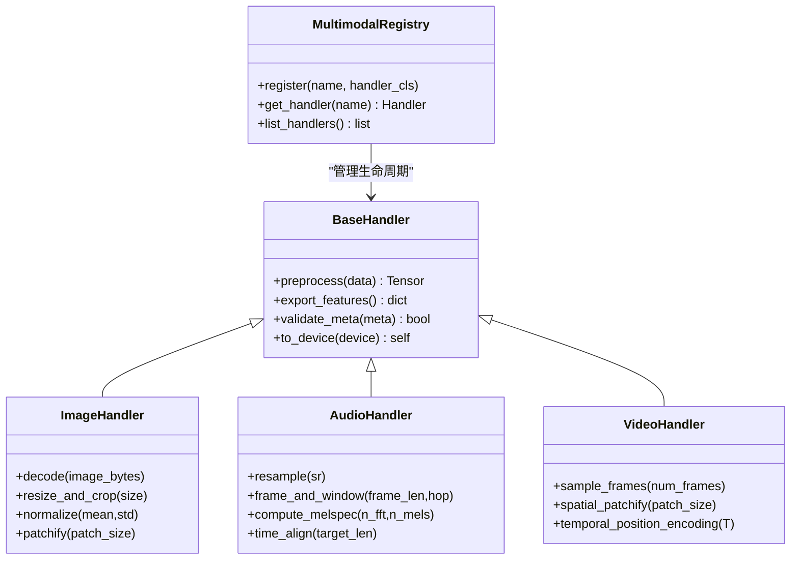

图表来源
- [vllm/multimodal/registry.py](file://vllm/multimodal/registry.py)
- [vllm/multimodal/base.py](file://vllm/multimodal/base.py)
- [vllm/multimodal/image.py](file://vllm/multimodal/image.py)
- [vllm/multimodal/audio.py](file://vllm/multimodal/audio.py)
- [vllm/multimodal/video.py](file://vllm/multimodal/video.py)

章节来源
- [vllm/multimodal/registry.py](file://vllm/multimodal/registry.py)
- [vllm/multimodal/base.py](file://vllm/multimodal/base.py)

### 图像处理器（视觉特征）
- 解码与色彩空间转换
- 尺寸规整与中心裁剪/填充
- 归一化与 patch 切分
- 位置嵌入（二维坐标/相对位置）
- 与文本 token 的对齐占位符插入

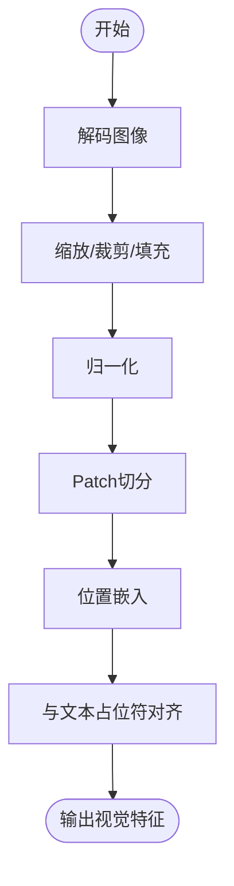

图表来源
- [vllm/multimodal/image.py](file://vllm/multimodal/image.py)

章节来源
- [vllm/multimodal/image.py](file://vllm/multimodal/image.py)

### 音频处理器（语音/音频特征）
- 重采样至目标采样率
- 分帧加窗与短时傅里叶变换/梅尔滤波器组
- 时间轴对齐与掩码
- 可选的说话人/通道维度处理

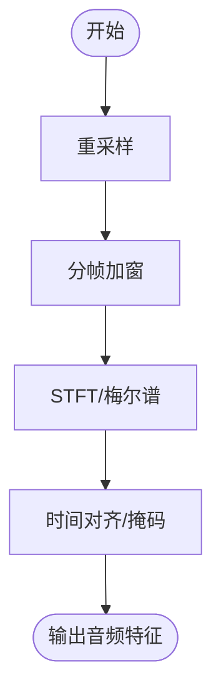

图表来源
- [vllm/multimodal/audio.py](file://vllm/multimodal/audio.py)

章节来源
- [vllm/multimodal/audio.py](file://vllm/multimodal/audio.py)

### 视频处理器（时空特征）
- 帧采样策略（均匀/关键帧）
- 空间 patch 切分与时序位置编码
- 长视频切片与滑动窗口

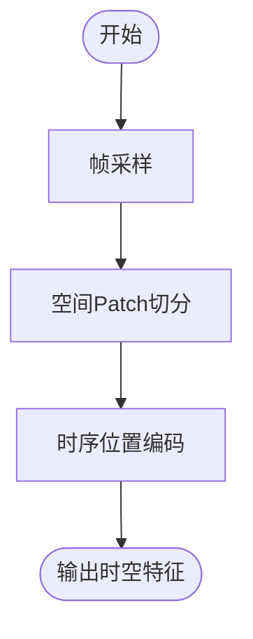

图表来源
- [vllm/multimodal/video.py](file://vllm/multimodal/video.py)

章节来源
- [vllm/multimodal/video.py](file://vllm/multimodal/video.py)

### 模型适配器：Qwen2-VL
- 视觉编码器输出经投影层与文本嵌入拼接
- 使用跨模态注意力（通常以视觉 token 作为条件）进行联合推理
- 支持多分辨率与多 patch 尺度

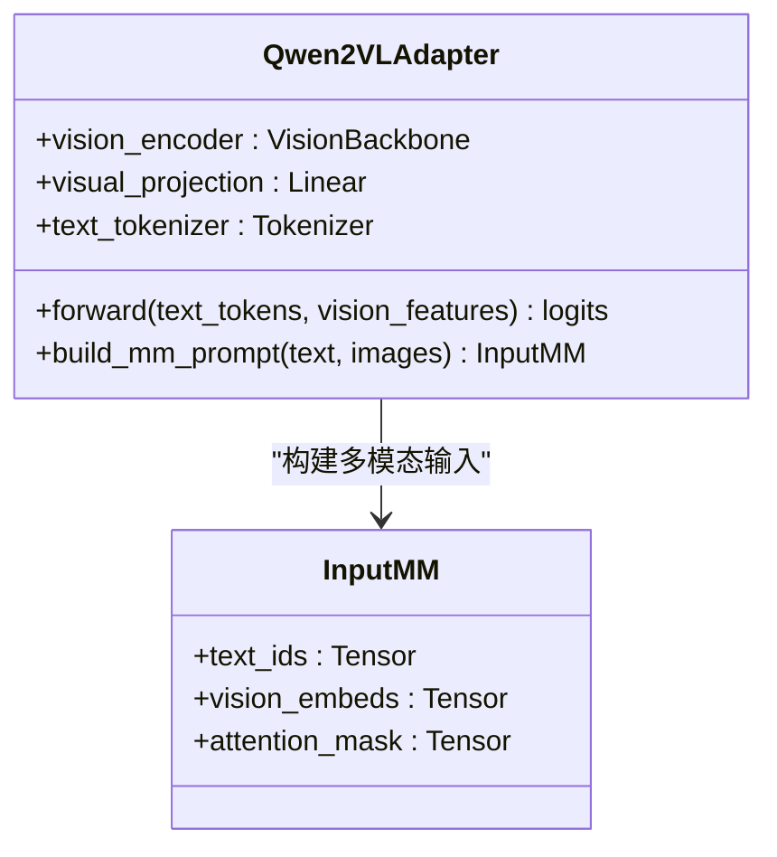

图表来源
- [vllm/models/vision_models/qwen2_vl.py](file://vllm/models/vision_models/qwen2_vl.py)

章节来源
- [vllm/models/vision_models/qwen2_vl.py](file://vllm/models/vision_models/qwen2_vl.py)

### 模型适配器：MiniCPM-V
- 采用轻量视觉编码器与高效融合模块
- 支持图像/视频/音频的统一 token 化与共享解码器
- 针对移动端/边缘设备的量化与算子融合优化

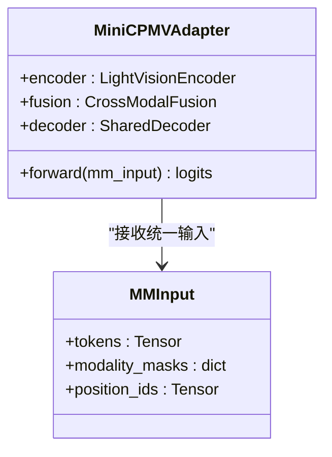

图表来源
- [vllm/models/vision_models/minicpm_v.py](file://vllm/models/vision_models/minicpm_v.py)

章节来源
- [vllm/models/vision_models/minicpm_v.py](file://vllm/models/vision_models/minicpm_v.py)

### 输入解析与类型系统
- 输入解析器将原始请求转换为标准输入对象，包含文本与多模态附件
- 类型系统定义各模态的数据契约（形状、dtype、设备、元数据）
- 支持批量与流式输入

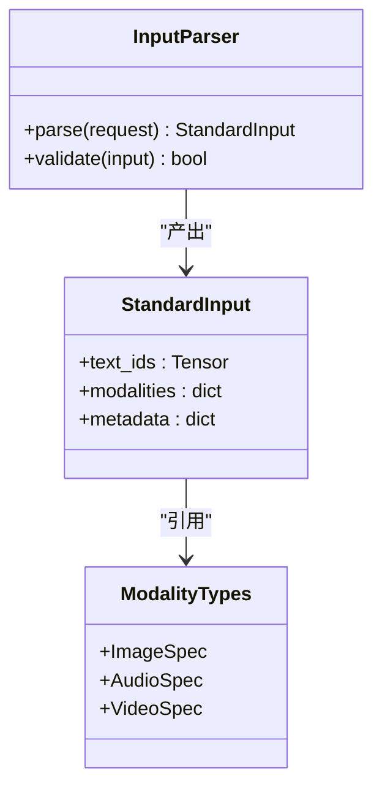

图表来源
- [vllm/inputs/parser.py](file://vllm/inputs/parser.py)
- [vllm/inputs/types.py](file://vllm/inputs/types.py)

章节来源
- [vllm/inputs/parser.py](file://vllm/inputs/parser.py)
- [vllm/inputs/types.py](file://vllm/inputs/types.py)

### 渲染与后处理
- 文本渲染：detokenize、格式化、工具调用结果解析
- 图像渲染：边界框/关键点叠加、热力图、对比图
- 音频渲染：波形绘制、频谱图、转写文本对齐

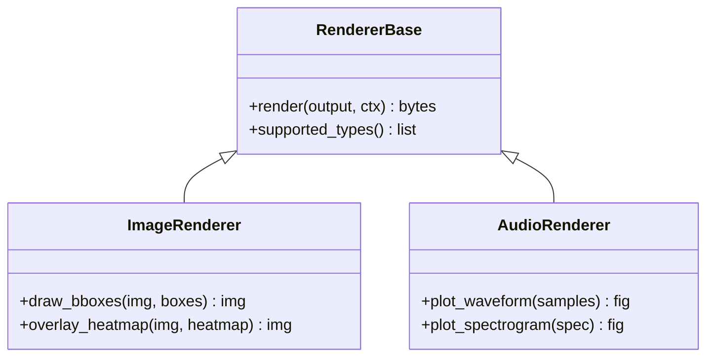

图表来源
- [vllm/renderers/base.py](file://vllm/renderers/base.py)
- [vllm/renderers/image_renderer.py](file://vllm/renderers/image_renderer.py)
- [vllm/renderers/audio_renderer.py](file://vllm/renderers/audio_renderer.py)

章节来源
- [vllm/renderers/base.py](file://vllm/renderers/base.py)
- [vllm/renderers/image_renderer.py](file://vllm/renderers/image_renderer.py)
- [vllm/renderers/audio_renderer.py](file://vllm/renderers/audio_renderer.py)

## 依赖关系分析
- 输入解析器依赖类型系统与多模态注册表
- 模型适配器依赖对应模态处理器与 tokenizer
- 引擎 API 协调解析、处理、推理与渲染
- 配置模块控制分辨率、采样率、批大小、KV Cache 策略等

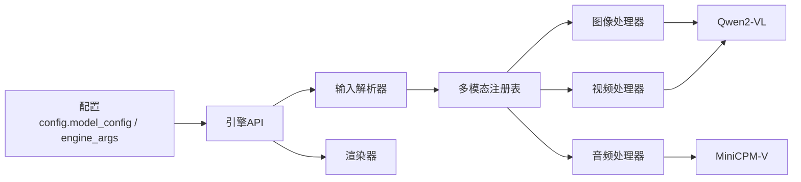

图表来源
- [vllm/config/model_config.py](file://vllm/config/model_config.py)
- [vllm/config/engine_args.py](file://vllm/config/engine_args.py)
- [vllm/engine/api.py](file://vllm/engine/api.py)
- [vllm/inputs/parser.py](file://vllm/inputs/parser.py)
- [vllm/multimodal/registry.py](file://vllm/multimodal/registry.py)
- [vllm/multimodal/image.py](file://vllm/multimodal/image.py)
- [vllm/multimodal/audio.py](file://vllm/multimodal/audio.py)
- [vllm/multimodal/video.py](file://vllm/multimodal/video.py)
- [vllm/models/vision_models/qwen2_vl.py](file://vllm/models/vision_models/qwen2_vl.py)
- [vllm/models/vision_models/minicpm_v.py](file://vllm/models/vision_models/minicpm_v.py)
- [vllm/renderers/base.py](file://vllm/renderers/base.py)

章节来源
- [vllm/config/model_config.py](file://vllm/config/model_config.py)
- [vllm/config/engine_args.py](file://vllm/config/engine_args.py)
- [vllm/engine/api.py](file://vllm/engine/api.py)

## 性能考虑
- CUDA Graph 与编译优化：对多模态路径启用图捕获，减少 Python 开销与内核启动成本
- KV Cache 与分页注意力：提升长上下文与批处理的吞吐
- 批内不变性与前缀缓存：重复片段复用，降低重复计算
- 量化与低精度：FP8/INT8 权重与激活，结合算子融合
- 内存管理：显存池、零拷贝、异步 I/O、卸载策略

章节来源
- [docs/design/cuda_graphs_multimodal.md](file://docs/design/cuda_graphs_multimodal.md)
- [docs/design/mm_processing.md](file://docs/design/mm_processing.md)

## 故障排查指南
- 输入格式错误：检查图像分辨率、音频采样率、视频帧率是否符合处理器约束
- 设备不匹配：确保张量与模型在同一设备（CPU/GPU）
- 内存不足：降低 batch size、分辨率、采样率，或启用量化/卸载
- 渲染失败：确认渲染器是否支持该输出类型，检查依赖库安装
- 性能退化：检查是否命中 CUDA Graph、KV Cache 命中率、是否存在频繁 Python-GPU 同步

章节来源
- [vllm/inputs/parser.py](file://vllm/inputs/parser.py)
- [vllm/multimodal/base.py](file://vllm/multimodal/base.py)
- [vllm/renderers/base.py](file://vllm/renderers/base.py)

## 结论
vLLM 通过标准化的多模态注册与处理器体系，结合高效的模型适配器与引擎优化，为 VLM、音频与混合模态提供了可扩展、高性能的推理框架。借助输入解析、特征对齐、跨模态注意力与渲染管线，用户可便捷地集成多种多模态模型，并在生产环境中获得稳定与高效的推理体验。

## 附录

### 使用示例：Qwen2-VL
- 通过引擎 API 构造包含文本与图像的请求
- 指定图像分辨率与 patch 策略
- 获取文本生成结果与可选的图像渲染

章节来源
- [examples/generate/multimodal/qwen2_vl_example.py](file://examples/generate/multimodal/qwen2_vl_example.py)
- [vllm/engine/api.py](file://vllm/engine/api.py)
- [vllm/models/vision_models/qwen2_vl.py](file://vllm/models/vision_models/qwen2_vl.py)

### 使用示例：MiniCPM-V
- 支持图像/音频/视频的混合输入
- 使用统一 token 化与共享解码器
- 适合资源受限场景的量化部署

章节来源
- [examples/generate/multimodal/minicpm_v_example.py](file://examples/generate/multimodal/minicpm_v_example.py)
- [vllm/models/vision_models/minicpm_v.py](file://vllm/models/vision_models/minicpm_v.py)

### 多模态输入处理流程图（概念）
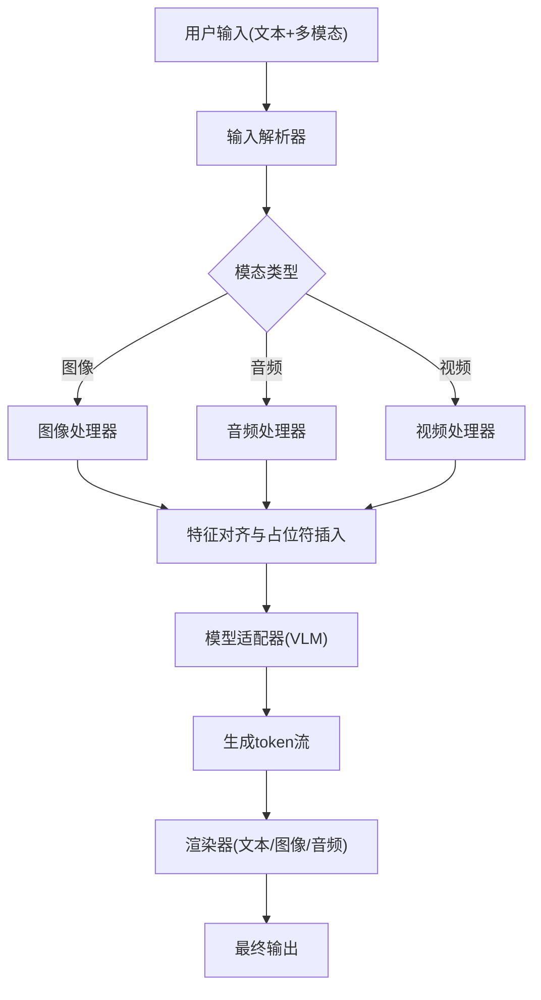

[本图为概念性流程图，无需源码映射]