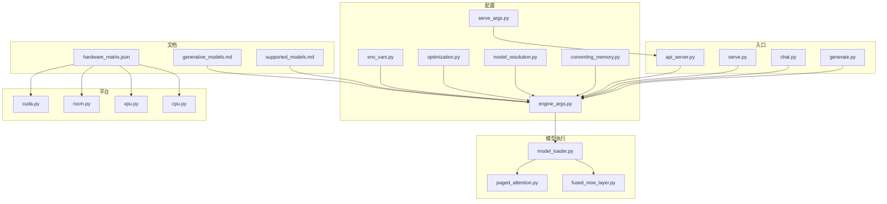
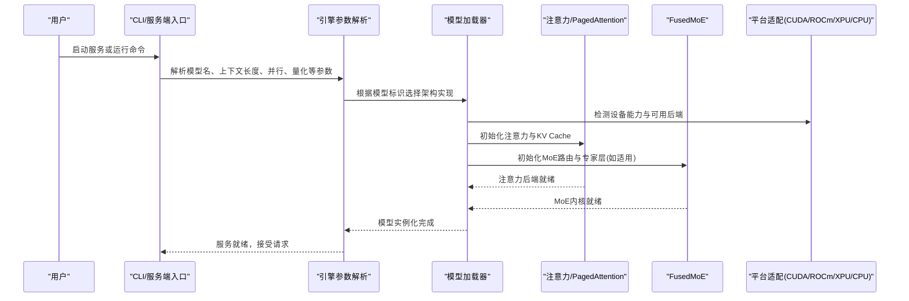
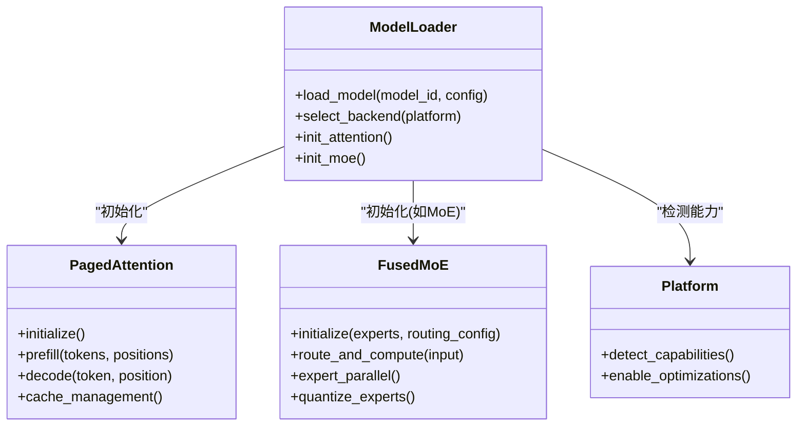
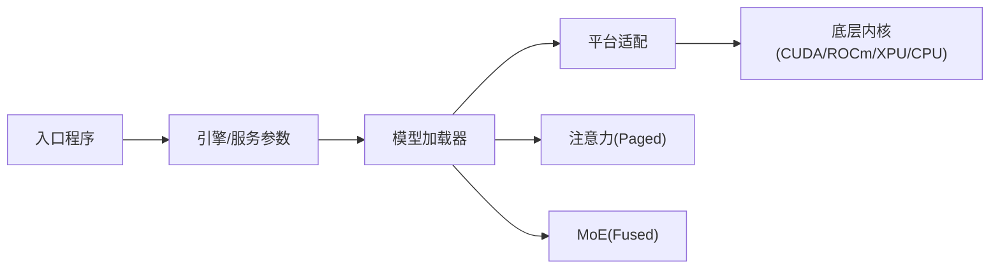

# 支持的模型架构

<cite>
**本文引用的文件**   
- [vllm/models/generative_models.md](file://docs/models/generative_models.md)
- [vllm/models/supported_models.md](file://docs/models/supported_models.md)
- [vllm/config/engine_args.py](file://vllm/config/engine_args.py)
- [vllm/config/serve_args.py](file://vllm/config/serve_args.py)
- [vllm/model_executor/model_loader.py](file://vllm/model_executor/model_loader.py)
- [vllm/model_executor/layers/attention/fused_moe_layer.py](file://vllm/model_executor/layers/attention/fused_moe_layer.py)
- [vllm/model_executor/layers/attention/paged_attention.py](file://vllm/model_executor/layers/attention/paged_attention.py)
- [vllm/platforms/cuda.py](file://vllm/platforms/cuda.py)
- [vllm/platforms/rocm.py](file://vllm/platforms/rocm.py)
- [vllm/platforms/xpu.py](file://vllm/platforms/xpu.py)
- [vllm/platforms/cpu.py](file://vllm/platforms/cpu.py)
- [vllm/entrypoints/openai/api_server.py](file://vllm/entrypoints/openai/api_server.py)
- [vllm/entrypoints/cli/serve.py](file://vllm/entrypoints/cli/serve.py)
- [vllm/entrypoints/cli/chat.py](file://vllm/entrypoints/cli/chat.py)
- [vllm/entrypoints/cli/generate.py](file://vllm/entrypoints/cli/generate.py)
- [vllm/config/env_vars.py](file://vllm/config/env_vars.py)
- [vllm/config/optimization.py](file://vllm/config/optimization.py)
- [vllm/config/model_resolution.py](file://vllm/config/model_resolution.py)
- [vllm/config/converting_memory.py](file://vllm/config/converting_memory.py)
- [vllm/config/hardware_supported_models/hardware_matrix.json](file://docs/models/hardware_supported_models/hardware_matrix.json)
</cite>

## 目录
1. [简介](#简介)
2. [项目结构](#项目结构)
3. [核心组件](#核心组件)
4. [架构总览](#架构总览)
5. [详细组件分析](#详细组件分析)
6. [依赖关系分析](#依赖关系分析)
7. [性能考虑](#性能考虑)
8. [故障排查指南](#故障排查指南)
9. [结论](#结论)
10. [附录](#附录)

## 简介
本文件系统性梳理 vLLM 对主流大语言模型架构的支持与使用方法，重点覆盖 Llama 系列、Qwen 系列、DeepSeek 系列、Mistral 系列等。内容包含：
- 各模型的特定参数与配置项（上下文长度、注意力机制、MoE 结构等）
- 模型兼容性矩阵（不同硬件平台支持情况）
- 版本管理与向后兼容性说明
- 架构特殊要求与限制
- 性能优化建议与最佳实践

## 项目结构
vLLM 的模型支持与配置分布在文档、配置模块、模型执行器与平台适配层中：
- 文档层：提供模型支持清单与硬件兼容性矩阵
- 配置层：引擎参数、服务参数、环境变量与优化选项
- 执行层：模型加载、注意力实现、MoE 层与 KV Cache
- 平台层：CUDA/ROCm/XPU/CPU 等平台能力检测与开关
- 入口层：CLI 与服务端启动，统一参数解析与模型选择

图表来源 
- [vllm/models/generative_models.md](file://docs/models/generative_models.md)
- [vllm/models/supported_models.md](file://docs/models/supported_models.md)
- [vllm/config/engine_args.py](file://vllm/config/engine_args.py)
- [vllm/config/serve_args.py](file://vllm/config/serve_args.py)
- [vllm/config/env_vars.py](file://vllm/config/env_vars.py)
- [vllm/config/optimization.py](file://vllm/config/optimization.py)
- [vllm/config/model_resolution.py](file://vllm/config/model_resolution.py)
- [vllm/config/converting_memory.py](file://vllm/config/converting_memory.py)
- [vllm/model_executor/model_loader.py](file://vllm/model_executor/model_loader.py)
- [vllm/model_executor/layers/attention/paged_attention.py](file://vllm/model_executor/layers/attention/paged_attention.py)
- [vllm/model_executor/layers/attention/fused_moe_layer.py](file://vllm/model_executor/layers/attention/fused_moe_layer.py)
- [vllm/platforms/cuda.py](file://vllm/platforms/cuda.py)
- [vllm/platforms/rocm.py](file://vllm/platforms/rocm.py)
- [vllm/platforms/xpu.py](file://vllm/platforms/xpu.py)
- [vllm/platforms/cpu.py](file://vllm/platforms/cpu.py)
- [vllm/entrypoints/openai/api_server.py](file://vllm/entrypoints/openai/api_server.py)
- [vllm/entrypoints/cli/serve.py](file://vllm/entrypoints/cli/serve.py)
- [vllm/entrypoints/cli/chat.py](file://vllm/entrypoints/cli/chat.py)
- [vllm/entrypoints/cli/generate.py](file://vllm/entrypoints/cli/generate.py)

章节来源
- [vllm/models/generative_models.md](file://docs/models/generative_models.md)
- [vllm/models/supported_models.md](file://docs/models/supported_models.md)
- [vllm/config/engine_args.py](file://vllm/config/engine_args.py)
- [vllm/config/serve_args.py](file://vllm/config/serve_args.py)
- [vllm/config/env_vars.py](file://vllm/config/env_vars.py)
- [vllm/config/optimization.py](file://vllm/config/optimization.py)
- [vllm/config/model_resolution.py](file://vllm/config/model_resolution.py)
- [vllm/config/converting_memory.py](file://vllm/config/converting_memory.py)
- [vllm/model_executor/model_loader.py](file://vllm/model_executor/model_loader.py)
- [vllm/model_executor/layers/attention/paged_attention.py](file://vllm/model_executor/layers/attention/paged_attention.py)
- [vllm/model_executor/layers/attention/fused_moe_layer.py](file://vllm/model_executor/layers/attention/fused_moe_layer.py)
- [vllm/platforms/cuda.py](file://vllm/platforms/cuda.py)
- [vllm/platforms/rocm.py](file://vllm/platforms/rocm.py)
- [vllm/platforms/xpu.py](file://vllm/platforms/xpu.py)
- [vllm/platforms/cpu.py](file://vllm/platforms/cpu.py)
- [vllm/entrypoints/openai/api_server.py](file://vllm/entrypoints/openai/api_server.py)
- [vllm/entrypoints/cli/serve.py](file://vllm/entrypoints/cli/serve.py)
- [vllm/entrypoints/cli/chat.py](file://vllm/entrypoints/cli/chat.py)
- [vllm/entrypoints/cli/generate.py](file://vllm/entrypoints/cli/generate.py)

## 核心组件
- 模型支持清单与硬件矩阵：集中展示支持的模型族与平台能力，便于选型与部署规划
- 引擎与服务参数：统一管理上下文长度、KV Cache、量化、并行策略、注意力后端等关键配置
- 模型加载器：根据模型标识与配置动态选择架构实现，处理权重加载与初始化
- 注意力与 MoE：Paged Attention 提升长上下文吞吐；Fused MoE 加速稀疏专家路由计算
- 平台适配层：检测 GPU/ROCm/XPU/CPU 能力并启用相应优化路径
- 入口程序：CLI 与服务端统一参数解析，驱动引擎启动与推理流程

章节来源
- [vllm/models/supported_models.md](file://docs/models/supported_models.md)
- [vllm/config/engine_args.py](file://vllm/config/engine_args.py)
- [vllm/config/serve_args.py](file://vllm/config/serve_args.py)
- [vllm/model_executor/model_loader.py](file://vllm/model_executor/model_loader.py)
- [vllm/model_executor/layers/attention/paged_attention.py](file://vllm/model_executor/layers/attention/paged_attention.py)
- [vllm/model_executor/layers/attention/fused_moe_layer.py](file://vllm/model_executor/layers/attention/fused_moe_layer.py)
- [vllm/platforms/cuda.py](file://vllm/platforms/cuda.py)
- [vllm/platforms/rocm.py](file://vllm/platforms/rocm.py)
- [vllm/platforms/xpu.py](file://vllm/platforms/xpu.py)
- [vllm/platforms/cpu.py](file://vllm/platforms/cpu.py)

## 架构总览
下图展示了从入口到模型执行的端到端调用链，以及关键配置与平台能力的交互。

图表来源 
- [vllm/entrypoints/openai/api_server.py](file://vllm/entrypoints/openai/api_server.py)
- [vllm/entrypoints/cli/serve.py](file://vllm/entrypoints/cli/serve.py)
- [vllm/entrypoints/cli/chat.py](file://vllm/entrypoints/cli/chat.py)
- [vllm/entrypoints/cli/generate.py](file://vllm/entrypoints/cli/generate.py)
- [vllm/config/engine_args.py](file://vllm/config/engine_args.py)
- [vllm/model_executor/model_loader.py](file://vllm/model_executor/model_loader.py)
- [vllm/model_executor/layers/attention/paged_attention.py](file://vllm/model_executor/layers/attention/paged_attention.py)
- [vllm/model_executor/layers/attention/fused_moe_layer.py](file://vllm/model_executor/layers/attention/fused_moe_layer.py)
- [vllm/platforms/cuda.py](file://vllm/platforms/cuda.py)
- [vllm/platforms/rocm.py](file://vllm/platforms/rocm.py)
- [vllm/platforms/xpu.py](file://vllm/platforms/xpu.py)
- [vllm/platforms/cpu.py](file://vllm/platforms/cpu.py)

## 详细组件分析

### Llama 系列（Llama/Llama2/Llama3/Llama3.1/Llama3.2/Llama4）
- 架构要点
  - 标准 Transformer 解码器，使用 RMSNorm、RoPE 位置编码、GQA/MQA 注意力
  - 支持长上下文（通过 Paged Attention），可配置最大上下文长度
  - 可选 LoRA/QLoRA 微调与量化（INT4/INT8/FP8）
- 关键配置
  - 上下文长度、注意力头数、隐藏维度、层数、词表大小
  - 量化精度、KV Cache 布局、GPU 内存碎片控制
- 性能建议
  - 开启 Paged Attention 与连续批处理
  - 合理设置 batch size 与序列长度上限
  - 使用 Flash Attention 后端（若可用）

章节来源
- [vllm/models/generative_models.md](file://docs/models/generative_models.md)
- [vllm/config/engine_args.py](file://vllm/config/engine_args.py)
- [vllm/model_executor/layers/attention/paged_attention.py](file://vllm/model_executor/layers/attention/paged_attention.py)

### Qwen 系列（Qwen/Qwen2/Qwen2.5/Qwen3/Qwen3.5/Qwen3.6）
- 架构要点
  - 基于 Llama 风格的解码器，部分版本引入混合注意力与更高效的 RoPE
  - 支持多模态扩展（如 VL 变体），在 vLLM 中以专用加载路径处理
- 关键配置
  - 上下文长度、注意力模式（GQA/MQA）、MoE 开关（部分版本）
  - 量化与 LoRA 支持
- 性能建议
  - 优先使用 Paged Attention 与连续批处理
  - 针对长文档场景调整 KV Cache 与分块策略

章节来源
- [vllm/models/generative_models.md](file://docs/models/generative_models.md)
- [vllm/config/engine_args.py](file://vllm/config/engine_args.py)
- [vllm/model_executor/model_loader.py](file://vllm/model_executor/model_loader.py)

### DeepSeek 系列（DeepSeek-V2/V3/V4）
- 架构要点
  - 采用 MoE（Mixture of Experts）结构，显著降低推理成本
  - 融合路由与专家计算，结合 Paged Attention 提升吞吐
- 关键配置
  - 专家数量、激活专家数、路由阈值、MoE 量化
  - 上下文长度与注意力后端选择
- 性能建议
  - 启用 Fused MoE 内核与专家并行（EP）
  - 调优 top-k 路由与专家容量，避免过载

章节来源
- [vllm/model_executor/layers/attention/fused_moe_layer.py](file://vllm/model_executor/layers/attention/fused_moe_layer.py)
- [vllm/config/engine_args.py](file://vllm/config/engine_args.py)
- [vllm/model_executor/model_loader.py](file://vllm/model_executor/model_loader.py)

### Mistral 系列（Mistral/Mixtral/Mistral Large）
- 架构要点
  - Mixtral 为 MoE 架构，其他为密集解码器
  - 支持 GQA/MQA 与高效 RoPE
- 关键配置
  - 专家路由参数（Mixtral）、上下文长度、注意力头分组
  - 量化与 LoRA
- 性能建议
  - 对 Mixtral 启用 Fused MoE 与 EP
  - 对密集模型使用 Paged Attention 与连续批处理

章节来源
- [vllm/model_executor/layers/attention/fused_moe_layer.py](file://vllm/model_executor/layers/attention/fused_moe_layer.py)
- [vllm/config/engine_args.py](file://vllm/config/engine_args.py)
- [vllm/model_executor/model_loader.py](file://vllm/model_executor/model_loader.py)

### 其他常见架构（Gemma、Phi、BLOOM、Baichuan、ChatGLM 等）
- 架构要点
  - 遵循各自官方实现，vLLM 通过统一加载器适配
- 关键配置
  - 上下文长度、注意力模式、量化与 LoRA
- 性能建议
  - 依据模型特性选择合适的注意力后端与 KV Cache 策略

章节来源
- [vllm/models/generative_models.md](file://docs/models/generative_models.md)
- [vllm/model_executor/model_loader.py](file://vllm/model_executor/model_loader.py)

### 注意力与 MoE 组件类图

图表来源 
- [vllm/model_executor/layers/attention/paged_attention.py](file://vllm/model_executor/layers/attention/paged_attention.py)
- [vllm/model_executor/layers/attention/fused_moe_layer.py](file://vllm/model_executor/layers/attention/fused_moe_layer.py)
- [vllm/model_executor/model_loader.py](file://vllm/model_executor/model_loader.py)
- [vllm/platforms/cuda.py](file://vllm/platforms/cuda.py)
- [vllm/platforms/rocm.py](file://vllm/platforms/rocm.py)
- [vllm/platforms/xpu.py](file://vllm/platforms/xpu.py)
- [vllm/platforms/cpu.py](file://vllm/platforms/cpu.py)

## 依赖关系分析
- 入口程序依赖引擎与服务参数，统一解析模型名、上下文长度、并行与量化等配置
- 模型加载器依赖平台能力检测，选择注意力与 MoE 后端
- 注意力与 MoE 层依赖底层 CUDA/ROCm/XPU/CPU 内核实现
- 文档与矩阵提供模型与平台的兼容性信息，指导配置与部署

图表来源 
- [vllm/entrypoints/openai/api_server.py](file://vllm/entrypoints/openai/api_server.py)
- [vllm/entrypoints/cli/serve.py](file://vllm/entrypoints/cli/serve.py)
- [vllm/config/engine_args.py](file://vllm/config/engine_args.py)
- [vllm/model_executor/model_loader.py](file://vllm/model_executor/model_loader.py)
- [vllm/platforms/cuda.py](file://vllm/platforms/cuda.py)
- [vllm/platforms/rocm.py](file://vllm/platforms/rocm.py)
- [vllm/platforms/xpu.py](file://vllm/platforms/xpu.py)
- [vllm/platforms/cpu.py](file://vllm/platforms/cpu.py)

章节来源
- [vllm/entrypoints/openai/api_server.py](file://vllm/entrypoints/openai/api_server.py)
- [vllm/entrypoints/cli/serve.py](file://vllm/entrypoints/cli/serve.py)
- [vllm/config/engine_args.py](file://vllm/config/engine_args.py)
- [vllm/model_executor/model_loader.py](file://vllm/model_executor/model_loader.py)
- [vllm/platforms/cuda.py](file://vllm/platforms/cuda.py)
- [vllm/platforms/rocm.py](file://vllm/platforms/rocm.py)
- [vllm/platforms/xpu.py](file://vllm/platforms/xpu.py)
- [vllm/platforms/cpu.py](file://vllm/platforms/cpu.py)

## 性能考虑
- 长上下文与 KV Cache
  - 使用 Paged Attention 减少内存碎片，提高吞吐
  - 合理设置上下文长度与 KV Cache 布局，避免溢出
- 量化与 LoRA
  - 根据硬件选择 INT4/INT8/FP8 量化，平衡精度与速度
  - 使用 LoRA/QLoRA 进行轻量微调与快速切换
- MoE 优化
  - 启用 Fused MoE 与专家并行，调优 top-k 路由与专家容量
- 注意力后端
  - 优先选择 Flash Attention 或平台最优后端
- 批处理与并发
  - 调整 batch size、max_tokens_per_batch 与并发度，匹配硬件资源

章节来源
- [vllm/config/engine_args.py](file://vllm/config/engine_args.py)
- [vllm/config/optimization.py](file://vllm/config/optimization.py)
- [vllm/model_executor/layers/attention/paged_attention.py](file://vllm/model_executor/layers/attention/paged_attention.py)
- [vllm/model_executor/layers/attention/fused_moe_layer.py](file://vllm/model_executor/layers/attention/fused_moe_layer.py)

## 故障排查指南
- 模型无法加载
  - 检查模型名称与版本是否受支持，确认权重路径与权限
  - 查看平台能力检测日志，确认后端可用性
- 上下文溢出或显存不足
  - 降低上下文长度或 batch size，调整 KV Cache 布局
  - 启用量化或 LoRA 以减少显存占用
- MoE 路由异常
  - 检查专家数量与 top-k 配置，确保路由阈值合理
  - 监控专家负载，必要时调整并行策略
- 性能不达标
  - 确认注意力后端已启用，检查内核编译与依赖
  - 调整批处理与并发参数，观察吞吐变化

章节来源
- [vllm/model_executor/model_loader.py](file://vllm/model_executor/model_loader.py)
- [vllm/config/engine_args.py](file://vllm/config/engine_args.py)
- [vllm/platforms/cuda.py](file://vllm/platforms/cuda.py)
- [vllm/platforms/rocm.py](file://vllm/platforms/rocm.py)
- [vllm/platforms/xpu.py](file://vllm/platforms/xpu.py)
- [vllm/platforms/cpu.py](file://vllm/platforms/cpu.py)

## 结论
vLLM 通过统一的模型加载器、高效的注意力与 MoE 实现、以及完善的平台适配层，为 Llama、Qwen、DeepSeek、Mistral 等主流架构提供了高性能推理支持。通过合理的配置与优化，可在不同硬件平台上获得稳定且高效的推理体验。建议在部署前参考模型支持清单与硬件兼容性矩阵，并结合性能建议进行参数调优。

## 附录

### 模型兼容性矩阵（按平台）
- CUDA（NVIDIA GPU）
  - 全面支持 Llama、Qwen、DeepSeek、Mistral 等主流架构
  - 推荐启用 Flash Attention 与 Paged Attention
- ROCm（AMD GPU）
  - 支持多数架构，注意内核兼容性与版本匹配
- XPU（Intel GPU）
  - 支持部分架构，需确认后端与内核可用性
- CPU
  - 基础推理支持，适合测试与低负载场景

章节来源
- [vllm/models/supported_models.md](file://docs/models/supported_models.md)
- [vllm/platforms/cuda.py](file://vllm/platforms/cuda.py)
- [vllm/platforms/rocm.py](file://vllm/platforms/rocm.py)
- [vllm/platforms/xpu.py](file://vllm/platforms/xpu.py)
- [vllm/platforms/cpu.py](file://vllm/platforms/cpu.py)

### 版本管理与向后兼容性
- 模型版本
  - 建议使用明确的模型 ID 与版本号，避免歧义
  - 关注官方发布说明，了解架构变更与弃用项
- 引擎与服务参数
  - 保持参数命名一致，避免破坏性更新
  - 使用环境变量与配置文件管理差异
- 平台与内核
  - 定期更新 CUDA/ROCm/XPU 驱动与内核版本
  - 验证新版本的兼容性与性能影响

章节来源
- [vllm/config/engine_args.py](file://vllm/config/engine_args.py)
- [vllm/config/serve_args.py](file://vllm/config/serve_args.py)
- [vllm/config/env_vars.py](file://vllm/config/env_vars.py)

### 使用示例与最佳实践
- 启动服务
  - 使用 CLI 或服务端入口，传入模型名、上下文长度、并行与量化参数
- 离线推理
  - 使用生成脚本，批量处理输入，输出结果
- 在线聊天
  - 使用聊天入口，交互式对话，支持流式输出

章节来源
- [vllm/entrypoints/openai/api_server.py](file://vllm/entrypoints/openai/api_server.py)
- [vllm/entrypoints/cli/serve.py](file://vllm/entrypoints/cli/serve.py)
- [vllm/entrypoints/cli/chat.py](file://vllm/entrypoints/cli/chat.py)
- [vllm/entrypoints/cli/generate.py](file://vllm/entrypoints/cli/generate.py)