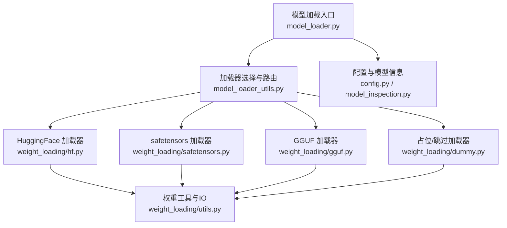
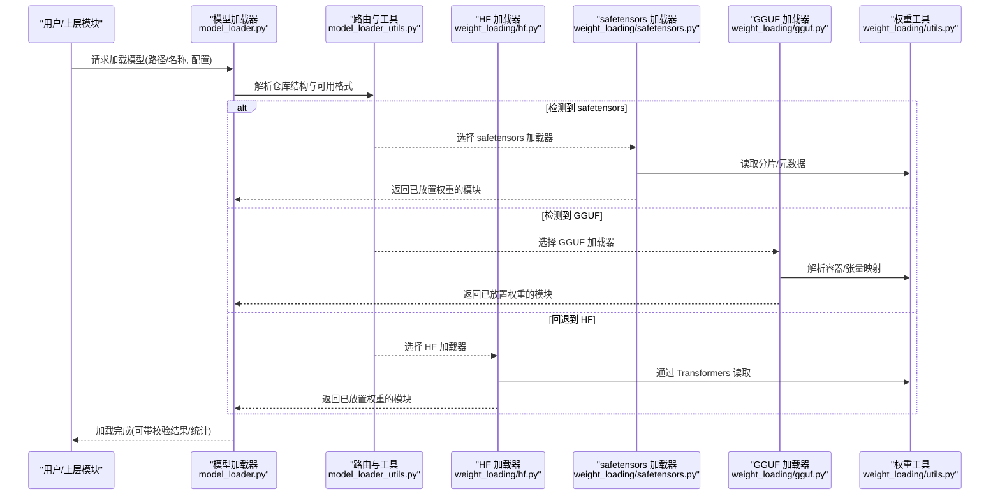
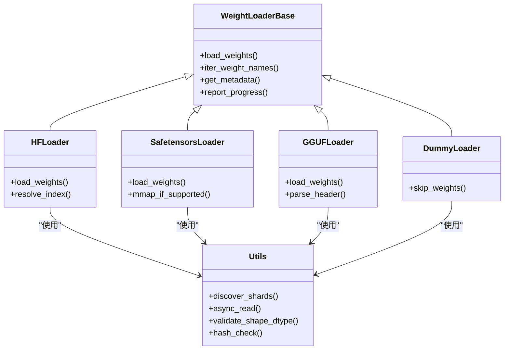

# 模型加载机制

<cite>
**本文引用的文件**   
- [vllm/model_executor/model_loader.py](file://vllm/model_executor/model_loader.py)
- [vllm/model_executor/weight_loading/base.py](file://vllm/model_executor/weight_loading/base.py)
- [vllm/model_executor/weight_loading/hf.py](file://vllm/model_executor/weight_loading/hf.py)
- [vllm/model_executor/weight_loading/safetensors.py](file://vllm/model_executor/weight_loading/safetensors.py)
- [vllm/model_executor/weight_loading/gguf.py](file://vllm/model_executor/weight_loading/gguf.py)
- [vllm/model_executor/weight_loading/dummy.py](file://vllm/model_executor/weight_loading/dummy.py)
- [vllm/model_executor/weight_loading/utils.py](file://vllm/model_executor/weight_loading/utils.py)
- [vllm/model_executor/model_loader_utils.py](file://vllm/model_executor/model_loader_utils.py)
- [vllm/config.py](file://vllm/config.py)
- [vllm/model_inspection.py](file://vllm/model_inspection.py)
- [tests/model_executor/test_model_load_with_params.py](file://tests/model_executor/test_model_load_with_params.py)
</cite>

## 目录
1. [简介](#简介)
2. [项目结构](#项目结构)
3. [核心组件](#核心组件)
4. [架构总览](#架构总览)
5. [详细组件分析](#详细组件分析)
6. [依赖关系分析](#依赖关系分析)
7. [性能考虑](#性能考虑)
8. [故障排除指南](#故障排除指南)
9. [结论](#结论)
10. [附录](#附录)

## 简介
本文件系统性阐述 vLLM 的模型加载机制，覆盖 HuggingFace、safetensors、GGUF 等格式的解析与处理流程；深入解释权重分片加载、内存映射与异步加载的实现原理；提供自定义模型格式集成指南（含格式转换器开发与注册）；说明模型验证与完整性检查（权重校验与架构匹配）；并给出模型缓存策略、增量加载优化、性能调优与故障排除建议。

## 项目结构
围绕“模型加载”的核心代码主要位于 model_executor 子包中：
- 入口与调度：model_loader.py、model_loader_utils.py
- 权重加载器抽象与实现：weight_loading/base.py、hf.py、safetensors.py、gguf.py、dummy.py、utils.py
- 配置与模型信息：config.py、model_inspection.py
- 测试用例：tests/model_executor/test_model_load_with_params.py

图表来源
- [vllm/model_executor/model_loader.py](file://vllm/model_executor/model_loader.py)
- [vllm/model_executor/model_loader_utils.py](file://vllm/model_executor/model_loader_utils.py)
- [vllm/model_executor/weight_loading/hf.py](file://vllm/model_executor/weight_loading/hf.py)
- [vllm/model_executor/weight_loading/safetensors.py](file://vllm/model_executor/weight_loading/safetensors.py)
- [vllm/model_executor/weight_loading/gguf.py](file://vllm/model_executor/weight_loading/gguf.py)
- [vllm/model_executor/weight_loading/dummy.py](file://vllm/model_executor/weight_loading/dummy.py)
- [vllm/model_executor/weight_loading/utils.py](file://vllm/model_executor/weight_loading/utils.py)
- [vllm/config.py](file://vllm/config.py)
- [vllm/model_inspection.py](file://vllm/model_inspection.py)

章节来源
- [vllm/model_executor/model_loader.py](file://vllm/model_executor/model_loader.py)
- [vllm/model_executor/model_loader_utils.py](file://vllm/model_executor/model_loader_utils.py)
- [vllm/model_executor/weight_loading/base.py](file://vllm/model_executor/weight_loading/base.py)

## 核心组件
- 加载器基类与接口：定义统一的权重读取、元数据获取、进度上报、错误处理等能力，供具体格式加载器复用。
- 格式加载器：
  - HuggingFace 加载器：通过 Transformers 或相关库读取 config、tokenizer 与权重，支持 safetensors 优先回退到其他格式。
  - safetensors 加载器：直接按张量名读取二进制文件，避免反序列化开销，适合大规模权重。
  - GGUF 加载器：解析 GGUF 容器与张量布局，适配量化与推理后端。
  - Dummy 加载器：用于跳过实际权重加载（如仅构造模型结构）。
- 工具层：封装 IO、分片发现、类型转换、设备放置、并发与异步控制、校验与日志。
- 配置与模型信息：根据引擎参数决定加载策略（并行度、是否使用内存映射、是否跳过权重等），并从模型仓库抽取必要元数据。

章节来源
- [vllm/model_executor/weight_loading/base.py](file://vllm/model_executor/weight_loading/base.py)
- [vllm/model_executor/weight_loading/hf.py](file://vllm/model_executor/weight_loading/hf.py)
- [vllm/model_executor/weight_loading/safetensors.py](file://vllm/model_executor/weight_loading/safetensors.py)
- [vllm/model_executor/weight_loading/gguf.py](file://vllm/model_executor/weight_loading/gguf.py)
- [vllm/model_executor/weight_loading/dummy.py](file://vllm/model_executor/weight_loading/dummy.py)
- [vllm/model_executor/weight_loading/utils.py](file://vllm/model_executor/weight_loading/utils.py)
- [vllm/config.py](file://vllm/config.py)
- [vllm/model_inspection.py](file://vllm/model_inspection.py)

## 架构总览
下图展示从入口到具体加载器的调用链，以及关键的数据流与控制流。

图表来源
- [vllm/model_executor/model_loader.py](file://vllm/model_executor/model_loader.py)
- [vllm/model_executor/model_loader_utils.py](file://vllm/model_executor/model_loader_utils.py)
- [vllm/model_executor/weight_loading/hf.py](file://vllm/model_executor/weight_loading/hf.py)
- [vllm/model_executor/weight_loading/safetensors.py](file://vllm/model_executor/weight_loading/safetensors.py)
- [vllm/model_executor/weight_loading/gguf.py](file://vllm/model_executor/weight_loading/gguf.py)
- [vllm/model_executor/weight_loading/utils.py](file://vllm/model_executor/weight_loading/utils.py)

## 详细组件分析

### 加载器基类与统一接口
- 职责：定义统一的权重读取接口、分片遍历、进度回调、异常封装、设备放置约定。
- 关键点：
  - 抽象方法：按张量名迭代权重、获取元数据、执行加载。
  - 通用逻辑：并发控制、错误聚合、日志记录、可选的内存映射开关。
  - 扩展点：子类只需实现特定格式的读取细节。

章节来源
- [vllm/model_executor/weight_loading/base.py](file://vllm/model_executor/weight_loading/base.py)

### HuggingFace 格式加载器
- 职责：兼容 Transformers 生态，自动发现 config/tokenizer/权重，并在 safetensors 不可用时回退到其他格式。
- 关键点：
  - 自动检测权重文件类型与索引，优先 safetensors。
  - 将张量映射到 vLLM 内部命名空间，必要时做维度对齐与转置。
  - 支持分片与多进程/多线程读取，结合进度上报。
  - 与模型配置联动，确保架构一致性与参数一致性。

章节来源
- [vllm/model_executor/weight_loading/hf.py](file://vllm/model_executor/weight_loading/hf.py)
- [vllm/model_executor/weight_loading/utils.py](file://vllm/model_executor/weight_loading/utils.py)
- [vllm/model_inspection.py](file://vllm/model_inspection.py)

### safetensors 格式加载器
- 职责：以零拷贝/低开销方式直接读取张量，避免 Python 对象反序列化成本。
- 关键点：
  - 基于文件头快速枚举张量名与形状/数据类型。
  - 支持内存映射（当底层库与文件系统允许时）以降低峰值内存。
  - 并发读取多个分片，合并为模型所需张量。
  - 严格类型与形状校验，失败即中止并报告缺失/不匹配项。

章节来源
- [vllm/model_executor/weight_loading/safetensors.py](file://vllm/model_executor/weight_loading/safetensors.py)
- [vllm/model_executor/weight_loading/utils.py](file://vllm/model_executor/weight_loading/utils.py)

### GGUF 格式加载器
- 职责：解析 GGUF 容器，提取张量与元数据，适配量化与推理后端。
- 关键点：
  - 解析头部与键值对，识别张量布局、量化参数与特殊字段。
  - 将 GGUF 张量映射到 vLLM 内部表示，进行必要的重排与类型转换。
  - 在 CPU/GPU 间移动数据，支持按需加载与分块处理。

章节来源
- [vllm/model_executor/weight_loading/gguf.py](file://vllm/model_executor/weight_loading/gguf.py)
- [vllm/model_executor/weight_loading/utils.py](file://vllm/model_executor/weight_loading/utils.py)

### Dummy 加载器（跳过权重）
- 职责：仅构建模型结构，不加载任何权重，常用于测试或只读推理场景。
- 关键点：
  - 忽略权重读取步骤，直接初始化空/随机权重或占位符。
  - 与配置联动，确保后续流程不会因缺少权重而崩溃。

章节来源
- [vllm/model_executor/weight_loading/dummy.py](file://vllm/model_executor/weight_loading/dummy.py)

### 权重工具与通用逻辑
- 职责：封装 IO、分片发现、并发与异步、类型转换、设备放置、校验与日志。
- 关键点：
  - 分片发现：扫描目录/索引，生成张量到文件的映射表。
  - 并发/异步：线程池/进程池与协程混合，提升 I/O 吞吐。
  - 内存映射：在支持的文件系统与硬件上启用 mmap，降低内存占用。
  - 校验：计算哈希、对比预期形状/类型、检查缺失键。
  - 进度：上报已处理张量数、速率、剩余时间等指标。

章节来源
- [vllm/model_executor/weight_loading/utils.py](file://vllm/model_executor/weight_loading/utils.py)

### 加载入口与路由
- 职责：根据配置与仓库内容选择合适加载器，协调加载过程，汇总结果。
- 关键点：
  - 探测可用格式（safetensors > GGUF > HF 回退）。
  - 依据并行度、内存限制、是否跳过权重等参数调整策略。
  - 统一错误处理与诊断输出。

章节来源
- [vllm/model_executor/model_loader.py](file://vllm/model_executor/model_loader.py)
- [vllm/model_executor/model_loader_utils.py](file://vllm/model_executor/model_loader_utils.py)

### 配置与模型信息
- 职责：驱动加载行为，提供模型元数据（架构、参数字典、分片策略）。
- 关键点：
  - 引擎参数影响加载器选择与并发策略。
  - 模型检查模块提供架构匹配与参数一致性校验。

章节来源
- [vllm/config.py](file://vllm/config.py)
- [vllm/model_inspection.py](file://vllm/model_inspection.py)

## 依赖关系分析

图表来源
- [vllm/model_executor/weight_loading/base.py](file://vllm/model_executor/weight_loading/base.py)
- [vllm/model_executor/weight_loading/hf.py](file://vllm/model_executor/weight_loading/hf.py)
- [vllm/model_executor/weight_loading/safetensors.py](file://vllm/model_executor/weight_loading/safetensors.py)
- [vllm/model_executor/weight_loading/gguf.py](file://vllm/model_executor/weight_loading/gguf.py)
- [vllm/model_executor/weight_loading/dummy.py](file://vllm/model_executor/weight_loading/dummy.py)
- [vllm/model_executor/weight_loading/utils.py](file://vllm/model_executor/weight_loading/utils.py)

章节来源
- [vllm/model_executor/weight_loading/base.py](file://vllm/model_executor/weight_loading/base.py)
- [vllm/model_executor/weight_loading/utils.py](file://vllm/model_executor/weight_loading/utils.py)

## 性能考虑
- 分片加载与并发 I/O
  - 将大权重拆分为多个分片，利用线程/进程池并发读取，最大化磁盘带宽利用率。
  - 合理设置并发度，避免过度竞争导致抖动。
- 内存映射（mmap）
  - 在支持的文件系统/硬件上启用 mmap，减少内存峰值与拷贝开销。
  - 注意不同平台对 mmap 的支持差异与页大小影响。
- 零拷贝与类型优化
  - safetensors 直接读取二进制，避免 Python 对象创建与反序列化。
  - 尽量保持目标张量类型与存储类型一致，减少转换成本。
- 流水线与异步
  - 将 I/O、类型转换、设备放置重叠执行，提高整体吞吐。
  - 使用协程/任务队列管理异步阶段，避免阻塞主线程。
- 缓存与增量加载
  - 对已解析的分片元数据与索引进行缓存，避免重复 IO。
  - 增量加载：仅加载变更的分片或新增模块，缩短冷启动时间。
- 量化与 GGUF
  - 针对量化格式（如 INT4/FP8）采用专用解码路径，减少反量化开销。
  - 预取与延迟解码结合，平衡内存与延迟。

[本节为通用指导，不直接分析具体文件]

## 故障排除指南
- 常见错误与定位
  - 权重缺失或不完整：检查分片索引与哈希校验，确认下载完整性。
  - 形状/类型不匹配：核对模型架构与权重版本，必要时启用调试日志。
  - 内存不足：关闭 mmap 或降低并发度，启用分块加载与换出策略。
  - 格式不支持：确认仓库包含 safetensors/GGUF/HF 任一格式，或提供转换器。
- 诊断手段
  - 启用详细日志与进度上报，观察各阶段耗时与失败位置。
  - 使用最小化复现脚本，隔离网络/IO/并发因素。
  - 对比已知正确版本的权重与配置，逐步缩小问题范围。
- 恢复策略
  - 重试与断点续传：记录已加载分片，失败后从断点继续。
  - 降级路径：在 safetensors 不可用时回退到 HF 或其他格式。
  - 跳过权重：使用 Dummy 加载器先验证模型结构，再逐步排查权重问题。

章节来源
- [vllm/model_executor/weight_loading/utils.py](file://vllm/model_executor/weight_loading/utils.py)
- [vllm/model_executor/weight_loading/hf.py](file://vllm/model_executor/weight_loading/hf.py)
- [vllm/model_executor/weight_loading/safetensors.py](file://vllm/model_executor/weight_loading/safetensors.py)
- [vllm/model_executor/weight_loading/gguf.py](file://vllm/model_executor/weight_loading/gguf.py)
- [vllm/model_executor/weight_loading/dummy.py](file://vllm/model_executor/weight_loading/dummy.py)
- [tests/model_executor/test_model_load_with_params.py](file://tests/model_executor/test_model_load_with_params.py)

## 结论
vLLM 的模型加载机制以统一的加载器接口为核心，通过格式特定的实现高效解析 HuggingFace、safetensors、GGUF 等权重格式。借助分片并发、内存映射、异步流水线与严格的校验机制，系统在吞吐、内存与可靠性之间取得良好平衡。配合配置与模型检查，可实现灵活的加载策略与稳健的错误恢复。对于自定义格式，遵循基类接口与工具函数即可快速集成。

[本节为总结性内容，不直接分析具体文件]

## 附录

### 自定义模型格式集成指南
- 开发步骤
  - 继承权重加载器基类，实现必要的抽象方法（迭代张量名、加载权重、获取元数据）。
  - 复用工具函数进行分片发现、并发读取、类型转换、设备放置与校验。
  - 在路由层注册新加载器，使其能被自动选择或显式指定。
- 注册与选择
  - 在加载入口根据仓库特征（文件后缀、索引、头部）判断是否使用新加载器。
  - 提供优先级与回退策略，确保兼容性。
- 验证与测试
  - 编写单元测试覆盖正常路径、边界条件与错误分支。
  - 使用真实仓库样本进行端到端验证，关注形状、类型与数值一致性。

章节来源
- [vllm/model_executor/weight_loading/base.py](file://vllm/model_executor/weight_loading/base.py)
- [vllm/model_executor/weight_loading/utils.py](file://vllm/model_executor/weight_loading/utils.py)
- [vllm/model_executor/model_loader.py](file://vllm/model_executor/model_loader.py)
- [vllm/model_executor/model_loader_utils.py](file://vllm/model_executor/model_loader_utils.py)

### 模型验证与完整性检查
- 架构匹配
  - 比较模型配置与权重命名空间，确保层结构一致。
  - 对关键维度（如隐藏维、注意力头数）进行强约束检查。
- 权重校验
  - 计算分片哈希并与预期值比对，防止损坏或篡改。
  - 检查缺失键、多余键与类型/形状不一致。
- 数值一致性
  - 在可能的情况下，抽样对比参考实现的输出，确保加载无误。

章节来源
- [vllm/model_inspection.py](file://vllm/model_inspection.py)
- [vllm/model_executor/weight_loading/utils.py](file://vllm/model_executor/weight_loading/utils.py)

### 模型缓存策略与增量加载
- 缓存策略
  - 缓存分片索引、元数据与已解析的映射表，减少重复 IO。
  - 按仓库指纹（路径+版本）组织缓存，避免冲突。
- 增量加载
  - 记录上次加载状态，仅拉取新增/变更分片。
  - 支持断点续传与部分回滚，提升鲁棒性。

章节来源
- [vllm/model_executor/weight_loading/utils.py](file://vllm/model_executor/weight_loading/utils.py)
- [vllm/model_executor/model_loader_utils.py](file://vllm/model_executor/model_loader_utils.py)

### 性能调优清单
- I/O 层面
  - 启用 mmap（若可用）、增大并发度、使用高速存储。
- 数据处理层面
  - 减少不必要的类型转换与拷贝，使用零拷贝路径。
- 并发与异步
  - 合理划分 I/O、转换、放置阶段，避免热点锁竞争。
- 量化与格式
  - 优先使用原生量化格式（如 GGUF/safetensors），减少解码开销。
- 监控与度量
  - 采集加载时长、吞吐、内存峰值、错误率，持续优化。

[本节为通用指导，不直接分析具体文件]