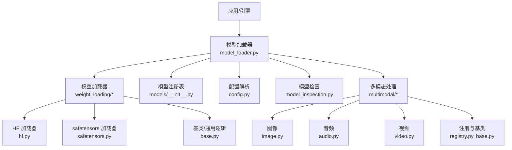
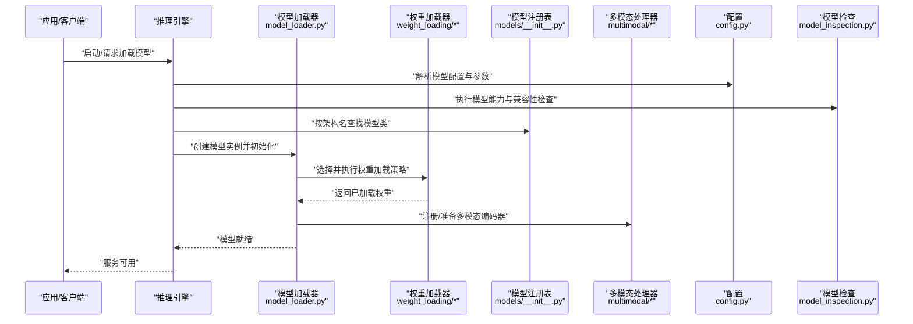
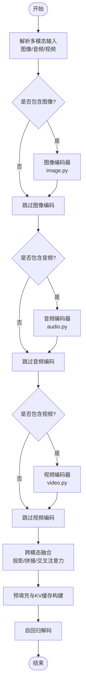
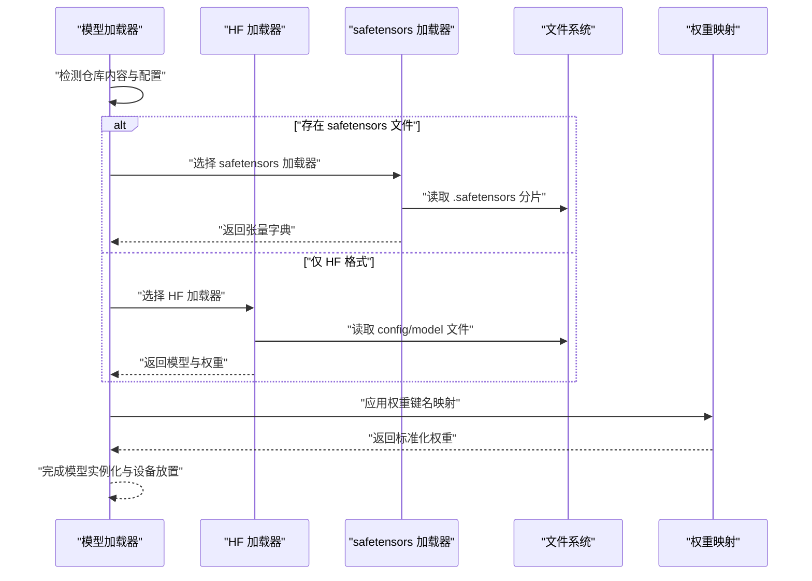
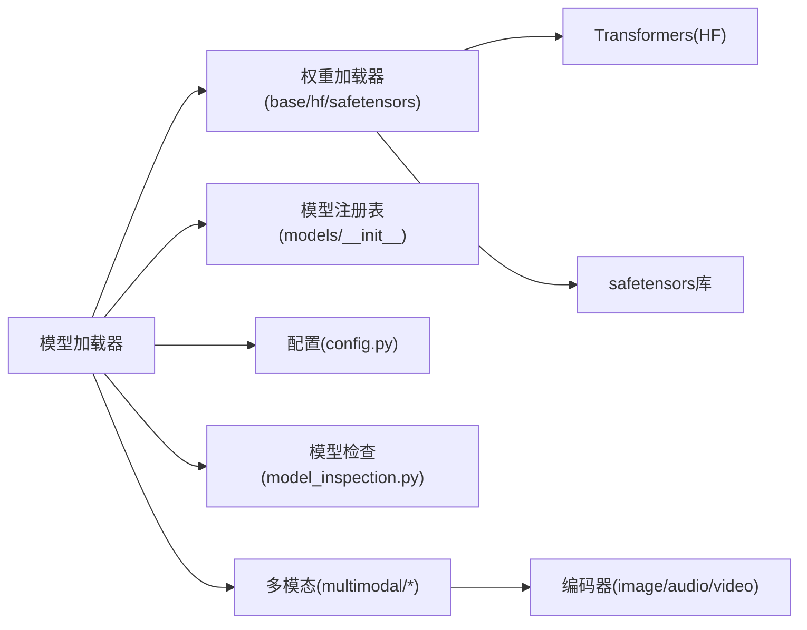

# 模型支持

<cite>
**本文引用的文件**   
- [vllm/models/__init__.py](file://vllm/models/__init__.py)
- [vllm/model_executor/model_loader.py](file://vllm/model_executor/model_loader.py)
- [vllm/model_executor/model_loader.py](file://vllm/model_executor/model_loader.py)
- [vllm/model_executor/weight_loading/base.py](file://vllm/model_executor/weight_loading/base.py)
- [vllm/model_executor/weight_loading/hf.py](file://vllm/model_executor/weight_loading/hf.py)
- [vllm/model_executor/weight_loading/safetensors.py](file://vllm/model_executor/weight_loading/safetensors.py)
- [vllm/multimodal/registry.py](file://vllm/multimodal/registry.py)
- [vllm/multimodal/base.py](file://vllm/multimodal/base.py)
- [vllm/multimodal/image.py](file://vllm/multimodal/image.py)
- [vllm/multimodal/audio.py](file://vllm/multimodal/audio.py)
- [vllm/multimodal/video.py](file://vllm/multimodal/video.py)
- [vllm/config.py](file://vllm/config.py)
- [vllm/model_inspection.py](file://vllm/model_inspection.py)
- [tests/model_executor/test_model_load_with_params.py](file://tests/model_executor/test_model_load_with_params.py)
- [tests/model_executor/test_weight_utils.py](file://tests/model_executor/test_weight_utils.py)
- [docs/models/generative_models.md](file://docs/models/generative_models.md)
- [docs/models/supported_models.md](file://docs/models/supported_models.md)
- [docs/design/mm_processing.md](file://docs/design/mm_processing.md)
- [docs/features/multimodal_inputs.md](file://docs/features/multimodal_inputs.md)
</cite>

## 目录
1. [简介](#简介)
2. [项目结构](#项目结构)
3. [核心组件](#核心组件)
4. [架构总览](#架构总览)
5. [详细组件分析](#详细组件分析)
6. [依赖关系分析](#依赖关系分析)
7. [性能考量](#性能考量)
8. [故障排查指南](#故障排查指南)
9. [结论](#结论)
10. [附录](#附录)

## 简介
本文件系统性梳理 vLLM 对模型架构与格式的支持，覆盖生成式模型（如 Llama、Qwen、DeepSeek 等）、嵌入模型与多模态模型的配置与使用；详解模型加载机制（HuggingFace、safetensors、自定义格式转换）；提供新模型集成指南（注册、权重映射、特殊层处理）；说明量化模型加载与优化（INT8、FP8、混合精度）；并给出多模态模型的处理流程（图像、音频、视频编码与融合），以及兼容性检查与调试工具的使用方法。

## 项目结构
围绕“模型支持”的关键代码与文档主要分布在以下位置：
- 模型注册与发现：vllm/models 包入口与注册表
- 模型加载器：vllm/model_executor/model_loader.py 及 weight_loading 子模块
- 多模态输入与编码器：vllm/multimodal 包
- 配置与参数：vllm/config.py
- 模型检查与诊断：vllm/model_inspection.py
- 测试用例：tests/model_executor/* 中关于加载与权重的用例
- 文档：docs/models/* 与 docs/design/*、docs/features/*

图表来源
- [vllm/model_executor/model_loader.py](file://vllm/model_executor/model_loader.py)
- [vllm/model_executor/weight_loading/hf.py](file://vllm/model_executor/weight_loading/hf.py)
- [vllm/model_executor/weight_loading/safetensors.py](file://vllm/model_executor/weight_loading/safetensors.py)
- [vllm/model_executor/weight_loading/base.py](file://vllm/model_executor/weight_loading/base.py)
- [vllm/models/__init__.py](file://vllm/models/__init__.py)
- [vllm/config.py](file://vllm/config.py)
- [vllm/model_inspection.py](file://vllm/model_inspection.py)
- [vllm/multimodal/registry.py](file://vllm/multimodal/registry.py)
- [vllm/multimodal/base.py](file://vllm/multimodal/base.py)
- [vllm/multimodal/image.py](file://vllm/multimodal/image.py)
- [vllm/multimodal/audio.py](file://vllm/multimodal/audio.py)
- [vllm/multimodal/video.py](file://vllm/multimodal/video.py)

章节来源
- [vllm/models/__init__.py](file://vllm/models/__init__.py)
- [vllm/model_executor/model_loader.py](file://vllm/model_executor/model_loader.py)
- [vllm/config.py](file://vllm/config.py)
- [vllm/model_inspection.py](file://vllm/model_inspection.py)
- [vllm/multimodal/registry.py](file://vllm/multimodal/registry.py)
- [vllm/multimodal/base.py](file://vllm/multimodal/base.py)
- [vllm/multimodal/image.py](file://vllm/multimodal/image.py)
- [vllm/multimodal/audio.py](file://vllm/multimodal/audio.py)
- [vllm/multimodal/video.py](file://vllm/multimodal/video.py)

## 核心组件
- 模型注册与发现
  - 通过 models 包的注册表将具体模型类与架构名绑定，便于按名称动态实例化。
  - 支持按任务类型（生成、嵌入、评分等）进行区分与选择。
- 模型加载器
  - model_loader.py 负责根据配置与仓库信息选择合适的权重加载策略，协调 HF/safetensors/自定义加载器。
  - 统一抽象出权重加载接口，便于扩展新的权重格式或映射规则。
- 权重加载器
  - hf.py：基于 HuggingFace Transformers 的模型与配置读取，适配常见命名规范与分片。
  - safetensors.py：直接读取 safetensors 张量文件，提升加载效率与安全性。
  - base.py：定义统一的权重加载基类与通用工具（如分片遍历、设备放置、类型转换）。
- 多模态处理
  - multimodal 包提供图像、音频、视频的统一输入接口与编码器注册，支持在推理前进行预处理与特征对齐。
- 配置与检查
  - config.py 集中管理模型相关参数（并行、精度、KV Cache、多模态开关等）。
  - model_inspection.py 提供模型结构检查、能力探测与兼容性校验工具。

章节来源
- [vllm/models/__init__.py](file://vllm/models/__init__.py)
- [vllm/model_executor/model_loader.py](file://vllm/model_executor/model_loader.py)
- [vllm/model_executor/weight_loading/base.py](file://vllm/model_executor/weight_loading/base.py)
- [vllm/model_executor/weight_loading/hf.py](file://vllm/model_executor/weight_loading/hf.py)
- [vllm/model_executor/weight_loading/safetensors.py](file://vllm/model_executor/weight_loading/safetensors.py)
- [vllm/multimodal/registry.py](file://vllm/multimodal/registry.py)
- [vllm/multimodal/base.py](file://vllm/multimodal/base.py)
- [vllm/config.py](file://vllm/config.py)
- [vllm/model_inspection.py](file://vllm/model_inspection.py)

## 架构总览
下图展示从“引擎调用”到“模型加载与执行”的整体流程，包括多模态输入与权重加载路径。

图表来源
- [vllm/model_executor/model_loader.py](file://vllm/model_executor/model_loader.py)
- [vllm/model_executor/weight_loading/base.py](file://vllm/model_executor/weight_loading/base.py)
- [vllm/model_executor/weight_loading/hf.py](file://vllm/model_executor/weight_loading/hf.py)
- [vllm/model_executor/weight_loading/safetensors.py](file://vllm/model_executor/weight_loading/safetensors.py)
- [vllm/models/__init__.py](file://vllm/models/__init__.py)
- [vllm/multimodal/registry.py](file://vllm/multimodal/registry.py)
- [vllm/config.py](file://vllm/config.py)
- [vllm/model_inspection.py](file://vllm/model_inspection.py)

## 详细组件分析

### 生成式模型支持与配置
- 支持的架构类别
  - 主流解码器架构（如 Llama、Qwen、DeepSeek 等）均通过模型注册表暴露，可按架构名加载。
  - 生成式模型通常包含词表、注意力块、FFN、归一化层与可选 MoE/MLA 等组件。
- 配置要点
  - 上下文长度、注意力后端、KV Cache 策略、并行策略（张量/流水线/专家并行）、采样参数等。
  - 多模态开关与分辨率/帧率等超参需与模型期望一致。
- 使用方式
  - 通过引擎 API 指定模型路径或仓库名，结合配置文件自动推断架构与加载策略。
  - 针对特定模型可覆盖默认配置（如 rope 缩放、激活函数、MoE 路由阈值等）。

章节来源
- [docs/models/generative_models.md](file://docs/models/generative_models.md)
- [docs/models/supported_models.md](file://docs/models/supported_models.md)
- [vllm/config.py](file://vllm/config.py)
- [vllm/models/__init__.py](file://vllm/models/__init__.py)

### 嵌入模型与池化
- 嵌入模型通常以编码器为主，配合池化策略（均值/CLS/最后一层隐藏状态）得到向量表示。
- vLLM 在 pooling 与 embedding 场景下提供专用入口与参数，支持批量高效推理。
- 配置项包括维度、归一化、是否输出 logits、是否启用缓存等。

章节来源
- [docs/models/pooling_models/*.md](file://docs/models/pooling_models/)
- [vllm/config.py](file://vllm/config.py)

### 多模态模型处理流程
- 输入类型
  - 图像：分辨率、裁剪、归一化、Patch 大小等。
  - 音频：采样率、声道数、分帧与特征提取（如 Whisper 风格）。
  - 视频：帧序列、时间步采样、时序编码。
- 编码器与融合
  - 各模态编码器独立运行，输出特征后由文本解码器侧进行跨模态融合（如投影、拼接、交叉注意力）。
  - 多模态注册表统一管理编码器实现与输入契约。
- 运行时行为
  - 预填充阶段完成多模态特征计算与 KV 缓存构建；解码阶段复用缓存并逐步生成文本。

图表来源
- [vllm/multimodal/image.py](file://vllm/multimodal/image.py)
- [vllm/multimodal/audio.py](file://vllm/multimodal/audio.py)
- [vllm/multimodal/video.py](file://vllm/multimodal/video.py)
- [vllm/multimodal/registry.py](file://vllm/multimodal/registry.py)
- [vllm/multimodal/base.py](file://vllm/multimodal/base.py)

章节来源
- [docs/design/mm_processing.md](file://docs/design/mm_processing.md)
- [docs/features/multimodal_inputs.md](file://docs/features/multimodal_inputs.md)
- [vllm/multimodal/registry.py](file://vllm/multimodal/registry.py)
- [vllm/multimodal/base.py](file://vllm/multimodal/base.py)
- [vllm/multimodal/image.py](file://vllm/multimodal/image.py)
- [vllm/multimodal/audio.py](file://vllm/multimodal/audio.py)
- [vllm/multimodal/video.py](file://vllm/multimodal/video.py)

### 模型加载机制与格式转换
- 加载流程
  - 根据模型仓库信息与配置选择权重加载器（HF/safetensors/自定义）。
  - 加载器按分片顺序读取权重，进行必要的类型转换与设备放置。
  - 对于需要映射的权重键名，执行映射规则以适配 vLLM 内部结构。
- 支持的格式
  - HuggingFace 格式：兼容 Transformers 的模型结构与配置。
  - safetensors 格式：高效安全的张量存储，适合大规模权重分发。
  - 自定义格式：通过扩展权重加载器实现特定格式的解析与映射。
- 转换过程
  - 若仓库为 HF 格式但希望以 safetensors 方式加载，加载器会优先尝试 safetensors 文件；否则回退至 HF 读取。
  - 对于非标准命名或分片策略，可通过映射表或钩子函数进行修正。

图表来源
- [vllm/model_executor/model_loader.py](file://vllm/model_executor/model_loader.py)
- [vllm/model_executor/weight_loading/hf.py](file://vllm/model_executor/weight_loading/hf.py)
- [vllm/model_executor/weight_loading/safetensors.py](file://vllm/model_executor/weight_loading/safetensors.py)
- [vllm/model_executor/weight_loading/base.py](file://vllm/model_executor/weight_loading/base.py)

章节来源
- [vllm/model_executor/model_loader.py](file://vllm/model_executor/model_loader.py)
- [vllm/model_executor/weight_loading/hf.py](file://vllm/model_executor/weight_loading/hf.py)
- [vllm/model_executor/weight_loading/safetensors.py](file://vllm/model_executor/weight_loading/safetensors.py)
- [vllm/model_executor/weight_loading/base.py](file://vllm/model_executor/weight_loading/base.py)

### 新模型集成指南
- 模型注册
  - 在 models 注册表中添加新架构名与对应模型类的映射。
  - 确保模型类实现 vLLM 要求的接口（如 forward、get_num_layers、vocab_size 等）。
- 权重映射
  - 若权重键名与 vLLM 不一致，需在权重加载器中补充映射规则。
  - 对于分片或不同布局的权重，需实现相应的重排与合并逻辑。
- 特殊层处理
  - 针对 MoE、MLA、RoPE 变体、自定义激活等，需在模型类中正确实现或接入相应内核。
  - 必要时扩展配置项并在加载时生效。
- 验证与测试
  - 编写单元测试覆盖加载、前向、多模态输入与量化路径。
  - 使用模型检查工具验证结构与能力。

章节来源
- [vllm/models/__init__.py](file://vllm/models/__init__.py)
- [vllm/model_executor/weight_loading/base.py](file://vllm/model_executor/weight_loading/base.py)
- [vllm/model_inspection.py](file://vllm/model_inspection.py)

### 量化模型加载与优化（INT8、FP8、混合精度）
- 量化类型
  - INT8：常用于权重或激活的整数量化，降低内存带宽压力。
  - FP8：新一代低精度浮点，兼顾精度与吞吐，适用于高性能 GPU。
  - 混合精度：不同层采用不同精度（如注意力 FP8、FFN BF16），平衡质量与性能。
- 加载与优化
  - 权重加载器识别量化元数据并按目标精度进行反量化或原地计算。
  - 内核层面提供量化 GEMM、量化激活融合等优化路径。
- 配置与开关
  - 通过配置项选择量化策略、缩放因子、校准数据集等。
  - 在模型检查阶段验证量化兼容性与数值稳定性。

章节来源
- [vllm/model_executor/weight_loading/base.py](file://vllm/model_executor/weight_loading/base.py)
- [vllm/model_inspection.py](file://vllm/model_inspection.py)
- [tests/model_executor/test_weight_utils.py](file://tests/model_executor/test_weight_utils.py)

### 多模态模型兼容性检查与调试工具
- 兼容性检查
  - 使用模型检查工具验证输入尺寸、编码器能力、融合层是否存在。
  - 检查配置项是否与模型期望一致（如分辨率、帧率、采样率）。
- 调试手段
  - 开启详细日志，观察多模态特征形状与数据类型。
  - 使用测试用例复现问题，定位加载或前向阶段的异常。
  - 针对量化模型，检查缩放因子与数值范围是否符合预期。

章节来源
- [vllm/model_inspection.py](file://vllm/model_inspection.py)
- [tests/model_executor/test_model_load_with_params.py](file://tests/model_executor/test_model_load_with_params.py)
- [tests/model_executor/test_weight_utils.py](file://tests/model_executor/test_weight_utils.py)

## 依赖关系分析
- 组件耦合
  - 模型加载器依赖权重加载器与模型注册表，解耦了格式与架构。
  - 多模态处理器通过注册表与模型侧融合层交互，保持输入契约一致性。
- 外部依赖
  - HuggingFace Transformers：用于读取 HF 格式模型与配置。
  - safetensors：用于高效安全地加载张量文件。
  - 底层内核：CUDA/ROCm/Triton 等加速注意力、GEMM、量化算子。
- 潜在循环依赖
  - 通过接口抽象与延迟导入避免循环依赖。
- 扩展点
  - 新增权重格式：实现权重加载器基类接口。
  - 新增多模态编码器：在 multimodal 注册表中注册并实现输入/输出契约。

图表来源
- [vllm/model_executor/model_loader.py](file://vllm/model_executor/model_loader.py)
- [vllm/model_executor/weight_loading/base.py](file://vllm/model_executor/weight_loading/base.py)
- [vllm/model_executor/weight_loading/hf.py](file://vllm/model_executor/weight_loading/hf.py)
- [vllm/model_executor/weight_loading/safetensors.py](file://vllm/model_executor/weight_loading/safetensors.py)
- [vllm/models/__init__.py](file://vllm/models/__init__.py)
- [vllm/config.py](file://vllm/config.py)
- [vllm/model_inspection.py](file://vllm/model_inspection.py)
- [vllm/multimodal/registry.py](file://vllm/multimodal/registry.py)
- [vllm/multimodal/image.py](file://vllm/multimodal/image.py)
- [vllm/multimodal/audio.py](file://vllm/multimodal/audio.py)
- [vllm/multimodal/video.py](file://vllm/multimodal/video.py)

章节来源
- [vllm/model_executor/model_loader.py](file://vllm/model_executor/model_loader.py)
- [vllm/model_executor/weight_loading/base.py](file://vllm/model_executor/weight_loading/base.py)
- [vllm/model_executor/weight_loading/hf.py](file://vllm/model_executor/weight_loading/hf.py)
- [vllm/model_executor/weight_loading/safetensors.py](file://vllm/model_executor/weight_loading/safetensors.py)
- [vllm/models/__init__.py](file://vllm/models/__init__.py)
- [vllm/config.py](file://vllm/config.py)
- [vllm/model_inspection.py](file://vllm/model_inspection.py)
- [vllm/multimodal/registry.py](file://vllm/multimodal/registry.py)
- [vllm/multimodal/image.py](file://vllm/multimodal/image.py)
- [vllm/multimodal/audio.py](file://vllm/multimodal/audio.py)
- [vllm/multimodal/video.py](file://vllm/multimodal/video.py)

## 性能考量
- 加载性能
  - 优先使用 safetensors 以减少 I/O 与序列化开销。
  - 合理设置分片大小与并发读取，避免内存峰值过高。
- 推理性能
  - 选择合适注意力后端与 KV Cache 策略。
  - 利用量化（INT8/FP8）与混合精度降低显存占用与带宽压力。
  - 多模态输入预处理与编码尽量批量化，减少重复计算。
- 编译与内核
  - 启用 Torch Compile 或 Triton 内核以提升热点路径性能。
  - 针对 MoE/MLA 等特殊层使用专用内核。

[本节为通用指导，不直接分析具体文件]

## 故障排查指南
- 常见问题
  - 模型无法识别：检查架构名与注册表映射是否正确。
  - 权重加载失败：确认文件格式与分片完整性，检查键名映射。
  - 多模态输入错误：核对输入尺寸、数据类型与编码器配置。
  - 量化数值异常：检查缩放因子、校准数据与内核兼容性。
- 调试步骤
  - 启用详细日志，定位异常堆栈。
  - 使用模型检查工具验证结构与能力。
  - 通过最小化测试用例复现问题，逐步隔离原因。
- 参考用例
  - 查看 tests/model_executor 中的加载与权重相关测试，对照自身配置与数据。

章节来源
- [vllm/model_inspection.py](file://vllm/model_inspection.py)
- [tests/model_executor/test_model_load_with_params.py](file://tests/model_executor/test_model_load_with_params.py)
- [tests/model_executor/test_weight_utils.py](file://tests/model_executor/test_weight_utils.py)

## 结论
vLLM 通过清晰的模型注册、灵活的权重加载器与完善的多模态框架，提供了对主流生成式、嵌入与多模态模型的高性能支持。借助量化与混合精度优化，用户可在保证精度的同时获得更高的吞吐与更低的资源消耗。遵循本文的集成与调试指南，可快速扩展新模型并稳定部署生产环境。

[本节为总结性内容，不直接分析具体文件]

## 附录
- 常用命令与示例
  - 离线推理与在线服务入口请参考 examples 与 docs/cli。
  - 多模态示例请参考 examples/generate/multimodal 与 docs/features/multimodal_inputs.md。
- 参考文档
  - 生成式模型与多模态设计文档详见 docs/models 与 docs/design。

[本节为补充信息，不直接分析具体文件]