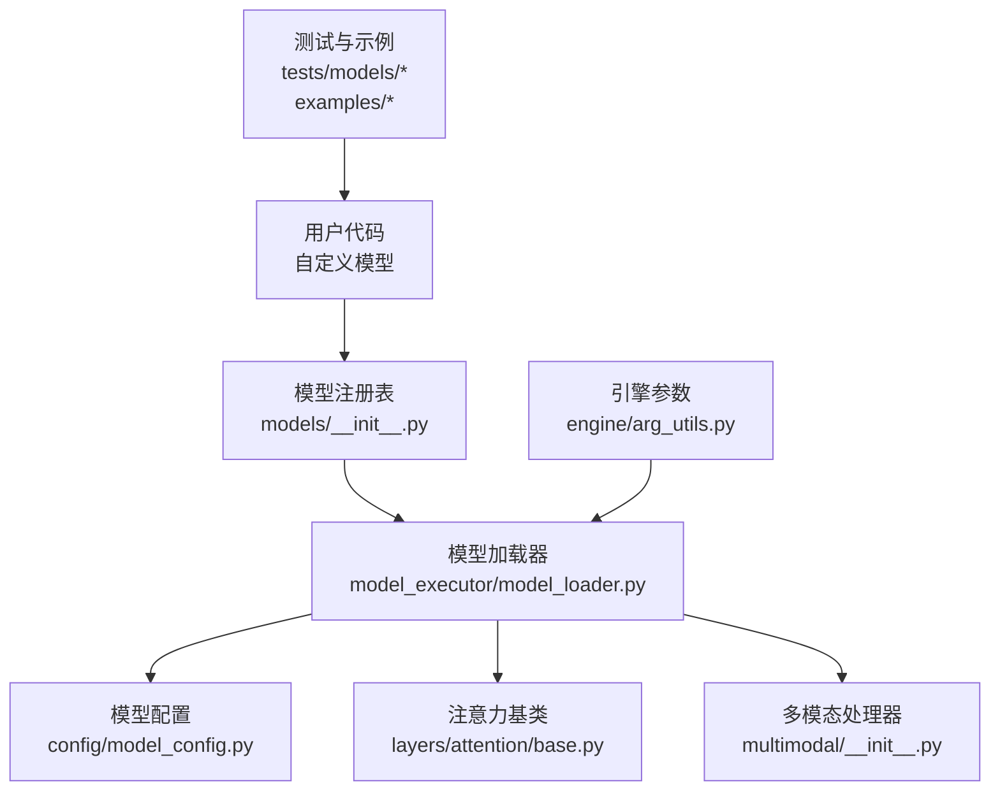
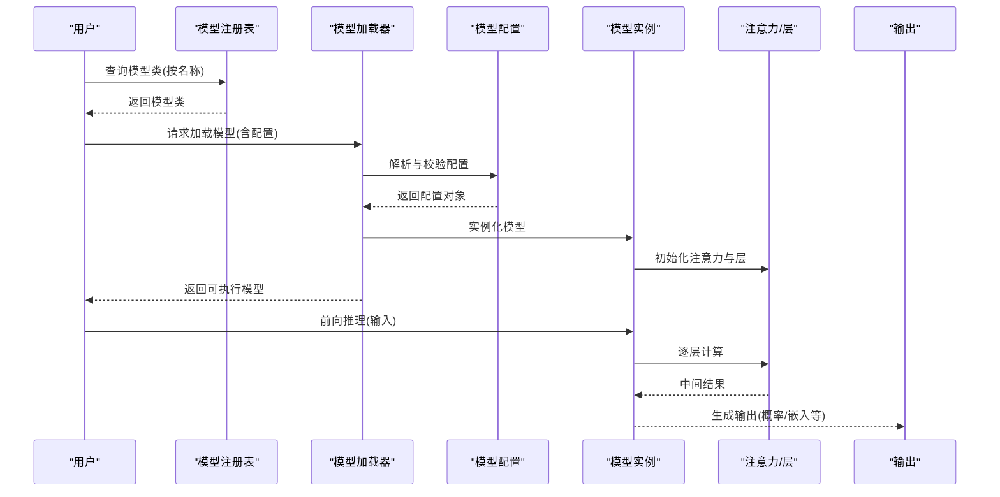
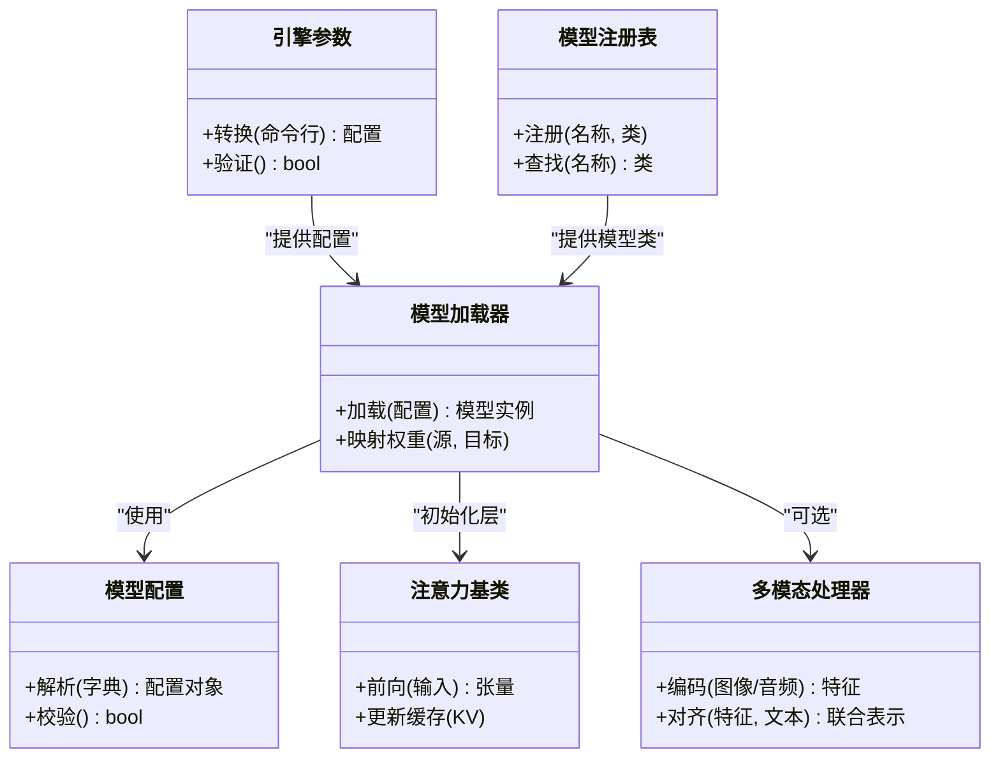

# 自定义模型集成

<cite>
**本文引用的文件**   
- [vllm/models/__init__.py](file://vllm/models/__init__.py)
- [vllm/model_executor/model_loader.py](file://vllm/model_executor/model_loader.py)
- [vllm/model_executor/layers/attention/base.py](file://vllm/model_executor/layers/attention/base.py)
- [vllm/multimodal/__init__.py](file://vllm/multimodal/__init__.py)
- [vllm/config/model_config.py](file://vllm/config/model_config.py)
- [vllm/engine/arg_utils.py](file://vllm/engine/arg_utils.py)
- [tests/models/test_models.py](file://tests/models/test_models.py)
- [examples/generate/multimodal/multimodal_example.py](file://examples/generate/multimodal/multimodal_example.py)
- [docs/design/custom_op.md](file://docs/design/custom_op.md)
- [docs/design/huggingface_integration.md](file://docs/design/huggingface_integration.md)
- [docs/models/generative_models.md](file://docs/models/generative_models.md)
- [docs/features/multimodal_inputs.md](file://docs/features/multimodal_inputs.md)
</cite>

## 目录
1. [简介](#简介)
2. [项目结构](#项目结构)
3. [核心组件](#核心组件)
4. [架构总览](#架构总览)
5. [详细组件分析](#详细组件分析)
6. [依赖关系分析](#依赖关系分析)
7. [性能与内存优化](#性能与内存优化)
8. [故障排查指南](#故障排查指南)
9. [结论](#结论)
10. [附录](#附录)

## 简介
本指南面向希望在 vLLM 中集成新自定义模型的开发者，系统阐述模型注册机制、模型类实现要求（必需方法与属性）、特殊层处理与自定义算子集成、权重映射与配置文件编写、测试与调试工具使用，以及性能优化与内存使用最佳实践。内容覆盖从简单生成式模型到复杂多模态模型的完整开发路径。

## 项目结构
vLLM 的模型相关代码主要分布在以下模块：
- models：模型定义与注册入口
- model_executor：模型加载器、执行器与层抽象
- multimodal：多模态输入处理与对齐
- config：模型配置解析与校验
- engine：引擎参数与启动流程
- tests/examples：测试与示例脚本

图表来源
- [vllm/models/__init__.py](file://vllm/models/__init__.py)
- [vllm/model_executor/model_loader.py](file://vllm/model_executor/model_loader.py)
- [vllm/config/model_config.py](file://vllm/config/model_config.py)
- [vllm/model_executor/layers/attention/base.py](file://vllm/model_executor/layers/attention/base.py)
- [vllm/multimodal/__init__.py](file://vllm/multimodal/__init__.py)
- [vllm/engine/arg_utils.py](file://vllm/engine/arg_utils.py)

章节来源
- [vllm/models/__init__.py](file://vllm/models/__init__.py)
- [vllm/model_executor/model_loader.py](file://vllm/model_executor/model_loader.py)
- [vllm/config/model_config.py](file://vllm/config/model_config.py)
- [vllm/model_executor/layers/attention/base.py](file://vllm/model_executor/layers/attention/base.py)
- [vllm/multimodal/__init__.py](file://vllm/multimodal/__init__.py)
- [vllm/engine/arg_utils.py](file://vllm/engine/arg_utils.py)

## 核心组件
- 模型注册表：集中管理模型名称到类的映射，支持按名称动态实例化。
- 模型加载器：负责读取配置、构建模型图、加载权重并准备推理上下文。
- 注意力基类：提供统一的注意力接口，便于替换或扩展注意力实现。
- 多模态处理器：统一处理图像、音频等模态的输入与特征对齐。
- 模型配置：解析模型超参、量化、并行策略等关键配置项。
- 引擎参数：将命令行/程序参数转换为引擎运行所需配置。

章节来源
- [vllm/models/__init__.py](file://vllm/models/__init__.py)
- [vllm/model_executor/model_loader.py](file://vllm/model_executor/model_loader.py)
- [vllm/model_executor/layers/attention/base.py](file://vllm/model_executor/layers/attention/base.py)
- [vllm/multimodal/__init__.py](file://vllm/multimodal/__init__.py)
- [vllm/config/model_config.py](file://vllm/config/model_config.py)
- [vllm/engine/arg_utils.py](file://vllm/engine/arg_utils.py)

## 架构总览
下图展示从用户调用到模型执行的端到端流程，包括注册、加载、配置、执行与输出。

图表来源
- [vllm/models/__init__.py](file://vllm/models/__init__.py)
- [vllm/model_executor/model_loader.py](file://vllm/model_executor/model_loader.py)
- [vllm/config/model_config.py](file://vllm/config/model_config.py)
- [vllm/model_executor/layers/attention/base.py](file://vllm/model_executor/layers/attention/base.py)

## 详细组件分析

### 模型注册机制
- 注册表职责：维护“模型名称 -> 模型类”的映射；在模型加载时根据名称查找对应类。
- 新增模型步骤：
  - 在注册表中添加新模型名称与类的映射。
  - 确保模型类遵循 vLLM 的模型接口约定（见下文）。
  - 若涉及多模态，需在多模态处理器中注册对应的输入类型与对齐逻辑。
- 注意事项：
  - 避免循环导入；必要时延迟导入。
  - 名称需唯一且稳定，便于配置与文档引用。

章节来源
- [vllm/models/__init__.py](file://vllm/models/__init__.py)
- [vllm/multimodal/__init__.py](file://vllm/multimodal/__init__.py)

### 模型类实现要求
- 必需方法：
  - 构造方法：接收配置对象，完成网络结构与参数的初始化。
  - 前向方法：接受标准化输入（文本/多模态），返回 logits 或嵌入向量。
  - 可选钩子：如缓存 KV、采样控制、特殊 token 处理等。
- 必需属性：
  - 词表大小、隐藏维度、注意力头数、层数等基础维度信息。
  - 是否支持多模态、是否启用特定优化（如 FlashAttention、MLA）的标志位。
- 设计建议：
  - 将注意力、MoE、归一化等拆分为独立层，便于替换与复用。
  - 保持输入张量形状与数据类型的一致性，减少运行时转换开销。

章节来源
- [vllm/model_executor/layers/attention/base.py](file://vllm/model_executor/layers/attention/base.py)

### 注意力与特殊层处理
- 注意力基类提供统一接口，允许替换为不同后端（如 FlashAttention、自定义 CUDA/Triton 内核）。
- 特殊层（如 MoE、RMSNorm、RoPE）应遵循 vLLM 的层抽象，确保与执行器兼容。
- 自定义算子集成：
  - 通过 vLLM 的自定义算子机制注册新算子，并在层中调用。
  - 注意算子的输入输出形状、数据类型与设备一致性。

章节来源
- [vllm/model_executor/layers/attention/base.py](file://vllm/model_executor/layers/attention/base.py)
- [docs/design/custom_op.md](file://docs/design/custom_op.md)

### 多模态模型集成
- 多模态处理器负责：
  - 解析多模态输入（图像、音频、视频等）。
  - 将不同模态特征对齐到文本空间。
  - 与模型前向流程无缝衔接。
- 开发步骤：
  - 在多模态注册表中声明新的模态类型。
  - 实现模态编码器与对齐器。
  - 在模型类中接入多模态输入分支。

章节来源
- [vllm/multimodal/__init__.py](file://vllm/multimodal/__init__.py)
- [docs/features/multimodal_inputs.md](file://docs/features/multimodal_inputs.md)

### 权重映射与配置文件
- 权重映射：
  - 将外部权重格式（如 HuggingFace）映射到 vLLM 内部命名约定。
  - 支持分片加载、量化权重、LoRA 适配器等。
- 配置文件：
  - 定义模型架构、并行策略、量化选项、注意力后端等。
  - 通过模型配置模块进行解析与校验。

章节来源
- [vllm/model_executor/model_loader.py](file://vllm/model_executor/model_loader.py)
- [vllm/config/model_config.py](file://vllm/config/model_config.py)
- [docs/design/huggingface_integration.md](file://docs/design/huggingface_integration.md)

### 引擎参数与启动流程
- 引擎参数将用户输入转换为模型加载与执行所需的配置。
- 支持分布式并行、显存优化、编译选项等高级特性。

章节来源
- [vllm/engine/arg_utils.py](file://vllm/engine/arg_utils.py)

## 依赖关系分析

图表来源
- [vllm/models/__init__.py](file://vllm/models/__init__.py)
- [vllm/model_executor/model_loader.py](file://vllm/model_executor/model_loader.py)
- [vllm/config/model_config.py](file://vllm/config/model_config.py)
- [vllm/model_executor/layers/attention/base.py](file://vllm/model_executor/layers/attention/base.py)
- [vllm/multimodal/__init__.py](file://vllm/multimodal/__init__.py)
- [vllm/engine/arg_utils.py](file://vllm/engine/arg_utils.py)

章节来源
- [vllm/models/__init__.py](file://vllm/models/__init__.py)
- [vllm/model_executor/model_loader.py](file://vllm/model_executor/model_loader.py)
- [vllm/config/model_config.py](file://vllm/config/model_config.py)
- [vllm/model_executor/layers/attention/base.py](file://vllm/model_executor/layers/attention/base.py)
- [vllm/multimodal/__init__.py](file://vllm/multimodal/__init__.py)
- [vllm/engine/arg_utils.py](file://vllm/engine/arg_utils.py)

## 性能与内存优化
- 注意力后端选择：优先启用 FlashAttention 或平台优化后端。
- 量化与压缩：使用 INT8/FP8/NVFP4 等量化方案降低显存占用。
- KV 缓存管理：合理设置块大小、分页策略与缓存命中率优化。
- 编译与融合：启用 Torch Compile 与内核融合减少 Python 开销。
- 并行策略：根据硬件选择张量并行、流水线并行或专家并行。
- 内存监控：使用 vLLM 内置指标与 Profiler 定位瓶颈。

[本节为通用指导，不直接分析具体文件]

## 故障排查指南
- 常见问题：
  - 模型名称未注册：检查注册表映射是否正确。
  - 配置解析失败：核对配置字段与类型。
  - 权重加载错误：确认权重格式与映射规则。
  - 多模态输入异常：检查模态编码器与对齐逻辑。
- 调试工具：
  - 单元测试：参考 tests/models 中的用例模板。
  - 示例脚本：参考 examples/generate/multimodal 中的用法。
  - 日志与指标：启用详细日志与性能指标收集。

章节来源
- [tests/models/test_models.py](file://tests/models/test_models.py)
- [examples/generate/multimodal/multimodal_example.py](file://examples/generate/multimodal/multimodal_example.py)

## 结论
通过遵循 vLLM 的模型注册机制、模型类接口约定、注意力与多模态抽象、权重映射与配置规范，开发者可以高效集成自定义模型。结合性能优化与调试工具，可实现从简单生成式模型到复杂多模态模型的稳定部署。

[本节为总结性内容，不直接分析具体文件]

## 附录
- 生成式模型参考：[docs/models/generative_models.md](file://docs/models/generative_models.md)
- 多模态输入指南：[docs/features/multimodal_inputs.md](file://docs/features/multimodal_inputs.md)
- 自定义算子设计：[docs/design/custom_op.md](file://docs/design/custom_op.md)
- HuggingFace 集成：[docs/design/huggingface_integration.md](file://docs/design/huggingface_integration.md)