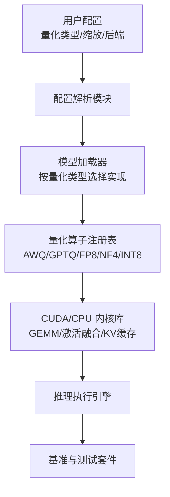
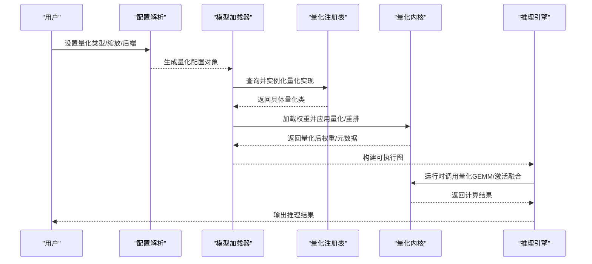
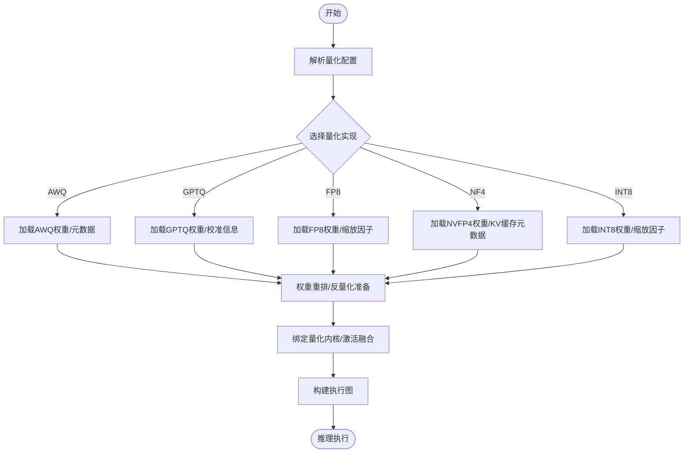
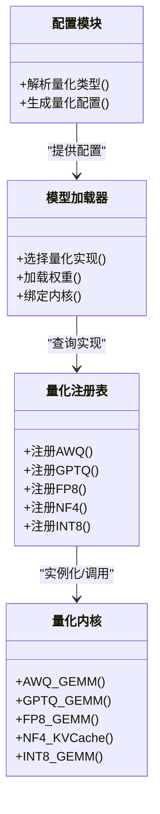

# 量化模型支持

<cite>
**本文引用的文件**   
- [vllm/config.py](file://vllm/config.py)
- [vllm/model_executor/model_loader.py](file://vllm/model_executor/model_loader.py)
- [vllm/model_executor/layers/quantization/__init__.py](file://vllm/model_executor/layers/quantization/__init__.py)
- [vllm/model_executor/layers/quantization/utils.py](file://vllm/model_executor/layers/quantization/utils.py)
- [vllm/model_executor/layers/quantization/awq.py](file://vllm/model_executor/layers/quantization/awq.py)
- [vllm/model_executor/layers/quantization/gptq.py](file://vllm/model_executor/layers/quantization/gptq.py)
- [vllm/model_executor/layers/quantization/fp8.py](file://vllm/model_executor/layers/quantization/fp8.py)
- [vllm/model_executor/layers/quantization/nf4.py](file://vllm/model_executor/layers/quantization/nf4.py)
- [vllm/model_executor/layers/quantization/int8.py](file://vllm/model_executor/layers/quantization/int8.py)
- [csrc/libtorch_stable/quantization/awq.cu](file://csrc/libtorch_stable/quantization/awq.cu)
- [csrc/libtorch_stable/quantization/gptq.cu](file://csrc/libtorch_stable/quantization/gptq.cu)
- [csrc/libtorch_stable/quantization/fp8.cu](file://csrc/libtorch_stable/quantization/fp8.cu)
- [csrc/libtorch_stable/quantization/nvfp4.cu](file://csrc/libtorch_stable/quantization/nvfp4.cu)
- [benchmarks/kernels/benchmark_quant.py](file://benchmarks/kernels/benchmark_quant.py)
- [tests/quantization/test_awq_int4_to_int8.py](file://tests/quantization/test_awq_int4_to_int8.py)
- [tests/quantization/test_fused_quant_activation.py](file://tests/quantization/test_fused_quant_activation.py)
</cite>

## 目录
1. [简介](#简介)
2. [项目结构](#项目结构)
3. [核心组件](#核心组件)
4. [架构总览](#架构总览)
5. [详细组件分析](#详细组件分析)
6. [依赖关系分析](#依赖关系分析)
7. [性能考量](#性能考量)
8. [故障排查指南](#故障排查指南)
9. [结论](#结论)
10. [附录](#附录)

## 简介
本文件系统性梳理 vLLM 对量化模型的全面支持，覆盖 INT8、FP8、NF4、AWQ、GPTQ 等主流量化格式。内容涵盖：
- 量化模型的加载、转换与优化流程
- 不同量化方法的适用场景与性能特点
- 配置选项与调优参数
- 精度评估与质量检查工具
- 内存使用与推理速度优化建议
- 常见问题诊断与解决方案

## 项目结构
vLLM 的量化能力由“配置解析—模型加载—量化内核—基准与测试”四层协同实现：
- 配置层：统一解析量化类型、缩放策略、后端选择等参数
- 加载层：根据配置动态注册并实例化对应量化算子与权重装载器
- 内核层：提供 CUDA/CPU 端的高效 GEMM、激活融合、KV Cache 等内核
- 基准与测试：覆盖性能回归、数值正确性与端到端集成验证

图表来源
- [vllm/config.py:1-200](file://vllm/config.py#L1-L200)
- [vllm/model_executor/model_loader.py:1-200](file://vllm/model_executor/model_loader.py#L1-L200)
- [vllm/model_executor/layers/quantization/__init__.py:1-120](file://vllm/model_executor/layers/quantization/__init__.py#L1-L120)

章节来源
- [vllm/config.py:1-200](file://vllm/config.py#L1-L200)
- [vllm/model_executor/model_loader.py:1-200](file://vllm/model_executor/model_loader.py#L1-L200)
- [vllm/model_executor/layers/quantization/__init__.py:1-120](file://vllm/model_executor/layers/quantization/__init__.py#L1-L120)

## 核心组件
- 配置与参数
  - 量化类型（INT8、FP8、NF4、AWQ、GPTQ）
  - 缩放粒度（逐通道/逐块/逐令牌）
  - 后端选择（CUDA、ROCm、CPU）
  - 激活融合开关、KV Cache 量化开关
- 模型加载器
  - 依据配置动态选择量化实现
  - 权重反量化/重排、张量布局适配
- 量化算子与内核
  - AWQ：低比特权重量化 + 高效反量化 GEMM
  - GPTQ：离线校准 + 稀疏 Hessian 近似
  - FP8：硬件原生 FP8 GEMM/Attention
  - NF4：NVIDIA NVFP4 KV Cache 与 GEMM 加速
  - INT8：通用 W8A8/W8A16 路径
- 基准与测试
  - 单算子/融合算子基准
  - 数值正确性回归测试

章节来源
- [vllm/model_executor/layers/quantization/utils.py:1-150](file://vllm/model_executor/layers/quantization/utils.py#L1-L150)
- [vllm/model_executor/layers/quantization/awq.py:1-200](file://vllm/model_executor/layers/quantization/awq.py#L1-L200)
- [vllm/model_executor/layers/quantization/gptq.py:1-200](file://vllm/model_executor/layers/quantization/gptq.py#L1-L200)
- [vllm/model_executor/layers/quantization/fp8.py:1-200](file://vllm/model_executor/layers/quantization/fp8.py#L1-L200)
- [vllm/model_executor/layers/quantization/nf4.py:1-200](file://vllm/model_executor/layers/quantization/nf4.py#L1-L200)
- [vllm/model_executor/layers/quantization/int8.py:1-200](file://vllm/model_executor/layers/quantization/int8.py#L1-L200)

## 架构总览
下图展示从配置到推理执行的端到端数据流，以及各量化路径的关键节点。

图表来源
- [vllm/config.py:1-200](file://vllm/config.py#L1-L200)
- [vllm/model_executor/model_loader.py:1-200](file://vllm/model_executor/model_loader.py#L1-L200)
- [vllm/model_executor/layers/quantization/__init__.py:1-120](file://vllm/model_executor/layers/quantization/__init__.py#L1-L120)

## 详细组件分析

### 量化类型与适用场景
- INT8
  - 适用：通用 W8A8/W8A16 路径，CPU/ROCm/CUDA 均有良好支持
  - 特点：部署简单，兼容性强；需关注激活范围与校准集
- FP8
  - 适用：Hopper/Ada 等支持 FP8 的 GPU；注意力与 GEMM 原生加速
  - 特点：高吞吐、低延迟；需注意数值稳定性与缩放策略
- NF4 (NVFP4)
  - 适用：KV Cache 压缩与部分 GEMM 路径
  - 特点：显著降低显存占用；需要专用内核与对齐要求
- AWQ
  - 适用：离线量化权重，配合反量化内核
  - 特点：对大词表与长上下文友好；需保证校准集代表性
- GPTQ
  - 适用：离线校准，利用二阶信息提升精度
  - 特点：精度通常优于纯一阶方法；校准成本较高

章节来源
- [vllm/model_executor/layers/quantization/awq.py:1-200](file://vllm/model_executor/layers/quantization/awq.py#L1-L200)
- [vllm/model_executor/layers/quantization/gptq.py:1-200](file://vllm/model_executor/layers/quantization/gptq.py#L1-L200)
- [vllm/model_executor/layers/quantization/fp8.py:1-200](file://vllm/model_executor/layers/quantization/fp8.py#L1-L200)
- [vllm/model_executor/layers/quantization/nf4.py:1-200](file://vllm/model_executor/layers/quantization/nf4.py#L1-L200)
- [vllm/model_executor/layers/quantization/int8.py:1-200](file://vllm/model_executor/layers/quantization/int8.py#L1-L200)

### 加载与转换流程
- 配置阶段：解析量化类型、缩放粒度、后端、是否启用激活融合等
- 加载阶段：根据配置选择量化实现，完成权重反量化/重排与布局对齐
- 内核绑定：将量化 GEMM、激活融合、KV Cache 操作绑定至执行图
- 运行阶段：按批次调度内核，自动选择最优路径（如 FP8 GEMM vs BF16 fallback）

图表来源
- [vllm/model_executor/model_loader.py:1-200](file://vllm/model_executor/model_loader.py#L1-L200)
- [vllm/model_executor/layers/quantization/utils.py:1-150](file://vllm/model_executor/layers/quantization/utils.py#L1-L150)

章节来源
- [vllm/model_executor/model_loader.py:1-200](file://vllm/model_executor/model_loader.py#L1-L200)
- [vllm/model_executor/layers/quantization/utils.py:1-150](file://vllm/model_executor/layers/quantization/utils.py#L1-L150)

### 量化内核与实现要点
- AWQ
  - 权重以低比特存储，运行时反量化参与 GEMM
  - 关键：分组大小、通道对齐、内核选择
- GPTQ
  - 离线校准生成逆矩阵近似，减少量化误差
  - 关键：校准集规模、分块策略、稀疏度控制
- FP8
  - 原生 FP8 GEMM/Attention，注意缩放与溢出保护
  - 关键：E4M3/E5M2 选择、逐通道/逐块缩放
- NF4
  - NVFP4 用于 KV Cache 和部分 GEMM，显著降显存
  - 关键：块对齐、内核可用性、回退路径
- INT8
  - 通用路径，广泛可用；注意激活范围与校准
  - 关键：W8A8/W8A16 混合、逐令牌/逐块缩放

章节来源
- [csrc/libtorch_stable/quantization/awq.cu:1-200](file://csrc/libtorch_stable/quantization/awq.cu#L1-L200)
- [csrc/libtorch_stable/quantization/gptq.cu:1-200](file://csrc/libtorch_stable/quantization/gptq.cu#L1-L200)
- [csrc/libtorch_stable/quantization/fp8.cu:1-200](file://csrc/libtorch_stable/quantization/fp8.cu#L1-L200)
- [csrc/libtorch_stable/quantization/nvfp4.cu:1-200](file://csrc/libtorch_stable/quantization/nvfp4.cu#L1-L200)

### 配置选项与调优参数
- 量化类型：选择 AWQ/GPTQ/FP8/NF4/INT8
- 缩放粒度：逐通道/逐块/逐令牌
- 后端：CUDA/ROCm/CPU
- 激活融合：开启/关闭
- KV Cache 量化：开启/关闭（NF4/FP8）
- 校准相关（GPTQ/AWQ）：校准集大小、采样策略
- 性能开关：CUDA Graph、批调度、内存池

章节来源
- [vllm/config.py:1-200](file://vllm/config.py#L1-L200)

### 精度评估与质量检查
- 基准工具
  - 单算子基准：量化 GEMM、激活融合、KV Cache
  - 端到端基准：吞吐量、时延、显存占用
- 正确性测试
  - 数值对比：量化前后输出差异阈值
  - 回归测试：不同硬件/驱动版本一致性
- 推荐实践
  - 使用代表性校准集
  - 分层/分块统计激活分布
  - 多轮微调与再量化

章节来源
- [benchmarks/kernels/benchmark_quant.py:1-200](file://benchmarks/kernels/benchmark_quant.py#L1-L200)
- [tests/quantization/test_awq_int4_to_int8.py:1-200](file://tests/quantization/test_awq_int4_to_int8.py#L1-L200)
- [tests/quantization/test_fused_quant_activation.py:1-200](file://tests/quantization/test_fused_quant_activation.py#L1-L200)

### 内存使用与推理速度优化
- 内存优化
  - 启用 KV Cache 量化（NF4/FP8）
  - 合理设置批大小与序列长度
  - 使用内存池与分页注意力
- 速度优化
  - 优先选择硬件原生路径（FP8 GEMM/Attention）
  - 开启激活融合与 CUDA Graph
  - 调整分块大小与线程束配置

章节来源
- [vllm/model_executor/layers/quantization/fp8.py:1-200](file://vllm/model_executor/layers/quantization/fp8.py#L1-L200)
- [vllm/model_executor/layers/quantization/nf4.py:1-200](file://vllm/model_executor/layers/quantization/nf4.py#L1-L200)
- [benchmarks/kernels/benchmark_quant.py:1-200](file://benchmarks/kernels/benchmark_quant.py#L1-L200)

## 依赖关系分析
量化子系统内部依赖清晰：配置模块驱动加载器，加载器通过注册表选择具体量化实现，最终调用底层内核。

图表来源
- [vllm/config.py:1-200](file://vllm/config.py#L1-L200)
- [vllm/model_executor/model_loader.py:1-200](file://vllm/model_executor/model_loader.py#L1-L200)
- [vllm/model_executor/layers/quantization/__init__.py:1-120](file://vllm/model_executor/layers/quantization/__init__.py#L1-L120)

章节来源
- [vllm/config.py:1-200](file://vllm/config.py#L1-L200)
- [vllm/model_executor/model_loader.py:1-200](file://vllm/model_executor/model_loader.py#L1-L200)
- [vllm/model_executor/layers/quantization/__init__.py:1-120](file://vllm/model_executor/layers/quantization/__init__.py#L1-L120)

## 性能考量
- 硬件特性匹配
  - FP8：在支持 FP8 的 GPU 上优先使用
  - NF4：KV Cache 压缩效果显著，适合长上下文
  - AWQ/GPTQ：离线量化，适合部署阶段固定权重
- 内核选择与回退
  - 优先选择原生内核（FP8/NF4），否则回退到通用路径
- 批处理与图编译
  - 使用 CUDA Graph 与批调度减少启动开销
- 监控与调参
  - 基于基准工具观察吞吐与时延
  - 调整缩放粒度与分块大小平衡精度与速度

[本节为通用指导，不直接分析具体文件]

## 故障排查指南
- 加载失败
  - 检查量化类型与权重格式是否匹配
  - 确认后端与驱动版本满足内核需求
- 精度异常
  - 校准集是否充分代表真实分布
  - 缩放粒度是否合适（逐通道/逐块/逐令牌）
- 性能不达预期
  - 是否启用了合适的内核（FP8/NF4）
  - 批大小、序列长度、激活融合是否合理
- 常见错误定位
  - 查看内核日志与基准输出
  - 使用正确性测试用例逐步隔离问题

章节来源
- [benchmarks/kernels/benchmark_quant.py:1-200](file://benchmarks/kernels/benchmark_quant.py#L1-L200)
- [tests/quantization/test_awq_int4_to_int8.py:1-200](file://tests/quantization/test_awq_int4_to_int8.py#L1-L200)
- [tests/quantization/test_fused_quant_activation.py:1-200](file://tests/quantization/test_fused_quant_activation.py#L1-L200)

## 结论
vLLM 提供了完善的量化模型支持体系，覆盖多种主流量化格式与后端。通过统一的配置解析、灵活的加载机制与高效的内核实现，用户可在精度、速度与资源之间取得良好平衡。建议结合基准与测试工具进行持续评估与调优，确保生产环境的稳定与高效。

[本节为总结性内容，不直接分析具体文件]

## 附录
- 快速上手清单
  - 确定目标硬件与支持的量化格式
  - 选择合适的量化方法与缩放粒度
  - 准备代表性校准集（AWQ/GPTQ）
  - 运行基准与正确性测试
  - 根据结果调优参数并部署

[本节为补充说明，不直接分析具体文件]