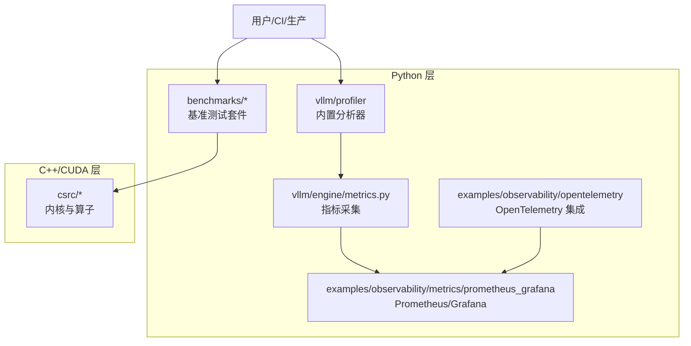
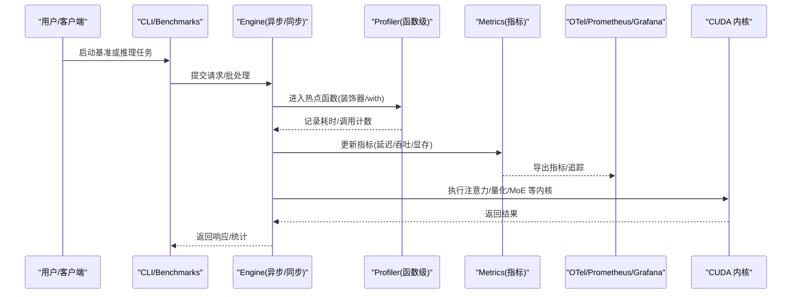
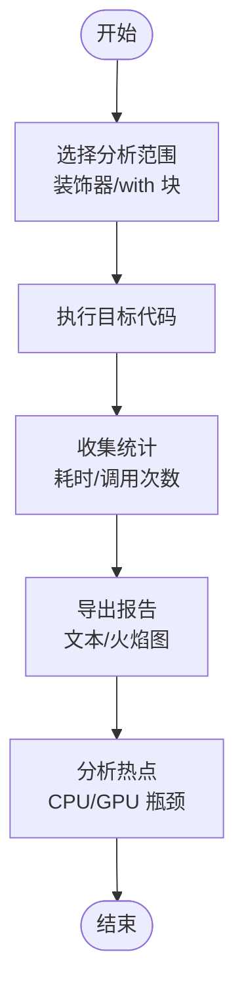
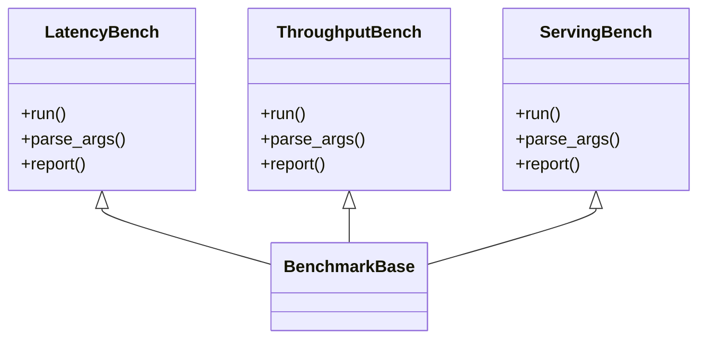
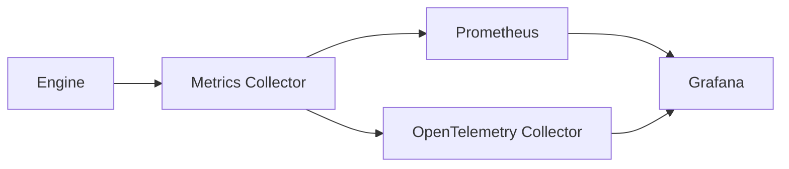
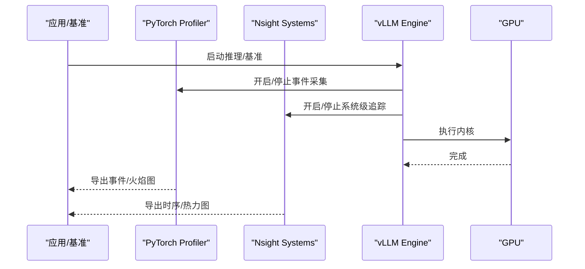
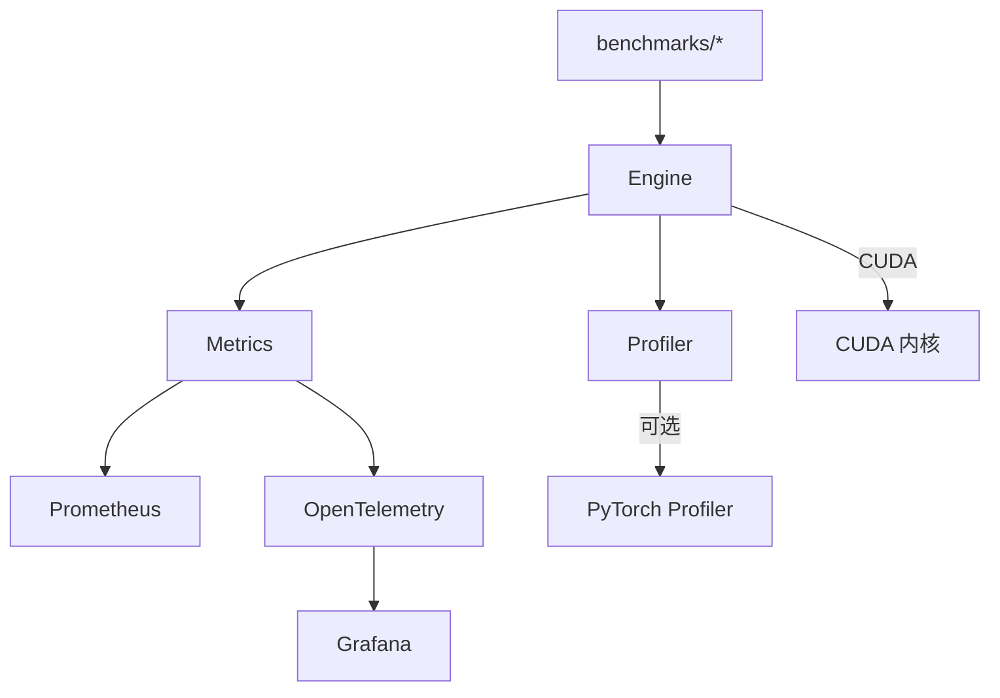

# 性能分析

<cite>
**本文引用的文件**   
- [vllm/profiler/__init__.py](file://vllm/profiler/__init__.py)
- [vllm/profiler/profiler.py](file://vllm/profiler/profiler.py)
- [benchmarks/benchmark_latency.py](file://benchmarks/benchmark_latency.py)
- [benchmarks/benchmark_throughput.py](file://benchmarks/benchmark_throughput.py)
- [benchmarks/benchmark_serving.py](file://benchmarks/benchmark_serving.py)
- [benchmarks/README.md](file://benchmarks/README.md)
- [docs/benchmarking/cli.md](file://docs/benchmarking/cli.md)
- [docs/benchmarking/dashboard.md](file://docs/benchmarking/dashboard.md)
- [examples/observability/metrics/prometheus_grafana/grafana_dashboard.json](file://examples/observability/metrics/prometheus_grafana/grafana_dashboard.json)
- [examples/observability/opentelemetry/vllm_opentelemetry.py](file://examples/observability/opentelemetry/vllm_opentelemetry.py)
- [vllm/engine/metrics.py](file://vllm/engine/metrics.py)
- [vllm/engine/async_llm_engine.py](file://vllm/engine/async_llm_engine.py)
- [vllm/engine/llm_engine.py](file://vllm/engine/llm_engine.py)
- [scripts/benchmark_helion_kernels.py](file://scripts/benchmark_helion_kernels.py)
- [tools/profiler/profiler.py](file://tools/profiler/profiler.py)
</cite>

## 目录
1. [简介](#简介)
2. [项目结构](#项目结构)
3. [核心组件](#核心组件)
4. [架构总览](#架构总览)
5. [详细组件分析](#详细组件分析)
6. [依赖关系分析](#依赖关系分析)
7. [性能考量](#性能考量)
8. [故障排查指南](#故障排查指南)
9. [结论](#结论)
10. [附录](#附录)

## 简介
本文件系统性介绍 vLLM 的性能分析与 Profiling 能力，覆盖以下主题：
- 使用内置性能分析器识别 CPU/GPU 瓶颈（函数级热点、内存使用）
- GPU 性能分析工具链（Nsight Systems、PyTorch Profiler）的使用与报告解读
- 关键指标收集与可视化（吞吐量、延迟、显存、GPU 利用率等）
- 性能回归测试的自动化方案（基准脚本编写与执行）
- 生产环境非侵入式监控实践
- 命令行工具示例与优化建议

## 项目结构
vLLM 在 Python 层提供 profiler 模块与 benchmark 套件，并在 C++/CUDA 层暴露大量可测内核。观测与可观测性通过 metrics 与 OpenTelemetry/Prometheus/Grafana 集成实现。

图表来源
- [vllm/profiler/__init__.py](file://vllm/profiler/__init__.py)
- [vllm/profiler/profiler.py](file://vllm/profiler/profiler.py)
- [benchmarks/benchmark_latency.py](file://benchmarks/benchmark_latency.py)
- [benchmarks/benchmark_throughput.py](file://benchmarks/benchmark_throughput.py)
- [benchmarks/benchmark_serving.py](file://benchmarks/benchmark_serving.py)
- [vllm/engine/metrics.py](file://vllm/engine/metrics.py)
- [examples/observability/opentelemetry/vllm_opentelemetry.py](file://examples/observability/opentelemetry/vllm_opentelemetry.py)
- [examples/observability/metrics/prometheus_grafana/grafana_dashboard.json](file://examples/observability/metrics/prometheus_grafana/grafana_dashboard.json)

章节来源
- [benchmarks/README.md](file://benchmarks/README.md)
- [docs/benchmarking/cli.md](file://docs/benchmarking/cli.md)

## 核心组件
- 内置性能分析器（profiler）
  - 提供上下文管理器与装饰器，用于按函数粒度记录耗时与调用次数，支持导出为火焰图或文本报告。
  - 典型用法：以装饰器包裹热点函数，或以 with 语句包裹代码块，运行后输出汇总统计。
- 基准测试套件（benchmarks）
  - latency/throughput/serving 三类基准，分别测量端到端延迟、吞吐与服务化请求处理。
  - 支持多种模型与参数扫描，便于回归对比与容量规划。
- 指标与可观测性（metrics + OpenTelemetry + Prometheus/Grafana）
  - 引擎侧暴露标准指标（如请求数、延迟分位、显存占用、队列长度等）。
  - 通过 OpenTelemetry 导出追踪，配合 Prometheus 抓取与 Grafana 可视化。

章节来源
- [vllm/profiler/__init__.py](file://vllm/profiler/__init__.py)
- [vllm/profiler/profiler.py](file://vllm/profiler/profiler.py)
- [benchmarks/benchmark_latency.py](file://benchmarks/benchmark_latency.py)
- [benchmarks/benchmark_throughput.py](file://benchmarks/benchmark_throughput.py)
- [benchmarks/benchmark_serving.py](file://benchmarks/benchmark_serving.py)
- [vllm/engine/metrics.py](file://vllm/engine/metrics.py)
- [examples/observability/opentelemetry/vllm_opentelemetry.py](file://examples/observability/opentelemetry/vllm_opentelemetry.py)

## 架构总览
下图展示从应用到内核层的性能数据采集路径：用户通过 CLI 或 API 触发推理；引擎层采集指标并上报；profiler 对热点进行函数级剖析；底层 CUDA/C++ 内核由 Nsight/PTX 工具链辅助定位。

图表来源
- [vllm/engine/async_llm_engine.py](file://vllm/engine/async_llm_engine.py)
- [vllm/engine/llm_engine.py](file://vllm/engine/llm_engine.py)
- [vllm/profiler/profiler.py](file://vllm/profiler/profiler.py)
- [vllm/engine/metrics.py](file://vllm/engine/metrics.py)
- [examples/observability/opentelemetry/vllm_opentelemetry.py](file://examples/observability/opentelemetry/vllm_opentelemetry.py)

## 详细组件分析

### 内置性能分析器（profiler）
- 功能要点
  - 函数级计时与调用计数，支持累积统计与采样。
  - 可与 PyTorch Profiler 联动，输出火焰图或事件表。
  - 适合定位预填充、解码、KV Cache 管理、调度器等热点。
- 使用方式
  - 装饰器模式：将热点函数用分析器装饰，运行后生成报告。
  - 上下文模式：在 with 块中记录一段代码段的耗时分布。
- 输出与解读
  - 自顶向下/自底向上的调用树，累计时间、平均时间、调用次数。
  - 结合 GPU 事件（Nsight/PTI）交叉验证是否受限于内核或调度。

章节来源
- [vllm/profiler/__init__.py](file://vllm/profiler/__init__.py)
- [vllm/profiler/profiler.py](file://vllm/profiler/profiler.py)

### 基准测试套件（benchmarks）
- 延迟基准（benchmark_latency.py）
  - 测量端到端首 token 与尾 token 延迟，支持不同 batch size、序列长度、采样策略。
  - 适用于回归测试与容量评估。
- 吞吐基准（benchmark_throughput.py）
  - 固定负载下测量稳定吞吐（tokens/s），支持并发度与 KV Cache 配置扫描。
- 服务化基准（benchmark_serving.py）
  - 模拟真实请求到达模式（泊松/突发），评估排队、调度与资源竞争影响。
- 执行与结果
  - 通过 CLI 或 Python API 运行，输出 CSV/JSON 与图表。
  - 可结合 CI 自动对比基线，检测性能回归。

章节来源
- [benchmarks/benchmark_latency.py](file://benchmarks/benchmark_latency.py)
- [benchmarks/benchmark_throughput.py](file://benchmarks/benchmark_throughput.py)
- [benchmarks/benchmark_serving.py](file://benchmarks/benchmark_serving.py)
- [benchmarks/README.md](file://benchmarks/README.md)

### 指标采集与可视化（metrics + OTel + Prometheus/Grafana）
- 指标内容
  - 请求计数、延迟分位（p50/p90/p99）、吞吐、显存峰值/均值、队列长度、失败率等。
- 采集与导出
  - Engine 层周期性更新指标，Prometheus 抓取；OpenTelemetry 导出分布式追踪。
- 可视化
  - Grafana Dashboard 提供开箱即用的面板，涵盖延迟、吞吐、显存、GPU 利用率等。

图表来源
- [vllm/engine/metrics.py](file://vllm/engine/metrics.py)
- [examples/observability/opentelemetry/vllm_opentelemetry.py](file://examples/observability/opentelemetry/vllm_opentelemetry.py)
- [examples/observability/metrics/prometheus_grafana/grafana_dashboard.json](file://examples/observability/metrics/prometheus_grafana/grafana_dashboard.json)

章节来源
- [vllm/engine/metrics.py](file://vllm/engine/metrics.py)
- [examples/observability/opentelemetry/vllm_opentelemetry.py](file://examples/observability/opentelemetry/vllm_opentelemetry.py)
- [examples/observability/metrics/prometheus_grafana/grafana_dashboard.json](file://examples/observability/metrics/prometheus_grafana/grafana_dashboard.json)

### GPU 性能分析工具（Nsight Systems、PyTorch Profiler）
- Nsight Systems
  - 捕获 CPU/GPU 事件、内核执行、内存拷贝、通信（NCCL）等，生成时序视图与火焰图。
  - 推荐场景：定位内核启动开销、PCIe/NVLink 瓶颈、多卡通信热点。
- PyTorch Profiler
  - 记录算子级耗时、CUDA 事件、内存分配，支持导出 JSON/HTML 并与 vLLM profiler 互补。
  - 推荐场景：定位 Python/C++/CUDA 边界开销、算子融合效果评估。

章节来源
- [benchmarks/benchmark_latency.py](file://benchmarks/benchmark_latency.py)
- [benchmarks/benchmark_throughput.py](file://benchmarks/benchmark_throughput.py)
- [benchmarks/benchmark_serving.py](file://benchmarks/benchmark_serving.py)

### 性能回归测试自动化
- 基准脚本
  - 使用 benchmarks 中的 latency/throughput/serving 脚本作为回归用例。
  - 通过参数化（模型、batch size、序列长度、后端）生成矩阵用例。
- 执行与对比
  - 在 CI 中运行基准，保存结果至工件；与基线对比阈值（如 p99 延迟、吞吐下降）。
  - 失败时阻断合并，附带差异报告与火焰图。
- 扩展
  - 自定义数据集与负载模型，覆盖长上下文、多模态、MoE 等场景。

章节来源
- [benchmarks/README.md](file://benchmarks/README.md)
- [scripts/benchmark_helion_kernels.py](file://scripts/benchmark_helion_kernels.py)

### 生产环境非侵入式监控
- 指标与追踪
  - 启用 Prometheus 抓取与 OpenTelemetry 导出，零代码侵入（仅配置环境变量/启动参数）。
- 告警与看板
  - 基于 Grafana 面板设置阈值告警（延迟、错误率、显存水位、队列积压）。
- 安全与成本
  - 限制采样率与导出频率，避免对线上性能造成显著影响。

章节来源
- [examples/observability/opentelemetry/vllm_opentelemetry.py](file://examples/observability/opentelemetry/vllm_opentelemetry.py)
- [examples/observability/metrics/prometheus_grafana/grafana_dashboard.json](file://examples/observability/metrics/prometheus_grafana/grafana_dashboard.json)

## 依赖关系分析
- 组件耦合
  - Engine 负责指标上报与调度；Profiler 通过装饰器/上下文注入；Benchmark 驱动 Engine 并解析结果。
- 外部依赖
  - PyTorch Profiler、Nsight Systems、Prometheus、OpenTelemetry、Grafana。
- 潜在循环依赖
  - 无直接循环；Profiler 与 Engine 解耦，通过回调/上下文传递数据。

图表来源
- [benchmarks/benchmark_latency.py](file://benchmarks/benchmark_latency.py)
- [benchmarks/benchmark_throughput.py](file://benchmarks/benchmark_throughput.py)
- [benchmarks/benchmark_serving.py](file://benchmarks/benchmark_serving.py)
- [vllm/engine/metrics.py](file://vllm/engine/metrics.py)
- [vllm/profiler/profiler.py](file://vllm/profiler/profiler.py)
- [examples/observability/opentelemetry/vllm_opentelemetry.py](file://examples/observability/opentelemetry/vllm_opentelemetry.py)

章节来源
- [benchmarks/README.md](file://benchmarks/README.md)
- [docs/benchmarking/cli.md](file://docs/benchmarking/cli.md)

## 性能考量
- 预热与稳定性
  - 首次运行包含编译/图构建开销，应丢弃前若干次样本再统计。
- 负载建模
  - 使用真实请求分布（长度、并发、采样策略）提升回归有效性。
- 资源隔离
  - 单独进程/容器运行基准，避免宿主噪声干扰。
- 指标口径
  - 明确定义吞吐（tokens/s vs requests/s）、延迟（TTFT、ITL、E2E）与显存（峰值/均值）。

[本节为通用指导，不直接分析具体文件]

## 故障排查指南
- 常见问题
  - 吞吐低但 GPU 利用率不高：检查 I/O、调度、通信瓶颈；使用 Nsight 查看空闲段。
  - 延迟抖动大：关注批大小变化、KV Cache 碎片、GC 与锁竞争；使用 profiler 定位热点。
  - 显存不足：降低 batch size、启用 KV offload、调整缓存策略。
- 诊断步骤
  - 先用内置 profiler 定位函数级热点；再用 PyTorch Profiler 细化算子；最后用 Nsight 观察内核与通信。
  - 结合指标看板确认异常时段，复现实验并收敛问题。

章节来源
- [vllm/profiler/profiler.py](file://vllm/profiler/profiler.py)
- [vllm/engine/metrics.py](file://vllm/engine/metrics.py)

## 结论
vLLM 提供了从函数级剖析到系统级追踪的完整性能分析体系：内置 profiler 快速定位热点，基准套件支撑回归与容量规划，指标与可视化保障生产可观测性。结合 Nsight 与 PyTorch Profiler，可高效识别 CPU/GPU 瓶颈并持续优化。

[本节为总结性内容，不直接分析具体文件]

## 附录

### 常用命令与示例（概念性说明）
- 延迟基准
  - 指定模型、序列长度、批大小，运行多次取分位数。
- 吞吐基准
  - 固定并发与负载，测量稳定 tokens/s，扫描 KV Cache 与并行度。
- 服务化基准
  - 模拟请求到达过程，评估排队与调度影响。
- 指标与看板
  - 启动 Prometheus/Grafana，导入默认 Dashboard，观察延迟、吞吐、显存、GPU 利用率。

章节来源
- [docs/benchmarking/cli.md](file://docs/benchmarking/cli.md)
- [benchmarks/README.md](file://benchmarks/README.md)
- [examples/observability/metrics/prometheus_grafana/grafana_dashboard.json](file://examples/observability/metrics/prometheus_grafana/grafana_dashboard.json)

### 性能优化建议
- 算法与内核
  - 启用合适的 attention 后端、量化与 MoE 优化，减少冗余计算与内存访问。
- 调度与批处理
  - 动态批大小、前缀缓存、KV Cache 压缩，降低内存与带宽压力。
- 系统与部署
  - 合理设置线程/进程数、NUMA 绑定、NCCL 参数，减少跨设备通信开销。
- 观测与迭代
  - 建立回归基线与告警，持续跟踪变更对性能的影响。

[本节为通用建议，不直接分析具体文件]