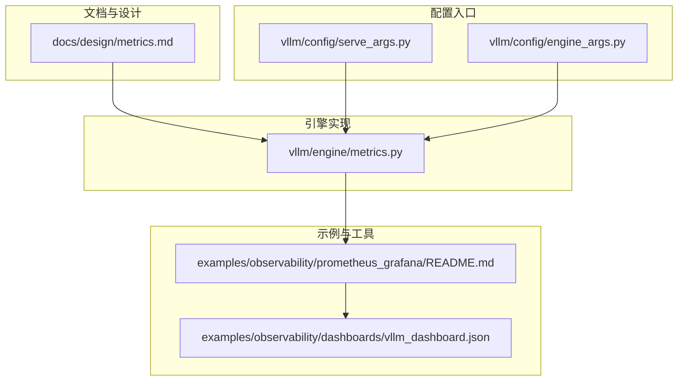
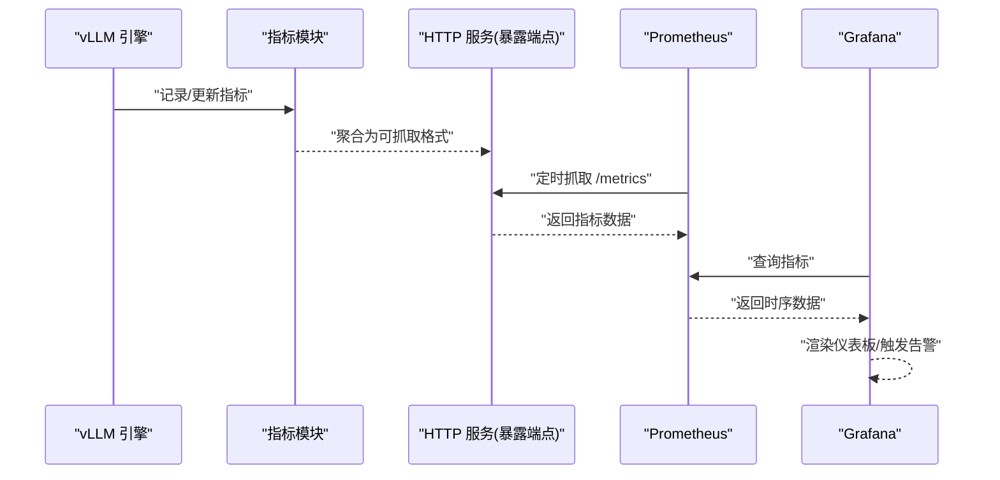
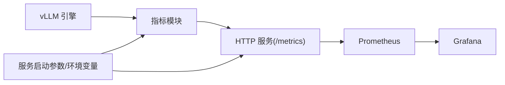

# 指标监控

<cite>
**本文引用的文件**   
- [metrics.md](file://docs/design/metrics.md)
- [metrics.py](file://vllm/engine/metrics.py)
- [prometheus_grafana/README.md](file://examples/observability/prometheus_grafana/README.md)
- [dashboard.json](file://examples/observability/dashboards/vllm_dashboard.json)
- [serve_args.py](file://vllm/config/serve_args.py)
- [engine_args.py](file://vllm/config/engine_args.py)
</cite>

## 目录
1. [简介](#简介)
2. [项目结构](#项目结构)
3. [核心组件](#核心组件)
4. [架构总览](#架构总览)
5. [详细组件分析](#详细组件分析)
6. [依赖关系分析](#依赖关系分析)
7. [性能考虑](#性能考虑)
8. [故障排查指南](#故障排查指南)
9. [结论](#结论)
10. [附录](#附录)

## 简介
本章节面向希望搭建与使用 vLLM 指标监控体系的读者，系统阐述内置指标类型（引擎指标、模型指标、资源使用指标、自定义指标）、Prometheus 集成方式（暴露端点与抓取配置）、Grafana 仪表板创建与配置、自定义指标定义与实现、告警规则配置（阈值与通知），以及完整的监控栈搭建与最佳实践。内容基于仓库中的设计文档与示例工程进行归纳总结，帮助读者快速落地可观测性方案。

## 项目结构
vLLM 的指标与可观测性相关内容主要分布在以下位置：
- 设计与说明文档：design/metrics.md
- 引擎侧指标实现：engine/metrics.py
- Prometheus/Grafana 示例：examples/observability/prometheus_grafana 与 examples/observability/dashboards
- 服务启动参数与环境变量：config/serve_args.py、config/engine_args.py

图表来源 
- [metrics.md](file://docs/design/metrics.md)
- [metrics.py](file://vllm/engine/metrics.py)
- [prometheus_grafana/README.md](file://examples/observability/prometheus_grafana/README.md)
- [dashboard.json](file://examples/observability/dashboards/vllm_dashboard.json)
- [serve_args.py](file://vllm/config/serve_args.py)
- [engine_args.py](file://vllm/config/engine_args.py)

章节来源
- [metrics.md](file://docs/design/metrics.md)
- [metrics.py](file://vllm/engine/metrics.py)
- [prometheus_grafana/README.md](file://examples/observability/prometheus_grafana/README.md)
- [dashboard.json](file://examples/observability/dashboards/vllm_dashboard.json)
- [serve_args.py](file://vllm/config/serve_args.py)
- [engine_args.py](file://vllm/config/engine_args.py)

## 核心组件
- 指标定义与采集：引擎层通过统一的指标模块注册并上报各类指标，包括请求级、批处理级、模型级与资源级指标。
- 暴露端点：服务启动时提供 HTTP 端点供 Prometheus 抓取，通常以 /metrics 路径暴露。
- 配置开关：通过服务启动参数或环境变量控制是否启用指标、端口、标签等。
- 可视化与告警：借助 Grafana 导入官方仪表板，结合 Prometheus 告警规则实现阈值与通知。

章节来源
- [metrics.py](file://vllm/engine/metrics.py)
- [serve_args.py](file://vllm/config/serve_args.py)
- [engine_args.py](file://vllm/config/engine_args.py)

## 架构总览
下图展示了从 vLLM 引擎到 Prometheus、再到 Grafana 的数据流与组件交互。

图表来源 
- [metrics.py](file://vllm/engine/metrics.py)
- [prometheus_grafana/README.md](file://examples/observability/prometheus_grafana/README.md)
- [dashboard.json](file://examples/observability/dashboards/vllm_dashboard.json)

## 详细组件分析

### 指标体系分类与含义
- 引擎指标：覆盖请求生命周期、批调度、队列长度、吞吐、延迟分位、错误率等。
- 模型指标：关注模型加载状态、KV Cache 占用、注意力计算相关统计、显存使用等。
- 资源使用指标：CPU、内存、GPU、网络 I/O、磁盘 I/O 等系统级指标。
- 自定义指标：业务维度（如租户、模型版本、路由策略）与领域 KPI（如成功率、首字延迟、缓存命中率）。

章节来源
- [metrics.md](file://docs/design/metrics.md)
- [metrics.py](file://vllm/engine/metrics.py)

### Prometheus 集成方法
- 暴露端点：服务启动后在指定端口提供 /metrics 端点，Prometheus 按周期抓取。
- 抓取配置：在 Prometheus 配置中声明目标、抓取间隔、标签映射等。
- 标签与维度：建议对模型名、实例 ID、任务类型等添加稳定标签，便于多维分析。
- 安全与访问控制：可通过反向代理或认证机制限制对外暴露。

章节来源
- [prometheus_grafana/README.md](file://examples/observability/prometheus_grafana/README.md)
- [serve_args.py](file://vllm/config/serve_args.py)

### Grafana 仪表板创建与配置
- 数据源：将 Prometheus 作为数据源接入 Grafana。
- 导入仪表板：使用提供的 JSON 模板一键导入，快速获得关键指标视图。
- 定制面板：根据业务需求增删面板、调整时间窗口与聚合函数。
- 权限与共享：设置团队访问权限，必要时导出模板用于多环境复用。

章节来源
- [dashboard.json](file://examples/observability/dashboards/vllm_dashboard.json)
- [prometheus_grafana/README.md](file://examples/observability/prometheus_grafana/README.md)

### 自定义指标定义与实现
- 指标类型选择：计数器（累计量）、直方图（分布）、摘要（分位数）、 Gauge（瞬时值）。
- 命名规范：采用前缀+模块+名称+单位，避免歧义与冲突。
- 标签设计：仅保留必要且稳定的维度，避免高基数导致存储压力。
- 采样与刷新：合理设置采样频率，避免高频写入影响性能。
- 测试与验证：在本地或预发环境验证指标准确性与稳定性。

章节来源
- [metrics.md](file://docs/design/metrics.md)
- [metrics.py](file://vllm/engine/metrics.py)

### 告警规则配置
- 阈值设定：基于历史基线与 SLA 目标确定阈值，区分警告与严重级别。
- 评估窗口：选择合适的滑动窗口与持续条件，降低误报。
- 通知渠道：对接邮件、企业微信、Slack、PagerDuty 等。
- 抑制与静默：针对已知问题设置抑制规则，减少噪音。
- 演练与回滚：定期演练告警流程，确保响应时效。

章节来源
- [prometheus_grafana/README.md](file://examples/observability/prometheus_grafana/README.md)

### 完整监控栈搭建指南
- 部署 Prometheus：容器化部署，持久化存储，合理配置抓取与保留策略。
- 暴露 vLLM 指标：在服务启动参数中启用指标端点，确认端口可达。
- 配置抓取：在 Prometheus 中添加 vLLM 目标，验证抓取成功。
- 接入 Grafana：配置数据源，导入仪表板，校验面板数据。
- 配置告警：编写规则，配置通知，进行端到端演练。
- 运维与优化：容量规划、索引优化、查询优化、成本管控。

章节来源
- [prometheus_grafana/README.md](file://examples/observability/prometheus_grafana/README.md)
- [dashboard.json](file://examples/observability/dashboards/vllm_dashboard.json)
- [serve_args.py](file://vllm/config/serve_args.py)

## 依赖关系分析
- 引擎与指标模块：引擎调用指标模块进行埋点，指标模块负责聚合与格式化。
- 服务与端点：HTTP 服务暴露 /metrics，供 Prometheus 抓取。
- 配置与启动：服务启动参数与环境变量决定指标开关、端口与标签。
- 可视化与告警：Grafana 依赖 Prometheus 数据源，仪表板与规则驱动展示与通知。

图表来源 
- [metrics.py](file://vllm/engine/metrics.py)
- [serve_args.py](file://vllm/config/serve_args.py)
- [prometheus_grafana/README.md](file://examples/observability/prometheus_grafana/README.md)

章节来源
- [metrics.py](file://vllm/engine/metrics.py)
- [serve_args.py](file://vllm/config/serve_args.py)
- [prometheus_grafana/README.md](file://examples/observability/prometheus_grafana/README.md)

## 性能考虑
- 指标写入开销：控制指标数量与标签基数，避免高频写入影响推理性能。
- 采样策略：对非关键指标采用降采样或批量上报。
- 存储与查询：合理设置 Prometheus 保留期与压缩策略，优化查询性能。
- 资源隔离：将监控组件与推理服务资源隔离，避免相互干扰。
- 容量规划：依据 QPS、指标基数与保留期估算存储与 CPU 需求。

[本节为通用指导，不直接分析具体文件]

## 故障排查指南
- 端点不可达：检查服务启动参数是否正确开启指标端点，防火墙与安全组放行。
- 抓取失败：确认 Prometheus 目标配置、网络连通性与证书配置。
- 指标缺失：核对埋点位置与标签维度，检查日志与错误码。
- 数据异常：验证时间戳、单位与聚合逻辑，定位异常请求或批次。
- 告警风暴：检查阈值与评估窗口，启用抑制与静默规则。

章节来源
- [prometheus_grafana/README.md](file://examples/observability/prometheus_grafana/README.md)
- [metrics.py](file://vllm/engine/metrics.py)

## 结论
通过 vLLM 内置指标与 Prometheus/Grafana 生态，可以构建覆盖引擎、模型与资源的完整监控体系。遵循命名与标签规范、合理配置抓取与告警、持续优化性能与成本，是保障线上稳定性的关键。建议在生产环境中逐步完善指标维度与告警策略，并结合业务场景定制仪表板与看板。

[本节为总结性内容，不直接分析具体文件]

## 附录
- 常用指标类别参考：请求类、批处理类、模型类、资源类、自定义类。
- 标签最佳实践：模型名、实例 ID、任务类型、区域/可用区。
- 告警模板：延迟 P99、吞吐下降、错误率上升、显存不足、队列积压。
- 仪表板模板：概览、延迟分布、吞吐趋势、资源水位、错误热点。

[本节为补充信息，不直接分析具体文件]