# 故障排查

<cite>
**本文引用的文件**   
- [vllm/exceptions.py](file://vllm/exceptions.py)
- [vllm/logger.py](file://vllm/logger.py)
- [vllm/envs.py](file://vllm/envs.py)
- [vllm/config/engine_args.py](file://vllm/config/engine_args.py)
- [vllm/model_executor/model_loader/loader.py](file://vllm/model_executor/model_loader/loader.py)
- [vllm/model_executor/model_loader/weight_utils.py](file://vllm/model_executor/model_loader/weight_utils.py)
- [vllm/distributed/parallel_state.py](file://vllm/distributed/parallel_state.py)
- [vllm/distributed/utils.py](file://vllm/distributed/utils.py)
- [vllm/profiler/profiler.py](file://vllm/profiler/profiler.py)
- [vllm/engine/llm_engine.py](file://vllm/engine/llm_engine.py)
- [vllm/engine/metrics.py](file://vllm/engine/metrics.py)
- [vllm/device_allocator/cumem_allocator.py](file://vllm/device_allocator/cumem_allocator.py)
- [vllm/platforms/nvidia.py](file://vllm/platforms/nvidia.py)
- [docs/usage/troubleshooting.md](file://docs/usage/troubleshooting.md)
- [docs/serving/distributed_troubleshooting.md](file://docs/serving/distributed_troubleshooting.md)
- [benchmarks/benchmark_serving.py](file://benchmarks/benchmark_serving.py)
- [examples/disaggregated/kv_load_failure_recovery_offline/main.py](file://examples/disaggregated/kv_load_failure_recovery_offline/main.py)
</cite>

## 目录
1. [简介](#简介)
2. [项目结构](#项目结构)
3. [核心组件](#核心组件)
4. [架构总览](#架构总览)
5. [详细组件分析](#详细组件分析)
6. [依赖关系分析](#依赖关系分析)
7. [性能注意事项](#性能注意事项)
8. [故障排查指南](#故障排查指南)
9. [结论](#结论)
10. [附录](#附录)

## 简介
本文件面向使用 vLLM 的工程师与运维人员，聚焦常见问题的诊断与解决方法，重点覆盖：
- 内存溢出（OOM）错误的排查步骤、显存泄漏检测、内存使用分析与优化建议
- 性能下降问题的分析方法：CPU/GPU 瓶颈识别、I/O 性能调优、网络延迟分析
- 模型加载失败的常见原因与解决方案：权重文件损坏、版本不兼容、依赖缺失等
- 分布式环境下的调试技巧：多进程通信问题、节点间同步问题、网络分区处理
- 堆栈跟踪信息的收集与分析方法，以及常用调试工具的使用
- 实际案例与分步解决流程

## 项目结构
vLLM 在代码组织上采用分层与模块化设计，便于定位问题：
- 异常与日志：统一的异常定义与日志配置，便于问题上报与追踪
- 引擎与执行器：负责请求调度、批处理、KV Cache 管理、采样等
- 模型加载器：权重下载、校验、分片加载、量化适配
- 分布式子系统：并行状态、通信原语、节点发现与同步
- 设备与平台抽象：GPU/CPU/XPU 等平台能力封装与资源管理
- 性能剖析与指标：内置 profiler、metrics 导出、基准测试脚本
- 文档与示例：故障排查、部署、分布式、离线推理等

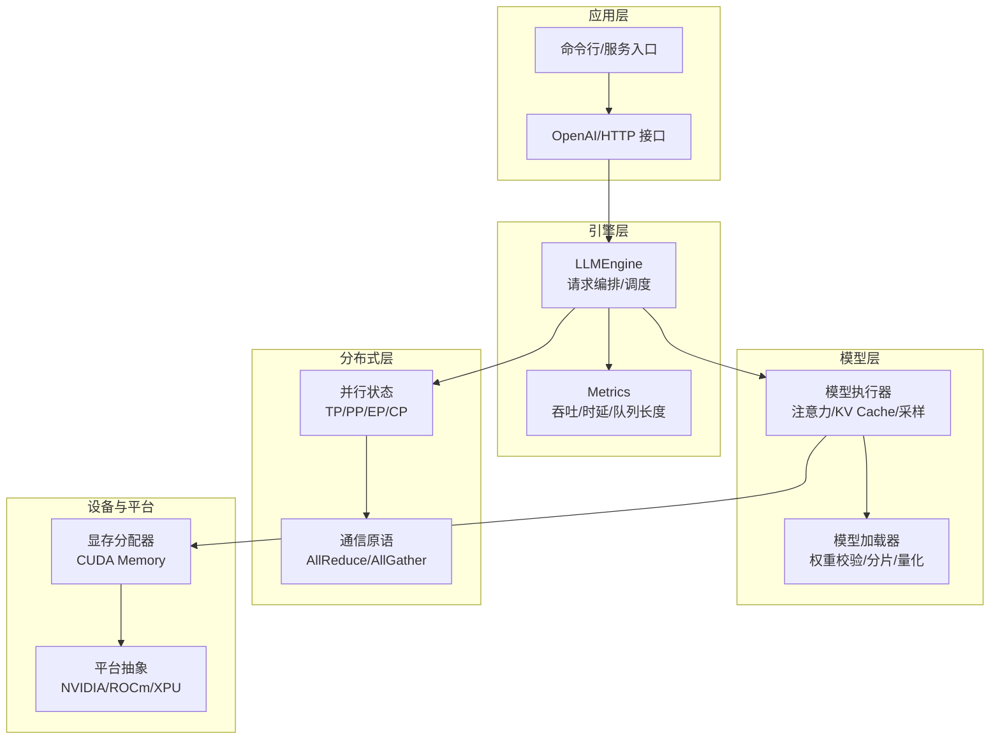

图表来源 
- [vllm/engine/llm_engine.py](file://vllm/engine/llm_engine.py)
- [vllm/model_executor/model_loader/loader.py](file://vllm/model_executor/model_loader/loader.py)
- [vllm/device_allocator/cumem_allocator.py](file://vllm/device_allocator/cumem_allocator.py)
- [vllm/distributed/parallel_state.py](file://vllm/distributed/parallel_state.py)

章节来源
- [vllm/engine/llm_engine.py](file://vllm/engine/llm_engine.py)
- [vllm/model_executor/model_loader/loader.py](file://vllm/model_executor/model_loader/loader.py)
- [vllm/device_allocator/cumem_allocator.py](file://vllm/device_allocator/cumem_allocator.py)
- [vllm/distributed/parallel_state.py](file://vllm/distributed/parallel_state.py)

## 核心组件
- 异常与日志
  - 统一异常类型与错误码，便于上层捕获与用户提示
  - 结构化日志输出，包含上下文信息（请求ID、批次大小、设备信息等）
- 引擎与执行器
  - LLMEngine 负责请求入队、调度策略、KV Cache 生命周期管理
  - 执行器调用底层算子（注意力、MoE、采样），并维护运行时状态
- 模型加载器
  - 支持从本地/远程路径加载权重，进行完整性校验、格式转换、分片分发
- 分布式子系统
  - 管理张量并行、流水线并行、专家并行、上下文并行的进程组与通信
- 设备与平台
  - 显存分配器封装 CUDA 内存池与碎片整理；平台抽象屏蔽硬件差异

章节来源
- [vllm/exceptions.py](file://vllm/exceptions.py)
- [vllm/logger.py](file://vllm/logger.py)
- [vllm/engine/llm_engine.py](file://vllm/engine/llm_engine.py)
- [vllm/model_executor/model_loader/loader.py](file://vllm/model_executor/model_loader/loader.py)
- [vllm/distributed/parallel_state.py](file://vllm/distributed/parallel_state.py)
- [vllm/device_allocator/cumem_allocator.py](file://vllm/device_allocator/cumem_allocator.py)

## 架构总览
下图展示一次推理请求的关键路径，涵盖调度、模型执行、显存管理与分布式通信。

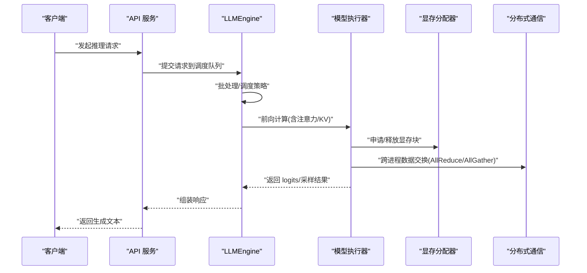

图表来源 
- [vllm/engine/llm_engine.py](file://vllm/engine/llm_engine.py)
- [vllm/device_allocator/cumem_allocator.py](file://vllm/device_allocator/cumem_allocator.py)
- [vllm/distributed/parallel_state.py](file://vllm/distributed/parallel_state.py)

## 详细组件分析

### 异常与日志体系
- 异常分类
  - 资源类异常（显存不足、权重加载失败）
  - 配置类异常（参数冲突、环境变量非法）
  - 分布式异常（进程组初始化失败、通信超时）
- 日志规范
  - 关键路径打点（请求进入、调度、执行、完成、失败）
  - 结构化字段（engine_id、request_id、batch_size、device、memory_usage）

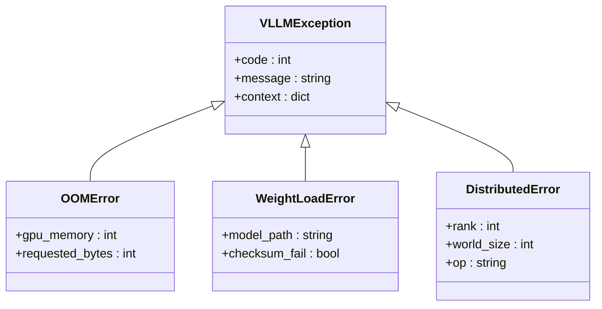

图表来源 
- [vllm/exceptions.py](file://vllm/exceptions.py)

章节来源
- [vllm/exceptions.py](file://vllm/exceptions.py)
- [vllm/logger.py](file://vllm/logger.py)

### 引擎与调度
- 请求入队与批处理
  - 动态批大小控制、优先级策略、超时与重试
- KV Cache 管理
  - 分页缓存、复用与回收、水位线触发清理
- 指标采集
  - 吞吐、时延分位、队列长度、显存占用

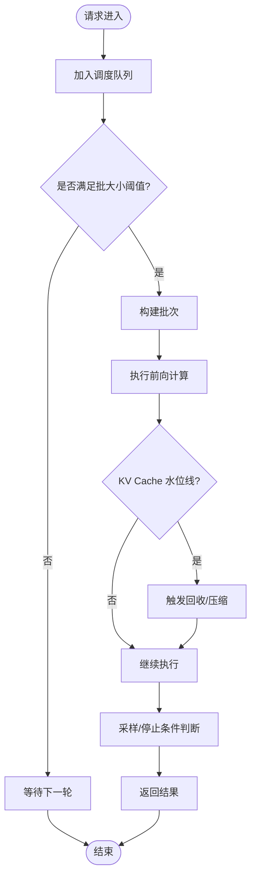

图表来源 
- [vllm/engine/llm_engine.py](file://vllm/engine/llm_engine.py)
- [vllm/engine/metrics.py](file://vllm/engine/metrics.py)

章节来源
- [vllm/engine/llm_engine.py](file://vllm/engine/llm_engine.py)
- [vllm/engine/metrics.py](file://vllm/engine/metrics.py)

### 模型加载器
- 权重来源与校验
  - 支持本地/远程路径，校验完整性（哈希/签名）
- 分片与并行加载
  - 按 rank 分片、异步 I/O、断点续传
- 量化与格式适配
  - FP8/INT4/AWQ/Marlin 等后端适配

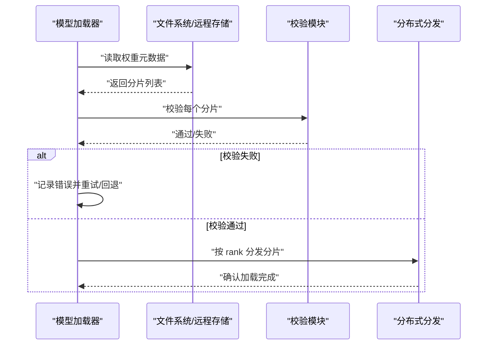

图表来源 
- [vllm/model_executor/model_loader/loader.py](file://vllm/model_executor/model_loader/loader.py)
- [vllm/model_executor/model_loader/weight_utils.py](file://vllm/model_executor/model_loader/weight_utils.py)

章节来源
- [vllm/model_executor/model_loader/loader.py](file://vllm/model_executor/model_loader/loader.py)
- [vllm/model_executor/model_loader/weight_utils.py](file://vllm/model_executor/model_loader/weight_utils.py)

### 分布式子系统
- 并行模式
  - 张量并行（TP）、流水线并行（PP）、专家并行（EP）、上下文并行（CP）
- 通信原语
  - AllReduce、AllGather、Barrier、自定义集合通信
- 容错与恢复
  - 进程崩溃检测、任务重放、KV 共享连接器

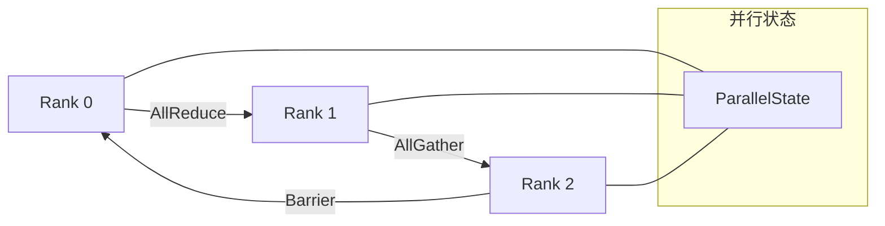

图表来源 
- [vllm/distributed/parallel_state.py](file://vllm/distributed/parallel_state.py)
- [vllm/distributed/utils.py](file://vllm/distributed/utils.py)

章节来源
- [vllm/distributed/parallel_state.py](file://vllm/distributed/parallel_state.py)
- [vllm/distributed/utils.py](file://vllm/distributed/utils.py)

### 设备与平台
- 显存分配器
  - CUDA 内存池、碎片整理、预留与释放策略
- 平台抽象
  - NVIDIA/ROCm/XPU 的设备能力探测与特性开关

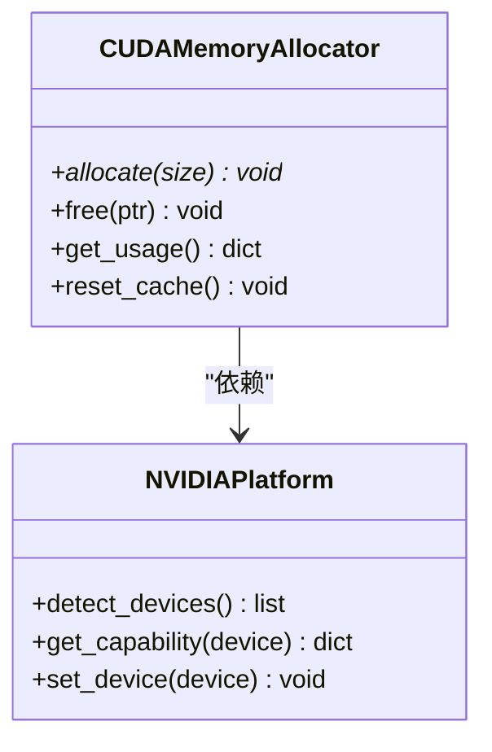

图表来源 
- [vllm/device_allocator/cumem_allocator.py](file://vllm/device_allocator/cumem_allocator.py)
- [vllm/platforms/nvidia.py](file://vllm/platforms/nvidia.py)

章节来源
- [vllm/device_allocator/cumem_allocator.py](file://vllm/device_allocator/cumem_allocator.py)
- [vllm/platforms/nvidia.py](file://vllm/platforms/nvidia.py)

## 依赖关系分析
- 组件耦合
  - 引擎依赖模型执行器与显存分配器；执行器依赖平台抽象与分布式通信
  - 模型加载器依赖 I/O 与校验模块，并通过分布式分发将权重映射到各 rank
- 外部依赖
  - PyTorch/TensorRT-LLM/FlashAttention 等后端库
  - NCCL/RDMA 等通信库
- 潜在循环依赖
  - 通过接口解耦避免循环导入；必要时使用延迟导入

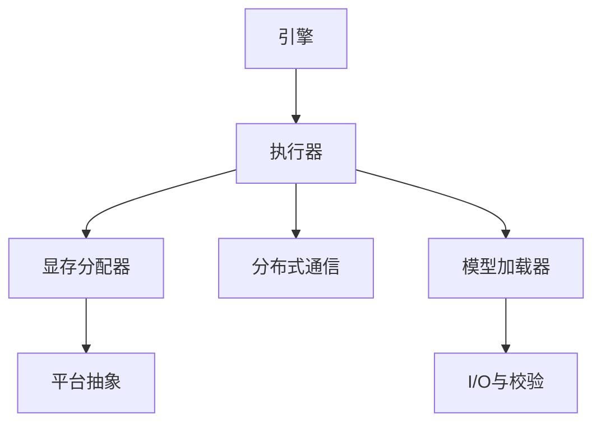

图表来源 
- [vllm/engine/llm_engine.py](file://vllm/engine/llm_engine.py)
- [vllm/model_executor/model_loader/loader.py](file://vllm/model_executor/model_loader/loader.py)
- [vllm/device_allocator/cumem_allocator.py](file://vllm/device_allocator/cumem_allocator.py)
- [vllm/distributed/parallel_state.py](file://vllm/distributed/parallel_state.py)

章节来源
- [vllm/engine/llm_engine.py](file://vllm/engine/llm_engine.py)
- [vllm/model_executor/model_loader/loader.py](file://vllm/model_executor/model_loader/loader.py)
- [vllm/device_allocator/cumem_allocator.py](file://vllm/device_allocator/cumem_allocator.py)
- [vllm/distributed/parallel_state.py](file://vllm/distributed/parallel_state.py)

## 性能注意事项
- 批大小与序列长度
  - 过大的 batch 或超长序列会放大显存压力与调度开销
- KV Cache 水位线与回收
  - 合理设置水位线，避免频繁回收导致抖动
- 算子选择与编译
  - 启用合适的 attention 后端与编译选项（如 CUDA Graph、Triton）
- I/O 与权重加载
  - 使用高速存储、并行下载与预取，减少冷启动时间
- 分布式通信
  - 选择合适的并行度与拓扑，避免热点与拥塞

[本节为通用指导，无需特定文件引用]

## 故障排查指南

### 内存溢出（OOM）排查与优化
- 现象识别
  - 显存峰值突增、进程被系统 OOM Killer 终止、请求长时间挂起
- 排查步骤
  - 检查引擎批大小与最大序列长度配置
  - 监控显存使用趋势与碎片率
  - 定位未释放对象（大张量、缓存、中间结果）
  - 验证显存分配器行为（预留、回收、重置）
- 显存泄漏检测
  - 开启详细日志与指标采集，观察逐阶段显存变化
  - 使用平台工具（nvidia-smi/pytorch memory profiling）辅助定位
- 优化建议
  - 降低 batch size、启用 KV Cache 压缩/回收
  - 调整显存预留比例，避免过度预留
  - 拆分长序列、使用流式生成减少峰值
  - 关闭不必要的调试与额外日志

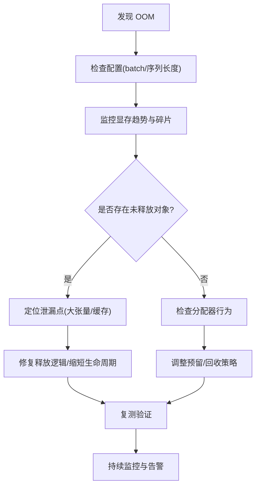

章节来源
- [vllm/device_allocator/cumem_allocator.py](file://vllm/device_allocator/cumem_allocator.py)
- [vllm/platforms/nvidia.py](file://vllm/platforms/nvidia.py)
- [vllm/engine/llm_engine.py](file://vllm/engine/llm_engine.py)
- [vllm/engine/metrics.py](file://vllm/engine/metrics.py)

### 性能下降问题分析
- CPU/GPU 瓶颈识别
  - CPU：预处理、tokenize、调度逻辑耗时占比高
  - GPU：注意力、MoE、采样算子成为热点
- I/O 性能调优
  - 权重加载慢、数据集读取阻塞
  - 使用并行 I/O、预取、缓存
- 网络延迟分析
  - 分布式通信耗时、RDMA/NCCL 配置不当
  - 拓扑与亲和性影响带宽与时延
- 分析方法
  - 使用 profiler 采集函数级耗时与火焰图
  - 结合 metrics 观察吞吐、时延分位、队列长度
  - 对比不同配置（attention 后端、编译选项）

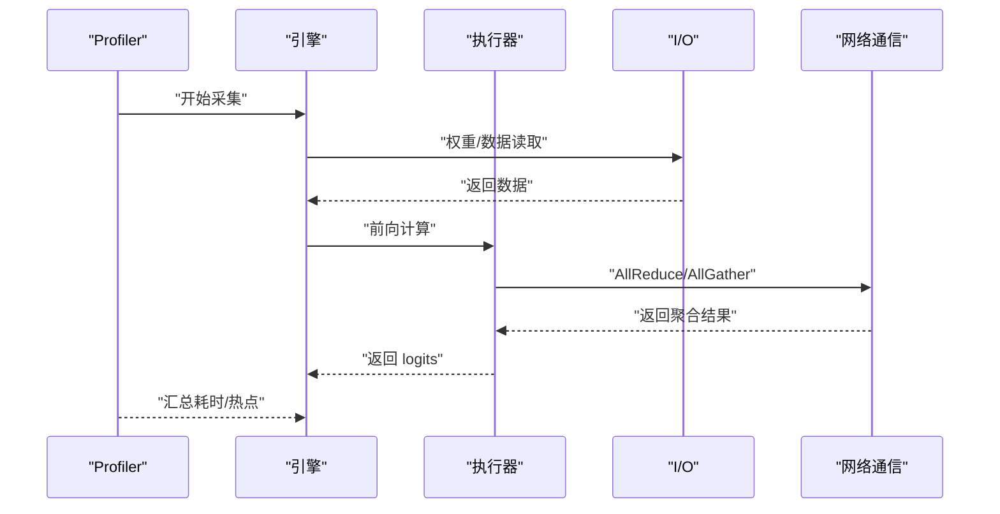

章节来源
- [vllm/profiler/profiler.py](file://vllm/profiler/profiler.py)
- [vllm/engine/metrics.py](file://vllm/engine/metrics.py)
- [benchmarks/benchmark_serving.py](file://benchmarks/benchmark_serving.py)

### 模型加载失败的原因与解决
- 常见原因
  - 权重文件损坏或不完整（校验失败）
  - 版本不兼容（模型格式/量化后端不匹配）
  - 依赖缺失（缺少必要库或驱动）
- 解决步骤
  - 校验权重完整性（哈希/签名）
  - 检查模型格式与后端支持矩阵
  - 安装缺失依赖并重启服务
  - 查看加载日志中的具体错误码与上下文

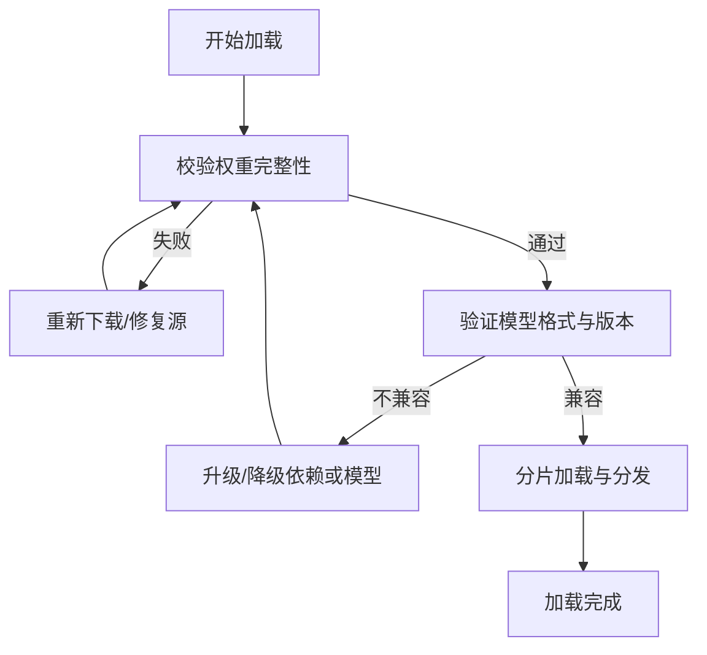

章节来源
- [vllm/model_executor/model_loader/loader.py](file://vllm/model_executor/model_loader/loader.py)
- [vllm/model_executor/model_loader/weight_utils.py](file://vllm/model_executor/model_loader/weight_utils.py)

### 分布式环境调试技巧
- 多进程通信问题
  - 检查进程组初始化、端口与防火墙、NCCL 日志
  - 使用 barrier 确保同步点正确
- 节点间同步问题
  - 核对 world_size、rank 映射、拓扑配置
  - 监控通信耗时与丢包
- 网络分区处理
  - 实现心跳与超时检测
  - 使用 KV 共享连接器进行容错与恢复

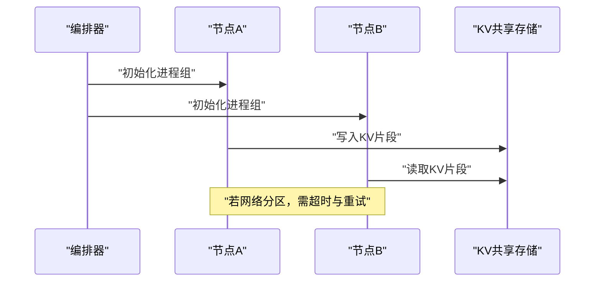

章节来源
- [vllm/distributed/parallel_state.py](file://vllm/distributed/parallel_state.py)
- [vllm/distributed/utils.py](file://vllm/distributed/utils.py)
- [examples/disaggregated/kv_load_failure_recovery_offline/main.py](file://examples/disaggregated/kv_load_failure_recovery_offline/main.py)

### 堆栈跟踪与信息收集
- 收集要点
  - 开启详细日志级别，保留请求 ID 与上下文
  - 捕获异常堆栈并附带环境变量与配置快照
- 分析步骤
  - 定位首次异常位置与调用链
  - 关联指标与日志，还原事件时序
- 工具推荐
  - Python 标准 traceback、结构化日志框架
  - 平台工具（nvidia-smi、nvprof、py-spy）

章节来源
- [vllm/logger.py](file://vllm/logger.py)
- [vllm/exceptions.py](file://vllm/exceptions.py)

### 实际案例与解决步骤
- 案例一：长序列导致 OOM
  - 现象：批量处理长文档时显存飙升并崩溃
  - 排查：监控显示 KV Cache 增长过快且未回收
  - 解决：降低序列长度上限、启用 KV 回收与压缩、分批处理
- 案例二：权重加载失败
  - 现象：启动时报校验失败
  - 排查：检查权重哈希与源完整性
  - 解决：重新下载权重、更新依赖、重启加载流程
- 案例三：分布式通信超时
  - 现象：多节点训练/推理卡住
  - 排查：NCCL 日志显示握手失败
  - 解决：检查端口与防火墙、调整 NCCL 参数、增加超时

章节来源
- [vllm/device_allocator/cumem_allocator.py](file://vllm/device_allocator/cumem_allocator.py)
- [vllm/model_executor/model_loader/loader.py](file://vllm/model_executor/model_loader/loader.py)
- [vllm/distributed/utils.py](file://vllm/distributed/utils.py)

## 结论
通过系统化地理解 vLLM 的异常与日志、引擎调度、模型加载、分布式通信与设备抽象，可以快速定位并解决 OOM、性能下降、模型加载失败与分布式问题。建议在生产环境中建立完善的监控与告警机制，结合 profiler 与 metrics 持续优化资源配置与调度策略。

[本节为总结性内容，无需特定文件引用]

## 附录
- 参考文档
  - 故障排查指南与分布式故障排查文档
  - 环境变量与引擎参数说明
- 实用命令与脚本
  - 性能基准与负载测试脚本
  - 容器化部署与启动脚本

章节来源
- [docs/usage/troubleshooting.md](file://docs/usage/troubleshooting.md)
- [docs/serving/distributed_troubleshooting.md](file://docs/serving/distributed_troubleshooting.md)
- [vllm/config/engine_args.py](file://vllm/config/engine_args.py)
- [vllm/envs.py](file://vllm/envs.py)
- [benchmarks/benchmark_serving.py](file://benchmarks/benchmark_serving.py)