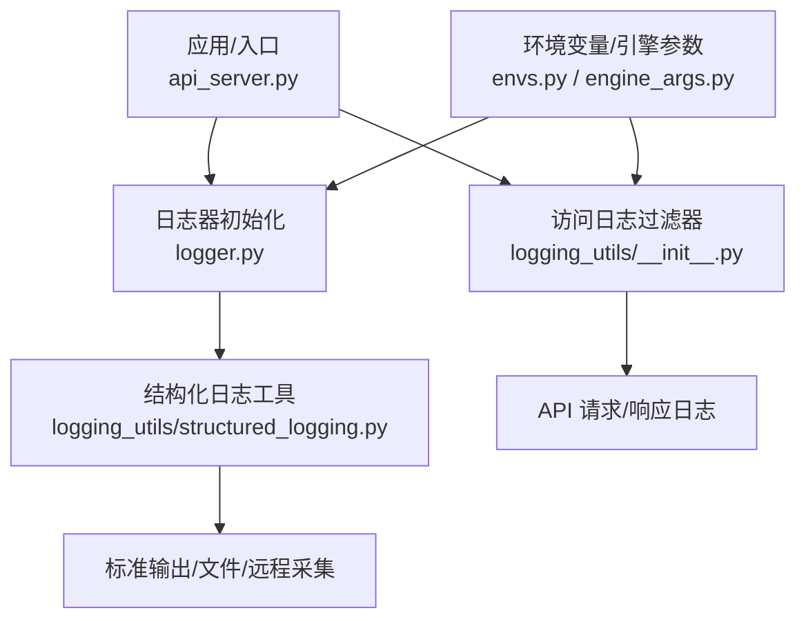
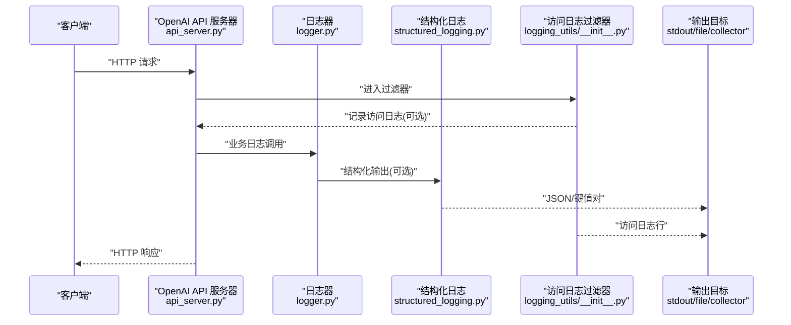
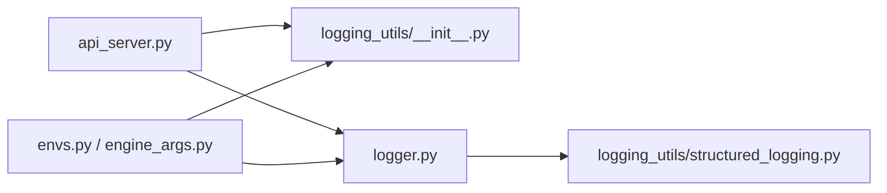

# 日志系统

<cite>
**本文引用的文件**   
- [vllm/logger.py](file://vllm/logger.py)
- [vllm/logging_utils/__init__.py](file://vllm/logging_utils/__init__.py)
- [vllm/logging_utils/structured_logging.py](file://vllm/logging_utils/structured_logging.py)
- [examples/features/logging_configuration.md](file://examples/features/logging_configuration.md)
- [tests/test_logger.py](file://tests/test_logger.py)
- [tests/test_access_log_filter.py](file://tests/test_access_log_filter.py)
- [vllm/entrypoints/openai/api_server.py](file://vllm/entrypoints/openai/api_server.py)
- [vllm/config/engine_args.py](file://vllm/config/engine_args.py)
- [vllm/envs.py](file://vllm/envs.py)
</cite>

## 目录
1. [简介](#简介)
2. [项目结构](#项目结构)
3. [核心组件](#核心组件)
4. [架构总览](#架构总览)
5. [详细组件分析](#详细组件分析)
6. [依赖关系分析](#依赖关系分析)
7. [性能考量](#性能考量)
8. [故障排查指南](#故障排查指南)
9. [结论](#结论)
10. [附录](#附录)

## 简介
本章节面向希望系统化了解 vLLM 内置日志系统的读者，涵盖以下主题：
- 日志级别设置（DEBUG、INFO、WARNING、ERROR）与输出目标配置
- 结构化日志的使用方式，包括关键事件、错误信息与性能指标记录
- 访问日志的配置与自定义过滤器，用于监控 API 请求与响应
- 日志聚合与分析最佳实践，包括与 ELK Stack、Grafana 等工具的集成
- 分布式环境下的日志收集策略与跨进程日志关联方法
- 实际代码示例与配置模板的参考路径

## 项目结构
vLLM 的日志能力由 Python logging 扩展与专用工具模块共同实现，主要分布在如下位置：
- vllm/logger.py：全局日志器初始化与默认配置入口
- vllm/logging_utils/*：结构化日志、访问日志过滤、日志格式化工具
- examples/features/logging_configuration.md：官方示例与配置说明文档
- tests/test_logger.py、tests/test_access_log_filter.py：单元测试覆盖日志行为与过滤器
- vllm/entrypoints/openai/api_server.py：OpenAI 兼容服务中接入访问日志
- vllm/config/engine_args.py、vllm/envs.py：引擎参数与环境变量对日志的影响

图表来源 
- [vllm/logger.py](file://vllm/logger.py)
- [vllm/logging_utils/__init__.py](file://vllm/logging_utils/__init__.py)
- [vllm/logging_utils/structured_logging.py](file://vllm/logging_utils/structured_logging.py)
- [vllm/entrypoints/openai/api_server.py](file://vllm/entrypoints/openai/api_server.py)
- [vllm/config/engine_args.py](file://vllm/config/engine_args.py)
- [vllm/envs.py](file://vllm/envs.py)

章节来源
- [vllm/logger.py](file://vllm/logger.py)
- [vllm/logging_utils/__init__.py](file://vllm/logging_utils/__init__.py)
- [vllm/logging_utils/structured_logging.py](file://vllm/logging_utils/structured_logging.py)
- [examples/features/logging_configuration.md](file://examples/features/logging_configuration.md)
- [tests/test_logger.py](file://tests/test_logger.py)
- [tests/test_access_log_filter.py](file://tests/test_access_log_filter.py)
- [vllm/entrypoints/openai/api_server.py](file://vllm/entrypoints/openai/api_server.py)
- [vllm/config/engine_args.py](file://vllm/config/engine_args.py)
- [vllm/envs.py](file://vllm/envs.py)

## 核心组件
- 全局日志器与默认配置
  - 通过统一入口初始化日志器，设置默认级别、格式化器与处理器，确保多进程/多线程场景下的一致性。
- 结构化日志
  - 提供 JSON 或键值对形式的结构化输出，便于下游解析与聚合；支持为关键事件、错误与性能指标附加上下文字段。
- 访问日志与过滤器
  - 在 OpenAI 兼容服务层拦截请求与响应，记录耗时、状态码、输入摘要与错误信息；支持自定义过滤器进行敏感信息脱敏或采样。
- 环境变量与引擎参数
  - 通过环境变量与引擎参数控制日志级别、输出目标、是否启用结构化日志以及采样策略。

章节来源
- [vllm/logger.py](file://vllm/logger.py)
- [vllm/logging_utils/structured_logging.py](file://vllm/logging_utils/structured_logging.py)
- [vllm/logging_utils/__init__.py](file://vllm/logging_utils/__init__.py)
- [vllm/envs.py](file://vllm/envs.py)
- [vllm/config/engine_args.py](file://vllm/config/engine_args.py)

## 架构总览
下图展示了从应用入口到日志输出的整体流程，包括结构化日志与访问日志两条主线。

图表来源 
- [vllm/entrypoints/openai/api_server.py](file://vllm/entrypoints/openai/api_server.py)
- [vllm/logger.py](file://vllm/logger.py)
- [vllm/logging_utils/structured_logging.py](file://vllm/logging_utils/structured_logging.py)
- [vllm/logging_utils/__init__.py](file://vllm/logging_utils/__init__.py)

## 详细组件分析

### 全局日志器与默认配置
- 职责
  - 初始化 Python logging 根日志器，设置默认级别、格式化器与处理器。
  - 提供统一的日志接口，避免各模块重复配置。
- 关键点
  - 支持通过环境变量切换级别与输出目标。
  - 在多进程环境下保证处理器安全与去重。
- 使用建议
  - 在应用启动早期调用初始化函数，确保后续所有模块均使用同一日志器。

章节来源
- [vllm/logger.py](file://vllm/logger.py)
- [vllm/envs.py](file://vllm/envs.py)

### 结构化日志
- 职责
  - 将日志以结构化格式（如 JSON）输出，包含时间戳、级别、模块名、消息及自定义字段。
  - 为关键事件、错误与性能指标提供一致的上下文字段，便于聚合与查询。
- 关键点
  - 可配置是否启用结构化输出、字段白名单与采样策略。
  - 与标准 logging 无缝集成，不影响现有日志调用。
- 使用建议
  - 在性能敏感路径使用轻量级结构化日志，避免过多 I/O。
  - 为错误与异常附加堆栈与上下文，提升排障效率。

章节来源
- [vllm/logging_utils/structured_logging.py](file://vllm/logging_utils/structured_logging.py)
- [examples/features/logging_configuration.md](file://examples/features/logging_configuration.md)

### 访问日志与自定义过滤器
- 职责
  - 在 API 层记录请求与响应的关键信息，如方法、路径、状态码、耗时、用户标识与错误摘要。
  - 提供过滤器机制，支持脱敏、采样与条件过滤。
- 关键点
  - 与 OpenAI 兼容服务集成，拦截中间件或路由处理前后。
  - 支持按请求 ID 关联上下游日志，便于链路追踪。
- 使用建议
  - 对敏感字段（如 token、用户信息）进行脱敏。
  - 在高吞吐场景启用采样，降低日志开销。

章节来源
- [vllm/logging_utils/__init__.py](file://vllm/logging_utils/__init__.py)
- [vllm/entrypoints/openai/api_server.py](file://vllm/entrypoints/openai/api_server.py)
- [tests/test_access_log_filter.py](file://tests/test_access_log_filter.py)

### 环境变量与引擎参数
- 职责
  - 通过环境变量与引擎参数控制日志行为，如级别、输出目标、结构化开关、采样率等。
- 关键点
  - 环境变量优先级高于默认配置，便于部署时动态调整。
  - 引擎参数可与配置文件结合，实现细粒度控制。
- 使用建议
  - 在生产环境关闭 DEBUG，开启 WARNING 及以上级别。
  - 使用集中式日志平台时，优先选择结构化输出。

章节来源
- [vllm/envs.py](file://vllm/envs.py)
- [vllm/config/engine_args.py](file://vllm/config/engine_args.py)

### 单元测试与行为验证
- 测试覆盖
  - 日志器初始化、级别切换、输出目标配置。
  - 访问日志过滤器的行为与边界条件。
- 使用建议
  - 在 CI 中运行日志相关测试，确保配置变更不会破坏日志行为。

章节来源
- [tests/test_logger.py](file://tests/test_logger.py)
- [tests/test_access_log_filter.py](file://tests/test_access_log_filter.py)

## 依赖关系分析
- 组件耦合
  - api_server.py 依赖 logging_utils 中的访问日志过滤器。
  - logger.py 作为全局入口被各模块引用，避免重复初始化。
  - structured_logging.py 与标准 logging 解耦，便于替换输出后端。
- 外部依赖
  - Python 标准库 logging。
  - 可选的外部采集器（如 Filebeat、Fluent Bit）通过 stdout 或文件输出对接。

图表来源 
- [vllm/entrypoints/openai/api_server.py](file://vllm/entrypoints/openai/api_server.py)
- [vllm/logging_utils/__init__.py](file://vllm/logging_utils/__init__.py)
- [vllm/logger.py](file://vllm/logger.py)
- [vllm/logging_utils/structured_logging.py](file://vllm/logging_utils/structured_logging.py)
- [vllm/envs.py](file://vllm/envs.py)
- [vllm/config/engine_args.py](file://vllm/config/engine_args.py)

章节来源
- [vllm/entrypoints/openai/api_server.py](file://vllm/entrypoints/openai/api_server.py)
- [vllm/logging_utils/__init__.py](file://vllm/logging_utils/__init__.py)
- [vllm/logger.py](file://vllm/logger.py)
- [vllm/logging_utils/structured_logging.py](file://vllm/logging_utils/structured_logging.py)
- [vllm/envs.py](file://vllm/envs.py)
- [vllm/config/engine_args.py](file://vllm/config/engine_args.py)

## 性能考量
- 日志级别
  - 生产环境建议使用 WARNING 及以上，减少 I/O 压力。
- 结构化输出
  - JSON 序列化有额外开销，建议在热点路径谨慎使用。
- 采样与过滤
  - 高吞吐场景启用采样与条件过滤，避免日志风暴。
- 异步与缓冲
  - 使用缓冲写入与异步采集器，降低阻塞风险。
- 磁盘与网络
  - 合理配置轮转与压缩，避免磁盘占用过高。

[本节为通用指导，不直接分析具体文件]

## 故障排查指南
- 常见问题
  - 日志级别未生效：检查环境变量与初始化顺序。
  - 结构化输出缺失：确认是否启用结构化日志并正确配置字段。
  - 访问日志不完整：检查过滤器是否被正确挂载与触发。
- 定位步骤
  - 临时提高日志级别至 DEBUG，观察关键路径。
  - 使用请求 ID 关联上下游日志，定位问题节点。
  - 检查输出目标权限与路径配置。
- 工具推荐
  - 使用集中式日志平台（ELK、Loki）进行检索与告警。
  - 结合 Grafana 可视化关键指标（QPS、延迟、错误率）。

章节来源
- [tests/test_logger.py](file://tests/test_logger.py)
- [tests/test_access_log_filter.py](file://tests/test_access_log_filter.py)
- [examples/features/logging_configuration.md](file://examples/features/logging_configuration.md)

## 结论
vLLM 的日志系统通过统一入口、结构化输出与访问日志过滤器，提供了灵活且可扩展的日志能力。结合环境变量与引擎参数，可在不同环境中快速适配。在生产部署中，建议采用结构化输出与集中式采集，配合采样与过滤策略，平衡可观测性与性能。

[本节为总结性内容，不直接分析具体文件]

## 附录

### 日志级别与输出目标配置
- 日志级别
  - DEBUG、INFO、WARNING、ERROR，按需求逐步放宽。
- 输出目标
  - 标准输出、文件、远程采集器（Filebeat、Fluent Bit）。
- 结构化开关
  - 启用 JSON 输出，便于解析与聚合。

章节来源
- [vllm/logger.py](file://vllm/logger.py)
- [vllm/logging_utils/structured_logging.py](file://vllm/logging_utils/structured_logging.py)
- [examples/features/logging_configuration.md](file://examples/features/logging_configuration.md)

### 结构化日志使用示例
- 关键事件
  - 记录模型加载、批处理调度、缓存命中等事件。
- 错误信息
  - 捕获异常并附加堆栈与上下文字段。
- 性能指标
  - 记录延迟、吞吐、内存占用等指标。

章节来源
- [vllm/logging_utils/structured_logging.py](file://vllm/logging_utils/structured_logging.py)
- [examples/features/logging_configuration.md](file://examples/features/logging_configuration.md)

### 访问日志与自定义过滤器
- 配置要点
  - 在 API 层启用访问日志，记录方法与路径、状态码、耗时。
- 自定义过滤器
  - 脱敏敏感字段，按条件过滤或采样。
- 链路关联
  - 使用请求 ID 关联上下游日志。

章节来源
- [vllm/logging_utils/__init__.py](file://vllm/logging_utils/__init__.py)
- [vllm/entrypoints/openai/api_server.py](file://vllm/entrypoints/openai/api_server.py)
- [tests/test_access_log_filter.py](file://tests/test_access_log_filter.py)

### 日志聚合与分析最佳实践
- ELK Stack
  - 使用 Filebeat/Fluent Bit 采集 stdout 或文件，索引到 Elasticsearch，Kibana 可视化。
- Grafana
  - 对接 Prometheus 或 Loki，构建仪表盘与告警规则。
- 采样与保留策略
  - 高吞吐场景启用采样，设置合理的保留周期与压缩策略。

章节来源
- [examples/features/logging_configuration.md](file://examples/features/logging_configuration.md)

### 分布式环境下的日志收集与关联
- 收集策略
  - 每个节点独立输出到本地文件或 stdout，由采集器统一收集。
- 跨进程关联
  - 使用请求 ID 或 Trace ID 关联同一请求的日志。
- 一致性保障
  - 确保时间同步与字段规范一致。

章节来源
- [vllm/logger.py](file://vllm/logger.py)
- [vllm/logging_utils/structured_logging.py](file://vllm/logging_utils/structured_logging.py)
- [vllm/entrypoints/openai/api_server.py](file://vllm/entrypoints/openai/api_server.py)

### 配置模板与示例参考
- 环境变量
  - 设置日志级别、输出目标、结构化开关等。
- 引擎参数
  - 在启动参数中指定日志相关选项。
- 示例文档
  - 参考官方示例文档获取完整配置模板。

章节来源
- [vllm/envs.py](file://vllm/envs.py)
- [vllm/config/engine_args.py](file://vllm/config/engine_args.py)
- [examples/features/logging_configuration.md](file://examples/features/logging_configuration.md)