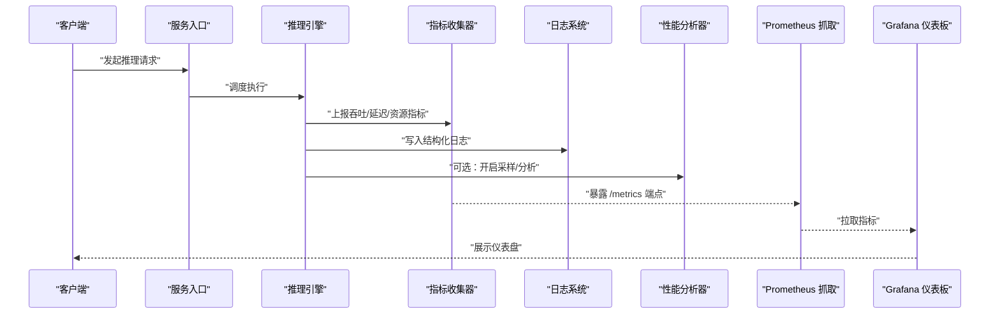
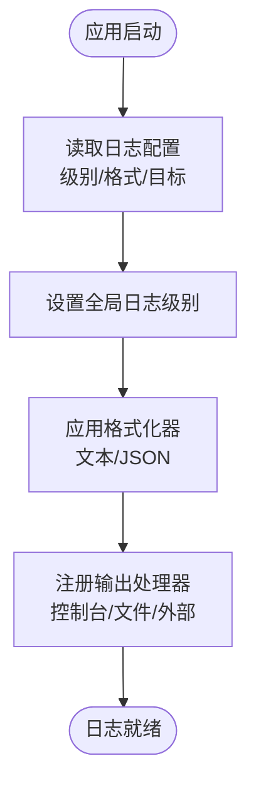
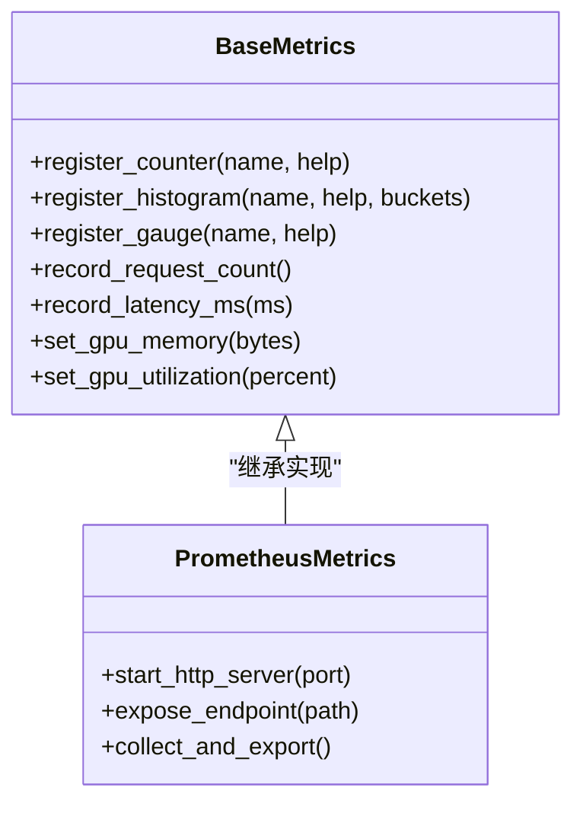
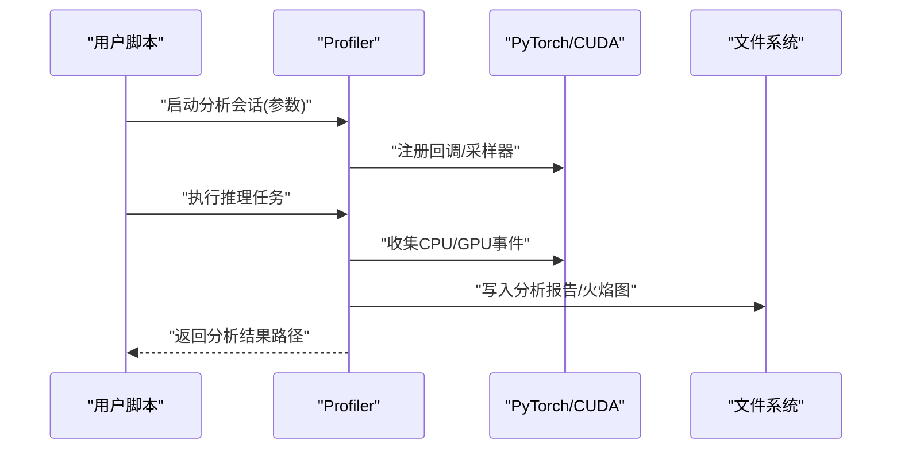
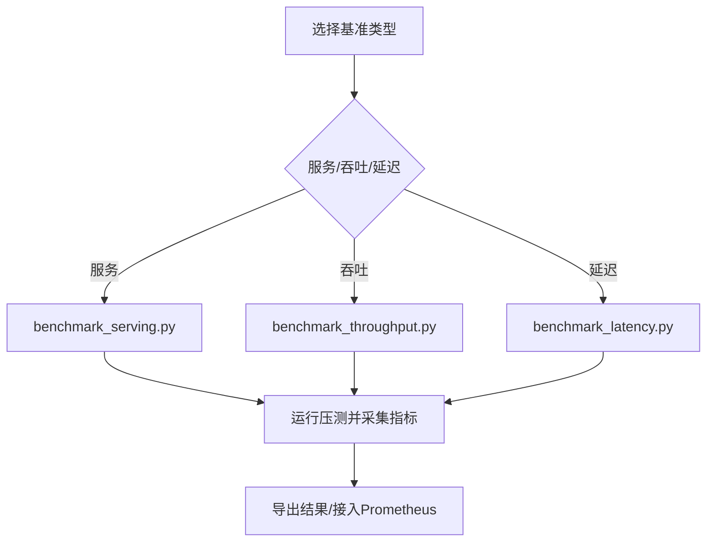
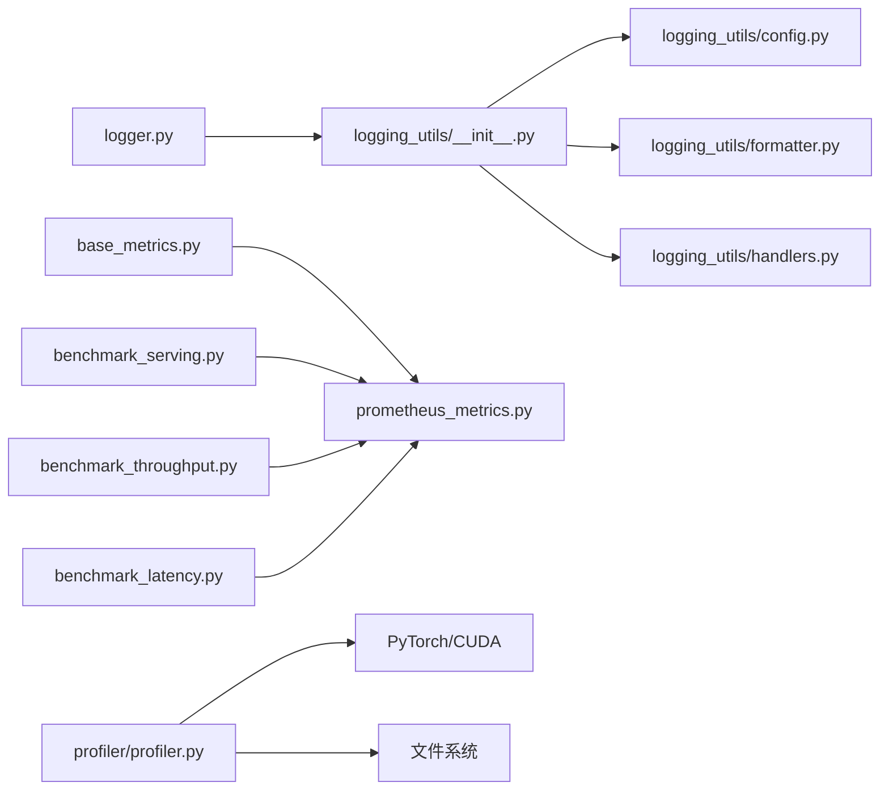

# 监控和调试

<cite>
**本文引用的文件**   
- [vllm/logger.py](file://vllm/logger.py)
- [vllm/logging_utils/__init__.py](file://vllm/logging_utils/__init__.py)
- [vllm/logging_utils/config.py](file://vllm/logging_utils/config.py)
- [vllm/logging_utils/formatter.py](file://vllm/logging_utils/formatter.py)
- [vllm/logging_utils/handlers.py](file://vllm/logging_utils/handlers.py)
- [vllm/envs.py](file://vllm/envs.py)
- [vllm/observability/metrics/prometheus_metrics.py](file://vllm/observability/metrics/prometheus_metrics.py)
- [vllm/observability/metrics/base_metrics.py](file://vllm/observability/metrics/base_metrics.py)
- [vllm/profiler/profiler.py](file://vllm/profiler/profiler.py)
- [examples/observability/prometheus_grafana/grafana_dashboard.json](file://examples/observability/prometheus_grafana/grafana_dashboard.json)
- [benchmarks/benchmark_serving.py](file://benchmarks/benchmark_serving.py)
- [benchmarks/benchmark_throughput.py](file://benchmarks/benchmark_throughput.py)
- [benchmarks/benchmark_latency.py](file://benchmarks/benchmark_latency.py)
- [docs/design/metrics.md](file://docs/design/metrics.md)
- [docs/usage/troubleshooting.md](file://docs/usage/troubleshooting.md)
- [docs/serving/distributed_troubleshooting.md](file://docs/serving/distributed_troubleshooting.md)
- [examples/profiling/profile_example.py](file://examples/profiling/profile_example.py)
</cite>

## 目录
1. [简介](#简介)
2. [项目结构](#项目结构)
3. [核心组件](#核心组件)
4. [架构总览](#架构总览)
5. [详细组件分析](#详细组件分析)
6. [依赖关系分析](#依赖关系分析)
7. [性能考量](#性能考量)
8. [故障排查指南](#故障排查指南)
9. [结论](#结论)
10. [附录](#附录)

## 简介
本章节面向使用 vLLM 的工程师与运维人员，系统介绍监控与调试能力：内置日志系统的配置（级别、格式化、输出目标）、关键性能指标（吞吐量、延迟、内存、GPU 利用率）的采集与可视化、Profiling 工具的使用（CPU/GPU 分析、内存泄漏检测、瓶颈识别），以及常见问题诊断方法（OOM、性能下降、模型加载失败）、分布式环境下的调试技巧（跨进程通信、网络延迟）、A/B 测试与灰度发布的监控方案，以及性能回归与基准测试的自动化实践。

## 项目结构
vLLM 在代码库中提供了完善的可观测性与性能分析基础设施，主要分布在以下模块：
- 日志子系统：位于 vllm/logging_utils 与 vllm/logger.py，提供统一的日志初始化、格式化和多目标输出。
- 指标子系统：位于 vllm/observability/metrics，提供 Prometheus 等后端指标导出。
- Profiling 工具：位于 vllm/profiler 与 examples/profiling，支持 CPU/GPU 分析与火焰图生成。
- 基准与压测：位于 benchmarks 目录，提供吞吐、延迟、服务等多类基准脚本。
- 文档与示例：docs 与 examples 下包含指标设计、Grafana 仪表板与使用示例。

```mermaid
graph TB
subgraph "日志子系统"
L1["logger.py"]
L2["logging_utils/__init__.py"]
L3["logging_utils/config.py"]
L4["logging_utils/formatter.py"]
L5["logging_utils/handlers.py"]
end
subgraph "指标子系统"
M1["metrics/base_metrics.py"]
M2["metrics/prometheus_metrics.py"]
end
subgraph "性能分析"
P1["profiler/profiler.py"]
E1["examples/profiling/profile_example.py"]
end
subgraph "基准与压测"
B1["benchmarks/benchmark_serving.py"]
B2["benchmarks/benchmark_throughput.py"]
B3["benchmarks/benchmark_latency.py"]
end
subgraph "文档与示例"
D1["docs/design/metrics.md"]
G1["examples/observability/prometheus_grafana/grafana_dashboard.json"]
end
L1 --> L2 --> L3 --> L4 --> L5
M1 --> M2
P1 --> E1
B1 --> M2
B2 --> M2
B3 --> M2
D1 --> M2
G1 --> M2
```

图表来源
- [vllm/logger.py](file://vllm/logger.py)
- [vllm/logging_utils/__init__.py](file://vllm/logging_utils/__init__.py)
- [vllm/logging_utils/config.py](file://vllm/logging_utils/config.py)
- [vllm/logging_utils/formatter.py](file://vllm/logging_utils/formatter.py)
- [vllm/logging_utils/handlers.py](file://vllm/logging_utils/handlers.py)
- [vllm/observability/metrics/base_metrics.py](file://vllm/observability/metrics/base_metrics.py)
- [vllm/observability/metrics/prometheus_metrics.py](file://vllm/observability/metrics/prometheus_metrics.py)
- [vllm/profiler/profiler.py](file://vllm/profiler/profiler.py)
- [examples/profiling/profile_example.py](file://examples/profiling/profile_example.py)
- [benchmarks/benchmark_serving.py](file://benchmarks/benchmark_serving.py)
- [benchmarks/benchmark_throughput.py](file://benchmarks/benchmark_throughput.py)
- [benchmarks/benchmark_latency.py](file://benchmarks/benchmark_latency.py)
- [docs/design/metrics.md](file://docs/design/metrics.md)
- [examples/observability/prometheus_grafana/grafana_dashboard.json](file://examples/observability/prometheus_grafana/grafana_dashboard.json)

章节来源
- [vllm/logger.py](file://vllm/logger.py)
- [vllm/logging_utils/__init__.py](file://vllm/logging_utils/__init__.py)
- [vllm/logging_utils/config.py](file://vllm/logging_utils/config.py)
- [vllm/logging_utils/formatter.py](file://vllm/logging_utils/formatter.py)
- [vllm/logging_utils/handlers.py](file://vllm/logging_utils/handlers.py)
- [vllm/observability/metrics/base_metrics.py](file://vllm/observability/metrics/base_metrics.py)
- [vllm/observability/metrics/prometheus_metrics.py](file://vllm/observability/metrics/prometheus_metrics.py)
- [vllm/profiler/profiler.py](file://vllm/profiler/profiler.py)
- [examples/profiling/profile_example.py](file://examples/profiling/profile_example.py)
- [benchmarks/benchmark_serving.py](file://benchmarks/benchmark_serving.py)
- [benchmarks/benchmark_throughput.py](file://benchmarks/benchmark_throughput.py)
- [benchmarks/benchmark_latency.py](file://benchmarks/benchmark_latency.py)
- [docs/design/metrics.md](file://docs/design/metrics.md)
- [examples/observability/prometheus_grafana/grafana_dashboard.json](file://examples/observability/prometheus_grafana/grafana_dashboard.json)

## 核心组件
- 日志子系统：统一入口 logger.py 与 logging_utils 子包负责日志级别、格式化、多目标输出（控制台、文件、结构化 JSON）。
- 指标子系统：base_metrics 定义通用指标抽象，prometheus_metrics 实现 Prometheus 暴露端点与抓取。
- Profiling 工具：profiler.py 封装 CPU/GPU 分析流程，配合示例 profile_example.py 快速启动分析并生成报告。
- 基准与压测：benchmark_serving、benchmark_throughput、benchmark_latency 提供端到端吞吐、延迟与服务级压测能力。
- 文档与可视化：metrics.md 描述指标设计与命名规范；grafana_dashboard.json 提供 Grafana 仪表板模板。

章节来源
- [vllm/logger.py](file://vllm/logger.py)
- [vllm/logging_utils/__init__.py](file://vllm/logging_utils/__init__.py)
- [vllm/logging_utils/config.py](file://vllm/logging_utils/config.py)
- [vllm/logging_utils/formatter.py](file://vllm/logging_utils/formatter.py)
- [vllm/logging_utils/handlers.py](file://vllm/logging_utils/handlers.py)
- [vllm/observability/metrics/base_metrics.py](file://vllm/observability/metrics/base_metrics.py)
- [vllm/observability/metrics/prometheus_metrics.py](file://vllm/observability/metrics/prometheus_metrics.py)
- [vllm/profiler/profiler.py](file://vllm/profiler/profiler.py)
- [examples/profiling/profile_example.py](file://examples/profiling/profile_example.py)
- [benchmarks/benchmark_serving.py](file://benchmarks/benchmark_serving.py)
- [benchmarks/benchmark_throughput.py](file://benchmarks/benchmark_throughput.py)
- [benchmarks/benchmark_latency.py](file://benchmarks/benchmark_latency.py)
- [docs/design/metrics.md](file://docs/design/metrics.md)
- [examples/observability/prometheus_grafana/grafana_dashboard.json](file://examples/observability/prometheus_grafana/grafana_dashboard.json)

## 架构总览
下图展示了从请求进入、指标采集、日志记录到可视化的整体链路，以及 Profiling 工具如何嵌入执行路径进行性能分析。

图表来源
- [vllm/observability/metrics/prometheus_metrics.py](file://vllm/observability/metrics/prometheus_metrics.py)
- [vllm/logging_utils/__init__.py](file://vllm/logging_utils/__init__.py)
- [vllm/profiler/profiler.py](file://vllm/profiler/profiler.py)
- [benchmarks/benchmark_serving.py](file://benchmarks/benchmark_serving.py)
- [examples/observability/prometheus_grafana/grafana_dashboard.json](file://examples/observability/prometheus_grafana/grafana_dashboard.json)

## 详细组件分析

### 日志系统配置
- 日志级别：通过环境变量或配置项设置全局级别（如 DEBUG、INFO、WARNING、ERROR），影响各模块输出粒度。
- 格式化：支持文本与结构化 JSON 两种格式，便于日志聚合与分析平台消费。
- 输出目标：支持控制台、文件、外部日志系统（如 stdout/stderr 管道化），可按模块或请求维度分流。
- 上下文信息：自动附加进程/线程 ID、时间戳、请求 ID、模型名等上下文字段，提升排障效率。

图表来源
- [vllm/logging_utils/config.py](file://vllm/logging_utils/config.py)
- [vllm/logging_utils/formatter.py](file://vllm/logging_utils/formatter.py)
- [vllm/logging_utils/handlers.py](file://vllm/logging_utils/handlers.py)
- [vllm/logging_utils/__init__.py](file://vllm/logging_utils/__init__.py)
- [vllm/logger.py](file://vllm/logger.py)

章节来源
- [vllm/logging_utils/config.py](file://vllm/logging_utils/config.py)
- [vllm/logging_utils/formatter.py](file://vllm/logging_utils/formatter.py)
- [vllm/logging_utils/handlers.py](file://vllm/logging_utils/handlers.py)
- [vllm/logging_utils/__init__.py](file://vllm/logging_utils/__init__.py)
- [vllm/logger.py](file://vllm/logger.py)

### 性能监控指标
- 指标类别：
  - 吞吐：每秒请求数、每秒 token 数、批大小分布。
  - 延迟：首 token 延迟、端到端延迟、分位延迟（P50/P90/P99）。
  - 资源：GPU 显存占用、CPU 内存、GPU 利用率、I/O 带宽。
  - 队列：等待队列长度、调度耗时、缓存命中率。
- 采集方式：
  - 计数器（Counter）用于累计事件（请求数、错误数）。
  - 直方图（Histogram）用于延迟与吞吐分布。
  - 度量（Gauge）用于瞬时值（显存占用、GPU 利用率）。
- 可视化：
  - Prometheus 抓取 /metrics 端点。
  - Grafana 仪表板模板直接导入，快速呈现关键指标。

图表来源
- [vllm/observability/metrics/base_metrics.py](file://vllm/observability/metrics/base_metrics.py)
- [vllm/observability/metrics/prometheus_metrics.py](file://vllm/observability/metrics/prometheus_metrics.py)
- [docs/design/metrics.md](file://docs/design/metrics.md)
- [examples/observability/prometheus_grafana/grafana_dashboard.json](file://examples/observability/prometheus_grafana/grafana_dashboard.json)

章节来源
- [vllm/observability/metrics/base_metrics.py](file://vllm/observability/metrics/base_metrics.py)
- [vllm/observability/metrics/prometheus_metrics.py](file://vllm/observability/metrics/prometheus_metrics.py)
- [docs/design/metrics.md](file://docs/design/metrics.md)
- [examples/observability/prometheus_grafana/grafana_dashboard.json](file://examples/observability/prometheus_grafana/grafana_dashboard.json)

### Profiling 工具使用
- 功能范围：
  - CPU 分析：热点函数定位、调用栈采样。
  - GPU 分析：CUDA 内核耗时、内存分配/释放热点。
  - 内存泄漏检测：对象生命周期追踪、增量快照对比。
  - 瓶颈识别：IO 阻塞、锁竞争、调度开销。
- 使用方法：
  - 通过 profiler.py 提供的 API 启动分析会话，指定采样频率与输出目录。
  - 结合示例 profile_example.py 快速对推理路径进行采样并生成火焰图。
  - 将结果上传至分析平台（如 PyTorch Profiler 或第三方工具）进行可视化。

图表来源
- [vllm/profiler/profiler.py](file://vllm/profiler/profiler.py)
- [examples/profiling/profile_example.py](file://examples/profiling/profile_example.py)

章节来源
- [vllm/profiler/profiler.py](file://vllm/profiler/profiler.py)
- [examples/profiling/profile_example.py](file://examples/profiling/profile_example.py)

### 基准与压测
- 服务级基准：benchmark_serving.py 模拟在线请求，统计 QPS、延迟分布与资源占用。
- 吞吐基准：benchmark_throughput.py 评估不同批大小、序列长度下的最大吞吐。
- 延迟基准：benchmark_latency.py 测量首 token 与端到端延迟的分位数。
- 集成指标：基准脚本可与指标子系统对接，自动上报 Prometheus 并持久化结果。

图表来源
- [benchmarks/benchmark_serving.py](file://benchmarks/benchmark_serving.py)
- [benchmarks/benchmark_throughput.py](file://benchmarks/benchmark_throughput.py)
- [benchmarks/benchmark_latency.py](file://benchmarks/benchmark_latency.py)

章节来源
- [benchmarks/benchmark_serving.py](file://benchmarks/benchmark_serving.py)
- [benchmarks/benchmark_throughput.py](file://benchmarks/benchmark_throughput.py)
- [benchmarks/benchmark_latency.py](file://benchmarks/benchmark_latency.py)

## 依赖关系分析
- 日志子系统依赖配置与格式化模块，handlers 负责具体输出目标。
- 指标子系统以 base_metrics 为抽象层，prometheus_metrics 实现具体后端。
- Profiling 工具依赖运行时（PyTorch/CUDA）的事件接口，输出到文件系统供后续分析。
- 基准脚本依赖指标子系统与日志子系统，确保结果可观测与可追溯。

图表来源
- [vllm/logger.py](file://vllm/logger.py)
- [vllm/logging_utils/__init__.py](file://vllm/logging_utils/__init__.py)
- [vllm/logging_utils/config.py](file://vllm/logging_utils/config.py)
- [vllm/logging_utils/formatter.py](file://vllm/logging_utils/formatter.py)
- [vllm/logging_utils/handlers.py](file://vllm/logging_utils/handlers.py)
- [vllm/observability/metrics/base_metrics.py](file://vllm/observability/metrics/base_metrics.py)
- [vllm/observability/metrics/prometheus_metrics.py](file://vllm/observability/metrics/prometheus_metrics.py)
- [vllm/profiler/profiler.py](file://vllm/profiler/profiler.py)
- [benchmarks/benchmark_serving.py](file://benchmarks/benchmark_serving.py)
- [benchmarks/benchmark_throughput.py](file://benchmarks/benchmark_throughput.py)
- [benchmarks/benchmark_latency.py](file://benchmarks/benchmark_latency.py)

章节来源
- [vllm/logger.py](file://vllm/logger.py)
- [vllm/logging_utils/__init__.py](file://vllm/logging_utils/__init__.py)
- [vllm/logging_utils/config.py](file://vllm/logging_utils/config.py)
- [vllm/logging_utils/formatter.py](file://vllm/logging_utils/formatter.py)
- [vllm/logging_utils/handlers.py](file://vllm/logging_utils/handlers.py)
- [vllm/observability/metrics/base_metrics.py](file://vllm/observability/metrics/base_metrics.py)
- [vllm/observability/metrics/prometheus_metrics.py](file://vllm/observability/metrics/prometheus_metrics.py)
- [vllm/profiler/profiler.py](file://vllm/profiler/profiler.py)
- [benchmarks/benchmark_serving.py](file://benchmarks/benchmark_serving.py)
- [benchmarks/benchmark_throughput.py](file://benchmarks/benchmark_throughput.py)
- [benchmarks/benchmark_latency.py](file://benchmarks/benchmark_latency.py)

## 性能考量
- 指标采样频率：在高吞吐场景下降低采样频率以减少开销，必要时采用异步上报。
- 日志级别控制：生产环境建议 INFO 及以上级别，避免 DEBUG 级别带来的 I/O 压力。
- 结构化日志：优先使用 JSON 格式，便于集中式日志平台解析与检索。
- 基准隔离：基准测试应在独立环境中运行，避免与其他任务争抢资源导致结果波动。
- 资源上限：合理设置 GPU 显存与 CPU 内存阈值，防止 OOM 与抖动。

[本节为通用指导，不直接分析具体文件]

## 故障排查指南
- OOM 错误：
  - 检查 GPU 显存与 CPU 内存使用趋势，确认是否存在异常增长。
  - 查看日志中的显存分配/释放事件，定位可疑模块。
  - 使用 Profiling 工具进行内存快照对比，识别未释放对象。
- 性能下降：
  - 观察延迟分位数与吞吐变化，定位是否出现长尾延迟。
  - 检查 GPU 利用率与 IO 带宽，判断是否受限于计算或 I/O。
  - 使用基准脚本复现实验，对比历史基线。
- 模型加载失败：
  - 核对模型路径、权限与依赖版本。
  - 查看加载阶段的日志与错误堆栈，定位失败环节。
  - 尝试最小化配置复现问题。

章节来源
- [docs/usage/troubleshooting.md](file://docs/usage/troubleshooting.md)
- [docs/serving/distributed_troubleshooting.md](file://docs/serving/distributed_troubleshooting.md)
- [vllm/logger.py](file://vllm/logger.py)
- [vllm/logging_utils/__init__.py](file://vllm/logging_utils/__init__.py)
- [vllm/profiler/profiler.py](file://vllm/profiler/profiler.py)

## 结论
vLLM 提供了完善的监控与调试能力：统一的日志系统、可扩展的指标采集与可视化、强大的 Profiling 工具与丰富的基准脚本。通过合理配置日志级别与输出目标、持续采集关键指标、定期执行基准与回归测试，并结合分布式调试技巧，可以有效保障服务稳定性与性能表现。

[本节为总结性内容，不直接分析具体文件]

## 附录
- 环境变量参考：envs.py 定义了与日志、指标、性能相关的开关与默认值。
- 指标设计文档：docs/design/metrics.md 描述了指标命名、分类与采集策略。
- Grafana 仪表板：examples/observability/prometheus_grafana/grafana_dashboard.json 可直接导入，快速搭建监控面板。

章节来源
- [vllm/envs.py](file://vllm/envs.py)
- [docs/design/metrics.md](file://docs/design/metrics.md)
- [examples/observability/prometheus_grafana/grafana_dashboard.json](file://examples/observability/prometheus_grafana/grafana_dashboard.json)