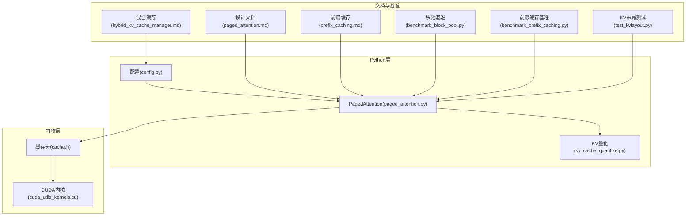
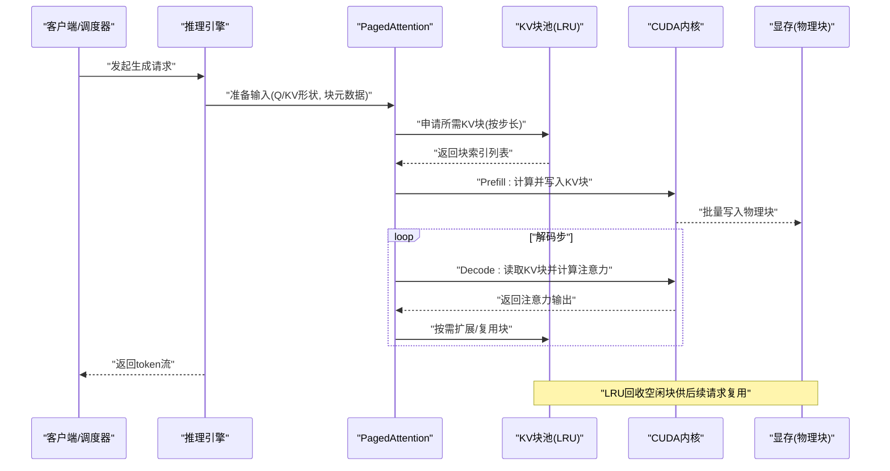
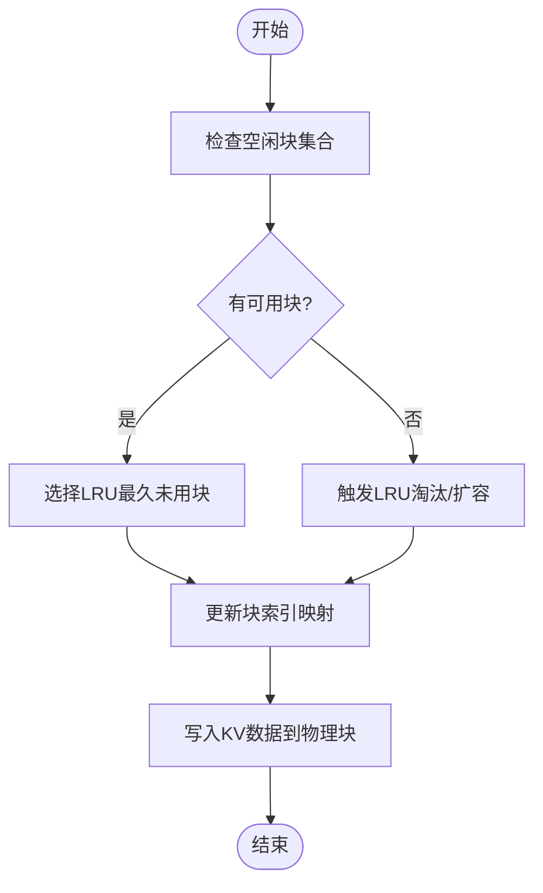
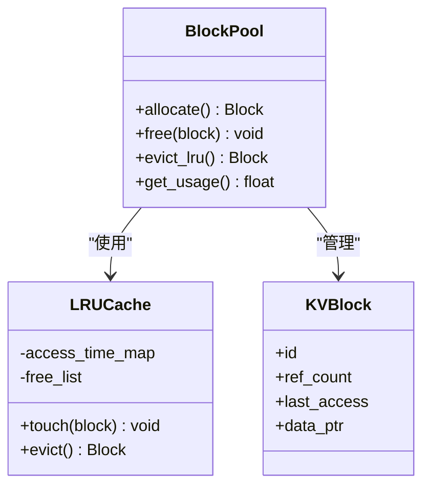
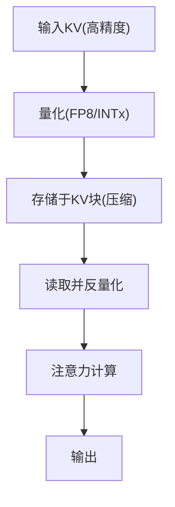
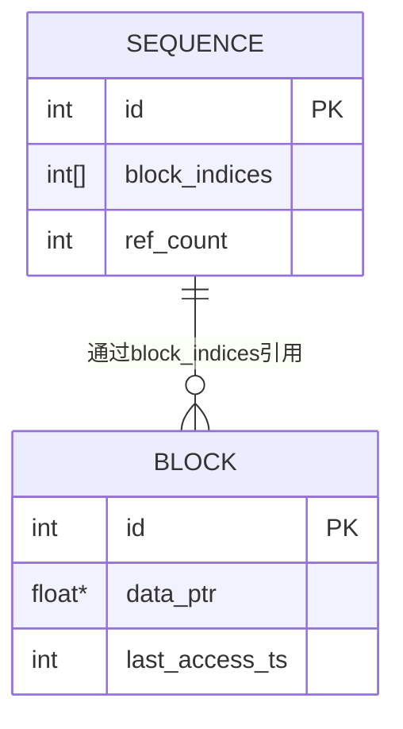
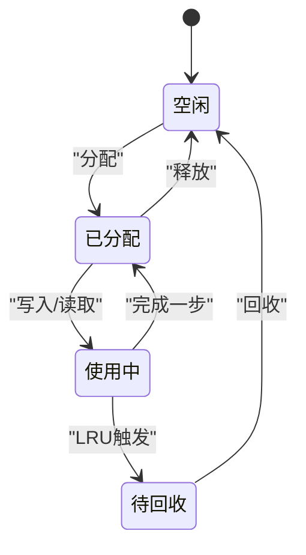
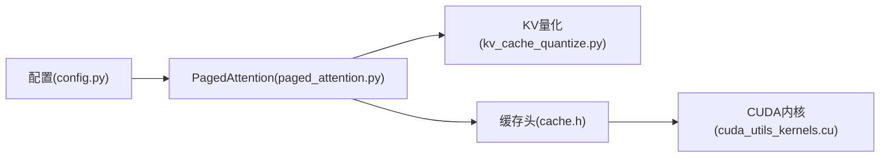

# KV缓存系统

<cite>
**本文引用的文件**   
- [vllm/config.py](file://vllm/config.py)
- [vllm/model_executor/layers/quantization/kv_cache_quantize.py](file://vllm/model_executor/layers/quantization/kv_cache_quantize.py)
- [vllm/model_executor/layers/attention/paged_attention.py](file://vllm/model_executor/layers/attention/paged_attention.py)
- [csrc/cache.h](file://csrc/cache.h)
- [csrc/cuda_utils_kernels.cu](file://csrc/cuda_utils_kernels.cu)
- [benchmarks/benchmark_block_pool.py](file://benchmarks/benchmark_block_pool.py)
- [benchmarks/benchmark_prefix_caching.py](file://benchmarks/benchmark_prefix_caching.py)
- [docs/design/paged_attention.md](file://docs/design/paged_attention.md)
- [docs/design/hybrid_kv_cache_manager.md](file://docs/design/hybrid_kv_cache_manager.md)
- [docs/design/prefix_caching.md](file://docs/design/prefix_caching.md)
- [tests/distributed/test_kvlayout.py](file://tests/distributed/test_kvlayout.py)
</cite>

## 目录
1. [简介](#简介)
2. [项目结构](#项目结构)
3. [核心组件](#核心组件)
4. [架构总览](#架构总览)
5. [详细组件分析](#详细组件分析)
6. [依赖关系分析](#依赖关系分析)
7. [性能考量](#性能考量)
8. [故障排查指南](#故障排查指南)
9. [结论](#结论)
10. [附录](#附录)

## 简介
本文件系统性梳理 vLLM 的 KV 缓存系统，重点围绕 PagedAttention 技术、KV 缓存块分配策略、内存池管理、LRU 替换算法、跨序列共享机制、数据类型存储格式与优化、物理/逻辑映射、配置参数与监控调试工具等维度展开。目标是帮助读者从原理到实现全面理解 vLLM 如何以分页式 KV 缓存提升吞吐并降低显存碎片。

## 项目结构
vLLM 的 KV 缓存相关代码分布在 Python 层（配置、调度、量化）、C++/CUDA 内核层（缓存操作、布局转换）以及基准测试与文档中：
- 配置与高层设计：config.py、docs/design/*
- 注意力与 PagedAttention：model_executor/layers/attention/paged_attention.py
- 量化与数据类型：model_executor/layers/quantization/kv_cache_quantize.py
- CUDA/C++ 内核：csrc/cache.h、csrc/cuda_utils_kernels.cu
- 基准与验证：benchmarks/*、tests/distributed/test_kvlayout.py

图表来源 
- [vllm/config.py](file://vllm/config.py)
- [vllm/model_executor/layers/attention/paged_attention.py](file://vllm/model_executor/layers/attention/paged_attention.py)
- [vllm/model_executor/layers/quantization/kv_cache_quantize.py](file://vllm/model_executor/layers/quantization/kv_cache_quantize.py)
- [csrc/cache.h](file://csrc/cache.h)
- [csrc/cuda_utils_kernels.cu](file://csrc/cuda_utils_kernels.cu)
- [docs/design/paged_attention.md](file://docs/design/paged_attention.md)
- [docs/design/hybrid_kv_cache_manager.md](file://docs/design/hybrid_kv_cache_manager.md)
- [docs/design/prefix_caching.md](file://docs/design/prefix_caching.md)
- [benchmarks/benchmark_block_pool.py](file://benchmarks/benchmark_block_pool.py)
- [benchmarks/benchmark_prefix_caching.py](file://benchmarks/benchmark_prefix_caching.py)
- [tests/distributed/test_kvlayout.py](file://tests/distributed/test_kvlayout.py)

章节来源
- [vllm/config.py](file://vllm/config.py)
- [vllm/model_executor/layers/attention/paged_attention.py](file://vllm/model_executor/layers/attention/paged_attention.py)
- [docs/design/paged_attention.md](file://docs/design/paged_attention.md)

## 核心组件
- PagedAttention 注意力后端：将 KV 张量切分为固定大小的“块”，通过索引表进行非连续访问，避免显存碎片并支持跨序列复用。
- KV 缓存块管理器：负责块的分配、释放、LRU 回收、跨序列共享与一致性维护。
- 量化与数据类型适配：支持 FP16/BF16/FP8 等格式，提供压缩存储与反量化路径，减少带宽与显存占用。
- CUDA/C++ 内核：高效完成块级拷贝、拼接、转置与类型转换，支撑 Prefill/Decode 阶段的 KV 读写。
- 配置与监控：块大小、最大序列长度、内存限制、量化开关、混合缓存策略等关键参数；提供基准与指标采集。

章节来源
- [vllm/model_executor/layers/attention/paged_attention.py](file://vllm/model_executor/layers/attention/paged_attention.py)
- [vllm/model_executor/layers/quantization/kv_cache_quantize.py](file://vllm/model_executor/layers/quantization/kv_cache_quantize.py)
- [csrc/cache.h](file://csrc/cache.h)
- [csrc/cuda_utils_kernels.cu](file://csrc/cuda_utils_kernels.cu)

## 架构总览
下图展示从上层调用到内核执行的端到端流程，包括请求进入、块分配、Prefill/Decode 阶段 KV 写入与读取、以及 LRU 回收。

图表来源 
- [vllm/model_executor/layers/attention/paged_attention.py](file://vllm/model_executor/layers/attention/paged_attention.py)
- [csrc/cuda_utils_kernels.cu](file://csrc/cuda_utils_kernels.cu)
- [docs/design/paged_attention.md](file://docs/design/paged_attention.md)

## 详细组件分析

### PagedAttention 工作原理与块分配策略
- 分块思想：将每个序列的 K/V 按固定块大小划分为若干块，使用“块索引表”描述逻辑位置到物理块的映射。
- 分配策略：优先复用最近最少使用的空闲块；当无可用块时触发 LRU 淘汰或扩容（受内存上限约束）。
- Prefill/Decode 差异：Prefill 阶段批量写入多个块；Decode 阶段逐 token 追加至当前块末尾，必要时申请新块。
- 跨序列共享：相同前缀可被多序列共享，通过引用计数与一致性协议保证安全复用。

图表来源 
- [vllm/model_executor/layers/attention/paged_attention.py](file://vllm/model_executor/layers/attention/paged_attention.py)
- [docs/design/paged_attention.md](file://docs/design/paged_attention.md)

章节来源
- [vllm/model_executor/layers/attention/paged_attention.py](file://vllm/model_executor/layers/attention/paged_attention.py)
- [docs/design/paged_attention.md](file://docs/design/paged_attention.md)

### 内存池管理与 LRU 替换算法
- 内存池：集中管理所有 KV 块，维护空闲链表/堆与已分配映射表，确保 O(1) 分配与释放。
- LRU 策略：记录每块最后访问时间；当内存紧张时，淘汰最久未用的块，将其回收到空闲池。
- 并发安全：在多线程/多进程环境下，通过锁或原子操作保护块状态变更。
- 阈值与水位线：设置高/低水位线，提前触发预取或回收，平滑峰值负载。

图表来源 
- [csrc/cache.h](file://csrc/cache.h)
- [csrc/cuda_utils_kernels.cu](file://csrc/cuda_utils_kernels.cu)

章节来源
- [csrc/cache.h](file://csrc/cache.h)
- [csrc/cuda_utils_kernels.cu](file://csrc/cuda_utils_kernels.cu)

### 数据类型与存储格式（FP16、BF16、FP8）
- 原生精度：默认 FP16/BF16，兼顾精度与带宽。
- 量化压缩：FP8 等低精度格式用于 KV 存储，显著降低显存与带宽压力；解码时按需反量化。
- 量化策略：按通道/按块量化，结合缩放因子与零点偏移；对注意力计算进行融合以减少开销。
- 兼容性：根据模型与硬件能力自动选择最优格式，并提供回退路径。

图表来源 
- [vllm/model_executor/layers/quantization/kv_cache_quantize.py](file://vllm/model_executor/layers/quantization/kv_cache_quantize.py)

章节来源
- [vllm/model_executor/layers/quantization/kv_cache_quantize.py](file://vllm/model_executor/layers/quantization/kv_cache_quantize.py)

### 物理与逻辑映射及跨序列共享
- 逻辑映射：每个序列维护一个“块索引数组”，第 i 个元素指向第 i 个物理块。
- 物理存储：物理块为固定大小的连续内存区域，便于内核批量访存。
- 跨序列共享：相同前缀的 KV 块被多序列共享，通过引用计数与写时复制（CoW）保障一致性。
- 一致性协议：共享块在需要修改时先复制再写入，避免破坏其他序列的结果。

图表来源 
- [vllm/model_executor/layers/attention/paged_attention.py](file://vllm/model_executor/layers/attention/paged_attention.py)
- [csrc/cache.h](file://csrc/cache.h)

章节来源
- [vllm/model_executor/layers/attention/paged_attention.py](file://vllm/model_executor/layers/attention/paged_attention.py)
- [csrc/cache.h](file://csrc/cache.h)

### 生命周期管理：创建、复用与回收
- 创建：Prefill 阶段按步长分配若干块，填充初始 KV。
- 复用：Decode 阶段尽量复用已有块，仅在块满时申请新块。
- 回收：请求结束后，释放其占用的块并更新 LRU；当全局内存紧张时主动淘汰旧块。
- 监控：统计命中率、碎片率、平均块利用率，指导调优。

图表来源 
- [benchmarks/benchmark_block_pool.py](file://benchmarks/benchmark_block_pool.py)

章节来源
- [benchmarks/benchmark_block_pool.py](file://benchmarks/benchmark_block_pool.py)

### 缓存配置参数说明
- 块大小（block_size）：影响访局部性与碎片率，过大导致浪费，过小增加索引开销。
- 最大序列长度（max_seq_len）：决定单序列最大块数，需与显存预算匹配。
- 内存限制（gpu_memory_utilization / max_tokens）：控制整体 KV 容量，防止 OOM。
- 量化开关（kv_cache_dtype）：选择 FP16/BF16/FP8 等，权衡精度与资源。
- 前缀缓存（prefix caching）：开启后启用跨请求共享，提高重复前缀命中。
- 混合缓存策略（hybrid manager）：结合 GPU/CPU/外存，动态迁移热点块。

章节来源
- [vllm/config.py](file://vllm/config.py)
- [docs/design/prefix_caching.md](file://docs/design/prefix_caching.md)
- [docs/design/hybrid_kv_cache_manager.md](file://docs/design/hybrid_kv_cache_manager.md)

### 性能监控与调试工具
- 基准测试：
  - 块池基准：评估分配/释放/命中率与延迟分布。
  - 前缀缓存基准：衡量共享命中率与吞吐增益。
- 指标采集：
  - KV 命中率、块利用率、碎片率、LRU 淘汰率、反量化开销占比。
- 调试方法：
  - 打印块映射与引用计数，定位泄漏与不一致。
  - 可视化内存水位线与回收事件，辅助容量规划。

章节来源
- [benchmarks/benchmark_block_pool.py](file://benchmarks/benchmark_block_pool.py)
- [benchmarks/benchmark_prefix_caching.py](file://benchmarks/benchmark_prefix_caching.py)
- [tests/distributed/test_kvlayout.py](file://tests/distributed/test_kvlayout.py)

## 依赖关系分析
- Python 层依赖 C++/CUDA 内核完成高性能 KV 读写与类型转换。
- 注意力模块依赖块池与量化模块，形成“注意力→块池→内核”的调用链。
- 配置模块驱动注意力与量化行为，统一入口管理。

图表来源 
- [vllm/config.py](file://vllm/config.py)
- [vllm/model_executor/layers/attention/paged_attention.py](file://vllm/model_executor/layers/attention/paged_attention.py)
- [vllm/model_executor/layers/quantization/kv_cache_quantize.py](file://vllm/model_executor/layers/quantization/kv_cache_quantize.py)
- [csrc/cache.h](file://csrc/cache.h)
- [csrc/cuda_utils_kernels.cu](file://csrc/cuda_utils_kernels.cu)

章节来源
- [vllm/config.py](file://vllm/config.py)
- [vllm/model_executor/layers/attention/paged_attention.py](file://vllm/model_executor/layers/attention/paged_attention.py)
- [csrc/cache.h](file://csrc/cache.h)

## 性能考量
- 块大小调优：根据模型维度与硬件特性选择合适 block_size，平衡访存合并与碎片。
- 量化收益：在精度可接受范围内优先使用 FP8，显著降低带宽与显存占用。
- 前缀缓存：针对重复 prompt 场景，显著提升吞吐；需关注一致性开销。
- 内存水位线：合理设置高/低水位，避免频繁回收抖动。
- 内核融合：将反量化与注意力计算融合，减少中间结果与同步开销。

[本节为通用指导，不直接分析具体文件]

## 故障排查指南
- 常见问题：
  - OOM：检查 gpu_memory_utilization 与 max_tokens，适当减小 batch 或增大块大小。
  - 命中率低：调整 block_size 与前缀缓存策略，观察重复前缀比例。
  - 精度异常：核对 kv_cache_dtype 与量化参数，确认反量化路径正确。
- 诊断步骤：
  - 启用日志与指标，查看块分配/释放与 LRU 事件。
  - 运行基准用例，对比不同配置的吞吐与延迟。
  - 使用分布式 KV 布局测试，验证跨设备一致性。

章节来源
- [benchmarks/benchmark_block_pool.py](file://benchmarks/benchmark_block_pool.py)
- [benchmarks/benchmark_prefix_caching.py](file://benchmarks/benchmark_prefix_caching.py)
- [tests/distributed/test_kvlayout.py](file://tests/distributed/test_kvlayout.py)

## 结论
vLLM 的 KV 缓存系统通过 PagedAttention 的分块化设计与高效的内存池/LRU 管理，显著提升了大模型推理的吞吐与显存利用率。配合量化与跨序列共享，可在多种硬件与模型上取得稳定且可扩展的性能表现。合理的配置与持续的监控调优是发挥其潜力的关键。

[本节为总结性内容，不直接分析具体文件]

## 附录
- 设计文档参考：
  - PagedAttention 设计：docs/design/paged_attention.md
  - 混合 KV 缓存管理器：docs/design/hybrid_kv_cache_manager.md
  - 前缀缓存机制：docs/design/prefix_caching.md
- 基准与测试：
  - 块池基准：benchmarks/benchmark_block_pool.py
  - 前缀缓存基准：benchmarks/benchmark_prefix_caching.py
  - KV 布局测试：tests/distributed/test_kvlayout.py

[本节为参考资料汇总，不直接分析具体文件]