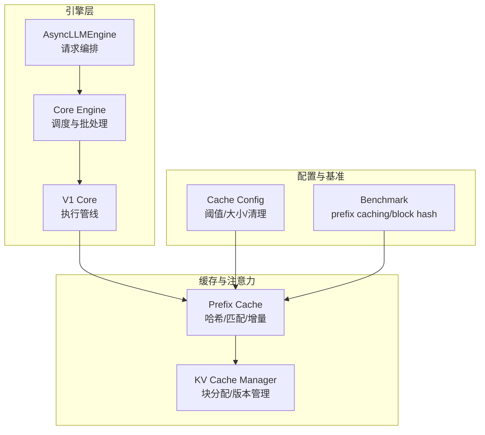
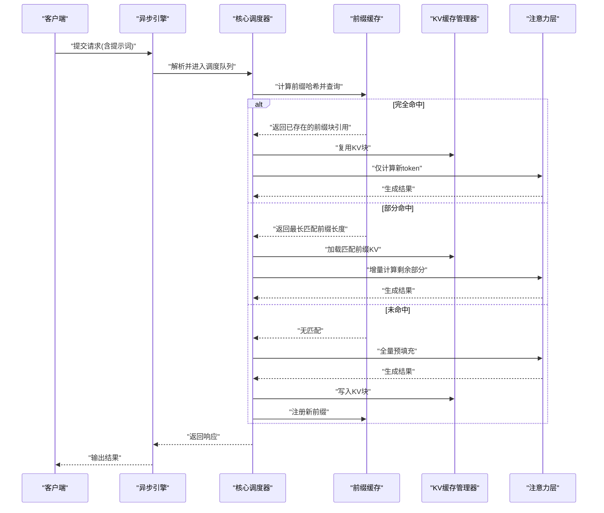
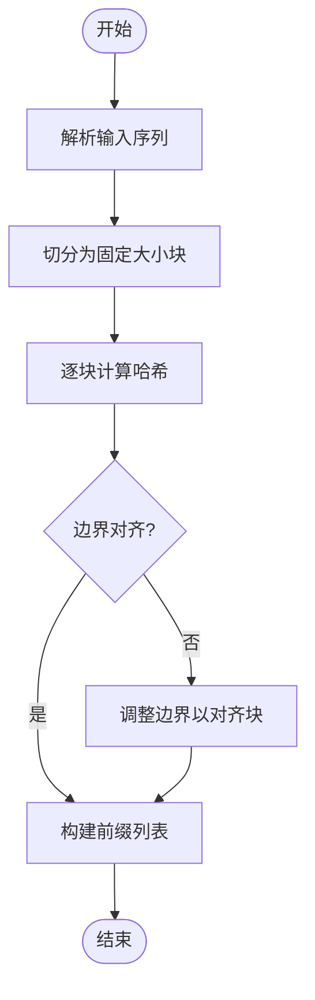
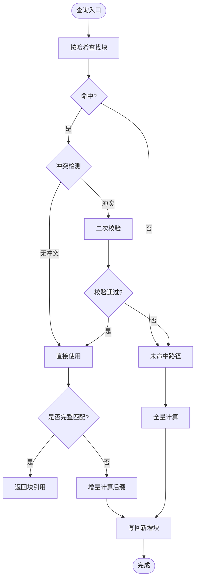
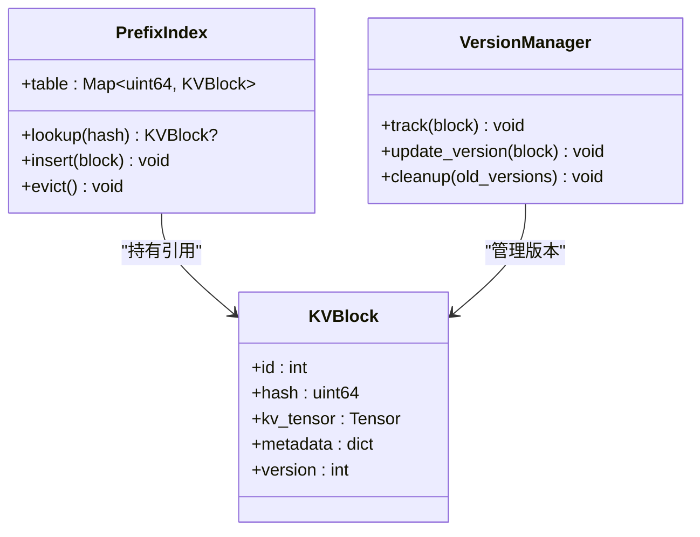
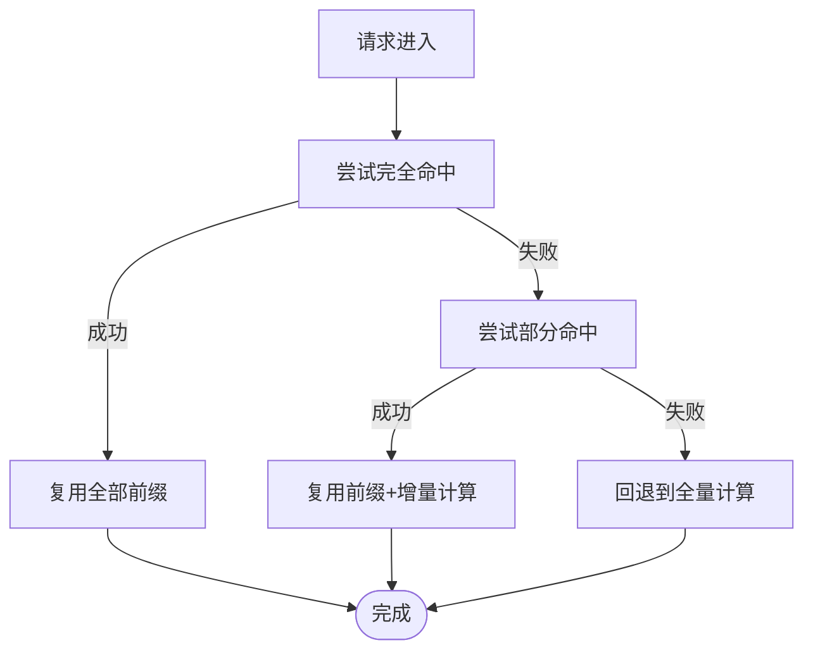
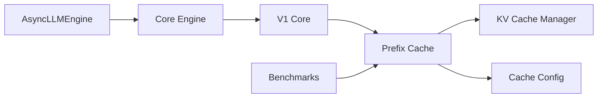

# Prefix缓存

<cite>
**本文引用的文件**   
- [vllm/engine/async_llm_engine.py](file://vllm/engine/async_llm_engine.py)
- [vllm/engine/core.py](file://vllm/engine/core.py)
- [vllm/v1/core.py](file://vllm/v1/core.py)
- [vllm/config/cache_config.py](file://vllm/config/cache_config.py)
- [vllm/model_executor/layers/attention/prefix_cache.py](file://vllm/model_executor/layers/attention/prefix_cache.py)
- [benchmarks/benchmark_prefix_caching.py](file://benchmarks/benchmark_prefix_caching.py)
- [benchmarks/benchmark_prefix_block_hash.py](file://benchmarks/benchmark_prefix_block_hash.py)
- [docs/design/prefix_caching.md](file://docs/design/prefix_caching.md)
- [docs/features/automatic_prefix_caching.md](file://docs/features/automatic_prefix_caching.md)
</cite>

## 目录
1. [简介](#简介)
2. [项目结构](#项目结构)
3. [核心组件](#核心组件)
4. [架构总览](#架构总览)
5. [详细组件分析](#详细组件分析)
6. [依赖关系分析](#依赖关系分析)
7. [性能考量](#性能考量)
8. [故障排查指南](#故障排查指南)
9. [结论](#结论)
10. [附录](#附录)

## 简介
本文件系统性阐述 vLLM 中的 Prefix（前缀）缓存功能，覆盖其核心概念、工作原理、构建过程、存储与索引机制、命中策略与回退、配置与调优、以及性能评估方法。目标是帮助读者从工程实现角度理解并高效使用这一特性，同时为优化和排障提供可操作建议。

## 项目结构
vLLM 的 Prefix 缓存涉及引擎层、KV 缓存管理、注意力层、配置与基准测试等多个模块。下图给出与 Prefix 缓存相关的关键文件与职责概览：

图表来源
- [vllm/engine/async_llm_engine.py](file://vllm/engine/async_llm_engine.py)
- [vllm/engine/core.py](file://vllm/engine/core.py)
- [vllm/v1/core.py](file://vllm/v1/core.py)
- [vllm/model_executor/layers/attention/prefix_cache.py](file://vllm/model_executor/layers/attention/prefix_cache.py)
- [vllm/config/cache_config.py](file://vllm/config/cache_config.py)
- [benchmarks/benchmark_prefix_caching.py](file://benchmarks/benchmark_prefix_caching.py)
- [benchmarks/benchmark_prefix_block_hash.py](file://benchmarks/benchmark_prefix_block_hash.py)

章节来源
- [docs/design/prefix_caching.md](file://docs/design/prefix_caching.md)
- [docs/features/automatic_prefix_caching.md](file://docs/features/automatic_prefix_caching.md)

## 核心组件
- 前缀识别与提取：从输入序列中识别可复用的公共前缀，形成“前缀块”或“前缀片段”，用于跨请求复用。
- 缓存匹配与增量计算：基于哈希索引快速定位已有前缀；若仅部分命中，则对未命中后缀进行增量计算。
- 存储结构与索引：采用分块化的 KV 存储与哈希表映射，支持冲突处理与版本管理，保证一致性。
- 命中策略与回退：优先尝试完全命中；否则回退到部分命中+增量计算；极端情况下回退到全量计算。
- 配置与调优：包括阈值、容量上限、清理策略等参数，影响命中率与资源占用。
- 性能评估：通过基准测试与指标观测，量化命中率、延迟与吞吐收益。

章节来源
- [vllm/model_executor/layers/attention/prefix_cache.py](file://vllm/model_executor/layers/attention/prefix_cache.py)
- [vllm/config/cache_config.py](file://vllm/config/cache_config.py)
- [benchmarks/benchmark_prefix_caching.py](file://benchmarks/benchmark_prefix_caching.py)

## 架构总览
下图展示一次带前缀缓存的请求在引擎与注意力层之间的交互流程，突出前缀识别、缓存查找与增量计算的时序。

图表来源
- [vllm/engine/async_llm_engine.py](file://vllm/engine/async_llm_engine.py)
- [vllm/engine/core.py](file://vllm/engine/core.py)
- [vllm/v1/core.py](file://vllm/v1/core.py)
- [vllm/model_executor/layers/attention/prefix_cache.py](file://vllm/model_executor/layers/attention/prefix_cache.py)

## 详细组件分析

### 前缀识别与构建
- 目标：从输入序列中提取可复用的前缀片段，尽可能最大化跨请求共享。
- 关键点：
  - 分块粒度：按固定大小的块划分，便于批量管理与内存对齐。
  - 内容指纹：对块内容进行哈希，作为缓存键。
  - 边界对齐：确保前缀边界与块边界一致，避免碎片化。
  - 动态扩展：当请求包含更长前缀时，逐步追加新块。

图表来源
- [vllm/model_executor/layers/attention/prefix_cache.py](file://vllm/model_executor/layers/attention/prefix_cache.py)

章节来源
- [vllm/model_executor/layers/attention/prefix_cache.py](file://vllm/model_executor/layers/attention/prefix_cache.py)

### 缓存匹配与增量计算
- 目标：根据前缀哈希快速定位已有块，决定是否需要增量计算。
- 关键点：
  - 精确匹配：哈希完全相同即视为命中。
  - 冲突处理：哈希碰撞时使用二次校验（如内容比较或元数据比对）。
  - 部分命中：找到最长公共前缀，仅对后缀进行计算。
  - 增量计算：复用已存在的KV状态，减少重复计算。

图表来源
- [vllm/model_executor/layers/attention/prefix_cache.py](file://vllm/model_executor/layers/attention/prefix_cache.py)

章节来源
- [vllm/model_executor/layers/attention/prefix_cache.py](file://vllm/model_executor/layers/attention/prefix_cache.py)

### 存储结构与索引机制
- 存储单元：KV 块（固定大小），每个块包含该段前缀的 K/V 张量及元数据。
- 索引结构：哈希表将“块哈希”映射到“块引用”，支持 O(1) 平均查找。
- 版本管理：为每个块维护版本号或时间戳，配合 LRU/LFU 淘汰策略。
- 冲突处理：哈希冲突时通过元数据比对或内容校验解决。
- 一致性：在多并发场景下，使用锁或原子操作保证读写安全。

图表来源
- [vllm/model_executor/layers/attention/prefix_cache.py](file://vllm/model_executor/layers/attention/prefix_cache.py)

章节来源
- [vllm/model_executor/layers/attention/prefix_cache.py](file://vllm/model_executor/layers/attention/prefix_cache.py)

### 命中策略与回退机制
- 完全命中：直接复用全部前缀，零额外计算。
- 部分命中：复用最长公共前缀，对剩余部分增量计算。
- 未命中：全量预填充，并将新前缀注册到缓存。
- 回退路径：当缓存不可用或资源不足时，自动降级为全量计算。

图表来源
- [vllm/engine/core.py](file://vllm/engine/core.py)
- [vllm/v1/core.py](file://vllm/v1/core.py)

章节来源
- [vllm/engine/core.py](file://vllm/engine/core.py)
- [vllm/v1/core.py](file://vllm/v1/core.py)

### 配置选项与调优参数
- 阈值设置：控制最小前缀长度、块大小、哈希采样率等。
- 容量限制：最大缓存块数、单块大小上限、内存水位线。
- 清理策略：LRU/LFU 淘汰、过期清理、碎片合并。
- 性能开关：是否启用自动前缀缓存、是否允许部分命中、是否开启增量计算。

章节来源
- [vllm/config/cache_config.py](file://vllm/config/cache_config.py)

### 性能分析与优化建议
- 关键指标：命中率、部分命中率、平均延迟、吞吐增益、内存占用。
- 分析方法：
  - 使用基准脚本对比开启/关闭前缀缓存的性能差异。
  - 观察不同批次大小下的命中率变化。
  - 监控缓存命中率与淘汰频率，评估容量是否合理。
- 优化建议：
  - 调整块大小以平衡命中率与内存碎片。
  - 提高哈希质量以减少冲突。
  - 针对热点前缀设置更高保留优先级。
  - 结合模型并行与流水线并行，降低跨设备拷贝开销。

章节来源
- [benchmarks/benchmark_prefix_caching.py](file://benchmarks/benchmark_prefix_caching.py)
- [benchmarks/benchmark_prefix_block_hash.py](file://benchmarks/benchmark_prefix_block_hash.py)

## 依赖关系分析
下图展示各模块间的依赖关系，突出前缀缓存与引擎、KV 管理、配置的耦合程度。

图表来源
- [vllm/engine/async_llm_engine.py](file://vllm/engine/async_llm_engine.py)
- [vllm/engine/core.py](file://vllm/engine/core.py)
- [vllm/v1/core.py](file://vllm/v1/core.py)
- [vllm/model_executor/layers/attention/prefix_cache.py](file://vllm/model_executor/layers/attention/prefix_cache.py)
- [vllm/config/cache_config.py](file://vllm/config/cache_config.py)
- [benchmarks/benchmark_prefix_caching.py](file://benchmarks/benchmark_prefix_caching.py)

章节来源
- [vllm/engine/async_llm_engine.py](file://vllm/engine/async_llm_engine.py)
- [vllm/engine/core.py](file://vllm/engine/core.py)
- [vllm/v1/core.py](file://vllm/v1/core.py)
- [vllm/model_executor/layers/attention/prefix_cache.py](file://vllm/model_executor/layers/attention/prefix_cache.py)
- [vllm/config/cache_config.py](file://vllm/config/cache_config.py)
- [benchmarks/benchmark_prefix_caching.py](file://benchmarks/benchmark_prefix_caching.py)

## 性能考量
- 命中率提升：在高重复性场景中，前缀缓存可显著降低重复计算，提升吞吐。
- 内存压力：需合理设置缓存大小，避免 OOM；结合淘汰策略释放冷数据。
- 哈希成本：哈希计算开销应与收益权衡，必要时可采样或近似哈希。
- 并发安全：在高并发下，锁粒度与原子操作影响吞吐，需精细调优。
- 设备间通信：分布式环境下，注意 KV 块的复制与同步开销。

[本节为通用指导，不直接分析具体文件]

## 故障排查指南
- 症状：命中率低
  - 检查块大小与前缀对齐策略是否合理。
  - 验证哈希函数质量，是否存在大量冲突。
  - 确认缓存容量是否过小导致频繁淘汰。
- 症状：内存溢出
  - 降低缓存上限或块大小。
  - 启用更激进的清理策略。
- 症状：延迟升高
  - 检查哈希计算与冲突处理的开销。
  - 评估增量计算路径是否被正确触发。
- 症状：不一致或错误结果
  - 核对版本管理与并发访问控制。
  - 验证 KV 块写入顺序与读取一致性。

章节来源
- [vllm/model_executor/layers/attention/prefix_cache.py](file://vllm/model_executor/layers/attention/prefix_cache.py)
- [vllm/config/cache_config.py](file://vllm/config/cache_config.py)

## 结论
vLLM 的 Prefix 缓存通过智能的前缀识别、高效的哈希索引与增量计算机制，显著提升了重复提示词场景下的推理效率。合理配置阈值、容量与清理策略，并结合基准测试持续优化，可在保证稳定性的前提下获得最佳性能收益。

[本节为总结性内容，不直接分析具体文件]

## 附录
- 设计文档：参考设计说明了解整体思路与权衡。
- 自动前缀缓存：了解自动化提取与管理的特性。
- 基准测试：使用提供的脚本评估实际效果。

章节来源
- [docs/design/prefix_caching.md](file://docs/design/prefix_caching.md)
- [docs/features/automatic_prefix_caching.md](file://docs/features/automatic_prefix_caching.md)
- [benchmarks/benchmark_prefix_caching.py](file://benchmarks/benchmark_prefix_caching.py)
- [benchmarks/benchmark_prefix_block_hash.py](file://benchmarks/benchmark_prefix_block_hash.py)