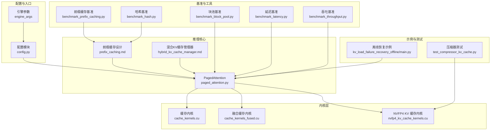
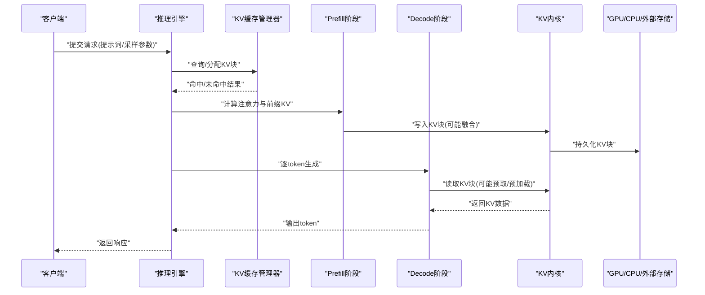
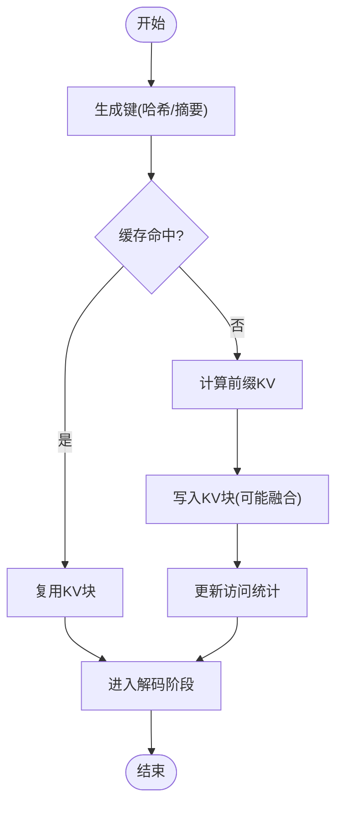
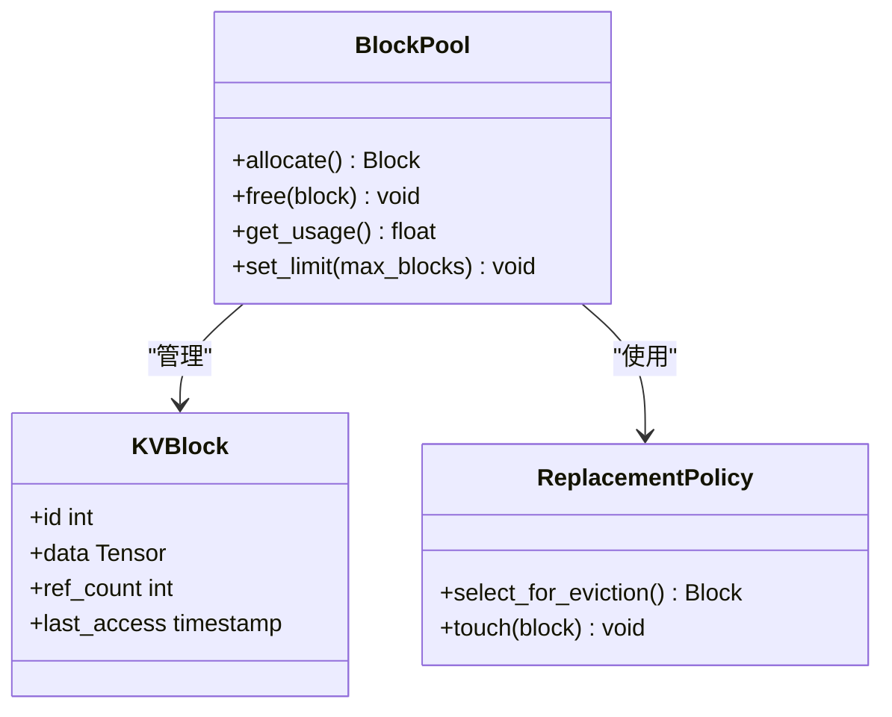
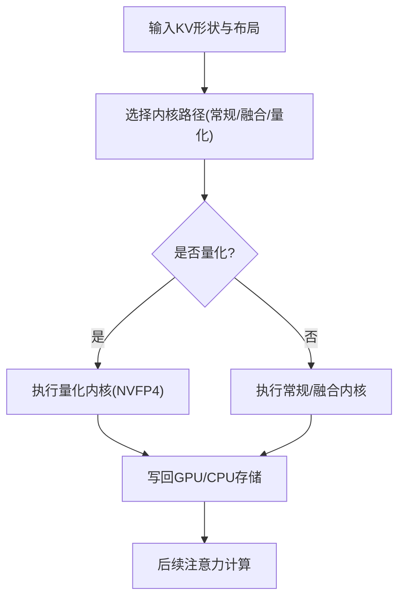
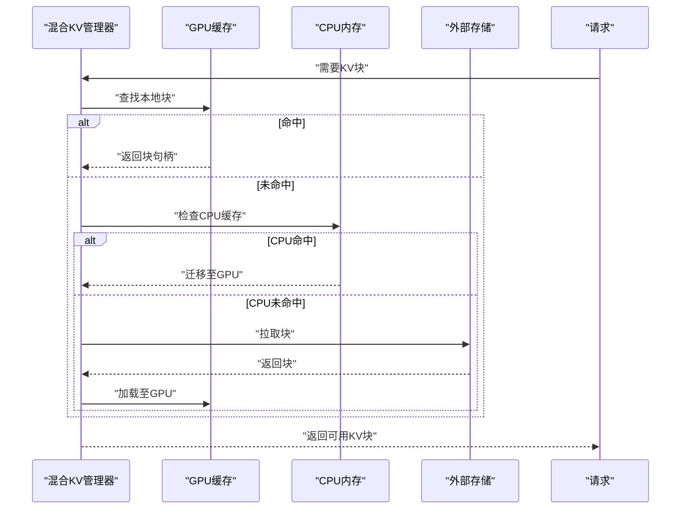
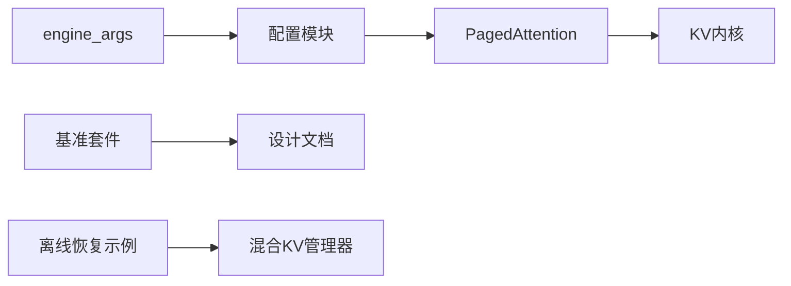

# 缓存优化

<cite>
**本文引用的文件**   
- [vllm/config.py](file://vllm/config.py)
- [vllm/model_executor/layers/attention/paged_attention.py](file://vllm/model_executor/layers/attention/paged_attention.py)
- [benchmarks/benchmark_prefix_caching.py](file://benchmarks/benchmark_prefix_caching.py)
- [benchmarks/benchmark_block_pool.py](file://benchmarks/benchmark_block_pool.py)
- [benchmarks/benchmark_hash.py](file://benchmarks/benchmark_hash.py)
- [benchmarks/benchmark_latency.py](file://benchmarks/benchmark_latency.py)
- [benchmarks/benchmark_throughput.py](file://benchmarks/benchmark_throughput.py)
- [csrc/cache_kernels.cu](file://csrc/cache_kernels.cu)
- [csrc/cache_kernels_fused.cu](file://csrc/cache_kernels_fused.cu)
- [csrc/nvfp4_kv_cache_kernels.cu](file://csrc/nvfp4_kv_cache_kernels.cu)
- [docs/design/prefix_caching.md](file://docs/design/prefix_caching.md)
- [docs/design/hybrid_kv_cache_manager.md](file://docs/design/hybrid_kv_cache_manager.md)
- [docs/design/paged_attention.md](file://docs/design/paged_attention.md)
- [docs/configuration/engine_args.md](file://docs/configuration/engine_args.md)
- [examples/disaggregated/kv_load_failure_recovery_offline/main.py](file://examples/disaggregated/kv_load_failure_recovery_offline/main.py)
- [tests/kernels/test_compressor_kv_cache.py](file://tests/kernels/test_compressor_kv_cache.py)
</cite>

## 目录
1. [简介](#简介)
2. [项目结构](#项目结构)
3. [核心组件](#核心组件)
4. [架构总览](#架构总览)
5. [详细组件分析](#详细组件分析)
6. [依赖关系分析](#依赖关系分析)
7. [性能考量](#性能考量)
8. [故障排查指南](#故障排查指南)
9. [结论](#结论)
10. [附录](#附录)

## 简介
本指南聚焦 vLLM 的 KV 缓存优化，覆盖不同工作负载下的缓存行为特征、参数调优策略、预取与预加载机制、压缩与量化技术、性能分析方法与基准工具，以及面向典型应用场景的实践案例。目标是帮助读者在真实生产环境中通过合理的配置与工程手段最大化吞吐、降低延迟并稳定控制显存占用。

## 项目结构
围绕缓存优化的关键代码与文档分布如下：
- 配置与引擎参数：engine_args、KV 块大小、内存限制、替换策略等
- 注意力与分页缓存：PagedAttention 实现与 KV 块管理
- 内核层：KV 缓存读写、融合算子、NVFP4 KV 缓存内核
- 基准测试：前缀缓存、哈希、块池、延迟与吞吐
- 设计文档：前缀缓存、混合 KV 缓存管理器、PagedAttention
- 示例与测试：离线恢复、压缩器测试

图表来源
- [vllm/config.py](file://vllm/config.py)
- [vllm/model_executor/layers/attention/paged_attention.py](file://vllm/model_executor/layers/attention/paged_attention.py)
- [docs/design/prefix_caching.md](file://docs/design/prefix_caching.md)
- [docs/design/hybrid_kv_cache_manager.md](file://docs/design/hybrid_kv_cache_manager.md)
- [csrc/cache_kernels.cu](file://csrc/cache_kernels.cu)
- [csrc/cache_kernels_fused.cu](file://csrc/cache_kernels_fused.cu)
- [csrc/nvfp4_kv_cache_kernels.cu](file://csrc/nvfp4_kv_cache_kernels.cu)
- [benchmarks/benchmark_prefix_caching.py](file://benchmarks/benchmark_prefix_caching.py)
- [benchmarks/benchmark_block_pool.py](file://benchmarks/benchmark_block_pool.py)
- [benchmarks/benchmark_hash.py](file://benchmarks/benchmark_hash.py)
- [benchmarks/benchmark_latency.py](file://benchmarks/benchmark_latency.py)
- [benchmarks/benchmark_throughput.py](file://benchmarks/benchmark_throughput.py)
- [examples/disaggregated/kv_load_failure_recovery_offline/main.py](file://examples/disaggregated/kv_load_failure_recovery_offline/main.py)
- [tests/kernels/test_compressor_kv_cache.py](file://tests/kernels/test_compressor_kv_cache.py)

章节来源
- [vllm/config.py](file://vllm/config.py)
- [vllm/model_executor/layers/attention/paged_attention.py](file://vllm/model_executor/layers/attention/paged_attention.py)
- [docs/design/prefix_caching.md](file://docs/design/prefix_caching.md)
- [docs/design/hybrid_kv_cache_manager.md](file://docs/design/hybrid_kv_cache_manager.md)
- [docs/design/paged_attention.md](file://docs/design/paged_attention.md)

## 核心组件
- PagedAttention 与 KV 分页缓存：将 KV 张量切分为固定大小的块，按需分配与复用，避免碎片化并提升访存局部性
- 前缀缓存（Prefix Caching）：基于内容或结构的键匹配，跨请求共享公共前缀的 KV 块，显著降低重复计算与显存占用
- 混合 KV 缓存管理器：协调 GPU/CPU/外部存储的多级缓存，支持动态迁移与卸载
- 内核层：高效 KV 写入、读取、拼接与量化格式转换（如 NVFP4），减少拷贝与对齐开销
- 基准套件：针对前缀缓存命中率、块池效率、哈希冲突、延迟与吞吐的系统性评测

章节来源
- [vllm/model_executor/layers/attention/paged_attention.py](file://vllm/model_executor/layers/attention/paged_attention.py)
- [docs/design/prefix_caching.md](file://docs/design/prefix_caching.md)
- [docs/design/hybrid_kv_cache_manager.md](file://docs/design/hybrid_kv_cache_manager.md)
- [csrc/cache_kernels.cu](file://csrc/cache_kernels.cu)
- [csrc/cache_kernels_fused.cu](file://csrc/cache_kernels_fused.cu)
- [csrc/nvfp4_kv_cache_kernels.cu](file://csrc/nvfp4_kv_cache_kernels.cu)

## 架构总览
下图展示从引擎参数到注意力内核的端到端数据流，突出 KV 缓存的关键路径与可优化点。

图表来源
- [vllm/model_executor/layers/attention/paged_attention.py](file://vllm/model_executor/layers/attention/paged_attention.py)
- [csrc/cache_kernels.cu](file://csrc/cache_kernels.cu)
- [csrc/cache_kernels_fused.cu](file://csrc/cache_kernels_fused.cu)
- [csrc/nvfp4_kv_cache_kernels.cu](file://csrc/nvfp4_kv_cache_kernels.cu)

## 详细组件分析

### 前缀缓存与哈希键
- 键生成策略：通常基于 token 序列或结构化摘要，需平衡区分度与计算成本
- 命中判定：按键查找已缓存的 KV 块集合，命中则直接复用；未命中则计算并回填
- 热点检测：统计键访问频率，识别热点前缀以优先保留或预取

图表来源
- [benchmarks/benchmark_hash.py](file://benchmarks/benchmark_hash.py)
- [benchmarks/benchmark_prefix_caching.py](file://benchmarks/benchmark_prefix_caching.py)
- [docs/design/prefix_caching.md](file://docs/design/prefix_caching.md)

章节来源
- [benchmarks/benchmark_hash.py](file://benchmarks/benchmark_hash.py)
- [benchmarks/benchmark_prefix_caching.py](file://benchmarks/benchmark_prefix_caching.py)
- [docs/design/prefix_caching.md](file://docs/design/prefix_caching.md)

### 块池与分页缓存
- 块大小选择：影响访存局部性与碎片率，过大导致浪费，过小增加元数据与索引开销
- 内存限制：设置最大可用块数或显存上限，触发 LRU/LFU 等替换策略
- 替换算法：LRU/LFU/ARC 等，结合访问模式与热点预测进行淘汰决策

图表来源
- [benchmarks/benchmark_block_pool.py](file://benchmarks/benchmark_block_pool.py)
- [vllm/model_executor/layers/attention/paged_attention.py](file://vllm/model_executor/layers/attention/paged_attention.py)

章节来源
- [benchmarks/benchmark_block_pool.py](file://benchmarks/benchmark_block_pool.py)
- [vllm/model_executor/layers/attention/paged_attention.py](file://vllm/model_executor/layers/attention/paged_attention.py)

### 内核层与融合优化
- 缓存内核：提供高效的 KV 写入、读取、拼接与转置操作，减少主机-设备拷贝
- 融合算子：将多个步骤合并为单次内核调用，降低启动与同步开销
- 量化格式：NVFP4 等低精度格式用于 KV 存储，节省带宽与显存，同时保持精度可接受

图表来源
- [csrc/cache_kernels.cu](file://csrc/cache_kernels.cu)
- [csrc/cache_kernels_fused.cu](file://csrc/cache_kernels_fused.cu)
- [csrc/nvfp4_kv_cache_kernels.cu](file://csrc/nvfp4_kv_cache_kernels.cu)

章节来源
- [csrc/cache_kernels.cu](file://csrc/cache_kernels.cu)
- [csrc/cache_kernels_fused.cu](file://csrc/cache_kernels_fused.cu)
- [csrc/nvfp4_kv_cache_kernels.cu](file://csrc/nvfp4_kv_cache_kernels.cu)

### 混合 KV 缓存管理器
- 多级存储：GPU 高速缓存、CPU 内存、外部存储（磁盘/网络）协同
- 动态迁移：根据访问热度与资源压力自动上下迁移 KV 块
- 容错与恢复：支持离线恢复与失败重试，保障服务稳定性

图表来源
- [docs/design/hybrid_kv_cache_manager.md](file://docs/design/hybrid_kv_cache_manager.md)
- [examples/disaggregated/kv_load_failure_recovery_offline/main.py](file://examples/disaggregated/kv_load_failure_recovery_offline/main.py)

章节来源
- [docs/design/hybrid_kv_cache_manager.md](file://docs/design/hybrid_kv_cache_manager.md)
- [examples/disaggregated/kv_load_failure_recovery_offline/main.py](file://examples/disaggregated/kv_load_failure_recovery_offline/main.py)

## 依赖关系分析
- 配置到实现：engine_args 决定 KV 块大小、内存限制、替换策略与量化开关
- 注意力到内核：PagedAttention 调用缓存内核完成 KV 读写与融合
- 基准到设计：基准套件验证前缀缓存命中率、块池效率与哈希冲突率
- 示例到管理器：离线恢复示例演示混合管理器在失败场景下的恢复流程

图表来源
- [docs/configuration/engine_args.md](file://docs/configuration/engine_args.md)
- [vllm/config.py](file://vllm/config.py)
- [vllm/model_executor/layers/attention/paged_attention.py](file://vllm/model_executor/layers/attention/paged_attention.py)
- [csrc/cache_kernels.cu](file://csrc/cache_kernels.cu)
- [benchmarks/benchmark_prefix_caching.py](file://benchmarks/benchmark_prefix_caching.py)
- [docs/design/prefix_caching.md](file://docs/design/prefix_caching.md)
- [examples/disaggregated/kv_load_failure_recovery_offline/main.py](file://examples/disaggregated/kv_load_failure_recovery_offline/main.py)
- [docs/design/hybrid_kv_cache_manager.md](file://docs/design/hybrid_kv_cache_manager.md)

章节来源
- [docs/configuration/engine_args.md](file://docs/configuration/engine_args.md)
- [vllm/config.py](file://vllm/config.py)
- [vllm/model_executor/layers/attention/paged_attention.py](file://vllm/model_executor/layers/attention/paged_attention.py)
- [csrc/cache_kernels.cu](file://csrc/cache_kernels.cu)
- [benchmarks/benchmark_prefix_caching.py](file://benchmarks/benchmark_prefix_caching.py)
- [docs/design/prefix_caching.md](file://docs/design/prefix_caching.md)
- [examples/disaggregated/kv_load_failure_recovery_offline/main.py](file://examples/disaggregated/kv_load_failure_recovery_offline/main.py)
- [docs/design/hybrid_kv_cache_manager.md](file://docs/design/hybrid_kv_cache_manager.md)

## 性能考量
- 工作负载特征
  - 请求模式：批量大小、并发度、流式与非流式对缓存命中率的影响
  - 序列长度分布：长上下文易造成块碎片与频繁替换，短上下文利于高命中
  - 重复率：高重复率显著提升前缀缓存收益，低重复率需依赖块池与量化
- 参数调优
  - 块大小：根据平均序列长度与访存模式调整，兼顾局部性与元数据开销
  - 内存限制：设定上限防止 OOM，结合替换策略保证热点保留
  - 替换算法：LRU/LFU/ARC 的选择取决于访问时序与热点稳定性
- 预取与预加载
  - 热点预测：基于历史访问统计与滑动窗口预测下一批需要的 KV 块
  - 批量加载：合并多次 I/O 与内核调用，减少同步与启动开销
- 压缩与量化
  - 数据格式：NVFP4 等低精度格式降低带宽与显存占用
  - 精度权衡：评估量化误差对生成质量的影响，必要时分层量化
  - 访问性能：量化内核需与注意力计算融合以减少额外开销
- 性能分析方法
  - 瓶颈识别：关注 KV 写入/读取带宽、内核启动、内存迁移与替换开销
  - 热点检测：统计键访问频率与块引用计数，定位热点前缀与块
  - 容量规划：依据峰值并发与序列长度估算所需块数与显存上限

[本节为通用指导，不直接分析具体文件]

## 故障排查指南
- 常见问题
  - 命中率低：检查键生成策略与哈希冲突，调整块大小与内存限制
  - OOM：降低并发或块大小，启用量化与外部存储迁移
  - 延迟抖动：观察替换与迁移活动，优化预取策略与批量加载
- 诊断工具
  - 基准套件：使用前缀缓存、块池、哈希、延迟与吞吐基准定位问题
  - 日志与指标：监控命中率、块使用率、迁移次数与内核耗时
- 恢复与容错
  - 离线恢复：利用示例脚本在失败后重建 KV 状态，确保服务连续性

章节来源
- [benchmarks/benchmark_prefix_caching.py](file://benchmarks/benchmark_prefix_caching.py)
- [benchmarks/benchmark_block_pool.py](file://benchmarks/benchmark_block_pool.py)
- [benchmarks/benchmark_hash.py](file://benchmarks/benchmark_hash.py)
- [benchmarks/benchmark_latency.py](file://benchmarks/benchmark_latency.py)
- [benchmarks/benchmark_throughput.py](file://benchmarks/benchmark_throughput.py)
- [examples/disaggregated/kv_load_failure_recovery_offline/main.py](file://examples/disaggregated/kv_load_failure_recovery_offline/main.py)

## 结论
vLLM 的 KV 缓存体系通过分页、前缀缓存、混合管理与内核融合等手段，在高并发与长上下文场景下实现了优异的吞吐与延迟表现。实际优化需结合工作负载特征，合理选择块大小、内存限制与替换策略，并充分利用预取、预加载与量化技术。借助基准套件与诊断方法，可系统性地识别瓶颈并制定容量规划，确保生产环境的稳定性与经济性。

[本节为总结，不直接分析具体文件]

## 附录
- 基准测试方法与工具
  - 前缀缓存基准：评估命中率与收益，调整键生成与缓存策略
  - 块池基准：测量分配/释放效率与碎片率，优化块大小与限制
  - 哈希基准：分析冲突率与计算开销，改进哈希函数与桶大小
  - 延迟与吞吐基准：端到端压测，定位瓶颈并验证优化效果
- 实践案例
  - 高重复对话：启用前缀缓存与热点预取，显著提升吞吐
  - 长文档问答：增大块大小与内存限制，结合量化降低显存占用
  - 多模态输入：分离文本与视觉 KV，独立缓存与迁移

章节来源
- [benchmarks/benchmark_prefix_caching.py](file://benchmarks/benchmark_prefix_caching.py)
- [benchmarks/benchmark_block_pool.py](file://benchmarks/benchmark_block_pool.py)
- [benchmarks/benchmark_hash.py](file://benchmarks/benchmark_hash.py)
- [benchmarks/benchmark_latency.py](file://benchmarks/benchmark_latency.py)
- [benchmarks/benchmark_throughput.py](file://benchmarks/benchmark_throughput.py)
- [tests/kernels/test_compressor_kv_cache.py](file://tests/kernels/test_compressor_kv_cache.py)