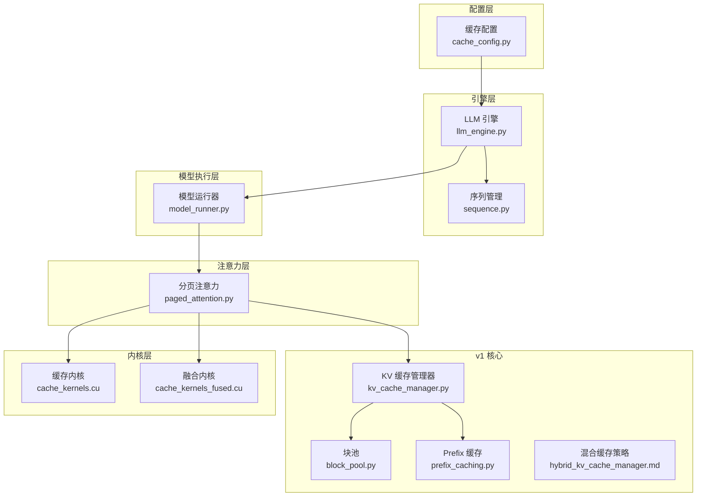
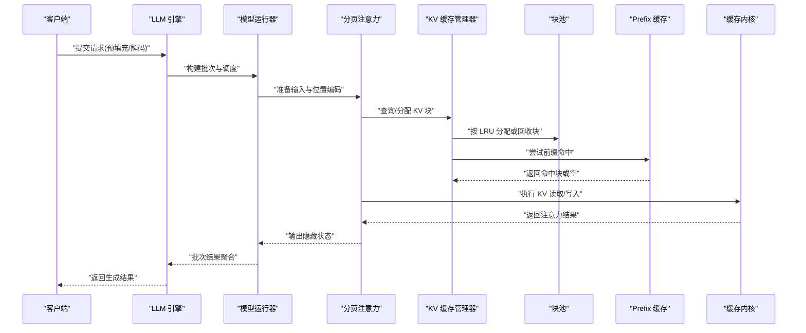
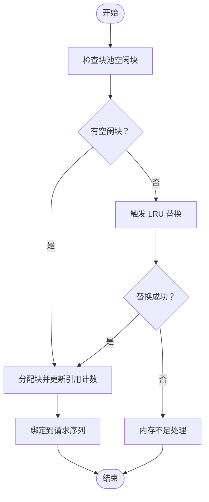
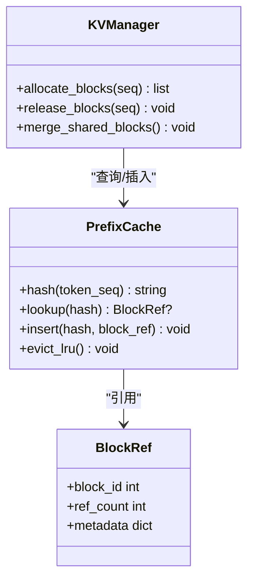
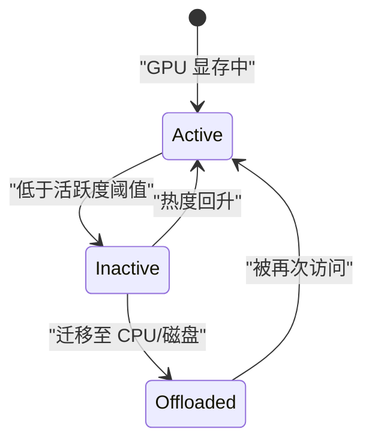
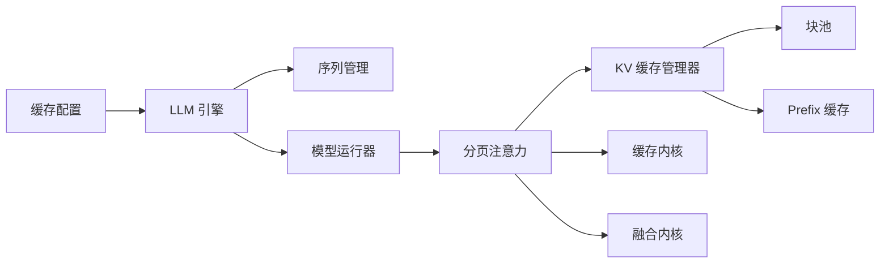

# 缓存机制

<cite>
**本文引用的文件**   
- [vllm/config.py](file://vllm/config.py)
- [vllm/sequence.py](file://vllm/sequence.py)
- [vllm/engine/llm_engine.py](file://vllm/engine/llm_engine.py)
- [vllm/model_executor/model_runner.py](file://vllm/model_executor/model_runner.py)
- [vllm/model_executor/layers/attention/paged_attention.py](file://vllm/model_executor/layers/attention/paged_attention.py)
- [vllm/v1/core/kv_cache_manager.py](file://vllm/v1/core/kv_cache_manager.py)
- [vllm/v1/core/block_pool.py](file://vllm/v1/core/block_pool.py)
- [vllm/v1/core/cache_config.py](file://vllm/v1/core/cache_config.py)
- [vllm/v1/core/prefix_caching.py](file://vllm/v1/core/prefix_caching.py)
- [benchmarks/benchmark_prefix_caching.py](file://benchmarks/benchmark_prefix_caching.py)
- [benchmarks/benchmark_prefix_block_hash.py](file://benchmarks/benchmark_prefix_block_hash.py)
- [benchmarks/benchmark_block_pool.py](file://benchmarks/benchmark_block_pool.py)
- [csrc/cache_kernels.cu](file://csrc/cache_kernels.cu)
- [csrc/cache_kernels_fused.cu](file://csrc/cache_kernels_fused.cu)
- [docs/design/prefix_caching.md](file://docs/design/prefix_caching.md)
- [docs/design/hybrid_kv_cache_manager.md](file://docs/design/hybrid_kv_cache_manager.md)
- [docs/design/paged_attention.md](file://docs/design/paged_attention.md)
- [examples/disaggregated/flexkv_connector/example.py](file://examples/disaggregated/flexkv_connector/example.py)
- [examples/disaggregated/mooncake_connector/example.py](file://examples/disaggregated/mooncake_connector/example.py)
- [examples/disaggregated/lmcache/example.py](file://examples/disaggregated/lmcache/example.py)
</cite>

## 目录
1. [简介](#简介)
2. [项目结构](#项目结构)
3. [核心组件](#核心组件)
4. [架构总览](#架构总览)
5. [详细组件分析](#详细组件分析)
6. [依赖关系分析](#依赖关系分析)
7. [性能考量](#性能考量)
8. [故障排查指南](#故障排查指南)
9. [结论](#结论)
10. [附录](#附录)

## 简介
本文件系统性阐述 vLLM 的缓存机制设计与实现，重点覆盖：
- KV 缓存的工作原理：块分配策略、LRU 替换与内存池管理
- Prefix 缓存的概念与实现：前缀复用、命中率与存储优化
- 缓存的持久化与共享：跨会话缓存与分布式缓存支持
- 缓存配置参数：块大小、最大序列长度、内存限制等
- 监控与调试：命中率统计、内存使用分析与性能分析
- 最佳实践与不同工作负载的优化建议

## 项目结构
vLLM 的缓存相关代码分布在多个层次：
- 配置层：集中定义缓存相关参数（如块大小、最大序列长度、内存限制）
- 引擎层：调度请求、管理序列生命周期、协调缓存访问
- 模型执行层：调用注意力内核进行 KV 读写
- 注意力层：Paged Attention 实现，驱动 KV 缓存的访存模式
- v1 核心：KV 缓存管理器、块池、Prefix 缓存、混合缓存策略
- C++/CUDA 内核：高效 KV 缓存操作与融合算子
- 设计文档与基准测试：解释设计理念与性能评估

图表来源
- [vllm/v1/core/cache_config.py](file://vllm/v1/core/cache_config.py)
- [vllm/engine/llm_engine.py](file://vllm/engine/llm_engine.py)
- [vllm/sequence.py](file://vllm/sequence.py)
- [vllm/model_executor/model_runner.py](file://vllm/model_executor/model_runner.py)
- [vllm/model_executor/layers/attention/paged_attention.py](file://vllm/model_executor/layers/attention/paged_attention.py)
- [vllm/v1/core/kv_cache_manager.py](file://vllm/v1/core/kv_cache_manager.py)
- [vllm/v1/core/block_pool.py](file://vllm/v1/core/block_pool.py)
- [vllm/v1/core/prefix_caching.py](file://vllm/v1/core/prefix_caching.py)
- [csrc/cache_kernels.cu](file://csrc/cache_kernels.cu)
- [csrc/cache_kernels_fused.cu](file://csrc/cache_kernels_fused.cu)

章节来源
- [vllm/config.py](file://vllm/config.py)
- [vllm/engine/llm_engine.py](file://vllm/engine/llm_engine.py)
- [vllm/sequence.py](file://vllm/sequence.py)
- [vllm/model_executor/model_runner.py](file://vllm/model_executor/model_runner.py)
- [vllm/model_executor/layers/attention/paged_attention.py](file://vllm/model_executor/layers/attention/paged_attention.py)
- [vllm/v1/core/kv_cache_manager.py](file://vllm/v1/core/kv_cache_manager.py)
- [vllm/v1/core/block_pool.py](file://vllm/v1/core/block_pool.py)
- [vllm/v1/core/cache_config.py](file://vllm/v1/core/cache_config.py)
- [vllm/v1/core/prefix_caching.py](file://vllm/v1/core/prefix_caching.py)
- [csrc/cache_kernels.cu](file://csrc/cache_kernels.cu)
- [csrc/cache_kernels_fused.cu](file://csrc/cache_kernels_fused.cu)

## 核心组件
- 缓存配置（Cache Config）：定义块大小、最大序列长度、内存限制、是否启用 Prefix 缓存、混合缓存策略开关等关键参数。
- 序列管理（Sequence）：维护每个请求的 token 序列状态、已生成 token 数、当前使用的 KV 块索引等。
- LLM 引擎（Engine）：编排预填充与解码阶段，协调 KV 缓存的分配与回收，触发注意力计算。
- 模型运行器（Model Runner）：将请求映射到具体模型层，调用注意力内核完成 KV 读取/写入。
- 分页注意力（Paged Attention）：以块为单位组织 KV 张量，避免连续内存碎片，提升访存效率。
- KV 缓存管理器（KV Cache Manager）：统一抽象 KV 缓存的分配、命中、替换、合并等操作。
- 块池（Block Pool）：底层块分配与释放，支持 LRU 替换策略与内存水位控制。
- Prefix 缓存（Prefix Cache）：基于哈希的前缀块复用，减少重复计算的 KV 占用与计算开销。
- 内核（Kernels）：高效的 KV 缓存读写、拼接、压缩与融合算子，降低 CPU/GPU 同步开销。

章节来源
- [vllm/v1/core/cache_config.py](file://vllm/v1/core/cache_config.py)
- [vllm/sequence.py](file://vllm/sequence.py)
- [vllm/engine/llm_engine.py](file://vllm/engine/llm_engine.py)
- [vllm/model_executor/model_runner.py](file://vllm/model_executor/model_runner.py)
- [vllm/model_executor/layers/attention/paged_attention.py](file://vllm/model_executor/layers/attention/paged_attention.py)
- [vllm/v1/core/kv_cache_manager.py](file://vllm/v1/core/kv_cache_manager.py)
- [vllm/v1/core/block_pool.py](file://vllm/v1/core/block_pool.py)
- [vllm/v1/core/prefix_caching.py](file://vllm/v1/core/prefix_caching.py)
- [csrc/cache_kernels.cu](file://csrc/cache_kernels.cu)
- [csrc/cache_kernels_fused.cu](file://csrc/cache_kernels_fused.cu)

## 架构总览
下图展示从请求进入引擎到注意力内核执行的完整流程，以及 KV 缓存在各阶段的参与方式。

图表来源
- [vllm/engine/llm_engine.py](file://vllm/engine/llm_engine.py)
- [vllm/model_executor/model_runner.py](file://vllm/model_executor/model_runner.py)
- [vllm/model_executor/layers/attention/paged_attention.py](file://vllm/model_executor/layers/attention/paged_attention.py)
- [vllm/v1/core/kv_cache_manager.py](file://vllm/v1/core/kv_cache_manager.py)
- [vllm/v1/core/block_pool.py](file://vllm/v1/core/block_pool.py)
- [vllm/v1/core/prefix_caching.py](file://vllm/v1/core/prefix_caching.py)
- [csrc/cache_kernels.cu](file://csrc/cache_kernels.cu)

## 详细组件分析

### KV 缓存与分页注意力
- 工作原理：将 KV 张量切分为固定大小的块，通过块索引表组织，避免大张量连续分配导致的碎片问题。
- 分配策略：优先复用最近最少使用（LRU）的块；当内存紧张时触发替换，必要时回退到 CPU 或磁盘（取决于配置）。
- 内存池管理：块池维护空闲块链表与活跃块集合，提供原子分配/释放接口，保证并发安全。
- 注意力访存：Paged Attention 根据块索引直接访存，减少数据搬运与拷贝，提高带宽利用率。

图表来源
- [vllm/v1/core/block_pool.py](file://vllm/v1/core/block_pool.py)
- [vllm/v1/core/kv_cache_manager.py](file://vllm/v1/core/kv_cache_manager.py)
- [vllm/model_executor/layers/attention/paged_attention.py](file://vllm/model_executor/layers/attention/paged_attention.py)

章节来源
- [vllm/model_executor/layers/attention/paged_attention.py](file://vllm/model_executor/layers/attention/paged_attention.py)
- [vllm/v1/core/block_pool.py](file://vllm/v1/core/block_pool.py)
- [vllm/v1/core/kv_cache_manager.py](file://vllm/v1/core/kv_cache_manager.py)

### Prefix 缓存与前缀复用
- 概念：对相同前缀（token 序列）的 KV 缓存进行哈希标识，命中后直接复用已有块，避免重复计算。
- 实现要点：
  - 前缀哈希：基于 token ID 与位置编码计算稳定哈希值
  - 命中判定：比较哈希与元数据（长度、类型、精度等）
  - 存储优化：仅保留必要元数据，按需加载实际块
- 效果：显著提升多轮对话、批量相似提示场景的吞吐与延迟表现

图表来源
- [vllm/v1/core/prefix_caching.py](file://vllm/v1/core/prefix_caching.py)
- [vllm/v1/core/kv_cache_manager.py](file://vllm/v1/core/kv_cache_manager.py)

章节来源
- [vllm/v1/core/prefix_caching.py](file://vllm/v1/core/prefix_caching.py)
- [vllm/v1/core/kv_cache_manager.py](file://vllm/v1/core/kv_cache_manager.py)

### 混合缓存策略与内存管理
- 混合策略：结合 GPU 显存与 CPU/磁盘，动态迁移不活跃的 KV 块，平衡延迟与容量。
- 内存水位：设置阈值触发换入/换出，避免 OOM 同时保持高命中率。
- 一致性：确保跨设备的数据一致性与可见性，防止脏读。

图表来源
- [docs/design/hybrid_kv_cache_manager.md](file://docs/design/hybrid_kv_cache_manager.md)
- [vllm/v1/core/kv_cache_manager.py](file://vllm/v1/core/kv_cache_manager.py)

章节来源
- [docs/design/hybrid_kv_cache_manager.md](file://docs/design/hybrid_kv_cache_manager.md)
- [vllm/v1/core/kv_cache_manager.py](file://vllm/v1/core/kv_cache_manager.py)

### 内核级优化
- 缓存内核：提供高效的 KV 读取、写入、拼接、压缩等操作，减少 Python 层开销。
- 融合算子：将多次访存合并为单次内核启动，降低同步与调度成本。
- 向量化：利用 SIMD/GPU 向量指令提升吞吐。

章节来源
- [csrc/cache_kernels.cu](file://csrc/cache_kernels.cu)
- [csrc/cache_kernels_fused.cu](file://csrc/cache_kernels_fused.cu)

## 依赖关系分析
- 配置依赖：缓存行为由 cache_config 控制，影响引擎调度与内核选择。
- 引擎依赖：LLM 引擎依赖序列管理与模型运行器，间接依赖注意力与缓存管理器。
- 注意力依赖：Paged Attention 强依赖 KV 缓存管理器与块池，决定访存模式。
- 内核依赖：CUDA 内核被注意力层调用，提供底层高性能实现。

图表来源
- [vllm/v1/core/cache_config.py](file://vllm/v1/core/cache_config.py)
- [vllm/engine/llm_engine.py](file://vllm/engine/llm_engine.py)
- [vllm/sequence.py](file://vllm/sequence.py)
- [vllm/model_executor/model_runner.py](file://vllm/model_executor/model_runner.py)
- [vllm/model_executor/layers/attention/paged_attention.py](file://vllm/model_executor/layers/attention/paged_attention.py)
- [vllm/v1/core/kv_cache_manager.py](file://vllm/v1/core/kv_cache_manager.py)
- [vllm/v1/core/block_pool.py](file://vllm/v1/core/block_pool.py)
- [vllm/v1/core/prefix_caching.py](file://vllm/v1/core/prefix_caching.py)
- [csrc/cache_kernels.cu](file://csrc/cache_kernels.cu)
- [csrc/cache_kernels_fused.cu](file://csrc/cache_kernels_fused.cu)

章节来源
- [vllm/v1/core/cache_config.py](file://vllm/v1/core/cache_config.py)
- [vllm/engine/llm_engine.py](file://vllm/engine/llm_engine.py)
- [vllm/sequence.py](file://vllm/sequence.py)
- [vllm/model_executor/model_runner.py](file://vllm/model_executor/model_runner.py)
- [vllm/model_executor/layers/attention/paged_attention.py](file://vllm/model_executor/layers/attention/paged_attention.py)
- [vllm/v1/core/kv_cache_manager.py](file://vllm/v1/core/kv_cache_manager.py)
- [vllm/v1/core/block_pool.py](file://vllm/v1/core/block_pool.py)
- [vllm/v1/core/prefix_caching.py](file://vllm/v1/core/prefix_caching.py)
- [csrc/cache_kernels.cu](file://csrc/cache_kernels.cu)
- [csrc/cache_kernels_fused.cu](file://csrc/cache_kernels_fused.cu)

## 性能考量
- 块大小选择：较大块减少索引开销但增加内存浪费；较小块提高利用率但增加访存次数。需根据模型维度与批大小调优。
- 最大序列长度：过长序列导致块数量激增，可能触发频繁替换与换入换出。
- 内存限制：合理设置显存上限，避免 OOM；结合混合缓存策略提升容量。
- 命中率优化：通过 Prefix 缓存与相似度聚类提升复用率。
- 内核融合：减少内核启动与同步开销，提升整体吞吐。

[本节为通用指导，无需特定文件来源]

## 故障排查指南
- 命中率低：检查 Prefix 缓存哈希冲突、前缀相似度不足、块大小不合理。
- 内存不足：调整块大小、降低最大序列长度、启用混合缓存或增加显存。
- 延迟升高：关注内核融合是否生效、是否存在频繁换入换出、CPU/GPU 同步瓶颈。
- 数据不一致：检查跨设备迁移的一致性协议与锁机制。

章节来源
- [vllm/v1/core/prefix_caching.py](file://vllm/v1/core/prefix_caching.py)
- [vllm/v1/core/kv_cache_manager.py](file://vllm/v1/core/kv_cache_manager.py)
- [csrc/cache_kernels.cu](file://csrc/cache_kernels.cu)

## 结论
vLLM 的缓存机制通过分页注意力、块池管理、Prefix 缓存与内核优化，实现了高吞吐、低延迟的 KV 缓存服务。合理配置块大小、内存限制与混合策略，可针对不同工作负载获得最佳性能。监控命中率与内存使用，持续调优，是保障生产稳定性的关键。

[本节为总结，无需特定文件来源]

## 附录

### 缓存配置参数说明
- 块大小（block_size）：KV 缓存块的大小，影响内存利用率与访存效率
- 最大序列长度（max_seq_len）：单个请求允许的最大 token 数
- 内存限制（gpu_memory_utilization / cpu_memory）：显存与 CPU 内存使用上限
- Prefix 缓存开关（enable_prefix_caching）：是否启用前缀复用
- 混合缓存策略（hybrid_cache）：是否启用 GPU/CPU/磁盘混合存储

章节来源
- [vllm/v1/core/cache_config.py](file://vllm/v1/core/cache_config.py)
- [vllm/config.py](file://vllm/config.py)

### 监控与调试工具
- 命中率统计：通过 Prefix 缓存命中计数器与 KV 块复用率评估
- 内存使用分析：监控块池空闲/活跃块数量、换入换出频率
- 性能分析：使用基准测试工具评估不同配置下的吞吐与延迟

章节来源
- [benchmarks/benchmark_prefix_caching.py](file://benchmarks/benchmark_prefix_caching.py)
- [benchmarks/benchmark_prefix_block_hash.py](file://benchmarks/benchmark_prefix_block_hash.py)
- [benchmarks/benchmark_block_pool.py](file://benchmarks/benchmark_block_pool.py)

### 持久化与共享机制
- 跨会话缓存：通过 Prefix 缓存持久化常见前缀，加速冷启动与重复请求
- 分布式缓存：支持外部连接器（如 FlexKV、Mooncake、LMCache）实现跨节点共享

章节来源
- [docs/design/prefix_caching.md](file://docs/design/prefix_caching.md)
- [examples/disaggregated/flexkv_connector/example.py](file://examples/disaggregated/flexkv_connector/example.py)
- [examples/disaggregated/mooncake_connector/example.py](file://examples/disaggregated/mooncake_connector/example.py)
- [examples/disaggregated/lmcache/example.py](file://examples/disaggregated/lmcache/example.py)

### 最佳实践与优化建议
- 短上下文高频请求：增大块大小，启用 Prefix 缓存，提升命中率
- 长文档处理：减小块大小，启用混合缓存，避免 OOM
- 批量相似提示：优化哈希函数，减少冲突，提升复用率
- 高吞吐场景：启用内核融合，减少同步开销，调整批大小

[本节为通用指导，无需特定文件来源]