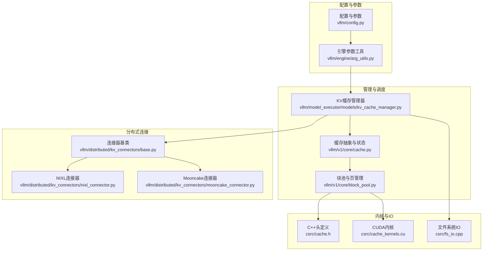
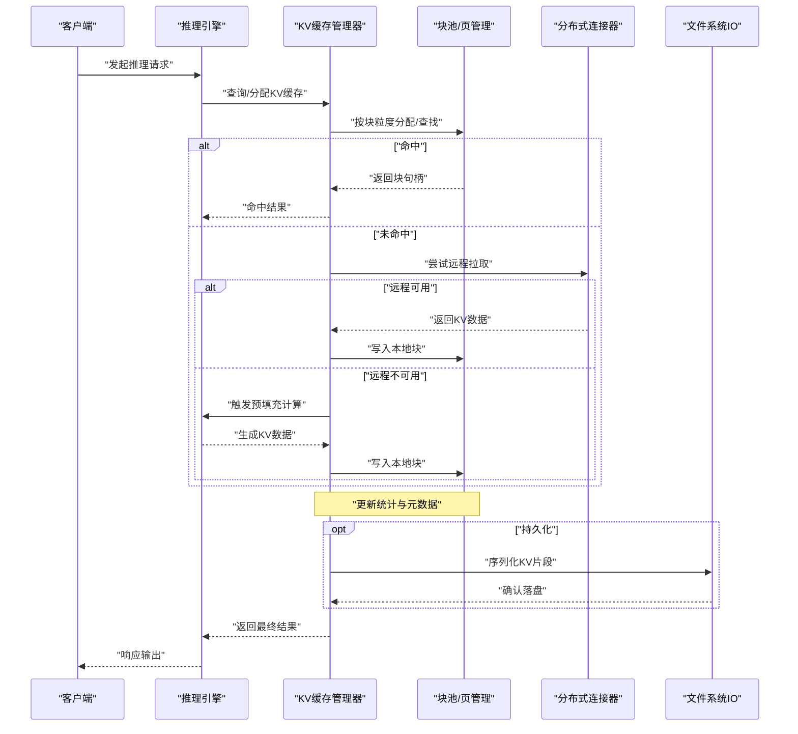
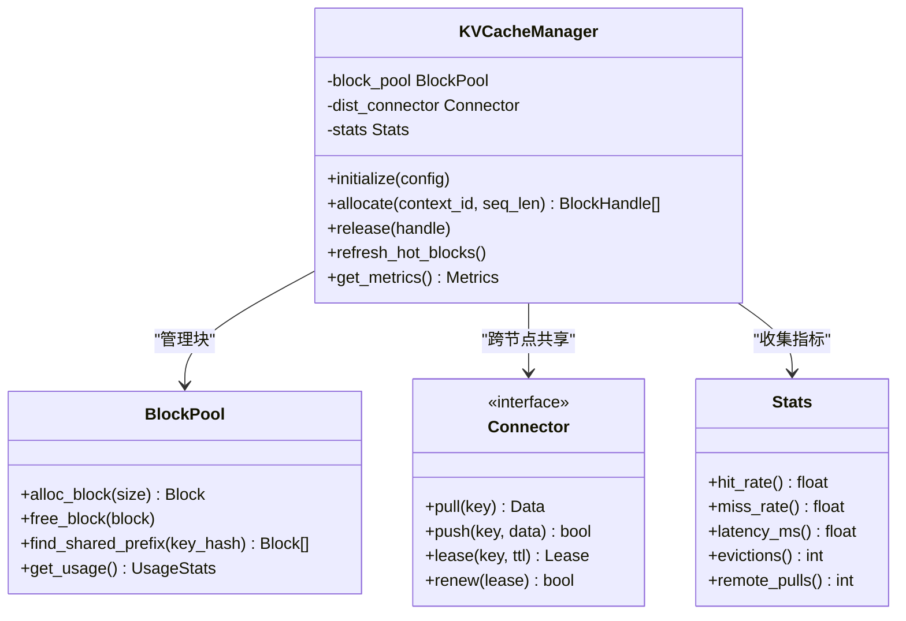
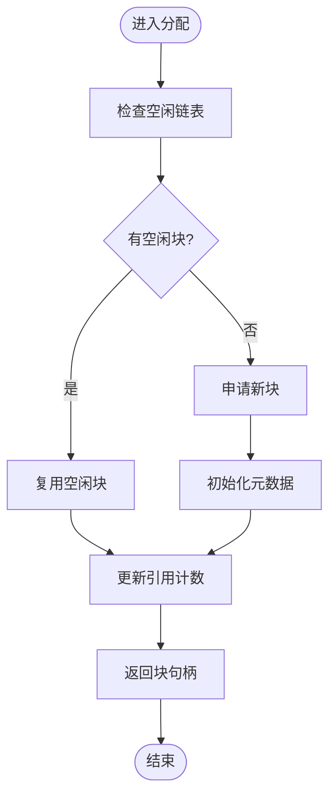
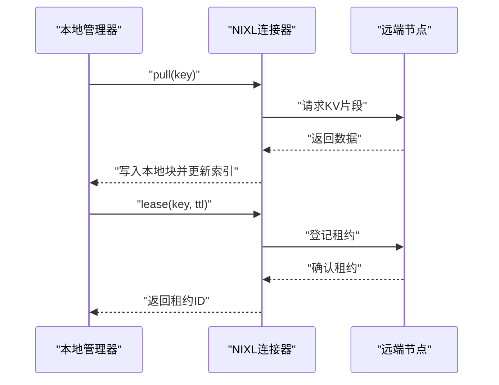
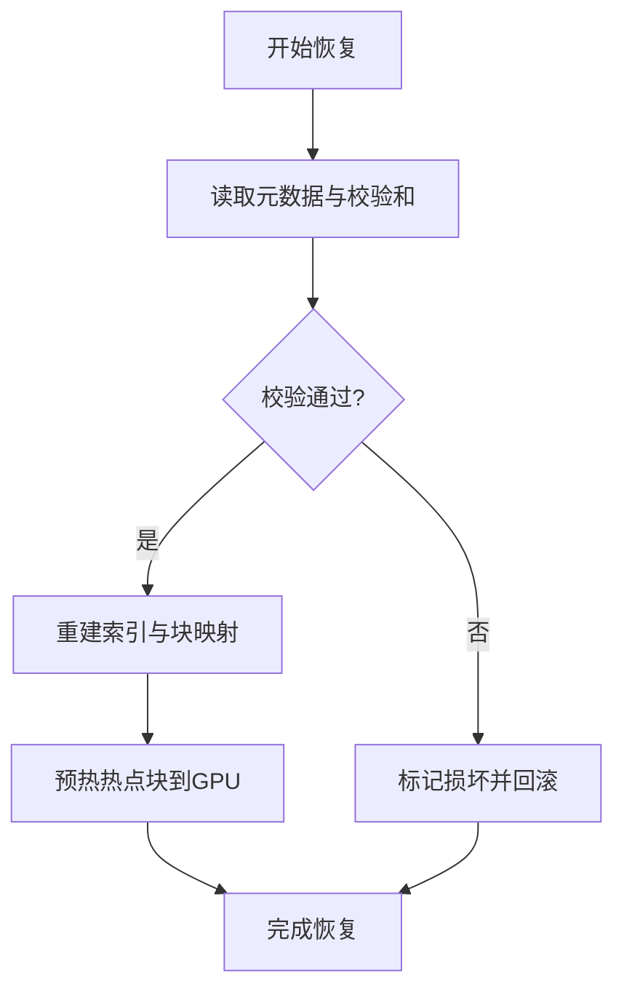
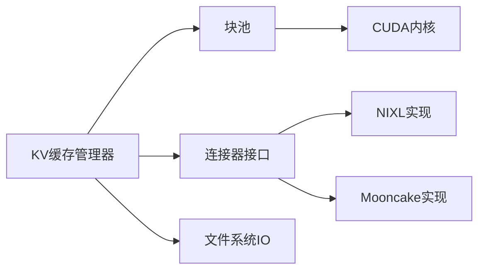

# 缓存管理

<cite>
**本文引用的文件**   
- [vllm/config.py](file://vllm/config.py)
- [vllm/engine/arg_utils.py](file://vllm/engine/arg_utils.py)
- [vllm/model_executor/models/kv_cache_manager.py](file://vllm/model_executor/models/kv_cache_manager.py)
- [vllm/v1/core/cache.py](file://vllm/v1/core/cache.py)
- [vllm/v1/core/block_pool.py](file://vllm/v1/core/block_pool.py)
- [vllm/distributed/kv_connectors/base.py](file://vllm/distributed/kv_connectors/base.py)
- [vllm/distributed/kv_connectors/nixl_connector.py](file://vllm/distributed/kv_connectors/nixl_connector.py)
- [vllm/distributed/kv_connectors/mooncake_connector.py](file://vllm/distributed/kv_connectors/mooncake_connector.py)
- [benchmarks/benchmark_prefix_caching.py](file://benchmarks/benchmark_prefix_caching.py)
- [docs/design/prefix_caching.md](file://docs/design/prefix_caching.md)
- [docs/design/hybrid_kv_cache_manager.md](file://docs/design/hybrid_kv_cache_manager.md)
- [docs/design/nixl_kv_cache_lease.md](file://docs/design/nixl_kv_cache_lease.md)
- [docs/design/paged_attention.md](file://docs/design/paged_attention.md)
- [csrc/cache.h](file://csrc/cache.h)
- [csrc/cache_kernels.cu](file://csrc/cache_kernels.cu)
- [csrc/fs_io.cpp](file://csrc/fs_io.cpp)
</cite>

## 目录
1. [简介](#简介)
2. [项目结构](#项目结构)
3. [核心组件](#核心组件)
4. [架构总览](#架构总览)
5. [详细组件分析](#详细组件分析)
6. [依赖关系分析](#依赖关系分析)
7. [性能考量](#性能考量)
8. [故障排查指南](#故障排查指南)
9. [结论](#结论)
10. [附录](#附录)

## 简介
本文件面向vLLM的缓存管理系统，围绕KV缓存（Key-Value Cache）的生命周期、监控统计、持久化、分布式同步与一致性、故障恢复与错误处理，以及最佳实践与配置建议进行系统化说明。文档兼顾工程实现与使用视角，帮助读者在单机与多机部署场景下正确理解并优化缓存行为。

## 项目结构
vLLM的缓存相关代码分布在多个层次：
- 配置与参数校验层：负责解析引擎参数、验证缓存容量与策略。
- 内核与底层存储层：提供块分配、页式注意力所需的内存布局与访问原语。
- 管理器与调度层：封装缓存生命周期（初始化、分配、回收）、命中率统计与监控。
- 分布式连接层：跨节点共享KV缓存，支持租约、复制与冲突解决。
- 基准与文档：用于评估与指导设计决策。

图表来源 
- [vllm/config.py](file://vllm/config.py)
- [vllm/engine/arg_utils.py](file://vllm/engine/arg_utils.py)
- [vllm/model_executor/models/kv_cache_manager.py](file://vllm/model_executor/models/kv_cache_manager.py)
- [vllm/v1/core/cache.py](file://vllm/v1/core/cache.py)
- [vllm/v1/core/block_pool.py](file://vllm/v1/core/block_pool.py)
- [vllm/distributed/kv_connectors/base.py](file://vllm/distributed/kv_connectors/base.py)
- [vllm/distributed/kv_connectors/nixl_connector.py](file://vllm/distributed/kv_connectors/nixl_connector.py)
- [vllm/distributed/kv_connectors/mooncake_connector.py](file://vllm/distributed/kv_connectors/mooncake_connector.py)
- [csrc/cache.h](file://csrc/cache.h)
- [csrc/cache_kernels.cu](file://csrc/cache_kernels.cu)
- [csrc/fs_io.cpp](file://csrc/fs_io.cpp)

章节来源
- [docs/design/prefix_caching.md](file://docs/design/prefix_caching.md)
- [docs/design/hybrid_kv_cache_manager.md](file://docs/design/hybrid_kv_cache_manager.md)
- [docs/design/nixl_kv_cache_lease.md](file://docs/design/nixl_kv_cache_lease.md)
- [docs/design/paged_attention.md](file://docs/design/paged_attention.md)

## 核心组件
- 配置与参数校验
  - 负责解析与校验KV缓存大小、块大小、前缀缓存开关、分布式连接器选择等关键参数。
  - 确保资源上限合理，避免启动后出现OOM或碎片化问题。
- KV缓存管理器
  - 统一暴露缓存生命周期接口：初始化、分配、释放、刷新、统计。
  - 协调块池、页式注意力与分布式连接器。
- 块池与页管理
  - 基于固定大小的块（block）组织KV缓存，支持分页与复用。
  - 维护引用计数与空闲链表，保证并发安全与低开销分配。
- 分布式连接器
  - 抽象跨节点KV缓存共享接口，支持租约、拉取、推送与一致性协议。
  - 典型实现包括NIXL与Mooncake连接器。
- 内核与IO
  - C++/CUDA内核提供高效KV读写、拼接、掩码等操作。
  - 文件系统IO用于序列化与恢复（如检查点或离线加载）。

章节来源
- [vllm/config.py](file://vllm/config.py)
- [vllm/engine/arg_utils.py](file://vllm/engine/arg_utils.py)
- [vllm/model_executor/models/kv_cache_manager.py](file://vllm/model_executor/models/kv_cache_manager.py)
- [vllm/v1/core/block_pool.py](file://vllm/v1/core/block_pool.py)
- [vllm/distributed/kv_connectors/base.py](file://vllm/distributed/kv_connectors/base.py)
- [csrc/cache.h](file://csrc/cache.h)
- [csrc/cache_kernels.cu](file://csrc/cache_kernels.cu)
- [csrc/fs_io.cpp](file://csrc/fs_io.cpp)

## 架构总览
下图展示从请求进入引擎到KV缓存命中/填充、再到分布式共享与持久化的整体流程。

图表来源 
- [vllm/model_executor/models/kv_cache_manager.py](file://vllm/model_executor/models/kv_cache_manager.py)
- [vllm/v1/core/block_pool.py](file://vllm/v1/core/block_pool.py)
- [vllm/distributed/kv_connectors/base.py](file://vllm/distributed/kv_connectors/base.py)
- [csrc/fs_io.cpp](file://csrc/fs_io.cpp)

## 详细组件分析

### 配置与参数校验
- 关键职责
  - 解析KV缓存总量、块大小、最大序列长度、是否启用前缀缓存、分布式连接器类型与端点等。
  - 校验参数合法性（如块大小必须整除模型维度、缓存总量需大于最小阈值）。
  - 根据硬件能力（显存/内存）给出默认值与警告。
- 常见校验点
  - 块大小与注意力分块对齐。
  - 分布式连接器可用性（端口、网络可达性）。
  - 前缀缓存开关与模型兼容性。

章节来源
- [vllm/config.py](file://vllm/config.py)
- [vllm/engine/arg_utils.py](file://vllm/engine/arg_utils.py)

### KV缓存管理器
- 生命周期阶段
  - 初始化：根据配置创建块池、注册统计器、建立分布式连接。
  - 分配：按请求上下文与历史命中情况，决定复用已有块或分配新块。
  - 回收：在序列结束或驱逐策略触发时释放块，更新引用计数。
  - 刷新：对热点块进行压缩或迁移（如CPU/GPU间交换）。
- 统计与监控
  - 命中率（全局与分层）、块分配延迟、驱逐次数、远端拉取成功率。
  - 指标导出至Prometheus或内部日志系统。
- 与注意力后端集成
  - 通过页式注意力接口将KV块映射为连续视图，减少拷贝与碎片。

图表来源 
- [vllm/model_executor/models/kv_cache_manager.py](file://vllm/model_executor/models/kv_cache_manager.py)
- [vllm/v1/core/block_pool.py](file://vllm/v1/core/block_pool.py)
- [vllm/distributed/kv_connectors/base.py](file://vllm/distributed/kv_connectors/base.py)

章节来源
- [vllm/model_executor/models/kv_cache_manager.py](file://vllm/model_executor/models/kv_cache_manager.py)
- [docs/design/hybrid_kv_cache_manager.md](file://docs/design/hybrid_kv_cache_manager.md)

### 块池与页管理
- 数据结构
  - 块（Block）：固定大小的KV片段，包含引用计数、哈希键、时间戳。
  - 空闲链表：O(1)分配与回收。
  - 索引表：按哈希键快速定位共享块。
- 算法要点
  - 前缀匹配：基于哈希键与内容指纹，识别可复用前缀。
  - 驱逐策略：LRU/LFU或基于热度的混合策略，结合水位线阈值。
  - 并发控制：原子操作与锁粒度优化，降低争用。

图表来源 
- [vllm/v1/core/block_pool.py](file://vllm/v1/core/block_pool.py)

章节来源
- [vllm/v1/core/block_pool.py](file://vllm/v1/core/block_pool.py)
- [docs/design/paged_attention.md](file://docs/design/paged_attention.md)

### 分布式连接器（NIXL/Mooncake）
- 抽象接口
  - pull/push：拉取/推送KV片段。
  - lease/renew：租约机制保障独占与续期。
  - consistency：版本/时间戳比较，冲突检测与解决。
- NIXL连接器
  - 基于高性能RDMA/共享内存传输，适合高带宽集群。
  - 支持批量拉取与流水线并行。
- Mooncake连接器
  - 面向对象存储或分布式KV存储，适合跨地域共享。
  - 提供重试、超时与断线重连。

图表来源 
- [vllm/distributed/kv_connectors/nixl_connector.py](file://vllm/distributed/kv_connectors/nixl_connector.py)
- [vllm/distributed/kv_connectors/mooncake_connector.py](file://vllm/distributed/kv_connectors/mooncake_connector.py)
- [docs/design/nixl_kv_cache_lease.md](file://docs/design/nixl_kv_cache_lease.md)

章节来源
- [vllm/distributed/kv_connectors/base.py](file://vllm/distributed/kv_connectors/base.py)
- [vllm/distributed/kv_connectors/nixl_connector.py](file://vllm/distributed/kv_connectors/nixl_connector.py)
- [vllm/distributed/kv_connectors/mooncake_connector.py](file://vllm/distributed/kv_connectors/mooncake_connector.py)
- [docs/design/nixl_kv_cache_lease.md](file://docs/design/nixl_kv_cache_lease.md)

### 内核与IO（C++/CUDA/FS）
- 内核职责
  - 高效KV拼接、掩码、缩放与量化操作。
  - 与页式注意力无缝对接，避免额外拷贝。
- 文件系统IO
  - 序列化KV片段为紧凑格式，支持增量写入与校验和。
  - 恢复流程：读取元数据→校验→重建索引→预热热点块。

图表来源 
- [csrc/fs_io.cpp](file://csrc/fs_io.cpp)
- [csrc/cache_kernels.cu](file://csrc/cache_kernels.cu)
- [csrc/cache.h](file://csrc/cache.h)

章节来源
- [csrc/cache.h](file://csrc/cache.h)
- [csrc/cache_kernels.cu](file://csrc/cache_kernels.cu)
- [csrc/fs_io.cpp](file://csrc/fs_io.cpp)

## 依赖关系分析
- 模块耦合
  - 管理器依赖块池与连接器，二者解耦于具体实现。
  - 内核与IO被块池与IO模块调用，保持高层稳定。
- 外部依赖
  - 分布式通信库（如NIXL/RDMA）、对象存储（Mooncake）。
  - CUDA/C++运行时与Torch绑定。
- 潜在循环依赖
  - 通过接口抽象避免管理器与连接器之间的直接循环。

图表来源 
- [vllm/model_executor/models/kv_cache_manager.py](file://vllm/model_executor/models/kv_cache_manager.py)
- [vllm/v1/core/block_pool.py](file://vllm/v1/core/block_pool.py)
- [vllm/distributed/kv_connectors/base.py](file://vllm/distributed/kv_connectors/base.py)
- [csrc/cache_kernels.cu](file://csrc/cache_kernels.cu)
- [csrc/fs_io.cpp](file://csrc/fs_io.cpp)

章节来源
- [vllm/model_executor/models/kv_cache_manager.py](file://vllm/model_executor/models/kv_cache_manager.py)
- [vllm/v1/core/block_pool.py](file://vllm/v1/core/block_pool.py)
- [vllm/distributed/kv_connectors/base.py](file://vllm/distributed/kv_connectors/base.py)

## 性能考量
- 命中率优化
  - 调整块大小以匹配注意力分块，减少碎片。
  - 启用前缀缓存与自动重用，提升重复上下文命中率。
- 内存与带宽
  - 使用页式注意力减少拷贝；按需预取热点块。
  - 合理设置驱逐阈值与水位线，避免抖动。
- 分布式吞吐
  - 批量拉取与流水线并行；利用RDMA/共享内存路径。
  - 租约与版本控制减少冲突与重传。
- 监控与调优
  - 关注命中率、分配延迟、驱逐率、远端拉取成功率。
  - 结合基准脚本（如前缀缓存基准）进行回归测试。

章节来源
- [benchmarks/benchmark_prefix_caching.py](file://benchmarks/benchmark_prefix_caching.py)
- [docs/design/prefix_caching.md](file://docs/design/prefix_caching.md)

## 故障排查指南
- 常见问题
  - 命中率低：检查块大小与模型分块是否对齐；确认前缀缓存开关与哈希策略。
  - OOM：降低缓存总量或增大块大小；检查是否存在泄漏（未释放句柄）。
  - 分布式拉取失败：检查网络连通性与连接器配置；查看重试与超时设置。
  - 恢复失败：校验和错误导致损坏；检查备份完整性与恢复顺序。
- 诊断步骤
  - 查看统计指标（命中率、驱逐、延迟）与日志。
  - 使用基准脚本复现问题并对比不同配置。
  - 对损坏数据进行隔离与修复，必要时回滚到上一快照。

章节来源
- [vllm/model_executor/models/kv_cache_manager.py](file://vllm/model_executor/models/kv_cache_manager.py)
- [csrc/fs_io.cpp](file://csrc/fs_io.cpp)

## 结论
vLLM的缓存管理系统通过模块化设计与高性能内核，实现了高效的KV缓存生命周期管理、分布式共享与持久化恢复。合理的配置与监控能够显著提升推理吞吐与延迟表现。在多机部署中，选择合适的连接器与一致性策略是关键。建议结合基准与监控持续调优，确保在不同工作负载下的稳定性与效率。

## 附录
- 最佳实践
  - 根据模型与硬件选择块大小与缓存总量。
  - 开启前缀缓存与自动重用，定期评估命中率。
  - 在分布式环境中启用租约与版本控制，避免冲突。
  - 建立完善的监控与告警，及时发现问题。
- 配置建议
  - 单机：优先优化块大小与驱逐策略。
  - 多机：选择高性能连接器（如NIXL），并配置合适的超时与重试。
  - 持久化：启用增量写入与校验和，定期备份。