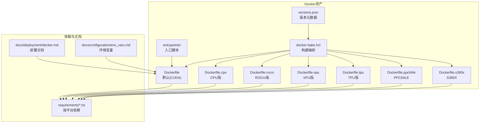
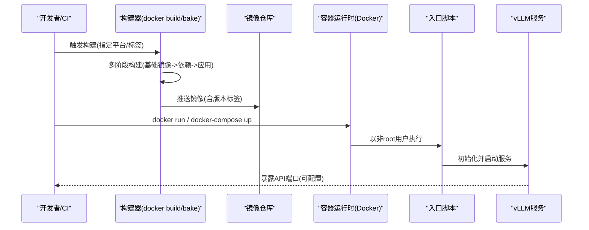
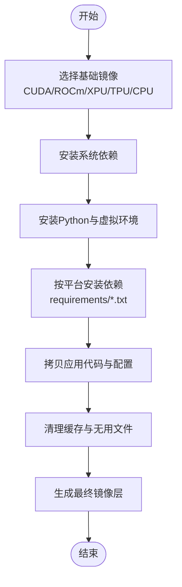
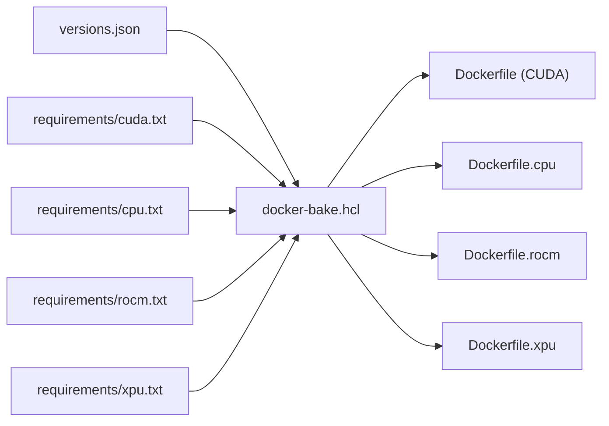

# Docker容器化部署

<cite>
**本文档引用的文件**   
- [docker/Dockerfile](file://docker/Dockerfile)
- [docker/Dockerfile.cpu](file://docker/Dockerfile.cpu)
- [docker/Dockerfile.rocm](file://docker/Dockerfile.rocm)
- [docker/Dockerfile.rocm_base](file://docker/Dockerfile.rocm_base)
- [docker/Dockerfile.xpu](file://docker/Dockerfile.xpu)
- [docker/Dockerfile.tpu](file://docker/Dockerfile.tpu)
- [docker/Dockerfile.ppc64le](file://docker/Dockerfile.ppc64le)
- [docker/Dockerfile.s390x](file://docker/Dockerfile.s390x)
- [docker/entrypoints/vllm-nonroot-entrypoint.sh](file://docker/entrypoints/vllm-nonroot-entrypoint.sh)
- [docker/entrypoints/test_vllm_nonroot_entrypoint.sh](file://docker/entrypoints/test_vllm_nonroot_entrypoint.sh)
- [docker/docker-bake.hcl](file://docker/docker-bake.hcl)
- [docker/docker-bake-rocm.hcl](file://docker/docker-bake-rocm.hcl)
- [docker/ci-rocm.hcl](file://docker/ci-rocm.hcl)
- [docker/versions.json](file://docker/versions.json)
- [requirements/cuda.txt](file://requirements/cuda.txt)
- [requirements/rocm.txt](file://requirements/rocm.txt)
- [requirements/xpu.txt](file://requirements/xpu.txt)
- [requirements/cpu.txt](file://requirements/cpu.txt)
- [docs/deployment/docker.md](file://docs/deployment/docker.md)
- [docs/configuration/env_vars.md](file://docs/configuration/env_vars.md)
</cite>

## 目录
1. [简介](#简介)
2. [项目结构](#项目结构)
3. [核心组件](#核心组件)
4. [架构总览](#架构总览)
5. [详细组件分析](#详细组件分析)
6. [依赖关系分析](#依赖关系分析)
7. [性能与镜像优化](#性能与镜像优化)
8. [故障排查指南](#故障排查指南)
9. [结论](#结论)
10. [附录](#附录)

## 简介
本文件面向希望在生产环境中使用Docker容器化部署vLLM的工程师，系统性地说明官方镜像的使用方式、版本选择策略（GPU/CPU及不同硬件平台）、自定义镜像构建流程（多阶段构建、依赖裁剪与体积优化）、不同平台的Docker配置（CUDA、ROCm、XPU等）、入口脚本与环境变量配置、卷挂载与数据持久化、网络与服务发现设置，并提供完整的docker-compose示例与最佳实践。

## 项目结构
vLLM在仓库中提供了完善的Docker相关资产：
- 多平台Dockerfile：针对CPU、NVIDIA CUDA、AMD ROCm、Intel XPU、TPU、ppc64le、s390x等架构提供专用镜像定义
- 入口脚本：非root用户启动脚本，便于安全运行服务
- Bake/HCL配置：用于批量构建与发布管理
- 版本元数据：集中维护各平台基础镜像与依赖版本
- 需求清单：按平台划分的Python依赖文件，便于按需安装与裁剪

图表来源
- [docker/Dockerfile](file://docker/Dockerfile)
- [docker/Dockerfile.cpu](file://docker/Dockerfile.cpu)
- [docker/Dockerfile.rocm](file://docker/Dockerfile.rocm)
- [docker/Dockerfile.xpu](file://docker/Dockerfile.xpu)
- [docker/Dockerfile.tpu](file://docker/Dockerfile.tpu)
- [docker/Dockerfile.ppc64le](file://docker/Dockerfile.ppc64le)
- [docker/Dockerfile.s390x](file://docker/Dockerfile.s390x)
- [docker/entrypoints/vllm-nonroot-entrypoint.sh](file://docker/entrypoints/vllm-nonroot-entrypoint.sh)
- [docker/docker-bake.hcl](file://docker/docker-bake.hcl)
- [docker/versions.json](file://docker/versions.json)
- [requirements/cuda.txt](file://requirements/cuda.txt)
- [requirements/cpu.txt](file://requirements/cpu.txt)
- [requirements/rocm.txt](file://requirements/rocm.txt)
- [requirements/xpu.txt](file://requirements/xpu.txt)
- [docs/deployment/docker.md](file://docs/deployment/docker.md)
- [docs/configuration/env_vars.md](file://docs/configuration/env_vars.md)

章节来源
- [docs/deployment/docker.md](file://docs/deployment/docker.md)

## 核心组件
- 官方镜像族
  - 默认CUDA镜像：面向NVIDIA GPU，包含CUDA运行时与vLLM预编译依赖
  - CPU镜像：无GPU依赖，适用于推理或开发调试
  - ROCm镜像：面向AMD GPU
  - XPU镜像：面向Intel GPU
  - TPU镜像：面向Google TPU
  - ppc64le/s390x镜像：面向特定CPU架构
- 入口脚本
  - 非root用户启动脚本，负责权限校验、环境准备与进程启动
- 构建编排
  - docker-bake.hcl与HCL规则，支持并行构建、缓存复用与产物标记
- 版本元数据
  - versions.json集中声明基础镜像、CUDA/ROCm/XPU等版本，确保一致性

章节来源
- [docker/Dockerfile](file://docker/Dockerfile)
- [docker/Dockerfile.cpu](file://docker/Dockerfile.cpu)
- [docker/Dockerfile.rocm](file://docker/Dockerfile.rocm)
- [docker/Dockerfile.xpu](file://docker/Dockerfile.xpu)
- [docker/Dockerfile.tpu](file://docker/Dockerfile.tpu)
- [docker/Dockerfile.ppc64le](file://docker/Dockerfile.ppc64le)
- [docker/Dockerfile.s390x](file://docker/Dockerfile.s390x)
- [docker/entrypoints/vllm-nonroot-entrypoint.sh](file://docker/entrypoints/vllm-nonroot-entrypoint.sh)
- [docker/docker-bake.hcl](file://docker/docker-bake.hcl)
- [docker/versions.json](file://docker/versions.json)

## 架构总览
下图展示了从镜像构建到服务运行的整体流程，包括多阶段构建、依赖安装、入口脚本执行以及运行时资源挂载。

图表来源
- [docker/docker-bake.hcl](file://docker/docker-bake.hcl)
- [docker/Dockerfile](file://docker/Dockerfile)
- [docker/entrypoints/vllm-nonroot-entrypoint.sh](file://docker/entrypoints/vllm-nonroot-entrypoint.sh)

## 详细组件分析

### 官方镜像使用与版本选择
- 选择原则
  - 有NVIDIA GPU且需高性能推理：选择默认CUDA镜像
  - 无GPU或仅需CPU推理/测试：选择CPU镜像
  - AMD GPU：选择ROCm镜像
  - Intel GPU：选择XPU镜像
  - Google TPU：选择TPU镜像
  - 特殊CPU架构(ppc64le/s390x)：选择对应镜像
- 版本对齐
  - 通过versions.json统一基础镜像与依赖版本，建议固定标签而非latest，保证可重现性
- 快速体验
  - 参考部署文档中的最小运行命令与参数说明

章节来源
- [docs/deployment/docker.md](file://docs/deployment/docker.md)
- [docker/versions.json](file://docker/versions.json)

### 自定义镜像构建流程（多阶段构建与优化）
- 多阶段构建
  - 第一阶段：拉取平台基础镜像（CUDA/ROCm/XPU/TPU/CPU），安装系统级依赖
  - 第二阶段：安装Python与vLLM依赖（按平台requirements裁剪），拷贝应用代码
  - 第三阶段：仅保留运行期必要文件，减小镜像体积
- 依赖优化
  - 使用requirements按平台隔离依赖，避免无关包进入镜像
  - 利用构建缓存层，分离易变与稳定依赖安装步骤
- 镜像大小优化
  - 清理构建缓存、临时文件与不必要的工具链
  - 合并RUN指令减少层数
  - 使用.dockerignore排除无关文件
- 构建编排
  - 使用docker-bake.hcl进行并行构建、标签管理与跨平台构建

图表来源
- [docker/Dockerfile](file://docker/Dockerfile)
- [docker/Dockerfile.cpu](file://docker/Dockerfile.cpu)
- [docker/Dockerfile.rocm](file://docker/Dockerfile.rocm)
- [docker/Dockerfile.xpu](file://docker/Dockerfile.xpu)
- [docker/Dockerfile.tpu](file://docker/Dockerfile.tpu)
- [docker/docker-bake.hcl](file://docker/docker-bake.hcl)
- [requirements/cuda.txt](file://requirements/cuda.txt)
- [requirements/cpu.txt](file://requirements/cpu.txt)
- [requirements/rocm.txt](file://requirements/rocm.txt)
- [requirements/xpu.txt](file://requirements/xpu.txt)

章节来源
- [docker/docker-bake.hcl](file://docker/docker-bake.hcl)
- [docker/Dockerfile](file://docker/Dockerfile)
- [requirements/cuda.txt](file://requirements/cuda.txt)
- [requirements/cpu.txt](file://requirements/cpu.txt)
- [requirements/rocm.txt](file://requirements/rocm.txt)
- [requirements/xpu.txt](file://requirements/xpu.txt)

### 不同平台的Docker配置（CUDA、ROCm、XPU等）
- CUDA（NVIDIA）
  - 基于nvidia/cuda基础镜像，安装CUDA运行时与cuDNN等依赖
  - 需要宿主机正确安装NVIDIA驱动与容器运行时支持
- ROCm（AMD）
  - 基于ROCm基础镜像，安装ROCm运行时与相关库
  - 需要宿主机安装ROCm驱动与设备节点
- XPU（Intel）
  - 基于Intel XPU基础镜像，安装OneAPI与相关驱动
- TPU
  - 基于Google TPU基础镜像，配置TPU运行时与访问凭证
- CPU/ppc64le/s390x
  - 基于对应架构的基础镜像，仅安装CPU依赖

章节来源
- [docker/Dockerfile](file://docker/Dockerfile)
- [docker/Dockerfile.rocm](file://docker/Dockerfile.rocm)
- [docker/Dockerfile.rocm_base](file://docker/Dockerfile.rocm_base)
- [docker/Dockerfile.xpu](file://docker/Dockerfile.xpu)
- [docker/Dockerfile.tpu](file://docker/Dockerfile.tpu)
- [docker/Dockerfile.ppc64le](file://docker/Dockerfile.ppc64le)
- [docker/Dockerfile.s390x](file://docker/Dockerfile.s390x)

### Entrypoint脚本配置与使用
- 功能要点
  - 非root用户运行，提升安全性
  - 校验必要环境变量与权限
  - 启动vLLM服务进程
- 使用方式
  - 通过docker run或docker-compose指定镜像时自动执行
  - 可通过环境变量覆盖默认行为（如日志级别、监听地址等）

章节来源
- [docker/entrypoints/vllm-nonroot-entrypoint.sh](file://docker/entrypoints/vllm-nonroot-entrypoint.sh)
- [docker/entrypoints/test_vllm_nonroot_entrypoint.sh](file://docker/entrypoints/test_vllm_nonroot_entrypoint.sh)

### 环境变量配置
- 关键类别
  - 运行时配置：模型加载、KV缓存、批处理大小、日志级别等
  - 平台相关：CUDA_VISIBLE_DEVICES、HIP_VISIBLE_DEVICES、XPU设备等
  - 网络与服务：监听地址、端口、健康检查端点
- 配置优先级
  - 环境变量 > 配置文件 > 默认值
- 推荐做法
  - 将敏感信息放入密钥管理，避免硬编码
  - 使用docker-compose的环境文件或Kubernetes ConfigMap/Secret

章节来源
- [docs/configuration/env_vars.md](file://docs/configuration/env_vars.md)

### 卷挂载与数据持久化
- 常用挂载
  - 模型权重目录：避免重复下载，加速冷启动
  - 日志目录：持久化日志以便排查问题
  - KV缓存目录：跨重启保持缓存命中
- 权限与安全
  - 非root用户写入需确保目录权限正确
  - 建议使用只读挂载模型权重，防止意外修改
- 云存储集成
  - 结合对象存储或NAS实现共享与备份

章节来源
- [docs/deployment/docker.md](file://docs/deployment/docker.md)

### 网络配置与服务发现
- 端口映射
  - 将服务端口映射到宿主机，供外部访问
- 内部通信
  - 多实例场景下使用Docker网络或Kubernetes Service
- 负载均衡与健康检查
  - 配合反向代理或服务网格实现流量分发与故障转移

章节来源
- [docs/deployment/docker.md](file://docs/deployment/docker.md)

### docker-compose示例与最佳实践
- 基本模板
  - 定义服务、镜像、端口、环境变量、卷挂载
  - 添加健康检查与重启策略
- 多实例扩展
  - 使用副本数或横向扩展策略
- 资源限制
  - 设置CPU/内存/GPU配额，避免资源争用
- 安全加固
  - 非root用户、只读根文件系统、最小权限原则

章节来源
- [docs/deployment/docker.md](file://docs/deployment/docker.md)

## 依赖关系分析
- 平台依赖隔离
  - requirements按平台划分，确保镜像仅包含必要依赖
- 基础镜像依赖
  - versions.json统一管理基础镜像版本，避免漂移
- 构建依赖
  - docker-bake.hcl协调多目标构建，提高构建效率

图表来源
- [docker/versions.json](file://docker/versions.json)
- [docker/docker-bake.hcl](file://docker/docker-bake.hcl)
- [requirements/cuda.txt](file://requirements/cuda.txt)
- [requirements/cpu.txt](file://requirements/cpu.txt)
- [requirements/rocm.txt](file://requirements/rocm.txt)
- [requirements/xpu.txt](file://requirements/xpu.txt)
- [docker/Dockerfile](file://docker/Dockerfile)
- [docker/Dockerfile.cpu](file://docker/Dockerfile.cpu)
- [docker/Dockerfile.rocm](file://docker/Dockerfile.rocm)
- [docker/Dockerfile.xpu](file://docker/Dockerfile.xpu)

章节来源
- [docker/versions.json](file://docker/versions.json)
- [docker/docker-bake.hcl](file://docker/docker-bake.hcl)
- [requirements/cuda.txt](file://requirements/cuda.txt)
- [requirements/cpu.txt](file://requirements/cpu.txt)
- [requirements/rocm.txt](file://requirements/rocm.txt)
- [requirements/xpu.txt](file://requirements/xpu.txt)

## 性能与镜像优化
- 构建优化
  - 多阶段构建减少最终镜像体积
  - 合理使用缓存层，分离易变与稳定依赖
  - 合并RUN指令，减少层数
- 运行时优化
  - 合理设置批处理大小与KV缓存
  - 启用模型量化与图优化（根据平台能力）
  - 使用SSD/NVMe存储提升I/O吞吐
- 监控与调优
  - 采集指标与日志，定位瓶颈
  - 压测验证不同配置下的吞吐与延迟

[本节为通用指导，不直接分析具体文件]

## 故障排查指南
- 常见问题
  - GPU不可见：检查驱动与容器运行时配置
  - 权限错误：确认非root用户对挂载目录的读写权限
  - 依赖缺失：核对requirements与基础镜像版本
  - 端口冲突：调整端口映射或停止占用进程
- 诊断方法
  - 查看容器日志与系统日志
  - 进入容器执行交互式命令验证环境
  - 使用健康检查端点验证服务状态

章节来源
- [docs/deployment/docker.md](file://docs/deployment/docker.md)

## 结论
通过vLLM提供的多平台Docker资产与构建编排，用户可以快速搭建稳定、高效、安全的推理服务。遵循本文的版本选择、构建优化、环境变量与卷挂载最佳实践，可在不同硬件平台上获得一致的部署体验与性能表现。

[本节为总结性内容，不直接分析具体文件]

## 附录
- 参考文档
  - 部署指南：docs/deployment/docker.md
  - 环境变量：docs/configuration/env_vars.md
- 常用命令
  - 构建镜像：docker build / docker buildx bake
  - 运行容器：docker run / docker-compose up
  - 查看日志：docker logs / docker-compose logs

[本节为补充信息，不直接分析具体文件]