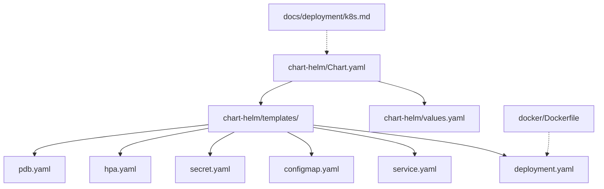
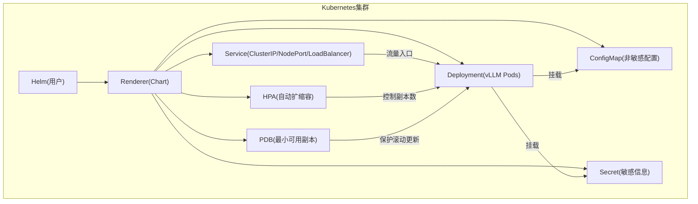
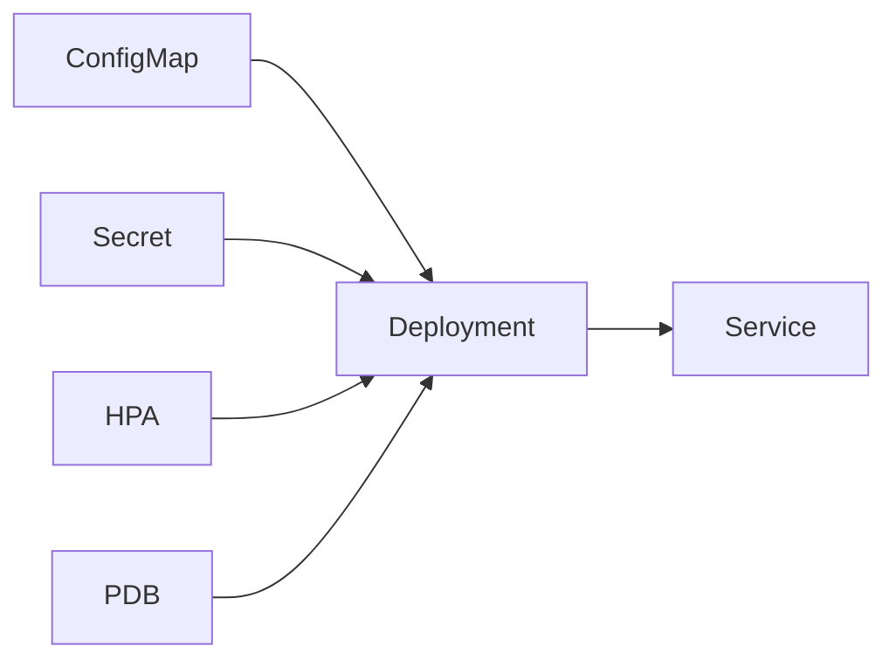

# Kubernetes集群部署

<cite>
**本文引用的文件**   
- [examples/deployment/chart-helm/Chart.yaml](file://examples/deployment/chart-helm/Chart.yaml)
- [examples/deployment/chart-helm/values.yaml](file://examples/deployment/chart-helm/values.yaml)
- [examples/deployment/chart-helm/templates/deployment.yaml](file://examples/deployment/chart-helm/templates/deployment.yaml)
- [examples/deployment/chart-helm/templates/service.yaml](file://examples/deployment/chart-helm/templates/service.yaml)
- [examples/deployment/chart-helm/templates/configmap.yaml](file://examples/deployment/chart-helm/templates/configmap.yaml)
- [examples/deployment/chart-helm/templates/secret.yaml](file://examples/deployment/chart-helm/templates/secret.yaml)
- [examples/deployment/chart-helm/templates/hpa.yaml](file://examples/deployment/chart-helm/templates/hpa.yaml)
- [examples/deployment/chart-helm/templates/pdb.yaml](file://examples/deployment/chart-helm/templates/pdb.yaml)
- [docs/deployment/k8s.md](file://docs/deployment/k8s.md)
- [docker/Dockerfile](file://docker/Dockerfile)
</cite>

## 目录
1. [简介](#简介)
2. [项目结构](#项目结构)
3. [核心组件](#核心组件)
4. [架构总览](#架构总览)
5. [详细组件分析](#详细组件分析)
6. [依赖关系分析](#依赖关系分析)
7. [性能考虑](#性能考虑)
8. [故障排除指南](#故障排除指南)
9. [结论](#结论)
10. [附录](#附录)

## 简介
本指南面向在Kubernetes环境中部署vLLM的用户，提供从Helm Chart安装、values.yaml自定义、Pod资源与GPU限制、Service暴露方式、ConfigMap与Secret使用、健康检查探针、HPA自动扩缩容、滚动更新策略到完整YAML示例与故障排除的端到端说明。文档内容基于仓库中的Helm Chart模板与官方K8s部署文档整理而成，确保与实际代码一致。

## 项目结构
vLLM在仓库中提供了开箱即用的Helm Chart，位于examples/deployment/chart-helm目录下，包含Chart元数据、默认值、以及Kubernetes资源的模板（Deployment、Service、ConfigMap、Secret、HPA、PDB等）。此外，docs/deployment/k8s.md提供了K8s部署的官方说明，docker/Dockerfile定义了容器镜像构建基础。

图表来源
- [examples/deployment/chart-helm/Chart.yaml](file://examples/deployment/chart-hhelm/Chart.yaml)
- [examples/deployment/chart-helm/values.yaml](file://examples/deployment/chart-helm/values.yaml)
- [examples/deployment/chart-helm/templates/deployment.yaml](file://examples/deployment/chart-helm/templates/deployment.yaml)
- [examples/deployment/chart-helm/templates/service.yaml](file://examples/deployment/chart-helm/templates/service.yaml)
- [examples/deployment/chart-helm/templates/configmap.yaml](file://examples/deployment/chart-helm/templates/configmap.yaml)
- [examples/deployment/chart-helm/templates/secret.yaml](file://examples/deployment/chart-helm/templates/secret.yaml)
- [examples/deployment/chart-helm/templates/hpa.yaml](file://examples/deployment/chart-helm/templates/hpa.yaml)
- [examples/deployment/chart-helm/templates/pdb.yaml](file://examples/deployment/chart-helm/templates/pdb.yaml)
- [docs/deployment/k8s.md](file://docs/deployment/k8s.md)
- [docker/Dockerfile](file://docker/Dockerfile)

章节来源
- [examples/deployment/chart-helm/Chart.yaml](file://examples/deployment/chart-helm/Chart.yaml)
- [examples/deployment/chart-helm/values.yaml](file://examples/deployment/chart-helm/values.yaml)
- [docs/deployment/k8s.md](file://docs/deployment/k8s.md)

## 核心组件
- Helm Chart元数据与默认值：Chart.yaml定义Chart版本与应用信息；values.yaml集中管理所有可配置项（镜像、副本数、资源限制、服务类型、存储、探针、HPA等）。
- Deployment：定义vLLM Pod的规格、环境变量、挂载卷、探针与滚动更新策略。
- Service：通过ClusterIP、NodePort或LoadBalancer暴露服务。
- ConfigMap：注入非敏感配置（如模型路径、推理参数）。
- Secret：注入敏感信息（如访问令牌、密钥）。
- HPA：基于CPU/内存或自定义指标进行自动扩缩容。
- PDB：保障滚动更新时的最小可用副本数。

章节来源
- [examples/deployment/chart-helm/values.yaml](file://examples/deployment/chart-helm/values.yaml)
- [examples/deployment/chart-helm/templates/deployment.yaml](file://examples/deployment/chart-helm/templates/deployment.yaml)
- [examples/deployment/chart-helm/templates/service.yaml](file://examples/deployment/chart-helm/templates/service.yaml)
- [examples/deployment/chart-helm/templates/configmap.yaml](file://examples/deployment/chart-helm/templates/configmap.yaml)
- [examples/deployment/chart-helm/templates/secret.yaml](file://examples/deployment/chart-helm/templates/secret.yaml)
- [examples/deployment/chart-helm/templates/hpa.yaml](file://examples/deployment/chart-helm/templates/hpa.yaml)
- [examples/deployment/chart-helm/templates/pdb.yaml](file://examples/deployment/chart-helm/templates/pdb.yaml)

## 架构总览
下图展示了Helm渲染后的Kubernetes资源关系与数据流：用户通过Helm安装Chart，生成Deployment、Service、ConfigMap、Secret、HPA、PDB等资源；Pod内运行vLLM服务，读取ConfigMap/Secret配置，对外通过Service暴露API。

图表来源
- [examples/deployment/chart-helm/templates/deployment.yaml](file://examples/deployment/chart-helm/templates/deployment.yaml)
- [examples/deployment/chart-helm/templates/service.yaml](file://examples/deployment/chart-helm/templates/service.yaml)
- [examples/deployment/chart-helm/templates/configmap.yaml](file://examples/deployment/chart-helm/templates/configmap.yaml)
- [examples/deployment/chart-helm/templates/secret.yaml](file://examples/deployment/chart-helm/templates/secret.yaml)
- [examples/deployment/chart-helm/templates/hpa.yaml](file://examples/deployment/chart-helm/templates/hpa.yaml)
- [examples/deployment/chart-helm/templates/pdb.yaml](file://examples/deployment/chart-helm/templates/pdb.yaml)

## 详细组件分析

### Helm Chart安装与values.yaml自定义
- 安装命令：使用Helm安装Chart并指定命名空间与values覆盖。
- values.yaml关键项：
  - 镜像与标签：image.repository、image.tag、image.pullPolicy
  - 副本数：replicaCount
  - 资源限制：resources.requests/limits（CPU、内存、nvidia.com/gpu）
  - 服务类型：service.type（ClusterIP/NodePort/LoadBalancer）、端口映射
  - 存储：持久化卷（PVC）挂载路径与大小
  - 探针：liveness/readiness/startup探针配置
  - HPA：enabled、minReplicas、maxReplicas、目标CPU/内存利用率
  - 安全上下文：runAsUser、fsGroup、readOnlyRootFilesystem
  - 环境变量：env、envFrom（ConfigMap/Secret引用）
- 推荐实践：
  - 将模型权重放在共享存储（NFS/Ceph/RWO PVC），避免每个Pod重复下载
  - 为GPU工作负载设置合理的requests/limits，防止节点过载
  - 使用Secret管理敏感信息，避免明文写入values

章节来源
- [examples/deployment/chart-helm/values.yaml](file://examples/deployment/chart-helm/values.yaml)

### Pod资源配置（GPU、内存、存储）
- GPU资源：通过kubernetes设备插件暴露nvidia.com/gpu，在resources.limits中声明所需GPU数量；requests建议等于limits以保证调度稳定性。
- 内存分配：根据模型大小与并发请求估算，预留系统开销；注意PyTorch缓存与KV Cache占用。
- 存储配置：
  - 模型权重：建议使用高吞吐、低延迟的分布式文件系统或本地NVMe SSD
  - 日志与临时数据：使用emptyDir或小型PVC
  - 持久化KV Cache：可选启用，需评估一致性需求与I/O压力

章节来源
- [examples/deployment/chart-helm/templates/deployment.yaml](file://examples/deployment/chart-helm/templates/deployment.yaml)
- [examples/deployment/chart-helm/values.yaml](file://examples/deployment/chart-helm/values.yaml)

### Service暴露方式（ClusterIP、NodePort、LoadBalancer）
- ClusterIP：默认内部访问，适合Ingress或Sidecar代理
- NodePort：在每个节点上开放固定端口，便于测试与调试
- LoadBalancer：云厂商负载均衡器自动创建外部IP，适合生产环境
- 端口映射：HTTP API端口与监控端口（如Prometheus）分离

章节来源
- [examples/deployment/chart-helm/templates/service.yaml](file://examples/deployment/chart-helm/templates/service.yaml)
- [examples/deployment/chart-helm/values.yaml](file://examples/deployment/chart-helm/values.yaml)

### ConfigMap与Secret使用方法
- ConfigMap：存放非敏感配置，如模型路径、推理参数、日志级别；通过env或volume挂载注入
- Secret：存放敏感信息，如访问令牌、证书、数据库密码；以环境变量或文件形式挂载
- 最佳实践：
  - 使用kubectl create configmap/secret或通过CI/CD流水线注入
  - 对Secret启用加密存储与RBAC权限控制
  - 避免在Git中提交Secret，使用外部密钥管理服务（如Vault）

章节来源
- [examples/deployment/chart-helm/templates/configmap.yaml](file://examples/deployment/chart-helm/templates/configmap.yaml)
- [examples/deployment/chart-helm/templates/secret.yaml](file://examples/deployment/chart-helm/templates/secret.yaml)
- [examples/deployment/chart-helm/values.yaml](file://examples/deployment/chart-helm/values.yaml)

### 健康检查与探针配置
- Liveness Probe：检测进程是否存活，失败则重启Pod
- Readiness Probe：检测服务是否就绪，未就绪时从Service端点移除
- Startup Probe：用于冷启动较慢的应用，避免过早触发Liveness
- vLLM建议：
  - 使用HTTP GET /health或/v1/models作为Readiness探针
  - 设置合理的initialDelaySeconds与periodSeconds，避免误判

章节来源
- [examples/deployment/chart-helm/templates/deployment.yaml](file://examples/deployment/chart-helm/templates/deployment.yaml)
- [examples/deployment/chart-helm/values.yaml](file://examples/deployment/chart-helm/values.yaml)

### 自动扩缩容（HPA）配置
- 基于CPU/内存：设置targetCPUUtilizationPercentage或targetMemoryUtilizationPercentage
- 基于自定义指标：如请求QPS、GPU利用率、延迟分位数
- 限制范围：minReplicas/maxReplicas防止过度伸缩
- 与Service集成：HPA根据指标动态调整Deployment副本数

章节来源
- [examples/deployment/chart-helm/templates/hpa.yaml](file://examples/deployment/chart-helm/templates/hpa.yaml)
- [examples/deployment/chart-helm/values.yaml](file://examples/deployment/chart-helm/values.yaml)

### 滚动更新策略
- RollingUpdate：逐步替换旧Pod，保证服务连续性
- maxUnavailable/maxSurge：控制更新过程中的最大不可用与额外副本数
- 探针配合：Readiness探针确保新Pod就绪后再终止旧Pod
- 回滚策略：保留历史Revision，支持快速回滚

章节来源
- [examples/deployment/chart-helm/templates/deployment.yaml](file://examples/deployment/chart-helm/templates/deployment.yaml)
- [examples/deployment/chart-helm/templates/pdb.yaml](file://examples/deployment/chart-helm/templates/pdb.yaml)

### 完整YAML配置文件示例
以下为典型部署的关键YAML片段路径，实际使用时请结合values.yaml与自身环境调整：
- Deployment：[templates/deployment.yaml](file://examples/deployment/chart-helm/templates/deployment.yaml)
- Service：[templates/service.yaml](file://examples/deployment/chart-helm/templates/service.yaml)
- ConfigMap：[templates/configmap.yaml](file://examples/deployment/chart-helm/templates/configmap.yaml)
- Secret：[templates/secret.yaml](file://examples/deployment/chart-helm/templates/secret.yaml)
- HPA：[templates/hpa.yaml](file://examples/deployment/chart-helm/templates/hpa.yaml)
- PDB：[templates/pdb.yaml](file://examples/deployment/chart-helm/templates/pdb.yaml)

章节来源
- [examples/deployment/chart-helm/templates/deployment.yaml](file://examples/deployment/chart-helm/templates/deployment.yaml)
- [examples/deployment/chart-helm/templates/service.yaml](file://examples/deployment/chart-helm/templates/service.yaml)
- [examples/deployment/chart-helm/templates/configmap.yaml](file://examples/deployment/chart-helm/templates/configmap.yaml)
- [examples/deployment/chart-helm/templates/secret.yaml](file://examples/deployment/chart-helm/templates/secret.yaml)
- [examples/deployment/chart-helm/templates/hpa.yaml](file://examples/deployment/chart-helm/templates/hpa.yaml)
- [examples/deployment/chart-helm/templates/pdb.yaml](file://examples/deployment/chart-helm/templates/pdb.yaml)

## 依赖关系分析
Helm Chart渲染的资源依赖关系如下：
- Deployment依赖ConfigMap/Secret（通过env或volume）
- Service依赖Deployment（通过Selector匹配Pod标签）
- HPA依赖Deployment（监控指标并调整副本数）
- PDB依赖Deployment（保护最小可用副本）

图表来源
- [examples/deployment/chart-helm/templates/deployment.yaml](file://examples/deployment/chart-helm/templates/deployment.yaml)
- [examples/deployment/chart-helm/templates/service.yaml](file://examples/deployment/chart-helm/templates/service.yaml)
- [examples/deployment/chart-helm/templates/configmap.yaml](file://examples/deployment/chart-helm/templates/configmap.yaml)
- [examples/deployment/chart-helm/templates/secret.yaml](file://examples/deployment/chart-helm/templates/secret.yaml)
- [examples/deployment/chart-helm/templates/hpa.yaml](file://examples/deployment/chart-helm/templates/hpa.yaml)
- [examples/deployment/chart-helm/templates/pdb.yaml](file://examples/deployment/chart-helm/templates/pdb.yaml)

章节来源
- [examples/deployment/chart-helm/templates/deployment.yaml](file://examples/deployment/chart-helm/templates/deployment.yaml)
- [examples/deployment/chart-helm/templates/service.yaml](file://examples/deployment/chart-helm/templates/service.yaml)

## 性能考虑
- GPU资源隔离：确保每个Pod独占GPU或使用MIG（多实例GPU）隔离
- 内存优化：调整PyTorch缓存、KV Cache大小，避免OOM
- I/O优化：使用高性能存储后端，减少模型加载时间
- 网络优化：启用RDMA或InfiniBand（多节点场景）
- 监控与调优：采集GPU利用率、延迟、吞吐量指标，持续优化

章节来源
- [docs/deployment/k8s.md](file://docs/deployment/k8s.md)

## 故障排除指南
常见问题与解决步骤：
- Pod无法调度：检查GPU资源是否充足、节点选择器是否正确
- 启动失败：查看容器日志，确认模型权重路径与权限
- 服务不可达：验证Service类型、端口映射、防火墙规则
- 扩缩容异常：检查HPA指标源、资源配额限制
- 滚动更新卡住：调整maxUnavailable/maxSurge，检查探针配置

诊断命令：
- kubectl describe pod <pod-name>
- kubectl logs <pod-name> -c vllm
- kubectl get events --sort-by=.metadata.creationTimestamp
- kubectl top pods/nodes

章节来源
- [docs/deployment/k8s.md](file://docs/deployment/k8s.md)

## 结论
通过vLLM提供的Helm Chart，可在Kubernetes中快速部署可扩展、高可用的推理服务。合理配置GPU资源、存储、探针与HPA，结合滚动更新与PDB，可实现稳定高效的在线推理。建议在生产环境中结合监控与日志系统进行持续优化。

## 附录
- 容器镜像构建：参考[docker/Dockerfile](file://docker/Dockerfile)
- 官方K8s部署文档：[docs/deployment/k8s.md](file://docs/deployment/k8s.md)
- Helm Chart源码：[examples/deployment/chart-helm](file://examples/deployment/chart-helm)