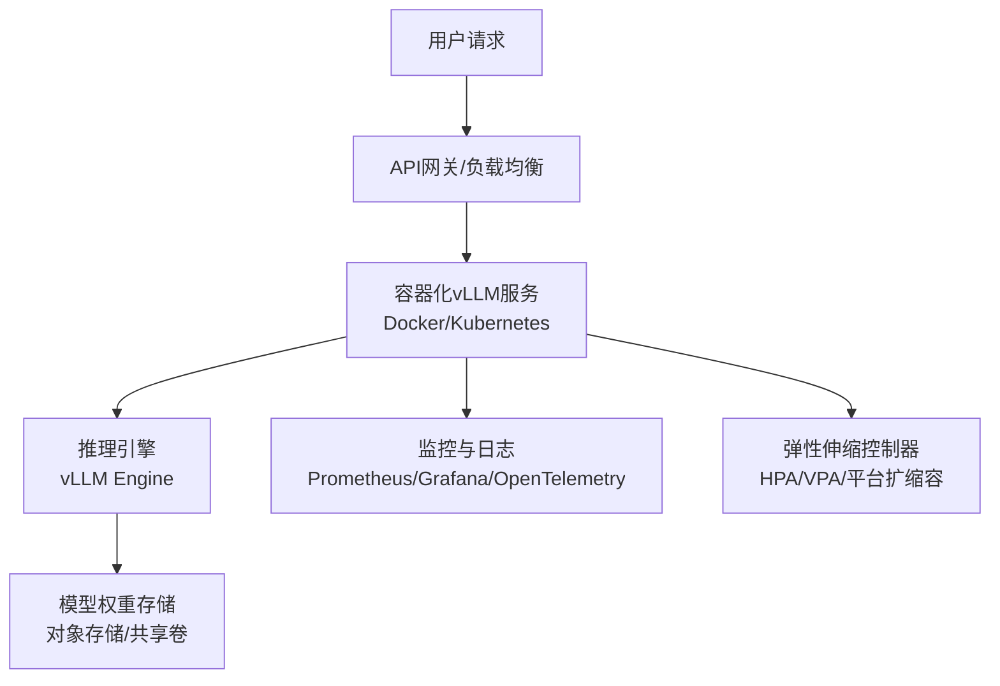
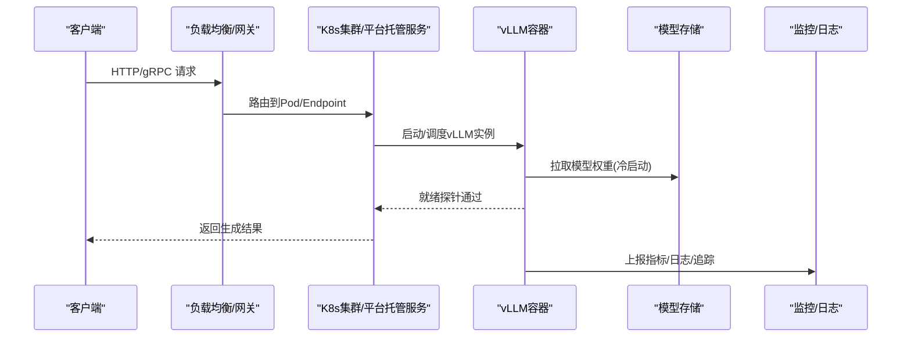
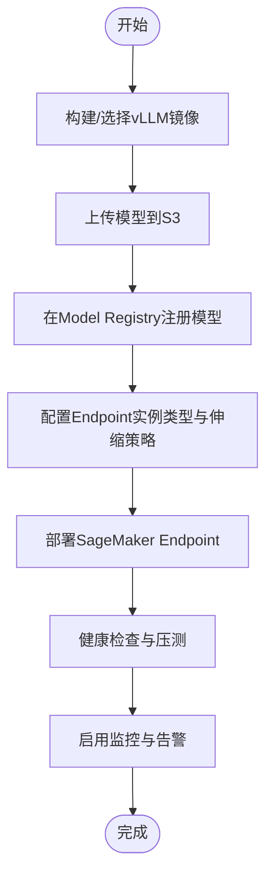
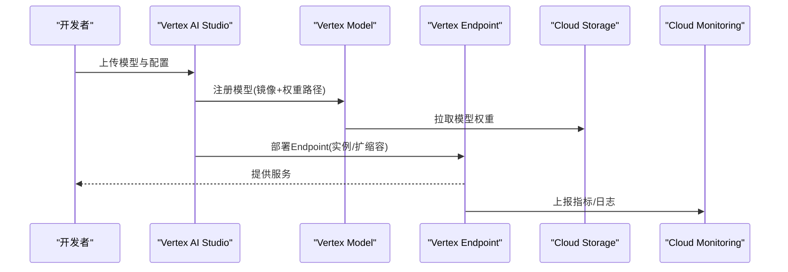
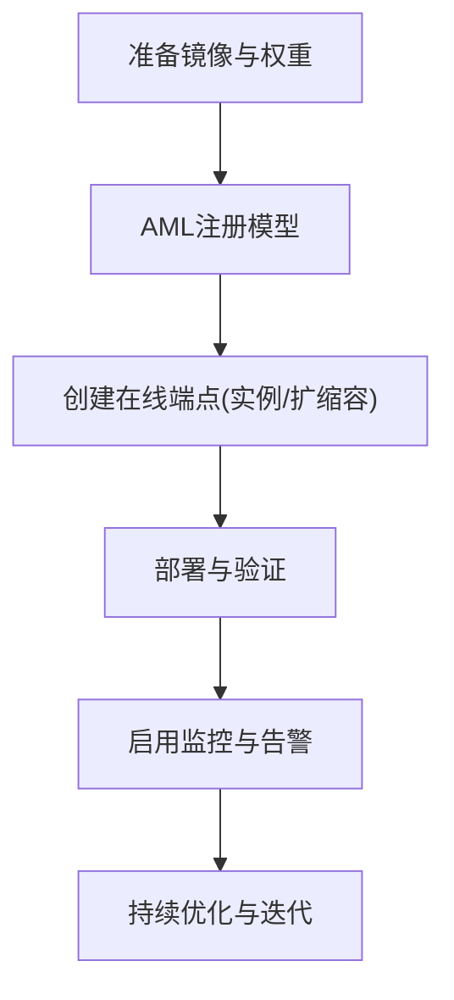
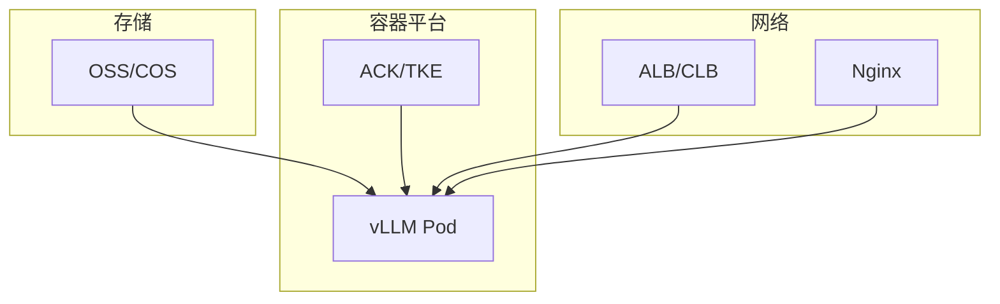
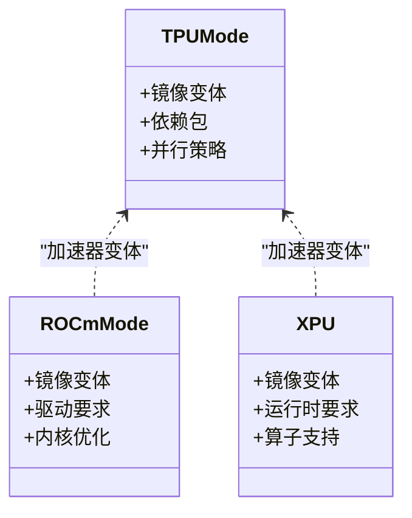
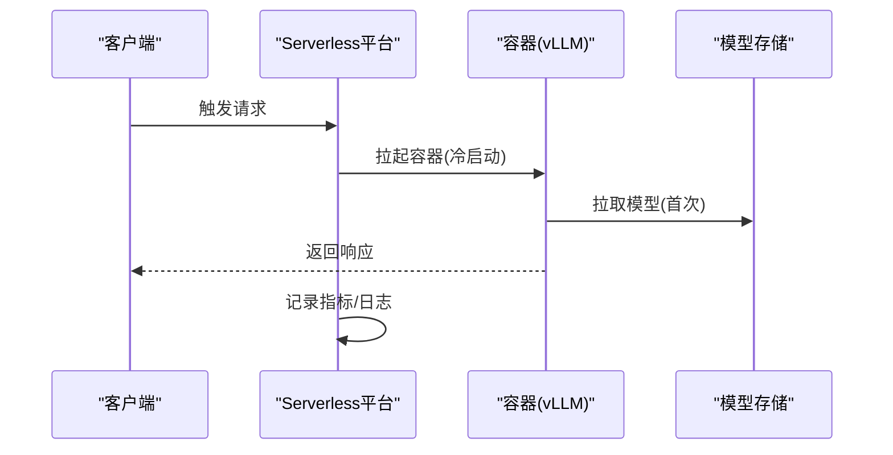
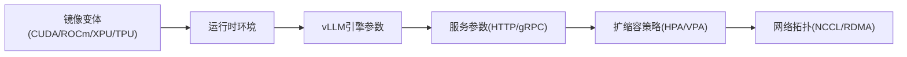

# 云平台部署

<cite>
**本文引用的文件**   
- [README.md](file://README.md)
- [docker/Dockerfile](file://docker/Dockerfile)
- [docker/Dockerfile.tpu](file://docker/Dockerfile.tpu)
- [docker/entrypoints/vllm-nonroot-entrypoint.sh](file://docker/entrypoints/vllm-nonroot-entrypoint.sh)
- [examples/deployment/sagemaker-entrypoint.sh](file://examples/deployment/sagemaker-entrypoint.sh)
- [docs/deployment/docker.md](file://docs/deployment/docker.md)
- [docs/deployment/k8s.md](file://docs/deployment/k8s.md)
- [docs/deployment/nginx.md](file://docs/deployment/nginx.md)
- [docs/deployment/frameworks/README.md](file://docs/deployment/frameworks/README.md)
- [docs/deployment/integrations/README.md](file://docs/deployment/integrations/README.md)
- [docs/configuration/engine_args.md](file://docs/configuration/engine_args.md)
- [docs/configuration/env_vars.md](file://docs/configuration/env_vars.md)
- [docs/configuration/serve_args.md](file://docs/configuration/serve_args.md)
- [docs/configuration/optimization.md](file://docs/configuration/optimization.md)
- [docs/serving/data_parallel_deployment.md](file://docs/serving/data_parallel_deployment.md)
- [docs/serving/context_parallel_deployment.md](file://docs/serving/context_parallel_deployment.md)
- [docs/serving/expert_parallel_deployment.md](file://docs/serving/expert_parallel_deployment.md)
- [docs/serving/parallelism_scaling.md](file://docs/serving/parallelism_scaling.md)
- [requirements/tpu.txt](file://requirements/tpu.txt)
- [tools/vllm-tpu/README.md](file://tools/vllm-tpu/README.md)
- [benchmarks/benchmark_serving.py](file://benchmarks/benchmark_serving.py)
- [examples/ray_serving/multi-node-serving.sh](file://examples/ray_serving/multi-node-serving.sh)
</cite>

## 目录
1. [简介](#简介)
2. [项目结构](#项目结构)
3. [核心组件](#核心组件)
4. [架构总览](#架构总览)
5. [详细组件分析](#详细组件分析)
6. [依赖关系分析](#依赖关系分析)
7. [性能与成本优化](#性能与成本优化)
8. [故障排查指南](#故障排查指南)
9. [结论](#结论)
10. [附录：多云与混合云模式](#附录多云与混合云模式)

## 简介
本指南面向在主流云平台部署 vLLM 的工程师与架构师，覆盖 AWS SageMaker、Google Cloud AI Platform（Vertex AI）、Azure Machine Learning 以及阿里云、腾讯云等国内云平台的部署要点。文档基于仓库中的容器镜像、入口脚本、部署文档与配置项，给出实例选型、模型注册、弹性伸缩、监控与可观测性、TPU/专用AI芯片支持、Serverless与容器服务集成、以及多云/混合云设计模式的实践建议。

## 项目结构
vLLM 提供多平台部署能力，关键路径包括：
- 容器镜像构建与运行时：docker/*
- 各云平台示例与入口脚本：examples/deployment/*
- 官方部署文档：docs/deployment/*
- 运行参数与环境变量：docs/configuration/*
- 并行与扩展策略：docs/serving/*
- TPU 支持与工具：requirements/tpu.txt, tools/vllm-tpu/*

图表来源
- [docs/deployment/docker.md](file://docs/deployment/docker.md)
- [docs/deployment/k8s.md](file://docs/deployment/k8s.md)
- [docker/Dockerfile](file://docker/Dockerfile)

章节来源
- [README.md](file://README.md)
- [docs/deployment/docker.md](file://docs/deployment/docker.md)
- [docs/deployment/k8s.md](file://docs/deployment/k8s.md)

## 核心组件
- 容器镜像与入口点
  - 通用镜像与CPU/ROCm/XPU/TPU变体：docker/Dockerfile*, docker/entrypoints/*
  - SageMaker 入口脚本：examples/deployment/sagemaker-entrypoint.sh
- 部署与编排
  - Docker 与 Kubernetes 部署说明：docs/deployment/docker.md, docs/deployment/k8s.md
  - Nginx 反向代理与流量治理：docs/deployment/nginx.md
- 运行配置
  - 引擎参数、服务参数与环境变量：docs/configuration/engine_args.md, docs/configuration/serve_args.md, docs/configuration/env_vars.md
- 并行与扩展
  - 数据并行、上下文并行、专家并行与扩缩容策略：docs/serving/*
- TPU与专用AI芯片
  - TPU 依赖与工具：requirements/tpu.txt, tools/vllm-tpu/README.md

章节来源
- [docker/Dockerfile](file://docker/Dockerfile)
- [docker/Dockerfile.tpu](file://docker/Dockerfile.tpu)
- [docker/entrypoints/vllm-nonroot-entrypoint.sh](file://docker/entrypoints/vllm-nonroot-entrypoint.sh)
- [examples/deployment/sagemaker-entrypoint.sh](file://examples/deployment/sagemaker-entrypoint.sh)
- [docs/deployment/docker.md](file://docs/deployment/docker.md)
- [docs/deployment/k8s.md](file://docs/deployment/k8s.md)
- [docs/deployment/nginx.md](file://docs/deployment/nginx.md)
- [docs/configuration/engine_args.md](file://docs/configuration/engine_args.md)
- [docs/configuration/serve_args.md](file://docs/configuration/serve_args.md)
- [docs/configuration/env_vars.md](file://docs/configuration/env_vars.md)
- [docs/serving/data_parallel_deployment.md](file://docs/serving/data_parallel_deployment.md)
- [docs/serving/context_parallel_deployment.md](file://docs/serving/context_parallel_deployment.md)
- [docs/serving/expert_parallel_deployment.md](file://docs/serving/expert_parallel_deployment.md)
- [requirements/tpu.txt](file://requirements/tpu.txt)
- [tools/vllm-tpu/README.md](file://tools/vllm-tpu/README.md)

## 架构总览
vLLM 在云上的典型架构由“接入层—计算层—存储层—可观测性”组成：
- 接入层：API网关/负载均衡（如AWS ALB/NLB、GCP Load Balancer、Azure Front Door/AGW、阿里云ALB/NLB、腾讯云CLB）
- 计算层：容器化的 vLLM 服务（Kubernetes Deployment/StatefulSet、SageMaker Endpoint、Vertex AI Model Serving、AML Managed Endpoint）
- 存储层：模型权重与KV缓存（对象存储、NAS/EFS/Cloud Filestore、分布式KV连接器）
- 可观测性：指标、日志、追踪（Prometheus、Grafana、OpenTelemetry、云平台原生监控）

图表来源
- [docs/deployment/k8s.md](file://docs/deployment/k8s.md)
- [docs/deployment/docker.md](file://docs/deployment/docker.md)
- [docker/Dockerfile](file://docker/Dockerfile)

## 详细组件分析

### AWS SageMaker 部署流程
- 镜像准备
  - 使用 vLLM 官方镜像或自定义镜像，确保包含推理所需驱动与库；非root运行可通过入口脚本配置。
- 模型注册
  - 将模型权重上传至对象存储（S3），在 SageMaker Model Registry 中注册模型版本，关联镜像URI与存储路径。
- 端点部署
  - 创建 SageMaker Endpoint，选择实例类型（GPU/A100/H100 等），设置初始副本数与自动伸缩策略。
- 入口脚本
  - 使用 SageMaker 兼容的入口脚本启动 vLLM 服务，挂载模型存储并暴露推理端口。

图表来源
- [examples/deployment/sagemaker-entrypoint.sh](file://examples/deployment/sagemaker-entrypoint.sh)
- [docker/entrypoints/vllm-nonroot-entrypoint.sh](file://docker/entrypoints/vllm-nonroot-entrypoint.sh)
- [docs/deployment/docker.md](file://docs/deployment/docker.md)

章节来源
- [examples/deployment/sagemaker-entrypoint.sh](file://examples/deployment/sagemaker-entrypoint.sh)
- [docker/entrypoints/vllm-nonroot-entrypoint.sh](file://docker/entrypoints/vllm-nonroot-entrypoint.sh)
- [docs/deployment/docker.md](file://docs/deployment/docker.md)

### Google Cloud Vertex AI（AI Platform）部署与优化
- 镜像与依赖
  - 使用 vLLM 官方镜像或自定义镜像，确保CUDA/驱动匹配；如需TPU，参考TPU镜像与依赖。
- 模型与服务
  - 将模型权重放入Cloud Storage，创建Vertex AI Model并部署为Endpoint；配置自动扩缩容与资源配额。
- 优化建议
  - 调整批大小、序列长度、KV缓存策略；启用量化与编译优化（依据配置文档）。
  - 使用预取与预热减少冷启动时延。

图表来源
- [docs/deployment/docker.md](file://docs/deployment/docker.md)
- [requirements/tpu.txt](file://requirements/tpu.txt)
- [tools/vllm-tpu/README.md](file://tools/vllm-tpu/README.md)

章节来源
- [docs/deployment/docker.md](file://docs/deployment/docker.md)
- [requirements/tpu.txt](file://requirements/tpu.txt)
- [tools/vllm-tpu/README.md](file://tools/vllm-tpu/README.md)

### Azure Machine Learning 部署与监控
- 环境准备
  - 使用 vLLM 容器镜像，确保GPU驱动与CUDA版本匹配；必要时使用自定义镜像。
- 模型注册与部署
  - 在AML中注册模型，创建在线端点（Managed Online Endpoint），选择GPU实例族与副本数。
- 监控与诊断
  - 启用应用指标、日志与分布式追踪；结合Azure Monitor与Application Insights进行告警与排障。

图表来源
- [docs/deployment/docker.md](file://docs/deployment/docker.md)
- [docs/configuration/serve_args.md](file://docs/configuration/serve_args.md)

章节来源
- [docs/deployment/docker.md](file://docs/deployment/docker.md)
- [docs/configuration/serve_args.md](file://docs/configuration/serve_args.md)

### 阿里云与腾讯云部署方案
- 容器服务
  - 阿里云ACK/腾讯云TKE：以Deployment/StatefulSet部署vLLM，配合HPA实现弹性伸缩。
- 模型管理
  - 使用对象存储（OSS/COS）存放模型权重，服务启动时拉取；或使用共享文件系统加速加载。
- 网络与网关
  - 通过ALB/CLB暴露服务，配置健康检查与限流；结合Nginx进行请求聚合与压缩。

图表来源
- [docs/deployment/k8s.md](file://docs/deployment/k8s.md)
- [docs/deployment/nginx.md](file://docs/deployment/nginx.md)
- [docs/deployment/docker.md](file://docs/deployment/docker.md)

章节来源
- [docs/deployment/k8s.md](file://docs/deployment/k8s.md)
- [docs/deployment/nginx.md](file://docs/deployment/nginx.md)
- [docs/deployment/docker.md](file://docs/deployment/docker.md)

### TPU与专用AI芯片支持
- TPU
  - 使用TPU专用镜像与依赖包；根据模型与批大小调整并行度与内存占用。
- 其他加速器
  - ROCm/XPU等变体镜像可用于AMD GPU与Intel XPU；需确认驱动与库版本匹配。

图表来源
- [docker/Dockerfile.tpu](file://docker/Dockerfile.tpu)
- [requirements/tpu.txt](file://requirements/tpu.txt)
- [tools/vllm-tpu/README.md](file://tools/vllm-tpu/README.md)

章节来源
- [docker/Dockerfile.tpu](file://docker/Dockerfile.tpu)
- [requirements/tpu.txt](file://requirements/tpu.txt)
- [tools/vllm-tpu/README.md](file://tools/vllm-tpu/README.md)

### Serverless函数与容器服务集成
- Serverless
  - 在支持容器镜像的Serverless平台（如AWS Lambda with Container、GCP Cloud Run、Azure Container Instances）上部署vLLM；注意冷启动与内存限制。
- 容器编排
  - 使用Kubernetes HPA/VPA实现按QPS/CPU/GPU指标的弹性伸缩；结合Nginx做请求整形与队列控制。

图表来源
- [docs/deployment/docker.md](file://docs/deployment/docker.md)
- [docs/deployment/nginx.md](file://docs/deployment/nginx.md)

章节来源
- [docs/deployment/docker.md](file://docs/deployment/docker.md)
- [docs/deployment/nginx.md](file://docs/deployment/nginx.md)

## 依赖关系分析
- 容器镜像依赖
  - CUDA/ROCm/XPU/TPU运行时与驱动版本需与主机一致；镜像变体决定可用后端。
- 运行参数依赖
  - 引擎参数（批大小、序列长度、KV缓存）、服务参数（端口、并发）、环境变量（日志级别、插件开关）共同影响性能与稳定性。
- 并行与扩展依赖
  - 数据并行、上下文并行、专家并行需要跨节点通信与同步；需合理配置网络带宽与拓扑。

图表来源
- [docker/Dockerfile](file://docker/Dockerfile)
- [docs/configuration/engine_args.md](file://docs/configuration/engine_args.md)
- [docs/configuration/serve_args.md](file://docs/configuration/serve_args.md)
- [docs/configuration/env_vars.md](file://docs/configuration/env_vars.md)
- [docs/serving/parallelism_scaling.md](file://docs/serving/parallelism_scaling.md)

章节来源
- [docker/Dockerfile](file://docker/Dockerfile)
- [docs/configuration/engine_args.md](file://docs/configuration/engine_args.md)
- [docs/configuration/serve_args.md](file://docs/configuration/serve_args.md)
- [docs/configuration/env_vars.md](file://docs/configuration/env_vars.md)
- [docs/serving/parallelism_scaling.md](file://docs/serving/parallelism_scaling.md)

## 性能与成本优化
- 实例选型
  - 根据模型规模与吞吐目标选择GPU/TPU实例族；大模型优先高显存与高带宽设备。
- 批处理与序列长度
  - 增大批大小提升吞吐但增加时延；动态批处理与早停策略平衡延迟与吞吐。
- KV缓存与内存
  - 调整KV缓存大小与分块策略，避免OOM；利用页式注意力与内存池。
- 量化与编译
  - 启用INT8/FP8量化与图编译优化，降低显存占用并提升吞吐。
- 弹性伸缩
  - 基于QPS/CPU/GPU利用率配置HPA；峰值时段扩容，低谷期缩容降低成本。
- 存储优化
  - 使用高速对象存储与CDN缓存热点模型；预热与分层加载减少冷启动。

章节来源
- [docs/configuration/optimization.md](file://docs/configuration/optimization.md)
- [docs/serving/data_parallel_deployment.md](file://docs/serving/data_parallel_deployment.md)
- [docs/serving/context_parallel_deployment.md](file://docs/serving/context_parallel_deployment.md)
- [docs/serving/expert_parallel_deployment.md](file://docs/serving/expert_parallel_deployment.md)
- [benchmarks/benchmark_serving.py](file://benchmarks/benchmark_serving.py)

## 故障排查指南
- 启动失败
  - 检查镜像与驱动版本匹配；确认模型路径权限与网络可达。
- 内存不足
  - 调小批大小与序列长度；启用量化与KV缓存优化；增加实例显存。
- 时延抖动
  - 观察GC与I/O瓶颈；启用预热与批合并；检查网络拥塞与跨节点通信。
- 监控与日志
  - 采集Prometheus指标与OpenTelemetry追踪；结合平台监控定位热点与异常。

章节来源
- [docs/configuration/env_vars.md](file://docs/configuration/env_vars.md)
- [docs/deployment/docker.md](file://docs/deployment/docker.md)
- [docs/deployment/k8s.md](file://docs/deployment/k8s.md)

## 结论
vLLM在多云平台具备一致的容器化部署体验，通过合理的实例选型、并行策略与弹性伸缩，可在保证低时延的同时最大化吞吐与性价比。结合监控与可观测性体系，可实现稳定高效的线上推理服务。

## 附录：多云与混合云模式
- 多云部署
  - 统一镜像与配置管理，跨平台发布与灰度；使用抽象网关聚合不同云端的Endpoint。
- 混合云
  - 核心模型在私有云训练与微调，公有云弹性推理；通过对象存储与KV连接器同步权重与缓存。
- 灾备与回滚
  - 多Region复制模型与镜像；蓝绿/金丝雀发布与快速回滚策略。

章节来源
- [docs/deployment/frameworks/README.md](file://docs/deployment/frameworks/README.md)
- [docs/deployment/integrations/README.md](file://docs/deployment/integrations/README.md)
- [examples/ray_serving/multi-node-serving.sh](file://examples/ray_serving/multi-node-serving.sh)