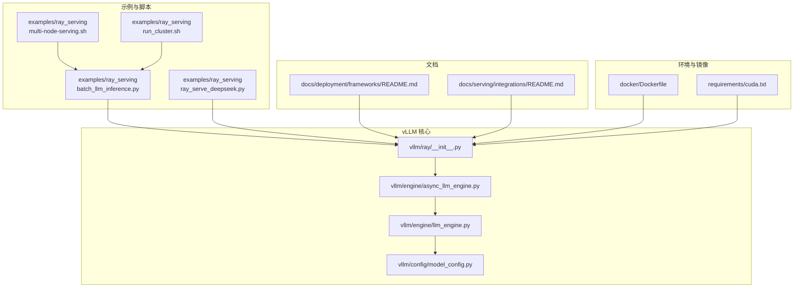
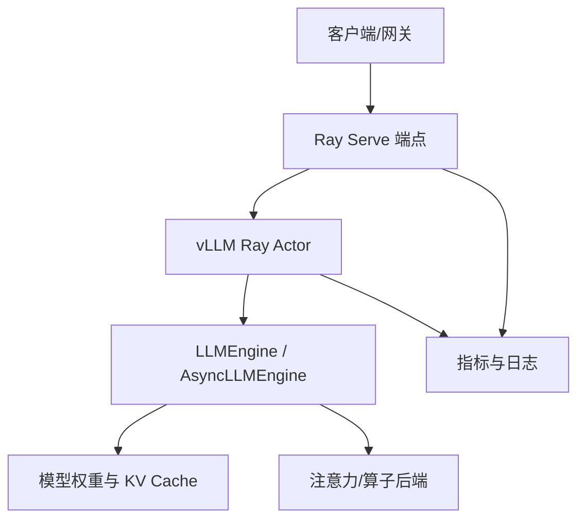
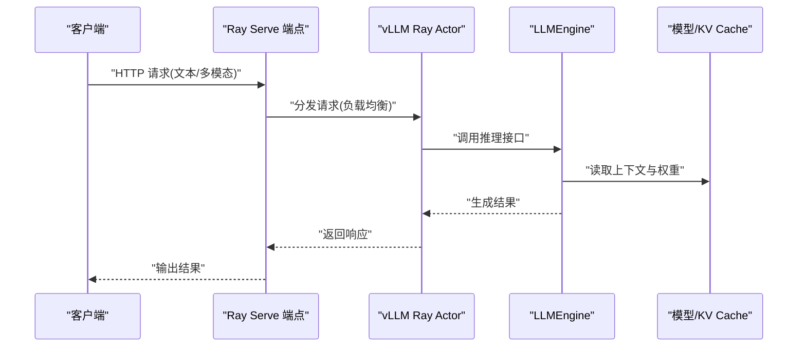
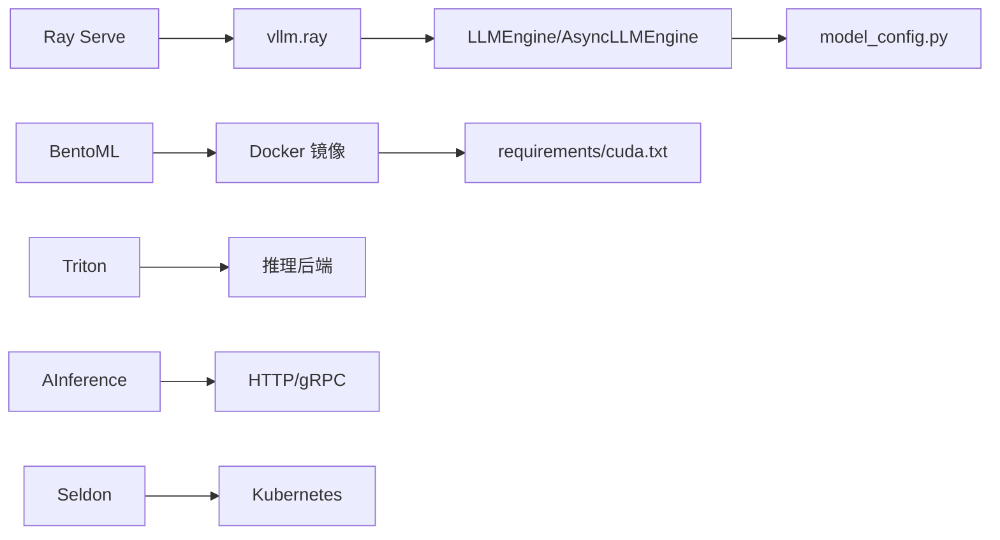

# 框架集成部署

<cite>
**本文引用的文件**   
- [examples/ray_serving/batch_llm_inference.py](file://examples/ray_serving/batch_llm_inference.py)
- [examples/ray_serving/ray_serve_deepseek.py](file://examples/ray_serving/ray_serve_deepseek.py)
- [examples/ray_serving/multi-node-serving.sh](file://examples/ray_serving/multi-node-serving.sh)
- [examples/ray_serving/run_cluster.sh](file://examples/ray_serving/run_cluster.sh)
- [docs/deployment/frameworks/README.md](file://docs/deployment/frameworks/README.md)
- [docs/serving/integrations/README.md](file://docs/serving/integrations/README.md)
- [vllm/ray/__init__.py](file://vllm/ray/__init__.py)
- [vllm/engine/async_llm_engine.py](file://vllm/engine/async_llm_engine.py)
- [vllm/engine/llm_engine.py](file://vllm/engine/llm_engine.py)
- [vllm/config/model_config.py](file://vllm/config/model_config.py)
- [docker/Dockerfile](file://docker/Dockerfile)
- [requirements/cuda.txt](file://requirements/cuda.txt)
</cite>

## 目录
1. [简介](#简介)
2. [项目结构](#项目结构)
3. [核心组件](#核心组件)
4. [架构总览](#架构总览)
5. [详细组件分析](#详细组件分析)
6. [依赖关系分析](#依赖关系分析)
7. [性能考量](#性能考量)
8. [故障排查指南](#故障排查指南)
9. [结论](#结论)
10. [附录](#附录)

## 简介
本文件面向希望在生产环境中将 vLLM 与主流推理服务框架集成的工程师，系统讲解 Ray Serve、BentoML、Triton Inference Server、AInference、Seldon 等框架的集成方式、配置要点、资源管理与分布式部署策略。文档同时提供数据流与通信机制说明、迁移指南与兼容性建议，并给出可操作的配置文件与脚本路径参考，帮助读者快速落地。

## 项目结构
仓库中与“框架集成”直接相关的内容主要分布在以下位置：
- examples/ray_serving：Ray Serve 示例与多节点启动脚本
- docs/deployment/frameworks：框架集成文档索引
- docs/serving/integrations：在线服务集成相关文档
- vllm/ray：vLLM 对 Ray 的封装与调度入口
- docker：容器化镜像构建（便于在各框架中复用）
- requirements：依赖清单（CUDA/Torch 等）

图表来源
- [examples/ray_serving/batch_llm_inference.py](file://examples/ray_serving/batch_llm_inference.py)
- [examples/ray_serving/ray_serve_deepseek.py](file://examples/ray_serving/ray_serve_deepseek.py)
- [examples/ray_serving/multi-node-serving.sh](file://examples/ray_serving/multi-node-serving.sh)
- [examples/ray_serving/run_cluster.sh](file://examples/ray_serving/run_cluster.sh)
- [docs/deployment/frameworks/README.md](file://docs/deployment/frameworks/README.md)
- [docs/serving/integrations/README.md](file://docs/serving/integrations/README.md)
- [vllm/ray/__init__.py](file://vllm/ray/__init__.py)
- [vllm/engine/async_llm_engine.py](file://vllm/engine/async_llm_engine.py)
- [vllm/engine/llm_engine.py](file://vllm/engine/llm_engine.py)
- [vllm/config/model_config.py](file://vllm/config/model_config.py)
- [docker/Dockerfile](file://docker/Dockerfile)
- [requirements/cuda.txt](file://requirements/cuda.txt)

章节来源
- [docs/deployment/frameworks/README.md](file://docs/deployment/frameworks/README.md)
- [docs/serving/integrations/README.md](file://docs/serving/integrations/README.md)

## 核心组件
- vLLM 引擎层
  - LLMEngine：模型加载、KV Cache、调度与执行的核心
  - AsyncLLMEngine：异步接口，适合高并发服务场景
- Ray 集成层
  - vllm.ray：封装 vLLM Engine 为 Ray Actor/Task，支持跨进程/跨节点分布
- 配置层
  - model_config：模型参数、并行策略、量化与后端选择
- 运行环境
  - Dockerfile：统一依赖与 CUDA/Torch 版本
  - requirements：运行时依赖约束

章节来源
- [vllm/engine/llm_engine.py](file://vllm/engine/llm_engine.py)
- [vllm/engine/async_llm_engine.py](file://vllm/engine/async_llm_engine.py)
- [vllm/config/model_config.py](file://vllm/config/model_config.py)
- [vllm/ray/__init__.py](file://vllm/ray/__init__.py)
- [docker/Dockerfile](file://docker/Dockerfile)
- [requirements/cuda.txt](file://requirements/cuda.txt)

## 架构总览
下图展示 vLLM 在 Ray Serve 中的典型部署架构：客户端通过 HTTP/gRPC 调用 Ray Serve 端点，Serve 将请求路由到 vLLM Actor，Actor 内部使用 LLMEngine 进行推理，结果返回给客户端。

图表来源
- [examples/ray_serving/ray_serve_deepseek.py](file://examples/ray_serving/ray_serve_deepseek.py)
- [vllm/ray/__init__.py](file://vllm/ray/__init__.py)
- [vllm/engine/llm_engine.py](file://vllm/engine/llm_engine.py)
- [vllm/engine/async_llm_engine.py](file://vllm/engine/async_llm_engine.py)

## 详细组件分析

### Ray Serve 集成与分布式部署
- 集成方式
  - 使用 vllm.ray 将 LLMEngine 包装为 Ray Actor，由 Ray Serve 暴露 HTTP/gRPC 端点
  - 通过 Ray 集群管理多进程/多节点资源，实现水平扩展
- 关键步骤
  - 定义 Serve 应用与端点函数，创建 vLLM Actor 池
  - 配置资源（GPU/CPU/内存）、批大小、并发度
  - 启动 Ray 集群，部署 Serve 应用
- 多节点启动
  - 使用 multi-node-serving.sh 或 run_cluster.sh 初始化集群与节点
- 配置要点
  - 模型配置（model_config）：并行策略、量化、后端选择
  - 引擎参数（engine_args）：批处理、缓存、调度策略
  - 环境变量：CUDA_VISIBLE_DEVICES、NCCL 相关等

图表来源
- [examples/ray_serving/ray_serve_deepseek.py](file://examples/ray_serving/ray_serve_deepseek.py)
- [examples/ray_serving/batch_llm_inference.py](file://examples/ray_serving/batch_llm_inference.py)
- [vllm/ray/__init__.py](file://vllm/ray/__init__.py)
- [vllm/engine/llm_engine.py](file://vllm/engine/llm_engine.py)

章节来源
- [examples/ray_serving/ray_serve_deepseek.py](file://examples/ray_serving/ray_serve_deepseek.py)
- [examples/ray_serving/batch_llm_inference.py](file://examples/ray_serving/batch_llm_inference.py)
- [examples/ray_serving/multi-node-serving.sh](file://examples/ray_serving/multi-node-serving.sh)
- [examples/ray_serving/run_cluster.sh](file://examples/ray_serving/run_cluster.sh)
- [vllm/ray/__init__.py](file://vllm/ray/__init__.py)
- [vllm/engine/llm_engine.py](file://vllm/engine/llm_engine.py)
- [vllm/engine/async_llm_engine.py](file://vllm/engine/async_llm_engine.py)
- [vllm/config/model_config.py](file://vllm/config/model_config.py)

### BentoML 模型打包与服务发布
- 打包流程
  - 使用 BentoML 的 Service 定义封装 vLLM 推理逻辑
  - 将模型权重与依赖打包为 Bento，便于在不同环境部署
- 发布流程
  - 通过 BentoML CLI 或平台（如 Kubernetes）部署服务
  - 结合容器镜像与编排工具实现弹性伸缩
- 注意事项
  - 确保 CUDA/Torch 版本与 vLLM 要求一致
  - 合理设置 GPU 资源配额与批大小
  - 使用健康检查与探针保障服务可用性

章节来源
- [docs/deployment/frameworks/README.md](file://docs/deployment/frameworks/README.md)
- [docker/Dockerfile](file://docker/Dockerfile)
- [requirements/cuda.txt](file://requirements/cuda.txt)

### Triton Inference Server 集成与性能优势
- 集成方式
  - 将 vLLM 作为 Triton 后端插件或通过 gRPC/HTTP 暴露推理服务
  - 利用 Triton 的模型版本管理、动态批处理与流水线优化
- 性能优势
  - 统一的推理后端抽象，支持多模型混合部署
  - 高效的序列化与内存管理，降低端到端延迟
- 部署要点
  - 配置 Triton 模型仓库与后端参数
  - 调整批大小、并发线程与 GPU 内存上限
  - 启用监控与指标导出

章节来源
- [docs/serving/integrations/README.md](file://docs/serving/integrations/README.md)
- [docker/Dockerfile](file://docker/Dockerfile)

### AInference 与 Seldon 集成方法
- AInference
  - 通常以容器化服务形式集成 vLLM，通过 API 网关暴露
  - 关注网络协议（HTTP/gRPC）与鉴权配置
- Seldon
  - 使用 Seldon Core 的自定义模型服务器或 Python 预测器封装 vLLM
  - 借助 Kubernetes 实现自动扩缩容与灰度发布
- 共同要点
  - 明确输入输出格式与错误码
  - 配置资源限制与健康检查
  - 接入日志与指标采集

章节来源
- [docs/deployment/frameworks/README.md](file://docs/deployment/frameworks/README.md)
- [docs/serving/integrations/README.md](file://docs/serving/integrations/README.md)

### 其他框架（通用模式）
- 常见模式
  - 容器化 vLLM + 框架网关（API Gateway/Service Mesh）
  - 通过标准协议（HTTP/gRPC）与 vLLM 交互
- 配置重点
  - 资源隔离（CPU/GPU/Memory）
  - 批处理与并发控制
  - 监控与告警

章节来源
- [docs/deployment/frameworks/README.md](file://docs/deployment/frameworks/README.md)

## 依赖关系分析
vLLM 与各框架的依赖关系如下：
- Ray Serve：依赖 vllm.ray 与 LLMEngine，通过 Ray 集群管理资源
- BentoML：依赖容器镜像与依赖清单，封装推理逻辑
- Triton：依赖后端插件或外部服务，统一推理接口
- AInference/Seldon：依赖容器与编排平台，标准化 API

图表来源
- [vllm/ray/__init__.py](file://vllm/ray/__init__.py)
- [vllm/engine/llm_engine.py](file://vllm/engine/llm_engine.py)
- [vllm/engine/async_llm_engine.py](file://vllm/engine/async_llm_engine.py)
- [vllm/config/model_config.py](file://vllm/config/model_config.py)
- [docker/Dockerfile](file://docker/Dockerfile)
- [requirements/cuda.txt](file://requirements/cuda.txt)

章节来源
- [vllm/ray/__init__.py](file://vllm/ray/__init__.py)
- [vllm/engine/llm_engine.py](file://vllm/engine/llm_engine.py)
- [vllm/engine/async_llm_engine.py](file://vllm/engine/async_llm_engine.py)
- [vllm/config/model_config.py](file://vllm/config/model_config.py)
- [docker/Dockerfile](file://docker/Dockerfile)
- [requirements/cuda.txt](file://requirements/cuda.txt)

## 性能考量
- 批处理与并发
  - 根据 GPU 显存与延迟目标调优批大小与并发度
- 内存与缓存
  - 合理使用 KV Cache，避免频繁换入换出
- 后端选择
  - 选择高性能注意力与 GEMM 后端（如 FlashAttention、Cutlass）
- 监控与诊断
  - 启用指标导出（Prometheus/Grafana），定位瓶颈

[本节为通用指导，不直接分析具体文件]

## 故障排查指南
- 常见问题
  - CUDA/Torch 版本不匹配导致导入失败
  - GPU 资源不足引发 OOM
  - 网络超时或连接池耗尽
- 排查步骤
  - 检查容器镜像与依赖清单一致性
  - 查看 vLLM 日志与 Ray 任务状态
  - 使用性能剖析工具定位热点
- 恢复策略
  - 重启 Pod/Worker，清理残留进程
  - 调整资源配额与批大小

章节来源
- [docker/Dockerfile](file://docker/Dockerfile)
- [requirements/cuda.txt](file://requirements/cuda.txt)
- [examples/ray_serving/multi-node-serving.sh](file://examples/ray_serving/multi-node-serving.sh)

## 结论
vLLM 与主流推理框架的集成已具备成熟方案。Ray Serve 适合大规模分布式部署，BentoML 便于模型打包与发布，Triton 提供统一推理后端，AInference/Seldon 则适配企业级编排需求。选择合适的框架需综合考虑团队技术栈、运维能力与业务 SLA。

[本节为总结性内容，不直接分析具体文件]

## 附录
- 配置文件与脚本路径参考
  - Ray Serve 示例：examples/ray_serving/*.py, *.sh
  - 框架集成文档：docs/deployment/frameworks/README.md, docs/serving/integrations/README.md
  - 容器与环境：docker/Dockerfile, requirements/cuda.txt
- 迁移指南
  - 从单机到分布式：优先迁移至 Ray 集群，逐步引入服务网格
  - 从原生 API 到框架：保持输入输出契约不变，替换网关与编排层
- 兼容性说明
  - CUDA/Torch 版本需与 vLLM 官方要求一致
  - 不同框架对 GPU 驱动与内核版本有特定要求

章节来源
- [examples/ray_serving/batch_llm_inference.py](file://examples/ray_serving/batch_llm_inference.py)
- [examples/ray_serving/ray_serve_deepseek.py](file://examples/ray_serving/ray_serve_deepseek.py)
- [examples/ray_serving/multi-node-serving.sh](file://examples/ray_serving/multi-node-serving.sh)
- [examples/ray_serving/run_cluster.sh](file://examples/ray_serving/run_cluster.sh)
- [docs/deployment/frameworks/README.md](file://docs/deployment/frameworks/README.md)
- [docs/serving/integrations/README.md](file://docs/serving/integrations/README.md)
- [docker/Dockerfile](file://docker/Dockerfile)
- [requirements/cuda.txt](file://requirements/cuda.txt)