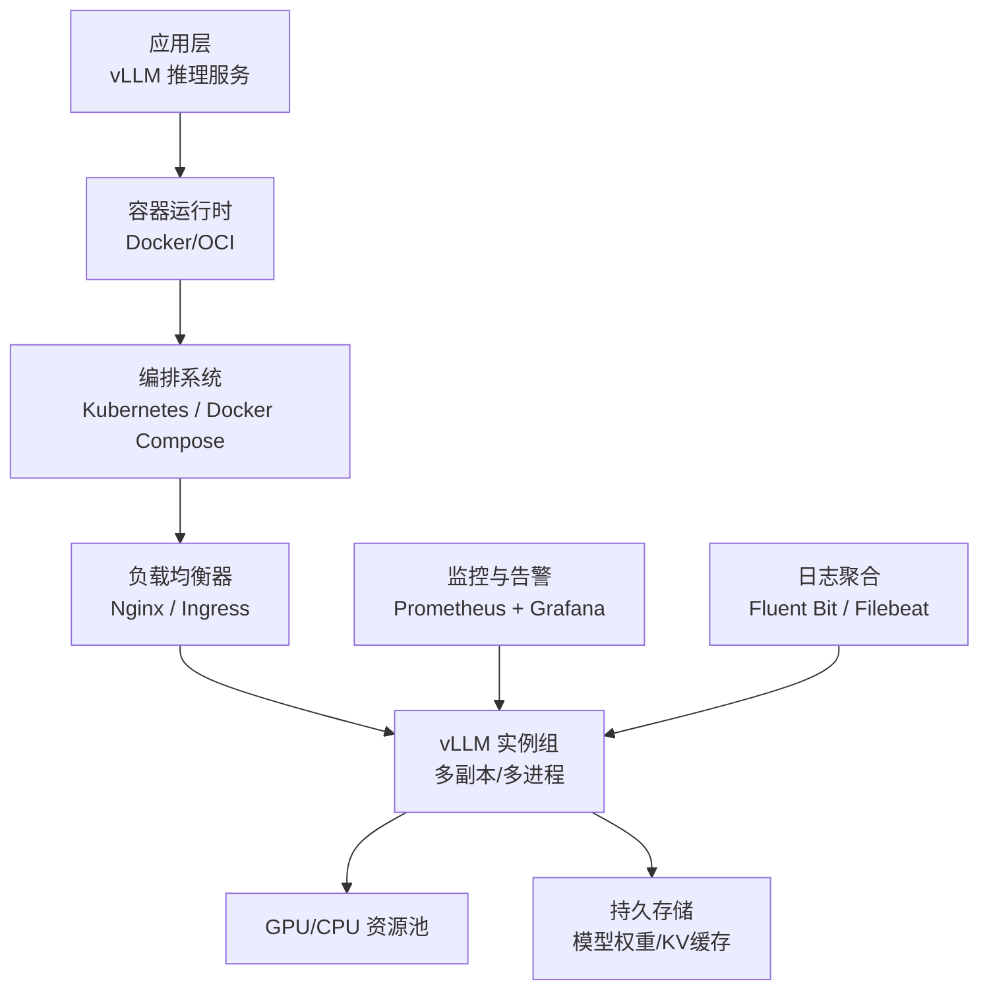
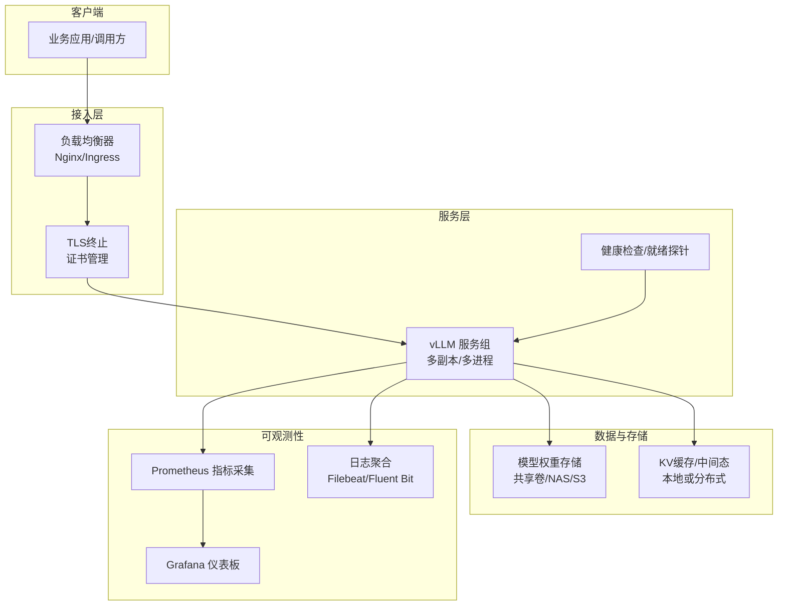
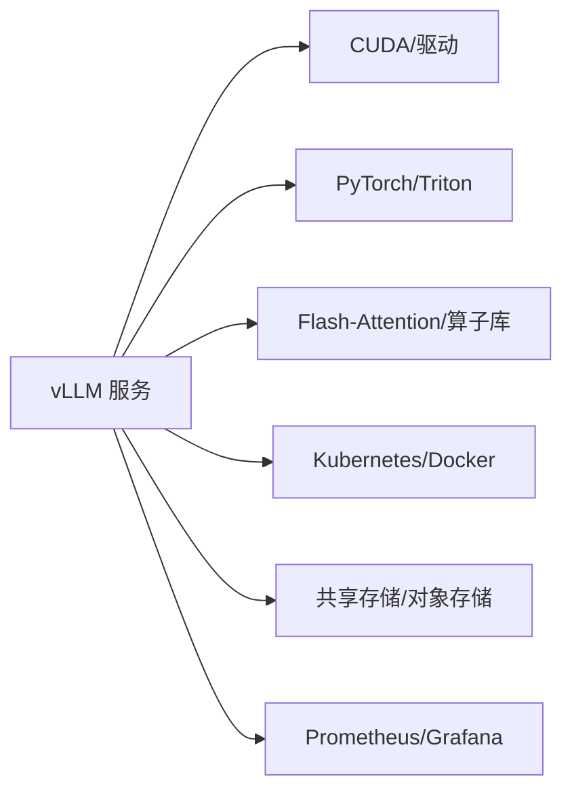

# 生产环境最佳实践

<cite>
**本文档引用的文件**   
- [README.md](file://README.md)
- [docker/Dockerfile](file://docker/Dockerfile)
- [docker/entrypoints/vllm-nonroot-entrypoint.sh](file://docker/entrypoints/vllm-nonroot-entrypoint.sh)
- [docs/deployment/k8s.md](file://docs/deployment/k8s.md)
- [docs/deployment/docker.md](file://docs/deployment/docker.md)
- [docs/deployment/nginx.md](file://docs/deployment/nginx.md)
- [docs/configuration/engine_args.md](file://docs/configuration/engine_args.md)
- [docs/configuration/env_vars.md](file://docs/configuration/env_vars.md)
- [docs/configuration/serve_args.md](file://docs/configuration/serve_args.md)
- [docs/configuration/optimization.md](file://docs/configuration/optimization.md)
- [docs/configuration/conserving_memory.md](file://docs/configuration/conserving_memory.md)
- [docs/serving/data_parallel_deployment.md](file://docs/serving/data_parallel_deployment.md)
- [docs/serving/context_parallel_deployment.md](file://docs/serving/context_parallel_deployment.md)
- [docs/serving/expert_parallel_deployment.md](file://docs/serving/expert_parallel_deployment.md)
- [docs/serving/distributed_troubleshooting.md](file://docs/serving/distributed_troubleshooting.md)
- [docs/design/metrics.md](file://docs/design/metrics.md)
- [docs/usage/metrics.md](file://docs/usage/metrics.md)
- [examples/observability/prometheus_grafana/grafana-dashboards.json](file://examples/observability/prometheus_grafana/grafana-dashboards.json)
- [examples/observability/prometheus_grafana/prometheus.yml](file://examples/observability/prometheus_grafana/prometheus.yml)
- [examples/observability/prometheus_grafana/grafana.ini](file://examples/observability/prometheus_grafana/grafana.ini)
- [benchmarks/benchmark_serving.py](file://benchmarks/benchmark_serving.py)
- [benchmarks/benchmark_throughput.py](file://benchmarks/benchmark_throughput.py)
- [benchmarks/benchmark_latency.py](file://benchmarks/benchmark_latency.py)
- [benchmarks/README.md](file://benchmarks/README.md)
- [vllm/config.py](file://vllm/config.py)
- [vllm/entrypoints/serve.py](file://vllm/entrypoints/serve.py)
- [vllm/logger.py](file://vllm/logger.py)
- [vllm/envs.py](file://vllm/envs.py)
- [requirements/cuda.txt](file://requirements/cuda.txt)
</cite>

## 目录
1. [简介](#简介)
2. [项目结构](#项目结构)
3. [核心组件](#核心组件)
4. [架构总览](#架构总览)
5. [详细组件分析](#详细组件分析)
6. [依赖关系分析](#依赖关系分析)
7. [性能考虑](#性能考虑)
8. [故障排查指南](#故障排查指南)
9. [结论](#结论)
10. [附录](#附录)

## 简介
本指南面向在生产环境中部署 vLLM 的工程师与运维团队，围绕高可用架构、负载均衡与故障转移、性能调优（批处理大小、并发连接数、内存管理）、监控与告警（Prometheus/Grafana/日志聚合）、安全加固（访问控制、TLS、网络隔离）、容量规划与资源估算、备份恢复与灾难恢复、以及基准与压力测试等方面，提供系统化、可落地的最佳实践。内容基于仓库中的部署文档、配置项、示例与基准工具进行归纳与提炼，确保与实践一致、可操作、可验证。

## 项目结构
vLLM 仓库包含运行时代码、容器化镜像定义、部署与编排文档、配置说明、可观测性示例与基准测试脚本等关键资产。生产部署通常围绕以下路径展开：
- 容器镜像与入口点：用于构建与启动服务
- 部署文档：Kubernetes、Docker、Nginx 等编排与反向代理
- 配置中心：引擎参数、服务参数、环境变量与优化策略
- 可观测性：Prometheus 抓取与 Grafana 仪表板示例
- 基准测试：吞吐、延迟与服务负载压测脚本

图表来源
- [docker/Dockerfile](file://docker/Dockerfile)
- [docs/deployment/k8s.md](file://docs/deployment/k8s.md)
- [docs/deployment/nginx.md](file://docs/deployment/nginx.md)
- [examples/observability/prometheus_grafana/prometheus.yml](file://examples/observability/prometheus_grafana/prometheus.yml)

章节来源
- [README.md](file://README.md)
- [docker/Dockerfile](file://docker/Dockerfile)
- [docs/deployment/docker.md](file://docs/deployment/docker.md)
- [docs/deployment/k8s.md](file://docs/deployment/k8s.md)
- [docs/deployment/nginx.md](file://docs/deployment/nginx.md)

## 核心组件
- 推理引擎与服务入口：负责加载模型、调度请求、执行注意力与解码计算，并暴露 OpenAI 兼容接口
- 配置系统：集中管理引擎参数、服务参数与环境变量，影响批处理、内存、通信与优化
- 容器与编排：通过 Docker 镜像与 Kubernetes 部署实现弹性扩缩容与高可用
- 可观测性：指标采集、日志收集与可视化面板，支撑容量规划与问题定位
- 基准测试：吞吐、延迟与服务级压测，用于容量评估与回归验证

章节来源
- [vllm/entrypoints/serve.py](file://vllm/entrypoints/serve.py)
- [vllm/config.py](file://vllm/config.py)
- [docs/configuration/engine_args.md](file://docs/configuration/engine_args.md)
- [docs/configuration/serve_args.md](file://docs/configuration/serve_args.md)
- [docs/configuration/env_vars.md](file://docs/configuration/env_vars.md)

## 架构总览
生产环境推荐采用“多副本 + 负载均衡 + 健康检查”的高可用架构，结合 K8s 的滚动更新与自动重启机制，保障服务连续性。监控与告警贯穿全链路，基准测试在上线前与变更后持续执行。

图表来源
- [docs/deployment/nginx.md](file://docs/deployment/nginx.md)
- [docs/deployment/k8s.md](file://docs/deployment/k8s.md)
- [examples/observability/prometheus_grafana/prometheus.yml](file://examples/observability/prometheus_grafana/prometheus.yml)
- [examples/observability/prometheus_grafana/grafana-dashboards.json](file://examples/observability/prometheus_grafana/grafana-dashboards.json)

## 详细组件分析

### 高可用架构设计与故障转移
- 多副本部署：在同一命名空间内部署多个 vLLM Pod，使用 K8s Service 与 Ingress/Nginx 做流量分发；配合水平扩缩容（HPA）根据 CPU/GPU/自定义指标动态调整副本数
- 负载均衡策略：优先按连接数或请求速率均衡，避免热点节点；启用会话保持（如需状态化特性）
- 健康检查与就绪探针：对 liveness/readiness 探针进行合理超时与阈值设置，确保失败实例快速剔除与新实例平滑加入
- 故障转移：利用 K8s 的自愈能力（重启、重建），结合外部负载均衡器的后端健康检测，实现秒级故障切换
- 灰度发布与回滚：通过滚动更新与版本标签管理，逐步放量并保留回滚能力

章节来源
- [docs/deployment/k8s.md](file://docs/deployment/k8s.md)
- [docs/deployment/nginx.md](file://docs/deployment/nginx.md)

### 性能调优参数
- 批处理大小（max_num_seqs/batch_size）：根据 GPU 显存与延迟目标调节，过大导致 OOM，过小降低吞吐
- 并发连接数（worker_connections/max_conns）：受限于进程/线程与内核参数，需结合压测确定上限
- 内存管理（cache_size_gb/gpu_memory_utilization/paged_attention）：合理分配 KV 缓存与页式注意力，减少碎片与换页
- 通信与并行（tensor_parallelism/context_parallelism/expert_parallelism）：跨卡/跨节点并行策略，平衡通信开销与计算效率
- 编译与算子优化（torch.compile/triton/flash-attn）：开启图编译与融合算子，提升内核执行效率

章节来源
- [docs/configuration/engine_args.md](file://docs/configuration/engine_args.md)
- [docs/configuration/serve_args.md](file://docs/configuration/serve_args.md)
- [docs/configuration/env_vars.md](file://docs/configuration/env_vars.md)
- [docs/configuration/optimization.md](file://docs/configuration/optimization.md)
- [docs/configuration/conserving_memory.md](file://docs/configuration/conserving_memory.md)
- [docs/serving/data_parallel_deployment.md](file://docs/serving/data_parallel_deployment.md)
- [docs/serving/context_parallel_deployment.md](file://docs/serving/context_parallel_deployment.md)
- [docs/serving/expert_parallel_deployment.md](file://docs/serving/expert_parallel_deployment.md)

### 监控与告警
- Prometheus 指标采集：启用 vLLM 暴露的指标端点，配置 scrape 任务与标签维度（实例、模型、租户）
- Grafana 仪表板：导入官方示例面板，关注吞吐、延迟分位、队列长度、GPU 利用率、OOM 事件
- 日志聚合：统一收集 stdout/stderr 与应用日志，关联请求 ID，便于端到端追踪
- 告警规则：基于 SLO（如 P95 延迟、错误率、队列积压）设定阈值，触发通知与自动扩容

章节来源
- [docs/design/metrics.md](file://docs/design/metrics.md)
- [docs/usage/metrics.md](file://docs/usage/metrics.md)
- [examples/observability/prometheus_grafana/prometheus.yml](file://examples/observability/prometheus_grafana/prometheus.yml)
- [examples/observability/prometheus_grafana/grafana-dashboards.json](file://examples/observability/prometheus_grafana/grafana-dashboards.json)
- [examples/observability/prometheus_grafana/grafana.ini](file://examples/observability/prometheus_grafana/grafana.ini)

### 安全加固措施
- 访问控制：启用鉴权（API Key/JWT/OAuth），限制最小权限，审计访问日志
- TLS 加密：在边缘或 Ingress 层终止 TLS，内部通信启用 mTLS（可选）
- 网络隔离：使用命名空间/网络策略隔离 vLLM 服务，限制出站访问与跨域通信
- 密钥管理：使用 K8s Secrets/外部密钥管理服务，避免硬编码敏感信息

章节来源
- [docs/deployment/nginx.md](file://docs/deployment/nginx.md)
- [docs/deployment/k8s.md](file://docs/deployment/k8s.md)

### 容量规划与资源估算
- 模型与精度：FP16/BF16/INT8/FP8 对显存与吞吐的影响不同，需结合量化策略评估
- 批处理与并发：以目标 QPS 与延迟为约束，反推 max_num_seqs 与 worker 数量
- GPU/CPU 配比：根据注意力与解码阶段占比，合理分配 GPU 与 CPU 资源
- 峰值与冗余：预留 20%-30% 冗余应对突发流量与故障切换

章节来源
- [docs/configuration/optimization.md](file://docs/configuration/optimization.md)
- [docs/configuration/conserving_memory.md](file://docs/configuration/conserving_memory.md)
- [benchmarks/README.md](file://benchmarks/README.md)

### 备份恢复与灾难恢复
- 模型权重备份：将权重存放于共享存储（NAS/S3），定期快照与异地复制
- KV 缓存与状态：无状态服务设计为主，必要时将 KV 缓存外置或支持热迁移
- 恢复流程：从最新快照恢复镜像与配置，校验指标与延迟达标后切流
- 演练计划：定期演练故障切换与恢复，记录 RTO/RPO 目标达成情况

章节来源
- [docs/deployment/k8s.md](file://docs/deployment/k8s.md)
- [docs/deployment/docker.md](file://docs/deployment/docker.md)

### 性能基准测试与压力测试
- 吞吐基准：使用 benchmark_throughput 评估不同批大小与并行度的吞吐
- 延迟基准：使用 benchmark_latency 测量端到端延迟分布（P50/P95/P99）
- 服务压测：使用 benchmark_serving 模拟真实请求模式，观察队列与资源占用
- 回归验证：每次变更（模型/参数/镜像）前后对比指标，确保不劣化

章节来源
- [benchmarks/benchmark_throughput.py](file://benchmarks/benchmark_throughput.py)
- [benchmarks/benchmark_latency.py](file://benchmarks/benchmark_latency.py)
- [benchmarks/benchmark_serving.py](file://benchmarks/benchmark_serving.py)
- [benchmarks/README.md](file://benchmarks/README.md)

## 依赖关系分析
vLLM 的生产依赖包括 CUDA/驱动、Torch、Trition、Flash-Attention 等底层库，以及 K8s/Docker 等编排与存储设施。正确匹配版本与启用优化算子是稳定运行的关键。

图表来源
- [requirements/cuda.txt](file://requirements/cuda.txt)
- [docs/configuration/optimization.md](file://docs/configuration/optimization.md)
- [examples/observability/prometheus_grafana/prometheus.yml](file://examples/observability/prometheus_grafana/prometheus.yml)

章节来源
- [requirements/cuda.txt](file://requirements/cuda.txt)
- [docs/configuration/optimization.md](file://docs/configuration/optimization.md)

## 性能考虑
- 批处理与分页：合理设置 max_num_seqs 与 paged attention，避免频繁换页与碎片
- 并发与线程：调整 worker 与线程池大小，避免上下文切换开销过大
- 内存水位：监控 GPU 显存与 CPU 内存，设置水位阈值触发限流或降级
- 通信开销：在多卡/多节点场景下，优化 all-reduce 与 NCCL 参数，减少同步等待
- 编译加速：开启 torch.compile 与 Triton 融合，减少 Python 解释器开销

章节来源
- [docs/configuration/engine_args.md](file://docs/configuration/engine_args.md)
- [docs/configuration/serve_args.md](file://docs/configuration/serve_args.md)
- [docs/configuration/optimization.md](file://docs/configuration/optimization.md)

## 故障排查指南
- 常见问题：OOM、长尾延迟、队列积压、通信超时、模型加载失败
- 诊断步骤：查看指标（GPU 利用率、显存、队列长度）、日志（错误堆栈、警告）、资源（CPU/GPU/IO）
- 修复建议：调整批大小与并发、增加副本或资源、优化算子与编译选项、检查网络与存储
- 自动化：建立健康检查与自愈策略，缩短 MTTR

章节来源
- [docs/serving/distributed_troubleshooting.md](file://docs/serving/distributed_troubleshooting.md)
- [vllm/logger.py](file://vllm/logger.py)
- [docs/usage/metrics.md](file://docs/usage/metrics.md)

## 结论
通过多副本与负载均衡的高可用架构、精细化的性能调优、完善的监控与告警、严格的安全加固、科学的容量规划与备份恢复策略，以及持续的基准与压测，vLLM 可在生产环境中稳定高效地提供服务。建议在上线前完成容量评估与回归验证，并在运行中持续优化与演进。

## 附录
- 容器镜像与入口点：参考 Dockerfile 与非 root 入口脚本，确保最小化镜像与安全基线
- 环境变量与配置：集中管理引擎与服务参数，避免硬编码
- 可观测性示例：直接使用 Prometheus/Grafana 示例配置快速搭建监控体系

章节来源
- [docker/Dockerfile](file://docker/Dockerfile)
- [docker/entrypoints/vllm-nonroot-entrypoint.sh](file://docker/entrypoints/vllm-nonroot-entrypoint.sh)
- [docs/configuration/env_vars.md](file://docs/configuration/env_vars.md)
- [examples/observability/prometheus_grafana/prometheus.yml](file://examples/observability/prometheus_grafana/prometheus.yml)
- [examples/observability/prometheus_grafana/grafana-dashboards.json](file://examples/observability/prometheus_grafana/grafana-dashboards.json)